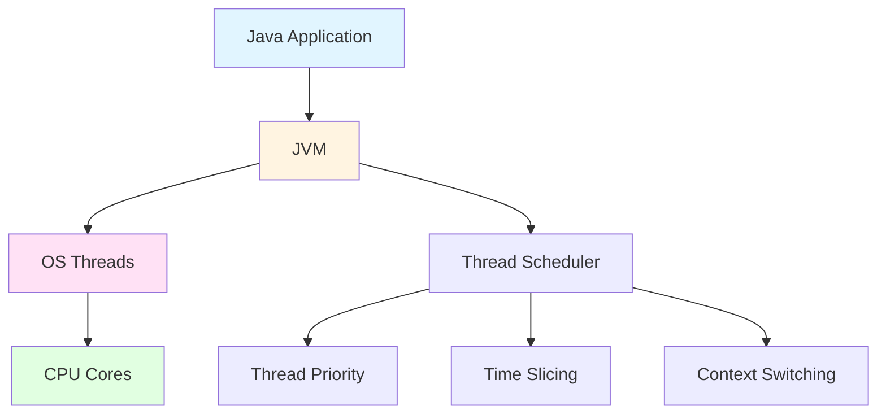
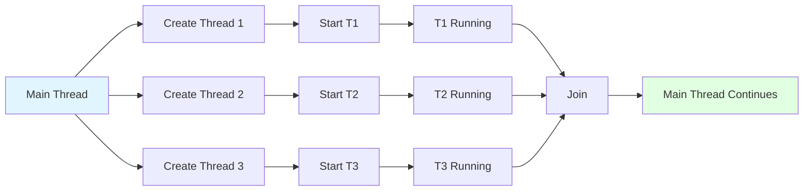
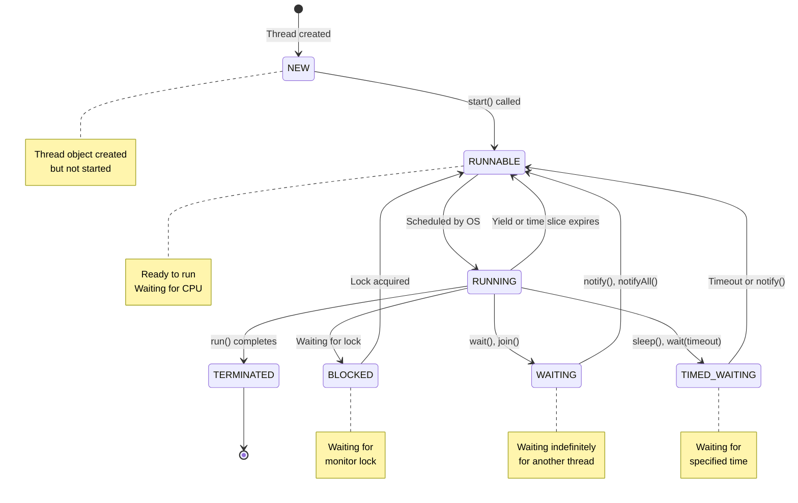
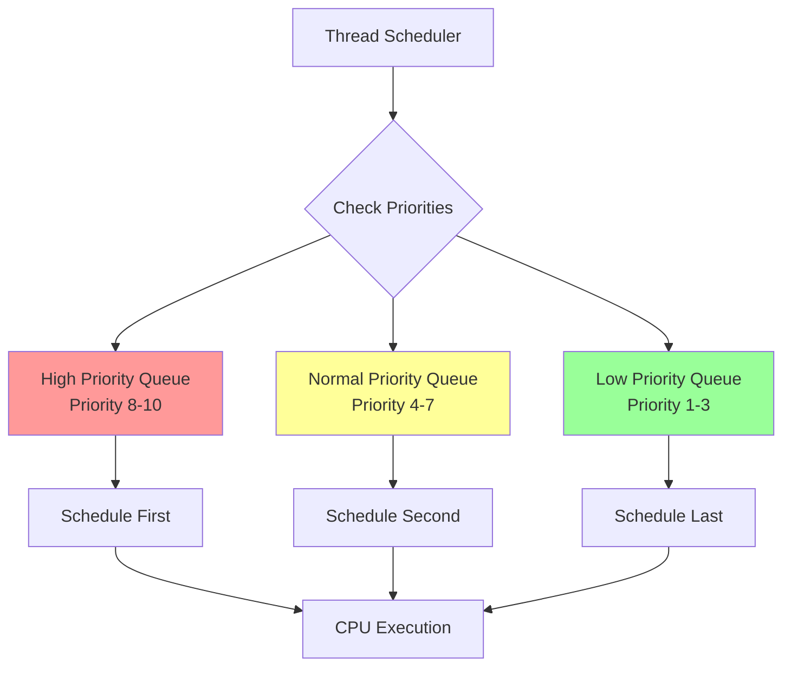
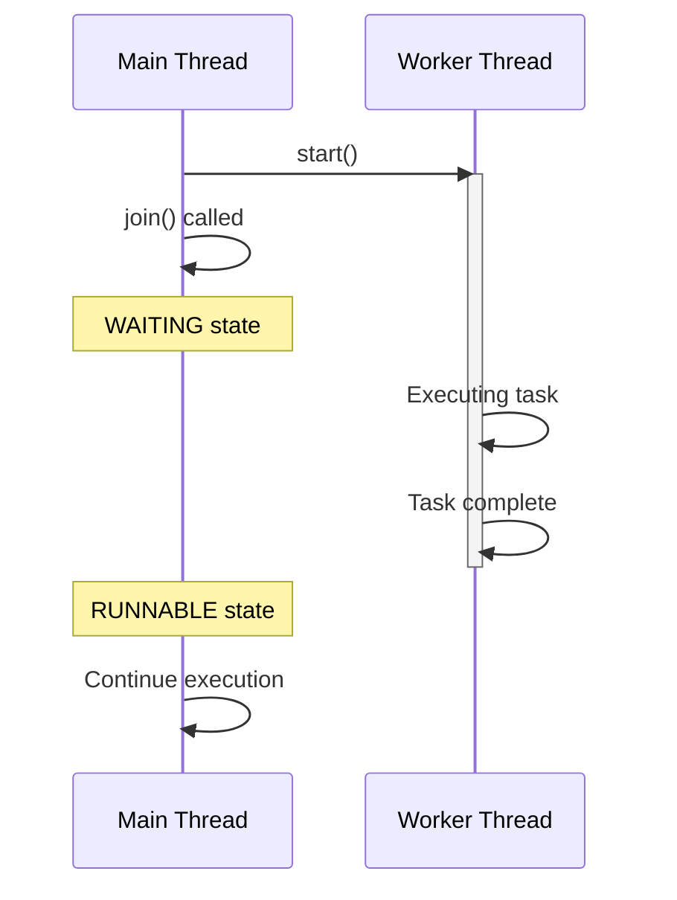
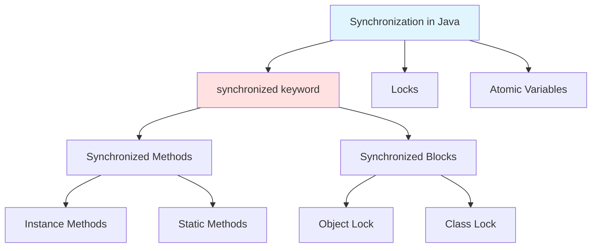

# 🧵 Java Multithreading Prerequisites & Basics
## The Complete Revision Guide

> **"Understanding threads is fundamental to writing modern Java applications"**
>
> This comprehensive guide covers everything you need to know about Java multithreading basics - from creating your first thread to understanding synchronization and thread interaction.

---

## 📑 Table of Contents

1. [Introduction to Threads & Multithreading](#1-introduction-to-threads--multithreading)
2. [Creating Threads in Java](#2-creating-threads-in-java)
3. [Thread Class Constructors](#3-thread-class-constructors)
4. [Working with Multiple Threads](#4-working-with-multiple-threads)
5. [Getting Current Thread Reference](#5-getting-current-thread-reference)
6. [Thread States & Lifecycle](#6-thread-states--lifecycle)
7. [Thread Priorities](#7-thread-priorities)
8. [Controlling Thread Execution](#8-controlling-thread-execution)
9. [Thread Synchronization](#9-thread-synchronization)
10. [Static Method Synchronization](#10-static-method-synchronization)
11. [Resource Synchronization](#11-resource-synchronization)
12. [Thread Interaction](#12-thread-interaction)
13. [Best Practices & Common Pitfalls](#13-best-practices--common-pitfalls)

---

## 1. Introduction to Threads & Multithreading

### 🎯 What is a Thread?

A **thread** is the smallest unit of execution within a process. Think of it as a lightweight subprocess that can run concurrently with other threads.

```
┌─────────────────────────────────────┐
│          PROCESS (JVM)              │
│  ┌───────────────────────────────┐  │
│  │     Main Thread               │  │
│  │  ┌─────────────────────────┐  │  │
│  │  │   Thread-1              │  │  │
│  │  └─────────────────────────┘  │  │
│  │  ┌─────────────────────────┐  │  │
│  │  │   Thread-2              │  │  │
│  │  └─────────────────────────┘  │  │
│  │  ┌─────────────────────────┐  │  │
│  │  │   Thread-3              │  │  │
│  │  └─────────────────────────┘  │  │
│  └───────────────────────────────┘  │
│                                     │
│      Shared Memory Space            │
└─────────────────────────────────────┘
```

### 🔄 Process vs Thread

| Aspect | Process | Thread |
|--------|---------|--------|
| **Definition** | Independent program in execution | Lightweight subprocess within a process |
| **Memory** | Separate memory space | Shared memory space |
| **Communication** | IPC (Inter-Process Communication) | Direct shared memory access |
| **Creation Cost** | Heavy (more resources) | Light (fewer resources) |
| **Context Switch** | Expensive | Cheap |
| **Independence** | Fully independent | Dependent on parent process |

### 🎪 What is Multithreading?

**Multithreading** is the ability of a program to execute multiple threads concurrently within a single process.

**Benefits:**
- ✅ Better CPU utilization
- ✅ Improved responsiveness
- ✅ Resource sharing
- ✅ Simplified program structure for concurrent tasks
- ✅ Parallel execution on multi-core systems

**Real-World Examples:**
```java
// Web Server: Each request handled by a thread
Thread thread1 = new Thread(() -> handleRequest1());
Thread thread2 = new Thread(() -> handleRequest2());

// GUI Application: UI thread + background worker threads
Thread uiThread = new Thread(() -> updateUI());
Thread workerThread = new Thread(() -> performHeavyComputation());

// Database Connection Pool: Multiple connections managed by threads
for (int i = 0; i < POOL_SIZE; i++) {
    new Thread(() -> handleDatabaseConnection()).start();
}
```

### 🧠 Java Threading Model



---

## 2. Creating Threads in Java

There are **two primary ways** to create threads in Java:

### Method 1: Extending Thread Class

```java
class MyThread extends Thread {
    @Override
    public void run() {
        System.out.println("Thread is running: " + Thread.currentThread().getName());
    }
}

// Usage
MyThread thread = new MyThread();
thread.start();
```

### Method 2: Implementing Runnable Interface ⭐ (Preferred)

```java
class MyRunnable implements Runnable {
    @Override
    public void run() {
        System.out.println("Thread is running: " + Thread.currentThread().getName());
    }
}

// Usage
Thread thread = new Thread(new MyRunnable());
thread.start();
```

### 📊 Comparison: Thread vs Runnable

| Aspect | Extending Thread | Implementing Runnable |
|--------|------------------|----------------------|
| **Inheritance** | Cannot extend another class | Can extend another class |
| **Reusability** | Less reusable | More reusable |
| **Separation of Concerns** | Mixes task and threading | Separates task from threading |
| **Multiple Threads** | Each needs new subclass instance | Same Runnable for multiple threads |
| **Best Practice** | ❌ Not recommended | ✅ Recommended |

### 🎯 Modern Approaches (Java 8+)

```java
// Lambda Expression
Thread thread1 = new Thread(() -> {
    System.out.println("Lambda thread running");
});

// Method Reference
Thread thread2 = new Thread(MyClass::myStaticMethod);

// Anonymous Class
Thread thread3 = new Thread(new Runnable() {
    @Override
    public void run() {
        System.out.println("Anonymous class thread");
    }
});
```

### 📝 Complete Example

```java
public class ThreadCreationDemo {
    
    // Method 1: Extending Thread
    static class MyThread extends Thread {
        private String taskName;
        
        public MyThread(String taskName) {
            this.taskName = taskName;
        }
        
        @Override
        public void run() {
            for (int i = 1; i <= 5; i++) {
                System.out.println(taskName + " - Count: " + i);
                try {
                    Thread.sleep(500);
                } catch (InterruptedException e) {
                    e.printStackTrace();
                }
            }
        }
    }
    
    // Method 2: Implementing Runnable
    static class MyRunnable implements Runnable {
        private String taskName;
        
        public MyRunnable(String taskName) {
            this.taskName = taskName;
        }
        
        @Override
        public void run() {
            for (int i = 1; i <= 5; i++) {
                System.out.println(taskName + " - Count: " + i);
                try {
                    Thread.sleep(500);
                } catch (InterruptedException e) {
                    e.printStackTrace();
                }
            }
        }
    }
    
    public static void main(String[] args) {
        // Create threads using both methods
        Thread thread1 = new MyThread("Task-1");
        Thread thread2 = new Thread(new MyRunnable("Task-2"));
        Thread thread3 = new Thread(() -> {
            for (int i = 1; i <= 5; i++) {
                System.out.println("Lambda-Task - Count: " + i);
                try {
                    Thread.sleep(500);
                } catch (InterruptedException e) {
                    e.printStackTrace();
                }
            }
        });
        
        // Start all threads
        thread1.start();
        thread2.start();
        thread3.start();
    }
}
```

### ⚠️ Common Pitfall: start() vs run()

```java
Thread thread = new Thread(() -> System.out.println("Hello"));

// ✅ CORRECT: Creates new thread
thread.start();

// ❌ WRONG: Executes in current thread (no concurrency!)
thread.run();
```

**Visualization:**
```
start() method:
  Main Thread                New Thread
      |                          |
      |---creates--------------->|
      |                          |
      |                     run() executes
      |                          |
  continues                      |
      |                          |

run() method:
  Main Thread
      |
  run() executes
      |
  (no new thread created!)
```

---

## 3. Thread Class Constructors

The `Thread` class provides multiple constructors for different use cases:

### 📋 Available Constructors

```java
// 1. Default constructor
Thread()

// 2. Constructor with Runnable
Thread(Runnable target)

// 3. Constructor with Runnable and name
Thread(Runnable target, String name)

// 4. Constructor with name only
Thread(String name)

// 5. Constructor with ThreadGroup and Runnable
Thread(ThreadGroup group, Runnable target)

// 6. Constructor with ThreadGroup, Runnable, and name
Thread(ThreadGroup group, Runnable target, String name)

// 7. Constructor with ThreadGroup and name
Thread(ThreadGroup group, String name)

// 8. Constructor with everything (including stack size)
Thread(ThreadGroup group, Runnable target, String name, long stackSize)
```

### 🎯 Practical Examples

```java
public class ThreadConstructorDemo {
    
    public static void main(String[] args) {
        // 1. Default constructor
        Thread thread1 = new Thread();
        System.out.println("Thread1 name: " + thread1.getName()); // Output: Thread-0
        
        // 2. With Runnable
        Runnable task = () -> System.out.println("Executing task");
        Thread thread2 = new Thread(task);
        
        // 3. With Runnable and name
        Thread thread3 = new Thread(task, "MyCustomThread");
        System.out.println("Thread3 name: " + thread3.getName()); // Output: MyCustomThread
        
        // 4. With name only
        Thread thread4 = new Thread("NamedThread") {
            @Override
            public void run() {
                System.out.println("Running: " + getName());
            }
        };
        
        // 5. With ThreadGroup
        ThreadGroup group = new ThreadGroup("MyGroup");
        Thread thread5 = new Thread(group, task, "GroupedThread");
        System.out.println("Thread5 group: " + thread5.getThreadGroup().getName());
        
        // 6. With stack size (advanced)
        // Specify custom stack size (in bytes)
        Thread thread6 = new Thread(null, task, "LargeStackThread", 1024 * 1024);
    }
}
```

### 📊 Constructor Parameters Explained

| Parameter | Type | Purpose | Example |
|-----------|------|---------|---------|
| `target` | Runnable | Task to execute | `() -> System.out.println("Hi")` |
| `name` | String | Thread name | `"WorkerThread-1"` |
| `group` | ThreadGroup | Logical grouping | `new ThreadGroup("Workers")` |
| `stackSize` | long | Stack size in bytes | `1024 * 1024` (1MB) |

### 🎪 Thread Naming Best Practices

```java
// ✅ GOOD: Descriptive names
Thread dbThread = new Thread(task, "DatabaseConnection-1");
Thread uiThread = new Thread(task, "UIUpdater");
Thread workerThread = new Thread(task, "BackgroundWorker-" + id);

// ❌ BAD: Generic or no names
Thread thread = new Thread(task);  // Uses default: Thread-0, Thread-1, etc.
Thread t = new Thread(task, "t");  // Not descriptive
```

**Benefits of naming threads:**
- 🐛 Easier debugging
- 📊 Better logging
- 🔍 Clearer stack traces
- 📈 Performance profiling

### 💡 ThreadGroup Example

```java
public class ThreadGroupDemo {
    public static void main(String[] args) {
        ThreadGroup parentGroup = new ThreadGroup("ParentGroup");
        ThreadGroup childGroup = new ThreadGroup(parentGroup, "ChildGroup");
        
        Thread t1 = new Thread(parentGroup, () -> {
            System.out.println("Thread in parent group");
        }, "Parent-Thread-1");
        
        Thread t2 = new Thread(childGroup, () -> {
            System.out.println("Thread in child group");
        }, "Child-Thread-1");
        
        t1.start();
        t2.start();
        
        // Group operations
        System.out.println("Active threads in parent: " + parentGroup.activeCount());
        System.out.println("Active groups in parent: " + parentGroup.activeGroupCount());
        
        // List all threads in group
        parentGroup.list();
    }
}
```

---

## 4. Working with Multiple Threads

### 🎯 Creating and Managing Multiple Threads

```java
public class MultipleThreadsDemo {
    
    public static void main(String[] args) {
        // Approach 1: Individual threads
        Thread t1 = new Thread(() -> printNumbers("Thread-1"), "Thread-1");
        Thread t2 = new Thread(() -> printNumbers("Thread-2"), "Thread-2");
        Thread t3 = new Thread(() -> printNumbers("Thread-3"), "Thread-3");
        
        t1.start();
        t2.start();
        t3.start();
        
        // Approach 2: Array of threads
        Thread[] threads = new Thread[5];
        for (int i = 0; i < threads.length; i++) {
            final int threadId = i;
            threads[i] = new Thread(() -> {
                System.out.println("Thread-" + threadId + " executing");
            }, "Worker-" + i);
            threads[i].start();
        }
        
        // Approach 3: List of threads
        List<Thread> threadList = new ArrayList<>();
        for (int i = 0; i < 10; i++) {
            Thread t = new Thread(new Task(i));
            threadList.add(t);
            t.start();
        }
        
        // Wait for all threads to complete
        for (Thread t : threadList) {
            try {
                t.join();
            } catch (InterruptedException e) {
                e.printStackTrace();
            }
        }
        
        System.out.println("All threads completed!");
    }
    
    static void printNumbers(String threadName) {
        for (int i = 1; i <= 5; i++) {
            System.out.println(threadName + ": " + i);
            try {
                Thread.sleep(100);
            } catch (InterruptedException e) {
                e.printStackTrace();
            }
        }
    }
    
    static class Task implements Runnable {
        private int taskId;
        
        public Task(int taskId) {
            this.taskId = taskId;
        }
        
        @Override
        public void run() {
            System.out.println("Task " + taskId + " started by " + 
                             Thread.currentThread().getName());
            // Perform task
            try {
                Thread.sleep(1000);
            } catch (InterruptedException e) {
                e.printStackTrace();
            }
            System.out.println("Task " + taskId + " completed");
        }
    }
}
```

### 📊 Thread Coordination Patterns



### 🎪 Producer-Consumer with Multiple Threads

```java
public class ProducerConsumerDemo {
    private static final int BUFFER_SIZE = 10;
    private static Queue<Integer> buffer = new LinkedList<>();
    private static final Object lock = new Object();
    
    static class Producer implements Runnable {
        private int producerId;
        
        public Producer(int id) {
            this.producerId = id;
        }
        
        @Override
        public void run() {
            int value = 0;
            while (true) {
                synchronized (lock) {
                    while (buffer.size() == BUFFER_SIZE) {
                        try {
                            lock.wait();
                        } catch (InterruptedException e) {
                            e.printStackTrace();
                        }
                    }
                    
                    System.out.println("Producer-" + producerId + 
                                     " produced: " + value);
                    buffer.add(value++);
                    lock.notifyAll();
                }
                
                try {
                    Thread.sleep(100);
                } catch (InterruptedException e) {
                    e.printStackTrace();
                }
            }
        }
    }
    
    static class Consumer implements Runnable {
        private int consumerId;
        
        public Consumer(int id) {
            this.consumerId = id;
        }
        
        @Override
        public void run() {
            while (true) {
                synchronized (lock) {
                    while (buffer.isEmpty()) {
                        try {
                            lock.wait();
                        } catch (InterruptedException e) {
                            e.printStackTrace();
                        }
                    }
                    
                    int value = buffer.poll();
                    System.out.println("Consumer-" + consumerId + 
                                     " consumed: " + value);
                    lock.notifyAll();
                }
                
                try {
                    Thread.sleep(150);
                } catch (InterruptedException e) {
                    e.printStackTrace();
                }
            }
        }
    }
    
    public static void main(String[] args) {
        // Create multiple producers
        for (int i = 1; i <= 2; i++) {
            Thread producer = new Thread(new Producer(i));
            producer.setDaemon(true);
            producer.start();
        }
        
        // Create multiple consumers
        for (int i = 1; i <= 3; i++) {
            Thread consumer = new Thread(new Consumer(i));
            consumer.setDaemon(true);
            consumer.start();
        }
        
        try {
            Thread.sleep(5000);
        } catch (InterruptedException e) {
            e.printStackTrace();
        }
    }
}
```

### 🎯 Thread Pool Pattern (Preview)

```java
import java.util.concurrent.*;

public class ThreadPoolDemo {
    public static void main(String[] args) {
        // Create a fixed thread pool
        ExecutorService executor = Executors.newFixedThreadPool(5);
        
        // Submit 10 tasks
        for (int i = 1; i <= 10; i++) {
            final int taskId = i;
            executor.submit(() -> {
                System.out.println("Task " + taskId + " executed by " + 
                                 Thread.currentThread().getName());
                try {
                    Thread.sleep(1000);
                } catch (InterruptedException e) {
                    e.printStackTrace();
                }
            });
        }
        
        executor.shutdown();
    }
}
```

---

## 5. Getting Current Thread Reference

### 🎯 Thread.currentThread() Method

The `Thread.currentThread()` static method returns a reference to the currently executing thread object.

```java
public class CurrentThreadDemo {
    
    public static void main(String[] args) {
        // Get reference to main thread
        Thread mainThread = Thread.currentThread();
        
        System.out.println("Current thread: " + mainThread.getName());
        System.out.println("Thread ID: " + mainThread.getId());
        System.out.println("Priority: " + mainThread.getPriority());
        System.out.println("State: " + mainThread.getState());
        System.out.println("Is Alive: " + mainThread.isAlive());
        System.out.println("Is Daemon: " + mainThread.isDaemon());
        
        // Change main thread name
        mainThread.setName("MyMainThread");
        System.out.println("New name: " + Thread.currentThread().getName());
        
        // Create and start new threads
        Thread t1 = new Thread(() -> {
            Thread current = Thread.currentThread();
            System.out.println("\nInside thread: " + current.getName());
            System.out.println("Thread ID: " + current.getId());
            System.out.println("Priority: " + current.getPriority());
        }, "CustomThread-1");
        
        t1.start();
    }
}
```

### 📊 Thread Information Methods

| Method | Return Type | Description |
|--------|-------------|-------------|
| `getName()` | String | Thread name |
| `getId()` | long | Unique thread ID |
| `getPriority()` | int | Thread priority (1-10) |
| `getState()` | Thread.State | Current state |
| `isAlive()` | boolean | Is thread alive? |
| `isDaemon()` | boolean | Is daemon thread? |
| `getThreadGroup()` | ThreadGroup | Thread's group |
| `getStackTrace()` | StackTraceElement[] | Current stack trace |

### 💡 Practical Use Cases

```java
public class ThreadInfoUseCases {
    
    // Use Case 1: Logging with thread information
    public static void log(String message) {
        Thread current = Thread.currentThread();
        System.out.println("[" + current.getName() + "] " + message);
    }
    
    // Use Case 2: Thread-local behavior
    public static void performAction() {
        Thread current = Thread.currentThread();
        if (current.getName().startsWith("Worker")) {
            // Worker thread logic
            System.out.println("Worker thread performing action");
        } else {
            // Main thread logic
            System.out.println("Main thread performing action");
        }
    }
    
    // Use Case 3: Debugging
    public static void printStackTrace() {
        Thread current = Thread.currentThread();
        System.out.println("Stack trace for: " + current.getName());
        for (StackTraceElement element : current.getStackTrace()) {
            System.out.println("  at " + element);
        }
    }
    
    // Use Case 4: Thread identification
    public static void identifyThread() {
        Thread current = Thread.currentThread();
        System.out.println("Thread Details:");
        System.out.println("  Name: " + current.getName());
        System.out.println("  ID: " + current.getId());
        System.out.println("  Priority: " + current.getPriority());
        System.out.println("  Group: " + current.getThreadGroup().getName());
        System.out.println("  Is Daemon: " + current.isDaemon());
    }
    
    public static void main(String[] args) {
        log("Application started");
        
        Thread worker = new Thread(() -> {
            log("Worker started");
            performAction();
            identifyThread();
            printStackTrace();
        }, "Worker-1");
        
        worker.start();
        
        try {
            Thread.sleep(100);
        } catch (InterruptedException e) {
            e.printStackTrace();
        }
        
        performAction();
        identifyThread();
    }
}
```

### 🎯 ThreadLocal with currentThread()

```java
public class ThreadLocalDemo {
    
    // ThreadLocal variable
    private static ThreadLocal<String> threadLocal = ThreadLocal.withInitial(() -> 
        "Default-" + Thread.currentThread().getName()
    );
    
    static class Task implements Runnable {
        private String value;
        
        public Task(String value) {
            this.value = value;
        }
        
        @Override
        public void run() {
            // Set thread-local value
            threadLocal.set(value);
            
            Thread current = Thread.currentThread();
            System.out.println(current.getName() + " set value: " + value);
            
            // Simulate work
            try {
                Thread.sleep(1000);
            } catch (InterruptedException e) {
                e.printStackTrace();
            }
            
            // Get thread-local value
            System.out.println(current.getName() + " got value: " + threadLocal.get());
        }
    }
    
    public static void main(String[] args) {
        Thread t1 = new Thread(new Task("Value-1"), "Thread-1");
        Thread t2 = new Thread(new Task("Value-2"), "Thread-2");
        Thread t3 = new Thread(new Task("Value-3"), "Thread-3");
        
        t1.start();
        t2.start();
        t3.start();
    }
}
```

---

## 6. Thread States & Lifecycle

### 🔄 Thread Lifecycle Diagram



### 📋 Thread States in Java

Java defines six thread states in the `Thread.State` enum:

```java
public enum State {
    NEW,
    RUNNABLE,
    BLOCKED,
    WAITING,
    TIMED_WAITING,
    TERMINATED
}
```

### 📊 State Descriptions

| State | Description | How to Enter | How to Exit |
|-------|-------------|--------------|-------------|
| **NEW** | Thread created but not started | `new Thread()` | `thread.start()` |
| **RUNNABLE** | Executing in JVM | `start()` called | Various transitions |
| **BLOCKED** | Waiting for monitor lock | Trying to enter synchronized block | Lock acquired |
| **WAITING** | Waiting indefinitely | `wait()`, `join()`, `LockSupport.park()` | `notify()`, `notifyAll()`, `interrupt()` |
| **TIMED_WAITING** | Waiting for specified time | `sleep()`, `wait(timeout)`, `join(timeout)` | Timeout or early notification |
| **TERMINATED** | Execution completed | `run()` completes or exception | Cannot transition from here |

### 💻 State Transition Code Examples

```java
public class ThreadStateDemo {
    
    public static void main(String[] args) throws InterruptedException {
        Thread thread = new Thread(() -> {
            System.out.println("Thread started");
            
            // TIMED_WAITING state
            try {
                Thread.sleep(2000);
            } catch (InterruptedException e) {
                e.printStackTrace();
            }
            
            // Synchronized block - may cause BLOCKED state for other threads
            synchronized (ThreadStateDemo.class) {
                System.out.println("In synchronized block");
            }
            
            System.out.println("Thread finishing");
        });
        
        // NEW state
        System.out.println("State after creation: " + thread.getState());
        
        // Start thread - moves to RUNNABLE
        thread.start();
        System.out.println("State after start(): " + thread.getState());
        
        // Give thread time to start
        Thread.sleep(100);
        System.out.println("State while sleeping: " + thread.getState());
        
        // Wait for thread to complete
        thread.join();
        
        // TERMINATED state
        System.out.println("State after completion: " + thread.getState());
    }
}
```

### 🎯 Comprehensive State Demonstration

```java
public class CompleteStateDemo {
    
    private static final Object lock = new Object();
    
    public static void main(String[] args) throws InterruptedException {
        
        // Demonstrate NEW state
        Thread newThread = new Thread(() -> {});
        System.out.println("NEW: " + newThread.getState());
        
        // Demonstrate RUNNABLE state
        Thread runnableThread = new Thread(() -> {
            while (true) {
                // Busy loop
                if (Thread.currentThread().isInterrupted()) {
                    break;
                }
            }
        });
        runnableThread.start();
        Thread.sleep(100);
        System.out.println("RUNNABLE: " + runnableThread.getState());
        runnableThread.interrupt();
        
        // Demonstrate TIMED_WAITING state
        Thread timedWaitingThread = new Thread(() -> {
            try {
                Thread.sleep(10000);
            } catch (InterruptedException e) {
                e.printStackTrace();
            }
        });
        timedWaitingThread.start();
        Thread.sleep(100);
        System.out.println("TIMED_WAITING: " + timedWaitingThread.getState());
        timedWaitingThread.interrupt();
        
        // Demonstrate WAITING state
        Thread waitingThread = new Thread(() -> {
            synchronized (lock) {
                try {
                    lock.wait();
                } catch (InterruptedException e) {
                    e.printStackTrace();
                }
            }
        });
        waitingThread.start();
        Thread.sleep(100);
        System.out.println("WAITING: " + waitingThread.getState());
        
        // Notify waiting thread
        synchronized (lock) {
            lock.notify();
        }
        waitingThread.join();
        
        // Demonstrate BLOCKED state
        Thread blockedThread1 = new Thread(() -> {
            synchronized (lock) {
                try {
                    Thread.sleep(2000);
                } catch (InterruptedException e) {
                    e.printStackTrace();
                }
            }
        });
        
        Thread blockedThread2 = new Thread(() -> {
            synchronized (lock) {
                System.out.println("Got lock");
            }
        });
        
        blockedThread1.start();
        Thread.sleep(100);
        blockedThread2.start();
        Thread.sleep(100);
        System.out.println("BLOCKED: " + blockedThread2.getState());
        
        blockedThread1.join();
        blockedThread2.join();
        
        // Demonstrate TERMINATED state
        Thread terminatedThread = new Thread(() -> {
            System.out.println("Running briefly");
        });
        terminatedThread.start();
        terminatedThread.join();
        System.out.println("TERMINATED: " + terminatedThread.getState());
    }
}
```

### 🎪 Real-World State Transitions

```
Timeline of a Web Request Handler Thread:

Time 0ms:    NEW          → Thread object created
Time 1ms:    RUNNABLE     → start() called, waiting for CPU
Time 5ms:    RUNNING      → Scheduled by OS, executing
Time 10ms:   TIMED_WAITING → sleep(100) while waiting for DB
Time 110ms:  RUNNABLE     → Woke up, ready to continue
Time 115ms:  RUNNING      → Processing data
Time 120ms:  BLOCKED      → Trying to enter synchronized block
Time 125ms:  RUNNABLE     → Got lock, ready to run
Time 130ms:  RUNNING      → Processing in sync block
Time 140ms:  WAITING      → wait() for response
Time 200ms:  RUNNABLE     → notify() received
Time 205ms:  RUNNING      → Final processing
Time 210ms:  TERMINATED   → run() completed
```

---

## 7. Thread Priorities

### 🎯 Understanding Thread Priorities

Thread priorities are **hints** to the thread scheduler about which threads should be given preference for execution. However, they are not guarantees.

### 📊 Priority Constants

```java
public class Thread {
    public static final int MIN_PRIORITY = 1;
    public static final int NORM_PRIORITY = 5;  // Default
    public static final int MAX_PRIORITY = 10;
}
```

**Visual Representation:**
```
Priority Scale:
1    2    3    4    5    6    7    8    9    10
├────┼────┼────┼────┼────┼────┼────┼────┼────┤
MIN            NORM                          MAX

Lower Priority  <──────────────────>  Higher Priority
```

### 💻 Setting and Getting Priorities

```java
public class ThreadPriorityDemo {
    
    public static void main(String[] args) {
        Thread lowPriority = new Thread(() -> {
            for (int i = 0; i < 5; i++) {
                System.out.println("Low priority: " + i);
            }
        }, "LowPriorityThread");
        
        Thread normalPriority = new Thread(() -> {
            for (int i = 0; i < 5; i++) {
                System.out.println("Normal priority: " + i);
            }
        }, "NormalPriorityThread");
        
        Thread highPriority = new Thread(() -> {
            for (int i = 0; i < 5; i++) {
                System.out.println("High priority: " + i);
            }
        }, "HighPriorityThread");
        
        // Set priorities BEFORE starting
        lowPriority.setPriority(Thread.MIN_PRIORITY);      // 1
        normalPriority.setPriority(Thread.NORM_PRIORITY);  // 5 (default)
        highPriority.setPriority(Thread.MAX_PRIORITY);     // 10
        
        // Display priorities
        System.out.println("Low: " + lowPriority.getPriority());
        System.out.println("Normal: " + normalPriority.getPriority());
        System.out.println("High: " + highPriority.getPriority());
        
        // Start threads
        lowPriority.start();
        normalPriority.start();
        highPriority.start();
    }
}
```

### ⚠️ Important Facts About Thread Priorities

| Fact | Explanation |
|------|-------------|
| **Platform Dependent** | Behavior varies across OS and JVM |
| **Not Guaranteed** | Scheduler may ignore priorities |
| **Hints, Not Rules** | Used for scheduling optimization |
| **Inheritance** | Child threads inherit parent priority |
| **Range** | Must be between MIN_PRIORITY (1) and MAX_PRIORITY (10) |

### 🎪 Priority Inheritance Example

```java
public class PriorityInheritanceDemo {
    
    public static void main(String[] args) {
        // Main thread priority
        Thread main = Thread.currentThread();
        System.out.println("Main thread priority: " + main.getPriority());
        
        // Child inherits parent's priority
        Thread child1 = new Thread(() -> {
            Thread current = Thread.currentThread();
            System.out.println("Child1 priority (inherited): " + 
                             current.getPriority());
        });
        
        child1.start();
        
        // Change main thread priority
        main.setPriority(8);
        
        // New child inherits new priority
        Thread child2 = new Thread(() -> {
            Thread current = Thread.currentThread();
            System.out.println("Child2 priority (inherited): " + 
                             current.getPriority());
        });
        
        child2.start();
    }
}
```

### 📊 Priority Scheduling Visualization



### ⚠️ Common Pitfalls

```java
// ❌ WRONG: Setting priority after start
Thread thread = new Thread(() -> {});
thread.start();
thread.setPriority(Thread.MAX_PRIORITY);  // May not take effect!

// ✅ CORRECT: Set priority before start
Thread thread = new Thread(() -> {});
thread.setPriority(Thread.MAX_PRIORITY);
thread.start();

// ❌ WRONG: Relying on priorities for correctness
// Priorities are hints, not guarantees!
// Never use priorities for synchronization or correctness

// ✅ CORRECT: Use proper synchronization mechanisms
synchronized (lock) {
    // Critical section
}
```

### 💡 Best Practices

```java
public class PriorityBestPractices {
    
    // ✅ GOOD: Use priorities for optimization, not correctness
    public static void startBackgroundTask() {
        Thread bgThread = new Thread(() -> {
            // Non-critical background work
        });
        bgThread.setPriority(Thread.MIN_PRIORITY);
        bgThread.start();
    }
    
    // ✅ GOOD: Use priorities for UI responsiveness
    public static void startUIThread() {
        Thread uiThread = new Thread(() -> {
            // UI updates
        });
        uiThread.setPriority(Thread.MAX_PRIORITY);
        uiThread.start();
    }
    
    // ✅ GOOD: Document priority usage
    /**
     * Starts a low-priority background cleanup task.
     * Priority set to MIN_PRIORITY to avoid interfering with user-facing tasks.
     */
    public static void startCleanupTask() {
        Thread cleanup = new Thread(() -> {
            // Cleanup logic
        });
        cleanup.setPriority(Thread.MIN_PRIORITY);
        cleanup.start();
    }
}
```

---

## 8. Controlling Thread Execution

### 🎯 Thread Control Methods

Java provides several methods to control thread execution:

### 1️⃣ sleep() Method

**Purpose:** Pauses current thread for specified time.

```java
public class SleepDemo {
    
    public static void main(String[] args) {
        System.out.println("Starting at: " + System.currentTimeMillis());
        
        try {
            // Sleep for 2 seconds
            Thread.sleep(2000);
        } catch (InterruptedException e) {
            e.printStackTrace();
        }
        
        System.out.println("Ending at: " + System.currentTimeMillis());
        
        // Sleep in thread
        Thread thread = new Thread(() -> {
            for (int i = 1; i <= 5; i++) {
                System.out.println("Count: " + i);
                try {
                    Thread.sleep(1000);  // Sleep 1 second
                } catch (InterruptedException e) {
                    System.out.println("Thread interrupted!");
                    return;
                }
            }
        });
        
        thread.start();
    }
}
```

**Key Points:**
- ✅ Does NOT release locks
- ✅ Thread moves to TIMED_WAITING state
- ✅ Can be interrupted
- ✅ Static method - affects current thread

```
Thread Timeline with sleep():

Thread A:  ──────●sleep(1000)●────────────●sleep(500)●──────
           Running    TIMED_WAITING   Running   TIMED_WAITING

● = sleep() call
```

### 2️⃣ yield() Method

**Purpose:** Hints to scheduler that current thread is willing to yield its current use of CPU.

```java
public class YieldDemo {
    
    public static void main(String[] args) {
        Thread thread1 = new Thread(() -> {
            for (int i = 0; i < 5; i++) {
                System.out.println("Thread-1: " + i);
                Thread.yield();  // Yield to other threads
            }
        }, "Thread-1");
        
        Thread thread2 = new Thread(() -> {
            for (int i = 0; i < 5; i++) {
                System.out.println("Thread-2: " + i);
                Thread.yield();  // Yield to other threads
            }
        }, "Thread-2");
        
        thread1.start();
        thread2.start();
    }
}
```

**Key Points:**
- ✅ Hint to scheduler, not guarantee
- ✅ Thread stays in RUNNABLE state
- ✅ Static method
- ✅ Rarely needed in practice

### 3️⃣ join() Method

**Purpose:** Wait for a thread to complete before continuing.

```java
public class JoinDemo {
    
    public static void main(String[] args) {
        Thread worker = new Thread(() -> {
            System.out.println("Worker started");
            try {
                Thread.sleep(2000);
            } catch (InterruptedException e) {
                e.printStackTrace();
            }
            System.out.println("Worker completed");
        });
        
        worker.start();
        
        System.out.println("Main waiting for worker...");
        
        try {
            worker.join();  // Wait for worker to complete
        } catch (InterruptedException e) {
            e.printStackTrace();
        }
        
        System.out.println("Main continues after worker completion");
    }
}
```

**join() Variants:**

```java
// Wait indefinitely
thread.join();

// Wait for maximum 2 seconds
thread.join(2000);

// Wait for 2 seconds and 500 nanoseconds
thread.join(2000, 500);
```

### 📊 join() Visualization



### 4️⃣ Combining Control Methods

```java
public class CombinedControlDemo {
    
    public static void main(String[] args) {
        Thread[] workers = new Thread[3];
        
        // Create worker threads
        for (int i = 0; i < workers.length; i++) {
            final int id = i;
            workers[i] = new Thread(() -> {
                System.out.println("Worker-" + id + " started");
                
                for (int j = 0; j < 3; j++) {
                    System.out.println("Worker-" + id + " - iteration " + j);
                    
                    try {
                        Thread.sleep(500);  // Simulate work
                    } catch (InterruptedException e) {
                        e.printStackTrace();
                    }
                    
                    Thread.yield();  // Give others a chance
                }
                
                System.out.println("Worker-" + id + " completed");
            }, "Worker-" + i);
        }
        
        // Start all workers
        for (Thread worker : workers) {
            worker.start();
        }
        
        // Wait for all to complete
        for (Thread worker : workers) {
            try {
                worker.join();
            } catch (InterruptedException e) {
                e.printStackTrace();
            }
        }
        
        System.out.println("All workers completed!");
    }
}
```

### 📊 Method Comparison

| Method | Releases Lock? | State Change | Can Be Interrupted? | Scope |
|--------|----------------|--------------|---------------------|-------|
| `sleep()` | ❌ No | TIMED_WAITING | ✅ Yes | Static (current thread) |
| `yield()` | N/A | Stays RUNNABLE | ❌ No | Static (current thread) |
| `join()` | ✅ Yes | WAITING/TIMED_WAITING | ✅ Yes | Instance method |
| `wait()` | ✅ Yes | WAITING/TIMED_WAITING | ✅ Yes | Instance method (Object) |

### 🎪 Practical Example: Download Manager

```java
public class DownloadManager {
    
    static class DownloadTask implements Runnable {
        private String fileName;
        private int duration;
        
        public DownloadTask(String fileName, int duration) {
            this.fileName = fileName;
            this.duration = duration;
        }
        
        @Override
        public void run() {
            System.out.println("Downloading: " + fileName);
            
            for (int i = 0; i <= 100; i += 20) {
                System.out.println(fileName + ": " + i + "% complete");
                try {
                    Thread.sleep(duration / 5);
                } catch (InterruptedException e) {
                    System.out.println(fileName + " download interrupted!");
                    return;
                }
            }
            
            System.out.println(fileName + " downloaded successfully!");
        }
    }
    
    public static void main(String[] args) {
        Thread download1 = new Thread(new DownloadTask("File1.zip", 2000));
        Thread download2 = new Thread(new DownloadTask("File2.zip", 3000));
        Thread download3 = new Thread(new DownloadTask("File3.zip", 1500));
        
        // Start all downloads
        System.out.println("Starting downloads...");
        download1.start();
        download2.start();
        download3.start();
        
        // Wait for all to complete
        try {
            download1.join();
            download2.join();
            download3.join();
        } catch (InterruptedException e) {
            e.printStackTrace();
        }
        
        System.out.println("All downloads completed!");
    }
}
```

---

## 9. Thread Synchronization

### 🎯 The Problem: Race Conditions

When multiple threads access shared data concurrently without proper synchronization, race conditions occur.

```java
// PROBLEM: Unsynchronized counter
public class UnsafeCounter {
    private int count = 0;
    
    public void increment() {
        count++;  // NOT atomic! (read, modify, write)
    }
    
    public int getCount() {
        return count;
    }
    
    public static void main(String[] args) throws InterruptedException {
        UnsafeCounter counter = new UnsafeCounter();
        
        Thread[] threads = new Thread[10];
        for (int i = 0; i < threads.length; i++) {
            threads[i] = new Thread(() -> {
                for (int j = 0; j < 1000; j++) {
                    counter.increment();
                }
            });
            threads[i].start();
        }
        
        for (Thread thread : threads) {
            thread.join();
        }
        
        // Expected: 10000, Actual: probably less!
        System.out.println("Count: " + counter.getCount());
    }
}
```

### 🔒 The Solution: synchronized Keyword

```java
// SOLUTION: Synchronized counter
public class SafeCounter {
    private int count = 0;
    
    // Synchronized method
    public synchronized void increment() {
        count++;
    }
    
    public synchronized int getCount() {
        return count;
    }
}
```

### 📊 Synchronization Mechanisms



### 1️⃣ Synchronized Instance Methods

```java
public class SynchronizedMethodDemo {
    private int count = 0;
    
    // Locks on 'this' object
    public synchronized void increment() {
        count++;
    }
    
    public synchronized void decrement() {
        count--;
    }
    
    public synchronized int getCount() {
        return count;
    }
}
```

**Equivalent synchronized block:**
```java
public void increment() {
    synchronized (this) {
        count++;
    }
}
```

### 2️⃣ Synchronized Blocks

```java
public class SynchronizedBlockDemo {
    private int count = 0;
    private final Object lock = new Object();
    
    public void increment() {
        // Only synchronize critical section
        synchronized (lock) {
            count++;
        }
    }
    
    public void doSomething() {
        // Non-critical code (unsynchronized)
        System.out.println("Doing work...");
        
        // Critical section (synchronized)
        synchronized (lock) {
            count++;
        }
        
        // More non-critical code
        System.out.println("More work...");
    }
}
```

### 3️⃣ Multiple Locks Pattern

```java
public class BankAccount {
    private double balance;
    private final Object balanceLock = new Object();
    
    private List<String> transactions = new ArrayList<>();
    private final Object transactionsLock = new Object();
    
    public void deposit(double amount) {
        synchronized (balanceLock) {
            balance += amount;
        }
        
        synchronized (transactionsLock) {
            transactions.add("Deposit: " + amount);
        }
    }
    
    public void withdraw(double amount) {
        synchronized (balanceLock) {
            balance -= amount;
        }
        
        synchronized (transactionsLock) {
            transactions.add("Withdrawal: " + amount);
        }
    }
    
    public double getBalance() {
        synchronized (balanceLock) {
            return balance;
        }
    }
}
```

### 📊 How synchronized Works

```
Before synchronized:
Thread-1   Thread-2   Thread-3
   |          |          |
   V          V          V
 count++    count++    count++
   |          |          |
 (Race condition - lost updates!)


After synchronized:
Thread-1       Thread-2       Thread-3
   |              |              |
   V              |              |
 [LOCK]           |              |
 count++          |              |
 [UNLOCK]         |              |
   |              V              |
   |           [LOCK]            |
   |           count++           |
   |           [UNLOCK]          |
   |              |              V
   |              |           [LOCK]
   |              |           count++
   |              |           [UNLOCK]
```

### 🎪 Real-World Example: Thread-Safe Bank

```java
public class ThreadSafeBank {
    
    static class Account {
        private double balance;
        private final String accountId;
        
        public Account(String accountId, double initialBalance) {
            this.accountId = accountId;
            this.balance = initialBalance;
        }
        
        public synchronized void deposit(double amount) {
            System.out.println(Thread.currentThread().getName() + 
                             " depositing " + amount);
            balance += amount;
            System.out.println(accountId + " balance: " + balance);
        }
        
        public synchronized boolean withdraw(double amount) {
            System.out.println(Thread.currentThread().getName() + 
                             " attempting withdrawal of " + amount);
            if (balance >= amount) {
                balance -= amount;
                System.out.println(accountId + " balance: " + balance);
                return true;
            }
            System.out.println(accountId + " insufficient funds");
            return false;
        }
        
        public synchronized double getBalance() {
            return balance;
        }
    }
    
    public static void main(String[] args) throws InterruptedException {
        Account account = new Account("ACC-001", 1000.0);
        
        // Multiple threads performing operations
        Thread[] threads = new Thread[10];
        
        for (int i = 0; i < 5; i++) {
            threads[i] = new Thread(() -> {
                account.deposit(100);
            }, "Depositor-" + i);
        }
        
        for (int i = 5; i < 10; i++) {
            threads[i] = new Thread(() -> {
                account.withdraw(150);
            }, "Withdrawer-" + i);
        }
        
        for (Thread thread : threads) {
            thread.start();
        }
        
        for (Thread thread : threads) {
            thread.join();
        }
        
        System.out.println("Final balance: " + account.getBalance());
    }
}
```

### ⚠️ Common Synchronization Pitfalls

```java
public class SynchronizationPitfalls {
    
    // ❌ WRONG: Synchronizing on non-final object
    private Object lock = new Object();
    
    public void badMethod() {
        synchronized (lock) {  // Lock reference can change!
            // Critical section
        }
    }
    
    // ✅ CORRECT: Synchronize on final object
    private final Object goodLock = new Object();
    
    public void goodMethod() {
        synchronized (goodLock) {
            // Critical section
        }
    }
    
    // ❌ WRONG: Synchronizing on String literal
    private String badLockString = "LOCK";
    
    public void badStringSync() {
        synchronized (badLockString) {  // Dangerous!
            // Critical section
        }
    }
    
    // ❌ WRONG: Over-synchronization
    public synchronized void oversynchronized() {
        // Lots of non-critical code
        for (int i = 0; i < 1000; i++) {
            System.out.println(i);
        }
        
        // Only this needs synchronization
        count++;
    }
    
    // ✅ CORRECT: Minimal synchronization
    public void minimalSync() {
        // Non-critical code
        for (int i = 0; i < 1000; i++) {
            System.out.println(i);
        }
        
        // Only synchronize critical section
        synchronized (this) {
            count++;
        }
    }
    
    private int count;
}
```

---

## 10. Static Method Synchronization

### 🎯 Class-Level Locking

Static synchronized methods lock on the **Class object**, not instance.

```java
public class StaticSynchronization {
    private static int sharedCounter = 0;
    
    // Locks on StaticSynchronization.class
    public static synchronized void incrementStatic() {
        sharedCounter++;
    }
    
    // Equivalent to:
    public static void incrementStaticEquivalent() {
        synchronized (StaticSynchronization.class) {
            sharedCounter++;
        }
    }
    
    // Instance method - locks on 'this'
    private int instanceCounter = 0;
    
    public synchronized void incrementInstance() {
        instanceCounter++;
    }
}
```

### 📊 Static vs Instance Synchronization

| Aspect | Instance Synchronized | Static Synchronized |
|--------|----------------------|---------------------|
| **Lock Object** | `this` (instance) | `ClassName.class` |
| **Scope** | Per instance | Per class (all instances) |
| **Concurrent Execution** | Different instances can execute concurrently | Only one thread across all instances |
| **Use Case** | Instance-specific state | Class-level shared state |

### 💻 Comprehensive Example

```java
public class SyncComparisonDemo {
    private static int staticCounter = 0;
    private int instanceCounter = 0;
    
    // Static synchronized - locks on class
    public static synchronized void incrementStatic() {
        staticCounter++;
        System.out.println(Thread.currentThread().getName() + 
                         " - Static counter: " + staticCounter);
    }
    
    // Instance synchronized - locks on this
    public synchronized void incrementInstance() {
        instanceCounter++;
        System.out.println(Thread.currentThread().getName() + 
                         " - Instance counter: " + instanceCounter);
    }
    
    public static void main(String[] args) throws InterruptedException {
        SyncComparisonDemo obj1 = new SyncComparisonDemo();
        SyncComparisonDemo obj2 = new SyncComparisonDemo();
        
        // Threads accessing static method
        Thread t1 = new Thread(() -> {
            for (int i = 0; i < 5; i++) {
                SyncComparisonDemo.incrementStatic();
            }
        }, "Static-Thread-1");
        
        Thread t2 = new Thread(() -> {
            for (int i = 0; i < 5; i++) {
                SyncComparisonDemo.incrementStatic();
            }
        }, "Static-Thread-2");
        
        // Threads accessing instance methods on different objects
        Thread t3 = new Thread(() -> {
            for (int i = 0; i < 5; i++) {
                obj1.incrementInstance();
            }
        }, "Instance-Thread-1");
        
        Thread t4 = new Thread(() -> {
            for (int i = 0; i < 5; i++) {
                obj2.incrementInstance();  // Different object!
            }
        }, "Instance-Thread-2");
        
        t1.start();
        t2.start();
        t3.start();
        t4.start();
        
        t1.join();
        t2.join();
        t3.join();
        t4.join();
        
        System.out.println("\nFinal static counter: " + staticCounter);
        System.out.println("Final instance counter obj1: " + obj1.instanceCounter);
        System.out.println("Final instance counter obj2: " + obj2.instanceCounter);
    }
}
```

### 🎪 Lock Visualization

```
Instance Lock (synchronized instance method):

Object1         Object2         Object3
[Lock-1]        [Lock-2]        [Lock-3]
   ↓               ↓               ↓
Thread-A        Thread-B        Thread-C
Can run         Can run         Can run
concurrently    concurrently    concurrently


Class Lock (static synchronized method):

       StaticSyncDemo.class
            [Lock]
              ↓
        Only 1 thread
        can execute at
        a time across
        ALL instances
              ↓
    Thread-A waiting ← Thread-B waiting
```

### 🎯 Singleton Pattern with Static Synchronization

```java
public class Singleton {
    private static Singleton instance;
    
    private Singleton() {
        // Private constructor
    }
    
    // Static synchronized method for thread-safe singleton
    public static synchronized Singleton getInstance() {
        if (instance == null) {
            instance = new Singleton();
        }
        return instance;
    }
    
    // Better approach: Double-checked locking
    private static volatile Singleton betterInstance;
    
    public static Singleton getBetterInstance() {
        if (betterInstance == null) {
            synchronized (Singleton.class) {
                if (betterInstance == null) {
                    betterInstance = new Singleton();
                }
            }
        }
        return betterInstance;
    }
}
```

---

## 11. Resource Synchronization

### 🎯 Synchronized Access to Shared Resources

When multiple threads access shared resources (files, databases, network connections), proper synchronization is critical.

### 1️⃣ Basic Resource Synchronization

```java
public class SharedResource {
    private final Object lock = new Object();
    private String data;
    
    public void writeData(String newData) {
        synchronized (lock) {
            System.out.println(Thread.currentThread().getName() + 
                             " writing: " + newData);
            data = newData;
            try {
                Thread.sleep(100);  // Simulate I/O
            } catch (InterruptedException e) {
                e.printStackTrace();
            }
        }
    }
    
    public String readData() {
        synchronized (lock) {
            System.out.println(Thread.currentThread().getName() + 
                             " reading: " + data);
            return data;
        }
    }
}
```

### 2️⃣ Read-Write Lock Pattern

```java
import java.util.concurrent.locks.*;

public class ReadWriteResource {
    private final ReadWriteLock rwLock = new ReentrantReadWriteLock();
    private final Lock readLock = rwLock.readLock();
    private final Lock writeLock = rwLock.writeLock();
    private String data = "";
    
    public String read() {
        readLock.lock();
        try {
            System.out.println(Thread.currentThread().getName() + " reading");
            Thread.sleep(100);
            return data;
        } catch (InterruptedException e) {
            e.printStackTrace();
            return null;
        } finally {
            readLock.unlock();
        }
    }
    
    public void write(String newData) {
        writeLock.lock();
        try {
            System.out.println(Thread.currentThread().getName() + " writing");
            data = newData;
            Thread.sleep(100);
        } catch (InterruptedException e) {
            e.printStackTrace();
        } finally {
            writeLock.unlock();
        }
    }
    
    public static void main(String[] args) {
        ReadWriteResource resource = new ReadWriteResource();
        
        // Multiple readers
        for (int i = 0; i < 5; i++) {
            new Thread(() -> {
                resource.read();
            }, "Reader-" + i).start();
        }
        
        // Single writer
        new Thread(() -> {
            resource.write("New Data");
        }, "Writer").start();
    }
}
```

### 3️⃣ Connection Pool Pattern

```java
import java.util.concurrent.*;

public class ConnectionPool {
    private final BlockingQueue<Connection> pool;
    private final int maxConnections;
    
    public ConnectionPool(int maxConnections) {
        this.maxConnections = maxConnections;
        this.pool = new ArrayBlockingQueue<>(maxConnections);
        
        // Initialize pool
        for (int i = 0; i < maxConnections; i++) {
            pool.offer(new Connection(i));
        }
    }
    
    public Connection acquire() throws InterruptedException {
        System.out.println(Thread.currentThread().getName() + 
                         " acquiring connection...");
        Connection conn = pool.take();  // Blocks if pool empty
        System.out.println(Thread.currentThread().getName() + 
                         " acquired " + conn);
        return conn;
    }
    
    public void release(Connection conn) {
        System.out.println(Thread.currentThread().getName() + 
                         " releasing " + conn);
        pool.offer(conn);
    }
    
    static class Connection {
        private final int id;
        
        public Connection(int id) {
            this.id = id;
        }
        
        @Override
        public String toString() {
            return "Connection-" + id;
        }
    }
    
    public static void main(String[] args) {
        ConnectionPool pool = new ConnectionPool(3);
        
        // Create 10 tasks competing for 3 connections
        for (int i = 0; i < 10; i++) {
            new Thread(() -> {
                try {
                    Connection conn = pool.acquire();
                    
                    // Use connection
                    Thread.sleep(1000);
                    
                    pool.release(conn);
                } catch (InterruptedException e) {
                    e.printStackTrace();
                }
            }, "Task-" + i).start();
        }
    }
}
```

### 🎪 Thread-Safe Cache

```java
import java.util.concurrent.ConcurrentHashMap;

public class ThreadSafeCache<K, V> {
    private final ConcurrentHashMap<K, V> cache = new ConcurrentHashMap<>();
    
    public V get(K key) {
        return cache.get(key);
    }
    
    public void put(K key, V value) {
        cache.put(key, value);
    }
    
    public V computeIfAbsent(K key, Function<K, V> mappingFunction) {
        return cache.computeIfAbsent(key, mappingFunction);
    }
    
    public void clear() {
        cache.clear();
    }
    
    public int size() {
        return cache.size();
    }
}

// Usage example
public class CacheDemo {
    public static void main(String[] args) {
        ThreadSafeCache<String, String> cache = new ThreadSafeCache<>();
        
        // Multiple threads using cache
        for (int i = 0; i < 5; i++) {
            final int threadId = i;
            new Thread(() -> {
                cache.put("key-" + threadId, "value-" + threadId);
                System.out.println(Thread.currentThread().getName() + 
                                 ": " + cache.get("key-" + threadId));
            }, "Thread-" + i).start();
        }
    }
}
```

---

## 12. Thread Interaction

### 🎯 wait(), notify(), and notifyAll()

These methods enable threads to communicate and coordinate their activities.

### 📋 The Methods

| Method | Description | Must Be Called Inside |
|--------|-------------|----------------------|
| `wait()` | Releases lock and waits | `synchronized` block/method |
| `wait(long timeout)` | Waits for specified time | `synchronized` block/method |
| `notify()` | Wakes up one waiting thread | `synchronized` block/method |
| `notifyAll()` | Wakes up all waiting threads | `synchronized` block/method |

### 1️⃣ Basic wait() and notify()

```java
public class WaitNotifyDemo {
    
    static class Message {
        private String content;
        private boolean available = false;
        
        public synchronized void produce(String msg) {
            while (available) {
                try {
                    wait();  // Wait for message to be consumed
                } catch (InterruptedException e) {
                    e.printStackTrace();
                }
            }
            
            content = msg;
            available = true;
            System.out.println("Produced: " + content);
            notify();  // Notify consumer
        }
        
        public synchronized String consume() {
            while (!available) {
                try {
                    wait();  // Wait for message to be produced
                } catch (InterruptedException e) {
                    e.printStackTrace();
                }
            }
            
            available = false;
            System.out.println("Consumed: " + content);
            notify();  // Notify producer
            return content;
        }
    }
    
    public static void main(String[] args) {
        Message message = new Message();
        
        Thread producer = new Thread(() -> {
            String[] messages = {"Message 1", "Message 2", "Message 3"};
            for (String msg : messages) {
                message.produce(msg);
                try {
                    Thread.sleep(500);
                } catch (InterruptedException e) {
                    e.printStackTrace();
                }
            }
        }, "Producer");
        
        Thread consumer = new Thread(() -> {
            for (int i = 0; i < 3; i++) {
                message.consume();
                try {
                    Thread.sleep(1000);
                } catch (InterruptedException e) {
                    e.printStackTrace();
                }
            }
        }, "Consumer");
        
        producer.start();
        consumer.start();
    }
}
```

### 2️⃣ Producer-Consumer with Queue

```java
import java.util.*;

public class ProducerConsumerQueue {
    
    static class BoundedQueue {
        private final Queue<Integer> queue = new LinkedList<>();
        private final int capacity;
        
        public BoundedQueue(int capacity) {
            this.capacity = capacity;
        }
        
        public synchronized void produce(int value) {
            while (queue.size() == capacity) {
                try {
                    System.out.println(Thread.currentThread().getName() + 
                                     " waiting - queue full");
                    wait();
                } catch (InterruptedException e) {
                    e.printStackTrace();
                }
            }
            
            queue.add(value);
            System.out.println(Thread.currentThread().getName() + 
                             " produced: " + value + " (size: " + queue.size() + ")");
            notifyAll();
        }
        
        public synchronized int consume() {
            while (queue.isEmpty()) {
                try {
                    System.out.println(Thread.currentThread().getName() + 
                                     " waiting - queue empty");
                    wait();
                } catch (InterruptedException e) {
                    e.printStackTrace();
                }
            }
            
            int value = queue.poll();
            System.out.println(Thread.currentThread().getName() + 
                             " consumed: " + value + " (size: " + queue.size() + ")");
            notifyAll();
            return value;
        }
    }
    
    public static void main(String[] args) {
        BoundedQueue queue = new BoundedQueue(5);
        
        // Producer thread
        Thread producer = new Thread(() -> {
            for (int i = 1; i <= 10; i++) {
                queue.produce(i);
                try {
                    Thread.sleep(100);
                } catch (InterruptedException e) {
                    e.printStackTrace();
                }
            }
        }, "Producer");
        
        // Consumer thread
        Thread consumer = new Thread(() -> {
            for (int i = 1; i <= 10; i++) {
                queue.consume();
                try {
                    Thread.sleep(300);
                } catch (InterruptedException e) {
                    e.printStackTrace();
                }
            }
        }, "Consumer");
        
        producer.start();
        consumer.start();
    }
}
```

### 3️⃣ notify() vs notifyAll()

```java
public class NotifyVsNotifyAll {
    
    static class SharedResource {
        private final Object lock = new Object();
        
        public void waitForSignal() {
            synchronized (lock) {
                try {
                    System.out.println(Thread.currentThread().getName() + 
                                     " waiting...");
                    lock.wait();
                    System.out.println(Thread.currentThread().getName() + 
                                     " woke up!");
                } catch (InterruptedException e) {
                    e.printStackTrace();
                }
            }
        }
        
        public void sendSignalWithNotify() {
            synchronized (lock) {
                System.out.println("Sending notify()");
                lock.notify();  // Wakes up ONE thread
            }
        }
        
        public void sendSignalWithNotifyAll() {
            synchronized (lock) {
                System.out.println("Sending notifyAll()");
                lock.notifyAll();  // Wakes up ALL threads
            }
        }
    }
    
    public static void main(String[] args) throws InterruptedException {
        SharedResource resource = new SharedResource();
        
        // Create 3 waiting threads
        for (int i = 1; i <= 3; i++) {
            new Thread(() -> resource.waitForSignal(), "Thread-" + i).start();
        }
        
        Thread.sleep(1000);
        
        // Test notify() - only one thread wakes up
        resource.sendSignalWithNotify();
        
        Thread.sleep(1000);
        
        // Test notifyAll() - all remaining threads wake up
        resource.sendSignalWithNotifyAll();
    }
}
```

### 📊 wait() vs sleep() Comparison

| Aspect | wait() | sleep() |
|--------|--------|---------|
| **Class** | Object class | Thread class |
| **Releases Lock** | ✅ Yes | ❌ No |
| **Must Be Synchronized** | ✅ Yes | ❌ No |
| **Wakeup Mechanism** | notify() or timeout | Timeout only |
| **Use Case** | Inter-thread communication | Pausing execution |
| **InterruptedException** | ✅ Yes | ✅ Yes |

### 🎪 Real-World Example: Task Queue

```java
import java.util.*;

public class TaskQueue {
    
    static class Task {
        private final int id;
        private final String name;
        
        public Task(int id, String name) {
            this.id = id;
            this.name = name;
        }
        
        public void execute() {
            System.out.println(Thread.currentThread().getName() + 
                             " executing: " + name);
            try {
                Thread.sleep(1000);
            } catch (InterruptedException e) {
                e.printStackTrace();
            }
        }
        
        @Override
        public String toString() {
            return "Task{id=" + id + ", name='" + name + "'}";
        }
    }
    
    static class WorkQueue {
        private final Queue<Task> tasks = new LinkedList<>();
        private final int maxSize;
        
        public WorkQueue(int maxSize) {
            this.maxSize = maxSize;
        }
        
        public synchronized void addTask(Task task) {
            while (tasks.size() >= maxSize) {
                try {
                    System.out.println("Queue full, producer waiting...");
                    wait();
                } catch (InterruptedException e) {
                    e.printStackTrace();
                }
            }
            
            tasks.add(task);
            System.out.println("Added: " + task);
            notifyAll();
        }
        
        public synchronized Task getTask() {
            while (tasks.isEmpty()) {
                try {
                    System.out.println(Thread.currentThread().getName() + 
                                     " waiting for tasks...");
                    wait();
                } catch (InterruptedException e) {
                    e.printStackTrace();
                    return null;
                }
            }
            
            Task task = tasks.poll();
            notifyAll();
            return task;
        }
    }
    
    public static void main(String[] args) {
        WorkQueue queue = new WorkQueue(5);
        
        // Producer thread
        Thread producer = new Thread(() -> {
            for (int i = 1; i <= 10; i++) {
                queue.addTask(new Task(i, "Task-" + i));
                try {
                    Thread.sleep(200);
                } catch (InterruptedException e) {
                    e.printStackTrace();
                }
            }
        }, "Producer");
        
        // Worker threads
        for (int i = 1; i <= 3; i++) {
            new Thread(() -> {
                while (true) {
                    Task task = queue.getTask();
                    if (task != null) {
                        task.execute();
                    }
                }
            }, "Worker-" + i).start();
        }
        
        producer.start();
    }
}
```

---

## 13. Best Practices & Common Pitfalls

### ✅ Best Practices

#### 1. Minimize Synchronized Scope

```java
// ❌ BAD: Over-synchronization
public synchronized void processData() {
    loadData();           // Doesn't need sync
    transformData();      // Doesn't need sync
    criticalUpdate();     // Needs sync
    logResults();         // Doesn't need sync
}

// ✅ GOOD: Minimal synchronization
public void processData() {
    loadData();
    transformData();
    
    synchronized (this) {
        criticalUpdate();  // Only this needs sync
    }
    
    logResults();
}
```

#### 2. Use Immutable Objects

```java
// ✅ GOOD: Immutable and thread-safe
public final class ImmutablePoint {
    private final int x;
    private final int y;
    
    public ImmutablePoint(int x, int y) {
        this.x = x;
        this.y = y;
    }
    
    public int getX() { return x; }
    public int getY() { return y; }
    
    // No setters - object cannot be modified
}
```

#### 3. Use java.util.concurrent Classes

```java
// ✅ GOOD: Use concurrent collections
import java.util.concurrent.*;

ConcurrentHashMap<String, Integer> map = new ConcurrentHashMap<>();
CopyOnWriteArrayList<String> list = new CopyOnWriteArrayList<>();
BlockingQueue<Task> queue = new LinkedBlockingQueue<>();
```

#### 4. Name Your Threads

```java
// ✅ GOOD: Descriptive thread names
Thread worker = new Thread(() -> {
    // Task logic
}, "DatabaseWorker-" + workerId);

worker.start();
```

#### 5. Handle InterruptedException Properly

```java
// ✅ GOOD: Proper interrupt handling
public void run() {
    try {
        while (!Thread.currentThread().isInterrupted()) {
            doWork();
        }
    } catch (InterruptedException e) {
        Thread.currentThread().interrupt();  // Restore interrupt status
        cleanup();
    }
}
```

### ⚠️ Common Pitfalls

#### 1. Calling run() Instead of start()

```java
// ❌ WRONG
Thread thread = new Thread(() -> System.out.println("Hi"));
thread.run();  // Executes in current thread!

// ✅ CORRECT
thread.start();  // Creates new thread
```

#### 2. Not Synchronizing Shared Mutable State

```java
// ❌ WRONG: Race condition
class Counter {
    private int count = 0;
    public void increment() { count++; }  // NOT thread-safe!
}

// ✅ CORRECT
class Counter {
    private int count = 0;
    public synchronized void increment() { count++; }
}
```

#### 3. Holding Lock While Calling Alien Methods

```java
// ❌ WRONG: Can cause deadlock
public synchronized void update() {
    // Critical section
    someObject.callback();  // Unknown code with lock held!
}

// ✅ CORRECT
public void update() {
    synchronized (this) {
        // Critical section
    }
    // Call callback outside synchronized block
    someObject.callback();
}
```

#### 4. Ignoring InterruptedException

```java
// ❌ WRONG: Swallowing interrupt
try {
    Thread.sleep(1000);
} catch (InterruptedException e) {
    // Empty catch block - interrupt status lost!
}

// ✅ CORRECT
try {
    Thread.sleep(1000);
} catch (InterruptedException e) {
    Thread.currentThread().interrupt();  // Restore status
    // Handle or propagate
}
```

#### 5. Starting Thread in Constructor

```java
// ❌ WRONG: Thread escapes during construction
class BadClass {
    public BadClass() {
        new Thread(() -> {
            someMethod();  // 'this' may not be fully initialized!
        }).start();
    }
}

// ✅ CORRECT: Explicit initialization
class GoodClass {
    public GoodClass() {
        // Constructor logic
    }
    
    public void start() {
        new Thread(() -> {
            someMethod();
        }).start();
    }
}
```

### 📊 Thread Safety Checklist

```
✅ Shared mutable state identified
✅ Appropriate synchronization applied
✅ Lock ordering documented (if multiple locks)
✅ Synchronized blocks minimized
✅ InterruptedException handled properly
✅ No shared mutable state in constructors
✅ Thread names are descriptive
✅ Resources properly cleaned up
✅ Daemon threads used appropriately
✅ Thread pools used instead of raw threads
```

### 🎯 Quick Reference Guide

#### Thread Creation
```java
// Preferred
Thread t = new Thread(() -> task(), "ThreadName");
t.start();
```

#### Synchronization
```java
// Instance lock
public synchronized void method() { }

// Block with custom lock
synchronized (lock) { }

// Static lock
public static synchronized void method() { }
```

#### Thread Control
```java
Thread.sleep(millis);     // Pause current thread
thread.join();            // Wait for completion
Thread.yield();           // Hint to scheduler
```

#### Thread Communication
```java
synchronized (lock) {
    lock.wait();          // Wait for signal
    lock.notify();        // Wake one thread
    lock.notifyAll();     // Wake all threads
}
```

### 🎪 Summary

**Key Takeaways:**

1. **Thread Safety First**: Always consider thread safety when designing shared state
2. **Minimize Locking**: Use the smallest synchronized scope possible
3. **Prefer High-Level Constructs**: Use `java.util.concurrent` over low-level primitives
4. **Handle Interrupts**: Always handle `InterruptedException` properly
5. **Test Thoroughly**: Concurrency bugs are hard to reproduce - test extensively
6. **Document Lock Ordering**: Prevent deadlocks with consistent lock acquisition order
7. **Use Immutability**: Immutable objects are inherently thread-safe
8. **Avoid Premature Optimization**: Get correctness first, then optimize

**Resources for Further Learning:**
- Java Concurrency in Practice (Book)
- Java Memory Model specification
- `java.util.concurrent` package documentation
- Thread safety annotations (`@ThreadSafe`, `@Immutable`, `@GuardedBy`)

---

## 🎓 Conclusion

This guide covered the fundamental concepts of Java multithreading:

- **Thread Basics**: Creation, lifecycle, and management
- **Synchronization**: Protecting shared resources
- **Coordination**: Thread interaction with wait/notify
- **Best Practices**: Writing safe, efficient concurrent code

Mastering these concepts provides a solid foundation for writing robust multithreaded Java applications. Remember: **correctness first, then performance!**

---

**Happy Threading! 🧵**
