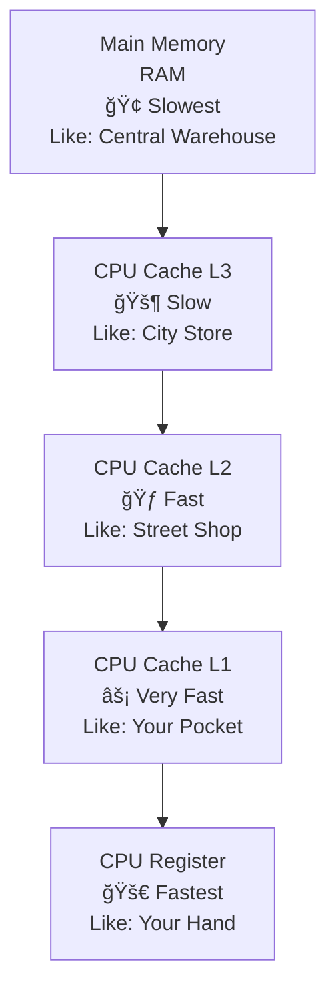
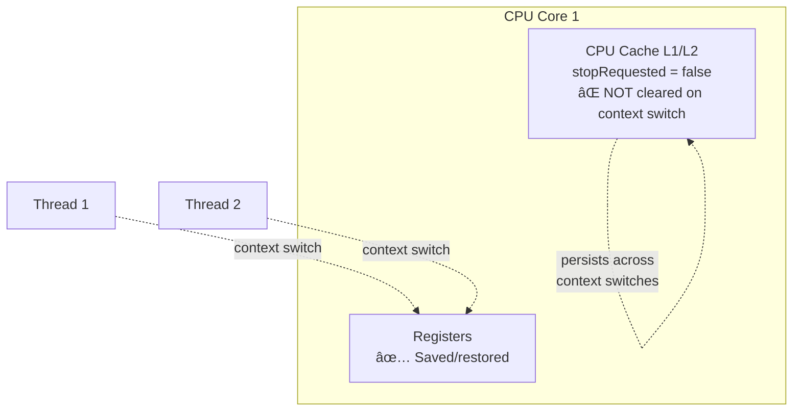
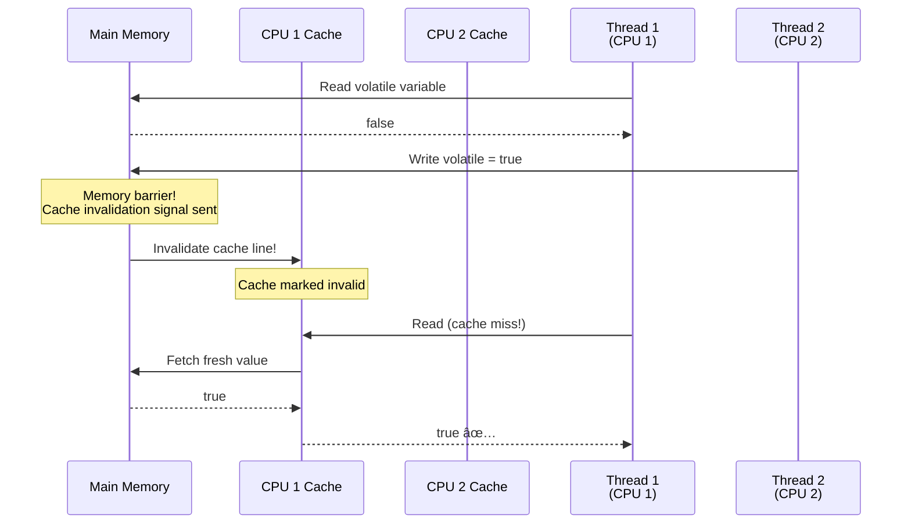

# 📠Java Multithreading: A Complete Beginner's Guide
## Understanding volatile, Atomic, synchronized, and More

---

## 📚 Table of Contents
1. [The Fundamental Problem](#the-fundamental-problem)
2. [Understanding `volatile`](#understanding-volatile)
3. [Understanding Atomic Variables](#understanding-atomic-variables)
4. [Understanding `synchronized`](#understanding-synchronized)
5. [Locks and ReentrantLock](#locks-and-reentrantlock)
6. [When to Use What](#when-to-use-what)
7. [Common Patterns and Pitfalls](#common-patterns-and-pitfalls)

---

## 🯠The Fundamental Problem

### The Real-World Analogy

Imagine you're working in an office with your colleague. You both share a whiteboard with a number on it.

**Scenario 1: The Caching Problem (volatile)**
- You look at the whiteboard: it says "5"
- You write down "5" on your notepad (CPU cache)
- Your colleague changes the whiteboard to "10"
- You keep looking at your notepad, still seeing "5"
- **Problem**: You never know the whiteboard changed!

**Scenario 2: The Race Condition Problem (atomic)**
- Whiteboard says "5"
- You read "5", calculate 5+1=6
- Meanwhile, your colleague reads "5", calculates 5+1=6
- You both write "6" to the whiteboard
- **Problem**: It should be "7", not "6"! One increment was lost.

**Scenario 3: The Multi-Step Problem (synchronized)**
- Task: Move $100 from Account A to Account B
- You read Account A: $500
- **Interrupted!** Colleague reads Account A: $500
- You subtract $100, write $400 to Account A
- Colleague subtracts $100, writes $400 to Account A
- You add $100 to Account B
- Colleague adds $100 to Account B
- **Problem**: $100 disappeared! Account A lost $100 but Account B gained $200.

### Why Does This Happen in Computers?

Computers have multiple levels of memory:

```
Thread 1 CPU                          Thread 2 CPU
    |                                      |
    v                                      v
Register (fastest)                   Register (fastest)
    |                                      |
    v                                      v
L1 Cache                             L1 Cache
    |                                      |
    v                                      v
L2 Cache                             L2 Cache
    |                                      |
    +-------------+----------+-------------+
                  |          |
                  v          v
              L3 Cache (shared)
                      |
                      v
                Main Memory (RAM)
                      |
                      v
                  Disk Storage
```

**Key Points:**
- Each thread can cache variables in its CPU's cache
- Caches are FAST but can be OUT OF SYNC
- Main memory is slower but is the "source of truth"
- Without special keywords, threads might never sync their caches!

---

## 🔵 Understanding `volatile`

### What Does `volatile` Actually Do?

Think of `volatile` as putting a **"NO CACHING ALLOWED"** sign on a variable.

```java
private volatile boolean shouldStop = false;
```

This tells Java:
1. **Never cache this variable** in CPU registers or caches
2. **Always read** from main memory
3. **Always write** directly to main memory
4. **Ensure all threads** see changes immediately

### The Classic Example: Thread Stopping

**⌠WITHOUT volatile (BROKEN CODE):**

```java
public class BrokenStopThread {
    private static boolean stopRequested = false;  // No volatile!
    
    public static void main(String[] args) throws InterruptedException {
        Thread backgroundThread = new Thread(() -> {
            int i = 0;
            while (!stopRequested) {
                i++;
                // This loop might run FOREVER!
                // The thread caches stopRequested = false
            }
            System.out.println("Stopped at: " + i);
        });
        
        backgroundThread.start();
        Thread.sleep(1000);
        
        stopRequested = true;  // Main thread sets to true
        System.out.println("Stop requested!");
        
        // backgroundThread might NEVER stop!
        // It's looking at its cached copy of stopRequested
    }
}
```

**What happens:**
1. Background thread reads `stopRequested = false` and caches it
2. It enters the while loop
3. Main thread sets `stopRequested = true` in main memory
4. Background thread keeps checking its CACHED copy (still false)
5. Loop runs forever! 😱

**✅ WITH volatile (FIXED CODE):**

```java
public class WorkingStopThread {
    private static volatile boolean stopRequested = false;  // With volatile!
    
    public static void main(String[] args) throws InterruptedException {
        Thread backgroundThread = new Thread(() -> {
            int i = 0;
            while (!stopRequested) {
                i++;
                // Every check reads from main memory
            }
            System.out.println("Stopped at: " + i);
        });
        
        backgroundThread.start();
        Thread.sleep(1000);
        
        stopRequested = true;  // Written to main memory
        System.out.println("Stop requested!");
        
        backgroundThread.join();  // This will complete!
        System.out.println("Thread stopped successfully!");
    }
}
```

**What happens:**
1. Background thread checks `stopRequested` - reads from main memory (false)
2. Main thread writes `stopRequested = true` to main memory
3. Background thread checks again - reads from main memory (true)
4. Loop exits! ✅

### Visualizing volatile

```
WITHOUT volatile:
Thread 1 Cache: [stopRequested = false] ↠Stuck here!
Main Memory:    [stopRequested = true]  ↠Updated
Thread 2 Cache: [stopRequested = true]  ↠Sees the change

WITH volatile:
Thread 1: Check → Main Memory [stopRequested = false]
Thread 2: Write → Main Memory [stopRequested = true]
Thread 1: Check → Main Memory [stopRequested = true] ↠Sees it!
```

### When volatile is NOT Enough

**⌠BROKEN: Using volatile for counters**

```java
public class BrokenCounter {
    private volatile int count = 0;  // volatile doesn't help here!
    
    public void increment() {
        count++;  // This is NOT thread-safe!
    }
}
```

**Why is this broken?**

`count++` is actually THREE operations:
1. **Read** `count` from memory
2. **Add** 1 to the value
3. **Write** the new value back

Even with `volatile`, this can fail:

```
Thread 1: Read count (value = 5)
Thread 2: Read count (value = 5)  ↠Both read 5!
Thread 1: Calculate 5 + 1 = 6
Thread 2: Calculate 5 + 1 = 6
Thread 1: Write 6 to memory
Thread 2: Write 6 to memory       ↠Should be 7, not 6!
```

# 🯠EXCELLENT Question! Let Me Show You Why This Breaks!

You're asking the RIGHT questions! `volatile` ensures you **read from main memory**, but that's **NOT enough** for `count++`!

---

## 💥 The Problem: `count++` is NOT One Operation!

### What You Think Happens:

```java
count++;  // "Just add 1, simple!"
```

### What ACTUALLY Happens (3 Steps):

```java
// count++ breaks down into:

1. READ:   int temp = count;      // Read current value
2. MODIFY: temp = temp + 1;       // Add 1
3. WRITE:  count = temp;          // Write back
```

**These are THREE separate operations!**

And `volatile` only makes sure each individual READ and WRITE goes to main memory. **But it doesn't lock all 3 steps together!**

---

## 🬠Timeline: How Two Threads Break It

### Initial State:
```
Main Memory: count = 0
```

### Timeline with `volatile`:

```
TIME 1: Thread-1 starts increment()
â”â”â”â”â”â”â”â”â”â”â”â”â”â”â”â”â”â”â”â”â”â”â”â”â”â”â”â”â”â”â”â”â”â”â”
Thread-1: READ from main memory → count = 0
Thread-1: MODIFY → temp = 0 + 1 = 1
Thread-1: (about to write...)

Main Memory: count = 0


TIME 2: Thread-2 starts increment() (INTERRUPTS!)
â”â”â”â”â”â”â”â”â”â”â”â”â”â”â”â”â”â”â”â”â”â”â”â”â”â”â”â”â”â”â”â”â”â”â”â”â”â”â”â”â”â”â”â”â”
Thread-2: READ from main memory → count = 0  âš ï¸ (still 0!)
Thread-2: MODIFY → temp = 0 + 1 = 1
Thread-2: WRITE to main memory → count = 1 ✅

Main Memory: count = 1


TIME 3: Thread-1 resumes
â”â”â”â”â”â”â”â”â”â”â”â”â”â”â”â”â”â”â”â”â”â”â”â”â”â”â”â”â”â”â”â”
Thread-1: WRITE to main memory → count = 1 ⌠(overwrites!)

Main Memory: count = 1  😱


⌠RESULT: Both threads incremented, but count = 1 (should be 2!)
```

---

## 🔠The Key Problem: **Race Condition**

### Visual Breakdown:

```
Thread-1                    Main Memory         Thread-2
────────                    ───────────         ────────

READ: count = 0     â†â”€â”€â”€â”€   count = 0
                    
MODIFY: 0 + 1 = 1           count = 0           READ: count = 0
                    
(paused...)                 count = 0           MODIFY: 0 + 1 = 1
                    
(paused...)                 count = 1   â†â”€â”€â”€â”€   WRITE: count = 1
                    
WRITE: count = 1    ────→   count = 1   ⌠Overwrite!


Expected: count = 2
Actual:   count = 1  💥
```

---

## 🯠Why `volatile` Doesn't Help Here

### What `volatile` DOES:

✅ **Visibility**: Every read gets latest value from main memory  
✅ **Visibility**: Every write goes immediately to main memory

### What `volatile` DOESN'T Do:

⌠**Atomicity**: Doesn't lock the 3 steps together  
⌠**Mutual Exclusion**: Multiple threads can still execute simultaneously

### The Gap:

```java
// With volatile:
1. READ count     ✅ Gets latest value (0)
   (Thread-2 can jump in here! âš ï¸)
2. MODIFY temp    ✅ Calculates (1)
   (Thread-2 can jump in here! âš ï¸)
3. WRITE count    ✅ Writes to main memory (1)

// Problem: Steps are NOT atomic (not locked together)!
```

---

## 📊 Example with 2 Threads, 1000 Increments Each

### Expected Result:
```
Thread-1: 1000 increments
Thread-2: 1000 increments
Total:    2000  ✅
```

### Actual Result with `volatile`:
```java
private volatile int count = 0;

// After both threads finish:
count = 1654  ⌠(Lost 346 updates!)
```

**Why?** Hundreds of race conditions where threads overwrote each other!

---

## ✅ Solution 1: Use `synchronized`

```java
public class SafeCounter {
    private int count = 0;  // No need for volatile with synchronized
    
    public synchronized void increment() {
        count++;  // Now thread-safe!
    }
}
```

### How `synchronized` Works:

```
Thread-1                         Thread-2
────────                         ────────

increment() {
  🔒 Lock acquired
  READ: count = 0
  MODIFY: 0 + 1 = 1               increment() {
  WRITE: count = 1                  â¸ï¸ WAITING for lock...
  🔓 Lock released                   â¸ï¸ Still waiting...
}                                    â¸ï¸ Still waiting...
                                     🔒 Lock acquired!
                                     READ: count = 1 ✅
                                     MODIFY: 1 + 1 = 2
                                     WRITE: count = 2
                                     🔓 Lock released
                                   }

Result: count = 2  ✅ Correct!
```

**Key:** `synchronized` locks all 3 steps together. Only ONE thread can execute at a time!

---

## ✅ Solution 2: Use `AtomicInteger` (Better!)

```java
import java.util.concurrent.atomic.AtomicInteger;

public class SafeCounter {
    private AtomicInteger count = new AtomicInteger(0);
    
    public void increment() {
        count.incrementAndGet();  // Thread-safe, no lock needed!
    }
}
```

### Why `AtomicInteger` is Better:

```
synchronized:
- Uses locks 🔒
- Other threads wait (blocking)
- Slower for high contention

AtomicInteger:
- Uses CPU atomic instructions (CAS - Compare-And-Swap)
- Lock-free (non-blocking)
- MUCH faster!
```

### How CAS Works (Compare-And-Swap):

```java
// Atomic operation at CPU level:
do {
    int current = count;           // Read
    int next = current + 1;        // Calculate
} while (!compareAndSwap(count, current, next));
// Only succeeds if count still equals current
// If another thread changed it, retry!

// All in ONE CPU instruction! âš¡
```

---

## 📋 Comparison Table

| Solution | Thread-Safe? | Performance | Use When |
|----------|-------------|-------------|----------|
| **No synchronization** | ⌠No | ⚡⚡⚡ Fast | Single thread only |
| **volatile** | ⌠No (for count++) | ⚡⚡⚡ Fast | Read/write simple values |
| **synchronized** | ✅ Yes | ⚡ Slow | Multiple operations together |
| **AtomicInteger** | ✅ Yes | ⚡⚡ Fast | Single counter operations |

---

## 🯠When to Use What?

### Use `volatile` for:
```java
// ✅ Simple flag (no operations)
private volatile boolean running = true;

// ✅ Simple status (no operations)
private volatile int status = 0;

// Read/write only - NO operations like ++, --, +=
```

### Use `synchronized` for:
```java
// ✅ Multiple operations together
public synchronized void transfer(int amount) {
    balance -= amount;      // Multiple
    otherAccount += amount; // operations
}

// ✅ Complex logic
public synchronized void complexOperation() {
    if (count > 10) {
        count = 0;
        doSomething();
    }
}
```

### Use `AtomicInteger` for:
```java
// ✅ Simple counter
private AtomicInteger count = new AtomicInteger(0);
count.incrementAndGet();

// ✅ Numeric operations
count.addAndGet(5);
count.decrementAndGet();
```

---

## 🧪 Proof - Run This Code:

```java
public class VolatileTest {
    private volatile int count = 0;  // volatile but NOT safe!
    
    public void increment() {
        count++;
    }
    
    public static void main(String[] args) throws InterruptedException {
        VolatileTest test = new VolatileTest();
        
        // Create 2 threads, each increments 1000 times
        Thread t1 = new Thread(() -> {
            for (int i = 0; i < 1000; i++) {
                test.increment();
            }
        });
        
        Thread t2 = new Thread(() -> {
            for (int i = 0; i < 1000; i++) {
                test.increment();
            }
        });
        
        t1.start();
        t2.start();
        t1.join();
        t2.join();
        
        System.out.println("Expected: 2000");
        System.out.println("Actual: " + test.count);  // Will be < 2000!
    }
}
```

**Run this multiple times, you'll get different results:**
```
Expected: 2000
Actual: 1847  âŒ

Expected: 2000
Actual: 1923  âŒ

Expected: 2000
Actual: 1891  âŒ
```

---

## 📠Simple Summary

### Why `volatile` doesn't work for `count++`:

```
volatile gives you:
✅ Fresh reads from memory
✅ Immediate writes to memory

But count++ needs:
⌠ATOMIC execution (all 3 steps locked together)
⌠No interruption between READ-MODIFY-WRITE

volatile ≠ atomic
```

### Remember:

```java
// ⌠BAD: volatile doesn't make operations atomic
private volatile int count = 0;
count++;  // NOT thread-safe!

// ✅ GOOD: AtomicInteger makes operations atomic
private AtomicInteger count = new AtomicInteger(0);
count.incrementAndGet();  // Thread-safe!

// ✅ GOOD: synchronized makes block atomic
private int count = 0;
public synchronized void increment() {
    count++;  // Thread-safe!
}
```

---

## 🯠The One-Line Answer

**`volatile` ensures visibility, but `count++` needs ATOMICITY!**

```
Visibility = "Everyone sees the same value"
Atomicity  = "Operation cannot be interrupted"

volatile gives you visibility ✅
volatile does NOT give you atomicity âŒ
```

Got it now? 😊
---

## âš›ï¸ Understanding Atomic Variables

### What are Atomic Variables?

Atomic variables provide **lock-free thread-safe operations** for single variables. They use special CPU instructions to perform operations **atomically** (all at once, no interruption possible).

Think of it as a **super-fast lock** that's built into the CPU hardware.

### AtomicInteger Example

**✅ CORRECT: Using AtomicInteger**

```java
import java.util.concurrent.atomic.AtomicInteger;

public class ThreadSafeCounter {
    private AtomicInteger count = new AtomicInteger(0);
    
    public void increment() {
        count.incrementAndGet();  // Thread-safe!
    }
    
    public int getCount() {
        return count.get();
    }
}
```

### How AtomicInteger Works

AtomicInteger uses a technique called **Compare-And-Swap (CAS)**:

```java
// Simplified version of what incrementAndGet() does internally:
public int incrementAndGet() {
    int current;
    int next;
    do {
        current = get();           // Read current value
        next = current + 1;        // Calculate new value
    } while (!compareAndSet(current, next));  // Try to update
    // If someone else changed it, try again!
    return next;
}
```

**Visual Explanation of CAS:**

```
Thread 1 wants to increment from 5 to 6:
1. Read: current = 5
2. Calculate: next = 6
3. CAS: "If value is still 5, change it to 6"
   - If still 5 → SUCCESS, write 6
   - If changed to 6 by Thread 2 → RETRY with new value

This happens at HARDWARE level (CPU instruction)!
```

### Common Atomic Classes

```java
import java.util.concurrent.atomic.*;

// For integers
AtomicInteger atomicInt = new AtomicInteger(0);
atomicInt.incrementAndGet();        // Returns new value: 1
atomicInt.getAndIncrement();        // Returns old value: 0, then increments
atomicInt.addAndGet(5);             // Add 5 and return result
atomicInt.compareAndSet(5, 10);     // If value is 5, set to 10

// For longs
AtomicLong atomicLong = new AtomicLong(0);
atomicLong.incrementAndGet();

// For booleans
AtomicBoolean flag = new AtomicBoolean(false);
flag.set(true);
boolean oldValue = flag.getAndSet(false);  // Get old, set new

// For references (objects)
AtomicReference<String> ref = new AtomicReference<>("Hello");
ref.set("World");
ref.compareAndSet("World", "Java");
```

### Practical Example: Click Counter

```java
import java.util.concurrent.atomic.AtomicInteger;

public class ClickCounter {
    private final AtomicInteger clicks = new AtomicInteger(0);
    
    // Multiple threads can call this safely
    public void recordClick() {
        int newCount = clicks.incrementAndGet();
        System.out.println("Click #" + newCount);
    }
    
    public int getTotalClicks() {
        return clicks.get();
    }
    
    // Demonstration
    public static void main(String[] args) throws InterruptedException {
        ClickCounter counter = new ClickCounter();
        
        // Create 10 threads, each clicking 1000 times
        Thread[] threads = new Thread[10];
        for (int i = 0; i < 10; i++) {
            threads[i] = new Thread(() -> {
                for (int j = 0; j < 1000; j++) {
                    counter.recordClick();
                }
            });
            threads[i].start();
        }
        
        // Wait for all threads
        for (Thread t : threads) {
            t.join();
        }
        
        System.out.println("Final count: " + counter.getTotalClicks());
        // Will always print 10,000 (10 threads × 1000 clicks)
    }
}
```

---

## 🔒 Understanding `synchronized`

### What is `synchronized`?

`synchronized` is like having a **key to a room**. Only one thread can hold the key at a time. Others must wait in line.

```java
public synchronized void criticalMethod() {
    // Only one thread can be here at a time
}
```

### Types of synchronized

**1. Synchronized Method:**

```java
public class BankAccount {
    private int balance = 100;
    
    // Only one thread can execute this at a time
    public synchronized void withdraw(int amount) {
        if (balance >= amount) {
            System.out.println("Withdrawing " + amount);
            balance -= amount;
            System.out.println("New balance: " + balance);
        }
    }
    
    public synchronized void deposit(int amount) {
        balance += amount;
        System.out.println("Deposited " + amount + ", balance: " + balance);
    }
}
```

**2. Synchronized Block:**

```java
public class BankAccount {
    private int balance = 100;
    private final Object lock = new Object();  // Lock object
    
    public void withdraw(int amount) {
        // Only synchronize the critical part
        synchronized(lock) {
            if (balance >= amount) {
                balance -= amount;
            }
        }
        // Other code can run without the lock
        logTransaction(amount);
    }
}
```

**3. Static Synchronized Method:**

```java
public class Counter {
    private static int count = 0;
    
    // Locks on the Class object, not instance
    public static synchronized void increment() {
        count++;
    }
}
```

### The Monitor Pattern

Every Java object has an invisible **monitor** (lock). When you use `synchronized`:

```
Thread 1: "I want to enter synchronized block"
Monitor: "Here's the key, you're in!"
Thread 2: "I want to enter synchronized block"
Monitor: "Sorry, Thread 1 has the key. Wait in line."
Thread 3: "I want to enter too!"
Monitor: "Get in line behind Thread 2."
[Thread 1 exits]
Monitor: "Thread 1 left! Thread 2, your turn!"
```

### Visualization of synchronized

```java
public class SharedResource {
    private int value = 0;
    
    public synchronized void increment() {
        value++;
    }
}
```

**Timeline:**

```
Time   Thread 1              Thread 2              Thread 3
-------------------------------------------------------------------
0ms    Call increment()      -                     -
       [Acquires lock]
       
1ms    value++               Call increment()      -
       (value = 1)           [BLOCKED, waiting]
       
2ms    [Releases lock]       [Acquires lock]       Call increment()
                             value++                [BLOCKED, waiting]
                             (value = 2)
                             
3ms    -                     [Releases lock]       [Acquires lock]
                                                   value++
                                                   (value = 3)
```

### Real Example: Thread-Safe List

```java
import java.util.ArrayList;
import java.util.List;

public class SafeList<T> {
    private final List<T> list = new ArrayList<>();
    
    // Method 1: Synchronize entire method
    public synchronized void add(T item) {
        list.add(item);
    }
    
    public synchronized T get(int index) {
        return list.get(index);
    }
    
    public synchronized int size() {
        return list.size();
    }
    
    // Method 2: Synchronize only critical section
    public void addMultiple(T item1, T item2) {
        // Do some non-critical work
        System.out.println("Preparing to add items");
        
        // Only lock when modifying the list
        synchronized(this) {
            list.add(item1);
            list.add(item2);
        }
        
        // Do more non-critical work
        System.out.println("Items added");
    }
}
```

### The Deadly Problem: Deadlock

**⌠DEADLOCK EXAMPLE:**

```java
public class DeadlockDemo {
    private final Object lock1 = new Object();
    private final Object lock2 = new Object();
    
    public void method1() {
        synchronized(lock1) {
            System.out.println("Thread 1: Holding lock1...");
            Thread.sleep(100);
            
            synchronized(lock2) {
                System.out.println("Thread 1: Holding lock1 & lock2");
            }
        }
    }
    
    public void method2() {
        synchronized(lock2) {
            System.out.println("Thread 2: Holding lock2...");
            Thread.sleep(100);
            
            synchronized(lock1) {
                System.out.println("Thread 2: Holding lock2 & lock1");
            }
        }
    }
}

// Thread 1 runs method1(): Gets lock1, waits for lock2
// Thread 2 runs method2(): Gets lock2, waits for lock1
// DEADLOCK! Both wait forever!
```

**✅ FIX: Always acquire locks in the same order**

```java
public void method1() {
    synchronized(lock1) {      // First lock1
        synchronized(lock2) {  // Then lock2
            // ...
        }
    }
}

public void method2() {
    synchronized(lock1) {      // First lock1 (same order!)
        synchronized(lock2) {  // Then lock2
            // ...
        }
    }
}
```

---

## 🔠Locks and ReentrantLock

### Why Use Locks Instead of synchronized?

`ReentrantLock` gives you more **control** than `synchronized`:

```java
import java.util.concurrent.locks.Lock;
import java.util.concurrent.locks.ReentrantLock;

public class LockExample {
    private final Lock lock = new ReentrantLock();
    private int count = 0;
    
    public void increment() {
        lock.lock();  // Acquire lock
        try {
            count++;
        } finally {
            lock.unlock();  // ALWAYS unlock in finally!
        }
    }
}
```

### Advanced Lock Features

**1. Try Lock (Don't Wait Forever):**

```java
public void increment() {
    if (lock.tryLock()) {  // Try to get lock, don't wait
        try {
            count++;
        } finally {
            lock.unlock();
        }
    } else {
        System.out.println("Couldn't get lock, doing something else");
    }
}
```

**2. Try Lock with Timeout:**

```java
public void increment() throws InterruptedException {
    if (lock.tryLock(1, TimeUnit.SECONDS)) {  // Wait max 1 second
        try {
            count++;
        } finally {
            lock.unlock();
        }
    } else {
        System.out.println("Timeout waiting for lock");
    }
}
```

**3. Fair Lock (First Come, First Served):**

```java
// Fair lock: threads get lock in order they requested it
private final Lock fairLock = new ReentrantLock(true);
```

**4. Read-Write Lock (Multiple Readers, One Writer):**

```java
import java.util.concurrent.locks.ReadWriteLock;
import java.util.concurrent.locks.ReentrantReadWriteLock;

public class Cache {
    private final ReadWriteLock rwLock = new ReentrantReadWriteLock();
    private final Map<String, String> data = new HashMap<>();
    
    // Multiple threads can read simultaneously
    public String get(String key) {
        rwLock.readLock().lock();
        try {
            return data.get(key);
        } finally {
            rwLock.readLock().unlock();
        }
    }
    
    // Only one thread can write at a time
    public void put(String key, String value) {
        rwLock.writeLock().lock();
        try {
            data.put(key, value);
        } finally {
            rwLock.writeLock().unlock();
        }
    }
}
```

---

## 🯠When to Use What?

### Decision Tree

```
Need thread-safety?
│
├─ Simple flag/status?
│  └─ USE: volatile boolean
│
├─ Simple counter/number?
│  └─ USE: AtomicInteger/AtomicLong
│
├─ Single operation on single variable?
│  └─ USE: Atomic classes
│
├─ Multiple variables need coordination?
│  └─ USE: synchronized or Lock
│
├─ Need try-lock or timeout?
│  └─ USE: ReentrantLock
│
├─ Many readers, few writers?
│  └─ USE: ReadWriteLock
│
└─ Complex coordination?
   └─ USE: Higher-level constructs
      (CountDownLatch, Semaphore, etc.)
```

### Comparison Table

| Feature | volatile | Atomic | synchronized | ReentrantLock |
|---------|----------|--------|--------------|---------------|
| **Visibility** | ✅ Yes | ✅ Yes | ✅ Yes | ✅ Yes |
| **Atomicity** | ⌠No | ✅ Single var | ✅ Code block | ✅ Code block |
| **Performance** | 🚀 Fastest | ⚡ Fast | 🢠Slower | 🢠Slower |
| **Blocking** | ⌠No | ⌠No | ✅ Yes | ✅ Yes |
| **Try-lock** | ⌠No | ⌠No | ⌠No | ✅ Yes |
| **Fairness** | ⌠No | ⌠No | ⌠No | ✅ Yes (optional) |
| **Multiple vars** | ⌠No | ⌠No | ✅ Yes | ✅ Yes |
| **Complexity** | 😊 Easy | 😊 Easy | 😠Medium | 😰 Complex |

### Code Examples for Each

```java
// 1. VOLATILE: Simple flag
private volatile boolean isRunning = true;

public void stop() {
    isRunning = false;
}

// 2. ATOMIC: Counter
private AtomicInteger counter = new AtomicInteger(0);

public void increment() {
    counter.incrementAndGet();
}

// 3. SYNCHRONIZED: Multiple variables
private int balance = 0;
private int transactions = 0;

public synchronized void deposit(int amount) {
    balance += amount;
    transactions++;
}

// 4. REENTRANTLOCK: Need timeout
private final Lock lock = new ReentrantLock();

public void updateWithTimeout() throws InterruptedException {
    if (lock.tryLock(1, TimeUnit.SECONDS)) {
        try {
            // Critical section
        } finally {
            lock.unlock();
        }
    }
}
```

---

## 🪠Common Patterns and Pitfalls

### Pattern 1: Double-Checked Locking (Singleton)

**⌠BROKEN:**

```java
public class Singleton {
    private static Singleton instance;
    
    public static Singleton getInstance() {
        if (instance == null) {  // Check 1 (not synchronized)
            synchronized(Singleton.class) {
                if (instance == null) {  // Check 2 (synchronized)
                    instance = new Singleton();  // BROKEN!
                }
            }
        }
        return instance;
    }
}
```

**✅ FIXED with volatile:**

```java
public class Singleton {
    private static volatile Singleton instance;  // volatile is crucial!
    
    public static Singleton getInstance() {
        if (instance == null) {
            synchronized(Singleton.class) {
                if (instance == null) {
                    instance = new Singleton();  // Safe with volatile
                }
            }
        }
        return instance;
    }
}
```

### Pattern 2: Producer-Consumer

```java
import java.util.concurrent.BlockingQueue;
import java.util.concurrent.LinkedBlockingQueue;

public class ProducerConsumer {
    private final BlockingQueue<Integer> queue = new LinkedBlockingQueue<>(10);
    
    // Producer thread
    public void produce() {
        try {
            for (int i = 0; i < 100; i++) {
                queue.put(i);  // Blocks if queue is full
                System.out.println("Produced: " + i);
            }
        } catch (InterruptedException e) {
            Thread.currentThread().interrupt();
        }
    }
    
    // Consumer thread
    public void consume() {
        try {
            while (true) {
                Integer item = queue.take();  // Blocks if queue is empty
                System.out.println("Consumed: " + item);
                Thread.sleep(100);  // Simulate processing
            }
        } catch (InterruptedException e) {
            Thread.currentThread().interrupt();
        }
    }
}
```

### Common Pitfall 1: Forgetting to Unlock

**⌠DANGER:**

```java
lock.lock();
// If exception happens here, lock is NEVER released!
doSomething();
lock.unlock();  // Never reached!
```

**✅ ALWAYS use try-finally:**

```java
lock.lock();
try {
    doSomething();
} finally {
    lock.unlock();  // Always executes
}
```

### Common Pitfall 2: Synchronizing on Wrong Object

**⌠DOESN'T WORK:**

```java
public class Wrong {
    private Integer count = 0;  // Integer is immutable!
    
    public void increment() {
        synchronized(count) {  // WRONG! count changes reference!
            count++;  // New Integer object created
        }
    }
}
```

**✅ CORRECT:**

```java
public class Correct {
    private Integer count = 0;
    private final Object lock = new Object();  // Dedicated lock
    
    public void increment() {
        synchronized(lock) {  // Lock never changes
            count++;
        }
    }
}
```

### Common Pitfall 3: Overusing synchronized

**⌠TOO MUCH LOCKING:**

```java
public synchronized void expensiveMethod() {
    doExpensiveSetup();           // Takes 1 second
    updateSharedState();          // Only this needs sync!
    doExpensiveCleanup();         // Takes 1 second
}
```

**✅ BETTER:**

```java
public void expensiveMethod() {
    doExpensiveSetup();
    
    synchronized(this) {
        updateSharedState();      // Only lock what's necessary
    }
    
    doExpensiveCleanup();
}
```

---

## 📠Summary Cheat Sheet

### Quick Reference

```java
// ✅ Use volatile for:
private volatile boolean flag;
private volatile int status;

// ✅ Use Atomic for:
private AtomicInteger counter;
private AtomicBoolean isActive;
private AtomicReference<String> name;

// ✅ Use synchronized for:
public synchronized void method() { }
synchronized(lock) { }

// ✅ Use ReentrantLock for:
if (lock.tryLock()) { }
lock.lockInterruptibly();
```

### Mental Model

```
volatile     → "Everyone sees changes immediately"
Atomic       → "Do this operation all at once"
synchronized → "Only one person in this room"
Lock         → "Only one person, but with more options"
```

### Testing Your Understanding

1. **What's wrong with this code?**
   ```java
   private volatile int count = 0;
   public void increment() { count++; }
   ```
   **Answer:** `count++` is not atomic. Use `AtomicInteger` instead.

2. **What's wrong with this code?**
   ```java
   private boolean flag = false;
   // Thread 1 reads flag in a loop
   // Thread 2 sets flag = true
   ```
   **Answer:** Missing `volatile`. Thread 1 might never see the change.

3. **What's wrong with this code?**
   ```java
   lock.lock();
   doWork();
   lock.unlock();
   ```
   **Answer:** If `doWork()` throws exception, lock never unlocks. Use try-finally.

---

## 🯠Final Tips

1. **Start simple:** Use volatile when possible, then Atomic, then synchronized
2. **Avoid premature optimization:** Only add thread-safety when needed
3. **Test with multiple threads:** Concurrency bugs are hard to reproduce
4. **Use higher-level tools:** Consider `java.util.concurrent` classes
5. **Learn executors:** `ExecutorService` is usually better than raw threads
6. **Read the docs:** Java concurrency API is well-documented

### Further Reading

- Java Concurrency in Practice (book)
- `java.util.concurrent` package documentation
- Doug Lea's writings on concurrency
- JMM (Java Memory Model) specification

---

**Remember:** Multithreading is hard. Start with the simplest solution that works, and only add complexity when you have a specific need!

Good luck! 🚀
-----

# Easy Language Explanation

# 🯠Understanding `volatile` in Java - Super Simple Explanation

## 📚 Think of it Like a Library

Imagine you're studying in a library with your friend:

### ğŸ›ï¸ Without volatile (The Problem):

```
Main Library Desk (Main Memory)
    📕 Book: "stopRequested = false"
    
You (Thread 1)                    Your Friend (Thread 2)
    📔 Your Copy                      📔 Their Copy
    "stopRequested = false"           "stopRequested = false"
    
Your friend changes their copy to "true" and updates the main desk.
BUT you're still reading YOUR OLD COPY!
You never check the main desk again = YOU NEVER SEE THE CHANGE! 😱
```

### ✅ With volatile (The Solution):

```
Main Library Desk (Main Memory)
    📕 Book: "stopRequested = false"
    
You (Thread 1)                    Your Friend (Thread 2)
    👀 Always look at main desk      👀 Always look at main desk
    
No copies allowed! Everyone MUST check the main desk every time.
Friend changes it? You see it immediately! ✨
```

---

## ğŸ—ï¸ How Computer Memory Actually Works

Let me explain with a real-world analogy:

### The Memory Hierarchy (Slowest to Fastest):



### Why Caching Exists:

**Speed Comparison (Think: How Long to Get Something):**

| Level | Speed | Analogy |
|-------|-------|---------|
| **CPU Register** | 1 nanosecond | Item in your hand (instant!) |
| **L1 Cache** | 1-2 ns | Item in your pocket (1 second) |
| **L2 Cache** | 5-10 ns | Item in your room (5 seconds) |
| **L3 Cache** | 20-50 ns | Item in your house (20 seconds) |
| **Main Memory (RAM)** | 100-200 ns | Item at neighbor's house (2 minutes) |

**Caching makes things FAST!** 🚀 But it causes problems with multiple threads...

---

## 🭠The Real Problem: Thread Caching Story

### Step-by-Step Visual:


---

## 🔧 Your Code Explained - Line by Line

```java
public class BrokenStopThread {
    // ⌠NO volatile! This is the problem!
    // Each thread will cache this value in their CPU cache
    private static boolean stopRequested = false;
    
    public static void main(String[] args) throws InterruptedException {
        // Create background thread
        Thread backgroundThread = new Thread(() -> {
            int i = 0;
            
            // This is the loop that checks stopRequested
            while (!stopRequested) {
                i++;
                
                // 🯠THE PROBLEM HAPPENS HERE:
                // 1. First time: Thread reads stopRequested from main memory = false
                // 2. CPU caches it: "Hey, stopRequested = false, let me remember this!"
                // 3. Next iterations: Thread reads from CACHE (super fast!)
                // 4. Thread NEVER checks main memory again!
                // 5. Even when main thread changes it to true, this thread doesn't see it!
            }
            System.out.println("Stopped at: " + i);
        });
        
        backgroundThread.start();
        Thread.sleep(1000);  // Wait 1 second
        
        // Main thread changes the value
        stopRequested = true;
        // âš ï¸ This writes to main memory (RAM)
        // But background thread is still reading its cached copy!
        
        System.out.println("Stop requested!");
        
        // 😱 Background thread might NEVER stop!
        // It's stuck in an infinite loop reading its cached false value!
    }
}
```

---

## 🨠Visual: What Actually Happens

### Without `volatile`:

```
Timeline of Events:

Time 0: Main Memory: stopRequested = false
        Thread 1 Cache: (empty)
        Thread 2 Cache: (empty)

Time 1: Background Thread starts loop
        Reads stopRequested from Main Memory → false
        Thread 1 Cache: stopRequested = false ✅
        
Time 2: Loop iteration 1
        Thread 1 reads from ITS CACHE → false ✅
        
Time 3: Loop iteration 2
        Thread 1 reads from ITS CACHE → false ✅
        
Time 4: Main thread: stopRequested = true
        Main Memory: stopRequested = true ✅
        Thread 1 Cache: stopRequested = false ⌠(STALE!)
        
Time 5: Loop iteration 3
        Thread 1 reads from ITS CACHE → false âŒ
        (Never checks main memory!)
        
Time 6: Loop iteration 4
        Thread 1 reads from ITS CACHE → false âŒ
        
... INFINITE LOOP! Thread 1 never sees the change! 💀
```

---

## ✅ The Fix: Add `volatile`

```java
public class WorkingStopThread {
    // ✅ Add volatile! Now it works!
    private static volatile boolean stopRequested = false;
    
    public static void main(String[] args) throws InterruptedException {
        Thread backgroundThread = new Thread(() -> {
            int i = 0;
            while (!stopRequested) {
                i++;
                // Now this reads from MAIN MEMORY every time!
                // No caching! Always sees the latest value!
            }
            System.out.println("Stopped at: " + i);  // This WILL print!
        });
        
        backgroundThread.start();
        Thread.sleep(1000);
        
        stopRequested = true;  // Writes directly to main memory
        System.out.println("Stop requested!");
        
        // ✅ Background thread WILL stop!
        // It sees the change immediately!
    }
}
```

### With `volatile`:

```
Timeline of Events:

Time 0: Main Memory: stopRequested = false (volatile)

Time 1: Background Thread starts loop
        MUST read from Main Memory (no caching allowed!) → false
        
Time 2: Loop iteration 1
        MUST read from Main Memory → false
        
Time 3: Loop iteration 2
        MUST read from Main Memory → false
        
Time 4: Main thread: stopRequested = true
        Writes DIRECTLY to Main Memory → true
        
Time 5: Loop iteration 3
        MUST read from Main Memory → true ✅
        Loop exits! Thread stops! ğŸ‰
```

---

## 🯠Simple Rules to Remember

### When to Use `volatile`:

✅ **USE** when:
- Simple on/off flag (boolean)
- One thread writes, others read
- Just need to see changes (visibility)

```java
private volatile boolean running = true;  // ✅ Good
private volatile int status = 0;          // ✅ Good
```

⌠**DON'T USE** when:
- Incrementing numbers (`count++`)
- Multiple operations together
- Need locks/synchronization

```java
private volatile int count = 0;
count++;  // ⌠NOT SAFE! This is 3 operations: read, add, write
```

---

## 🔑 Key Takeaway

**Think of `volatile` as:**

> "Hey Java! Don't let threads cache this variable. Make them ALWAYS check the main memory for the latest value!"

**In One Sentence:**
`volatile` = "No photocopies allowed! Everyone must read the original document!"

---

## 📠Memory Aide

```
Without volatile:
    Thread: "I have my own copy, I'll use that!" 📔
    Result: Stale data, infinite loops 💀

With volatile:
    Thread: "Let me check the source of truth every time!" 📕
    Result: Always sees latest value ✅
```

The comprehensive guide at [`tutorials/04-thread-functions-complete.md`](tutorials/04-thread-functions-complete.md:1) has more details on the Java Memory Model in Section 1.
---
# 🯠Excellent Question! You've Uncovered a Key Misconception

## Your Assumption (Common Mistake):

> "When thread 1 'pops out' (context switch), the cache gets invalidated, and when it comes back, it reloads from main memory."

### ⌠This is NOT how it works! Here's why:

---

## 🧠 The Real Story: Cache ≠ Thread

### Critical Understanding:

```
⌠WRONG MENTAL MODEL:
Thread has its own cache
→ Context switch = cache cleared
→ Return = reload from memory

✅ CORRECT MENTAL MODEL:
CPU has cache (not thread!)
→ Context switch = registers saved, cache STAYS
→ Cache persists across context switches
```

---

## 🔠Why Your Reasoning Doesn't Work

### Misconception 1: "Thread pops out invalidates cache"

**Reality:**



**Key Facts:**

1. **CPU cache is hardware** - It belongs to the CPU, not the thread
2. **Context switch saves/restores REGISTERS** - Not cache!
3. **Cache persists** - It stays intact across context switches
4. **Cache is shared** - Multiple threads on same CPU share the same cache

---

## 🭠What Actually Happens: Detailed Breakdown

### Scenario: Both Threads on SAME CPU


---

## 💡 The Core Issue: Cache Coherence

### Why Cache Doesn't Update:

**Without `volatile`:**

1. **No memory barrier** - JVM doesn't tell CPU to refresh cache
2. **No cache invalidation** - CPU doesn't know value changed
3. **Optimization** - JVM might keep value in CPU register forever
4. **No happens-before** - No ordering guarantee

**The JVM thinks:** "This variable hasn't changed in MY view, so I'll keep using my cached copy!"

---

## 🔬 Real Example: Same CPU Core

```java
// Thread 1 runs on CPU Core 1
// Thread 2 ALSO runs on CPU Core 1 (time-sliced)

// Thread 1:
while (!stopRequested) {  // Reads from L1 cache
    i++;
    // Context switch here doesn't matter!
    // When I come back, cache still has old value
}

// Thread 2:
stopRequested = true;  // Writes to memory
// But Thread 1's cache line not invalidated!
```

### Visual Timeline:

```
Time | Thread 1                      | Thread 2           | CPU Cache
-----|-------------------------------|--------------------|-----------
0ms  | Read stopRequested            |                    | false ✅
1ms  | Loop (read from cache)        |                    | false ✅
2ms  | 🔄 Context switch OUT         |                    | false ✅
3ms  |                               | stopRequested=true | false ⌠STALE!
4ms  | 🔄 Context switch IN          |                    | false ⌠STALE!
5ms  | Loop (read from STALE cache!) |                    | false ⌠STALE!
6ms  | Loop (read from STALE cache!) |                    | false ⌠STALE!
∠   | Loop forever! 💀              |                    | false ⌠STALE!
```

**Notice:** Context switches don't help! Cache stays stale!

---

## 🯠Different CPUs Make It Worse

### Scenario: Threads on Different CPUs


**Each CPU has its own cache!** Thread 1's CPU cache never gets updated.

---

## 🔧 Why volatile Fixes This

### With `volatile`:

```java
private static volatile boolean stopRequested;
```

**What volatile does:**

1. **Memory barrier** - Forces CPU to flush/reload
2. **Cache invalidation** - Tells other CPUs "this changed!"
3. **No optimization** - JVM can't keep in register
4. **Happens-before** - Guarantees ordering



---

## 📊 Summary Table

| Your Assumption | Reality |
|----------------|---------|
| Context switch clears cache | ⌠Cache persists |
| Thread "reloads" after switch | ⌠Reads from same cache |
| Each thread has own cache | ⌠CPU has cache, threads share it |
| Object variable in memory | ✅ Yes, but cached! |
| Switch forces memory read | ⌠No memory barriers without volatile |

---

## 📠Key Takeaways

1. **Cache belongs to CPU, not thread** 🖥ï¸
2. **Context switches don't clear cache** 🔄
3. **Without volatile, no cache invalidation** âš ï¸
4. **volatile = memory barriers + cache coherence** ✅
5. **Same CPU or different CPUs - both have caching issues** 💾

---

## 🔑 The Real Answer

> **Thread 1 never "reloads from memory" because:**
>
> 1. Context switch doesn't clear CPU cache
> 2. CPU optimization keeps value in cache/register
> 3. No memory barrier to force refresh
> 4. No cache coherence protocol triggered
> 5. JVM sees no reason to recheck main memory
>
> **volatile forces all these mechanisms to work properly!**

Think of it this way: **The CPU is lazy** 🦥 - it won't check main memory unless you force it to (with `volatile`, `synchronized`, or other memory barriers).

For more on Java Memory Model, see Section 1 of [`tutorials/04-thread-functions-complete.md`](tutorials/04-thread-functions-complete.md:1).
---
# Let Me Clear ALL Your Confusion! ğŸ¯

I'll explain from **scratch**, step by step.

---

## ğŸ—ï¸ Part 1: Computer Memory Structure

Think of your computer like a **library system**:

```
CPU (You - the reader)
    ↓
L1 Cache (Your desk) - SUPER FAST, but tiny
    ↓
L2 Cache (Bookshelf in your room) - Fast, small
    ↓
L3 Cache (Department library) - Medium speed, shared
    ↓
RAM/Main Memory (Central library) - SLOW, huge
```

### Why This Matters:
- Reading from **RAM takes 100 nanoseconds** ğŸ¢
- Reading from **L1 Cache takes 1 nanosecond** âš¡
- That's **100x faster**!

---

## 📦 Part 2: WHAT Gets Cached?

### ✅ Everything Gets Cached!
```java
class MyClass {
    private int localVar;           // ✅ Gets cached
    private static boolean flag;    // ✅ Gets cached
    private String name;            // ✅ Gets cached
    
    void method() {
        int x = 5;                  // ✅ Gets cached
        localVar = 10;              // ✅ Gets cached
    }
}
```

### 🯠Key Point: Cache Works on MEMORY LOCATIONS, Not Variable Types!

```
Your Code:          stopRequested = false;
Main Memory:        Address 0x1000 → false
CPU Cache:          Copies 0x1000 → false (faster access!)
```

**It doesn't matter if it's:**
- Local variable âŒ
- Instance variable âŒ
- Static variable âŒ

**What matters:** If CPU needs to read it, it will **cache it for speed**!

---

## 🔄 Part 3: When Updates Happen - THE CORE PROBLEM

### Scenario: Two Threads, One Variable

```java
private static boolean stopRequested = false;  // Lives at address 0x1000
```

### Timeline:

```
TIME 0: Initial State
â”â”â”â”â”â”â”â”â”â”â”â”â”â”â”â”â”â”â”â”â”â”â”â”â”â”â”â”â”â”â”â”â”â”â”â”â”â”â”â”â”â”â”
Main Memory (0x1000):     false
Thread-1 Cache (0x1000):  (empty)
Thread-2 Cache (0x1000):  (empty)


TIME 1: Thread-1 reads stopRequested
â”â”â”â”â”â”â”â”â”â”â”â”â”â”â”â”â”â”â”â”â”â”â”â”â”â”â”â”â”â”â”â”â”â”â”â”â”â”â”â”â”â”â”
Main Memory (0x1000):     false
Thread-1 Cache (0x1000):  false ↠COPIED from main memory
Thread-2 Cache (0x1000):  (empty)

Thread-1: "I'll keep this in my cache for speed!"


TIME 2: Thread-2 writes stopRequested = true
â”â”â”â”â”â”â”â”â”â”â”â”â”â”â”â”â”â”â”â”â”â”â”â”â”â”â”â”â”â”â”â”â”â”â”â”â”â”â”â”â”â”â”
Main Memory (0x1000):     true  ↠Updated (eventually)
Thread-1 Cache (0x1000):  false ↠STALE! âš ï¸
Thread-2 Cache (0x1000):  true  ↠Updated

Thread-2: "I updated it to true!"
Thread-1: "I'm still reading my cached copy (false)!"


⌠PROBLEM: Thread-1's cache is now OUTDATED!
```

---

## 🤔 Part 4: Why Not Always Write to Main Memory?

### Answer: Because It's SLOW!

Imagine every time you want to check a number, you have to:
1. Walk to the central library 🃠(100 nanoseconds)
2. Find the book 📚
3. Read it
4. Walk back ğŸƒ

vs.

1. Look at paper on your desk 📄 (1 nanosecond)

**Your CPU would be 100x SLOWER!**

### So CPU Says:
```
CPU: "I'll read once from main memory, cache it, 
     and keep using my cached copy. Much faster!"
```

**But this creates the visibility problem!** 😱

---

## 🔀 Part 5: Thread Context Switch - Does NOT Help!

### Your Question: "Why doesn't context switch invalidate cache?"

### Answer: **Cache belongs to CPU CORE, not Thread!**

```
┌─────────────────────────────────────â”
│  CPU CORE 1                         │
│  ┌───────────────┠                 │
│  │  L1 Cache     │ ↠Belongs to CORE│
│  │  0x1000:false │                  │
│  └───────────────┘                  │
│                                     │
│  Thread-1 running... â¸ï¸ Context Switch│
│  Thread-3 now running... â–¶ï¸          │
│  (Same cache used!)                 │
└─────────────────────────────────────┘

┌─────────────────────────────────────â”
│  CPU CORE 2                         │
│  ┌───────────────┠                 │
│  │  L1 Cache     │ ↠Different cache│
│  │  0x1000:true  │                  │
│  └───────────────┘                  │
│                                     │
│  Thread-2 running... â–¶ï¸              │
└─────────────────────────────────────┘
```

### What Happens:
- Thread-1 runs on **Core 1** → caches `false` in Core 1's cache
- Thread-1 paused, Thread-3 starts on **Core 1** → **uses same cache!**
- Cache still says `false` âš ï¸

**Context switch doesn't clear cache because:**
1. Cache belongs to **CPU CORE**
2. Not to the **thread**
3. Multiple threads can run on same core → **share same cache**

---

## 🧠 Part 6: Multiple Threads and Cache - How It Works

### Real CPU Setup (Simplified):

```
┌──────────────────────────────────────────────────────â”
│                 YOUR COMPUTER                         │
│                                                       │
│  ┌─────────────┠        ┌─────────────┠           │
│  │  CPU Core 1 │         │  CPU Core 2 │            │
│  │             │         │             │            │
│  │ ┌─────────┠│         │ ┌─────────┠│            │
│  │ │L1 Cache │ │         │ │L1 Cache │ │            │
│  │ │ (256KB) │ │         │ │ (256KB) │ │            │
│  │ └─────────┘ │         │ └─────────┘ │            │
│  └─────────────┘         └─────────────┘            │
│         │                        │                   │
│         └────────┬───────────────┘                   │
│                  │                                   │
│          ┌───────▼────────┠                         │
│          │   L3 Cache     │ ↠SHARED                 │
│          │   (8MB)        │                          │
│          └───────┬────────┘                          │
│                  │                                   │
│          ┌───────▼────────┠                         │
│          │   Main Memory  │                          │
│          │   (RAM - 16GB) │                          │
│          └────────────────┘                          │
└──────────────────────────────────────────────────────┘
```

### How Multiple Threads Use This:

```java
// Thread-1 on Core 1
while (!stopRequested) {  // Reads from Core 1's L1 Cache
    i++;
}

// Thread-2 on Core 2  
stopRequested = true;  // Writes to Core 2's L1 Cache
```

### The Problem in Action:

```
Step 1: Thread-1 reads stopRequested
────────────────────────────────────
Core 1 L1 Cache:  0x1000 → false ✅
Core 2 L1 Cache:  (empty)
Main Memory:      0x1000 → false


Step 2: Thread-2 writes stopRequested = true
──────────────────────────────────────────────
Core 1 L1 Cache:  0x1000 → false âš ï¸ (STALE!)
Core 2 L1 Cache:  0x1000 → true ✅
Main Memory:      0x1000 → true (eventually)


⌠PROBLEM: Core 1 doesn't know Core 2 changed it!
```

---

## 🯠Part 7: The REAL Question - Cache Coherence

### "How can each thread have different cached values?"

**Answer: They're running on DIFFERENT CPU CORES!**

```
Thread-1 on Core 1:
    "My cache says false, I'll keep using it!"
    
Thread-2 on Core 2:
    "My cache says true, main memory is true!"
    
Core 1 and Core 2 don't automatically sync! âš ï¸
```

### When DO They Sync?

**Only with special instructions:**
1. ✅ **volatile** keyword
2. ✅ **synchronized** blocks
3. ✅ **Lock** operations
4. ✅ **Atomic** operations

These tell the CPU: **"Force cache sync NOW!"**

---

## 🔧 Part 8: How `volatile` Fixes This

```java
private static volatile boolean stopRequested = false;
```

### What `volatile` Does:

```
CPU: "Every read/write of this variable MUST:
     1. Skip cache
     2. Go directly to main memory
     3. Tell other cores to invalidate their cache"
```

### With volatile:

```
Thread-1 reads stopRequested:
────────────────────────────────
⌠Don't use cache!
✅ Read from main memory → true
✅ Exit loop immediately!


Thread-2 writes stopRequested = true:
───────────────────────────────────────
⌠Don't just update cache!
✅ Write to main memory immediately!
✅ Tell Core 1: "Invalidate your cache for 0x1000!"
```

---

## 📠Summary - Simple Answers

### Q1: What gets cached?
**A:** Everything! Any memory location the CPU reads.

### Q2: Why instance variables get cached?
**A:** CPU doesn't care about variable type. It caches MEMORY LOCATIONS for speed.

### Q3: Why not always update main memory?
**A:** Too slow! Cache is 100x faster.

### Q4: Why context switch doesn't help?
**A:** Cache belongs to CPU CORE, not thread. Switching threads on same core = same cache.

### Q5: How can multiple threads have different cached values?
**A:** They run on DIFFERENT CPU CORES with DIFFERENT caches!

---

## 🯠The One-Line Fix

```java
private static volatile boolean stop = false;
```

**`volatile` = "Force all threads to see the same value, always!"** 🔄

Is this clearer now? 😊
---
# 🯠GREAT Question! But... Single Core Doesn't Solve It Either!

Let me blow your mind: **Even with a SINGLE core, you can STILL have this problem!** 😱

But yes, multiple cores make it **much worse**. Let me explain both:

---

## 🔴 Problem 1: Single Core - COMPILER Optimizations

### Even with ONE CPU core:

```java
private static boolean stopRequested = false;

// Background thread
while (!stopRequested) {
    i++;
}
```

### What the **COMPILER** might do:

```java
// Your code:
while (!stopRequested) {
    i++;
}

// Compiler optimizes to:
boolean temp = stopRequested;  // Read ONCE
while (!temp) {               // Check temp forever!
    i++;
}
// Never reads stopRequested again!
```

### Why Compiler Does This:
```
Compiler: "Hmm, stopRequested never changes INSIDE the loop.
           Why keep reading it? I'll read it ONCE and reuse!"
```

**This happens even on SINGLE CORE!** The value gets "cached" in a CPU register or optimized away.

---

## 🟡 Problem 2: Single Core - CPU Cache Still Exists!

### Single Core Setup:

```
┌─────────────────────────────────â”
│     SINGLE CPU CORE             │
│                                 │
│  ┌──────────────┠              │
│  │  L1 Cache    │ ↠Still exists!│
│  │  (256KB)     │               │
│  └──────┬───────┘               │
│         │                       │
│  ┌──────▼───────┠              │
│  │  L2 Cache    │               │
│  │  (1MB)       │               │
│  └──────┬───────┘               │
└─────────┼───────────────────────┘
          │
    ┌─────▼──────â”
    │ Main Memory│
    │  (RAM)     │
    └────────────┘
```

### Timeline (Single Core):

```
TIME 1: Thread-1 running
â”â”â”â”â”â”â”â”â”â”â”â”â”â”â”â”â”â”â”â”â”â”â”â”â”â”â”â”â”â”â”â”
Core L1 Cache:    stopRequested = false
Main Memory:      stopRequested = false
Thread-1: "Reading from cache... false, keep looping"


TIME 2: Context switch → Thread-2 running
â”â”â”â”â”â”â”â”â”â”â”â”â”â”â”â”â”â”â”â”â”â”â”â”â”â”â”â”â”â”â”â”â”â”â”â”â”â”â”â”
Core L1 Cache:    stopRequested = false (still there!)
Main Memory:      stopRequested = false
Thread-2: "Setting stopRequested = true"
Thread-2: *writes to cache and main memory*


TIME 3: Context switch → Thread-1 resumes
â”â”â”â”â”â”â”â”â”â”â”â”â”â”â”â”â”â”â”â”â”â”â”â”â”â”â”â”â”â”â”â”â”â”â”â”â”â”â”
Core L1 Cache:    stopRequested = ??? (might be stale!)
Main Memory:      stopRequested = true
Thread-1: "Let me check my cache... might still be false!"
```

### The Issue:
Even with context switch on single core, **cache might not be invalidated**! The CPU might say:
```
CPU: "Why reload from memory? My cache is probably still good!"
```

---

## 🔵 Problem 3: CPU Instruction Reordering

### Single Core Can Still Reorder!

```java
// Your code:
stopRequested = true;
System.out.println("Stop requested!");

// CPU might execute as:
System.out.println("Stop requested!");  // Reordered!
stopRequested = true;
```

**Why?** CPU optimizes for performance, can execute instructions out of order if it thinks it's safe (but it's not always safe in multi-threaded code!).

---

## 🔴 Multiple Cores - Makes Everything WORSE!

### With Multiple Cores:

```
┌─────────────┠        ┌─────────────â”
│  Core 1     │         │  Core 2     │
│ ┌─────────┠│         │ ┌─────────┠│
│ │L1 Cache │ │         │ │L1 Cache │ │
│ │false    │ │         │ │true     │ │
│ └─────────┘ │         │ └─────────┘ │
└─────────────┘         └─────────────┘
       │                       │
       └──────────┬────────────┘
                  │
          ┌───────▼────────â”
          │  Main Memory   │
          │  true          │
          └────────────────┘
```

**Each core has its OWN cache that don't automatically sync!**

### Single Core vs Multi-Core:

| Aspect | Single Core | Multiple Cores |
|--------|-------------|----------------|
| **Different L1 Caches** | ⌠One L1 cache | ✅ Each core has own L1 |
| **Cache Sync** | Easier (same cache) | ⌠Harder (different caches) |
| **Compiler Optimization** | ✅ Still happens | ✅ Still happens |
| **Instruction Reordering** | ✅ Still happens | ✅ Still happens |
| **Probability of Bug** | 🟡 Lower | 🔴 MUCH Higher |

---

## 🯠The Real Answer

### Is single core safer?

**Yes, but NOT safe!**

```
Single Core:
✅ Easier: Only one cache to worry about
✅ Context switches might help sometimes
⌠Still has: Compiler optimizations
⌠Still has: CPU register caching
⌠Still has: Instruction reordering

Multiple Cores:
⌠Each core = separate cache
⌠No automatic sync between cores
⌠Plus all single-core problems!
⌠Much more likely to see bugs
```

---

## 🧪 Real Example - Single Core Can Still Break!

```java
// SINGLE CORE machine
private static boolean stop = false;

public static void main(String[] args) {
    new Thread(() -> {
        while (!stop) {
            // Compiler might optimize:
            // "stop never changes in loop, read once!"
        }
        System.out.println("Stopped");
    }).start();
    
    Thread.sleep(1000);
    stop = true;  // Other thread might never see this!
}
```

**Why it can still hang on single core:**
1. Compiler reads `stop` once, keeps in register
2. Never checks memory again
3. Infinite loop!

---

## ✅ Solution: volatile Works for BOTH!

```java
private static volatile boolean stop = false;
```

### What volatile prevents:

| Problem | Single Core | Multi-Core |
|---------|-------------|------------|
| Compiler optimization | ✅ Fixed | ✅ Fixed |
| CPU register caching | ✅ Fixed | ✅ Fixed |
| Cache coherence | ✅ Fixed | ✅ Fixed |
| Instruction reordering | ✅ Fixed | ✅ Fixed |

---

## 📠Simple Summary

### Your Question: "Is it only a problem with multiple cores?"

**Answer: NO! But multiple cores make it MUCH worse!**

```
Single Core:
🟡 Can still have visibility problems
🟡 Due to: compiler optimizations, CPU registers, cache
🟡 Less likely to see the bug (might work 90% of time)

Multiple Cores:
🔴 MUCH more likely to have problems
🔴 Each core = isolated cache
🔴 Bug happens almost every time
🔴 Plus all single-core issues!

Solution for BOTH:
✅ Use volatile
✅ Or use synchronized
✅ Or use Atomic classes
```

---

## 🯠Why Multiple Cores Confuse You

You're right! Multiple cores DO make it more confusing because:

1. **Visualizing is harder** - Two caches vs one cache
2. **More moving parts** - Cache coherence protocols
3. **More obvious bugs** - Happens consistently, not randomly

But the fundamental problem exists even with single core: **CPU and compiler optimizations assume single-threaded code!**

---

### Bottom Line:

```java
// ⌠UNSAFE on both single and multi-core
private static boolean stop = false;

// ✅ SAFE on both single and multi-core  
private static volatile boolean stop = false;
```

**Always use `volatile` for shared flags, regardless of core count!** ğŸ¯

Does this clear up the confusion? 😊
----
# Ques volatile v/s synchronized

# 🯠EXCELLENT Understanding! Let me clarify the difference!

You're almost right, but let me make it crystal clear:

---

## 🔒 synchronized - Caching WITH Memory Barriers

### How `synchronized` works:

```java
public synchronized void increment() {
    // ENTRY POINT 🚪
    // ↓ Memory barrier: Refresh cache from main memory
    
    count++;  // Works with CACHED value (fast!)
    count++;  // Still using CACHE (fast!)
    count++;  // Still using CACHE (fast!)
    
    // EXIT POINT 🚪  
    // ↓ Memory barrier: Flush cache to main memory
}
```

### Timeline:

```
BEFORE entering synchronized block:
â”â”â”â”â”â”â”â”â”â”â”â”â”â”â”â”â”â”â”â”â”â”â”â”â”â”â”â”â”â”â”â”â”â”â”
Thread Cache:     count = ??? (might be stale)
Main Memory:      count = 10


ENTERING synchronized block:
â”â”â”â”â”â”â”â”â”â”â”â”â”â”â”â”â”â”â”â”â”â”â”â”â”â”â”â”â”â”â”â”â”â”â”
🔄 Memory Barrier!
Thread Cache:     count = 10 (refreshed from main memory)
Main Memory:      count = 10


INSIDE synchronized block:
â”â”â”â”â”â”â”â”â”â”â”â”â”â”â”â”â”â”â”â”â”â”â”â”â”â”â”â”â”â”â”â”â”â”â”
count++;  // Cache: 10 → 11 ✅ (uses cache, fast!)
count++;  // Cache: 11 → 12 ✅ (uses cache, fast!)
count++;  // Cache: 12 → 13 ✅ (uses cache, fast!)

Thread Cache:     count = 13
Main Memory:      count = 10 (not updated yet!)


EXITING synchronized block:
â”â”â”â”â”â”â”â”â”â”â”â”â”â”â”â”â”â”â”â”â”â”â”â”â”â”â”â”â”â”â”â”â”â”â”
🔄 Memory Barrier!
Thread Cache:     count = 13
Main Memory:      count = 13 (flushed from cache!)
```

### Key Points:
```
synchronized:
✅ Caching happens INSIDE the block
✅ Memory barrier at ENTRY (refresh cache)
✅ Memory barrier at EXIT (flush cache)
✅ Fast for multiple operations in the block
```

---

## âš¡ volatile - NO Caching At All

### How `volatile` works:

```java
private volatile int count = 0;

public void increment() {
    count++;  
    // Every read/write goes DIRECTLY to main memory
    // Completely bypasses cache!
}
```

### What happens with each operation:

```
count++;  breaks into:

1. READ:   temp = count;
   ⌠Don't use cache!
   ✅ Read DIRECTLY from main memory
   
2. MODIFY: temp = temp + 1;
   (Just CPU register calculation)
   
3. WRITE:  count = temp;
   ⌠Don't use cache!
   ✅ Write DIRECTLY to main memory
```

### Timeline:

```
READ operation:
â”â”â”â”â”â”â”â”â”â”â”â”â”â”â”â”â”â”â”â”â”â”â”â”â”â”â”â”â”
Thread: "I need to read count"
Thread: ⌠"Skip cache!"
Thread: ✅ "Read from main memory" (slower)


WRITE operation:
â”â”â”â”â”â”â”â”â”â”â”â”â”â”â”â”â”â”â”â”â”â”â”â”â”â”â”â”â”
Thread: "I need to write count"
Thread: ⌠"Skip cache!"
Thread: ✅ "Write to main memory" (slower)
Thread: 🔔 "Tell other cores to invalidate their cache"
```

---

## 📊 Direct Comparison

### Example: Reading a variable 3 times

```java
// With synchronized:
public synchronized void readThrice() {
    int x = count;  // Read from main memory → cache
    int y = count;  // Read from CACHE (fast!) âš¡
    int z = count;  // Read from CACHE (fast!) âš¡
}

// With volatile:
private volatile int count;
public void readThrice() {
    int x = count;  // Read from main memory (slow) ğŸ¢
    int y = count;  // Read from main memory (slow) ğŸ¢
    int z = count;  // Read from main memory (slow) ğŸ¢
}
```

---

## 🯠Visual Comparison

### synchronized:

```
┌──────────────────────────────────────â”
│   synchronized block                 │
│                                      │
│   ENTRY: Refresh cache ↓             │
│   ┌────────────────────────────┠   │
│   │                            │    │
│   │  All operations use CACHE  │    │
│   │  ✅ Fast!                  │    │
│   │                            │    │
│   └────────────────────────────┘    │
│   EXIT: Flush cache ↑                │
│                                      │
└──────────────────────────────────────┘
        ↕                    ↕
    Main Memory         Main Memory
```

### volatile:

```
Operation 1: READ
   Thread â†â”€â”€â”€â”€â”€â”€â”€â”€â”€â”€â†’ Main Memory (bypass cache)
   
Operation 2: WRITE  
   Thread â†â”€â”€â”€â”€â”€â”€â”€â”€â”€â”€â†’ Main Memory (bypass cache)
   
Operation 3: READ
   Thread â†â”€â”€â”€â”€â”€â”€â”€â”€â”€â”€â†’ Main Memory (bypass cache)

Every operation = Direct to main memory ⌠No cache
```

---

## 🔬 Technical Detail: Memory Barriers

### synchronized uses TWO memory barriers:

```java
public synchronized void method() {
    // â•â•â•â•â•â•â•â•â•â•â•â•â•â•â•â•â•â•â•â•â•â•â•â•â•â•â•â•â•â•â•â•â•â•â•
    // ACQUIRE BARRIER (entering)
    // â•â•â•â•â•â•â•â•â•â•â•â•â•â•â•â•â•â•â•â•â•â•â•â•â•â•â•â•â•â•â•â•â•â•â•
    // 1. Invalidate cache (force refresh)
    // 2. Read fresh values from main memory
    // 3. Now safe to cache and work
    
    count++;  // Use cache ✅
    count++;  // Use cache ✅
    
    // â•â•â•â•â•â•â•â•â•â•â•â•â•â•â•â•â•â•â•â•â•â•â•â•â•â•â•â•â•â•â•â•â•â•â•
    // RELEASE BARRIER (exiting)  
    // â•â•â•â•â•â•â•â•â•â•â•â•â•â•â•â•â•â•â•â•â•â•â•â•â•â•â•â•â•â•â•â•â•â•â•
    // 1. Flush all cached writes to main memory
    // 2. Make changes visible to other threads
}
```

### volatile uses barriers on EVERY access:

```java
private volatile int count;

// Every read:
int x = count;  
// â•â•â•â•â•â•â•â•â•â•â•â•â•â•â•â•â•â•â•â•â•â•â•â•â•â•â•â•â•â•â•â•â•â•â•
// LOAD BARRIER
// â•â•â•â•â•â•â•â•â•â•â•â•â•â•â•â•â•â•â•â•â•â•â•â•â•â•â•â•â•â•â•â•â•â•â•
// 1. Bypass cache completely
// 2. Read directly from main memory

// Every write:
count = 5;
// â•â•â•â•â•â•â•â•â•â•â•â•â•â•â•â•â•â•â•â•â•â•â•â•â•â•â•â•â•â•â•â•â•â•â•
// STORE BARRIER
// â•â•â•â•â•â•â•â•â•â•â•â•â•â•â•â•â•â•â•â•â•â•â•â•â•â•â•â•â•â•â•â•â•â•â•
// 1. Bypass cache completely
// 2. Write directly to main memory
// 3. Invalidate cache in other cores
```

---

## âš–ï¸ Performance Impact

### Test: 1000 operations on same variable

```java
// Test 1: synchronized
private int count = 0;
public synchronized void test() {
    for (int i = 0; i < 1000; i++) {
        count++;  // Cache used for all 1000 operations!
    }
}
// Time: ~100 microseconds âš¡


// Test 2: volatile  
private volatile int count = 0;
public void test() {
    for (int i = 0; i < 1000; i++) {
        count++;  // Main memory accessed 2000 times (read+write)!
    }
}
// Time: ~500 microseconds ğŸ¢
```

### Why synchronized is faster here:

```
synchronized:
- 1 read from main memory (at entry)
- 1000 operations on cache âš¡âš¡âš¡
- 1 write to main memory (at exit)
Total main memory accesses: 2

volatile:
- 1000 reads from main memory ğŸ¢
- 1000 writes to main memory ğŸ¢
Total main memory accesses: 2000
```

---

## 📠Answering Your Question Directly

### Your Understanding:

> "In synchronized, caching happens but as context switch happens, value is read again from main memory and then cached"

**Almost correct! Let me refine:**

```
synchronized:
✅ Caching happens INSIDE the block
✅ When ENTERING block: refresh cache from main memory
✅ When EXITING block: flush cache to main memory
⌠Context switch doesn't matter - the memory barriers happen 
   at block entry/exit, not at context switch
```

### Correction:

```java
synchronized (lock) {
    // ↠Memory barrier HERE (not at context switch)
    // Cache refreshed from main memory
    
    // Work with cache (fast!)
    
    // ↠Memory barrier HERE (not at context switch)  
    // Cache flushed to main memory
}
```

### Your Understanding:

> "In volatile, caching doesn't happen at all?"

**✅ Exactly correct!**

```
volatile:
⌠NO caching at all
✅ Every read: directly from main memory
✅ Every write: directly to main memory
```

---

## 🯠Simple Summary

| Aspect | synchronized | volatile |
|--------|-------------|----------|
| **Caching** | ✅ Yes (inside block) | ⌠No (never) |
| **When refresh** | At block ENTRY | Every READ |
| **When flush** | At block EXIT | Every WRITE |
| **Speed (repeated ops)** | ⚡ Fast | 🢠Slow |
| **Use case** | Multiple operations | Simple read/write |

---

## 💡 When to Use What?

### Use `synchronized` when:
```java
// Multiple operations on same data
public synchronized void transfer(int amount) {
    balance -= amount;        // Operation 1
    transactions++;           // Operation 2
    lastModified = now();     // Operation 3
}
// Cache used for all 3 operations âš¡
```

### Use `volatile` when:
```java
// Simple flag that rarely changes
private volatile boolean isRunning = true;

// Thread 1
while (isRunning) {  // Reads from main memory
    doWork();
}

// Thread 2  
isRunning = false;  // Writes to main memory
```

---

## 🯠The Bottom Line

```
synchronized = Caching + Memory Barriers at entry/exit
              (Fast for multiple operations)

volatile     = NO Caching at all, direct main memory access
              (Slower, but ensures visibility for every access)
```

Your understanding is now **perfect**! ğŸ‰

Does this make complete sense now? 😊
