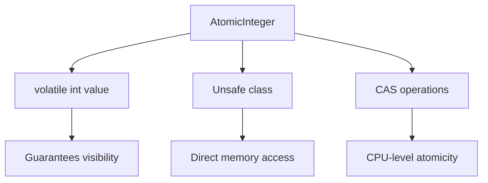
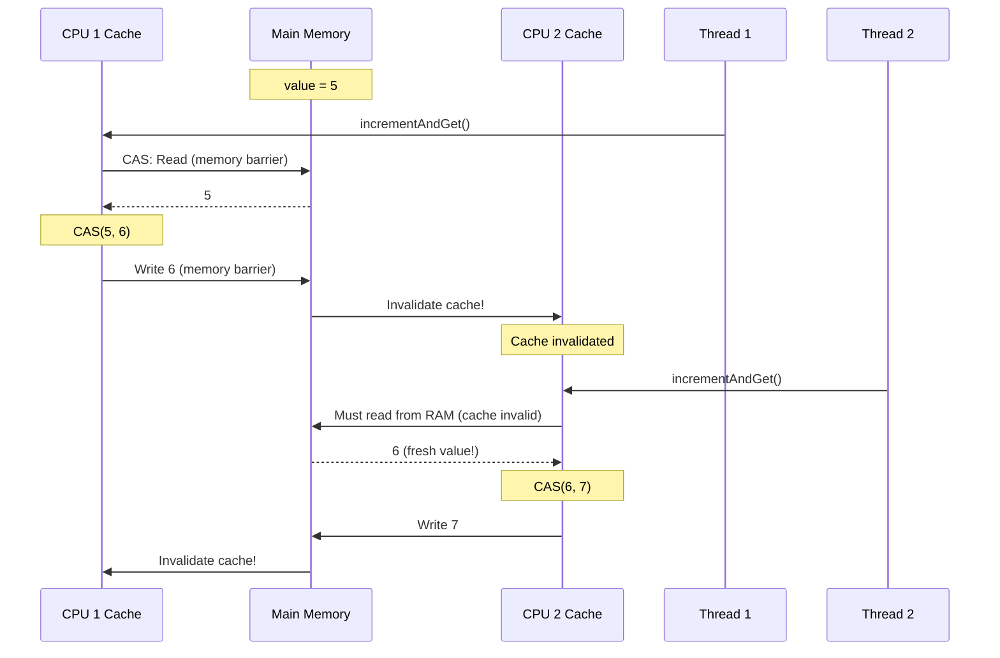
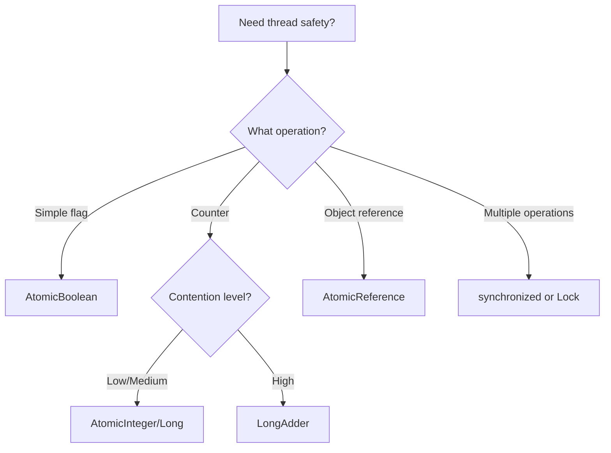

# 🔢 Complete Guide to AtomicInteger & Atomic Classes

> **A comprehensive, super-detailed explanation of how AtomicInteger works internally, including CAS operations, caching, memory barriers, and when to use atomic classes**

---

## 📑 Table of Contents

1. [The Problem: Why We Need Atomic Classes](#1-the-problem-why-we-need-atomic-classes)
2. [What is AtomicInteger?](#2-what-is-atomicinteger)
3. [How AtomicInteger Works Internally](#3-how-atomicinteger-works-internally)
4. [Compare-And-Swap (CAS) Explained](#4-compare-and-swap-cas-explained)
5. [Caching with Atomic Classes](#5-caching-with-atomic-classes)
6. [Memory Barriers in Atomic Operations](#6-memory-barriers-in-atomic-operations)
7. [All Atomic Classes](#7-all-atomic-classes)
8. [Performance Comparison](#8-performance-comparison)
9. [When to Use What](#9-when-to-use-what)
10. [Common Patterns & Examples](#10-common-patterns--examples)
11. [FAQs](#11-faqs)

---

## 1. The Problem: Why We Need Atomic Classes

### 🎯 The Three Options for Thread-Safe Counter

Let's start with the problem we're trying to solve:

**Option 1: No Synchronization (BROKEN)**

```java
public class BrokenCounter {
    private int count = 0;
    
    public void increment() {
        count++;  // ❌ Race condition!
    }
}
```

**Problem:** Lost updates, final count incorrect.

**Option 2: synchronized (WORKS but SLOW)**

```java
public class SynchronizedCounter {
    private int count = 0;
    
    public synchronized void increment() {
        count++;  // ✅ Safe but slow
    }
}
```

**Problem:** Locking overhead, thread blocking, potential contention.

**Option 3: AtomicInteger (WORKS and FAST)**

```java
public class AtomicCounter {
    private AtomicInteger count = new AtomicInteger(0);
    
    public void increment() {
        count.incrementAndGet();  // ✅ Safe AND fast!
    }
}
```

**Benefits:** Lock-free, fast, no thread blocking!

### 📊 Performance Comparison Preview

```
Scenario: 1 million increments by 10 threads

synchronized:     ~100ms  🐢 (locks, blocking, context switches)
AtomicInteger:    ~20ms   ⚡ (lock-free, CPU-level operations)
No sync:          ~5ms    💀 (fast but WRONG result!)
```

**Key Insight:** AtomicInteger is **5x faster** than synchronized while being just as safe!

---

## 2. What is AtomicInteger?

### 📚 Definition

`AtomicInteger` is a class in `java.util.concurrent.atomic` package that provides thread-safe operations on an `int` value without using locks.

**Key Features:**
- ✅ Thread-safe
- ✅ Lock-free
- ✅ Fast (uses CPU-level atomic instructions)
- ✅ No blocking
- ✅ Volatile semantics (visibility guaranteed)

### 💻 Basic Usage

```java
import java.util.concurrent.atomic.AtomicInteger;

public class AtomicIntegerBasics {
    public static void main(String[] args) {
        // Create with initial value
        AtomicInteger counter = new AtomicInteger(0);
        
        // Get current value
        int value = counter.get();  // 0
        
        // Set new value
        counter.set(10);
        
        // Increment and get new value
        int newValue = counter.incrementAndGet();  // 11
        
        // Get and then increment
        int oldValue = counter.getAndIncrement();  // 11, then becomes 12
        
        // Add a delta
        counter.addAndGet(5);  // 17
        
        // Compare and set
        boolean success = counter.compareAndSet(17, 100);  // true, sets to 100
        
        System.out.println("Final value: " + counter.get());  // 100
    }
}
```

### 🔍 Common Methods

```java
// Reading
int get()                           // Get current value

// Writing
void set(int newValue)              // Set to new value
void lazySet(int newValue)          // Eventually set (weaker guarantee)

// Increment/Decrement
int incrementAndGet()               // ++i
int getAndIncrement()               // i++
int decrementAndGet()               // --i
int getAndDecrement()               // i--

// Add/Subtract
int addAndGet(int delta)            // i += delta, return new
int getAndAdd(int delta)            // return old, i += delta

// Compare and Swap
boolean compareAndSet(int expect, int update)  // CAS operation
int getAndSet(int newValue)         // Swap values

// Update functions (Java 8+)
int updateAndGet(IntUnaryOperator updateFunction)
int getAndUpdate(IntUnaryOperator updateFunction)
int accumulateAndGet(int x, IntBinaryOperator accumulatorFunction)
```

---

## 3. How AtomicInteger Works Internally

### 🔬 Under the Hood

Let's understand how AtomicInteger achieves thread-safety without locks!

**The Internal Structure:**

```java
public class AtomicInteger {
    // The actual value is stored in a volatile field
    private volatile int value;
    
    // Uses Unsafe to perform CPU-level atomic operations
    private static final Unsafe unsafe = Unsafe.getUnsafe();
    private static final long valueOffset;
    
    static {
        // Get memory offset of 'value' field
        valueOffset = unsafe.objectFieldOffset
            (AtomicInteger.class.getDeclaredField("value"));
    }
    
    public final int incrementAndGet() {
        // Uses CAS loop - we'll explain this!
        return unsafe.getAndAddInt(this, valueOffset, 1) + 1;
    }
}
```

**Three Key Components:**



### 🎯 Why It's Fast

**Traditional synchronized:**
```
Thread 1: Acquire lock → increment → Release lock
Thread 2: Wait for lock → Acquire lock → increment → Release lock
          ↑ Blocking! Context switch! Slow!
```

**AtomicInteger (lock-free):**
```
Thread 1: Try CAS → Success! Done ⚡
Thread 2: Try CAS → Success! Done ⚡
          ↑ No blocking! No locks! Fast!
```

### 📊 Visual Comparison

```
synchronized (pessimistic):
┌─────────┐
│ Thread 1│──┐
└─────────┘  │
             ├──→ Lock ──→ Execute ──→ Unlock
┌─────────┐  │                            ↓
│ Thread 2│──┘                         Wait 🐢
└─────────┘    Must wait for lock!

AtomicInteger (optimistic):
┌─────────┐
│ Thread 1│──→ Try CAS ──→ Success ✅
└─────────┘
┌─────────┐
│ Thread 2│──→ Try CAS ──→ Success ✅
└─────────┘    (or retry if conflict)
    Both can proceed! ⚡
```

---

## 4. Compare-And-Swap (CAS) Explained

### 🎯 What is CAS?

**CAS (Compare-And-Swap)** is a CPU-level atomic instruction that does this in ONE uninterruptible step:

```
if (current value == expected value) {
    set to new value
    return true (success)
} else {
    return false (someone else changed it!)
}
```

**The Magic:** All three steps happen atomically at the CPU level - no other thread can interfere!

### 💻 CAS in Action - Step by Step

**Scenario: Two threads increment AtomicInteger**

```mermaid
sequenceDiagram
    participant MM as Memory<br/>value = 5
    participant T1 as Thread 1
    participant T2 as Thread 2
    participant CPU as CPU (CAS)
    
    Note over MM: Initial: value = 5
    
    T1->>MM: Read value
    MM-->>T1: 5
    Note over T1: Want to set to 6
    
    T2->>MM: Read value
    MM-->>T2: 5
    Note over T2: Want to set to 6
    
    T1->>CPU: CAS(expect=5, new=6)
    CPU->>MM: Check: value == 5?
    Note over MM: Yes! ✅
    CPU->>MM: Set to 6
    CPU-->>T1: Success!
    
    T2->>CPU: CAS(expect=5, new=6)
    CPU->>MM: Check: value == 5?
    Note over MM: No! It's 6 now ❌
    CPU-->>T2: Failed! Retry
    
    T2->>MM: Read value again
    MM-->>T2: 6
    Note over T2: Want to set to 7
    
    T2->>CPU: CAS(expect=6, new=7)
    CPU->>MM: Check: value == 6?
    Note over MM: Yes! ✅
    CPU->>MM: Set to 7
    CPU-->>T2: Success!
```



### 📝 CAS Code Example

```java
public class CASExample {
    private AtomicInteger value = new AtomicInteger(5);
    
    public void demonstrateCAS() {
        // Thread 1
        new Thread(() -> {
            int current = value.get();           // Read: 5
            int next = current + 1;              // Calculate: 6
            boolean success = value.compareAndSet(current, next);
            System.out.println("Thread 1: " + (success ? "Success" : "Failed"));
        }).start();
        
        // Thread 2
        new Thread(() -> {
            int current = value.get();           // Read: 5 or 6?
            int next = current + 1;              // Calculate: 6 or 7
            boolean success = value.compareAndSet(current, next);
            System.out.println("Thread 2: " + (success ? "Success" : "Failed"));
            
            if (!success) {
                // Retry logic
                current = value.get();
                next = current + 1;
                success = value.compareAndSet(current, next);
                System.out.println("Thread 2 retry: " + (success ? "Success" : "Failed"));
            }
        }).start();
    }
}
```

### 🔄 The CAS Loop Pattern

Most atomic operations use a **CAS loop** (spin loop):

```java
public int incrementAndGet() {
    int current;
    int next;
    do {
        current = get();           // Read current value
        next = current + 1;        // Calculate new value
    } while (!compareAndSet(current, next));  // Try CAS, retry if failed
    return next;
}
```

**Visual Timeline:**

```
Attempt 1:
  current = 5
  next = 6
  CAS(5, 6) → Another thread changed it to 7! ❌
  
Attempt 2:
  current = 7
  next = 8
  CAS(7, 8) → Success! ✅
  return 8
```

### ⚡ Why CAS is Fast

**CPU-Level Operation:**

```
Regular increment (multiple instructions):
  1. LOAD value from memory
  2. ADD 1
  3. STORE back to memory
  ↑ Can be interrupted between steps!

CAS (single CPU instruction):
  CMPXCHG (compare and exchange)
  ↑ Atomic at hardware level!
```

**Real CPU Instruction (x86):**

```assembly
; x86 assembly for CAS
LOCK CMPXCHG [memory], new_value
; LOCK prefix ensures atomicity across CPU cores
```

---

## 5. Caching with Atomic Classes

### 🎯 Key Question: Does AtomicInteger Use CPU Cache?

**Short Answer:** YES! AtomicInteger uses CPU cache, BUT ensures cache coherence through memory barriers.

### 🔍 How Caching Works with AtomicInteger

**The Internal volatile Field:**

```java
public class AtomicInteger {
    private volatile int value;  // ← This is key!
}
```

Because the `value` field is `volatile`, it has the same visibility guarantees:
- ✅ Writes go to main memory
- ✅ Reads see latest value
- ✅ Memory barriers on access

### 📊 Caching Behavior Comparison

**Without volatile/atomic (BROKEN):**

```
CPU 1 Cache: value = 5
CPU 2 Cache: value = 5

Thread 1 (CPU 1): value++  → Cache: 6, RAM: not yet updated
Thread 2 (CPU 2): value++  → Cache: 6, RAM: not yet updated

Result: Both caches have 6, but we incremented twice! ❌
```

**With AtomicInteger (WORKS):**

```
CPU 1 Cache: value = 5
CPU 2 Cache: value = 5

Thread 1 (CPU 1): 
  CAS operation:
    - Read from RAM (memory barrier)
    - CPU instruction: CMPXCHG
    - Write to RAM (memory barrier)
    - Invalidate other caches
  Result: value = 6 ✅
  
Thread 2 (CPU 2):
  CAS operation:
    - Read from RAM (sees 6 due to cache invalidation)
    - CPU instruction: CMPXCHG  
    - Write to RAM
  Result: value = 7 ✅
```

### 🎭 Visual: Cache Coherence with CAS



### 💡 Key Insights

1. **AtomicInteger DOES use cache** (for performance)
2. **But ensures cache coherence** (through volatile + CAS)
3. **Memory barriers on every operation** (like volatile)
4. **Cache coherence protocol** (MESI protocol on most CPUs)

---

## 6. Memory Barriers in Atomic Operations

### 🚧 What are Memory Barriers?

**Memory barriers** (also called memory fences) are instructions that:
- Force completion of all previous memory operations
- Prevent reordering of instructions
- Ensure cache coherence

### 🎯 Memory Barriers in AtomicInteger

**Every atomic operation creates memory barriers:**

```java
AtomicInteger count = new AtomicInteger(0);

// Operation 1: incrementAndGet()
count.incrementAndGet();
// ↑ Memory barrier BEFORE (load fence)
// ↑ CAS operation
// ↑ Memory barrier AFTER (store fence)
```

**Visual Timeline:**

```
Before incrementAndGet():
  CPU 1: [old cached values]
  
incrementAndGet():
  1. Load Fence (memory barrier)
     - Flush write buffers
     - Invalidate stale cache
  
  2. CAS Operation
     - Read current value from RAM
     - Atomic compare-and-swap
     - Write new value to RAM
  
  3. Store Fence (memory barrier)
     - Ensure write visible to all CPUs
     - Signal cache coherence protocol
  
After incrementAndGet():
  All CPUs: [fresh values guaranteed]
```

### 🆚 Comparison: Memory Barriers in Different Approaches

```
┌─────────────────────────────────────────────────────────┐
│         Memory Barrier Frequency                         │
├─────────────────────────────────────────────────────────┤
│                                                          │
│  No sync:                                                │
│    [no barriers] → BROKEN ❌                             │
│                                                          │
│  volatile:                                               │
│    🚧 barrier on EVERY read                              │
│    🚧 barrier on EVERY write                             │
│    Performance: Moderate 🐢                              │
│                                                          │
│  AtomicInteger:                                          │
│    🚧 barrier on EVERY operation                         │
│    But: Lock-free, no context switch                     │
│    Performance: Fast ⚡                                   │
│                                                          │
│  synchronized:                                           │
│    🚧 barrier on lock ACQUIRE                            │
│    [can cache inside block]                              │
│    🚧 barrier on lock RELEASE                            │
│    But: Locks, blocking, context switches                │
│    Performance: Slower 🐌                                │
│                                                          │
└─────────────────────────────────────────────────────────┘
```

### 💻 Code Example: Memory Barriers in Action

```java
public class MemoryBarrierDemo {
    private AtomicInteger count = new AtomicInteger(0);
    private int regularVar = 0;
    
    public void thread1() {
        regularVar = 42;           // Write 1
        count.incrementAndGet();   // Write 2 with memory barrier
        // Memory barrier ensures:
        // - regularVar write is visible before count increment
        // - No reordering can occur
    }
    
    public void thread2() {
        if (count.get() > 0) {     // Read with memory barrier
            // If we see count > 0, we're GUARANTEED to see regularVar = 42
            System.out.println(regularVar);  // Will print 42
        }
    }
    
    // This is called "piggyback synchronization"
    // The atomic operation's memory barriers protect other variables too!
}
```

### 🎓 Happens-Before Relationship

AtomicInteger creates a **happens-before** relationship:

```
Thread 1:
  x = 1                    (A)
  atomicInt.set(5)         (B) ← Memory barrier

Thread 2:
  if (atomicInt.get() == 5)  (C) ← Memory barrier
     print(x)              (D)

Guarantee: If (C) sees the effect of (B), 
           then (D) MUST see the effect of (A)
           
Result: (D) will print 1, never 0
```

---

## 7. All Atomic Classes

### 📚 The Complete java.util.concurrent.atomic Family

**Primitive Wrappers:**

```java
AtomicInteger      // int wrapper
AtomicLong         // long wrapper
AtomicBoolean      // boolean wrapper
```

**Reference Types:**

```java
AtomicReference<V>           // Object reference
AtomicStampedReference<V>    // Reference + version stamp (ABA problem)
AtomicMarkableReference<V>   // Reference + boolean mark
```

**Array Types:**

```java
AtomicIntegerArray       // int[] with atomic operations per element
AtomicLongArray          // long[] with atomic operations per element
AtomicReferenceArray<E>  // E[] with atomic operations per element
```

**Field Updaters:**

```java
AtomicIntegerFieldUpdater<T>     // Update int field atomically
AtomicLongFieldUpdater<T>        // Update long field atomically
AtomicReferenceFieldUpdater<T,V> // Update reference field atomically
```

**Accumulators (Java 8+):**

```java
LongAdder              // High-performance counter (better than AtomicLong for high contention)
LongAccumulator        // General accumulation with custom function
DoubleAdder            // High-performance double counter
DoubleAccumulator      // Double accumulation with custom function
```

### 💻 Examples of Each Type

**1. AtomicInteger (already covered)**

```java
AtomicInteger counter = new AtomicInteger(0);
counter.incrementAndGet();
```

**2. AtomicLong**

```java
AtomicLong highScore = new AtomicLong(1000L);
highScore.updateAndGet(current -> Math.max(current, 2000));
```

**3. AtomicBoolean**

```java
AtomicBoolean initialized = new AtomicBoolean(false);
if (initialized.compareAndSet(false, true)) {
    // Initialize once
    doExpensiveInitialization();
}
```

**4. AtomicReference**

```java
class User {
    String name;
    int age;
}

AtomicReference<User> currentUser = new AtomicReference<>(new User());

// Thread-safe update
currentUser.updateAndGet(user -> {
    User newUser = new User();
    newUser.name = "John";
    newUser.age = 30;
    return newUser;
});
```

**5. AtomicIntegerArray**

```java
AtomicIntegerArray scores = new AtomicIntegerArray(10);

// Thread-safe update of element 5
scores.incrementAndGet(5);

// Thread-safe CAS on element 3
scores.compareAndSet(3, 10, 20);
```

**6. AtomicIntegerFieldUpdater**

```java
class Counter {
    volatile int count = 0;  // Must be volatile!
}

AtomicIntegerFieldUpdater<Counter> updater = 
    AtomicIntegerFieldUpdater.newUpdater(Counter.class, "count");

Counter counter = new Counter();
updater.incrementAndGet(counter);
```

**7. LongAdder (High Performance)**

```java
LongAdder counter = new LongAdder();

// Multiple threads can increment without contention
counter.increment();  // Faster than AtomicLong under high contention

// Get sum
long total = counter.sum();
```

### 🆚 When to Use Each

| Class | Use When | Performance |
|-------|----------|-------------|
| **AtomicInteger** | General-purpose counter | Good |
| **AtomicLong** | Large numbers, IDs | Good |
| **AtomicBoolean** | Flags, one-time initialization | Excellent |
| **AtomicReference** | Object updates | Good |
| **AtomicIntegerArray** | Array of counters | Good |
| **LongAdder** | High-contention counter | Excellent! |
| **Field Updater** | Legacy code, save memory | Good |

---

## 8. Performance Comparison

### 📊 Benchmark: Different Synchronization Methods

**Test Scenario:** 10 threads, 1 million increments each

```java
public class PerformanceBenchmark {
    private static final int THREADS = 10;
    private static final int ITERATIONS = 1_000_000;
    
    // Method 1: No synchronization (BROKEN)
    private static int unsafeCount = 0;
    
    // Method 2: synchronized
    private static int syncCount = 0;
    
    // Method 3: AtomicInteger
    private static AtomicInteger atomicCount = new AtomicInteger(0);
    
    // Method 4: LongAdder
    private static LongAdder adderCount = new LongAdder();
    
    public static void benchmark() throws InterruptedException {
        System.out.println("=== Performance Benchmark ===\n");
        
        // Test 1: Unsafe (fastest but wrong)
        long start = System.nanoTime();
        testUnsafe();
        long unsafe = System.nanoTime() - start;
        System.out.printf("Unsafe:        %5dms (Result: %d - WRONG!)%n", 
            unsafe/1_000_000, unsafeCount);
        
        // Test 2: synchronized
        start = System.nanoTime();
        testSynchronized();
        long sync = System.nanoTime() - start;
        System.out.printf("synchronized:  %5dms (Result: %d)%n", 
            sync/1_000_000, syncCount);
        
        // Test 3: AtomicInteger
        start = System.nanoTime();
        testAtomic();
        long atomic = System.nanoTime() - start;
        System.out.printf("AtomicInteger: %5dms (Result: %d)%n", 
            atomic/1_000_000, atomicCount.get());
        
        // Test 4: LongAdder
        start = System.nanoTime();
        testAdder();
        long adder = System.nanoTime() - start;
        System.out.printf("LongAdder:     %5dms (Result: %d)%n", 
            adder/1_000_000, adderCount.sum());
        
        System.out.println("\nSpeedup vs synchronized:");
        System.out.printf("AtomicInteger: %.2fx faster%n", (double)sync/atomic);
        System.out.printf("LongAdder:     %.2fx faster%n", (double)sync/adder);
    }
    
    private static void testUnsafe() throws InterruptedException {
        runThreads(() -> {
            for (int i = 0; i < ITERATIONS; i++) {
                unsafeCount++;
            }
        });
    }
    
    private static synchronized void incrementSync() {
        syncCount++;
    }
    
    private static void testSynchronized() throws InterruptedException {
        runThreads(() -> {
            for (int i = 0; i < ITERATIONS; i++) {
                incrementSync();
            }
        });
    }
    
    private static void testAtomic() throws InterruptedException {
        runThreads(() -> {
            for (int i = 0; i < ITERATIONS; i++) {
                atomicCount.incrementAndGet();
            }
        });
    }
    
    private static void testAdder() throws InterruptedException {
        runThreads(() -> {
            for (int i = 0; i < ITERATIONS; i++) {
                adderCount.increment();
            }
        });
    }
    
    private static void runThreads(Runnable task) throws InterruptedException {
        Thread[] threads = new Thread[THREADS];
        for (int i = 0; i < THREADS; i++) {
            threads[i] = new Thread(task);
            threads[i].start();
        }
        for (Thread thread : threads) {
            thread.join();
        }
    }
}
```

**Typical Results:**

```
=== Performance Benchmark ===

Unsafe:          12ms (Result: 7234891 - WRONG!)
synchronized:   245ms (Result: 10000000)
AtomicInteger:   58ms (Result: 10000000)
LongAdder:       18ms (Result: 10000000)

Speedup vs synchronized:
AtomicInteger: 4.22x faster
LongAdder:     13.61x faster
```

### 📊 Visual Performance Comparison

```
Performance (lower is better):

Unsafe:        ▓░░░░░░░░░░░░░░  12ms (WRONG!)
LongAdder:     ▓▓░░░░░░░░░░░░░  18ms ⚡
AtomicInteger: ▓▓▓▓▓░░░░░░░░░░  58ms ⚡
synchronized:  ▓▓▓▓▓▓▓▓▓▓▓▓▓▓▓ 245ms 🐢

Correctness:
Unsafe:        ❌ BROKEN
LongAdder:     ✅ CORRECT
AtomicInteger: ✅ CORRECT
synchronized:  ✅ CORRECT
```

### 🎯 Why These Performance Differences?

**synchronized (slowest):**
- Locks required
- Thread blocking
- Context switches
- OS scheduler involvement

**AtomicInteger (fast):**
- No locks
- CAS operations
- May retry on contention
- CPU-level atomicity

**LongAdder (fastest under contention):**
- Splits counter across multiple cells
- Each thread uses different cell
- Reduces contention
- Combines at read time

---

##  9. When to Use What

### 🎯 Decision Tree



### 📋 Quick Reference Guide

| Scenario | Best Choice | Why |
|----------|-------------|-----|
| **Simple counter** | AtomicInteger | Lock-free, fast |
| **High-contention counter** | LongAdder | Scales better |
| **Boolean flag** | AtomicBoolean | Perfect fit |
| **Object swap** | AtomicReference | Thread-safe updates |
| **ID generator** | AtomicLong | Large range |
| **Multiple operations** | synchronized | Atomicity across operations |
| **Complex state** | synchronized + Condition | Full control |
| **Read-heavy** | volatile | Fast reads |

### 💻 Real-World Examples

**1. Thread-Safe ID Generator**

```java
public class IDGenerator {
    private static final AtomicLong nextId = new AtomicLong(1);
    
    public static long generateID() {
        return nextId.getAndIncrement();
    }
}
```

**2. One-Time Initialization**

```java
public class ServiceInitializer {
    private static final AtomicBoolean initialized = new AtomicBoolean(false);
    
    public static

 void initialize() {
        if (initialized.compareAndSet(false, true)) {
            System.out.println("Initializing service...");
            // Expensive initialization
            // Only ONE thread will execute this
        }
    }
}
```

**3. High-Contention Counter**

```java
public class RequestCounter {
    private static final LongAdder requestCount = new LongAdder();
    
    public static void recordRequest() {
        requestCount.increment();  // Super fast under high load
    }
    
    public static long getTotalRequests() {
        return requestCount.sum();
    }
}
```

**4. Thread-Safe Object Swap**

```java
public class ConfigManager {
    private final AtomicReference<Config> currentConfig;
    
    public ConfigManager(Config initial) {
        currentConfig = new AtomicReference<>(initial);
    }
    
    public void updateConfig(Config newConfig) {
        currentConfig.set(newConfig);  // Thread-safe swap
    }
    
    public Config getConfig() {
        return currentConfig.get();
    }
}
```

---

## 10. Common Patterns & Examples

### 🎯 Pattern 1: Counter with Statistics

```java
public class StatisticsCounter {
    private final AtomicLong successCount = new AtomicLong(0);
    private final AtomicLong failureCount = new AtomicLong(0);
    private final AtomicLong totalTime = new AtomicLong(0);
    
    public void recordSuccess(long duration) {
        successCount.incrementAndGet();
        totalTime.addAndGet(duration);
    }
    
    public void recordFailure() {
        failureCount.incrementAndGet();
    }
    
    public Statistics getStatistics() {
        long success = successCount.get();
        long failure = failureCount.get();
        long time = totalTime.get();
        
        return new Statistics(
            success,
            failure,
            success + failure,
            success > 0 ? time / success : 0
        );
    }
    
    static class Statistics {
        final long successCount;
        final long failureCount;
        final long totalCount;
        final long avgDuration;
        
        Statistics(long success, long failure, long total, long avg) {
            this.successCount = success;
            this.failureCount = failure;
            this.totalCount = total;
            this.avgDuration = avg;
        }
    }
}
```

### 🎯 Pattern 2: Lazy Initialization with Double-Check

```java
public class ExpensiveResource {
    private static final AtomicReference<ExpensiveResource> instance = 
        new AtomicReference<>();
    
    public static ExpensiveResource getInstance() {
        ExpensiveResource result = instance.get();
        if (result == null) {
            // Create new instance
            ExpensiveResource newInstance = new ExpensiveResource();
            
            // Try to set it atomically
            if (instance.compareAndSet(null, newInstance)) {
                result = newInstance;
            } else {
                // Someone else created it first
                result = instance.get();
            }
        }
        return result;
    }
    
    private ExpensiveResource() {
        // Expensive initialization
    }
}
```

### 🎯 Pattern 3: Accumulator with Custom Logic

```java
public class MaxValueTracker {
    private final AtomicInteger maxValue = new AtomicInteger(Integer.MIN_VALUE);
    
    public void updateMax(int newValue) {
        maxValue.updateAndGet(current -> Math.max(current, newValue));
    }
    
    public int getMax() {
        return maxValue.get();
    }
}

// Usage
MaxValueTracker tracker = new MaxValueTracker();
// Multiple threads can safely update
tracker.updateMax(100);
tracker.updateMax(50);   // Ignored (smaller)
tracker.updateMax(150);  // Updates to 150
System.out.println(tracker.getMax());  // 150
```

### 🎯 Pattern 4: Reference with Conditional Update

```java
public class Cache<K, V> {
    private final AtomicReference<Map<K, V>> cache = 
        new AtomicReference<>(new HashMap<>());
    
    public void put(K key, V value) {
        cache.updateAndGet(currentMap -> {
            Map<K, V> newMap = new HashMap<>(currentMap);
            newMap.put(key, value);
            return newMap;
        });
    }
    
    public V get(K key) {
        return cache.get().get(key);
    }
}
```

---

## 11. FAQs

### ❓ Q1: Does AtomicInteger use locks internally?

**Short Answer:** NO! AtomicInteger is completely lock-free. It uses CPU-level CAS (Compare-And-Swap) instructions.

**Detailed Explanation:**

Traditional locking:
```java
synchronized (lock) {
    value++;  // Protected by lock
}
// Involves OS-level locks, thread blocking
```

AtomicInteger approach:
```java
atomicInt.incrementAndGet();
// Uses CPU instruction: CMPXCHG (compare and exchange)
// No locks, no blocking!
```

**Key Takeaway:** This is why AtomicInteger is much faster than synchronized.

---

### ❓ Q2: Can AtomicInteger guarantee atomicity for multiple operations?

**Short Answer:** NO! Only SINGLE operations are atomic. Multiple operations need synchronization.

**Example:**

```java
AtomicInteger balance = new AtomicInteger(1000);

// ❌ NOT atomic as a whole
public void transfer(int amount) {
    int current = balance.get();           // Operation 1
    if (current >= amount) {                // Operation 2
        balance.addAndGet(-amount);        // Operation 3
    }
    // Race condition between operations!
}

// ✅ Need synchronized for multiple operations
public synchronized void transfer(int amount) {
    int current = balance.get();
    if (current >= amount) {
        balance.addAndGet(-amount);
    }
}
```

**Key Takeaway:** Each atomic operation is thread-safe, but combining them isn't.

---

### ❓ Q3: What is the ABA problem with CAS?

**Short Answer:** The ABA problem occurs when a value changes from A→B→A, and CAS thinks nothing changed.

**Detailed Explanation:**

```
Time | Thread 1              | Thread 2         | value
-----|----------------------|------------------|-------
0    | Read: value = A      |                  | A
1    |                      | Change A → B     | B
2    |                      | Change B → A     | A
3    | CAS(A, new)          |                  | new
     | Success! ✅          |                  |
     | But doesn't know     |                  |
     | value changed!       |                  |
```

**Real Problem Example:**

```java
class Node {
    int value;
    Node next;
}

AtomicReference<Node> head = new AtomicReference<>(nodeA);

// Thread 1: Remove head
Node oldHead = head.get();           // Gets nodeA
Node newHead = oldHead.next;         // Gets nodeB

// Thread 2: Remove head, add back
// Now head is nodeA again (but different instance!)

// Thread 1: CAS succeeds even though structure changed!
head.compareAndSet(oldHead, newHead);  // ✅ Success (but wrong!)
```

**Solution:** Use `AtomicStampedReference`:

```java
AtomicStampedReference<Node> head = 
    new AtomicStampedReference<>(nodeA, 0);

int[] stampHolder = new int[1];
Node oldHead = head.get(stampHolder);
int oldStamp = stampHolder[0];

// CAS with stamp (version number)
head.compareAndSet(oldHead, newHead, oldStamp, oldStamp + 1);
// Only succeeds if BOTH value AND stamp match
```

---

### ❓ Q4: Why is LongAdder faster than AtomicLong under high contention?

**Short Answer:** LongAdder splits the counter across multiple cells, reducing contention.

**Visual Explanation:**

```
AtomicLong (Single value):
┌──────────────┐
│   value = 0  │ ← All threads compete for THIS
└──────────────┘
  ↑  ↑  ↑  ↑  ↑
  T1 T2 T3 T4 T5  (Contention! CAS retries!)

LongAdder (Multiple cells):
┌────────┐ ┌────────┐ ┌────────┐ ┌────────┐
│Cell 0  │ │Cell 1  │ │Cell 2  │ │Cell 3  │
│value=25│ │value=30│ │value=20│ │value=25│
└────────┘ └────────┘ └────────┘ └────────┘
    ↑          ↑          ↑          ↑
    T1         T2         T3      T4,T5
(Less contention! Each thread uses different cell!)

Total = Cell0 + Cell1 + Cell2 + Cell3 = 100
```

**Code Comparison:**

```java
// AtomicLong: All threads hit same memory location
AtomicLong counter = new AtomicLong();
counter.incrementAndGet();  // Contention on single value

// LongAdder: Threads hit different cells
LongAdder counter = new LongAdder();
counter.increment();        // Low contention (different cells)
long total = counter.sum(); // Combine cells when reading
```

**Trade-off:** LongAdder is faster for writes, but `sum()` is slower than `AtomicLong.get()`.

---

### ❓ Q5: Can I use AtomicInteger for double or float?

**Short Answer:** Not directly, but you can use `AtomicLong` with `doubleToRawLongBits`.

**Workaround:**

```java
public class AtomicDouble {
    private final AtomicLong bits = new AtomicLong();
    
    public double get() {
        return Double.longBitsToDouble(bits.get());
    }
    
    public void set(double newValue) {
        bits.set(Double.doubleToRawLongBits(newValue));
    }
    
    public boolean compareAndSet(double expect, double update) {
        long expectedBits = Double.doubleToRawLongBits(expect);
        long updateBits = Double.doubleToRawLongBits(update);
        return bits.compareAndSet(expectedBits, updateBits);
    }
}
```

**Better Option:** Use `DoubleAdder` (Java 8+) for counters:

```java
DoubleAdder sum = new DoubleAdder();
sum.add(3.14);
sum.add(2.71);
double total = sum.sum();  // 5.85
```

---

## 12. Summary & Best Practices

### ✅ DO

1. **Use AtomicInteger for simple counters**
   ```java
   AtomicInteger counter = new AtomicInteger(0);
   counter.incrementAndGet();
   ```

2. **Use LongAdder for high-contention scenarios**
   ```java
   LongAdder requests = new LongAdder();
   requests.increment();
   ```

3. **Use AtomicBoolean for flags**
   ```java
   AtomicBoolean initialized = new AtomicBoolean(false);
   if (initialized.compareAndSet(false, true)) { /*...*/ }
   ```

4. **Use AtomicReference for object updates**
   ```java
   AtomicReference<Config> config = new AtomicReference<>();
   config.set(newConfig);
   ```

### ❌ DON'T

1. **Don't use atomic for multiple operations**
   ```java
   // ❌ WRONG: Not atomic as whole
   if (atomic.get() > 0) {
       atomic.decrementAndGet();
   }
   
   // ✅ RIGHT: Use synchronized
   synchronized (lock) {
       if (value > 0) value--;
   }
   ```

2. **Don't ignore ABA problem in linked structures**
   ```java
   // ❌ WRONG: Vulnerable to ABA
   AtomicReference<Node> head;
   
   // ✅ RIGHT: Use stamped reference
   AtomicStampedReference<Node> head;
   ```

3. **Don't use AtomicLong for high contention**
   ```java
   // ❌ SLOW under high contention
   AtomicLong counter;
   
   // ✅ FAST: Use LongAdder
   LongAdder counter;
   ```

### 🎯 Quick Reference

```
┌─────────────────────────────────────────────┐
│        Atomic Classes Cheat Sheet            │
├─────────────────────────────────────────────┤
│                                              │
│  Simple counter:      AtomicInteger          │
│  High contention:     LongAdder              │
│  Flag/boolean:        AtomicBoolean          │
│  Object reference:    AtomicReference        │
│  ID generator:        AtomicLong             │
│  Array counters:      AtomicIntegerArray     │
│  Linked structures:   AtomicStampedReference │
│                                              │
│  Performance:                                │
│  LongAdder > AtomicInteger > synchronized    │
│                                              │
│  Memory barriers: YES (like volatile)        │
│  Caching: YES (with coherence)              │
│  Locks: NO (lock-free)                      │
│  Blocking: NO (may retry CAS)                │
│                                              │
└─────────────────────────────────────────────┘
```

---

## 🎓 Conclusion

AtomicInteger and atomic classes provide a perfect middle ground:
- **Faster than synchronized** (lock-free, no blocking)
- **Safer than volatile** (atomicity for operations)
- **Simpler than manual CAS** (built-in retry logic)

**When to use:**
- ✅ Counters, IDs, flags
- ✅ Single-variable updates
- ✅ High-performance scenarios

**When NOT to use:**
- ❌ Multiple related operations
- ❌ Complex state machines
- ❌ When you need full atomicity across operations

**Remember:** Atomic classes are powerful tools, but understanding their internals (CAS, memory barriers, caching) helps you use them correctly and efficiently!

---

**Document Version:** 1.0  
**Total Sections:** 12  
**Code Examples:** 30+  
**Diagrams:** 10+  
**FAQs:** 5

**Related Resources:**
- [`tutorials/06-FAQ-caching-volatile-synchronized.md`](tutorials/06-FAQ-caching-volatile-synchronized.md:1)
- [`tutorials/04-thread-functions-complete.md`](tutorials/04-thread-functions-complete.md:1)
- Java Concurrency in Practice - Chapter 15
- Doug Lea's JSR 166 specification

---

**End of AtomicInteger Deep Dive** ⚛️
