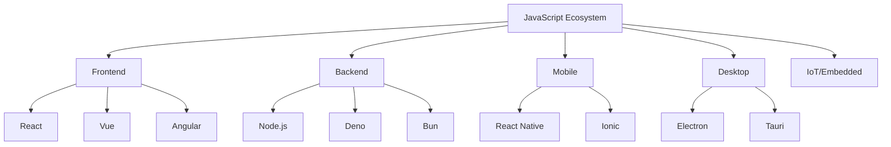
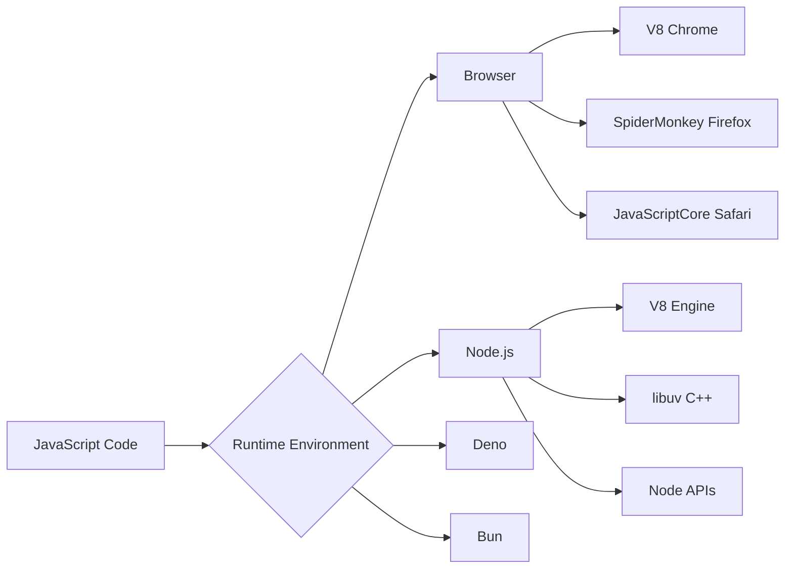
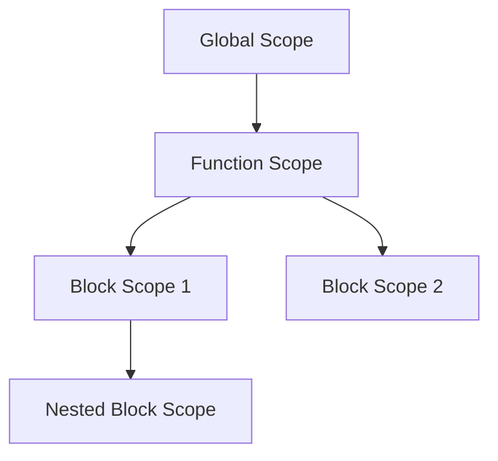

# 📘 JavaScript Fundamentals - Core Concepts for TypeScript Success

[← Back to Main](../README.md) | [Next: JavaScript Type System →](./02_javascript_types.md)

---

## 📝 Overview

JavaScript is the foundation upon which TypeScript is built. Understanding JavaScript deeply is not optional—it's essential for TypeScript mastery. This comprehensive guide covers all core JavaScript concepts you need to know before diving into TypeScript.

**Why Start with JavaScript?**
- TypeScript is a superset of JavaScript—every valid JavaScript is valid TypeScript
- Understanding JavaScript's quirks helps you appreciate TypeScript's solutions
- Strong JavaScript knowledge makes TypeScript intuitive and natural
- Many TypeScript features are based on JavaScript patterns

### 🎯 Learning Objectives

By the end of this guide, you will:

- ✅ Master JavaScript variables, data types, and operators
- ✅ Understand functions, scope, and closures deeply
- ✅ Work confidently with objects, arrays, and data structures
- ✅ Grasp JavaScript's execution model and event loop
- ✅ Write clean, maintainable JavaScript code
- ✅ Understand ES6+ features and modern JavaScript
- ✅ Recognize common JavaScript pitfalls and anti-patterns
- ✅ Build a solid foundation for TypeScript learning

### 📊 Section Info

- **Difficulty**: ⭐ Beginner-friendly
- **Estimated Time**: 3-4 hours
- **Prerequisites**: Basic programming knowledge
- **Practice Exercises**: 12 hands-on challenges
- **Version**: JavaScript ES2024 (with ES6+ focus)

---

## 📚 Table of Contents

1. [What is JavaScript?](#what-is-javascript)
2. [JavaScript Execution Environment](#execution-environment)
3. [Variables and Constants](#variables-and-constants)
4. [Data Types](#data-types)
5. [Operators](#operators)
6. [Control Flow](#control-flow)
7. [Functions](#functions)
8. [Scope and Closures](#scope-and-closures)
9. [Objects](#objects)
10. [Arrays](#arrays)
11. [Strings](#strings)
12. [Error Handling](#error-handling)
13. [Common Pitfalls](#common-pitfalls)
14. [Best Practices](#best-practices)
15. [Practice Exercises](#practice-exercises)
16. [Key Takeaways](#key-takeaways)
17. [Quick Reference](#quick-reference)
18. [Further Reading](#further-reading)

---

<a name="what-is-javascript"></a>
## 1. What is JavaScript?

### 1.1 History and Evolution

JavaScript was created by Brendan Eich in 1995 in just 10 days at Netscape. Despite its rushed creation, it has become the most popular programming language in the world.

**Key Milestones:**

| Year | Event | Impact |
|------|-------|--------|
| 1995 | Created as "Mocha", renamed to JavaScript | Born as browser scripting language |
| 1997 | ECMAScript 1 standardized | Official specification |
| 2009 | Node.js released | JavaScript on the server |
| 2015 | ES6/ES2015 released | Modern JavaScript era begins |
| 2012 | TypeScript released | Static typing for JavaScript |
| 2020+ | ES2020-ES2024 | Continuous improvements |

### 1.2 JavaScript Today



**JavaScript Powers:**
- 🌐 **Web Browsers**: All modern browsers run JavaScript
- 🖥️ **Servers**: Node.js, Deno, Bun
- 📱 **Mobile Apps**: React Native, Ionic, Cordova
- 🖥️ **Desktop Apps**: Electron, Tauri, NW.js
- 🎮 **Game Development**: Phaser, Three.js, Babylon.js
- 🤖 **Machine Learning**: TensorFlow.js, Brain.js
- ⚡ **IoT**: Johnny-Five, Espruino

### 1.3 JavaScript vs Other Languages

| Feature | JavaScript | Python | Java | C++ |
|---------|-----------|--------|------|-----|
| **Typing** | Dynamic, Weak | Dynamic, Strong | Static, Strong | Static, Strong |
| **Paradigm** | Multi-paradigm | Multi-paradigm | OOP | Multi-paradigm |
| **Runtime** | Browser, Node.js | Interpreter | JVM | Native |
| **Memory** | Garbage Collected | Garbage Collected | Garbage Collected | Manual |
| **Concurrency** | Event Loop | GIL Threading | True Threading | True Threading |
| **Use Cases** | Web, Full-stack | Data Science, Backend | Enterprise, Android | Systems, Games |

---

<a name="execution-environment"></a>
## 2. JavaScript Execution Environment

### 2.1 Where JavaScript Runs



### 2.2 JavaScript Engines

**Major JavaScript Engines:**

- **V8** (Chrome, Node.js, Deno, Edge)
  - Just-In-Time (JIT) compilation
  - Hidden classes optimization
  - Inline caching

- **SpiderMonkey** (Firefox)
  - First JavaScript engine ever
  - Advanced JIT compilation

- **JavaScriptCore** (Safari, iOS)
  - Low memory footprint
  - Optimized for mobile

### 2.3 Browser vs Node.js

```javascript
// Browser-specific APIs
console.log(window);      // ✅ Available in browser
console.log(document);    // ✅ Available in browser
console.log(localStorage); // ✅ Available in browser

// Node.js-specific APIs
console.log(process);     // ✅ Available in Node.js
console.log(__dirname);   // ✅ Available in Node.js
console.log(require);     // ✅ Available in Node.js (CommonJS)

// Universal APIs
console.log(console);     // ✅ Available everywhere
console.log(setTimeout);  // ✅ Available everywhere
console.log(Promise);     // ✅ Available everywhere
```

**Environment Detection:**

```javascript
// Detect runtime environment
const isBrowser = typeof window !== 'undefined' && typeof window.document !== 'undefined';
const isNode = typeof process !== 'undefined' && process.versions && process.versions.node;
const isDeno = typeof Deno !== 'undefined';
const isBun = typeof Bun !== 'undefined';

console.log('Running in:', {
  browser: isBrowser,
  node: isNode,
  deno: isDeno,
  bun: isBun
});
```

---

<a name="variables-and-constants"></a>
## 3. Variables and Constants

### 3.1 Variable Declaration: var, let, const

```javascript
// ❌ OLD WAY: var (avoid in modern code)
var oldWay = 'function-scoped';
var oldWay = 'can be redeclared'; // No error!

// ✅ MODERN WAY: let (for variables)
let count = 0;
count = 1; // ✅ Can be reassigned
// let count = 2; // ❌ Error: Cannot redeclare

// ✅ MODERN WAY: const (for constants)
const PI = 3.14159;
// PI = 3.14; // ❌ Error: Cannot reassign
const user = { name: 'Alice' };
user.name = 'Bob'; // ✅ Object properties can be modified
// user = {}; // ❌ Error: Cannot reassign the variable
```

### 3.2 Scoping Rules

```javascript
// GLOBAL SCOPE
const globalVar = 'I am global';

function demonstrateScope() {
  // FUNCTION SCOPE
  const functionVar = 'I am function-scoped';
  
  if (true) {
    // BLOCK SCOPE
    const blockVar = 'I am block-scoped';
    let blockLet = 'Also block-scoped';
    var functionVar2 = 'I am function-scoped (var)';
    
    console.log(blockVar); // ✅ Accessible
  }
  
  // console.log(blockVar); // ❌ Error: not defined
  console.log(functionVar2); // ✅ Accessible (var is function-scoped)
}
```

**Scope Hierarchy:**



### 3.3 Variable Hoisting

```javascript
// VAR HOISTING (confusing behavior)
console.log(hoistedVar); // undefined (not an error!)
var hoistedVar = 'I was hoisted';

// Equivalent to:
var hoistedVar;
console.log(hoistedVar); // undefined
hoistedVar = 'I was hoisted';

// LET/CONST HOISTING (temporal dead zone)
// console.log(notHoisted); // ❌ ReferenceError: Cannot access before initialization
let notHoisted = 'Better behavior';

// FUNCTION HOISTING
hoistedFunction(); // ✅ Works!
function hoistedFunction() {
  console.log('Functions are fully hoisted');
}

// Function expressions are NOT hoisted
// notHoistedFunc(); // ❌ TypeError: notHoistedFunc is not a function
const notHoistedFunc = function() {
  console.log('This does not work before declaration');
};
```

### 3.4 Best Practices for Variables

```javascript
// ✅ GOOD: Use const by default
const API_KEY = 'abc123';
const MAX_RETRIES = 3;
const config = { timeout: 5000 };

// ✅ GOOD: Use let when reassignment is needed
let counter = 0;
let currentUser = null;
let isLoading = true;

// ❌ BAD: Avoid var in modern code
var shouldNotUseVar = 'avoid this';

// ✅ GOOD: Descriptive naming
const userAuthenticated = true;
const totalPriceWithTax = 99.99;

// ❌ BAD: Unclear naming
const x = true;
const temp = 99.99;

// ✅ GOOD: Constants in UPPER_SNAKE_CASE
const MAX_FILE_SIZE = 1024 * 1024 * 5; // 5MB
const API_BASE_URL = 'https://api.example.com';

// ✅ GOOD: Variables in camelCase
const firstName = 'John';
const isLoggedIn = false;
```

---

<a name="data-types"></a>
## 4. Data Types

### 4.1 Primitive Types

JavaScript has 7 primitive data types:

```javascript
// 1. STRING
const str1 = 'Single quotes';
const str2 = "Double quotes";
const str3 = `Template literal with ${str1}`;

// 2. NUMBER (all numbers are 64-bit floating point)
const integer = 42;
const float = 3.14159;
const negative = -273.15;
const infinity = Infinity;
const notANumber = NaN;

// 3. BIGINT (for integers beyond Number.MAX_SAFE_INTEGER)
const bigNum = 9007199254740991n;
const bigNum2 = BigInt('9007199254740991');

// 4. BOOLEAN
const isTrue = true;
const isFalse = false;

// 5. UNDEFINED (uninitialized)
let uninitialized;
console.log(uninitialized); // undefined

// 6. NULL (intentional absence of value)
const empty = null;

// 7. SYMBOL (unique identifier)
const sym1 = Symbol('description');
const sym2 = Symbol('description');
console.log(sym1 === sym2); // false (unique)
```

### 4.2 Reference Types

```javascript
// OBJECT
const person = {
  name: 'Alice',
  age: 30,
  isEmployed: true
};

// ARRAY (special object)
const numbers = [1, 2, 3, 4, 5];
const mixed = [1, 'two', true, null, { key: 'value' }];

// FUNCTION (special object)
function greet(name) {
  return `Hello, ${name}!`;
}

// DATE (built-in object)
const now = new Date();

// REGEXP (regular expression)
const pattern = /hello/i;

// MAP (key-value pairs)
const map = new Map([
  ['key1', 'value1'],
  ['key2', 'value2']
]);

// SET (unique values)
const uniqueNumbers = new Set([1, 2, 2, 3, 3, 3]); // Set(3) {1, 2, 3}
```

### 4.3 Type Checking

```javascript
// typeof operator
console.log(typeof 42);                    // "number"
console.log(typeof 'hello');               // "string"
console.log(typeof true);                  // "boolean"
console.log(typeof undefined);             // "undefined"
console.log(typeof Symbol('sym'));         // "symbol"
console.log(typeof 123n);                  // "bigint"
console.log(typeof {});                    // "object"
console.log(typeof []);                    // "object" ⚠️
console.log(typeof null);                  // "object" ⚠️ (JavaScript bug)
console.log(typeof function() {});         // "function"

// Better type checking
console.log(Array.isArray([]));           // true
console.log(Array.isArray({}));           // false
console.log(Object.prototype.toString.call([])); // "[object Array]"
console.log(Object.prototype.toString.call({})); // "[object Object]"
console.log(Object.prototype.toString.call(null)); // "[object Null]"

// Check for null/undefined
const value = null;
console.log(value === null);              // true
console.log(value === undefined);         // false
console.log(value == null);               // true (loose equality)
console.log(value == undefined);          // true (loose equality)
```

### 4.4 Type Conversion and Coercion

```javascript
// EXPLICIT CONVERSION (casting)
const strNum = '42';
const num = Number(strNum);        // 42
const int = parseInt(strNum);      // 42
const float = parseFloat('3.14');  // 3.14
const str = String(123);           // '123'
const bool = Boolean(1);           // true

// IMPLICIT COERCION (automatic conversion)
console.log('5' + 3);              // '53' (number to string)
console.log('5' - 3);              // 2 (string to number)
console.log('5' * '2');            // 10 (both to numbers)
console.log(true + 1);             // 2 (true becomes 1)
console.log(false + 1);            // 1 (false becomes 0)
console.log('5' == 5);             // true (loose equality coerces)
console.log('5' === 5);            // false (strict equality, no coercion)

// TRUTHY AND FALSY VALUES
// Falsy values (become false when coerced to boolean):
console.log(Boolean(false));       // false
console.log(Boolean(0));           // false
console.log(Boolean(-0));          // false
console.log(Boolean(0n));          // false
console.log(Boolean(''));          // false
console.log(Boolean(null));        // false
console.log(Boolean(undefined));   // false
console.log(Boolean(NaN));         // false

// Everything else is truthy:
console.log(Boolean(true));        // true
console.log(Boolean(1));           // true
console.log(Boolean('0'));         // true
console.log(Boolean('false'));     // true
console.log(Boolean([]));          // true
console.log(Boolean({}));          // true
console.log(Boolean(function(){})); // true
```

---

<a name="operators"></a>
## 5. Operators

### 5.1 Arithmetic Operators

```javascript
// Basic arithmetic
console.log(10 + 5);    // 15 (addition)
console.log(10 - 5);    // 5 (subtraction)
console.log(10 * 5);    // 50 (multiplication)
console.log(10 / 5);    // 2 (division)
console.log(10 % 3);    // 1 (remainder/modulo)
console.log(10 ** 2);   // 100 (exponentiation, ES2016)

// Increment/Decrement
let count = 5;
console.log(count++);   // 5 (post-increment, returns old value)
console.log(count);     // 6
console.log(++count);   // 7 (pre-increment, returns new value)
console.log(count--);   // 7 (post-decrement)
console.log(--count);   // 5 (pre-decrement)

// Unary operators
console.log(+'-5');     // -5 (convert to number)
console.log(-10);       // -10 (negation)
```

### 5.2 Comparison Operators

```javascript
// Equality
console.log(5 == '5');   // true (loose equality, type coercion)
console.log(5 === '5');  // false (strict equality, no coercion)
console.log(5 != '5');   // false
console.log(5 !== '5');  // true

// Relational
console.log(10 > 5);     // true
console.log(10 < 5);     // false
console.log(10 >= 10);   // true
console.log(10 <= 5);    // false

// ⚠️ Comparison quirks
console.log('2' > '12'); // true (string comparison!)
console.log('2' > 12);   // false (coerced to number)
console.log(null == undefined);  // true
console.log(null === undefined); // false
```

### 5.3 Logical Operators

```javascript
// AND (&&) - returns first falsy or last truthy
console.log(true && true);      // true
console.log(true && false);     // false
console.log('hello' && 'world'); // 'world'
console.log(0 && 'never');      // 0
console.log(null && 'never');   // null

// OR (||) - returns first truthy or last falsy
console.log(true || false);     // true
console.log(false || true);     // true
console.log(0 || 'default');    // 'default'
console.log('' || 'fallback');  // 'fallback'
console.log(null || undefined); // undefined

// Nullish Coalescing (??) - returns right if left is null/undefined
console.log(0 ?? 'default');    // 0 (0 is not null/undefined)
console.log('' ?? 'default');   // '' (empty string is not null/undefined)
console.log(null ?? 'default'); // 'default'
console.log(undefined ?? 'default'); // 'default'

// NOT (!)
console.log(!true);             // false
console.log(!0);                // true
console.log(!'hello');          // false
console.log(!!'hello');         // true (double negation converts to boolean)
```

### 5.4 Assignment Operators

```javascript
let x = 10;

// Compound assignment
x += 5;    // x = x + 5;  → 15
x -= 3;    // x = x - 3;  → 12
x *= 2;    // x = x * 2;  → 24
x /= 4;    // x = x / 4;  → 6
x %= 4;    // x = x % 4;  → 2
x **= 3;   // x = x ** 3; → 8

// Logical assignment (ES2021)
let a = null;
a ??= 'default';  // a = a ?? 'default'; (assign if null/undefined)
console.log(a);   // 'default'

let b = false;
b ||= 'fallback';  // b = b || 'fallback'; (assign if falsy)
console.log(b);    // 'fallback'

let c = true;
c &&= 'new value'; // c = c && 'new value'; (assign if truthy)
console.log(c);    // 'new value'
```

### 5.5 Ternary Operator

```javascript
// condition ? valueIfTrue : valueIfFalse
const age = 20;
const canVote = age >= 18 ? 'Yes' : 'No';
console.log(canVote); // 'Yes'

// Nested ternary (use sparingly)
const score = 85;
const grade = score >= 90 ? 'A' :
              score >= 80 ? 'B' :
              score >= 70 ? 'C' :
              score >= 60 ? 'D' : 'F';
console.log(grade); // 'B'

// Better: use if-else for complex logic
let grade2;
if (score >= 90) grade2 = 'A';
else if (score >= 80) grade2 = 'B';
else if (score >= 70) grade2 = 'C';
else if (score >= 60) grade2 = 'D';
else grade2 = 'F';
```

---

<a name="control-flow"></a>
## 6. Control Flow

### 6.1 Conditional Statements

```javascript
// IF statement
const temperature = 25;

if (temperature > 30) {
  console.log('Hot day');
} else if (temperature > 20) {
  console.log('Nice day');
} else if (temperature > 10) {
  console.log('Cool day');
} else {
  console.log('Cold day');
}

// SWITCH statement
const day = 'Monday';

switch (day) {
  case 'Monday':
    console.log('Start of work week');
    break;
  case 'Tuesday':
  case 'Wednesday':
  case 'Thursday':
    console.log('Midweek');
    break;
  case 'Friday':
    console.log('Almost weekend!');
    break;
  case 'Saturday':
  case 'Sunday':
    console.log('Weekend!');
    break;
  default:
    console.log('Invalid day');
}

// Modern alternative: Object lookup
const dayMessages = {
  'Monday': 'Start of work week',
  'Friday': 'Almost weekend!',
  'Saturday': 'Weekend!',
  'Sunday': 'Weekend!'
};
console.log(dayMessages[day] || 'Midweek');
```

### 6.2 Loops

```javascript
// FOR loop
for (let i = 0; i < 5; i++) {
  console.log(i); // 0, 1, 2, 3, 4
}

// FOR...OF loop (iterate over values)
const fruits = ['apple', 'banana', 'cherry'];
for (const fruit of fruits) {
  console.log(fruit);
}

// FOR...IN loop (iterate over keys/indices)
const person = { name: 'Alice', age: 30, city: 'NYC' };
for (const key in person) {
  console.log(`${key}: ${person[key]}`);
}

// WHILE loop
let count = 0;
while (count < 5) {
  console.log(count);
  count++;
}

// DO...WHILE loop (executes at least once)
let num = 0;
do {
  console.log(num);
  num++;
} while (num < 5);

// BREAK and CONTINUE
for (let i = 0; i < 10; i++) {
  if (i === 3) continue; // Skip 3
  if (i === 7) break;    // Stop at 7
  console.log(i);         // 0, 1, 2, 4, 5, 6
}
```

### 6.3 Modern Iteration Methods

```javascript
const numbers = [1, 2, 3, 4, 5];

// forEach (no return value)
numbers.forEach((num, index) => {
  console.log(`Index ${index}: ${num}`);
});

// map (transform array)
const doubled = numbers.map(num => num * 2);
console.log(doubled); // [2, 4, 6, 8, 10]

// filter (select elements)
const evens = numbers.filter(num => num % 2 === 0);
console.log(evens); // [2, 4]

// reduce (accumulate value)
const sum = numbers.reduce((acc, num) => acc + num, 0);
console.log(sum); // 15

// find (first match)
const firstEven = numbers.find(num => num % 2 === 0);
console.log(firstEven); // 2

// some (any match)
const hasEven = numbers.some(num => num % 2 === 0);
console.log(hasEven); // true

// every (all match)
const allPositive = numbers.every(num => num > 0);
console.log(allPositive); // true
```

---

<a name="functions"></a>
## 7. Functions

### 7.1 Function Declaration

```javascript
// Traditional function declaration
function greet(name) {
  return `Hello, ${name}!`;
}
console.log(greet('Alice')); // "Hello, Alice!"

// Function with multiple parameters
function add(a, b) {
  return a + b;
}
console.log(add(5, 3)); // 8

// Function with default parameters (ES6+)
function greetWithDefault(name = 'Guest') {
  return `Hello, ${name}!`;
}
console.log(greetWithDefault());        // "Hello, Guest!"
console.log(greetWithDefault('Bob'));   // "Hello, Bob!"

// Rest parameters (ES6+)
function sum(...numbers) {
  return numbers.reduce((acc, num) => acc + num, 0);
}
console.log(sum(1, 2, 3, 4)); // 10
```

### 7.2 Function Expressions

```javascript
// Anonymous function expression
const multiply = function(a, b) {
  return a * b;
};
console.log(multiply(4, 5)); // 20

// Named function expression (useful for recursion and debugging)
const factorial = function fact(n) {
  if (n <= 1) return 1;
  return n * fact(n - 1);
};
console.log(factorial(5)); // 120
```

### 7.3 Arrow Functions (ES6+)

```javascript
// Basic arrow function
const add = (a, b) => a + b;
console.log(add(3, 4)); // 7

// Single parameter (parentheses optional)
const square = x => x * x;
console.log(square(5)); // 25

// No parameters
const getRandom = () => Math.random();
console.log(getRandom());

// Multiple statements (requires braces and explicit return)
const greetUpper = name => {
  const message = `Hello, ${name}!`;
  return message.toUpperCase();
};
console.log(greetUpper('Alice')); // "HELLO, ALICE!"

// Returning object literals (wrap in parentheses)
const createPerson = (name, age) => ({ name, age });
console.log(createPerson('Bob', 30)); // { name: 'Bob', age: 30 }
```

### 7.4 Arrow Functions vs Regular Functions

```javascript
// KEY DIFFERENCE: 'this' binding
const obj = {
  name: 'Object',
  
  regularMethod: function() {
    console.log(this.name); // 'Object' (this = obj)
  },
  
  arrowMethod: () => {
    console.log(this.name); // undefined (this = outer scope)
  },
  
  mixedMethod: function() {
    const inner = () => {
      console.log(this.name); // 'Object' (arrow function inherits this)
    };
    inner();
  }
};

obj.regularMethod(); // 'Object'
obj.arrowMethod();   // undefined
obj.mixedMethod();   // 'Object'
```

### 7.5 Higher-Order Functions

```javascript
// Functions that take functions as arguments or return functions

// Function taking function as argument
function processArray(arr, callback) {
  const result = [];
  for (const item of arr) {
    result.push(callback(item));
  }
  return result;
}

const numbers = [1, 2, 3, 4];
const doubled = processArray(numbers, x => x * 2);
console.log(doubled); // [2, 4, 6, 8]

// Function returning function
function createMultiplier(factor) {
  return function(x) {
    return x * factor;
  };
}

const double = createMultiplier(2);
const triple = createMultiplier(3);
console.log(double(5)); // 10
console.log(triple(5)); // 15
```

---

<a name="scope-and-closures"></a>
## 8. Scope and Closures

### 8.1 Lexical Scope

```javascript
// Lexical scope: inner functions have access to outer function variables
function outer() {
  const outerVar = 'I am from outer';
  
  function inner() {
    console.log(outerVar); // Can access outerVar
  }
  
  inner();
}

outer(); // "I am from outer"
```

### 8.2 Closures

```javascript
// Closure: function + its lexical environment
function createCounter() {
  let count = 0; // Private variable
  
  return {
    increment() {
      count++;
      return count;
    },
    decrement() {
      count--;
      return count;
    },
    getCount() {
      return count;
    }
  };
}

const counter =
