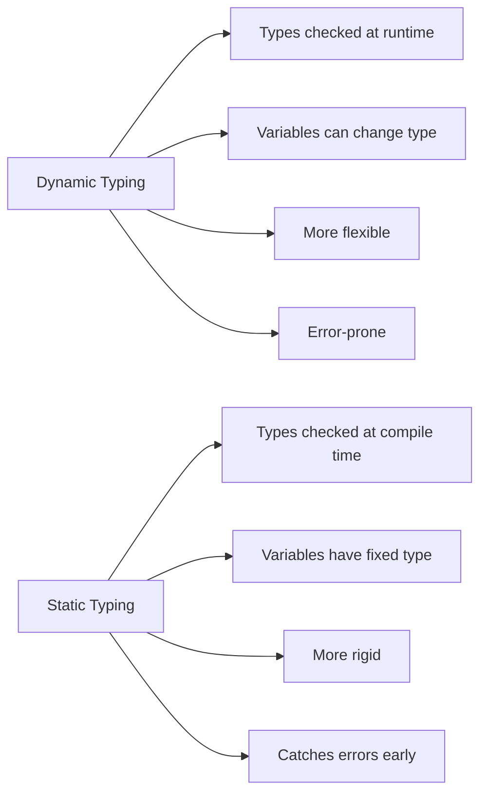
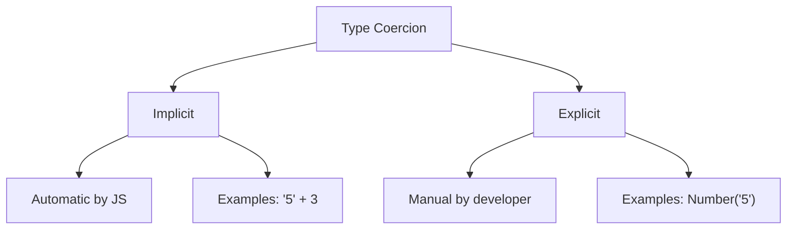
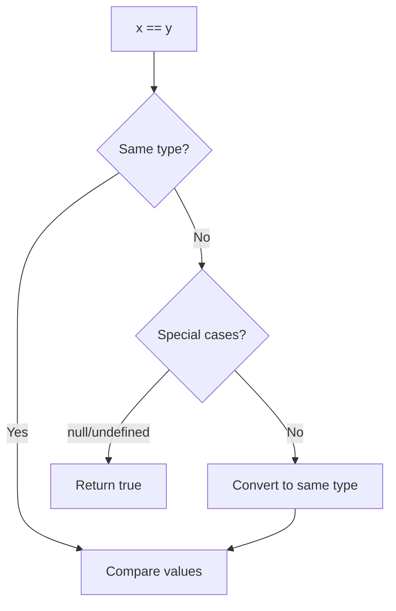

# 🔢 JavaScript Type System & Quirks - Understanding Dynamic Typing

[← Previous: JavaScript Fundamentals](./01_javascript_fundamentals.md) | [← Back to Main](../README.md) | [Next: Modern JavaScript →](./03_modern_javascript.md)

---

## 📝 Overview

JavaScript's type system is one of its most misunderstood features. As a dynamically and weakly typed language, JavaScript behaves very differently from statically typed languages. Understanding these differences is crucial before learning TypeScript, which exists precisely to address JavaScript's type-related challenges.

**Why This Matters for TypeScript:**
- TypeScript adds static typing to JavaScript
- Understanding JavaScript's type quirks helps you appreciate TypeScript's solutions
- Many TypeScript features directly address JavaScript type coercion issues
- Strong grasp of JS types makes TypeScript type annotations intuitive

### 🎯 Learning Objectives

By the end of this guide, you will:

- ✅ Understand dynamic vs static typing
- ✅ Master type coercion and conversion
- ✅ Recognize common type-related pitfalls
- ✅ Use typeof and instanceof correctly
- ✅ Handle null and undefined properly
- ✅ Understand JavaScript's equality quirks
- ✅ Write type-safe JavaScript code
- ✅ Prepare for TypeScript's type system

### 📊 Section Info

- **Difficulty**: ⭐⭐ Intermediate
- **Estimated Time**: 3-4 hours
- **Prerequisites**: [JavaScript Fundamentals](./01_javascript_fundamentals.md)
- **Practice Exercises**: 10 challenges
- **Version**: JavaScript ES2024

---

## 📚 Table of Contents

1. [Dynamic vs Static Typing](#dynamic-vs-static)
2. [Type Coercion Deep Dive](#type-coercion)
3. [Equality Operators](#equality-operators)
4. [The typeof Operator](#typeof-operator)
5. [The instanceof Operator](#instanceof-operator)
6. [Null and Undefined](#null-undefined)
7. [Type Conversion Methods](#type-conversion)
8. [Common Type Pitfalls](#common-pitfalls)
9. [Type Safety Patterns](#type-safety)
10. [Best Practices](#best-practices)
11. [Practice Exercises](#practice-exercises)
12. [Key Takeaways](#key-takeaways)
13. [Quick Reference](#quick-reference)

---

<a name="dynamic-vs-static"></a>
## 1. Dynamic vs Static Typing

### 1.1 What is Dynamic Typing?

JavaScript is **dynamically typed** - variables don't have types, values do. You can reassign any type to any variable.

```javascript
// Dynamic typing in action
let value = 42;           // number
value = "hello";          // now a string
value = true;             // now a boolean
value = { key: 'value' }; // now an object
value = [1, 2, 3];        // now an array
value = null;             // now null

// All completely valid in JavaScript!
```

**Comparison with Static Typing:**



### 1.2 Dynamic vs Static Comparison

| Feature | JavaScript (Dynamic) | TypeScript (Static) | Java (Static) |
|---------|---------------------|---------------------|---------------|
| **Type Declaration** | Not required | Optional/Required | Required |
| **Type Checking** | Runtime | Compile-time | Compile-time |
| **Type Changes** | Allowed | Not allowed | Not allowed |
| **Error Detection** | Late (runtime) | Early (development) | Early (compilation) |
| **Flexibility** | Very high | High | Lower |
| **Safety** | Lower | Higher | Highest |

```javascript
// JavaScript - Dynamic
let x = 5;
x = "hello"; // ✅ Allowed

// TypeScript - Static
let y: number = 5;
// y = "hello"; // ❌ Compile error

// Java - Static
int z = 5;
// z = "hello"; // ❌ Compile error
```

### 1.3 Weak vs Strong Typing

JavaScript is also **weakly typed** - it performs implicit type conversions (coercion).

```javascript
// Weak typing - automatic coercion
console.log("5" + 3);      // "53" (number coerced to string)
console.log("5" - 3);      // 2 (string coerced to number)
console.log(true + 1);     // 2 (boolean coerced to number)
console.log(null + 5);     // 5 (null coerced to 0)
console.log([] + []);      // "" (arrays coerced to strings)
console.log({} + []);      // "[object Object]"

// Python (strong typing) - no automatic coercion
// "5" + 3  # TypeError
// "5" - 3  # TypeError
```

---

<a name="type-coercion"></a>
## 2. Type Coercion Deep Dive

### 2.1 What is Type Coercion?

**Type coercion** is the automatic conversion of values from one type to another by JavaScript.



### 2.2 String Coercion

```javascript
// Adding ANY value to a string = string concatenation
console.log("hello" + " world");  // "hello world"
console.log("5" + 3);             // "53"
console.log("5" + true);          // "5true"
console.log("5" + null);          // "5null"
console.log("5" + undefined);     // "5undefined"
console.log("5" + [1, 2]);        // "51,2"
console.log("5" + {});            // "5[object Object]"

// Template literals also coerce to string
const num = 42;
console.log(`The answer is ${num}`); // "The answer is 42"
```

### 2.3 Numeric Coercion

```javascript
// Subtraction, multiplication, division = numeric coercion
console.log("10" - 5);       // 5 (string to number)
console.log("10" * "2");     // 20 (both to numbers)
console.log("10" / "2");     // 5 (both to numbers)
console.log("10" % "3");     // 1 (both to numbers)

// Unary plus coerces to number
console.log(+"42");          // 42
console.log(+true);          // 1
console.log(+false);         // 0
console.log(+null);          // 0
console.log(+undefined);     // NaN
console.log(+"");            // 0
console.log(+"hello");       // NaN

// Special cases
console.log("5" - "2");      // 3
console.log("5" - "hello");  // NaN
console.log("5" * "2");      // 10
console.log("5" * undefined); // NaN
```

### 2.4 Boolean Coercion

```javascript
// Falsy values (coerce to false)
console.log(Boolean(false));     // false
console.log(Boolean(0));         // false
console.log(Boolean(-0));        // false
console.log(Boolean(0n));        // false
console.log(Boolean(""));        // false
console.log(Boolean(null));      // false
console.log(Boolean(undefined)); // false
console.log(Boolean(NaN));       // false

// Truthy values (everything else)
console.log(Boolean(true));      // true
console.log(Boolean(1));         // true
console.log(Boolean(-1));        // true
console.log(Boolean("0"));       // true ⚠️ String "0" is truthy
console.log(Boolean("false"));   // true ⚠️ String "false" is truthy
console.log(Boolean([]));        // true ⚠️ Empty array is truthy
console.log(Boolean({}));        // true ⚠️ Empty object is truthy
console.log(Boolean(function(){})); // true

// Logical operators use boolean coercion
if ("hello") {
  console.log("Truthy!"); // This runs
}

if (0) {
  console.log("Won't run"); // Skipped
}
```

### 2.5 Object Coercion

```javascript
// Objects to primitives
console.log([1, 2, 3].toString());    // "1,2,3"
console.log({}.toString());           // "[object Object]"
console.log([].toString());           // ""

// valueOf vs toString
const obj = {
  toString() { return "string"; },
  valueOf() { return 42; }
};

console.log(obj + "");      // "42" (valueOf wins for +)
console.log(String(obj));   // "string" (explicit call to toString)
console.log(Number(obj));   // 42 (valueOf wins)

// Date special case
const date = new Date();
console.log(date + "");     // String representation
console.log(date + 0);      // String concatenation
console.log(+date);         // Number (milliseconds)
```

### 2.6 Coercion Edge Cases

```javascript
// Addition edge cases
console.log([] + []);          // "" (both to "")
console.log([] + {});          // "[object Object]"
console.log({} + []);          // "[object Object]" or 0 (depends on context)
console.log({} + {});          // "[object Object][object Object]" or NaN

// Comparison edge cases
console.log("2" > "12");       // true (string comparison!)
console.log("2" > 12);         // false (coerced to numbers)
console.log(null > 0);         // false
console.log(null == 0);        // false
console.log(null >= 0);        // true ⚠️

// Equality edge cases
console.log([] == ![]);        // true ⚠️
console.log([] == false);      // true
console.log("" == false);      // true
console.log(0 == "");          // true
console.log(0 == "0");         // true
console.log("0" == false);     // true
```

---

<a name="equality-operators"></a>
## 3. Equality Operators

### 3.1 Loose Equality (==)

Loose equality performs type coercion before comparison.

```javascript
// == with type coercion
console.log(5 == "5");         // true (string coerced to number)
console.log(1 == true);        // true (boolean coerced to number)
console.log(0 == false);       // true
console.log(null == undefined); // true (special case)
console.log("" == 0);          // true
console.log("0" == false);     // true

// Surprising results
console.log("" == false);      // true
console.log(" " == false);     // true
console.log("\n" == false);    // true
console.log([] == false);      // true
console.log([0] == false);     // true
```

**How == Works:**



### 3.2 Strict Equality (===)

Strict equality does NOT perform type coercion.

```javascript
// === without type coercion
console.log(5 === "5");         // false (different types)
console.log(1 === true);        // false (different types)
console.log(0 === false);       // false (different types)
console.log(null === undefined); // false (different types)
console.log("" === 0);          // false (different types)

// Same types
console.log(5 === 5);           // true
console.log("5" === "5");       // true
console.log(true === true);     // true

// Object comparison (reference equality)
const obj1 = { a: 1 };
const obj2 = { a: 1 };
const obj3 = obj1;

console.log(obj1 === obj2);     // false (different objects)
console.log(obj1 === obj3);     // true (same reference)

// NaN special case
console.log(NaN === NaN);       // false ⚠️
console.log(Number.isNaN(NaN)); // true (correct way)
```

### 3.3 Comparison Table

| Comparison | == Result | === Result | Explanation |
|------------|-----------|------------|-------------|
| `5 == "5"` | `true` | `false` | String coerced to number |
| `1 == true` | `true` | `false` | Boolean coerced to number |
| `0 == false` | `true` | `false` | Boolean coerced to number |
| `null == undefined` | `true` | `false` | Special == rule |
| `"" == false` | `true` | `false` | Both coerced to 0 |
| `[] == false` | `true` | `false` | Array coerced to "" then 0 |
| `NaN == NaN` | `false` | `false` | NaN is never equal to anything |

### 3.4 Best Practice

```javascript
// ❌ BAD: Use loose equality
if (x == 5) { }
if (y == null) { }
if (z == true) { }

// ✅ GOOD: Use strict equality
if (x === 5) { }
if (y === null || y === undefined) { }
if (z === true) { }

// ✅ BETTER: Check for nullish
if (y == null) { } // Only exception where == is OK
// Equivalent to: y === null || y === undefined
```

---

<a name="typeof-operator"></a>
## 4. The typeof Operator

### 4.1 typeof Basics

```javascript
// Primitive types
console.log(typeof 42);                // "number"
console.log(typeof 3.14);              // "number"
console.log(typeof NaN);               // "number" ⚠️
console.log(typeof Infinity);          // "number"
console.log(typeof "hello");           // "string"
console.log(typeof true);              // "boolean"
console.log(typeof undefined);         // "undefined"
console.log(typeof Symbol("id"));      // "symbol"
console.log(typeof 123n);              // "bigint"

// Reference types
console.log(typeof {});                // "object"
console.log(typeof []);                // "object" ⚠️
console.log(typeof null);              // "object" ⚠️ (JavaScript bug)
console.log(typeof function(){});      // "function"
console.log(typeof class{});           // "function"
```

### 4.2 typeof Limitations

```javascript
// Cannot distinguish between objects
console.log(typeof []);                // "object"
console.log(typeof {});                // "object"
console.log(typeof null);              // "object" (bug!)
console.log(typeof new Date());        // "object"
console.log(typeof /regex/);           // "object"

// Solution: Use more specific checks
console.log(Array.isArray([]));        // true
console.log(value === null);           // true
console.log(value instanceof Date);    // true
console.log(value instanceof RegExp);  // true
```

### 4.3 Type Checking Patterns

```javascript
// Check for specific types
function checkType(value) {
  // Number
  if (typeof value === 'number' && !isNaN(value)) {
    return 'valid number';
  }
  
  // String
  if (typeof value === 'string') {
    return 'string';
  }
  
  // Boolean
  if (typeof value === 'boolean') {
    return 'boolean';
  }
  
  // Array
  if (Array.isArray(value)) {
    return 'array';
  }
  
  // Null
  if (value === null) {
    return 'null';
  }
  
  // Object
  if (typeof value === 'object') {
    return 'object';
  }
  
  // Function
  if (typeof value === 'function') {
    return 'function';
  }
  
  // Undefined
  return 'undefined';
}
```

---

<a name="instanceof-operator"></a>
## 5. The instanceof Operator

### 5.1 instanceof Basics

```javascript
// Check if object is instance of constructor
class Person {}
class Animal {}

const john = new Person();
const dog = new Animal();

console.log(john instanceof Person);   // true
console.log(john instanceof Animal);   // false
console.log(dog instanceof Animal);    // true

// Built-in types
console.log([] instanceof Array);      // true
console.log([] instanceof Object);     // true (Array extends Object)
console.log(new Date() instanceof Date); // true
console.log(/regex/ instanceof RegExp); // true
console.log(function(){} instanceof Function); // true
```

### 5.2 instanceof vs typeof

```javascript
const arr = [1, 2, 3];
const obj = { a: 1 };
const date = new Date();

// typeof - returns string
console.log(typeof arr);              // "object"
console.log(typeof obj);              // "object"
console.log(typeof date);             // "object"

// instanceof - returns boolean
console.log(arr instanceof Array);    // true
console.log(arr instanceof Object);   // true
console.log(obj instanceof Array);    // false
console.log(date instanceof Date);    // true
```

### 5.3 instanceof Limitations

```javascript
// Doesn't work with primitives
console.log("hello" instanceof String);  // false
console.log(42 instanceof Number);       // false

// But works with wrapper objects
console.log(new String("hello") instanceof String); // true
console.log(new Number(42) instanceof Number);      // true

// Doesn't work across iframes/windows
const iframe = document.createElement('iframe');
document.body.appendChild(iframe);
const iframeArray = iframe.contentWindow.Array;
const myArray = new iframeArray();

console.log(myArray instanceof Array);        // false
console.log(Array.isArray(myArray));          // true (better!)
```

---

<a name="null-undefined"></a>
## 6. Null and Undefined

### 6.1 Understanding the Difference

```javascript
//  UNDEFINED - variable declared but not assigned
let uninit;
console.log(uninit);                  // undefined
console.log(typeof uninit);           // "undefined"

// NULL - intentional absence of value
let empty = null;
console.log(empty);                   // null
console.log(typeof empty);            // "object" (bug!)

// Missing object properties
const obj = { a: 1 };
console.log(obj.b);                   // undefined
console.log(obj.b === undefined);     // true

// Function without return
function noReturn() {}
console.log(noReturn());              // undefined

// Array holes
const arr = [1, , 3];
console.log(arr[1]);                  // undefined
```

### 6.2 Comparison Behavior

```javascript
// Loose equality
console.log(null == undefined);       // true
console.log(null == 0);               // false
console.log(undefined == 0);          // false

// Strict equality
console.log(null === undefined);      // false
console.log(null === null);           // true
console.log(undefined === undefined); // true

// Comparisons
console.log(null > 0);                // false
console.log(null >= 0);               // true ⚠️
console.log(null < 0);                // false
console.log(undefined > 0);           // false
console.log(undefined < 0);           // false
```

### 6.3 Best Practices

```javascript
// ❌ BAD: Ambiguous undefined
let value;
if (value === undefined) { }

// ✅ GOOD: Explicit null for "no value"
let value = null;
if (value === null) { }

// ✅ GOOD: Check for nullish (null or undefined)
if (value == null) { }  // One of few cases where == is OK
if (value === null || value === undefined) { } // More explicit

// ✅ BETTER: Use nullish coalescing
const result = value ?? 'default';

// ✅ GOOD: Optional chaining
const name = user?.profile?.name;
```

---

<a name="type-conversion"></a>
## 7. Type Conversion Methods

### 7.1 To String

```javascript
// String() function
console.log(String(42));              // "42"
console.log(String(true));            // "true"
console.log(String(null));            // "null"
console.log(String(undefined));       // "undefined"
console.log(String([1, 2, 3]));       // "1,2,3"
console.log(String({a: 1}));          // "[object Object]"

// toString() method
console.log((42).toString());         // "42"
console.log(true.toString());         // "true"
console.log([1, 2].toString());       // "1,2"

// Template literals
const num = 42;
console.log(`${num}`);                // "42"

// Concatenation with empty string
console.log(42 + "");                 // "42"
```

### 7.2 To Number

```javascript
// Number() function
console.log(Number("42"));            // 42
console.log(Number("3.14"));          // 3.14
console.log(Number(""));              // 0
console.log(Number(" "));             // 0
console.log(Number(true));            // 1
console.log(Number(false));           // 0
console.log(Number(null));            // 0
console.log(Number(undefined));       // NaN
console.log(Number("hello"));         // NaN

// parseInt() and parseFloat()
console.log(parseInt("42"));          // 42
console.log(parseInt("42.99"));       // 42 (ignores decimal)
console.log(parseInt("42px"));        // 42 (stops at non-digit)
console.log(parseFloat("3.14"));      // 3.14
console.log(parseFloat("3.14.15"));   // 3.14 (stops at second dot)

// Unary plus operator
console.log(+"42");                   // 42
console.log(+true);                   // 1
console.log(+null);                   // 0
```

### 7.3 To Boolean

```javascript
// Boolean() function
console.log(Boolean(1));              // true
console.log(Boolean(0));              // false
console.log(Boolean("hello"));        // true
console.log(Boolean(""));             // false
console.log(Boolean([]));             // true
console.log(Boolean({}));             // true
console.log(Boolean(null));           // false
console.log(Boolean(undefined));      // false

// Double NOT operator
console.log(!!"hello");               // true
console.log(!!0);                     // false
console.log(!!"");                    // false
console.log(!![]);                    // true
```

---

<a name="common-pitfalls"></a>
## 8. Common Type Pitfalls

### 8.1 Addition vs Concatenation

```javascript
// Watch out for + operator
console.log(1 + 2);                   // 3 (addition)
console.log("1" + 2);                 // "12" (concatenation)
console.log(1 + "2");                 // "12" (concatenation)
console.log(1 + 2 + "3");             // "33" (left-to-right)
console.log("1" + 2 + 3);             // "123" (all concatenation)

// ✅ Solution: Convert explicitly
console.log(Number("1") + 2);         // 3
console.log(parseInt("1") + 2);       // 3
```

### 8.2 NaN Pitfalls

```javascript
// NaN is a number!
console.log(typeof NaN);              // "number"

// NaN is not equal to anything
console.log(NaN === NaN);             // false
console.log(NaN == NaN);              // false

// Check for NaN correctly
console.log(isNaN(NaN));              // true
console.log(isNaN("hello"));          // true (coerces to NaN)
console.log(Number.isNaN(NaN));       // true
console.log(Number.isNaN("hello"));   // false (doesn't coerce)

// Operations producing NaN
console.log(0 / 0);                   // NaN
console.log(Math.sqrt(-1));           // NaN
console.log(parseInt("hello"));       // NaN
console.log(undefined + 5);           // NaN
```

### 8.3 Array Type Confusion

```javascript
// Arrays are objects
console.log(typeof []);               // "object"
console.log([] instanceof Object);    // true

// Empty array is truthy
if ([]) {
  console.log("This runs!"); // Surprise!
}

// Array equality
console.log([] == []);                // false (different references)
console.log([] == false);             // true (coercion)

// ✅ Solution: Use Array.isArray()
console.log(Array.isArray([]));       // true
```

---

<a name="type-safety"></a>
## 9. Type Safety Patterns

### 9.1 Type Guards

```javascript
// Type checking functions
function isString(value) {
  return typeof value === 'string';
}

function isNumber(value) {
  return typeof value === 'number' && !isNaN(value);
}

function isArray(value) {
  return Array.isArray(value);
}

function isObject(value) {
  return value !== null && typeof value === 'object' && !Array.isArray(value);
}

// Usage
function processValue(value) {
  if (isString(value)) {
    return value.toUpperCase();
  }
  if (isNumber(value)) {
    return value * 2;
  }
  if (isArray(value)) {
    return value.length;
  }
  return null;
}
```

### 9.2 Input Validation

```javascript
// Validate and convert safely
function safeParseInt(value, defaultValue = 0) {
  const parsed = parseInt(value);
  return isNaN(parsed) ? defaultValue : parsed;
}

function safeString(value, defaultValue = '') {
  return typeof value === 'string' ? value : String(value || defaultValue);
}

// Usage
console.log(safeParseInt("42"));      // 42
console.log(safeParseInt("hello"));   // 0
console.log(safeString(null));        // ""
console.log(safeString(undefined));   // ""
```

---

<a name="best-practices"></a>
## 10. Best Practices

### 10.1 Type Safety Rules

```javascript
// ✅ DO: Use === instead of ==
if (x === 5) { }

// ✅ DO: Check types explicitly
if (typeof x === 'number') { }

// ✅ DO: Use Array.isArray()
if (Array.isArray(arr)) { }

// ✅ DO: Check for nullish explicitly
if (x === null || x === undefined) { }
// OR
if (x == null) { } // Only exception where == is OK

// ✅ DO: Use Number.isNaN() instead of isNaN()
if (Number.isNaN(value)) { }

// ❌ DON'T: Rely on type coercion
if (x == 5) { } // Bad
if ("0" == false) { } // Bad

// ❌ DON'T: Use typeof for null
if (typeof x === 'null') { } // Won't work!
```

---

<a name="practice-exercises"></a>
## 11. Practice Exercises

### Exercise 1: Type Detective
```javascript
// What will these output?
console.log(typeof typeof 42);
console.log(typeof null);
console.log(typeof []);
console.log([] instanceof Array);
console.log(null instanceof Object);
```

<details>
<summary>View Solution</summary>

```javascript
console.log(typeof typeof 42);        // "string" (typeof returns a string)
console.log(typeof null);             // "object" (JavaScript bug)
console.log(typeof []);               // "object"
console.log([] instanceof Array);     // true
console.log(null instanceof Object);  // false
```
</details>

### Exercise 2: Coercion Confusion
```javascript
// Predict the output
console.log(1 + "2" + 3);
console.log(1 + 2 + "3");
console.log("1" - "2" + "3");
console.log([] + []);
console.log({} + []);
```

<details>
<summary>View Solution</summary>

```javascript
console.log(1 + "2" + 3);    // "123" (left-to-right, string concat)
console.log(1 + 2 + "3");    // "33" (3 + "3")
console.log("1" - "2" + "3"); // "-13" (-1 + "3")
console.log([] + []);        // "" (both to "", concat)
console.log({} + []);        // "[object Object]" or 0 (context-dependent)
```
</details>

---

<a name="key-takeaways"></a>
## 12. Key Takeaways

✅ **JavaScript is dynamically and weakly typed** - variables can hold any type, and types coerce automatically

✅ **Use === instead of ==** - avoid type coercion in comparisons

✅ **typeof has limitations** - returns "object" for arrays and null

✅ **null and undefined are different** - use == null to check both, or be explicit

✅ **NaN is special** - use Number.is
