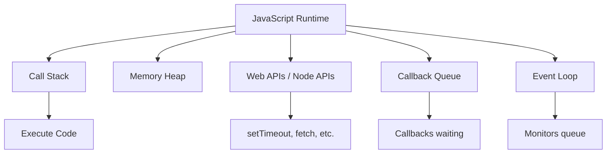
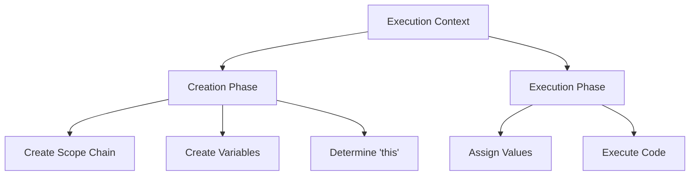
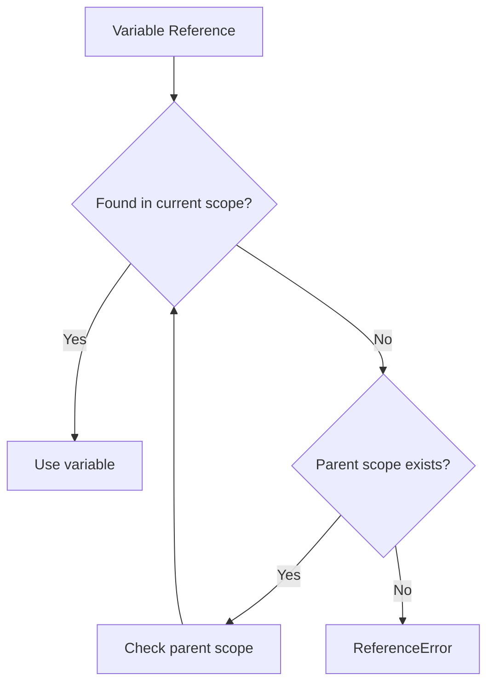
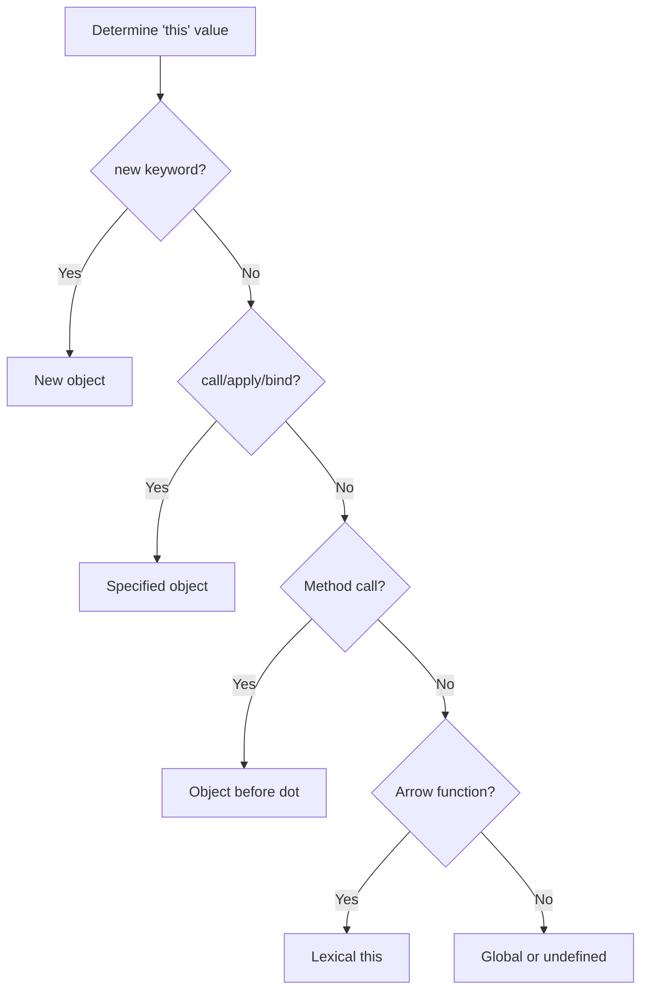
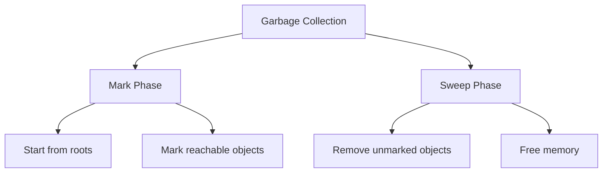

# ⚙️ JavaScript Execution Model - How JavaScript Really Works

[← Previous: Modern JavaScript](./03_modern_javascript.md) | [← Back to Main](../README.md) | [Next: Async JavaScript →](./05_async_javascript.md)

---

## 📝 Overview

Understanding how JavaScript executes code is fundamental to writing efficient, bug-free applications and mastering TypeScript. This guide explores JavaScript's single-threaded execution model, the call stack, execution contexts, and memory management.

**Why This Matters for TypeScript:**
- TypeScript compiles to JavaScript—understanding the runtime is crucial
- Execution model affects async patterns and performance
- Understanding closures and scope is essential for TypeScript features
- Memory management knowledge helps prevent leaks

### 🎯 Learning Objectives

By the end of this guide, you will:

- ✅ Understand JavaScript's single-threaded execution model
- ✅ Master the call stack and execution contexts
- ✅ Grasp scope chain and variable resolution
- ✅ Understand closures deeply
- ✅ Learn memory management and garbage collection
- ✅ Understand hoisting mechanism
- ✅ Master the 'this' keyword
- ✅ Understand execution phases

### 📊 Section Info

- **Difficulty**: ⭐⭐ Intermediate
- **Estimated Time**: 3-4 hours
- **Prerequisites**: [JavaScript Fundamentals](./01_javascript_fundamentals.md), [Modern JavaScript](./03_modern_javascript.md)
- **Practice Exercises**: 8 challenges
- **Version**: ES2024

---

## 📚 Table of Contents

1. [JavaScript Runtime Architecture](#runtime-architecture)
2. [The Call Stack](#call-stack)
3. [Execution Contexts](#execution-contexts)
4. [Scope Chain](#scope-chain)
5. [Closures](#closures)
6. [Hoisting](#hoisting)
7. [The 'this' Keyword](#this-keyword)
8. [Memory Management](#memory-management)

---

<a name="runtime-architecture"></a>
## 1. JavaScript Runtime Architecture

### 1.1 Single-Threaded Nature

JavaScript is **single-threaded**, meaning it executes one piece of code at a time.



**Key Components:**

| Component | Purpose | Example |
|-----------|---------|---------|
| **Call Stack** | Tracks function execution | Function calls |
| **Memory Heap** | Stores objects and variables | Objects, arrays |
| **Web/Node APIs** | Async operations | setTimeout, fetch |
| **Callback Queue** | Stores callbacks | Event handlers |
| **Event Loop** | Manages async execution | Checks queue |

### 1.2 JavaScript Engine Components

```javascript
// JavaScript Engine Architecture
/*
┌─────────────────────────────────┐
│     JavaScript Engine (V8)      │
├─────────────────────────────────┤
│  1. Parser                      │
│     - Lexical Analysis          │
│     - Syntax Analysis           │
│                                 │
│  2. AST (Abstract Syntax Tree)  │
│     - Code representation       │
│                                 │
│  3. Interpreter (Ignition)      │
│     - Bytecode generation       │
│     - Quick execution           │
│                                 │
│  4. Compiler (TurboFan)         │
│     - JIT compilation           │
│     - Optimization              │
│                                 │
│  5. Execution                   │
│     - Run optimized code        │
└─────────────────────────────────┘
*/

// Example: How code gets executed
function add(a, b) {
  return a + b;
}

const result = add(5, 3);
// 1. Parsed into AST
// 2. Converted to bytecode
// 3. Executed by interpreter
// 4. Hot functions compiled by JIT
// 5. Optimized code runs faster
```

---

<a name="call-stack"></a>
## 2. The Call Stack

### 2.1 Understanding the Call Stack

The call stack is a **LIFO** (Last In, First Out) data structure that tracks function execution.

```javascript
// Call stack visualization
function first() {
  console.log('First function');
  second();
  console.log('First function end');
}

function second() {
  console.log('Second function');
  third();
  console.log('Second function end');
}

function third() {
  console.log('Third function');
}

first();

/* Call Stack Progression:
1. [first]
2. [first, second]
3. [first, second, third]
4. [first, second]  // third completes
5. [first]          // second completes
6. []               // first completes
*/
```

### 2.2 Stack Overflow

```javascript
// Stack overflow example
function recursiveFunction() {
  recursiveFunction(); // No base case!
}

// recursiveFunction(); // ❌ RangeError: Maximum call stack size exceeded

// ✅ CORRECT: With base case
function countdown(n) {
  if (n <= 0) return; // Base case
  console.log(n);
  countdown(n - 1);
}

countdown(5); // 5, 4, 3, 2, 1
```

### 2.3 Call Stack Example with Errors

```javascript
function a() {
  b();
}

function b() {
  c();
}

function c() {
  throw new Error('Something went wrong!');
}

try {
  a();
} catch (error) {
  console.error(error.stack);
  /*
  Error: Something went wrong!
      at c (file.js:10)
      at b (file.js:6)
      at a (file.js:2)
      at <anonymous> (file.js:14)
  */
}
```

---

<a name="execution-contexts"></a>
## 3. Execution Contexts

### 3.1 What is an Execution Context?

An execution context is an environment where JavaScript code is executed. It contains:
- **Variable Environment**: Variables, functions, arguments
- **Scope Chain**: Access to outer variables
- **'this' Binding**: Reference to current object



### 3.2 Types of Execution Contexts

```javascript
// 1. GLOBAL EXECUTION CONTEXT
const globalVar = 'I am global';

// 2. FUNCTION EXECUTION CONTEXT
function myFunction() {
  const localVar = 'I am local';
  
  // 3. EVAL EXECUTION CONTEXT (avoid using eval)
  // eval('const evalVar = "I am eval"');
}

myFunction();
```

### 3.3 Execution Context Lifecycle

```javascript
// Execution context lifecycle example
let x = 10;

function outer() {
  let y = 20;
  
  function inner() {
    let z = 30;
    console.log(x + y + z); // 60
  }
  
  inner();
}

outer();

/*
Phase 1: CREATION
─────────────────
Global Context:
  - x: undefined
  - outer: function

outer() Context:
  - y: undefined
  - inner: function
  
inner() Context:
  - z: undefined

Phase 2: EXECUTION
──────────────────
Global Context:
  - x: 10
  - Execute outer()

outer() Context:
  - y: 20
  - Execute inner()
  
inner() Context:
  - z: 30
  - Calculate and log result
*/
```

### 3.4 Variable Environment

```javascript
function demonstrateContext() {
  // Variable Environment includes:
  
  // 1. Function parameters
  function greet(name) {
    console.log(`Hello, ${name}`);
  }
  
  // 2. Inner function declarations
  function helper() {
    return 'Helper function';
  }
  
  // 3. Local variables
  let localVar = 'Local';
  const constant = 'Constant';
  
  // 4. 'arguments' object (in non-arrow functions)
  console.log(arguments);
}

demonstrateContext('arg1', 'arg2');
```

---

<a name="scope-chain"></a>
## 4. Scope Chain

### 4.1 Understanding Scope Chain

The scope chain is the mechanism JavaScript uses to resolve variable references.

```javascript
// Scope chain example
const global = 'Global';

function outer() {
  const outerVar = 'Outer';
  
  function middle() {
    const middleVar = 'Middle';
    
    function inner() {
      const innerVar = 'Inner';
      
      // Scope chain: inner → middle → outer → global
      console.log(innerVar);   // ✅ Found in inner scope
      console.log(middleVar);  // ✅ Found in middle scope
      console.log(outerVar);   // ✅ Found in outer scope
      console.log(global);     // ✅ Found in global scope
    }
    
    inner();
  }
  
  middle();
}

outer();
```

### 4.2 Lexical Scoping

JavaScript uses **lexical scoping** (static scoping) - scope is determined by code structure, not runtime.

```javascript
const x = 'global';

function a() {
  const x = 'function a';
  b();
}

function b() {
  console.log(x); // 'global' - uses lexical scope
}

a(); // Logs: 'global' (not 'function a')
```

### 4.3 Scope Chain Resolution



```javascript
function scopeResolution() {
  let a = 1;
  
  function inner() {
    let b = 2;
    
    function deepInner() {
      let c = 3;
      
      console.log(a); // Searches: deepInner → inner → scopeResolution ✅
      console.log(b); // Searches: deepInner → inner ✅
      console.log(c); // Searches: deepInner ✅
      // console.log(d); // ❌ ReferenceError
    }
    
    deepInner();
  }
  
  inner();
}

scopeResolution();
```

---

<a name="closures"></a>
## 5. Closures

### 5.1 What is a Closure?

A closure is a function that has access to variables in its outer (enclosing) lexical scope, even after the outer function has returned.

```javascript
// Basic closure example
function createCounter() {
  let count = 0; // Private variable
  
  return function() {
    count++;
    return count;
  };
}

const counter = createCounter();
console.log(counter()); // 1
console.log(counter()); // 2
console.log(counter()); // 3

// count is not accessible from outside
// console.log(count); // ❌ ReferenceError
```

### 5.2 Closure in Action

```javascript
// Practical closure examples

// 1. Data Privacy
function bankAccount(initialBalance) {
  let balance = initialBalance; // Private
  
  return {
    deposit(amount) {
      balance += amount;
      return balance;
    },
    withdraw(amount) {
      if (amount > balance) {
        return 'Insufficient funds';
      }
      balance -= amount;
      return balance;
    },
    getBalance() {
      return balance;
    }
  };
}

const account = bankAccount(1000);
console.log(account.deposit(500));    // 1500
console.log(account.withdraw(200));   // 1300
console.log(account.getBalance());    // 1300
// console.log(account.balance);      // undefined (private!)

// 2. Function Factory
function multiplier(factor) {
  return function(number) {
    return number * factor;
  };
}

const double = multiplier(2);
const triple = multiplier(3);

console.log(double(5));  // 10
console.log(triple(5));  // 15

// 3. Event Handlers
function attachHandler() {
  let clickCount = 0;
  
  document.getElementById('btn').addEventListener('click', function() {
    clickCount++;
    console.log(`Clicked ${clickCount} times`);
  });
}
```

### 5.3 Common Closure Pitfalls

```javascript
// ❌ PROBLEM: Loop with var
for (var i = 0; i < 3; i++) {
  setTimeout(function() {
    console.log(i); // 3, 3, 3 (not 0, 1, 2)
  }, 1000);
}

// ✅ SOLUTION 1: Use let (block scope)
for (let i = 0; i < 3; i++) {
  setTimeout(function() {
    console.log(i); // 0, 1, 2
  }, 1000);
}

// ✅ SOLUTION 2: IIFE with var
for (var i = 0; i < 3; i++) {
  (function(j) {
    setTimeout(function() {
      console.log(j); // 0, 1, 2
    }, 1000);
  })(i);
}

// ✅ SOLUTION 3: Pass parameter
for (var i = 0; i < 3; i++) {
  setTimeout(function(index) {
    console.log(index); // 0, 1, 2
  }, 1000, i);
}
```

### 5.4 Memory Considerations

```javascript
// Closures and memory

// ⚠️ CAUTION: Closures keep references
function createHeavyObject() {
  const heavy = new Array(1000000).fill('data');
  
  return function() {
    // Even if we don't use 'heavy', it's kept in memory
    return 'done';
  };
}

// ✅ BETTER: Only close over what you need
function createOptimized() {
  const heavy = new Array(1000000).fill('data');
  const needed = heavy[0];
  
  return function() {
    return needed; // Only 'needed' is kept in memory
  };
}
```

---

<a name="hoisting"></a>
## 6. Hoisting

### 6.1 What is Hoisting?

Hoisting is JavaScript's behavior of moving declarations to the top of their scope during the creation phase.

```javascript
// What you write:
console.log(x); // undefined
var x = 5;
greet(); // "Hello!"
function greet() {
  console.log('Hello!');
}

// How JavaScript interprets it:
var x; // Declaration hoisted
function greet() { // Function hoisted
  console.log('Hello!');
}
console.log(x); // undefined
x = 5; // Assignment stays
greet(); // "Hello!"
```

### 6.2 Variable Hoisting

```javascript
// VAR hoisting
console.log(a); // undefined (hoisted, not initialized)
var a = 10;
console.log(a); // 10

// LET/CONST hoisting (Temporal Dead Zone)
// console.log(b); // ❌ ReferenceError: Cannot access before initialization
let b = 20;
console.log(b); // 20

// console.log(c); // ❌ ReferenceError: Cannot access before initialization
const c = 30;
console.log(c); // 30
```

### 6.3 Function Hoisting

```javascript
// Function declarations are fully hoisted
greet(); // ✅ Works!
function greet() {
  console.log('Hello!');
}

// Function expressions are NOT hoisted
// sayHi(); // ❌ TypeError: sayHi is not a function
const sayHi = function() {
  console.log('Hi!');
};
sayHi(); // ✅ Works after declaration

// Arrow functions are NOT hoisted
// wave(); // ❌ TypeError: wave is not a function
const wave = () => {
  console.log('Wave!');
};
wave(); // ✅ Works after declaration
```

### 6.4 Class Hoisting

```javascript
// Classes are hoisted but not initialized (TDZ)
// const p = new Person(); // ❌ ReferenceError

class Person {
  constructor(name) {
    this.name = name;
  }
}

const p = new Person('Alice'); // ✅ Works
```

---

<a name="this-keyword"></a>
## 7. The 'this' Keyword

### 7.1 Understanding 'this'

The value of `this` depends on **how** a function is called, not where it's defined.

```javascript
// 'this' in different contexts

// 1. GLOBAL CONTEXT
console.log(this); // Window (browser) or global (Node.js)

// 2. FUNCTION CONTEXT
function showThis() {
  console.log(this);
}
showThis(); // Window (non-strict) or undefined (strict mode)

// 3. METHOD CONTEXT
const obj = {
  name: 'Object',
  showThis() {
    console.log(this); // obj
  }
};
obj.showThis(); // { name: 'Object', showThis: [Function] }

// 4. CONSTRUCTOR CONTEXT
function Person(name) {
  this.name = name;
  console.log(this); // New Person instance
}
new Person('Alice'); // Person { name: 'Alice' }

// 5. ARROW FUNCTION CONTEXT
const arrowObj = {
  name: 'Arrow',
  showThis: () => {
    console.log(this); // Lexical 'this' (outer scope)
  }
};
arrowObj.showThis(); // Window or global (not arrowObj!)
```

### 7.2 'this' Binding Rules



### 7.3 Explicit Binding

```javascript
const person1 = { name: 'Alice' };
const person2 = { name: 'Bob' };

function greet(greeting) {
  console.log(`${greeting}, ${this.name}!`);
}

// call() - invoke immediately
greet.call(person1, 'Hello');    // "Hello, Alice!"
greet.call(person2, 'Hi');       // "Hi, Bob!"

// apply() - invoke immediately with array
greet.apply(person1, ['Hey']);   // "Hey, Alice!"

// bind() - return new function
const greetAlice = greet.bind(person1);
greetAlice('Good morning');      // "Good morning, Alice!"
```

### 7.4 Common 'this' Pitfalls

```javascript
// Problem 1: Lost context
const obj = {
  name: 'Object',
  greet() {
    console.log(`Hello, ${this.name}`);
  }
};

obj.greet(); // ✅ "Hello, Object"

const greet = obj.greet;
greet(); // ❌ "Hello, undefined" (lost context)

// Solution: bind()
const boundGreet = obj.greet.bind(obj);
boundGreet(); // ✅ "Hello, Object"

// Problem 2: Callbacks
const button = {
  label: 'Click me',
  handleClick() {
    setTimeout(function() {
      console.log(this.label); // undefined
    }, 1000);
  }
};

// Solution: Arrow function
const button2 = {
  label: 'Click me',
  handleClick() {
    setTimeout(() => {
      console.log(this.label); // ✅ "Click me"
    }, 1000);
  }
};
```

---

<a name="memory-management"></a>
## 8. Memory Management

### 8.1 Memory Lifecycle

```javascript
/*
Memory Lifecycle:
1. Allocation - Reserve memory
2. Usage - Read/write data
3. Release - Free unused memory
*/

// 1. ALLOCATION
let obj = { name: 'Alice' }; // Memory allocated for object

// 2. USAGE
console.log(obj.name); // Memory accessed

// 3. RELEASE
obj = null; // Object eligible for garbage collection
```

### 8.2 Garbage Collection

JavaScript uses **automatic garbage collection** with a **mark-and-sweep** algorithm.



```javascript
// Objects become garbage when unreachable

// Reachable (won't be collected)
let user = { name: 'Alice' };
let admin = user; // Two references
user = null; // Still reachable via admin

// Unreachable (will be collected)
function createObject() {
  let temp = { data: 'temporary' };
  // temp becomes unreachable after function returns
}
createObject(); // temp is garbage collected
```

### 8.3 Memory Leaks

```javascript
// Common memory leak patterns

// 1. ❌ Accidental global variables
function leak1() {
  leakedVar = 'I am global!'; // Missing 'var/let/const'
}

// 2. ❌ Forgotten timers
let data = 'large data';
setInterval(() => {
  console.log(data); // Keeps reference forever
}, 1000);

// ✅ Solution: Clear timers
const intervalId = setInterval(() => {
  console.log(data);
}, 1000);
clearInterval(intervalId); // Clear when done

// 3. ❌ Forgotten event listeners
element.addEventListener('click', handleClick);
// Never removed, keeps closure alive

// ✅ Solution: Remove listeners
element.removeEventListener('click', handleClick);

// 4. ❌ Closures holding large objects
function createClosure() {
  const largeData = new Array(1000000);
  return function() {
    console.log('Done'); // Still references largeData
  };
}

// ✅ Solution: Release references
function createClosure() {
  let largeData = new Array(1000000);
  const result = largeData[0];
  largeData = null; // Release reference
  
  return function() {
    console.log(result);
  };
}
```

### 8.4 Memory Management Best Practices

```javascript
// ✅ Best practices

// 1. Use local variables when possible
function process() {
  const temp = getData(); // Local scope
  // Process temp
  // Automatically released after function
}

// 2. Nullify large objects when done
let largeArray = new Array(1000000);
// Use largeArray
largeArray = null; // Mark for GC

// 3. Use WeakMap/WeakSet for metadata
const metadata = new WeakMap();
let obj = {};
metadata.set(obj, { info: 'data' });
obj = null; // metadata entry auto-removed

// 4. Avoid circular references
const obj1 = {};
const obj2 = {};
obj1.ref = obj2;
obj2.ref = obj1; // Circular reference
// Modern engines handle this, but be aware

// 5. Clear intervals/timeouts
const timerId = setTimeout(() => {}, 1000);
clearTimeout(timerId);
```

---

## 🎯 Key Takeaways

✅ **JavaScript is single-threaded** - executes one thing at a time via the call stack

✅ **Execution contexts** contain variable environment, scope chain, and 'this' binding

✅ **Scope chain** determines variable access based on lexical (static) scope

✅ **Closures** allow functions to access outer scope even after outer function returns

✅ **Hoisting** moves declarations to the top during creation phase

✅ **'this' value** depends on how function is called, not where it's defined

✅ **Memory management** is automatic but understanding it prevents leaks

✅ **Call stack** tracks function execution in LIFO order

---

## 💻 Practice Exercises

### Exercise 1: Scope Chain
```javascript
// What will this output?
const x = 10;

function outer() {
  const x = 20;
  
  function inner() {
    const x = 30;
    console.log(x);
  }
  
  inner();
  console.log(x);
}

outer();
console.log(x);
```

<details>
<summary>View Solution</summary>

```javascript
// Output:
// 30  (inner's x)
// 20  (outer's x)
// 10  (global x)

// Each function has its own scope with variable x
// Scope chain: inner → outer → global
```
</details>

### Exercise 2: Closures
```javascript
// Create a function that generates unique IDs
function createIDGenerator() {
  // Your code here
}

const generateID = createIDGenerator();
console.log(generateID()); // 1
console.log(generateID()); // 2
console.log(generateID()); // 3
```

<details>
<summary>View Solution</summary>

```javascript
function createIDGenerator() {
  let id = 0;
  
  return function() {
    return ++id;
  };
}

// The returned function closes over 'id' variable
// Each call increments and returns the private counter
```
</details>

---

## 📚 Further Reading

- [MDN: Closures](https://developer.mozilla.org/en-US/docs/Web/JavaScript/Closures)
- [MDN: Memory Management](https://developer.mozilla.org/en-US/docs/Web/JavaScript/Memory_Management)
- [JavaScript.info: Execution Context](https://javascript.info/closure)
- [V8 Engine Documentation](https://v8.dev/docs)

---

[← Previous: Modern JavaScript](./03_modern_javascript.md) | [Next: Async JavaScript →](./05_async_javascript.md)

**Progress**: Topic 4 of 63 | Part I: 60% Complete
