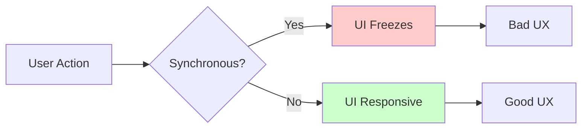
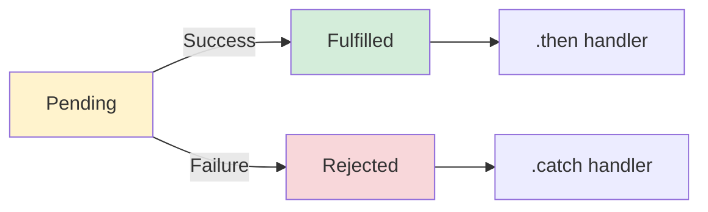
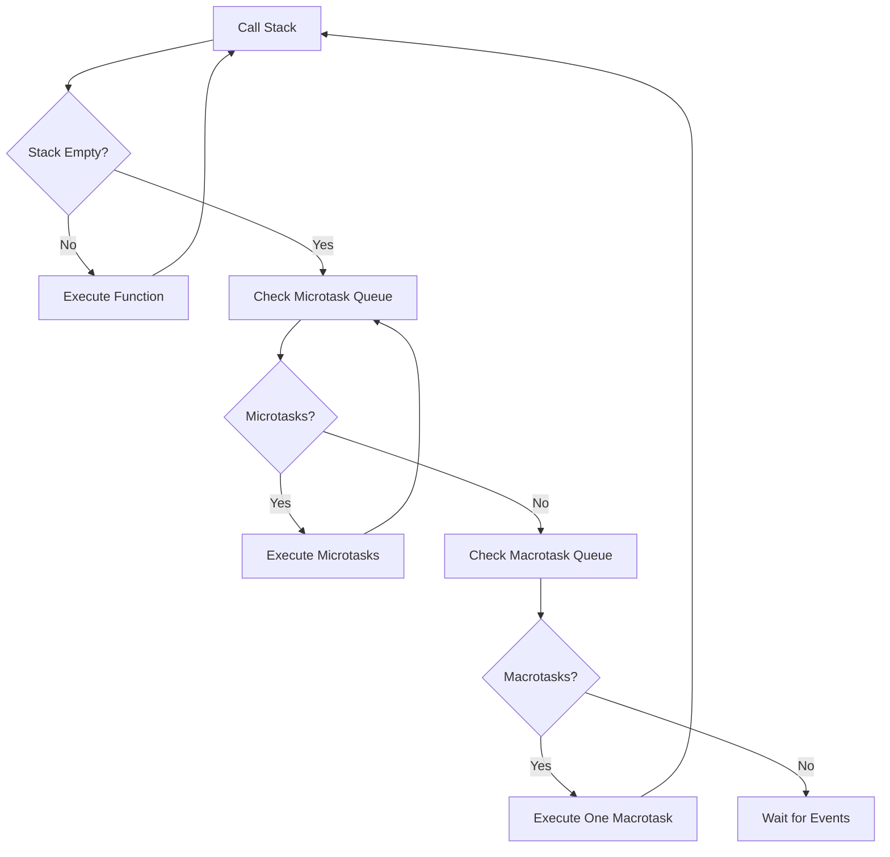

# ⚡ Asynchronous JavaScript - Promises, Async/Await & Event Loop

[← Previous: JavaScript Execution Model](./04_javascript_execution.md) | [← Back to Main](../README.md) | [Next: TypeScript Introduction →](./06_typescript_intro.md)

---

## 📝 Overview

Asynchronous programming is fundamental to modern JavaScript development. This comprehensive guide covers callbacks, Promises, async/await, and the event loop—essential knowledge for building responsive applications and mastering TypeScript.

**Why This Matters for TypeScript:**
- TypeScript provides excellent async/await type support
- Understanding async patterns is crucial for API calls and data fetching
- Event loop knowledge helps debug timing issues
- Async types and generics are important TypeScript features

### 🎯 Learning Objectives

By the end of this guide, you will:

- ✅ Understand JavaScript's asynchronous nature
- ✅ Master callbacks and callback patterns
- ✅ Use Promises effectively
- ✅ Master async/await syntax
- ✅ Understand the event loop deeply
- ✅ Handle async errors properly
- ✅ Work with parallel and sequential async operations
- ✅ Use modern async patterns

### 📊 Section Info

- **Difficulty**: ⭐⭐⭐ Intermediate/Advanced
- **Estimated Time**: 5-6 hours
- **Prerequisites**: [JavaScript Fundamentals](./01_javascript_fundamentals.md), [JavaScript Execution Model](./04_javascript_execution.md)
- **Practice Exercises**: 12 challenges
- **Version**: ES2024

---

## 📚 Table of Contents

1. [Understanding Asynchronous JavaScript](#understanding-async)
2. [Callbacks](#callbacks)
3. [Promises](#promises)
4. [Async/Await](#async-await)
5. [The Event Loop](#event-loop)
6. [Error Handling](#error-handling)
7. [Parallel vs Sequential Execution](#parallel-sequential)
8. [Advanced Async Patterns](#advanced-patterns)

---

<a name="understanding-async"></a>
## 1. Understanding Asynchronous JavaScript

### 1.1 Synchronous vs Asynchronous

```javascript
// SYNCHRONOUS - Blocking
console.log('Start');
const result = heavyComputation(); // Blocks execution
console.log('End');

// ASYNCHRONOUS - Non-blocking
console.log('Start');
setTimeout(() => {
  console.log('Async operation');
}, 0);
console.log('End');

// Output:
// Start
// End
// Async operation (executes last despite 0ms delay!)
```

### 1.2 Why Asynchronous?



**Common Async Operations:**

| Operation | Example | Why Async? |
|-----------|---------|------------|
| **Network Requests** | `fetch()`, AJAX | I/O operation |
| **File System** | `fs.readFile()` | Disk I/O |
| **Timers** | `setTimeout()` | Delayed execution |
| **User Events** | Click, scroll | Unpredictable timing |
| **Animations** | `requestAnimationFrame()` | Frame-by-frame |
| **Database** | SQL queries | I/O operation |

---

<a name="callbacks"></a>
## 2. Callbacks

### 2.1 Understanding Callbacks

A callback is a function passed as an argument to another function.

```javascript
// Simple callback example
function greet(name, callback) {
  console.log(`Hello, ${name}!`);
  callback();
}

function sayGoodbye() {
  console.log('Goodbye!');
}

greet('Alice', sayGoodbye);
// Output:
// Hello, Alice!
// Goodbye!

// Async callback
function fetchData(callback) {
  setTimeout(() => {
    const data = { id: 1, name: 'Product' };
    callback(data);
  }, 1000);
}

fetchData((data) => {
  console.log('Received:', data);
});
```

### 2.2 Callback Hell (Pyramid of Doom)

```javascript
// ❌ BAD: Nested callbacks
getData(function(a) {
  getMoreData(a, function(b) {
    getMoreData(b, function(c) {
      getMoreData(c, function(d) {
        getMoreData(d, function(e) {
          console.log('Finally done!');
        });
      });
    });
  });
});

// Problems:
// 1. Hard to read
// 2. Hard to maintain
// 3. Error handling is complex
// 4. Code grows horizontally
```

### 2.3 Error-First Callbacks (Node.js Convention)

```javascript
// Error-first callback pattern
function readFile(filename, callback) {
  // Simulated file read
  setTimeout(() => {
    const error = null; // or new Error('File not found')
    const data = 'File contents';
    
    callback(error, data);
  }, 1000);
}

// Usage
readFile('file.txt', (error, data) => {
  if (error) {
    console.error('Error:', error);
    return;
  }
  console.log('Data:', data);
});
```

---

<a name="promises"></a>
## 3. Promises

### 3.1 Promise Basics

A Promise represents the eventual completion (or failure) of an asynchronous operation.

```javascript
// Creating a Promise
const promise = new Promise((resolve, reject) => {
  // Async operation
  setTimeout(() => {
    const success = true;
    
    if (success) {
      resolve('Operation successful!');
    } else {
      reject('Operation failed!');
    }
  }, 1000);
});

// Using a Promise
promise
  .then(result => {
    console.log(result); // "Operation successful!"
  })
  .catch(error => {
    console.error(error);
  })
  .finally(() => {
    console.log('Operation complete');
  });
```

### 3.2 Promise States



```javascript
// Promise states
const pending = new Promise((resolve) => {
  // Never resolves - stays pending
});

const fulfilled = Promise.resolve('Success!');

const rejected = Promise.reject('Error!');

// Check promise state
console.log(pending);   // Promise { <pending> }
console.log(fulfilled); // Promise { 'Success!' }
console.log(rejected);  // Promise { <rejected> 'Error!' }
```

### 3.3 Promise Chaining

```javascript
// Promise chaining - flat structure
fetchUser(1)
  .then(user => {
    console.log('User:', user);
    return fetchPosts(user.id);
  })
  .then(posts => {
    console.log('Posts:', posts);
    return fetchComments(posts[0].id);
  })
  .then(comments => {
    console.log('Comments:', comments);
  })
  .catch(error => {
    console.error('Error:', error);
  });

// Each .then() returns a new Promise
// This allows chaining without nesting
```

### 3.4 Promise Static Methods

```javascript
// Promise.resolve() - Create resolved promise
const resolved = Promise.resolve('Immediate value');

// Promise.reject() - Create rejected promise
const rejected = Promise.reject('Immediate error');

// Promise.all() - Wait for all promises
Promise.all([
  Promise.resolve(1),
  Promise.resolve(2),
  Promise.resolve(3)
])
  .then(results => {
    console.log(results); // [1, 2, 3]
  });

// Promise.all() fails fast
Promise.all([
  Promise.resolve(1),
  Promise.reject('Error!'),
  Promise.resolve(3)
])
  .catch(error => {
    console.error(error); // "Error!" (stops immediately)
  });

// Promise.allSettled() - Wait for all (don't fail fast)
Promise.allSettled([
  Promise.resolve(1),
  Promise.reject('Error!'),
  Promise.resolve(3)
])
  .then(results => {
    console.log(results);
    // [
    //   { status: 'fulfilled', value: 1 },
    //   { status: 'rejected', reason: 'Error!' },
    //   { status: 'fulfilled', value: 3 }
    // ]
  });

// Promise.race() - First to complete wins
Promise.race([
  new Promise(resolve => setTimeout(() => resolve('slow'), 1000)),
  new Promise(resolve => setTimeout(() => resolve('fast'), 100))
])
  .then(result => {
    console.log(result); // "fast"
  });

// Promise.any() - First fulfilled promise (ignore rejections)
Promise.any([
  Promise.reject('Error 1'),
  Promise.resolve('Success!'),
  Promise.reject('Error 2')
])
  .then(result => {
    console.log(result); // "Success!"
  });
```

### 3.5 Practical Promise Examples

```javascript
// API call with Promise
function fetchUser(id) {
  return new Promise((resolve, reject) => {
    fetch(`/api/users/${id}`)
      .then(response => {
        if (!response.ok) {
          reject(`HTTP error! status: ${response.status}`);
        }
        return response.json();
      })
      .then(data => resolve(data))
      .catch(error => reject(error));
  });
}

// Timeout wrapper
function withTimeout(promise, ms) {
  return Promise.race([
    promise,
    new Promise((_, reject) =>
      setTimeout(() => reject(new Error('Timeout')), ms)
    )
  ]);
}

// Usage
withTimeout(fetchUser(1), 5000)
  .then(user => console.log(user))
  .catch(error => console.error(error));

// Retry mechanism
function retry(fn, maxAttempts, delay) {
  return new Promise((resolve, reject) => {
    function attempt(attemptNumber) {
      fn()
        .then(resolve)
        .catch(error => {
          if (attemptNumber >= maxAttempts) {
            reject(error);
          } else {
            setTimeout(() => attempt(attemptNumber + 1), delay);
          }
        });
    }
    attempt(1);
  });
}

// Usage
retry(() => fetchUser(1), 3, 1000)
  .then(user => console.log(user))
  .catch(error => console.error('Failed after retries:', error));
```

---

<a name="async-await"></a>
## 4. Async/Await

### 4.1 Async/Await Basics

Async/await is syntactic sugar over Promises, making async code look synchronous.

```javascript
// With Promises
function getUserData() {
  return fetchUser(1)
    .then(user => fetchPosts(user.id))
    .then(posts => fetchComments(posts[0].id))
    .catch(error => console.error(error));
}

// With async/await
async function getUserData() {
  try {
    const user = await fetchUser(1);
    const posts = await fetchPosts(user.id);
    const comments = await fetchComments(posts[0].id);
    return comments;
  } catch (error) {
    console.error(error);
  }
}

// async function always returns a Promise
const result = getUserData();
console.log(result); // Promise { <pending> }
```

### 4.2 Async Function Declaration Types

```javascript
// 1. Async function declaration
async function fetchData() {
  return 'data';
}

// 2. Async function expression
const fetchData = async function() {
  return 'data';
};

// 3. Async arrow function
const fetchData = async () => {
  return 'data';
};

// 4. Async method
const obj = {
  async fetchData() {
    return 'data';
  }
};

// 5. Async class method
class DataService {
  async fetchData() {
    return 'data';
  }
}

// All return Promises
fetchData().then(data => console.log(data));
```

### 4.3 Error Handling with Async/Await

```javascript
// Try/catch with async/await
async function fetchUserData() {
  try {
    const response = await fetch('/api/user');
    
    if (!response.ok) {
      throw new Error(`HTTP error! status: ${response.status}`);
    }
    
    const data = await response.json();
    return data;
    
  } catch (error) {
    console.error('Error fetching user:', error);
    throw error; // Re-throw if needed
  } finally {
    console.log('Fetch attempt completed');
  }
}

// Handle at call site
async function main() {
  try {
    const user = await fetchUserData();
    console.log(user);
  } catch (error) {
    console.error('Failed to get user');
  }
}

// Without try/catch (handle with .catch())
fetchUserData()
  .then(user => console.log(user))
  .catch(error => console.error(error));
```

### 4.4 Sequential vs Parallel Execution

```javascript
// SEQUENTIAL (slow) - one after another
async function sequential() {
  const user = await fetchUser(1);     // Wait 1s
  const posts = await fetchPosts(1);    // Then wait 1s
  const comments = await fetchComments(1); // Then wait 1s
  return { user, posts, comments };      // Total: 3s
}

// PARALLEL (fast) - all at once
async function parallel() {
  const [user, posts, comments] = await Promise.all([
    fetchUser(1),
    fetchPosts(1),
    fetchComments(1)
  ]); // All start together, wait 1s total
  return { user, posts, comments }; // Total: 1s
}

// MIXED - parallel where possible
async function mixed() {
  const user = await fetchUser(1);      // Must wait for user first
  
  // These can run in parallel
  const [posts, profile] = await Promise.all([
    fetchPosts(user.id),
    fetchProfile(user.id)
  ]);
  
  return { user, posts, profile };
}
```

### 4.5 Common Async/Await Patterns

```javascript
// Pattern 1: Conditional async
async function processUser(userId) {
  const user = await fetchUser(userId);
  
  if (user.needsVerification) {
    await sendVerificationEmail(user.email);
  }
  
  return user;
}

// Pattern 2: Loop with async
async function processUsers(userIds) {
  const results = [];
  
  for (const id of userIds) {
    const user = await fetchUser(id); // Sequential
    results.push(user);
  }
  
  return results;
}

// Better: Parallel processing
async function processUsersParallel(userIds) {
  const promises = userIds.map(id => fetchUser(id));
  return Promise.all(promises); // All at once
}

// Pattern 3: Async forEach workaround
async function processArray(items) {
  // ❌ Won't work as expected
  items.forEach(async (item) => {
    await processItem(item);
  });
  
  // ✅ Use for...of
  for (const item of items) {
    await processItem(item);
  }
  
  // ✅ Or Promise.all with map
  await Promise.all(items.map(item => processItem(item)));
}

// Pattern 4: Async reduce
async function asyncReduce(array, asyncFn, initialValue) {
  let accumulator = initialValue;
  
  for (const item of array) {
    accumulator = await asyncFn(accumulator, item);
  }
  
  return accumulator;
}
```

---

<a name="event-loop"></a>
## 5. The Event Loop

### 5.1 Event Loop Architecture



**Event Loop Components:**

| Component | Purpose | Examples |
|-----------|---------|----------|
| **Call Stack** | Executes code | Function calls |
| **Microtask Queue** | High priority tasks | Promises, queueMicrotask |
| **Macrotask Queue** | Regular tasks | setTimeout, setInterval, I/O |
| **Web APIs** | Browser/Node APIs | DOM, fetch, timers |

### 5.2 Microtasks vs Macrotasks

```javascript
// Execution order demonstration
console.log('1: Synchronous');

setTimeout(() => {
  console.log('2: Macrotask (setTimeout)');
}, 0);

Promise.resolve().then(() => {
  console.log('3: Microtask (Promise)');
});

queueMicrotask(() => {
  console.log('4: Microtask (queueMicrotask)');
});

console.log('5: Synchronous');

// Output order:
// 1: Synchronous
// 5: Synchronous
// 3: Microtask (Promise)
// 4: Microtask (queueMicrotask)
// 2: Macrotask (setTimeout)

// Rule: All microtasks execute before next macrotask
```

### 5.3 Event Loop Phases

```javascript
// Detailed example showing phases
console.log('Start');

// Macrotask
setTimeout(() => {
  console.log('Timeout 1');
  
  // Microtask inside macrotask
  Promise.resolve().then(() => {
    console.log('Promise in Timeout 1');
  });
}, 0);

// Another macrotask
setTimeout(() => {
  console.log('Timeout 2');
}, 0);

// Microtask
Promise.resolve().then(() => {
  console.log('Promise 1');
  
  // Another microtask
  Promise.resolve().then(() => {
    console.log('Promise 2');
  });
});

console.log('End');

/*
Output:
Start
End
Promise 1
Promise 2
Timeout 1
Promise in Timeout 1
Timeout 2

Explanation:
1. Synchronous code runs first (Start, End)
2. All microtasks run (Promise 1, Promise 2)
3. First macrotask runs (Timeout 1)
4. Its microtasks run (Promise in Timeout 1)
5. Next macrotask runs (Timeout 2)
*/
```

### 5.4 Common Event Loop Pitfalls

```javascript
// Pitfall 1: Assuming setTimeout(0) is immediate
console.log('1');
setTimeout(() => console.log('2'), 0);
console.log('3');
// Output: 1, 3, 2 (not 1, 2, 3!)

// Pitfall 2: Blocking the event loop
function blockingOperation() {
  const start = Date.now();
  while (Date.now() - start < 5000) {
    // Blocks for 5 seconds!
  }
}

console.log('Start');
setTimeout(() => console.log('This waits!'), 1000);
blockingOperation(); // Blocks everything
console.log('End');

// Pitfall 3: Promise .then() is async
const promise = Promise.resolve();
promise.then(() => console.log('Promise'));
console.log('After promise');
// Output: After promise, Promise
```

---

<a name="error-handling"></a>
## 6. Error Handling

### 6.1 Promise Error Handling

```javascript
// Catch errors at the end of chain
fetchUser(1)
  .then(user => fetchPosts(user.id))
  .then(posts => fetchComments(posts[0].id))
  .catch(error => {
    console.error('Error in chain:', error);
    // Handles errors from any step
  });

// Multiple catch blocks
fetchUser(1)
  .then(user => {
    return fetchPosts(user.id);
  })
  .catch(error => {
    console.error('User fetch error:', error);
    return []; // Provide fallback
  })
  .then(posts => {
    console.log('Posts:', posts);
  });

// Finally block
fetchData()
  .then(data => processData(data))
  .catch(error => console.error(error))
  .finally(() => {
    console.log('Cleanup');
    // Runs regardless of success/failure
  });
```

### 6.2 Async/Await Error Handling

```javascript
// Basic try/catch
async function fetchUserSafe() {
  try {
    const user = await fetchUser(1);
    return user;
  } catch (error) {
    console.error('Error:', error);
    return null; // Fallback value
  }
}

// Multiple try/catch blocks
async function complexOperation() {
  let user, posts;
  
  try {
    user = await fetchUser(1);
  } catch (error) {
    console.error('User error:', error);
    return null;
  }
  
  try {
    posts = await fetchPosts(user.id);
  } catch (error) {
    console.error('Posts error:', error);
    posts = []; // Fallback
  }
  
  return { user, posts };
}

// Wrapper for error handling
async function tryCatch(promise) {
  try {
    const data = await promise;
    return [null, data];
  } catch (error) {
    return [error, null];
  }
}

// Usage
async function main() {
  const [error, user] = await tryCatch(fetchUser(1));
  
  if (error) {
    console.error('Error:', error);
    return;
  }
  
  console.log('User:', user);
}
```

### 6.3 Custom Error Classes

```javascript
// Custom error types
class NetworkError extends Error {
  constructor(message, statusCode) {
    super(message);
    this.name = 'NetworkError';
    this.statusCode = statusCode;
  }
}

class ValidationError extends Error {
  constructor(message, fields) {
    super(message);
    this.name = 'ValidationError';
    this.fields = fields;
  }
}

// Usage
async function fetchUser(id) {
  const response = await fetch(`/api/users/${id}`);
  
  if (!response.ok) {
    throw new NetworkError(
      'Failed to fetch user',
      response.status
    );
  }
  
  const user = await response.json();
  
  if (!user.email) {
    throw new ValidationError(
      'Invalid user data',
      ['email']
    );
  }
  
  return user;
}

// Handle different error types
async function main() {
  try {
    const user = await fetchUser(1);
    console.log(user);
  } catch (error) {
    if (error instanceof NetworkError) {
      console.error(`Network error (${error.statusCode}):`, error.message);
    } else if (error instanceof ValidationError) {
      console.error('Validation error:', error.fields);
    } else {
      console.error('Unknown error:', error);
    }
  }
}
```

---

<a name="parallel-sequential"></a>
## 7. Parallel vs Sequential Execution

### 7.1 Sequential Execution

```javascript
// Sequential - one after another
async function sequential() {
  console.time('sequential');
  
  const user = await fetchUser(1);    // 1s
  const posts = await fetchPosts(1);   // 1s
  const comments = await fetchComments(1); // 1s
  
  console.timeEnd('sequential'); // ~3s
  
  return { user, posts, comments };
}
```

### 7.2 Parallel Execution

```javascript
// Parallel - all at once
async function parallel() {
  console.time('parallel');
  
  const results = await Promise.all([
    fetchUser(1),
    fetchPosts(1),
    fetchComments(1)
  ]); // All start together
  
  console.timeEnd('parallel'); // ~1s
  
  const [user, posts, comments] = results;
  return { user, posts, comments };
}

// Parallel with object destructuring
async function parallelObject() {
  const { user, posts, comments } = await Promise.all({
    user: fetchUser(1),
    posts: fetchPosts(1),
    comments: fetchComments(1)
  }).then(([user, posts, comments]) => ({
    user, posts, comments
  }));
  
  return { user, posts, comments };
}
```

### 7.3 Controlled Concurrency

```javascript
// Limit concurrent operations
async function batchProcess(items, concurrency) {
  const results = [];
  
  for (let i = 0; i < items.length; i += concurrency) {
    const batch = items.slice(i, i + concurrency);
    const batchResults = await Promise.all(
      batch.map(item => processItem(item))
    );
    results.push(...batchResults);
  }
  
  return results;
}

// Usage: Process 100 items, 10 at a time
const items = Array.from({ length: 100 }, (_, i) => i);
const results = await batchProcess(items, 10);
```

---

<a name="advanced-patterns"></a>
## 8. Advanced Async Patterns

### 8.1 Async Generators

```javascript
// Async generator function
async function* fetchPages() {
  let page = 1;
  
  while (page <= 3) {
    const data = await fetch(`/api/page/${page}`);
    yield data;
    page++;
  }
}

// Usage
async function processPages() {
  for await (const page of fetchPages()) {
    console.log('Page:', page);
  }
}
```

### 8.2 AbortController

```javascript
// Cancel async operations
const controller = new AbortController();
const signal = controller.signal;

// Fetch with abort
fetch('/api/data', { signal })
  .then(response => response.json())
  .then(data => console.log(data))
  .catch(error => {
    if (error.name === 'AbortError') {
      console.log('Fetch aborted');
    }
  });

// Cancel after 5 seconds
setTimeout(() => controller.abort(), 5000);

// Custom abort logic
async function fetchWithTimeout(url, timeout) {
  const controller = new AbortController();
  const id = setTimeout(() => controller.abort(), timeout);
  
  try {
    const response = await fetch(url, { signal: controller.signal });
    clearTimeout(id);
    return response;
  } catch (error) {
    clearTimeout(id);
    throw error;
  }
}
```

---

## 🎯 Key Takeaways

✅ **Async code is non-blocking** - JavaScript continues executing while waiting for async operations

✅ **Promises** provide cleaner async code than callbacks

✅ **Async/await** makes async code look synchronous and easier to read

✅ **Event loop** handles async operations through microtask and macrotask queues

✅ **Error handling** requires try/catch with async/await or .catch() with Promises

✅ **Parallel execution** is faster than sequential when operations are independent

✅ **Microtasks execute before macrotasks** in each event loop iteration

---

## 💻 Practice Exercises

### Exercise 1: Convert callback to Promise
```javascript
// Convert this callback-based function to Promise
function getData(callback) {
  setTimeout(() => {
    callback(null, { id: 1, name: 'Data' });
  }, 1000);
}
```

<details>
<summary>View Solution</summary>

```javascript
function getData() {
  return new Promise((resolve) => {
    setTimeout(() => {
      resolve({ id: 1, name: 'Data' });
    }, 1000);
  });
}

// Usage
getData().then(data => console.log(data));
```
</details>

---

## 📚 Further Reading

- [MDN: Async/Await](https://developer.mozilla.org/en-US/docs/Web/JavaScript/Reference/Statements/async_function)
- [MDN: Promises](https://developer.mozilla.org/en-US/docs/Web/JavaScript/Reference/Global_Objects/Promise)
- [JavaScript.info: Event Loop](https://javascript.info/event-loop)
- [What the heck is the event loop anyway?](https://www.youtube.com/watch?v=8aGhZQkoFbQ)

---

[← Previous: JavaScript Execution Model](./04_javascript_execution.md) | [Next: TypeScript Introduction →](./06_typescript_intro.md)

**Progress**: Topic 5 of 63 | Part I: 100% Complete ✅
