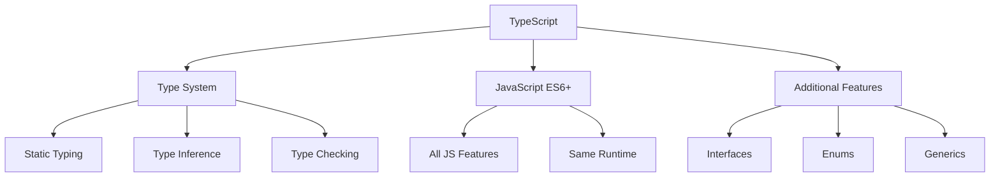
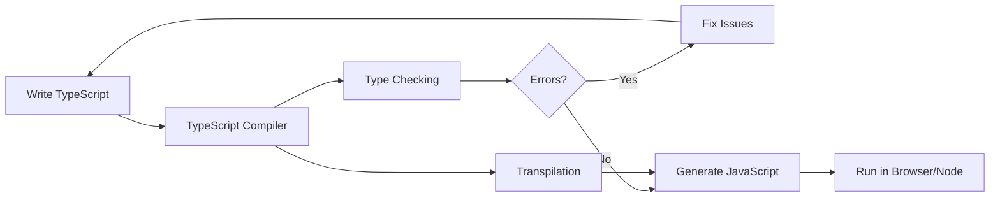
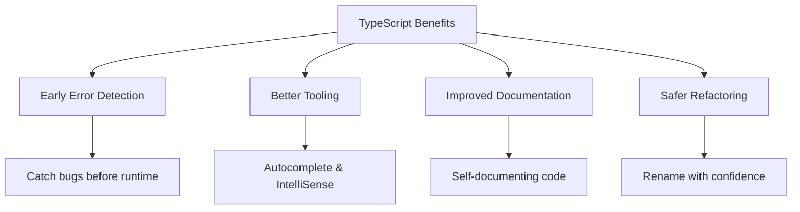

# 🔷 Introduction to TypeScript - Why TypeScript Matters

[← Previous: Async JavaScript](./05_async_javascript.md) | [← Back to Main](../README.md) | [Next: TypeScript Setup →](./07_typescript_setup.md)

---

## 📝 Overview

TypeScript is a strongly typed programming language that builds on JavaScript, giving you better tooling at any scale. This guide introduces TypeScript, explains its benefits, and compares it with JavaScript to help you understand why TypeScript has become the standard for large-scale JavaScript applications.

**What You'll Learn:**
- What TypeScript is and how it relates to JavaScript
- Key benefits and features of TypeScript
- When and why to use TypeScript
- How TypeScript compares to JavaScript
- Real-world use cases and success stories

### 🎯 Learning Objectives

By the end of this guide, you will:

- ✅ Understand what TypeScript is and its relationship to JavaScript
- ✅ Know the key benefits of using TypeScript
- ✅ Understand TypeScript's type system fundamentals
- ✅ Recognize when TypeScript is the right choice
- ✅ See real-world TypeScript applications
- ✅ Understand the TypeScript ecosystem
- ✅ Be motivated to learn TypeScript

### 📊 Section Info

- **Difficulty**: ⭐ Beginner
- **Estimated Time**: 2-3 hours
- **Prerequisites**: [JavaScript Fundamentals](./01_javascript_fundamentals.md)
- **Practice Exercises**: 5 conceptual questions
- **Version**: TypeScript 5.7+ (2025)

---

## 📚 Table of Contents

1. [What is TypeScript?](#what-is-typescript)
2. [Why TypeScript Exists](#why-typescript-exists)
3. [Key Features and Benefits](#key-features)
4. [TypeScript vs JavaScript](#typescript-vs-javascript)
5. [The TypeScript Ecosystem](#typescript-ecosystem)
6. [Who Uses TypeScript?](#who-uses-typescript)
7. [When to Use TypeScript](#when-to-use)
8. [Getting Started Mindset](#getting-started)

---

<a name="what-is-typescript"></a>
## 1. What is TypeScript?

### 1.1 The Official Definition

**TypeScript is JavaScript with syntax for types.**

TypeScript is:
- A **programming language** developed and maintained by Microsoft
- A **superset** of JavaScript - all JavaScript code is valid TypeScript
- A **statically typed** language with compile-time type checking
- A **transpiled** language that converts to JavaScript
- **Open source** and community-driven



### 1.2 TypeScript's Relationship to JavaScript

```typescript
// Every JavaScript is valid TypeScript
const message = "Hello, World!";
console.log(message);

// But TypeScript adds types
const greeting: string = "Hello, TypeScript!";
console.log(greeting);

// TypeScript compiles to JavaScript
// greeting: string -> const greeting = "Hello, TypeScript!";
```

**Key Points:**

| Aspect | Description |
|--------|-------------|
| **Superset** | All JavaScript code works in TypeScript |
| **Compiled** | TypeScript → JavaScript (browsers run JS) |
| **Types** | Optional, gradually adoptable |
| **Runtime** | Same as JavaScript (V8, SpiderMonkey, etc.) |
| **Compatibility** | Works with all JS libraries and frameworks |

### 1.3 The TypeScript Workflow



```typescript
// 1. Write TypeScript (.ts file)
function add(a: number, b: number): number {
  return a + b;
}

// 2. Compiler checks types
// 3. Generates JavaScript (.js file)
function add(a, b) {
  return a + b;
}

// 4. JavaScript runs in browser/Node.js
```

---

<a name="why-typescript-exists"></a>
## 2. Why TypeScript Exists

### 2.1 JavaScript's Challenges

JavaScript's flexibility is both a strength and weakness:

```javascript
// JavaScript allows this (runtime error!)
function add(a, b) {
  return a + b;
}

console.log(add(5, 3));        // 8 ✅
console.log(add("5", 3));      // "53" ⚠️ (string concatenation)
console.log(add(5, "3"));      // "53" ⚠️
console.log(add(null, 3));     // 3 ⚠️
console.log(add(undefined, 3)); // NaN ⚠️
```

**Common JavaScript Pain Points:**

| Problem | Example | Impact |
|---------|---------|--------|
| **Type Coercion** | `"5" + 3 = "53"` | Unexpected results |
| **Null/Undefined** | `obj.property` (obj is null) | Runtime crashes |
| **Typos** | `usr.nmae` instead of `user.name` | Silent failures |
| **Refactoring** | Rename breaks code | Hard to maintain |
| **Documentation** | Unclear function parameters | Poor DX |
| **Autocomplete** | Limited IDE support | Slower development |

### 2.2 How TypeScript Solves These Problems

```typescript
// TypeScript catches errors at compile-time
function add(a: number, b: number): number {
  return a + b;
}

console.log(add(5, 3));        // 8 ✅
// console.log(add("5", 3));   // ❌ Compile error!
// console.log(add(5, "3"));   // ❌ Compile error!
// console.log(add(null, 3));  // ❌ Compile error!
```

**TypeScript Benefits:**



---

<a name="key-features"></a>
## 3. Key Features and Benefits

### 3.1 Static Type Checking

```typescript
// Types catch errors early
let age: number = 25;
// age = "twenty-five"; // ❌ Error: Type 'string' is not assignable to type 'number'

// Types document code
function greet(name: string): string {
  return `Hello, ${name}!`;
}

// IDE knows return type
const message = greet("Alice"); // message is string
```

### 3.2 IntelliSense and Autocomplete

```typescript
interface User {
  id: number;
  name: string;
  email: string;
}

const user: User = {
  id: 1,
  name: "Alice",
  email: "alice@example.com"
};

// IDE suggests: id, name, email
user. // ← Autocomplete shows all properties
```

### 3.3 Refactoring Support

```typescript
interface Product {
  id: number;
  name: string;
  price: number;
}

// Rename 'name' to 'productName' everywhere safely
// IDE updates all occurrences automatically

function displayProduct(product: Product) {
  console.log(product.name); // Updates automatically
}
```

### 3.4 Documentation Through Types

```typescript
// Types serve as documentation
interface ApiResponse<T> {
  data: T;
  status: number;
  message: string;
}

// Clear what function expects and returns
async function fetchUser(id: number): Promise<ApiResponse<User>> {
  const response = await fetch(`/api/users/${id}`);
  return response.json();
}

// No need to read documentation - types tell the story
```

### 3.5 Advanced Type System

```typescript
// Generics
function identity<T>(value: T): T {
  return value;
}

// Union Types
type Status = "pending" | "approved" | "rejected";

// Intersection Types
type Admin = User & { permissions: string[] };

// Mapped Types
type Readonly<T> = {
  readonly [P in keyof T]: T[P];
};

// Conditional Types
type NonNullable<T> = T extends null | undefined ? never : T;
```

---

<a name="typescript-vs-javascript"></a>
## 4. TypeScript vs JavaScript

### 4.1 Side-by-Side Comparison

```javascript
// JAVASCRIPT
function calculateTotal(items) {
  let total = 0;
  for (const item of items) {
    total += item.price * item.quantity;
  }
  return total;
}

// What if items is null?
// What if item.price is undefined?
// What if quantity is a string?
```

```typescript
// TYPESCRIPT
interface CartItem {
  price: number;
  quantity: number;
}

function calculateTotal(items: CartItem[]): number {
  let total = 0;
  for (const item of items) {
    total += item.price * item.quantity;
  }
  return total;
}

// Type system ensures:
// ✅ items is an array
// ✅ Each item has price (number)
// ✅ Each item has quantity (number)
// ✅ Returns number
```

### 4.2 Feature Comparison Table

| Feature | JavaScript | TypeScript |
|---------|-----------|------------|
| **Type System** | Dynamic | Static |
| **Type Checking** | Runtime | Compile-time |
| **Error Detection** | Late (production) | Early (development) |
| **IDE Support** | Basic | Excellent |
| **Refactoring** | Risky | Safe |
| **Documentation** | External | Built-in (types) |
| **Learning Curve** | Lower | Higher |
| **Build Step** | Optional | Required |
| **File Extension** | `.js` | `.ts` |
| **Adoption** | Universal | Growing rapidly |

### 4.3 Migration Path

```typescript
// Step 1: Rename .js to .ts (valid TypeScript)
const users = [];

// Step 2: Add basic types gradually
const users: any[] = [];

// Step 3: Add specific types
interface User {
  id: number;
  name: string;
}
const users: User[] = [];

// Step 4: Enable strict mode for full type safety
```

---

<a name="typescript-ecosystem"></a>
## 5. The TypeScript Ecosystem

### 5.1 TypeScript in the Wild

**Major Frameworks with TypeScript:**

| Framework/Library | TypeScript Support | Notes |
|-------------------|-------------------|-------|
| **Angular** | Built-in | Written in TypeScript |
| **React** | Excellent | Official TS support |
| **Vue 3** | Built-in | Composition API in TS |
| **Next.js** | First-class | Zero-config TS |
| **NestJS** | Native | Backend framework in TS |
| **Express** | Via @types | Type definitions available |
| **Prisma** | Type-safe | ORM with full TS support |
| **tRPC** | Type-safe | End-to-end type safety |

### 5.2 TypeScript Tooling

```mermaid
graph TD
    A[TypeScript Ecosystem] --> B[Compiler tsc]
    A --> C[IDEs]
    A --> D[Build Tools]
    A --> E[Testing]
    A --> F[Type Definitions]
    
    C --> C1[VS Code]
    C --> C2[WebStorm]
    C --> C3[Vim/Neovim]
    
    D --> D1[Webpack]
    D --> D2[Vite]
    D --> D3[esbuild]
    
    E --> E1[Jest]
    E --> E2[Vitest]
    
    F --> F1[DefinitelyTyped]
    F --> F2[@types packages]
```

### 5.3 Type Definitions (@types)

```typescript
// Install type definitions for JavaScript libraries
// npm install @types/node
// npm install @types/express
// npm install @types/react

// Use typed libraries
import express from 'express'; // Fully typed!

const app = express();

app.get('/users', (req, res) => {
  // req and res are fully typed
  res.json({ users: [] });
});
```

---

<a name="who-uses-typescript"></a>
## 6. Who Uses TypeScript?

### 6.1 Companies Using TypeScript

**Major companies that use TypeScript:**

- **Microsoft** - Creator of TypeScript
- **Google** - Angular team
- **Facebook/Meta** - Internal TypeScript usage
- **Airbnb** - Migrated codebase
- **Slack** - Desktop app in TypeScript
- **Asana** - Full TypeScript adoption
- **Lyft** - Backend services
- **Shopify** - Polaris design system
- **Netflix** - UI infrastructure
- **Stripe** - API libraries

### 6.2 Popular Open Source Projects

```
✅ VS Code (Microsoft)
✅ Angular (Google)
✅ NestJS (Backend framework)
✅ RxJS (Reactive programming)
✅ Ionic (Mobile framework)
✅ TypeORM (ORM for Node.js)
✅ Prisma (Next-gen ORM)
✅ Deno (Ryan Dahl's new runtime)
```

### 6.3 Industry Adoption

**Stack Overflow Survey (2024):**
- 3rd most loved programming language
- 5th most wanted programming language
- Used by 38% of professional developers

**GitHub Statistics:**
- 4th most popular language
- Fastest-growing among top languages
- 2M+ repositories

---

<a name="when-to-use"></a>
## 7. When to Use TypeScript

### 7.1 Ideal Use Cases

✅ **Large codebases** - Type safety scales
✅ **Team projects** - Clear contracts between developers
✅ **Long-term projects** - Maintainability matters
✅ **Complex applications** - Catch bugs early
✅ **Libraries/frameworks** - Provide great DX
✅ **Backend services** - Prevent runtime errors
✅ **Refactor-heavy projects** - Safe restructuring

### 7.2 When JavaScript Might Be Better

🤔 **Small scripts** - Overhead not worth it
🤔 **Quick prototypes** - Move fast, iterate
🤔 **Learning JavaScript** - Focus on fundamentals first
🤔 **Legacy constraints** - Build system limitations
🤔 **Simple websites** - Static pages, no complexity

### 7.3 Decision Matrix

| Project Characteristic | JavaScript | TypeScript |
|----------------------|------------|------------|
| **Team Size** | 1-2 developers | 3+ developers |
| **Codebase Size** | <5,000 lines | >5,000 lines |
| **Project Duration** | <1 month | >3 months |
| **Complexity** | Simple | Complex |
| **Maintenance** | Short-term | Long-term |
| **API Surface** | Internal | Public library |

---

<a name="getting-started"></a>
## 8. Getting Started Mindset

### 8.1 The Learning Curve


**Typical Learning Journey:**

| Phase | Time | What You'll Learn |
|-------|------|-------------------|
| **Phase 1** | Week 1-2 | Basic types, interfaces |
| **Phase 2** | Week 3-4 | Functions, classes, generics |
| **Phase 3** | Month 2 | Advanced types, utility types |
| **Phase 4** | Month 3+ | Type gymnastics, patterns |

### 8.2 TypeScript Philosophy

```typescript
// Start permissive, gradually stricter

// Level 1: Allow any (JavaScript with .ts extension)
let data: any;

// Level 2: Basic types
let data: string | number;

// Level 3: Specific types
interface Data {
  id: number;
  value: string;
}
let data: Data;

// Level 4: Strict mode (best practice)
// All types explicit, no implicit any
```

### 8.3 Benefits Timeline

```
Week 1:    Better autocomplete
Week 2:    Catching simple typos
Month 1:   Confident refactoring
Month 2:   Complex type safety
Month 3:   Team productivity boost
Month 6+:  Fewer production bugs
```

---

## 🎯 Key Takeaways

✅ **TypeScript = JavaScript + Types** - All JS code works in TS

✅ **Compile-time safety** - Catch errors before runtime

✅ **Better tooling** - Autocomplete, refactoring, documentation

✅ **Gradual adoption** - Start simple, add types incrementally

✅ **Industry standard** - Used by major companies and projects

✅ **Strong ecosystem** - Great framework support and tooling

✅ **Worthwhile investment** - Pays off in large/long-term projects

✅ **Learning curve exists** - But manageable with JavaScript knowledge

---

## 💭 Conceptual Questions

### Question 1: Understanding Types
**Q:** What's the main difference between JavaScript and TypeScript?

<details>
<summary>View Answer</summary>

TypeScript adds a **static type system** to JavaScript. While JavaScript checks types at runtime, TypeScript checks types at compile-time, catching errors before code runs. All JavaScript is valid TypeScript, but TypeScript requires a compilation step to generate JavaScript.
</details>

### Question 2: When TypeScript?
**Q:** Should you use TypeScript for a weekend hackathon project?

<details>
<summary>View Answer</summary>

**It depends**, but generally **no** for quick prototypes. TypeScript's benefits (type safety, refactoring) shine in larger, longer-term projects. For hackathons, JavaScript's speed and flexibility usually win. However, if you're already comfortable with TypeScript, the productivity tools might help.
</details>

### Question 3: TypeScript at Runtime
**Q:** Does TypeScript's type system affect runtime performance?

<details>
<summary>View Answer</summary>

**No**. TypeScript types are completely removed during compilation. The generated JavaScript runs identically to hand-written JavaScript. Type checking happens only at compile-time, so there's zero runtime overhead.
</details>

---

## 📚 Further Reading

- [TypeScript Official Website](https://www.typescriptlang.org/)
- [TypeScript Handbook](https://www.typescriptlang.org/docs/handbook/intro.html)
- [TypeScript Deep Dive](https://basarat.gitbook.io/typescript/)
- [TypeScript GitHub Repository](https://github.com/microsoft/TypeScript)
- [DefinitelyTyped](https://github.com/DefinitelyTyped/DefinitelyTyped)

---

[← Previous: Async JavaScript](./05_async_javascript.md) | [Next: TypeScript Setup →](./07_typescript_setup.md)

**Progress**: Topic 6 of 63 | Part II: 14% Complete
