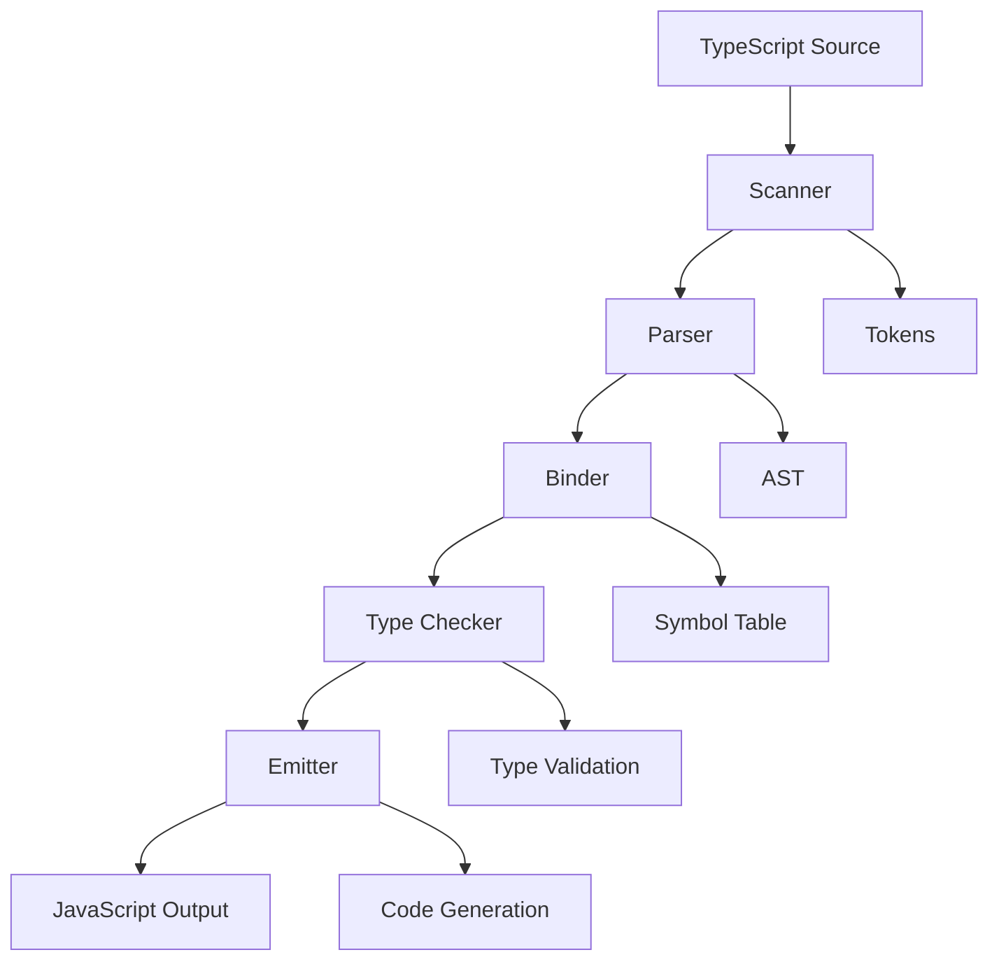
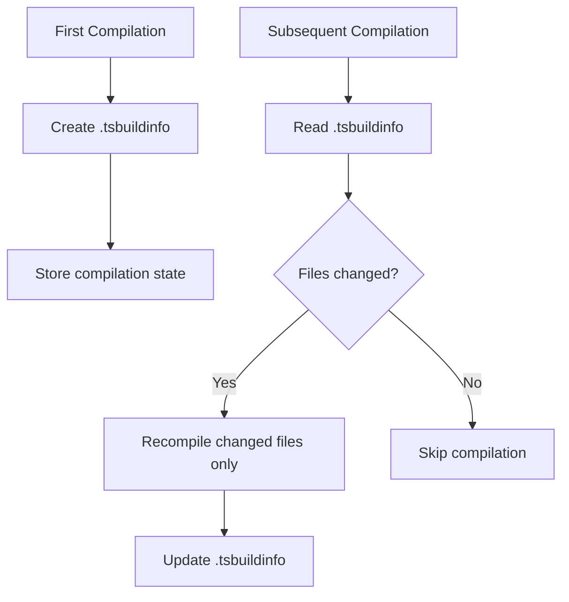

# ⚙️ TypeScript Compiler (tsc) - Deep Dive into Compilation

[← Previous: TypeScript Setup](./07_typescript_setup.md) | [← Back to Main](../README.md) | [Next: Basic Types →](./09_basic_types.md)

---

## 📝 Overview

The TypeScript compiler (tsc) is the heart of TypeScript development. Understanding how it works, what it does, and how to configure it is essential for effective TypeScript development. This guide explores compilation, transpilation, type checking, and advanced compiler features.

**What You'll Learn:**
- How the TypeScript compiler works internally
- Compilation vs transpilation
- Source maps and debugging
- Compiler options in depth
- Watch mode and incremental compilation
- Advanced compiler features

### 🎯 Learning Objectives

- ✅ Understand TypeScript compilation process
- ✅ Master compiler CLI options
- ✅ Use source maps for debugging
- ✅ Configure watch mode effectively
- ✅ Optimize compilation performance
- ✅ Understand incremental compilation
- ✅ Use project references
- ✅ Debug compiler issues

### 📊 Section Info

- **Difficulty**: ⭐⭐ Intermediate
- **Estimated Time**: 3-4 hours
- **Prerequisites**: [TypeScript Setup](./07_typescript_setup.md)
- **Practice Exercises**: 8 hands-on tasks
- **Version**: TypeScript 5.7+ (2025)

---

## 📚 Table of Contents

1. [How the Compiler Works](#how-compiler-works)
2. [Compilation Process](#compilation-process)
3. [CLI Options](#cli-options)
4. [Source Maps](#source-maps)
5. [Watch Mode](#watch-mode)
6. [Incremental Compilation](#incremental-compilation)
7. [Project References](#project-references)
8. [Compiler API](#compiler-api)
9. [Higher-Order FAQs](#faqs)
10. [Interview Questions](#interview-questions)

---

<a name="how-compiler-works"></a>
## 1. How the Compiler Works

### 1.1 Compiler Architecture



### 1.2 Compilation Phases

```typescript
// Phase 1: SCANNING
// Input: const x: number = 5;
// Output: [const, x, :, number, =, 5, ;]

// Phase 2: PARSING
// Output: AST (Abstract Syntax Tree)

// Phase 3: BINDING
// Output: Symbol table (x -> number)

// Phase 4: TYPE CHECKING
// Validates: x must be number

// Phase 5: EMITTING
// Output: const x = 5; (JavaScript)
```

### 1.3 Compilation vs Transpilation

| Term | What It Means | Example |
|------|---------------|---------|
| **Compilation** | Source → Different language | C → Machine code |
| **Transpilation** | Source → Similar language | TS → JS |
| **TypeScript** | Both! Type checks + transpiles | TS → Checked → JS |

```typescript
// Input (TypeScript)
function add(a: number, b: number): number {
  return a + b;
}

// Output (JavaScript)
function add(a, b) {
  return a + b;
}

// Note: Types are erased!
```

---

<a name="compilation-process"></a>
## 2. Compilation Process

### 2.1 Basic Compilation

```bash
# Compile single file
tsc hello.ts
# Creates: hello.js

# Compile multiple files
tsc file1.ts file2.ts
# Creates: file1.js, file2.js

# Compile entire project
tsc
# Uses tsconfig.json
```

### 2.2 Compiler Modes

```bash
# Normal mode - compile and exit
tsc

# Watch mode - recompile on changes
tsc --watch

# Build mode - use project references
tsc --build

# Diagnostics - show compilation stats
tsc --diagnostics

# List files - show what will be compiled
tsc --listFiles
```

### 2.3 Compilation Output

```typescript
// input.ts
class Person {
  constructor(public name: string, private age: number) {}
  
  greet(): string {
    return `Hello, I'm ${this.name}`;
  }
}

const person = new Person("Alice", 30);
console.log(person.greet());
```

```javascript
// output.js (target: ES2022)
class Person {
  name;
  #age;
  
  constructor(name, age) {
    this.name = name;
    this.#age = age;
  }
  
  greet() {
    return `Hello, I'm ${this.name}`;
  }
}

const person = new Person("Alice", 30);
console.log(person.greet());
```

---

<a name="cli-options"></a>
## 3. CLI Options

### 3.1 Essential CLI Commands

```bash
# Initialize config file
tsc --init

# Specify config file
tsc --project tsconfig.prod.json
tsc -p tsconfig.prod.json

# Output to specific directory
tsc --outDir dist

# Target specific ES version
tsc --target ES2022

# Enable strict mode
tsc --strict

# Show help
tsc --help

# Show version
tsc --version
```

### 3.2 Compilation Flags

| Flag | Purpose | Example |
|------|---------|---------|
| `--noEmit` | Check types, don't generate JS | `tsc --noEmit` |
| `--declaration` | Generate .d.ts files | `tsc --declaration` |
| `--sourceMap` | Generate source maps | `tsc --sourceMap` |
| `--watch` | Watch mode | `tsc --watch` |
| `--pretty` | Colored output | `tsc --pretty` |
| `--listFiles` | Show compiled files | `tsc --listFiles` |

### 3.3 Common Commands

```bash
# Type check only (no output)
tsc --noEmit

# Compile with source maps
tsc --sourceMap

# Compile specific files
tsc src/index.ts --outDir dist

# Show what files will be compiled
tsc --listFiles --noEmit

# Show compilation performance
tsc --diagnostics

# Clean and rebuild
rm -rf dist && tsc
```

---

<a name="source-maps"></a>
## 4. Source Maps

### 4.1 What are Source Maps?

Source maps map compiled JavaScript back to original TypeScript for debugging.

```json
// tsconfig.json
{
  "compilerOptions": {
    "sourceMap": true,
    // or
    "inlineSourceMap": true,
    "inlineSources": true
  }
}
```

### 4.2 Source Map Types

```typescript
// input.ts
function add(a: number, b: number): number {
  return a + b;
}

// Compiled with sourceMap: true
// Creates: input.js + input.js.map

// input.js.map content:
{
  "version": 3,
  "file": "input.js",
  "sourceRoot": "",
  "sources": ["input.ts"],
  "mappings": "AAAA,SAAS,GAAG,CAAC,CAAS,EAAE,CAAS..."
}
```

### 4.3 Debugging with Source Maps

```typescript
// Debug TypeScript directly in browser/Node.js
function processData(data: string[]): number {
  debugger; // Stops in TypeScript source!
  return data.length;
}

// In VS Code launch.json:
{
  "type": "node",
  "request": "launch",
  "name": "Debug TypeScript",
  "program": "${workspaceFolder}/src/index.ts",
  "preLaunchTask": "npm: build",
  "outFiles": ["${workspaceFolder}/dist/**/*.js"],
  "sourceMaps": true
}
```

---

<a name="watch-mode"></a>
## 5. Watch Mode

### 5.1 Basic Watch Mode

```bash
# Start watch mode
tsc --watch

# Output:
# [10:00:00 AM] Starting compilation in watch mode...
# [10:00:02 AM] Found 0 errors. Watching for file changes.
```

### 5.2 Watch Mode Configuration

```json
{
  "compilerOptions": {
    // Normal options
  },
  "watchOptions": {
    "watchFile": "useFsEvents",
    "watchDirectory": "useFsEvents",
    "fallbackPolling": "dynamicPriority",
    "synchronousWatchDirectory": true,
    "excludeDirectories": ["**/node_modules", "dist"]
  }
}
```

### 5.3 Watch Strategies

| Strategy | When to Use | Performance |
|----------|-------------|-------------|
| `useFsEvents` | Default, most systems | Fast |
| `useFsEventsOnParentDirectory` | Large projects | Very fast |
| `dynamicPriorityPolling` | Network drives | Medium |
| `fixedPollingInterval` | Fallback | Slow |

---

<a name="incremental-compilation"></a>
## 6. Incremental Compilation

### 6.1 Enabling Incremental

```json
{
  "compilerOptions": {
    "incremental": true,
    "tsBuildInfoFile": "./.tsbuildinfo"
  }
}
```

### 6.2 How Incremental Works



### 6.3 Performance Impact

```bash
# First compilation (cold)
time tsc
# real    0m12.450s

# Second compilation (warm, incremental)
time tsc
# real    0m2.103s

# After small change
time tsc
# real    0m0.890s
```

---

<a name="project-references"></a>
## 7. Project References

### 7.1 Monorepo Setup

```json
// tsconfig.base.json
{
  "compilerOptions": {
    "composite": true,
    "declaration": true,
    "declarationMap": true,
    "skipLibCheck": true
  }
}

// packages/shared/tsconfig.json
{
  "extends": "../../tsconfig.base.json",
  "compilerOptions": {
    "outDir": "./dist",
    "rootDir": "./src"
  }
}

// packages/frontend/tsconfig.json
{
  "extends": "../../tsconfig.base.json",
  "references": [
    { "path": "../shared" }
  ]
}
```

### 7.2 Building with References

```bash
# Build all projects
tsc --build

# Build with force
tsc --build --force

# Clean build outputs
tsc --build --clean

# Watch mode with references
tsc --build --watch
```

---

## 📊 Self-Assessment Checkpoints

### ✅ Checkpoint 1: Basic Compilation

**You should be able to:**
- ✅ Compile TypeScript files using tsc
- ✅ Understand compilation output
- ✅ Use basic CLI flags

**Verification:**
```bash
echo 'const x: number = 5;' > test.ts
tsc test.ts --target ES2022 --module esnext
cat test.js
```

---

### ✅ Checkpoint 2: Source Maps

**You should be able to:**
- ✅ Generate source maps
- ✅ Debug TypeScript in browser/Node
- ✅ Understand source map files

**Verification:**
```bash
tsc test.ts --sourceMap
ls test.js.map
```

---

## 🧠 Higher-Order Thinking FAQs

### FAQ 1: Type Checking vs Code Generation

**Q: Why does TypeScript have a `--noEmit` flag? What scenarios require type checking without code generation?**

<details>
<summary>View Detailed Answer</summary>

**Short Answer:** Type checking and code generation are separate concerns that serve different purposes.

**Deep Explanation:**

TypeScript's compiler does **two independent jobs**:
1. **Type Checking**: Validate type safety
2. **Code Generation**: Emit JavaScript

`--noEmit` disables code generation while preserving type checking. This is useful for:

**Use Case 1: CI/CD Type Validation**
```bash
# In CI pipeline - only validate types
tsc --noEmit

# Actual bundling done by Webpack/Vite
npm run build
```

**Use Case 2: Editor Integration**
- VS Code runs `tsc --noEmit --watch` in background
- Provides instant type errors
- Build tool handles actual compilation

**Use Case 3: Type-Only Packages**
```json
{
  "scripts": {
    "typecheck": "tsc --noEmit",
    "build": "babel src --out-dir dist --extensions .ts"
  }
}
```

**Why Separate?**
- Modern bundlers (Vite, esbuild) compile faster than tsc
- Type checking can be parallelized separately
- Different tools optimize for different concerns

**Production Pattern:**
```bash
# Development: Fast compilation (esbuild)
vite

# CI: Comprehensive type check
tsc --noEmit && vite build
```

</details>

---

### FAQ 2: Target vs Lib Configuration

**Q: What's the relationship between `target` and `lib` in tsconfig.json, and why do they exist separately?**

<details>
<summary>View Detailed Answer</summary>

**Short Answer:** `target` controls output JavaScript version; `lib` controls available APIs during type checking.

**Deep Explanation:**

These two options serve different purposes:

**`target`** - Output JavaScript Version
```json
{
  "compilerOptions": {
    "target": "ES5"  // Output ES5 JavaScript
  }
}
```

```typescript
// Input
const greeting = (name: string) => `Hello, ${name}`;

// Output with target: ES5
var greeting = function(name) {
  return "Hello, " + name;
};

// Output with target: ES2022
const greeting = (name) => `Hello, ${name}`;
```

**`lib`** - Available APIs
```json
{
  "compilerOptions": {
    "target": "ES5",
    "lib": ["ES2022", "DOM"]  // Can USE modern APIs
  }
}
```

```typescript
// This is valid because lib: ["ES2022"]
const arr = [1, 2, 3];
arr.includes(2); // ✅ ES2016+ method

// But compiles to ES5:
arr.indexOf(2) !== -1; // May need polyfill!
```

**Key Insight:** TypeScript assumes you'll provide polyfills if target < lib.

**Common Configurations:**

| Scenario | target | lib | Reason |
|----------|--------|-----|--------|
| Modern browser | ES2022 | ES2022, DOM | No polyfills needed |
| Legacy browser | ES5 | ES2015, DOM | With Babel/polyfills |
| Node.js 18+ | ES2022 | ES2022 | Native support |
| Library | ES2020 | ES2020 | Wide compatibility |

**When They Conflict:**
```typescript
// target: ES5, lib: ES2022
async function example() {  // ❌ Error: ES5 doesn't support async
  await Promise.resolve();
}
```

</details>

---

### FAQ 3: Declaration Files Purpose

**Q: Why does TypeScript generate .d.ts files, and when should you enable declaration output?**

<details>
<summary>View Detailed Answer</summary>

**Short Answer:** Declaration files provide type information without implementation, essential for library authorship.

**Deep Explanation:**

**`.d.ts` files are TypeScript's contract mechanism:**

```typescript
// implementation.ts
export function add(a: number, b: number): number {
  return a + b;
}

// implementation.d.ts (generated)
export declare function add(a: number, b: number): number;
```

**Why Declaration Files Matter:**

1. **Library Publishing**: Consumers get type safety without source code
```json
{
  "name": "my-library",
  "main": "dist/index.js",
  "types": "dist/index.d.ts",  // Type definitions
  "files": ["dist"]
}
```

2. **Compile-Time Performance**: Type checker reads `.d.ts` (fast) instead of `.ts` (slow)

3. **API Surface Documentation**: Declarations show public API contract

**When to Enable:**

| Project Type | declaration | declarationMap | Why |
|-------------|-------------|----------------|-----|
| Application | false | false | Not published |
| Library | true | true | Consumers need types |
| Monorepo | true | false | Fast cross-package types |
| Type-only package | true | N/A | No implementation |

**Performance Trade-off:**
- ✅ Declarations speed up consuming projects
- ❌ Generating declarations slows initial build
- 🎯 Use for libraries, skip for apps

</details>

---

## 🎤 Senior SDE Interview Questions

### Interview Question 1: Compiler Architecture

**Q:** "Explain how TypeScript's type checker works. If you had to implement a simplified type checker, what data structures and algorithms would you use?"

**Key Concepts:**
- Compiler design
- AST traversal
- Symbol tables
- Type inference algorithms

**Expected Answer:**

1. **Core Data Structures:**
```typescript
// Symbol table
type SymbolTable = Map<string, Symbol>;

interface Symbol {
  name: string;
  type: Type;
  declarations: Node[];
}

// Type system
type Type = 
  | PrimitiveType
  | ObjectType
  | UnionType
  | IntersectionType;
```

2. **Algorithm Overview:**
- Parse source into AST
- Build symbol table (binding phase)
- Traverse AST, checking each node
- Infer types using Hindley-Milner-style algorithm
- Report errors for type mismatches

3. **Type Inference Example:**
```typescript
// How TypeScript infers
const x = 5;  // Infer: number (literal → widened)
const arr = [1, 2, 3];  // Infer: number[]
const mixed = [1, "two"];  // Infer: (number | string)[]
```

**Follow-ups:**
1. "How would you handle circular type references?"
2. "What's the computational complexity of type checking?"
3. "How do generics affect type checking performance?"

**Green Flags:**
- Mentions AST and symbol tables
- Understands type widening/narrowing
- Discusses performance implications
- References academic CS concepts

---

### Interview Question 2: Build Optimization

**Q:** "Your team's TypeScript monorepo with 20 packages takes 10 minutes to build. Walk through your optimization strategy."

**Key Concepts:**
- Monorepo architecture
- Project references
- Caching strategies
- Parallel compilation

**Expected Answer:**

1. **Enable Project References**
```json
// packages/shared/tsconfig.json
{
  "compilerOptions": {
    "composite": true,
    "declaration": true
  }
}

// packages/app/tsconfig.json
{
  "references": [{ "path": "../shared" }]
}
```

2. **Incremental Compilation**
```json
{
  "compilerOptions": {
    "incremental": true,
    "tsBuildInfoFile": ".tsbuildinfo"
  }
}
```

3. **Build Orchestration**
```bash
# Use tsc --build for smart rebuilds
tsc --build --force  # Clean build
tsc --build          # Incremental

# Or use turbo/nx for parallel builds
turbo run build      # Parallelizes across packages
```

4. **Configuration Optimizations:**
- `skipLibCheck: true` (don't check node_modules)
- `isolatedModules: true` (parallel-friendly)
- Exclude test files from main build

**Impact:**
- Before: 10min (full rebuild every time)
- After: 2min (first build), 15s (incremental)

**Follow-ups:**
1. "How would you handle type-checking in CI?"
2. "What's the trade-off of skipLibCheck?"
3. "How do you cache builds across CI runs?"

**Green Flags:**
- Understands project references
- Mentions build caching
- Discusses CI/CD integration
- Considers developer experience

---

## 🎯 Key Takeaways

✅ **TypeScript compiler** does type checking + code generation

✅ **Source maps** enable debugging TypeScript in production

✅ **Watch mode** provides instant feedback during development

✅ **Incremental compilation** dramatically speeds up rebuilds

✅ **Project references** enable monorepo scalability

✅ **CLI options** offer fine-grained control over compilation

✅ **Declaration files** (.d.ts) provide types without implementation

---

## 📚 Further Reading

- [TypeScript Compiler Options](https://www.typescriptlang.org/tsconfig)
- [TypeScript Compiler Internals](https://github.com/microsoft/TypeScript/wiki/Architectural-Overview)
- [Project References](https://www.typescriptlang.org/docs/handbook/project-references.html)
- [TypeScript Performance](https://github.com/microsoft/TypeScript/wiki/Performance)

---

[← Previous: TypeScript Setup](./07_typescript_setup.md) | [Next: Basic Types →](./09_basic_types.md)

**Progress**: Topic 8 of 63 | Part II: 29% Complete
