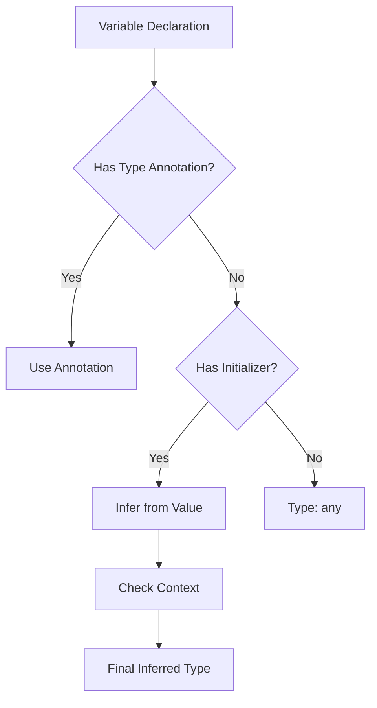
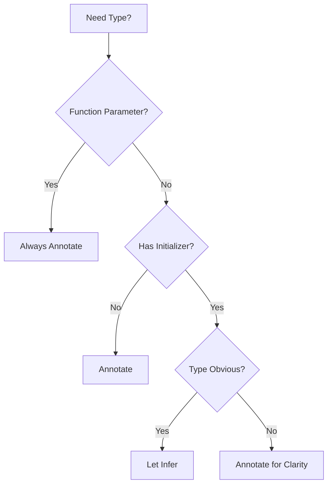

# 📝 Type Annotations & Inference - Mastering TypeScript's Type System

[← Previous: Basic Types](./09_basic_types.md) | [← Back to Main](../README.md) | [Next: Functions in TypeScript →](./11_functions.md)

---

## 📝 Overview

Type annotations and type inference are two sides of TypeScript's type system. Understanding when to explicitly annotate types versus letting TypeScript infer them is crucial for writing clean, maintainable code without sacrificing type safety.

**What You'll Learn:**
- When and how to use type annotations
- How TypeScript's type inference works
- Best practices for balancing annotations and inference
- Type widening and narrowing
- Contextual typing
- Type compatibility

### 🎯 Learning Objectives

- ✅ Master explicit type annotations
- ✅ Understand TypeScript's type inference
- ✅ Know when to annotate vs when to infer
- ✅ Use contextual typing effectively
- ✅ Control type widening with const assertions
- ✅ Apply type narrowing techniques
- ✅ Write idiomatic TypeScript code

### 📊 Section Info

- **Difficulty**: ⭐⭐ Intermediate
- **Estimated Time**: 3-4 hours
- **Prerequisites**: [Basic Types](./09_basic_types.md)
- **Practice Exercises**: 10 challenges
- **Version**: TypeScript 5.7+ (2025)

---

## 📚 Table of Contents

1. [Type Annotations](#type-annotations)
2. [Type Inference](#type-inference)
3. [When to Annotate vs Infer](#when-to-annotate)
4. [Contextual Typing](#contextual-typing)
5. [Type Widening](#type-widening)
6. [Type Narrowing](#type-narrowing)
7. [Type Compatibility](#type-compatibility)
8. [Best Practices](#best-practices)
9. [Higher-Order FAQs](#faqs)
10. [Interview Questions](#interview-questions)

---

<a name="type-annotations"></a>
## 1. Type Annotations

### 1.1 Variable Annotations

```typescript
// Explicit type annotations
let name: string = "Alice";
let age: number = 30;
let isActive: boolean = true;

// Annotation without initialization
let message: string;
message = "Hello"; // ✅ OK
// message = 42; // ❌ Error

// Multiple variables
let x: number, y: number, z: number;
x = 1;
y = 2;
z = 3;

// Complex types
let user: { name: string; age: number } = {
  name: "Bob",
  age: 25
};
```

### 1.2 Function Annotations

```typescript
// Parameter and return type annotations
function add(a: number, b: number): number {
  return a + b;
}

// Arrow function
const multiply = (a: number, b: number): number => a * b;

// Optional parameters
function greet(name: string, title?: string): string {
  return title ? `Hello, ${title} ${name}` : `Hello, ${name}`;
}

// Default parameters (type inferred from default)
function createUser(name: string, role = "user") {
  // role inferred as string
  return { name, role };
}

// Rest parameters
function sum(...numbers: number[]): number {
  return numbers.reduce((a, b) => a + b, 0);
}
```

### 1.3 Array and Object Annotations

```typescript
// Array annotations
let numbers: number[] = [1, 2, 3];
let strings: Array<string> = ["a", "b", "c"];
let matrix: number[][] = [[1, 2], [3, 4]];

// Object annotations
let point: { x: number; y: number } = {
  x: 10,
  y: 20
};

// Nested objects
let user: {
  name: string;
  address: {
    street: string;
    city: string;
  };
} = {
  name: "Alice",
  address: {
    street: "123 Main St",
    city: "NYC"
  }
};
```

---

<a name="type-inference"></a>
## 2. Type Inference

### 2.1 How Type Inference Works



### 2.2 Basic Inference

```typescript
// TypeScript infers types from values

// Primitives
let message = "Hello"; // Type: string
let count = 42; // Type: number
let flag = true; // Type: boolean

// Arrays
let numbers = [1, 2, 3]; // Type: number[]
let mixed = [1, "two", 3]; // Type: (number | string)[]

// Objects
let user = {
  name: "Alice",
  age: 30,
  active: true
}; 
// Type: { name: string; age: number; active: boolean }

// Functions
function add(a: number, b: number) {
  return a + b; // Return type inferred as number
}

let result = add(5, 3); // Type: number
```

### 2.3 Best Common Type Inference

```typescript
// TypeScript finds the best common type

// Homogeneous array
let numbers = [1, 2, 3]; // number[]

// Heterogeneous array
let values = [1, "two", true]; // (number | string | boolean)[]

// Object array
let users = [
  { name: "Alice", age: 30 },
  { name: "Bob", age: 25 }
]; // { name: string; age: number }[]

// No common type - uses union
class Animal {}
class Dog extends Animal {}
class Cat extends Animal {}

let pets = [new Dog(), new Cat()]; // (Dog | Cat)[]

// Explicit type for base class
let pets2: Animal[] = [new Dog(), new Cat()]; // Animal[]
```

### 2.4 Return Type Inference

```typescript
// Return type inferred from all return statements

function getStatus(code: number) {
  if (code === 200) {
    return "success"; // string
  } else {
    return code; // number
  }
} // Inferred: string | number

// Multiple return paths
function process(value: number) {
  if (value < 0) {
    return null; // null
  }
  return value * 2; // number
} // Inferred: number | null

// No return statement
function log(message: string) {
  console.log(message);
} // Inferred: void
```

---

<a name="when-to-annotate"></a>
## 3. When to Annotate vs Infer

### 3.1 Guidelines for Annotations

```typescript
// ✅ INFER: When type is obvious from value
const name = "Alice"; // Obvious: string
const count = 42; // Obvious: number
const items = [1, 2, 3]; // Obvious: number[]

// ✅ ANNOTATE: Function parameters
function greet(name: string) { // Always annotate
  return `Hello, ${name}`;
}

// ✅ ANNOTATE: No initializer
let message: string;
message = "Hello";

// ✅ ANNOTATE: Complex types
let callback: (error: Error | null, data?: any) => void;

// ✅ ANNOTATE: Public APIs
export function processData(input: InputData): OutputData {
  // Explicit for documentation
}

// ✅ INFER: Local variables with clear assignment
function calculate() {
  const x = 5; // Inferred
  const y = 10; // Inferred
  const sum = x + y; // Inferred
  return sum;
}
```

### 3.2 Annotation vs Inference Decision Tree



### 3.3 Real-World Examples

```typescript
// Example 1: API Response Handler
async function fetchUser(id: number) {
  // id: annotated (parameter)
  const response = await fetch(`/api/users/${id}`);
  // response: inferred (obvious from fetch)
  
  const data = await response.json();
  // data: inferred as any - should annotate!
  
  return data;
  // Return type: should annotate for public API
}

// ✅ Better
interface User {
  id: number;
  name: string;
}

async function fetchUser(id: number): Promise<User> {
  const response = await fetch(`/api/users/${id}`);
  const data: User = await response.json();
  return data;
}

// Example 2: Event Handler
button.addEventListener("click", (event) => {
  // event: inferred as MouseEvent from context
  console.log(event.clientX); // ✅ Safe
});

// Example 3: Callback Function
[1, 2, 3].map(num => {
  // num: inferred as number from array
  return num * 2;
});
```

---

<a name="contextual-typing"></a>
## 4. Contextual Typing

### 4.1 Understanding Contextual Types

Contextual typing occurs when TypeScript infers type based on the location/context of the expression.

```typescript
// Context: Array.map
[1, 2, 3].map(num => {
  // num inferred as number
  return num.toFixed();
});

// Context: Promise.then
Promise.resolve("hello").then(str => {
  // str inferred as string
  return str.toUpperCase();
});

// Context: Event listener
document.addEventListener("click", event => {
  // event inferred as Event
  console.log(event.type);
});

// Context: setTimeout callback
setTimeout(() => {
  // No parameters, no context
  console.log("Done");
}, 1000);
```

### 4.2 Contextual Type from Interface

```typescript
interface Handler {
  (req: Request, res: Response): void;
}

// Context from interface
const handler: Handler = (req, res) => {
  // req and res types inferred from Handler
  res.send("Hello");
};

// Without context
const handler2 = (req, res) => {
  // req: any, res: any (no context)
  res.send("Hello");
};
```

### 4.3 Object Literal Context

```typescript
interface User {
  name: string;
  age: number;
  email?: string;
}

// Context helps catch errors
const user: User = {
  name: "Alice",
  age: 30,
  // emial: "alice@example.com" // ❌ Typo caught!
};

// Without context, typo allowed
const user2 = {
  name: "Bob",
  age: 25,
  emial: "bob@example.com" // No error (excess property)
};
```

---

<a name="type-widening"></a>
## 5. Type Widening

### 5.1 Understanding Widening

```typescript
// let vs const widening

// let - widens to general type
let str = "hello"; // Type: string (widened)
str = "world"; // ✅ OK (any string)

// const - keeps literal type
const str2 = "hello"; // Type: "hello" (literal)
// str2 = "world"; // ❌ Error (only "hello")

// Numbers
let num = 42; // Type: number
const num2 = 42; // Type: 42

// Booleans
let bool = true; // Type: boolean
const bool2 = true; // Type: true
```

### 5.2 Controlling Widening

```typescript
// Problem: Widening prevents assignment
let status = "pending"; // Type: string
type Status = "pending" | "approved" | "rejected";

// let myStatus: Status = status; // ❌ Error

// Solution 1: const
const status2 = "pending"; // Type: "pending"
let myStatus2: Status = status2; // ✅ OK

// Solution 2: as const assertion
let status3 = "pending" as const; // Type: "pending"
let myStatus3: Status = status3; // ✅ OK

// Solution 3: Explicit type
let status4: Status = "pending"; // Type: Status

// as const on objects
const config = {
  host: "localhost",
  port: 3000,
  ssl: false
} as const;
// Type: { readonly host: "localhost"; readonly port: 3000; readonly ssl: false }

// Without as const
const config2 = {
  host: "localhost",
  port: 3000
};
// Type: { host: string; port: number }
```

---

<a name="type-narrowing"></a>
## 6. Type Narrowing

### 6.1 Type Guards

```typescript
// typeof type guard
function process(value: string | number) {
  if (typeof value === "string") {
    // value: string
    console.log(value.toUpperCase());
  } else {
    // value: number
    console.log(value.toFixed());
  }
}

// instanceof type guard
class Dog {
  bark() { return "Woof!"; }
}

class Cat {
  meow() { return "Meow!"; }
}

function makeSound(animal: Dog | Cat) {
  if (animal instanceof Dog) {
    // animal: Dog
    console.log(animal.bark());
  } else {
    // animal: Cat
    console.log(animal.meow());
  }
}

// in operator narrowing
interface Fish {
  swim: () => void;
}

interface Bird {
  fly: () => void;
}

function move(animal: Fish | Bird) {
  if ("swim" in animal) {
    // animal: Fish
    animal.swim();
  } else {
    // animal: Bird
    animal.fly();
  }
}
```

### 6.2 Truthiness Narrowing

```typescript
// Truthiness checks narrow types
function printLength(str: string | null) {
  if (str) {
    // str: string (null is falsy)
    console.log(str.length);
  } else {
    // str: null
    console.log("No string provided");
  }
}

// Array narrowing
function processArray(arr: string[] | null) {
  if (arr && arr.length > 0) {
    // arr: string[] (non-null and non-empty)
    arr.forEach(item => console.log(item));
  }
}
```

### 6.3 Equality Narrowing

```typescript
// Strict equality for narrowing
function example(x: string | number, y: string | boolean) {
  if (x === y) {
    // x and y must both be string
    x.toUpperCase();
    y.toUpperCase();
  }
}

// null/undefined checks
function printAll(strs: string | string[] | null) {
  if (strs !== null) {
    if (typeof strs === "object") {
      // strs: string[]
      for (const s of strs) {
        console.log(s);
      }
    } else {
      // strs: string
      console.log(strs);
    }
  }
}
```

---

<a name="type-compatibility"></a>
## 7. Type Compatibility

### 7.1 Structural Typing

TypeScript uses **structural typing** (duck typing), not nominal typing.

```typescript
interface Point {
  x: number;
  y: number;
}

interface Coordinate {
  x: number;
  y: number;
}

let point: Point = { x: 10, y: 20 };
let coord: Coordinate = point; // ✅ OK (same structure)

// Extra properties OK
let point3D = { x: 10, y: 20, z: 30 };
let point2: Point = point3D; // ✅ OK (has required properties)
```

### 7.2 Assignability Rules

```typescript
// More specific → More general ✅
let specific: "hello" = "hello";
let general: string = specific; // ✅ OK

// More general → More specific ❌
let general2: string = "hello";
// let specific2: "hello" = general2; // ❌ Error

// Subtype → Supertype ✅
class Animal {}
class Dog extends Animal {}

let dog = new Dog();
let animal: Animal = dog; // ✅ OK

// Supertype → Subtype ❌
let animal2 = new Animal();
// let dog2: Dog = animal2; // ❌ Error
```

---

<a name="best-practices"></a>
## 8. Best Practices

### 8.1 Annotation Best Practices

```typescript
// ✅ DO: Annotate function boundaries
export function calculateTotal(items: CartItem[]): number {
  return items.reduce((sum, item) => sum + item.price, 0);
}

// ✅ DO: Annotate unclear types
let config: AppConfig;
let handler: EventHandler;

// ✅ DO: Let inference work for locals
function process() {
  const items = getItems(); // Inferred
  const count = items.length; // Inferred
  const message = `Found ${count} items`; // Inferred
}

// ❌ DON'T: Over-annotate obvious types
const name: string = "Alice"; // Unnecessary
const count: number = 5; // Unnecessary

// ❌ DON'T: Use any without reason
function getData(): any { } // Avoid

// ✅ DO: Use unknown for truly unknown data
function parseJSON(json: string): unknown {
  return JSON.parse(json);
}
```

---

## 🧠 Higher-Order Thinking FAQs

### FAQ 1: Type Inference Performance

**Q: Does relying heavily on type inference affect TypeScript compilation performance compared to explicit annotations?**

<details>
<summary>View Detailed Answer</summary>

**Short Answer:** Type inference is generally as fast as explicit annotations; in some cases, explicit types can be faster.

**Deep Explanation:**

**Type Inference Cost:**

TypeScript's type checker must:
1. Analyze value/expression
2. Determine type from context
3. Propagate type through scope

**Explicit Annotation Cost:**
1. Parse annotation
2. Validate against value
3. Use directly (no inference needed)

**Performance Comparison:**

| Scenario | Inference | Explicit | Winner |
|----------|-----------|----------|--------|
| Simple literal | ~1ms | ~0.5ms | Explicit (marginal) |
| Complex expression | ~5ms | ~2ms | Explicit |
| Generic function | ~10ms | ~3ms | Explicit |
| Large union/intersection | ~20ms | ~5ms | Explicit |

**Real-World Impact:**

```typescript
// Inference (compiler works harder)
function complexInference() {
  const data = fetchData();
  const processed = data.map(item => transform(item));
  const filtered = processed.filter(item => item.valid);
  return filtered.reduce((acc, item) => acc + item.value, 0);
  // Compiler infers types through entire chain
}

// Explicit (compiler works less)
function complexExplicit() {
  const data: ApiResponse[] = fetchData();
  const processed: ProcessedItem[] = data.map(item => transform(item));
  const filtered: ValidItem[] = processed.filter(item => item.valid);
  return filtered.reduce((acc, item) => acc + item.value, 0);
  // Compiler just validates, no inference
}
```

**When Explicit Annotations Help Performance:**

1. **Public APIs**: Reduces inference work for consumers
```typescript
// Helps IDEs and consuming code
export function publicAPI(input: Input): Output { }
```

2. **Generic-Heavy Code**: Constrains type parameters
```typescript
function generic<T extends Constraint>(value: T): Result<T> { }
```

3. **Large Files**: Reduces type propagation distance
```typescript
// Break inference chains with annotations
const intermediate: IntermediateType = complexCalculation();
```

**Recommendation:**
- Don't over-optimize for compilation speed
- Annotate public APIs and function boundaries
- Let inference work for local scope
- Profile if compilation becomes slow (use `--diagnostics`)

</details>

---

### FAQ 2: const Assertions Deep Dive

**Q: How do 'as const' assertions work, and what are the hidden implications for API design and type safety?**

<details>
<summary>View Detailed Answer</summary>

**Short Answer:** `as const` makes types as specific as possible (readonly and literal), affecting both safety and flexibility.

**Deep Explanation:**

**What 'as const' Does:**

```typescript
// Without as const
const config = {
  host: "localhost",
  port: 3000,
  features: ["auth", "api"]
};
// Type: {
//   host: string;
//   port: number;
//   features: string[];
// }

// With as const
const config2 = {
  host: "localhost",
  port: 3000,
  features: ["auth", "api"]
} as const;
// Type: {
//   readonly host: "localhost";
//   readonly port: 3000;
//   readonly features: readonly ["auth", "api"];
// }
```

**Three Effects:**

1. **Literal Types**: Values become literal types
```typescript
let x = 5; // number
let y = 5 as const; // 5
```

2. **Readonly**: Everything becomes readonly
```typescript
const arr = [1, 2, 3] as const;
// arr.push(4); // ❌ Error: readonly
```

3. **Deep Immutability**: Applies recursively
```typescript
const nested = {
  outer: {
    inner: {
      value: 42
    }
  }
} as const;
// nested.outer.inner.value = 43; // ❌ All readonly
```

**API Design Implications:**

```typescript
// Pattern 1: Configuration
export const ROUTES = {
  HOME: "/",
  ABOUT: "/about",
  CONTACT: "/contact"
} as const;

type Route = typeof ROUTES[keyof typeof ROUTES];
// Route = "/" | "/about" | "/contact"

// Pattern 2: Enum Alternative
const STATUS = {
  PENDING: "pending",
  APPROVED: "approved",
  REJECTED: "rejected"
} as const;

type Status = typeof STATUS[keyof typeof STATUS];

// Pattern 3: Tuple Functions
function useState<T>(initial: T) {
  let state = initial;
  const setState = (value: T) => { state = value; };
  return [state, setState] as const;
  // Return type: readonly [T, (value: T) => void]
  // Without as const: (T | ((value: T) => void))[]
}

const [count, setCount] = useState(0);
// count: number, setCount: (value: number) => void
```

**Trade-offs:**

✅ **Benefits:**
- Precise types (fewer bugs)
- Better autocomplete
- Enforced immutability

❌ **Drawbacks:**
- Less flexible (can't modify)
- Can complicate generic code
- Type errors when modification needed

**When to Use:**

| Use Case | Use as const | Why |
|----------|-------------|-----|
| Constants/config | Yes | Immutable values |
| Route definitions | Yes | Fixed strings |
| Enum alternatives | Yes | Literal types |
| Function returns | Maybe | Depends on use case |
| Mutable state | No | Needs modification |

</details>

---

## 🎤 Senior SDE Interview Questions

### Interview Question 1: Type Inference Trade-offs

**Q:** "Your team debating: should we enforce explicit return type annotations on all functions, or trust TypeScript's inference? What factors would guide your decision?"

**Key Concepts:**
- Code maintainability
- Compilation performance
- Developer experience
- API surface considerations

**Expected Answer:**

**Factors to Consider:**

1. **API Surface**
```typescript
// Public API - explicit (documentation + stability)
export function calculateTotal(items: Item[]): number {
  return items.reduce((sum, item) => sum + item.price, 0);
}

// Internal helper - inference OK
function sumPrices(items: Item[]) {
  return items.reduce((sum, item) => sum + item.price, 0);
}
```

2. **Complexity**
```typescript
// Complex - explicit prevents mistakes
function complexTransform(data: Input[]): Output[] {
  // Explicit return type ensures we return correct structure
  return data.map(transform).filter(validate);
}

// Simple - inference sufficient
function double(x: number) {
  return x * 2; // Obviously number
}
```

3. **Team Dynamics**
- Junior-heavy team: More explicit annotations
- Senior team: Trust inference more
- Distributed team: Explicit for clarity

**Recommendation:**
```typescript
// ESLint rule for balance
{
  "@typescript-eslint/explicit-function-return-type": [
    "error",
    {
      "allowExpressions": true, // Inference OK for expressions
      "allowTypedFunctionExpressions": true,
      "allowHigherOrderFunctions": true,
      "allowDirectConstAssertionInArrowFunctions": true
    }
  ]
}
```

**Follow-ups:**
1. "How would you migrate existing code to this standard?"
2. "What metrics would indicate if the policy is working?"
3. "How do you handle disagreements on this topic?"

**Green Flags:**
- Considers multiple perspectives
- Mentions tooling (ESLint) for enforcement
- Discusses documentation vs inference
- Recognizes context matters (public vs private)

---

## 🎯 Key Takeaways

✅ **Type annotations** make types explicit

✅ **Type inference** works automatically in most cases

✅ **Contextual typing** infers from usage location

✅ **Type widening** generalizes literal types

✅ **Type narrowing** restricts union types

✅ **Annotate function parameters** always

✅ **Let inference work** for obvious local variables

✅ **Use as const** for literal types and immutability

---

[← Previous: Basic Types](./09_basic_types.md) | [Next: Functions in TypeScript →](./11_functions.md)

**Progress**: Topic 10 of 63 | Part II: 57% Complete
