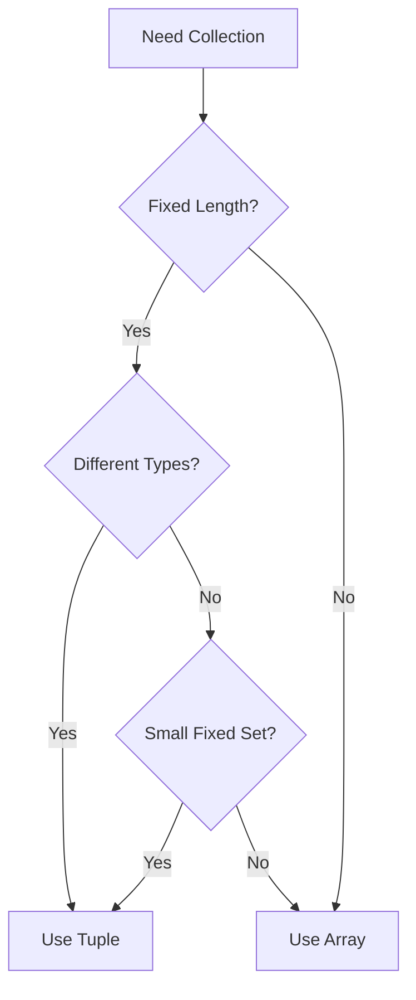

# 📚 Arrays & Tuples in TypeScript - Type-Safe Collections

[← Previous: Objects & Interfaces](./12_objects_interfaces.md) | [← Back to Main](../README.md) | [Next: Union & Intersection Types →](./14_union_intersection.md)

---

## 📝 Overview

Arrays and tuples are essential data structures in TypeScript. While JavaScript has only arrays, TypeScript adds tuples—fixed-length arrays with specific types at each position. Understanding the type system for collections is crucial for building robust applications.

**What You'll Learn:**
- Array type syntax and patterns
- Generic array types
- Readonly arrays
- Tuple types and their uses
- Rest elements in tuples
- Array vs tuple trade-offs
- Advanced collection patterns

### 🎯 Learning Objectives

- ✅ Master array type syntax
- ✅ Use generic array types
- ✅ Work with readonly arrays
- ✅ Understand tuple types deeply
- ✅ Use optional and rest elements in tuples
- ✅ Choose between arrays and tuples appropriately
- ✅ Apply advanced collection patterns
- ✅ Ensure type safety with collections

### 📊 Section Info

- **Difficulty**: ⭐⭐ Intermediate
- **Estimated Time**: 3-4 hours
- **Prerequisites**: [Basic Types](./09_basic_types.md), [Objects & Interfaces](./12_objects_interfaces.md)
- **Practice Exercises**: 12 challenges
- **Version**: TypeScript 5.7+ (2025)

---

## 📚 Table of Contents

1. [Array Types](#array-types)
2. [Generic Array Types](#generic-arrays)
3. [Readonly Arrays](#readonly-arrays)
4. [Tuple Types](#tuple-types)
5. [Optional Tuple Elements](#optional-tuples)
6. [Rest Elements in Tuples](#rest-tuples)
7. [Named Tuple Elements](#named-tuples)
8. [Arrays vs Tuples](#arrays-vs-tuples)
9. [Advanced Patterns](#advanced-patterns)
10. [Best Practices](#best-practices)
11. [Higher-Order FAQs](#faqs)
12. [Interview Questions](#interview-questions)

---

<a name="array-types"></a>
## 1. Array Types

### 1.1 Basic Array Syntax

```typescript
// Syntax 1: Type[]
let numbers: number[] = [1, 2, 3, 4, 5];
let strings: string[] = ["hello", "world"];
let booleans: boolean[] = [true, false, true];

// Syntax 2: Array<Type>
let numbers2: Array<number> = [1, 2, 3];
let strings2: Array<string> = ["hello", "world"];

// Both are equivalent - Type[] is more common
```

**Version Tracking:**
- ✅ Array types (v1.0+) - Core feature
- 🆕 Readonly arrays (v3.0+) - Immutability support
- 🆕 Variadic tuple types (v4.0+) - Advanced tuples

### 1.2 Complex Array Types

```typescript
// Array of objects
interface User {
  name: string;
  age: number;
}

let users: User[] = [
  { name: "Alice", age: 30 },
  { name: "Bob", age: 25 }
];

// Nested arrays (multidimensional)
let matrix: number[][] = [
  [1, 2, 3],
  [4, 5, 6],
  [7, 8, 9]
];

// Array of functions
type NumberFn = (n: number) => number;
let operations: NumberFn[] = [
  n => n * 2,
  n => n + 10,
  n => n ** 2
];

// Union type arrays
let mixed: (number | string)[] = [1, "two", 3, "four"];
```

### 1.3 Array Type Inference

```typescript
// TypeScript infers array types
let numbers = [1, 2, 3]; // number[]
let strings = ["a", "b"]; // string[]
let mixed = [1, "two"]; // (number | string)[]

// Empty array needs annotation
let empty = []; // any[]
let typedEmpty: number[] = []; // number[]

// Best common type
let values = [1, 2, "three"]; // (number | string)[]
```

---

<a name="generic-arrays"></a>
## 2. Generic Array Types

### 2.1 Array<T> Generic

```typescript
// Array<T> is equivalent to T[]
let numbers: Array<number> = [1, 2, 3];
let strings: Array<string> = ["a", "b", "c"];

// Nested generics
let matrix: Array<Array<number>> = [
  [1, 2],
  [3, 4]
];

// Generic constraints
function getFirst<T>(arr: Array<T>): T | undefined {
  return arr[0];
}

const first = getFirst([1, 2, 3]); // number | undefined
```

### 2.2 Custom Generic Array Types

```typescript
// Generic array wrapper
interface List<T> {
  items: T[];
  add(item: T): void;
  remove(item: T): boolean;
  get(index: number): T | undefined;
}

class ArrayList<T> implements List<T> {
  items: T[] = [];
  
  add(item: T): void {
    this.items.push(item);
  }
  
  remove(item: T): boolean {
    const index = this.items.indexOf(item);
    if (index > -1) {
      this.items.splice(index, 1);
      return true;
    }
    return false;
  }
  
  get(index: number): T | undefined {
    return this.items[index];
  }
}

// Usage
const numberList = new ArrayList<number>();
numberList.add(1);
numberList.add(2);
```

---

<a name="readonly-arrays"></a>
## 3. Readonly Arrays

### 3.1 ReadonlyArray Type

```typescript
// Readonly array - cannot be modified
let numbers: readonly number[] = [1, 2, 3];

// ❌ Cannot modify
// numbers.push(4); // Error: Property 'push' does not exist
// numbers[0] = 10; // Error: Index signature only permits reading
// numbers.pop(); // Error: Property 'pop' does not exist

// ✅ Can read
console.log(numbers[0]); // 1
console.log(numbers.length); // 3

// ✅ Can create new arrays (non-mutating methods)
let doubled = numbers.map(n => n * 2); // number[]
let filtered = numbers.filter(n => n > 1); // number[]
```

### 3.2 ReadonlyArray<T> Generic

```typescript
// Using ReadonlyArray generic
let values: ReadonlyArray<string> = ["a", "b", "c"];

// Function parameter - readonly by default
function sum(numbers: readonly number[]): number {
  return numbers.reduce((a, b) => a + b, 0);
}

// Can pass regular array to readonly parameter
let arr = [1, 2, 3];
sum(arr); // ✅ OK

// Cannot pass readonly to mutable parameter
function modify(numbers: number[]): void {
  numbers.push(4);
}

let readonlyArr: readonly number[] = [1, 2, 3];
// modify(readonlyArr); // ❌ Error: readonly not assignable to mutable
```

### 3.3 When to Use Readonly

```typescript
// ✅ Use readonly for data that shouldn't change
interface Config {
  readonly allowedValues: readonly string[];
}

const config: Config = {
  allowedValues: ["option1", "option2"]
};

// ✅ Use readonly for function parameters (defensive)
function processItems(items: readonly Item[]): ProcessedItem[] {
  // Function cannot accidentally modify items
  return items.map(transform);
}

// ❌ Don't use readonly if mutation is needed
function addItem(items: readonly Item[], newItem: Item): Item[] {
  // return items.push(newItem); // ❌ Error: push doesn't exist
  return [...items, newItem]; // ✅ Create new array
}
```

---

<a name="tuple-types"></a>
## 4. Tuple Types

### 4.1 Basic Tuples

```typescript
// Tuple - fixed-length array with specific types
let person: [string, number] = ["Alice", 30];

// Type checking enforced
let valid: [string, number] = ["Bob", 25]; // ✅ OK
// let invalid: [string, number] = [25, "Bob"]; // ❌ Error: wrong order
// let invalid2: [string, number] = ["Bob", 25, true]; // ❌ Error: too long

// Accessing tuple elements
let name: string = person[0]; // "Alice"
let age: number = person[1]; // 30

// Destructuring tuples
let [userName, userAge] = person;
console.log(userName); // "Alice"
console.log(userAge); // 30
```

### 4.2 Tuples with Multiple Types

```typescript
// Different types at each position
type Response = [number, string, boolean];
let result: Response = [200, "OK", true];

// Complex tuple
type UserData = [
  id: number,
  name: string,
  email: string,
  created: Date
];

let user: UserData = [
  1,
  "Alice",
  "alice@example.com",
  new Date()
];
```

---

<a name="optional-tuples"></a>
## 5. Optional Tuple Elements

### 5.1 Optional Elements with ?

```typescript
// Optional tuple elements
type Point2D = [x: number, y: number, z?: number];

let point2D: Point2D = [10, 20]; // ✅ OK
let point3D: Point2D = [10, 20, 30]; // ✅ OK

// Multiple optional elements
type RGB = [red: number, green: number, blue: number, alpha?: number];

let color1: RGB = [255, 0, 0]; // RGB
let color2: RGB = [255, 0, 0, 0.5]; // RGBA
```

### 5.2 Optional Elements in Functions

```typescript
// Function returning optional tuple
function parseCoordinate(input: string): [number, number, number?] {
  const parts = input.split(",").map(Number);
  if (parts.length === 2) {
    return [parts[0], parts[1]];
  }
  return [parts[0], parts[1], parts[2]];
}

let coord1 = parseCoordinate("10,20"); // [number, number, number?]
let coord2 = parseCoordinate("10,20,30"); // [number, number, number?]
```

---

<a name="rest-tuples"></a>
## 6. Rest Elements in Tuples

### 6.1 Rest Elements

```typescript
// Rest elements in tuples
type StringNumber = [string, ...number[]];

let data1: StringNumber = ["hello", 1, 2, 3];
let data2: StringNumber = ["world"];
let data3: StringNumber = ["test", 1];

// Rest at any position
type Args = [string, ...number[], boolean];
let args: Args = ["start", 1, 2, 3, true];

// Multiple types in rest
type Mixed = [string, ...(number | boolean)[]];
let mixed: Mixed = ["label", 1, true, 2, false];
```

### 6.2 Variadic Tuples (v4.0+)

```typescript
// Generic rest elements
function concat<T extends unknown[], U extends unknown[]>(
  arr1: T,
  arr2: U
): [...T, ...U] {
  return [...arr1, ...arr2];
}

const result = concat([1, 2], ["a", "b"]);
// Type: [number, number, string, string]

// Practical example: typed curry
function curry<T extends unknown[], U extends unknown[], R>(
  fn: (...args: [...T, ...U]) => R,
  ...first: T
): (...args: U) => R {
  return (...second: U) => fn(...first, ...second);
}
```

---

<a name="named-tuples"></a>
## 7. Named Tuple Elements (v4.0+)

### 7.1 Labeling Tuple Elements

```typescript
// Named tuple elements improve readability
type Range = [start: number, end: number];
type Color = [red: number, green: number, blue: number, alpha?: number];

// Usage
let range: Range = [0, 100];
let color: Color = [255, 0, 0, 0.5];

// Names are for documentation, position still matters
let [r, g, b, a] = color;
console.log(r); // 255

// Helpful for function signatures
function clamp(value: number, [min, max]: [min: number, max: number]): number {
  return Math.max(min, Math.min(max, value));
}
```

### 7.2 Documenting Function Returns

```typescript
// Named tuples as return types
function useState<T>(
  initial: T
): [value: T, setValue: (v: T) => void] {
  let value = initial;
  const setValue = (v: T) => { value = v; };
  return [value, setValue];
}

// Clear what each position means
const [count, setCount] = useState(0);
const [name, setName] = useState("Alice");
```

---

<a name="arrays-vs-tuples"></a>
## 8. Arrays vs Tuples

### 8.1 When to Use Each



**Comparison:**

| Feature | Array | Tuple |
|---------|-------|-------|
| **Length** | Variable | Fixed |
| **Types** | Same type | Different types per position |
| **Use Case** | Collections of similar items | Fixed structure |
| **Example** | `number[]` | `[string, number]` |
| **Iteration** | Natural (for/map) | Destructure |

### 8.2 Real-World Examples

```typescript
// Array - collection of similar items
interface Product {
  id: number;
  name: string;
  price: number;
}

let products: Product[] = [
  { id: 1, name: "Laptop", price: 999 },
  { id: 2, name: "Mouse", price: 29 }
  // Can add more...
];

// Tuple - fixed structure
type CartItem = [product: Product, quantity: number];

let cartItem: CartItem = [
  { id: 1, name: "Laptop", price: 999 },
  2
];

// Tuple for function return
function divide(a: number, b: number): [quotient: number, remainder: number] {
  return [Math.floor(a / b), a % b];
}

const [q, r] = divide(17, 5);
console.log(q, r); // 3, 2
```

---

<a name="advanced-patterns"></a>
## 9. Advanced Patterns

### 9.1 Type-Safe Coordinates

```typescript
// 2D Point
type Point2D = readonly [x: number, y: number];

// 3D Point
type Point3D = readonly [x: number, y: number, z: number];

function distance2D([x1, y1]: Point2D, [x2, y2]: Point2D): number {
  return Math.sqrt((x2 - x1) ** 2 + (y2 - y1) ** 2);
}

const p1: Point2D = [0, 0];
const p2: Point2D = [3, 4];
console.log(distance2D(p1, p2)); // 5
```

### 9.2 State Machine with Tuples

```typescript
// Type-safe state transitions
type State = "idle" | "loading" | "success" | "error";
type Action = 
  | ["START"]
  | ["SUCCESS", data: unknown]
  | ["ERROR", error: Error]
  | ["RESET"];

function reducer(state: State, action: Action): State {
  switch (action[0]) {
    case "START":
      return "loading";
    case "SUCCESS":
      console.log("Data:", action[1]);
      return "success";
    case "ERROR":
      console.log("Error:", action[1]);
      return "error";
    case "RESET":
      return "idle";
  }
}
```

### 9.3 Type-Safe CSV Parsing

```typescript
// CSV row as tuple
type CSVRow = [
  id: string,
  name: string,
  age: number,
  email: string
];

function parseCSVRow(line: string): CSVRow {
  const [id, name, ageStr, email] = line.split(",");
  return [id, name, parseInt(ageStr), email];
}

// Type-safe access
const row = parseCSVRow("1,Alice,30,alice@example.com");
const [id, name, age, email] = row;
console.log(name.toUpperCase()); // ✅ Type: string
console.log(age.toFixed()); // ✅ Type: number
```

---

<a name="best-practices"></a>
## 10. Best Practices

### 10.1 Array vs Tuple Guidelines

```typescript
// ✅ Use array for homogeneous collections
let scores: number[] = [95, 87, 91, 88];

// ✅ Use tuple for heterogeneous fixed structure
let user: [string, number, boolean] = ["Alice", 30, true];

// ✅ Use readonly for immutable data
const DAYS: readonly string[] = [
  "Mon", "Tue", "Wed", "Thu", "Fri", "Sat", "Sun"
];

// ✅ Use named tuples for clarity
type Response = [
  status: number,
  message: string,
  data?: unknown
];

// ❌ Don't abuse tuples for large structures
// type User = [string, string, string, number, boolean, Date, ...];
// ✅ Use interface instead
interface User {
  firstName: string;
  lastName: string;
  email: string;
  age: number;
  // ...
}
```

---

## 📊 Self-Assessment Checkpoints

### ✅ Checkpoint 1: Arrays

**You should be able to:**
- ✅ Declare and use typed arrays
- ✅ Work with readonly arrays
- ✅ Use array methods with proper types

**Verification:**
```typescript
// Create a readonly array of products
// Each product has: id (number), name (string), price (number)
// Write a function that returns total price
```

<details>
<summary>View Solution</summary>

```typescript
interface Product {
  id: number;
  name: string;
  price: number;
}

function calculateTotal(products: readonly Product[]): number {
  return products.reduce((sum, product) => sum + product.price, 0);
}

const products: readonly Product[] = [
  { id: 1, name: "Laptop", price: 999 },
  { id: 2, name: "Mouse", price: 29 }
];

console.log(calculateTotal(products)); // 1028
```
</details>

---

### ✅ Checkpoint 2: Tuples

**You should be able to:**
- ✅ Define and use tuple types
- ✅ Use optional and rest elements
- ✅ Choose between arrays and tuples

**Verification:**
```typescript
// Create a function that returns user info as named tuple
// Return: [id: number, name: string, email?: string]
```

<details>
<summary>View Solution</summary>

```typescript
function getUser(
  id: number
): [id: number, name: string, email?: string] {
  if (id === 1) {
    return [1, "Alice", "alice@example.com"];
  }
  return [id, "Guest"];
}

const [userId, userName, userEmail] = getUser(1);
console.log(userId, userName, userEmail);
```
</details>

---

## 🧠 Higher-Order Thinking FAQs

### FAQ 1: Readonly Arrays Performance

**Q: Do readonly arrays have runtime performance implications, or are they purely compile-time constructs? Should we use them everywhere?**

<details>
<summary>View Detailed Answer</summary>

**Short Answer:** Readonly is purely compile-time; zero runtime cost. Use for function parameters and immutable data.

**Deep Explanation:**

**Runtime Reality:**

```typescript
// TypeScript
const numbers: readonly number[] = [1, 2, 3];

// Compiled JavaScript
const numbers = [1, 2, 3]; // No readonly at runtime!
```

All TypeScript type annotations, including `readonly`, are **erased during compilation**. The generated JavaScript is identical whether you use `readonly` or not.

**Performance Comparison:**

| Operation | Regular Array | Readonly Array | Difference |
|-----------|---------------|----------------|------------|
| Declaration | ~0.001ms | ~0.001ms | None |
| Access | ~0.0001ms | ~0.0001ms | None |
| Iteration | ~0.01ms/1000 | ~0.01ms/1000 | None |
| Memory | Same | Same | None |

**Compile-Time Benefits:**

```typescript
// Prevents accidental mutations
function processData(data: readonly number[]): number[] {
  // data.push(4); // ❌ Caught at compile-time
  return data.map(n => n * 2); // ✅ Non-mutating OK
}

// Forces functional style
const original = [1, 2, 3];
const modified = [...original, 4]; // Create new array
```

**When to Use Readonly:**

✅ **Always for function parameters** (unless mutation is intentional)
```typescript
function calculate(values: readonly number[]): number {
  // Cannot accidentally modify input
}
```

✅ **For constants and configuration**
```typescript
const CONFIG: readonly string[] = ["prod", "staging", "dev"];
```

✅ **For immutable data structures**
```typescript
interface State {
  readonly items: readonly Item[];
}
```

❌ **Not needed for local variables** (unless sharing reference)
```typescript
function process() {
  const local = [1, 2, 3]; // readonly not needed
  return local.map(n => n * 2);
}
```

**Real-World Impact:**

```typescript
// Library API design - readonly parameters prevent misuse
export function sortBy<T>(
  array: readonly T[],
  key: keyof T
): T[] {
  // Users know we won't modify their array
  return [...array].sort((a, b) => 
    a[key] > b[key] ? 1 : -1
  );
}
```

</details>

---

### FAQ 2: Tuple Length Enforcement

**Q: How does TypeScript enforce tuple length at compile-time, and why can push() still work on tuples at runtime?**

<details>
<summary>View Detailed Answer</summary>

**Short Answer:** TypeScript catches length violations at compile-time through type checking, but JavaScript runtime has no tuple concept.

**Deep Explanation:**

**Compile-Time Enforcement:**

```typescript
// TypeScript prevents invalid tuple assignments
type Pair = [number, number];

let pair: Pair = [1, 2]; // ✅ OK
// let invalid: Pair = [1, 2, 3]; // ❌ Error at compile-time
// let short: Pair = [1]; // ❌ Error at compile-time
```

**Runtime Reality - The Trap:**

```typescript
// At runtime, tuples ARE arrays
let pair: [number, number] = [1, 2];
pair.push(3); // ⚠️ Compiles! Runtime allows it

console.log(pair); // [1, 2, 3] - violated tuple contract!
console.log(pair[2]); // 3 - accessing "out of bounds"
```

**Why This Happens:**

1. **JavaScript has no tuples** - everything is an array
2. **TypeScript erases types** - runtime has no enforcement
3. **Array methods available** - push/pop etc. still exist

**The Solution: Readonly Tuples**

```typescript
// Use readonly to prevent mutations
let pair: readonly [number, number] = [1, 2];

// pair.push(3); // ❌ Compile error: push doesn't exist on readonly
pair[0] = 5; // ❌ Compile error: cannot assign to readonly

// ✅ Create new tuples instead
let newPair: [number, number] = [pair[0] + 1, pair[1]];
```

**Best Practice Pattern:**

```typescript
// Always use readonly for tuples
type Point = readonly [x: number, y: number];
type Range = readonly [start: number, end: number];
type RGB = readonly [r: number, g: number, b: number];

// For mutable tuples, be explicit
type MutablePair = [number, number]; // Can be mutated
```

**Production Implications:**

```typescript
// Bug from mutable tuple
function processCoordinates(coords: [number, number][]): void {
  coords.forEach(coord => {
    coord.push(Date.now()); // Oops! Mutated tuple
    // Now each coord is [number, number, number]
  });
}

// Safe version with readonly
function processCoordinates(
  coords: readonly (readonly [number, number])[]
): void {
  coords.forEach(coord => {
    // coord.push(Date.now()); // ❌ Prevented
    const enhanced = [...coord, Date.now()]; // ✅ Create new
  });
}
```

</details>

---

## 🎤 Senior SDE Interview Questions

### Interview Question 1: Type-Safe Data Pipeline

**Q:** "Design a type-safe data transformation pipeline where each stage's output type matches the next stage's input type. Use tuples to represent pipeline stages. How would you implement this?"

**Key Concepts:**
- Tuples
- Generics
- Type inference
- Function composition

**Expected Answer:**

```typescript
// Pipeline stage as tuple: [input type, output type, transform function]
type Stage<I, O> = [input: I, output: O, transform: (input: I) => O];

// Pipeline builder
class Pipeline<T> {
  private value: T;
  
  constructor(initial: T) {
    this.value = initial;
  }
  
  pipe<U>(transform: (input: T) => U): Pipeline<U> {
    return new Pipeline(transform(this.value));
  }
  
  execute(): T {
    return this.value;
  }
}

// Usage
const result = new Pipeline("42")
  .pipe(s => parseInt(s))      // string => number
  .pipe(n => n * 2)             // number => number
  .pipe(n => n.toString())      // number => string
  .execute();                   // string

// Type-safe: each pipe validates types
// new Pipeline("42")
//   .pipe(s => parseInt(s))
//   .pipe(s => s.toUpperCase()) // ❌ Error: number doesn't have toUpperCase
```

**Follow-ups:**
1. "How would you add error handling to this pipeline?"
2. "How would you make this work with async operations?"
3. "What if some stages are optional?"

**Green Flags:**
- Uses method chaining with generics
- Understands type inference through chain
- Considers error handling
- Mentions real-world use cases (ETL, data processing)

---

## 🎯 Key Takeaways

✅ **Arrays** hold variable-length collections of same type

✅ **Tuples** represent fixed-length with specific types per position

✅ **Readonly arrays** prevent accidental mutations

✅ **Named tuple elements** improve readability (v4.0+)

✅ **Rest elements** enable flexible tuple patterns (v4.0+)

✅ **Arrays for collections**, tuples for fixed structures

✅ **Readonly tuples** prevent length violations

---

[← Previous: Objects & Interfaces](./12_objects_interfaces.md) | [Next: Union & Intersection Types →](./14_union_intersection.md)

**Progress**: Topic 13 of 63 | Part III: 13% Complete
