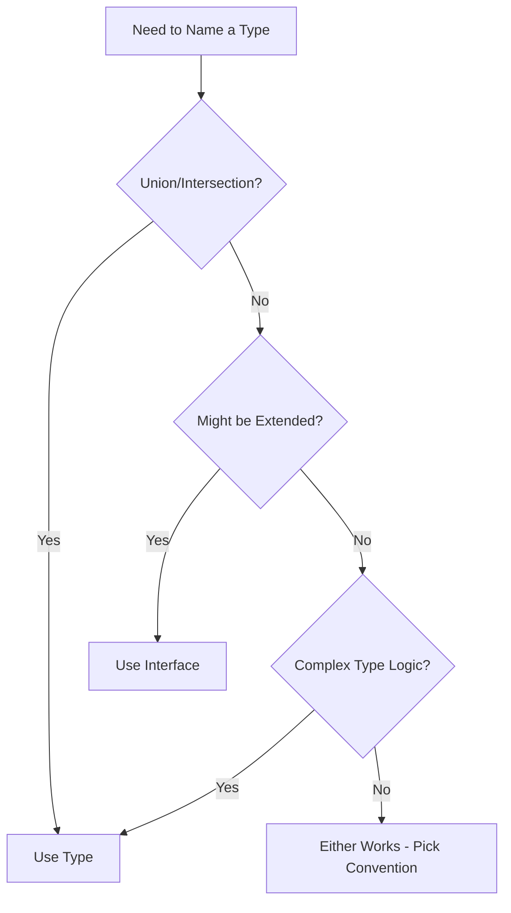

# 🏷️ Type Aliases vs Interfaces - Choosing the Right Tool

[← Previous: Union & Intersection](./14_union_intersection.md) | [← Back to Main](../README.md) | [Next: Literal Types →](./16_literal_types.md)

---

## 📝 Overview

TypeScript offers two primary ways to name types: type aliases and interfaces. While they overlap significantly, understanding their differences, strengths, and appropriate use cases is crucial for writing idiomatic TypeScript code.

**What You'll Learn:**
- Type alias syntax and capabilities
- Interface declaration and features
- Key differences between type and interface
- When to use each
- Performance considerations
- Migration strategies

### 🎯 Learning Objectives

- ✅ Master type alias syntax
- ✅ Understand interface capabilities
- ✅ Know the differences between type and interface
- ✅ Choose appropriately for each use case
- ✅ Use advanced type alias features
- ✅ Apply best practices consistently

### 📊 Section Info

- **Difficulty**: ⭐⭐ Intermediate
- **Estimated Time**: 3-4 hours
- **Prerequisites**: [Objects & Interfaces](./12_objects_interfaces.md), [Union & Intersection](./14_union_intersection.md)
- **Practice Exercises**: 10 challenges
- **Version**: TypeScript 5.7+ (2025)

---

## 📚 Table of Contents

1. [Type Aliases](#type-aliases)
2. [Interfaces Recap](#interfaces)
3. [Key Differences](#key-differences)
4. [When to Use Which](#when-to-use)
5. [Advanced Type Features](#advanced-features)
6. [Performance Considerations](#performance)
7. [Migration Strategies](#migration)
8. [Best Practices](#best-practices)
9. [Higher-Order FAQs](#faqs)
10. [Interview Questions](#interview-questions)

---

<a name="type-aliases"></a>
## 1. Type Aliases

### 1.1 Basic Type Aliases

```typescript
// Alias for primitive
type Name = string;
type Age = number;
type ID = string | number;

// Alias for object shape
type User = {
  name: string;
  age: number;
  email?: string;
};

// Alias for function
type MathOperation = (a: number, b: number) => number;

// Usage
const multiply: MathOperation = (a, b) => a * b;
```

### 1.2 Union and Intersection

```typescript
// Union types
type Status = "pending" | "approved" | "rejected";
type ID = string | number;
type Response = SuccessResponse | ErrorResponse;

// Intersection types
type Named = { name: string };
type Aged = { age: number };
type Person = Named & Aged;

// Complex combinations
type Result<T> = 
  | { success: true; data: T }
  | { success: false; error: string };
```

### 1.3 Generic Type Aliases

```typescript
// Generic type alias
type Box<T> = {
  value: T;
  getValue(): T;
};

type Result<T, E = Error> = 
  | { ok: true; value: T }
  | { ok: false; error: E };

// Usage
const numberBox: Box<number> = {
  value: 42,
  getValue() { return this.value; }
};

const result: Result<string> = {
  ok: true,
  value: "Success"
};
```

---

<a name="interfaces"></a>
## 2. Interfaces Recap

### 2.1 Interface Syntax

```typescript
// Basic interface
interface User {
  name: string;
  age: number;
  email?: string;
}

// Interface with methods
interface Calculator {
  add(a: number, b: number): number;
  subtract(a: number, b: number): number;
}

// Extending interfaces
interface Employee extends User {
  employeeId: number;
  department: string;
}
```

### 2.2 Interface Merging

```typescript
// Declaration merging
interface Window {
  title: string;
}

interface Window {
  version: number;
}

// Merged: Window has both title and version
const win: Window = {
  title: "My App",
  version: 1
};
```

---

<a name="key-differences"></a>
## 3. Key Differences

### 3.1 Capability Comparison

```typescript
// 1. TYPE can create unions
type ID = string | number; // ✅
// interface ID = string | number; // ❌ Error

// 2. TYPE can create tuples
type Point = [number, number]; // ✅
// interface Point = [number, number]; // ❌ Error

// 3. TYPE can alias primitives
type Name = string; // ✅
// interface Name = string; // ❌ Error

// 4. INTERFACE can be merged
interface User { name: string; }
interface User { age: number; } // ✅ Merges

// type User = { name: string };
// type User = { age: number }; // ❌ Error: Duplicate

// 5. INTERFACE can extend classes
class Control {
  private state: any;
}
interface SelectableControl extends Control { // ✅
  select(): void;
}

// 6. TYPE can use computed properties
type Keys = "name" | "age";
type UserRecord = {
  [K in Keys]: string;
}; // ✅

// 7. TYPE can use conditional types
type IsString<T> = T extends string ? true : false; // ✅
```

### 3.2 Feature Matrix

| Feature | Type Alias | Interface |
|---------|-----------|-----------|
| **Object shapes** | ✅ | ✅ |
| **Function types** | ✅ | ✅ |
| **Unions** | ✅ | ❌ |
| **Intersections** | ✅ | ❌ |
| **Primitives** | ✅ | ❌ |
| **Tuples** | ✅ | ❌ |
| **Mapped types** | ✅ | ❌ |
| **Conditional types** | ✅ | ❌ |
| **Declaration merging** | ❌ | ✅ |
| **Extends classes** | ❌ | ✅ |
| **Computed properties** | ✅ | ❌ |

---

<a name="when-to-use"></a>
## 4. When to Use Which

### 4.1 Decision Matrix



### 4.2 Use Interface When

```typescript
// ✅ Object API that might be extended
export interface PluginAPI {
  register(name: string): void;
  unregister(name: string): void;
}

// Users can augment
declare module 'my-library' {
  interface PluginAPI {
    customMethod(): void;
  }
}

// ✅ React components (convention)
interface ButtonProps {
  label: string;
  onClick: () => void;
  disabled?: boolean;
}

// ✅ Class contracts
interface Serializable {
  serialize(): string;
}

class User implements Serializable {
  serialize() {
    return JSON.stringify(this);
  }
}
```

### 4.3 Use Type When

```typescript
// ✅ Unions and intersections
type Status = "idle" | "loading" | "success" | "error";
type Combined = PartA & PartB;

// ✅ Mapped types
type Readonly<T> = {
  readonly [P in keyof T]: T[P];
};

// ✅ Conditional types
type NonNullable<T> = T extends null | undefined ? never : T;

// ✅ Tuples
type Point = [number, number];
type RGB = [number, number, number];

// ✅ Complex type transformations
type ReturnTypeOf<T> = T extends (...args: any[]) => infer R ? R : never;
```

---

<a name="performance"></a>
## 5. Performance Considerations

### 5.1 Compilation Speed

```typescript
// Interface extends (faster)
interface A { a: string }
interface B extends A { b: string }
interface C extends B { c: string }
// Flat structure: { a: string; b: string; c: string }

// Type intersection (slower for deep nesting)
type A = { a: string }
type B = A & { b: string }
type C = B & { c: string }
// Nested: A & { b: string } & { c: string }
// Compiler must resolve intersections
```

### 5.2 Error Messages

```typescript
// Interface - clearer errors
interface User {
  name: string;
  age: number;
}

// Missing property error is direct
// const user: User = { name: "Alice" };
// Error: Property 'age' is missing

// Type - can be verbose with complex types
type Complex = A & B & C & D;
// Errors show full expanded type structure
```

---

<a name="best-practices"></a>
## 6. Best Practices

### 6.1 Naming Conventions

```typescript
// ❌ DON'T: Prefix interfaces with 'I'
interface IUser { name: string; } // Old style

// ✅ DO: Just use the name
interface User { name: string; }

// ❌ DON'T: Prefix types with 'T'
type TStatus = "pending" | "done"; // Unnecessary

// ✅ DO: Just use the name
type Status = "pending" | "done";

// ✅ DO: Descriptive names
type HttpMethod = "GET" | "POST" | "PUT" | "DELETE";
type ApiResponse<T> = Success<T> | Failure;
```

### 6.2 Consistency Guidelines

```typescript
// Pick a convention and stick to it

// ✅ GOOD: Consistent approach
// Use interface for objects
interface User { name: string; }
interface Product { id: number; }

// Use type for everything else
type Status = "pending" | "done";
type ID = string | number;

// ✅ ALSO GOOD: Use type everywhere
type User = { name: string; };
type Product = { id: number; };
type Status = "pending" | "done";

// ❌ BAD: Inconsistent mixing without reason
interface User { name: string; }
type Product = { id: number; };
```

---

## 🧠 Higher-Order FAQs

### FAQ 1: When Declaration Merging Becomes a Problem

**Q: Declaration merging is touted as an interface advantage, but can it actually cause bugs? When is merging problematic?**

<details>
<summary>View Detailed Answer</summary>

**Short Answer:** Declaration merging can cause unexpected behavior in large codebases and with third-party libraries.

**Deep Explanation:**

**Problem 1: Accidental Merging**

```typescript
// File 1: models/User.ts
export interface User {
  id: number;
  name: string;
}

// File 2: services/User.ts (different module, same name)
export interface User {
  email: string;
  password: string;
}

// If both imported:
import { User as ModelUser } from './models/User';
import { User as ServiceUser } from './services/User';

// In same scope:
interface User { id: number; }
interface User { email: string; }
// Silently merges! May not be intended
```

**Problem 2: Third-Party Library Pollution**

```typescript
// Your code augments library
declare module 'express' {
  interface Request {
    user?: CustomUser;
  }
}

// Another developer in same codebase
declare module 'express' {
  interface Request {
    user?: DifferentUser; // Conflict!
  }
}

// Both merge - which user type wins?
```

**Problem 3: Import Order Matters**

```typescript
// If merging happens, order affects behavior
import './module-a'; // Adds property X
import './module-b'; // Adds property Y

// Interface now has X and Y
// But what if module-b expects X not to exist?
```

**When Merging is Good:**

```typescript
// ✅ Intentional augmentation
declare global {
  interface Window {
    myCustomProperty: string;
  }
}

// ✅ Plugin systems
export interface PluginRegistry {
  // Plugins can add their types here
}
```

**When to Avoid Interfaces (Use Type):**

```typescript
// ✅ Use type when merging could cause issues
type User = {
  id: number;
  name: string;
}; // Cannot accidentally merge

// ✅ Use type for internal/private types
type InternalConfig = {
  // Won't be mergeable
};
```

**Best Practice:**
- Use **interface** for public APIs designed to be extended
- Use **type** for internal types and when merging is undesired
- Namespace types to avoid conflicts: `MyLibrary.User` instead of just `User`

</details>

---

## 🎤 Senior SDE Interview Questions

### Interview Question 1: Type System Architecture

**Q:** "You're designing a plugin system where plugins can extend core types. Users want type safety when using plugins. Would you use interfaces or type aliases? Justify your choice and show implementation."

**Key Concepts:**
- Declaration merging
- Module augmentation
- Type safety
- Plugin architecture

**Expected Answer:**

```typescript
// Core library with interface (extensible)
export interface Plugin {
  name: string;
  version: string;
  activate(): void;
}

export interface PluginRegistry {
  // Empty initially - plugins will augment
}

// Core API
export class PluginManager {
  register<K extends keyof PluginRegistry>(
    name: K,
    plugin: PluginRegistry[K]
  ): void {
    // Type-safe registration
  }
  
  get<K extends keyof PluginRegistry>(
    name: K
  ): PluginRegistry[K] | undefined {
    // Type-safe retrieval
  }
}

// Plugin author augments
declare module 'core-library' {
  interface PluginRegistry {
    'auth': AuthPlugin;
    'logger': LoggerPlugin;
  }
}

interface AuthPlugin extends Plugin {
  authenticate(token: string): Promise<User>;
}

// Usage - fully type-safe!
const manager = new PluginManager();
const auth = manager.get('auth');
// auth: AuthPlugin | undefined

if (auth) {
  auth.authenticate('token'); // ✅ Type-safe
}
```

**Follow-ups:**
1. "What if two plugins register the same name?"
2. "How would you handle plugin dependencies?"
3. "How do you ensure plugins don't break core types?"

**Green Flags:**
- Uses interface for extensibility
- Understands declaration merging
- Considers plugin isolation
- Discusses type safety boundaries

---

## 🎯 Key Takeaways

✅ **Type aliases** can represent any type (primitives, unions, tuples)

✅ **Interfaces** are for object shapes and can be extended

✅ **Declaration merging** is unique to interfaces

✅ **Type aliases** support advanced type operations

✅ **Use interface** for public APIs and objects

✅ **Use type** for unions, tuples, and complex types

✅ **Be consistent** within your project

---

[← Previous: Union & Intersection](./14_union_intersection.md) | [Next: Literal Types →](./16_literal_types.md)

**Progress**: Topic 15 of 63 | Part III: 38% Complete
