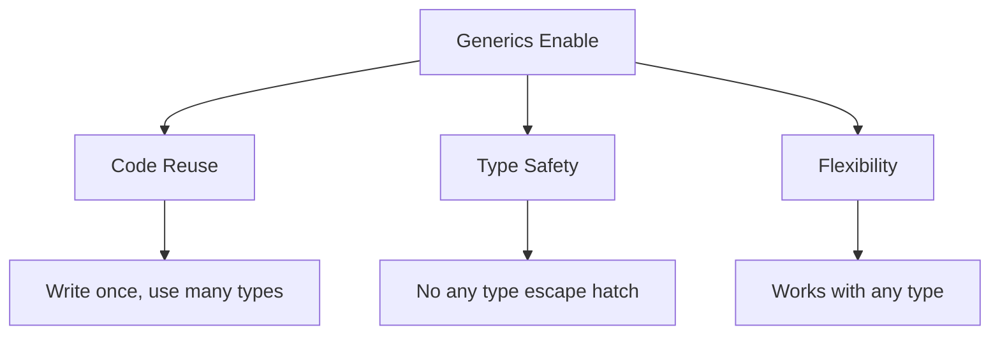

# 🎁 Generics - Introduction to Reusable Type-Safe Code

[← Previous: Classes](./19_classes.md) | [← Back to Main](../README.md) | [Next: Advanced Generics →](./21_advanced_generics.md)

---

## 📝 Overview

Generics are one of TypeScript's most powerful features, enabling you to write reusable, type-safe code that works with multiple types. This introduction covers the fundamentals of generic functions, classes, and interfaces—preparing you for advanced generic patterns.

**What You'll Learn:**
- What generics are and why they exist
- Generic function syntax
- Generic classes and interfaces
- Type parameters and constraints
- Generic inference
- Common generic patterns

### 🎯 Learning Objectives

- ✅ Understand the purpose of generics
- ✅ Create generic functions
- ✅ Build generic classes
- ✅ Use generic interfaces
- ✅ Apply type constraints
- ✅ Leverage type inference
- ✅ Recognize common generic patterns

### 📊 Section Info

- **Difficulty**: ⭐⭐⭐ Intermediate/Advanced
- **Estimated Time**: 4-5 hours
- **Prerequisites**: [Functions](./11_functions.md), [Interfaces](./12_objects_interfaces.md), [Classes](./19_classes.md)
- **Practice Exercises**: 15 challenges
- **Version**: TypeScript 5.7+ (2025)

---

## 📚 Table of Contents

1. [What Are Generics?](#what-are-generics)
2. [Generic Functions](#generic-functions)
3. [Generic Interfaces](#generic-interfaces)
4. [Generic Classes](#generic-classes)
5. [Generic Constraints](#generic-constraints)
6. [Type Inference](#type-inference)
7. [Common Patterns](#common-patterns)
8. [Best Practices](#best-practices)
9. [Higher-Order FAQs](#faqs)
10. [Interview Questions](#interview-questions)

---

<a name="what-are-generics"></a>
## 1. What Are Generics?

### 1.1 The Problem Generics Solve

```typescript
// Without generics - need separate functions
function identityString(value: string): string {
  return value;
}

function identityNumber(value: number): number {
  return value;
}

function identityBoolean(value: boolean): boolean {
  return value;
}

// Or lose type safety with any
function identityAny(value: any): any {
  return value; // No type safety
}

// With generics - one function, type-safe
function identity<T>(value: T): T {
  return value;
}

const str = identity("hello"); // T = string
const num = identity(42); // T = number
const bool = identity(true); // T = boolean
```

### 1.2 Generic Benefits



---

<a name="generic-functions"></a>
## 2. Generic Functions

### 2.1 Basic Generic Functions

```typescript
// Generic function with type parameter T
function identity<T>(value: T): T {
  return value;
}

// Usage with explicit type
const result1 = identity<string>("hello");

// Usage with inferred type (common)
const result2 = identity("world"); // T inferred as string
const result3 = identity(42); // T inferred as number

// Multiple type parameters
function pair<T, U>(first: T, second: U): [T, U] {
  return [first, second];
}

const p = pair("hello", 42); // [string, number]
```

### 2.2 Generic Array Functions

```typescript
// Generic array operations
function firstElement<T>(arr: T[]): T | undefined {
  return arr[0];
}

const first = firstElement([1, 2, 3]); // number | undefined
const firstStr = firstElement(["a", "b"]); // string | undefined

// Generic filter
function filter<T>(
  arr: T[],
  predicate: (item: T) => boolean
): T[] {
  return arr.filter(predicate);
}

const numbers = [1, 2, 3, 4, 5];
const evens = filter(numbers, n => n % 2 === 0); // number[]
```

---

<a name="generic-interfaces"></a>
## 3. Generic Interfaces

### 3.1 Basic Generic Interfaces

```typescript
// Generic interface
interface Box<T> {
  value: T;
  getValue(): T;
  setValue(value: T): void;
}

// Usage with specific type
const numberBox: Box<number> = {
  value: 42,
  getValue() {
    return this.value;
  },
  setValue(value) {
    this.value = value;
  }
};

// Generic with multiple parameters
interface Pair<K, V> {
  key: K;
  value: V;
}

const pair: Pair<string, number> = {
  key: "age",
  value: 30
};
```

### 3.2 Generic API Response

```typescript
// Type-safe API responses
interface ApiResponse<T> {
  data: T;
  status: number;
  message: string;
}

// Usage
const userResponse: ApiResponse<User> = {
  data: { name: "Alice", age: 30 },
  status: 200,
  message: "Success"
};

const productResponse: ApiResponse<Product[]> = {
  data: [{ id: 1, name: "Laptop" }],
  status: 200,
  message: "Success"
};
```

---

<a name="generic-classes"></a>
## 4. Generic Classes

### 4.1 Basic Generic Classes

```typescript
// Generic class
class Container<T> {
  private value: T;
  
  constructor(value: T) {
    this.value = value;
  }
  
  getValue(): T {
    return this.value;
  }
  
  setValue(value: T): void {
    this.value = value;
  }
}

// Usage
const numberContainer = new Container<number>(42);
console.log(numberContainer.getValue()); // 42

const stringContainer = new Container("hello");
console.log(stringContainer.getValue()); // "hello" (T inferred)
```

### 4.2 Generic Collection Class

```typescript
// Type-safe collection
class List<T> {
  private items: T[] = [];
  
  add(item: T): void {
    this.items.push(item);
  }
  
  get(index: number): T | undefined {
    return this.items[index];
  }
  
  getAll(): T[] {
    return [...this.items];
  }
  
  filter(predicate: (item: T) => boolean): T[] {
    return this.items.filter(predicate);
  }
}

// Usage
const numberList = new List<number>();
numberList.add(1);
numberList.add(2);
// numberList.add("three"); // ❌ Error: string not assignable

const users = new List<User>();
users.add({ name: "Alice", age: 30 });
```

---

<a name="generic-constraints"></a>
## 5. Generic Constraints

### 5.1 Extends Constraint

```typescript
// Constrain T to types with length property
function logLength<T extends { length: number }>(value: T): void {
  console.log(value.length);
}

logLength("hello"); // ✅ string has length
logLength([1, 2, 3]); // ✅ array has length
// logLength(42); // ❌ Error: number doesn't have length

// Constrain to specific types
function merge<T extends object, U extends object>(
  obj1: T,
  obj2: U
): T & U {
  return { ...obj1, ...obj2 };
}

const merged = merge({ name: "Alice" }, { age: 30 });
// merged: { name: string; age: number }

// merge({ name: "Alice" }, 42); // ❌ Error: number not object
```

### 5.2 keyof Constraint

```typescript
// Constrain to keys of type
function getProperty<T, K extends keyof T>(obj: T, key: K): T[K] {
  return obj[key];
}

const user = { name: "Alice", age: 30 };

const name = getProperty(user, "name"); // Type: string
const age = getProperty(user, "age"); // Type: number
// getProperty(user, "email"); // ❌ Error: "email" not in user
```

---

<a name="type-inference"></a>
## 6. Type Inference

### 6.1 Automatic Type Parameter Inference

```typescript
// TypeScript infers generic type parameters
function identity<T>(value: T): T {
  return value;
}

// Explicit type
const result1 = identity<string>("hello");

// Inferred type (preferred)
const result2 = identity("hello"); // T inferred as string
const result3 = identity(42); // T inferred as number

// Array inference
function map<T, U>(arr: T[], fn: (item: T) => U): U[] {
  return arr.map(fn);
}

const doubled = map([1, 2, 3], n => n * 2);
// T inferred as number, U inferred as number
```

---

<a name="common-patterns"></a>
## 7. Common Patterns

### 7.1 Generic Promise Wrappers

```typescript
// Type-safe promise wrapper
async function fetchJSON<T>(url: string): Promise<T> {
  const response = await fetch(url);
  return response.json();
}

// Usage
const users = await fetchJSON<User[]>("/api/users");
// users: User[]

const product = await fetchJSON<Product>("/api/products/1");
// product: Product
```

### 7.2 Generic Factory Functions

```typescript
// Factory with generics
function createInstance<T>(constructor: new () => T): T {
  return new constructor();
}

class User {
  name = "Default";
}

const user = createInstance(User);
// user: User
```

---

## 🧠 Higher-Order FAQs

### FAQ 1: Generic Type Inference Rules

**Q: How does TypeScript infer generic type parameters, and why does inference sometimes fail?**

<details>
<summary>View Detailed Answer</summary>

**Short Answer:** TypeScript infers from argument types, return type context, and constraints; inference fails when information is insufficient or contradictory.

**Deep Explanation:**

**Inference From Arguments:**

```typescript
function identity<T>(value: T): T {
  return value;
}

// Infers from argument
const result = identity("hello"); // T = string

// Multiple arguments - finds common type
function pair<T>(a: T, b: T): T[] {
  return [a, b];
}

const p1 = pair(1, 2); // T = number
const p2 = pair("a", "b"); // T = string
const p3 = pair(1, "two"); // T = string | number
```

**Inference From Return Type Context:**

```typescript
function create<T>(): T[] {
  return [];
}

// Needs explicit type (can't infer from empty array)
const numbers = create<number>();

// Or from context
const strings: string[] = create(); // T inferred from assignment
```

**When Inference Fails:**

```typescript
// Example 1: No arguments to infer from
function createArray<T>(): T[] {
  return [];
}

// const arr = createArray(); // ❌ Can't infer T
const arr = createArray<number>(); // ✅ Must be explicit

// Example 2: Conflicting types
function bad<T>(a: T, b: T): T {
  return a;
}

// bad(1, "two"); // ❌ No common type between number and string

// Example 3: Too generic
function process<T>(value: T): void {
  // console.log(value.length); // ❌ T might not have length
}

// Need constraint
function process<T extends { length: number }>(value: T): void {
  console.log(value.length); // ✅ OK
}
```

**Inference Priority:**

1. **Explicit type arguments** (highest)
2. **Argument types**
3. **Return type context**
4. **Default type parameters**
5. **Constraints** (provides bounds, not exact type)

**Best Practices:**

```typescript
// ✅ Design for inference
function map<T, U>(arr: T[], fn: (item: T) => U): U[] {
  return arr.map(fn);
}

map([1, 2, 3], n => n.toString());
// T = number (from array), U = string (from callback return)

// ✅ Provide defaults for common cases
function useState<T = undefined>(initial?: T): [T, (v: T) => void] {
  // ...
}

const [value, setValue] = useState(); // T = undefined
const [count, setCount] = useState(0); // T = number
```

</details>

---

## 🎯 Key Takeaways

✅ **Generics** enable reusable type-safe code

✅ **Type parameters** use angle brackets `<T>`

✅ **Generic functions** work with any type

✅ **Generic classes** create type-safe containers

✅ **Constraints** limit what types are acceptable

✅ **Type inference** usually works automatically

✅ **Generics** are compile-time only (erased at runtime)

---

[← Previous: Classes](./19_classes.md) | [Next: Advanced Generics →](./21_advanced_generics.md)

**Progress**: Topic 20 of 63 | Part III: 100% Complete ✅
