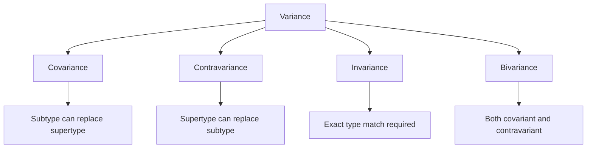

# 🚀 Advanced Generics - Mastering Type-Level Programming

[← Previous: Generics Intro](./20_generics_intro.md) | [← Back to Main](../README.md) | [Next: Utility Types →](./22_utility_types.md)

---

## 📝 Overview

Advanced generics unlock TypeScript's most powerful capabilities: generic constraints, default type parameters, variance, recursive types, and more. This guide takes you from generic basics to expert-level type manipulation, essential for library authors and advanced TypeScript developers.

**What You'll Learn:**
- Advanced generic constraints
- Default type parameters
- Variance (covariance, contravariance)
- Recursive generic types
- Conditional type parameters
- Generic utility patterns
- Performance considerations

### 🎯 Learning Objectives

- ✅ Master complex generic constraints
- ✅ Use default type parameters
- ✅ Understand variance in depth
- ✅ Create recursive generic types
- ✅ Build advanced generic utilities
- ✅ Optimize generic type performance
- ✅ Design type-safe libraries

### 📊 Section Info

- **Difficulty**: ⭐⭐⭐⭐ Advanced
- **Estimated Time**: 5-6 hours
- **Prerequisites**: [Generics Intro](./20_generics_intro.md), [Functions](./11_functions.md)
- **Practice Exercises**: 15 challenges
- **Version**: TypeScript 5.7+ (2025)

---

## 📚 Table of Contents

1. [Advanced Constraints](#advanced-constraints)
2. [Default Type Parameters](#default-parameters)
3. [Variance Deep Dive](#variance)
4. [Recursive Generic Types](#recursive-types)
5. [Generic Type Inference](#type-inference)
6. [Multi-Parameter Generics](#multi-parameter)
7. [Generic Factories](#generic-factories)
8. [Performance Considerations](#performance)
9. [Best Practices](#best-practices)
10. [Higher-Order FAQs](#faqs)
11. [Interview Questions](#interview-questions)

---

<a name="advanced-constraints"></a>
## 1. Advanced Constraints

### 1.1 Multiple Constraints

```typescript
// Constraint with intersection
function merge<T extends object, U extends object>(
  obj1: T,
  obj2: U
): T & U {
  return { ...obj1, ...obj2 };
}

// Constraint requiring specific properties
function sortBy<T extends { createdAt: Date }>(
  items: T[]
): T[] {
  return items.sort((a, b) => 
    a.createdAt.getTime() - b.createdAt.getTime()
  );
}

// Generic constrained by another generic
function getProperty<T, K extends keyof T>(
  obj: T,
  key: K
): T[K] {
  return obj[key];
}

const user = { name: "Alice", age: 30 };
const name = getProperty(user, "name"); // Type: string
```

**Version Tracking:**
- ✅ Generic constraints (v1.0+) - Core feature
- 🆕 Default type parameters (v2.3+) - Defaults for generics
- 🆕 Variance annotations (v4.7+) - in/out modifiers
- 🆕 Tail call optimization for recursive types (v4.5+)

### 1.2 Conditional Constraints

```typescript
// Constraint with conditional type
type Flatten<T> = T extends Array<infer U> ? U : T;

function processValue<T>(
  value: T
): Flatten<T> {
  if (Array.isArray(value)) {
    return value[0] as Flatten<T>;
  }
  return value as Flatten<T>;
}

const single = processValue(42); // Type: number
const fromArray = processValue([1, 2, 3]); // Type: number
```

---

<a name="default-parameters"></a>
## 2. Default Type Parameters

### 2.1 Basic Defaults

```typescript
// Default type parameter
interface Response<T = unknown> {
  data: T;
  status: number;
}

// Can omit type parameter
const response1: Response = {
  data: "anything", // Type: unknown
  status: 200
};

// Or provide specific type
const response2: Response<User> = {
  data: { name: "Alice" }, // Type: User
  status: 200
};

// Default referencing previous parameter
type Container<T, U = T[]> = {
  single: T;
  multiple: U;
};

type NumberContainer = Container<number>;
// Equivalent to: Container<number, number[]>
```

### 2.2 Practical Default Parameters

```typescript
// Async state with default error type
interface AsyncState<T, E = Error> {
  data: T | null;
  error: E | null;
  loading: boolean;
}

// Default to Error
const state1: AsyncState<User> = {
  data: null,
  error: new Error("Failed"),
  loading: false
};

// Custom error type
interface ApiError {
  code: number;
  message: string;
}

const state2: AsyncState<User, ApiError> = {
  data: null,
  error: { code: 404, message: "Not found" },
  loading: false
};
```

---

<a name="variance"></a>
## 3. Variance Deep Dive

### 3.1 Understanding Variance



**Covariance (return types):**

```typescript
class Animal {
  name: string = "";
}

class Dog extends Animal {
  breed: string = "";
}

// Function returning Dog can be assigned to function returning Animal
type AnimalMaker = () => Animal;
type DogMaker = () => Dog;

const makeDog: DogMaker = () => new Dog();
const makeAnimal: AnimalMaker = makeDog; // ✅ OK (covariant)
```

**Contravariance (parameter types):**

```typescript
// Function accepting Animal can be assigned to function accepting Dog
type AnimalHandler = (animal: Animal) => void;
type DogHandler = (dog: Dog) => void;

const handleAnimal: AnimalHandler = (animal) => {
  console.log(animal.name);
};

const handleDog: DogHandler = handleAnimal; // ✅ OK (contravariant)
```

### 3.2 Variance Annotations (v4.7+)

```typescript
// Explicit variance with in/out
interface Producer<out T> {
  produce(): T; // Covariant position
}

interface Consumer<in T> {
  consume(value: T): void; // Contravariant position
}

interface Both<in out T> {
  get(): T;
  set(value: T): void;
}
```

---

<a name="recursive-types"></a>
## 4. Recursive Generic Types

### 4.1 Simple Recursive Types

```typescript
// Linked list node
interface ListNode<T> {
  value: T;
  next: ListNode<T> | null;
}

const node: ListNode<number> = {
  value: 1,
  next: {
    value: 2,
    next: {
      value: 3,
      next: null
    }
  }
};

// Tree structure
interface TreeNode<T> {
  value: T;
  children: TreeNode<T>[];
}

const tree: TreeNode<string> = {
  value: "root",
  children: [
    { value: "child1", children: [] },
    { value: "child2", children: [] }
  ]
};
```

### 4.2 Advanced Recursive Patterns

```typescript
// Deep readonly
type DeepReadonly<T> = {
  readonly [P in keyof T]: T[P] extends object
    ? DeepReadonly<T[P]>
    : T[P];
};

interface Nested {
  a: {
    b: {
      c: number;
    };
  };
}

type ReadonlyNested = DeepReadonly<Nested>;
// All levels are readonly

// Deep partial
type DeepPartial<T> = {
  [P in keyof T]?: T[P] extends object
    ? DeepPartial<T[P]>
    : T[P];
};
```

---

<a name="type-inference"></a>
## 5. Generic Type Inference

### 5.1 Inference from Usage

```typescript
// Infer return type from function
function createArray<T>(length: number, value: T): T[] {
  return Array.from({ length }, () => value);
}

const numbers = createArray(5, 0); // T = number
const strings = createArray(3, "hello"); // T = string

// Infer from generic function call
function map<T, U>(arr: T[], fn: (item: T) => U): U[] {
  return arr.map(fn);
}

const doubled = map([1, 2, 3], n => n * 2);
// T = number (from array), U = number (from return)

const lengths = map(["a", "bb", "ccc"], s => s.length);
// T = string, U = number
```

### 5.2 Contextual Inference

```typescript
// Infer from expected type
function useState<T>(initial: T): [T, (value: T) => void] {
  let state = initial;
  return [state, (value) => { state = value; }];
}

// Usage
const [count, setCount] = useState(0);
// T inferred as number

// With explicit type
const [name, setName] = useState<string | null>(null);
// T = string | null
```

---

<a name="multi-parameter"></a>
## 6. Multi-Parameter Generics

### 6.1 Multiple Type Parameters

```typescript
// Map with key-value types
class Dictionary<K, V> {
  private items = new Map<K, V>();
  
  set(key: K, value: V): void {
    this.items.set(key, value);
  }
  
  get(key: K): V | undefined {
    return this.items.get(key);
  }
}

const dict = new Dictionary<string, number>();
dict.set("age", 30);

// Function with multiple generics
function zip<T, U>(arr1: T[], arr2: U[]): [T, U][] {
  const length = Math.min(arr1.length, arr2.length);
  return Array.from({ length }, (_, i) => [arr1[i], arr2[i]]);
}

const pairs = zip([1, 2, 3], ["a", "b", "c"]);
// Type: [number, string][]
```

---

<a name="performance"></a>
## 7. Performance Considerations

### 7.1 Generic Type Complexity

```typescript
// Simple generic - fast
function identity<T>(value: T): T {
  return value;
}

// Complex constraint - slower
function process<
  T extends Record<string, unknown>,
  K extends keyof T,
  V extends T[K]
>(obj: T, key: K): V {
  return obj[key] as V;
}

// Deep recursion - can be very slow
type DeepRequired<T> = {
  [P in keyof T]-?: T[P] extends object
    ? DeepRequired<T[P]>
    : T[P];
};

// Limit recursion depth for performance
type DeepRequiredSafe<T, Depth extends number = 5> = 
  Depth extends 0
    ? T
    : {
        [P in keyof T]-?: T[P] extends object
          ? DeepRequiredSafe<T[P], [-1, 0, 1, 2, 3, 4][Depth]>
          : T[P];
      };
```

---

<a name="best-practices"></a>
## 8. Best Practices

### 8.1 Generic Design Patterns

```typescript
// ✅ GOOD: Descriptive type parameter names
function map<TInput, TOutput>(
  items: TInput[],
  transform: (item: TInput) => TOutput
): TOutput[] {
  return items.map(transform);
}

// ❌ BAD: Single-letter names for complex generics
function complex<T, U, V, W, X>(a: T, b: U): V {
  // What do these mean?
}

// ✅ GOOD: Constrain appropriately
function merge<T extends object>(a: T, b: Partial<T>): T {
  return { ...a, ...b };
}

// ❌ BAD: Over-constraining
function process<T extends string | number>(value: T): T {
  // Too specific - just use string | number
}

// ✅ GOOD: Provide defaults for common cases
interface State<T = unknown, E = Error> {
  data: T | null;
  error: E | null;
}
```

---

## 🧠 Higher-Order FAQs

### FAQ 1: Generic Variance Practical Impact

**Q: How does variance actually affect real TypeScript code? Can you show a concrete example where understanding variance prevents bugs?**

<details>
<summary>View Detailed Answer</summary>

**Short Answer:** Variance determines type assignability; misunderstanding it leads to runtime errors that TypeScript should catch.

**Deep Explanation:**

**The Problem:**

```typescript
// Setup
class Animal {
  name: string = "";
}

class Dog extends Animal {
  breed: string = "";
}

class Cat extends Animal {
  meow() {}
}

// Array is covariant (can cause issues)
let dogs: Dog[] = [new Dog()];
let animals: Animal[] = dogs; // ✅ OK (covariant)

animals.push(new Cat()); // ✅ Compiles!
// But dogs array now contains Cat! 💥

const dog = dogs[1];
// dog.breed; // Runtime error - Cat doesn't have breed
```

**Why TypeScript Allows This:**

TypeScript chooses **soundness vs usability trade-off**. Array covariance is technically unsound but practically necessary:

```typescript
// If arrays were invariant:
function printNames(animals: Animal[]): void {
  animals.forEach(a => console.log(a.name));
}

let dogs: Dog[] = [new Dog()];
// printNames(dogs); // ❌ Would error (invariant)
// But this is safe - we only read!
```

**Safe Patterns:**

```typescript
// ✅ Use readonly for safe covariance
function printNames(animals: readonly Animal[]): void {
  animals.forEach(a => console.log(a.name));
  // animals.push(new Cat()); // ❌ Error: readonly
}

let dogs: Dog[] = [new Dog()];
printNames(dogs); // ✅ Safe!

// ✅ Function parameters are contravariant (safe)
type Handler<T> = (value: T) => void;

let handleAnimal: Handler<Animal> = (animal) => {
  console.log(animal.name);
};

let handleDog: Handler<Dog> = handleAnimal; // ✅ Safe!
// Dog is Animal, so Animal handler works for Dog
```

**Production Impact:**

```typescript
// Real bug from variance misunderstanding
class EventEmitter<T> {
  private handlers: ((event: T) => void)[] = [];
  
  on(handler: (event: T) => void): void {
    this.handlers.push(handler);
  }
  
  emit(event: T): void {
    this.handlers.forEach(h => h(event));
  }
}

// Setup
interface BaseEvent {
  type: string;
}

interface ClickEvent extends BaseEvent {
  type: "click";
  x: number;
  y: number;
}

const emitter = new EventEmitter<ClickEvent>();

// Problem: Can register Animal handler for Dog events
const handler: (event: BaseEvent) => void = (event) => {
  console.log(event.type);
};

emitter.on(handler); // ✅ Compiles (contravariance)
// But handler doesn't know about x, y properties!

// Solution: Make generic contravariant explicitly
class SafeEventEmitter<in T> {
  // 'in' makes T contravariant
  // Now can't pass base type handlers
}
```

**Key Insight:**
- Arrays/promises: covariant (output positions)
- Function parameters: contravariant (input positions)
- Mutable structures: invariant (both positions)

</details>

---

### FAQ 2: Recursive Type Depth Limits

**Q: TypeScript has recursion depth limits for types. What are they, why do they exist, and how do you work around them?**

<details>
<summary>View Detailed Answer</summary>

**Short Answer:** TypeScript limits type recursion to ~50 levels to prevent infinite loops; use tail recursion or iterative patterns for deep structures.

**Deep Explanation:**

**The Limit:**

```typescript
// Deep nesting hits recursion limit
type DeepNested = {
  level1: {
    level2: {
      level3: {
        // ... 50+ levels
        level50: {
          level51: string; // ❌ Error: Type instantiation is excessively deep
        };
      };
    };
  };
};
```

**Why Limits Exist:**

1. **Prevent infinite loops**
```typescript
// Could loop forever
type Infinite<T> = Infinite<Infinite<T>>;
```

2. **Performance** - deep recursion is expensive

3. **Practical reality** - deeply nested types often indicate design issues

**Workarounds:**

**Pattern 1: Limit Depth Explicitly**

```typescript
// Count down depth
type DeepReadonly<T, Depth extends number = 5> = 
  Depth extends 0
    ? T
    : {
        readonly [P in keyof T]: T[P] extends object
          ? DeepReadonly<T[P], [-1, 0, 1, 2, 3, 4][Depth]>
          : T[P];
      };

// Usage
type Safe = DeepReadonly<VeryNestedType, 3>; // Max 3 levels deep
```

**Pattern 2: Tail Call Optimization**

```typescript
// Not tail-recursive (builds up stack)
type Sum<N extends number, Acc extends unknown[] = []> =
  Acc['length'] extends N
    ? Acc['length']
    : Sum<N, [...Acc, unknown]>;

// Tail-recursive (optimized by TS 4.5+)
type SumTail<N extends number, Acc extends unknown[] = []> =
  Acc['length'] extends N
    ? Acc['length']
    : SumTail<N, [unknown, ...Acc]>;
```

**Pattern 3: Iterative Approach**

```typescript
// Instead of deep recursion, use mapped types
type Flatten<T> = T extends Array<infer U>
  ? U extends Array<infer V>
    ? V extends Array<infer W>
      ? W // Stop at 3 levels
      : V
    : U
  : T;
```

**Real-World Example:**

```typescript
// JSON type with depth limit
type JSONValue<Depth extends number = 5> =
  Depth extends 0
    ? unknown
    : string | number | boolean | null
      | JSONValue<[-1, 0, 1, 2, 3, 4][Depth]>[]
      | { [key: string]: JSONValue<[-1, 0, 1, 2, 3, 4][Depth]> };

// Safely types JSON to 5 levels
const data: JSONValue = {
  user: {
    profile: {
      address: {
        city: "NYC"
      }
    }
  }
};
```

**Recommendation:**
- Keep recursion < 10 levels when possible
- Use depth limits for public APIs
- Consider iterative alternatives
- Test with deeply nested real data

</details>

---

## 🎤 Senior SDE Interview Questions

### Interview Question 1: Type-Safe Query Builder

**Q:** "Design a type-safe SQL query builder where methods chain to build queries, and the return type reflects what columns were selected. How would you use advanced generics to ensure compile-time safety?"

**Key Concepts:**
- Method chaining
- Generic type accumulation
- Type inference through chain
- Builder pattern

**Expected Answer:**

```typescript
// Query builder with type accumulation
class QueryBuilder<T, Selected extends keyof T = never> {
  constructor(
    private table: string,
    private selectedColumns: Set<keyof T> = new Set()
  ) {}
  
  select<K extends keyof T>(
    ...columns: K[]
  ): QueryBuilder<T, Selected | K> {
    columns.forEach(c => this.selectedColumns.add(c));
    return this as any;
  }
  
  where(condition: string): this {
    // Add where clause
    return this;
  }
  
  async execute(): Promise<Pick<T, Selected>[]> {
    // Execute query and return only selected columns
    const query = `SELECT ${Array.from(this.selectedColumns).join(', ')} FROM ${this.table}`;
    // ... execute
    return [] as any;
  }
}

// Usage
interface User {
  id: number;
  name: string;
  email: string;
  age: number;
}

const users = await new QueryBuilder<User>('users')
  .select('id', 'name')
  .where('age > 18')
  .execute();

// users: Pick<User, 'id' | 'name'>[]
// Only has id and name properties!

console.log(users[0].id); // ✅ OK
console.log(users[0].name); // ✅ OK
// console.log(users[0].email); // ❌ Error: email not selected
```

**Follow-ups:**
1. "How would you add type-safe JOIN operations?"
2. "How would you handle aggregate functions (COUNT, SUM)?"
3. "What about dynamic column selection at runtime?"

**Green Flags:**
- Understands type accumulation through method chaining
- Uses conditional types or Pick utility
- Considers runtime vs compile-time distinction
- Mentions ORM patterns (Prisma, TypeORM)

---

## 🎯 Key Takeaways

✅ **Advanced constraints** enable precise type requirements

✅ **Default type parameters** simplify common use cases

✅ **Variance** determines type assignability rules

✅ **Recursive types** model self-referential structures

✅ **Type inference** reduces explicit annotations

✅ **Generic factories** create type-safe constructors

✅ **Performance matters** for complex generic types

---

[← Previous: Generics Intro](./20_generics_intro.md) | [Next: Utility Types →](./22_utility_types.md)

**Progress**: Topic 21 of 63 | Part IV: 10% Complete
