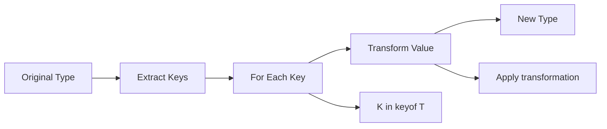

# 🗺️ Mapped Types - Transforming Type Structures

[← Previous: Conditional Types](./23_conditional_types.md) | [← Back to Main](../README.md) | [Next: Template Literal Types →](./25_template_literal_types.md)

---

## 📝 Overview

Mapped types let you create new types by transforming each property in an existing type. They're the mechanism behind utility types like Partial and Readonly, and they enable powerful type-level transformations. This guide explains mapped types from basics to advanced patterns in clear, accessible terms.

**What You'll Learn:**
- Mapped type syntax and mechanics
- Key remapping with as clause
- Modifier manipulation (+/-readonly, +/-?)
- Mapping over unions and intersections
- Building custom type transformations
- Real-world mapped type patterns

### 🎯 Learning Objectives

- ✅ Master mapped type syntax
- ✅ Use key remapping effectively
- ✅ Manipulate modifiers (readonly, optional)
- ✅ Map over various type structures
- ✅ Create custom transformations
- ✅ Apply mapped types in real scenarios

### 📊 Section Info

- **Difficulty**: ⭐⭐⭐⭐ Advanced
- **Estimated Time**: 5-6 hours
- **Prerequisites**: [Utility Types](./22_utility_types.md), [Conditional Types](./23_conditional_types.md)
- **Practice Exercises**: 15 challenges
- **Version**: TypeScript 5.7+ (2025)

---

## 📚 Table of Contents

1. [Mapped Type Basics](#basics)
2. [Key Remapping](#key-remapping)
3. [Modifier Manipulation](#modifiers)
4. [Mapping with Conditionals](#conditional-mapping)
5. [Advanced Patterns](#advanced-patterns)
6. [Practical Applications](#applications)
7. [Performance](#performance)
8. [Best Practices](#best-practices)
9. [Higher-Order FAQs](#faqs)
10. [Interview Questions](#interview-questions)

---

<a name="basics"></a>
## 1. Mapped Type Basics

### 1.1 Basic Syntax

```typescript
// Basic mapped type: [K in Keys]: Type
type Stringify<T> = {
  [K in keyof T]: string;
};

interface User {
  name: string;
  age: number;
  active: boolean;
}

type StringUser = Stringify<User>;
// { name: string; age: string; active: string; }

// All properties become string
```

**Version Tracking:**
- ✅ Mapped types (v2.1+) - Core feature
- 🆕 Key remapping with as (v4.1+) - Transform keys
- 🆕 Modifier manipulation (v2.8+) - +/- for readonly/?
- 🆕 Template literal keys (v4.1+) - String manipulation

### 1.2 How Mapped Types Work



```typescript
// Step-by-step breakdown
type Example = {
  name: string;
  age: number;
};

type Mapped<T> = {
  [K in keyof T]: T[K]; // Identity mapping
};

// Process:
// 1. keyof Example = "name" | "age"
// 2. K = "name" → name: Example["name"] → name: string
// 3. K = "age" → age: Example["age"] → age: number
// Result: { name: string; age: number; }
```

---

<a name="key-remapping"></a>
## 2. Key Remapping

### 2.1 as Clause for Key Transformation

```typescript
// Remap keys with 'as' clause
type Getters<T> = {
  [K in keyof T as `get${Capitalize<string & K>}`]: () => T[K];
};

interface User {
  name: string;
  age: number;
}

type UserGetters = Getters<User>;
// {
//   getName: () => string;
//   getAge: () => number;
// }

// Practical usage
const user: UserGetters = {
  getName() { return "Alice"; },
  getAge() { return 30; }
};
```

### 2.2 Filtering Properties

```typescript
// Remove keys using never
type RemoveKindField<T> = {
  [K in keyof T as K extends "kind" ? never : K]: T[K];
};

interface Shape {
  kind: string;
  x: number;
  y: number;
}

type Coord = RemoveKindField<Shape>;
// { x: number; y: number; } - kind removed

// Filter by value type
type PickByType<T, U> = {
  [K in keyof T as T[K] extends U ? K : never]: T[K];
};

type NumberProps = PickByType<User, number>;
// { age: number; } - only number properties
```

---

<a name="modifiers"></a>
## 3. Modifier Manipulation

### 3.1 Adding/Removing readonly

```typescript
// Add readonly
type Readonly<T> = {
  readonly [K in keyof T]: T[K];
};

// Remove readonly
type Mutable<T> = {
  -readonly [K in keyof T]: T[K]; // Minus removes modifier
};

interface Point {
  readonly x: number;
  readonly y: number;
}

type MutablePoint = Mutable<Point>;
// { x: number; y: number; } - readonly removed
```

### 3.2 Adding/Removing Optional

```typescript
// Make all optional
type Partial<T> = {
  [K in keyof T]?: T[K]; // Add ?
};

// Make all required
type Required<T> = {
  [K in keyof T]-?: T[P]; // Minus removes ?
};

interface Config {
  host?: string;
  port?: number;
}

type FullConfig = Required<Config>;
// { host: string; port: number; } - all required
```

---

<a name="conditional-mapping"></a>
## 4. Mapping with Conditionals

### 4.1 Conditional Property Types

```typescript
// Transform based on value type
type Stringify<T> = {
  [K in keyof T]: T[K] extends Function
    ? T[K] // Keep functions as-is
    : string; // Convert non-functions to string
};

interface Mixed {
  name: string;
  age: number;
  greet(): void;
}

type StringMixed = Stringify<Mixed>;
// { name: string; age: string; greet: () => void; }

// Nullable properties
type Nullable<T> = {
  [K in keyof T]: T[K] | null;
};

type NullableUser = Nullable<User>;
// { name: string | null; age: number | null; }
```

---

<a name="advanced-patterns"></a>
## 5. Advanced Patterns

### 5.1 Deep Transformations

```typescript
// Deep readonly
type DeepReadonly<T> = {
  readonly [K in keyof T]: T[K] extends object
    ? DeepReadonly<T[K]>
    : T[K];
};

interface Nested {
  user: {
    name: string;
    address: {
      city: string;
    };
  };
}

type ReadonlyNested = DeepReadonly<Nested>;
// All levels readonly

// Deep partial
type DeepPartial<T> = {
  [K in keyof T]?: T[K] extends object
    ? DeepPartial<T[K]>
    : T[K];
};
```

### 5.2 Proxy Types

```typescript
// Create getter/setter pairs
type Proxify<T> = {
  [K in keyof T]: {
    get(): T[K];
    set(value: T[K]): void;
  };
};

interface User {
  name: string;
  age: number;
}

type ProxifiedUser = Proxify<User>;
// {
//   name: { get(): string; set(value: string): void; };
//   age: { get(): number; set(value: number): void; };
// }
```

---

<a name="applications"></a>
## 6. Practical Applications

### 6.1 Event Handlers

```typescript
// Generate event handler types
type EventHandlers<T> = {
  [K in keyof T as `on${Capitalize<string & K>}`]: (event: T[K]) => void;
};

interface Events {
  click: MouseEvent;
  focus: FocusEvent;
  input: InputEvent;
}

type Handlers = EventHandlers<Events>;
// {
//   onClick: (event: MouseEvent) => void;
//   onFocus: (event: FocusEvent) => void;
//   onInput: (event: InputEvent) => void;
// }
```

### 6.2 API Client Types

```typescript
// Generate API methods from endpoints
type ApiMethods<T> = {
  [K in keyof T as `fetch${Capitalize<string & K>}`]: () => Promise<T[K]>;
};

interface Resources {
  users: User[];
  products: Product[];
  orders: Order[];
}

type API = ApiMethods<Resources>;
// {
//   fetchUsers: () => Promise<User[]>;
//   fetchProducts: () => Promise<Product[]>;
//   fetchOrders: () => Promise<Order[]>;
// }
```

---

<a name="best-practices"></a>
## 7. Best Practices

### 7.1 Mapped Type Guidelines

```typescript
// ✅ GOOD: Clear purpose
type ReadonlyFields<T> = {
  readonly [K in keyof T]: T[K];
};

// ✅ GOOD: Combine with conditionals for smart transforms
type DeepReadonly<T> = {
  readonly [K in keyof T]: T[K] extends object
    ? DeepReadonly<T[K]>
    : T[K];
};

// ✅ GOOD: Use built-ins when available
type MyPartial<T> = Partial<T>; // Don't reimplement

// ❌ BAD: Overly complex single mapped type
type Bad<T> = {
  [K in keyof T as T[K] extends Function ? never : K extends "id" ? never : `modified_${K}`]: 
    T[K] extends Date ? string : T[K];
};
// Break into smaller, composable types

// ✅ BETTER: Compose simpler types
type RemoveFunctions<T> = Pick<T, FunctionKeys<T>>;
type RenameKeys<T> = { [K in keyof T as `modified_${K}`]: T[K] };
type TransformDates<T> = { [K in keyof T]: T[K] extends Date ? string : T[K] };
```

---

## 🧠 Higher-Order FAQs

### FAQ 1: Mapped Types vs Index Signatures

**Q: What's the difference between mapped types and index signatures? When would you use each?**

<details>
<summary>View Detailed Answer</summary>

**Short Answer:** Mapped types transform known properties; index signatures define types for unknown properties. Different purposes.

**Deep Explanation:**

**Index Signature** - For dynamic/unknown keys:

```typescript
// Index signature - don't know keys ahead of time
interface Dictionary {
  [key: string]: number;
}

const dict: Dictionary = {
  a: 1,
  b: 2,
  anyKey: 3 // Any string key allowed
};

// Can add any key at runtime
dict.newKey = 4; // ✅ OK
```

**Mapped Type** - Transform known keys:

```typescript
// Mapped type - transform existing properties
type Numeric<T> = {
  [K in keyof T]: number;
};

interface User {
  name: string;
  age: number;
}

type NumericUser = Numeric<User>;
// { name: number; age: number; } - specific keys

const user: NumericUser = {
  name: 123, // Must provide exact keys
  age: 456
};

// user.extra = 789; // ❌ Error: extra not in type
```

**Key Differences:**

| Feature | Index Signature | Mapped Type |
|---------|----------------|-------------|
| **Keys** | Unknown/dynamic | Known/fixed |
| **Purpose** | Define new structure | Transform existing |
| **Flexibility** | Can add any key | Only defined keys |
| **Type safety** | Looser | Stricter |
| **Use case** | Dictionaries, maps | Type transformations |

**When to Use Each:**

```typescript
// ✅ Index signature: truly dynamic keys
interface Cache {
  [cacheKey: string]: CachedValue;
}

// Any string key works
cache["user:123"] = value;
cache["product:456"] = value;

// ✅ Mapped type: transform known structure
type APIEndpoints = {
  users: User[];
  products: Product[];
};

type APIMethods = {
  [K in keyof APIEndpoints]: () => Promise<APIEndpoints[K]>;
};
// Creates methods for each known endpoint

// ❌ DON'T mix (usually)
type Confused = {
  [K in "a" | "b"]: number; // Use mapped
  [key: string]: number; // Use index signature
  // These conflict!
};
```

**Combining Both:**

```typescript
// Known properties + dynamic properties
interface Document {
  id: string;
  title: string;
  [metadata: string]: string | number; // Dynamic metadata
}

const doc: Document = {
  id: "1",
  title: "Doc",
  author: "Alice", // Dynamic
  version: 2 // Dynamic
};
```

**Production Pattern:**

```typescript
// Known operations + extensibility
interface BaseAPI {
  get: () => Promise<Data>;
  post: (data: Data) => Promise<void>;
}

// Add custom methods dynamically
type ExtendedAPI = BaseAPI & {
  [customMethod: string]: (...args: any[]) => any;
};
```

</details>

---

## 🎤 Senior SDE Interview Questions

### Interview Question 1: Type-Safe State Management

**Q:** "Design a type-safe Redux-like state management system where actions automatically infer payload types from action creators. Use mapped types to generate reducer parameter types from action map."

**Key Concepts:**
- Mapped types
- Action type inference
- Type-safe reducers
- State management patterns

**Expected Answer:**

```typescript
// Action creators
interface ActionCreators {
  setUser: (user: User) => void;
  updateAge: (age: number) => void;
  resetState: () => void;
}

// Extract payload types from action creators
type ExtractPayload<F> = 
  F extends (payload: infer P) => any ? P : never;

// Map action creators to action types
type Actions<AC extends Record<string, Function>> = {
  [K in keyof AC]: {
    type: K;
    payload: ExtractPayload<AC[K]>;
  };
}[keyof AC];

type AppActions = Actions<ActionCreators>;
// { type: "setUser"; payload: User; }
// | { type: "updateAge"; payload: number; }
// | { type: "resetState"; payload: never; }

// Type-safe reducer
interface State {
  user: User | null;
  loading: boolean;
}

function reducer(
  state: State,
  action: AppActions
): State {
  switch (action.type) {
    case "setUser":
      // action.payload: User (inferred!)
      return { ...state, user: action.payload };
      
    case "updateAge":
      // action.payload: number (inferred!)
      if (state.user) {
        return {
          ...state,
          user: { ...state.user, age: action.payload }
        };
      }
      return state;
      
    case "resetState":
      // action.payload: never (no payload)
      return { user: null, loading: false };
      
    default:
      const _exhaustive: never = action;
      return state;
  }
}

// Dispatch function with type safety
function dispatch(action: AppActions): void {
  // Fully type-safe dispatch
}

// Usage
dispatch({ type: "setUser", payload: user }); // ✅ OK
dispatch({ type: "updateAge", payload: 31 }); // ✅ OK
// dispatch({ type: "setUser", payload: 123 }); // ❌ Error: wrong payload type
// dispatch({ type: "invalid", payload: {} }); // ❌ Error: invalid action
```

**Follow-ups:**
1. "How would you add async actions (thunks)?"
2. "How would you type selectors?"
3. "What about middleware typing?"

**Green Flags:**
- Maps action creators to action types
- Uses discriminated unions
- Ensures exhaustiveness checking
- Mentions Redux, Zustand, or similar libraries

---

## 🎯 Key Takeaways

✅ **Mapped types** transform each property in a type

✅ **[K in keyof T]** iterates over all keys

✅ **as clause** remaps key names (v4.1+)

✅ **+/- modifiers** add/remove readonly and optional

✅ **Mapped types** power utility types

✅ **Combine with conditionals** for smart transformations

✅ **Use built-in utilities** when possible

---

[← Previous: Conditional Types](./23_conditional_types.md) | [Next: Template Literal Types →](./25_template_literal_types.md)

**Progress**: Topic 24 of 63 | Part IV: 40% Complete
