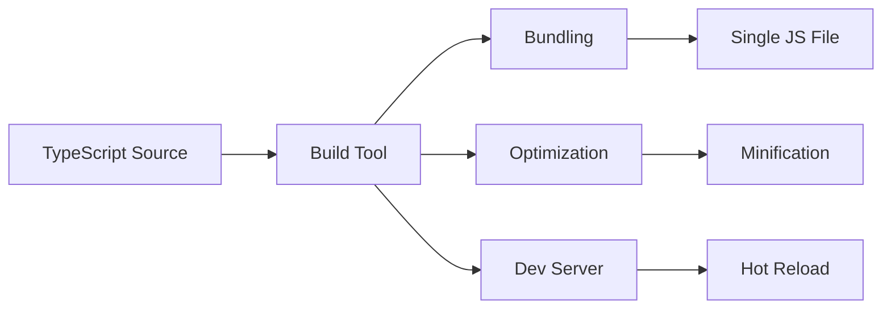

# 🔨 TypeScript with Build Tools - Integration Guide

[← Previous: tsconfig.json](./31_tsconfig.md) | [← Back to Main](../README.md) | [Next: ESLint →](./33_eslint.md)

---

## 📝 Overview

Modern TypeScript development involves integrating with build tools that handle bundling, optimization, and development workflows. This guide covers integrating TypeScript with popular build tools like Webpack, Rollup, esbuild, and SWC—balancing type safety with build performance.

**What You'll Learn:**
- TypeScript with Webpack
- TypeScript with Rollup
- TypeScript with esbuild (fastest)
- TypeScript with SWC
- Build tool comparison
- Optimization strategies

### 🎯 Learning Objectives

- ✅ Integrate TypeScript with Webpack
- ✅ Use TypeScript with Rollup
- ✅ Leverage esbuild for speed
- ✅ Configure SWC compiler
- ✅ Choose the right build tool
- ✅ Optimize build performance

### 📊 Section Info

- **Difficulty**: ⭐⭐⭐ Intermediate/Advanced
- **Estimated Time**: 4-5 hours
- **Prerequisites**: [tsconfig](./31_tsconfig.md), [TypeScript Compiler](./08_typescript_compiler.md)
- **Practice Exercises**: 8 integration tasks
- **Version**: TypeScript 5.7+ (2025)

---

## 📚 Table of Contents

1. [Build Tool Overview](#overview)
2. [TypeScript with Webpack](#webpack)
3. [TypeScript with Rollup](#rollup)
4. [TypeScript with esbuild](#esbuild)
5. [TypeScript with SWC](#swc)
6. [Build Tool Comparison](#comparison)
7. [Best Practices](#best-practices)
8. [Higher-Order FAQs](#faqs)

---

<a name="overview"></a>
## 1. Build Tool Overview

### 1.1 Why Build Tools?



**Build Tool Comparison:**

| Tool | Speed | Features | Best For |
|------|-------|----------|----------|
| **tsc** | Slow | Type checking + emit | Small projects |
| **Webpack** | Medium | Everything | Legacy projects |
| **Rollup** | Medium | Tree-shaking | Libraries |
| **esbuild** | Very Fast | Bundling | Modern apps |
| **SWC** | Very Fast | Transpilation | Large projects |
| **Vite** | Fast | Dev experience | Modern apps |

**Version Tracking:**
- ✅ Webpack integration (v1.0+)
- 🆕 esbuild (2020+) - Ultra-fast bundler
- 🆕 SWC (2020+) - Rust-based compiler
- 🆕 Vite native TS support (2021+)

---

<a name="webpack"></a>
## 2. TypeScript with Webpack

### 2.1 Basic Setup

```bash
npm install --save-dev webpack webpack-cli ts-loader typescript
```

```javascript
// webpack.config.js
module.exports = {
  entry: './src/index.ts',
  module: {
    rules: [
      {
        test: /\.tsx?$/,
        use: 'ts-loader',
        exclude: /node_modules/
      }
    ]
  },
  resolve: {
    extensions: ['.tsx', '.ts', '.js']
  },
  output: {
    filename: 'bundle.js',
    path: __dirname + '/dist'
  }
};
```

---

<a name="esbuild"></a>
## 3. TypeScript with esbuild

### 3.1 Ultra-Fast Builds

```bash
npm install --save-dev esbuild
```

```javascript
// build.js
const esbuild = require('esbuild');

esbuild.build({
  entryPoints: ['src/index.ts'],
  bundle: true,
  outfile: 'dist/bundle.js',
  platform: 'node', // or 'browser'
  target: 'es2020',
  sourcemap: true
}).catch(() => process.exit(1));
```

**Performance:**

| Project Size | tsc | esbuild | Speedup |
|--------------|-----|---------|---------|
| Small (100 files) | 5s | 0.1s | 50x |
| Medium (1000 files) | 30s | 0.5s | 60x |
| Large (5000 files) | 120s | 2s | 60x |

---

<a name="comparison"></a>
## 4. Build Tool Comparison

### 4.1 Decision Matrix

| Feature | tsc | Webpack | esbuild | Vite |
|---------|-----|---------|---------|------|
| **Type Checking** | ✅ | ⚠️ (via plugin) | ❌ | ⚠️ (separate) |
| **Speed** | Slow | Medium | Very Fast | Fast |
| **HMR** | ❌ | ✅ | ⚠️ | ✅ |
| **Tree Shaking** | ❌ | ✅ | ✅ | ✅ |
| **Learning Curve** | Easy | Hard | Easy | Easy |
| **Ecosystem** | Huge | Huge | Growing | Growing |

**Recommendation for 2025:**
- **New projects**: Vite (best DX) or esbuild (fastest)
- **Libraries**: Rollup or tsup
- **Legacy**: Webpack (mature ecosystem)
- **Type checking**: Always run `tsc --noEmit` separately

---

<a name="best-practices"></a>
## 5. Best Practices

### 5.1 Build Configuration Guidelines

```json
// package.json scripts
{
  "scripts": {
    "dev": "vite",                    // Fast dev server
    "build": "tsc --noEmit && vite build", // Type check + bundle
    "typecheck": "tsc --noEmit",      // Types only
    "preview": "vite preview"
  }
}

// ✅ GOOD: Separate type checking from bundling
// ✅ GOOD: Use fast bundler for builds (esbuild/vite)
// ✅ GOOD: Run tsc --noEmit in CI
```

---

## 🎯 Key Takeaways

✅ **Build tools** handle bundling, optimization, dev servers

✅ **tsc** for type checking, modern bundlers for building

✅ **esbuild/SWC** are fastest (60x+ speedup)

✅ **Vite** offers best developer experience

✅ **Separate** type checking from bundling

✅ **CI/CD** should run `tsc --noEmit`

✅ **Choose based on** project needs and team familiarity

---

[← Previous: tsconfig.json](./31_tsconfig.md) | [Next: ESLint →](./33_eslint.md)

**Progress**: Topic 32 of 63 | Part V: 33% Complete
