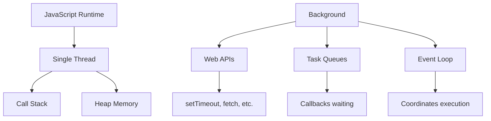

# 🔄 JavaScript Concurrency Model - Understanding Single-Threaded Async

[← Previous: Debugging](./36_debugging.md) | [← Back to Main](../README.md) | [Next: Event Loop →](./38_event_loop.md)

---

## 📝 Overview

JavaScript's concurrency model is fundamentally different from traditional multi-threaded languages. Understanding how JavaScript achieves non-blocking I/O despite being single-threaded is crucial for writing efficient async TypeScript code.

**What You'll Learn:**
- Single-threaded execution model
- Event-driven architecture
- Non-blocking I/O
- Concurrency vs parallelism
- JavaScript's approach to async
- How this affects TypeScript

### 🎯 Learning Objectives

- ✅ Understand single-threaded model
- ✅ Grasp event-driven architecture
- ✅ Know concurrency patterns
- ✅ Differentiate concurrency from parallelism
- ✅ Apply async patterns in TypeScript

### 📊 Section Info

- **Difficulty**: ⭐⭐⭐ Intermediate/Advanced
- **Estimated Time**: 4-5 hours
- **Prerequisites**: [Async JavaScript](./05_async_javascript.md)
- **Version**: ES2024, TypeScript 5.7+

---

## 📚 Table of Contents

1. [Single-Threaded Architecture](#single-threaded)
2. [Event-Driven Model](#event-driven)
3. [Concurrency vs Parallelism](#concurrency-vs-parallelism)
4. [Non-Blocking I/O](#non-blocking)
5. [JavaScript's Concurrency Primitives](#primitives)
6. [TypeScript and Async](#typescript-async)

---

<a name="single-threaded"></a>
## 1. Single-Threaded Architecture

### 1.1 The JavaScript Thread



```typescript
// All code runs on one thread
console.log('1');

setTimeout(() => {
  console.log('2'); // Async, but still single-threaded
}, 0);

console.log('3');

// Output: 1, 3, 2
// Even though timeout is 0ms, it's async
```

---

<a name="event-driven"></a>
## 2. Event-Driven Model

### 2.1 Event Loop Architecture

```typescript
// JavaScript uses events, not threads
button.addEventListener('click', () => {
  console.log('Clicked!');
  // Executes when event fires
});

// Async I/O
fetch('/api/data')
  .then(response => response.json())
  .then(data => {
    console.log(data);
    // Executes when data arrives
  });

// All coordinated by event loop, not threads
```

---

<a name="concurrency-vs-parallelism"></a>
## 3. Concurrency vs Parallelism

### 3.1 Key Difference

| Concurrency | Parallelism |
|-------------|-------------|
| Dealing with multiple things at once | Doing multiple things at once |
| Single core, task switching | Multiple cores, simultaneous |
| JavaScript (event loop) | Java threads, Go goroutines |
| Async/await, Promises | Web Workers (limited) |

```typescript
// Concurrent (not parallel) - single thread
async function fetchAll() {
  const [users, products] = await Promise.all([
    fetch('/users').then(r => r.json()),
    fetch('/products').then(r => r.json())
  ]);
  // Both requests in progress (concurrent)
  // But processed on single thread
}

// True parallelism requires Web Workers
const worker = new Worker('worker.js');
worker.postMessage({ task: 'heavy-computation' });
// Now runs on separate thread (parallel)
```

---

<a name="typescript-async"></a>
## 4. TypeScript and Async

### 4.1 Typing Async Operations

```typescript
// TypeScript adds type safety to async
async function fetchUser(id: number): Promise<User> {
  const response = await fetch(`/api/users/${id}`);
  const data: User = await response.json();
  return data;
}

// Type-safe async iteration
async function* asyncGenerator(): AsyncGenerator<number> {
  for (let i = 0; i < 3; i++) {
    await new Promise(resolve => setTimeout(resolve, 100));
    yield i;
  }
}

for await (const num of asyncGenerator()) {
  console.log(num); // Type: number
}
```

---

## 🎯 Key Takeaways

✅ **JavaScript is single-threaded** but non-blocking

✅ **Event loop** coordinates async operations

✅ **Concurrency** through async, not parallelism

✅ **Web Workers** provide true parallelism

✅ **TypeScript** adds type safety to async code

✅ **Understanding the model** prevents async bugs

---

[← Previous: Debugging](./36_debugging.md) | [Next: Event Loop →](./38_event_loop.md)

**Progress**: Topic 37 of 63 | Part VI: 17% Complete
