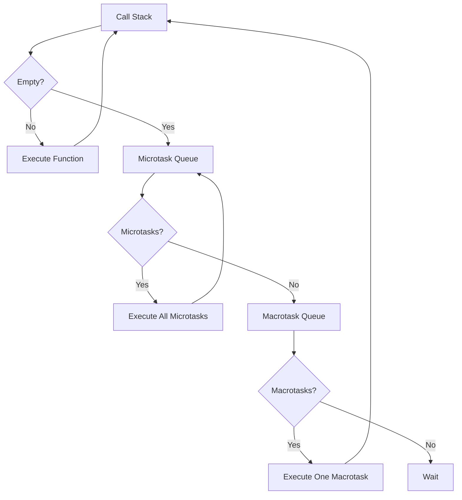

# 🔁 Event Loop Deep Dive - Heart of JavaScript Async

[← Previous: Concurrency Model](./37_concurrency_model.md) | [← Back to Main](../README.md) | [Next: Promises & Async/Await →](./39_promises_async.md)

---

## 📝 Overview

The event loop is JavaScript's mechanism for handling asynchronous operations. Understanding it deeply is essential for writing efficient TypeScript code, debugging timing issues, and avoiding common async pitfalls.

**What You'll Learn:**
- Event loop phases and mechanics
- Call stack and task queues
- Microtasks vs macrotasks
- Promise scheduling
- Common event loop pitfalls

### 🎯 Learning Objectives

- ✅ Master event loop mechanics
- ✅ Understand microtask vs macrotask queues
- ✅ Know task execution order
- ✅ Debug async timing issues
- ✅ Write performant async code

### 📊 Section Info

- **Difficulty**: ⭐⭐⭐⭐ Advanced
- **Estimated Time**: 5-6 hours
- **Prerequisites**: [JavaScript Execution](./04_javascript_execution.md), [Async JavaScript](./05_async_javascript.md)
- **Version**: ES2024, TypeScript 5.7+

---

## 📚 Table of Contents

1. [Event Loop Architecture](#architecture)
2. [Call Stack](#call-stack)
3. [Task Queues](#task-queues)
4. [Microtasks vs Macrotasks](#micro-macro)
5. [Execution Order](#execution-order)
6. [Common Pitfalls](#pitfalls)

---

<a name="architecture"></a>
## 1. Event Loop Architecture

### 1.1 The Loop



```typescript
// Event loop in action
console.log('1'); // Sync

setTimeout(() => console.log('2'), 0); // Macrotask

Promise.resolve().then(() => console.log('3')); // Microtask

console.log('4'); // Sync

// Output: 1, 4, 3, 2
// Sync first, then microtasks, then macrotasks
```

---

<a name="micro-macro"></a>
## 2. Microtasks vs Macrotasks

### 2.1 Queue Types

| Microtasks | Macrotasks |
|------------|------------|
| Promises | setTimeout |
| queueMicrotask | setInterval |
| MutationObserver | I/O operations |
| process.nextTick (Node) | setImmediate (Node) |

```typescript
// Microtasks run before macrotasks
console.log('start');

setTimeout(() => console.log('macro'), 0);

Promise.resolve().then(() => console.log('micro'));

console.log('end');

// Output: start, end, micro, macro
```

---

<a name="execution-order"></a>
## 3. Execution Order

```typescript
// Complex execution order
console.log('1');

setTimeout(() => {
  console.log('2');
  Promise.resolve().then(() => console.log('3'));
}, 0);

Promise.resolve().then(() => {
  console.log('4');
  setTimeout(() => console.log('5'), 0);
});

console.log('6');

/*
Output:
1 (sync)
6 (sync)
4 (microtask)
2 (macrotask)
3 (microtask from macrotask)
5 (macrotask from microtask)
*/
```

---

<a name="pitfalls"></a>
## 4. Common Pitfalls

### 4.1 Timing Assumptions

```typescript
// ❌ DON'T assume setTimeout(0) is immediate
console.log('1');
setTimeout(() => console.log('2'), 0);
console.log('3');
// Output: 1, 3, 2 (not 1, 2, 3!)

// ❌ DON'T block the event loop
function blockFor(ms: number) {
  const start = Date.now();
  while (Date.now() - start < ms) {}
}

console.log('start');
setTimeout(() => console.log('delayed'), 100);
blockFor(5000); // Blocks everything!
console.log('end');
```

---

## 🎯 Key Takeaways

✅ **Event loop** coordinates async execution

✅ **Microtasks** execute before macrotasks

✅ **Call stack** must be empty for event loop

✅ **Promises** are microtasks

✅ **setTimeout** creates macrotasks

✅ **Understanding order** prevents bugs

---

[← Previous: Concurrency Model](./37_concurrency_model.md) | [Next: Promises & Async/Await →](./39_promises_async.md)

**Progress**: Topic 38 of 63 | Part VI: 33% Complete
