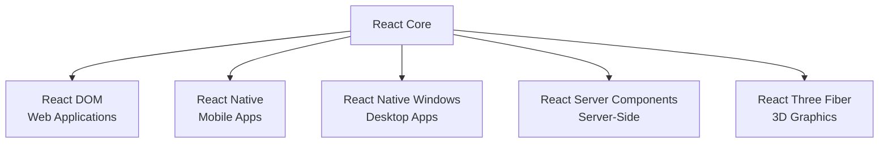
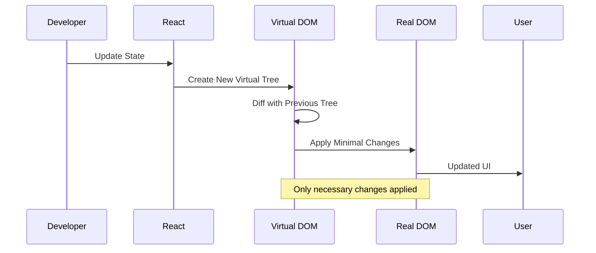
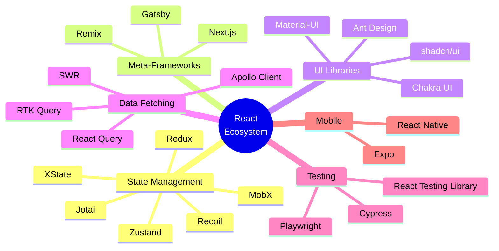
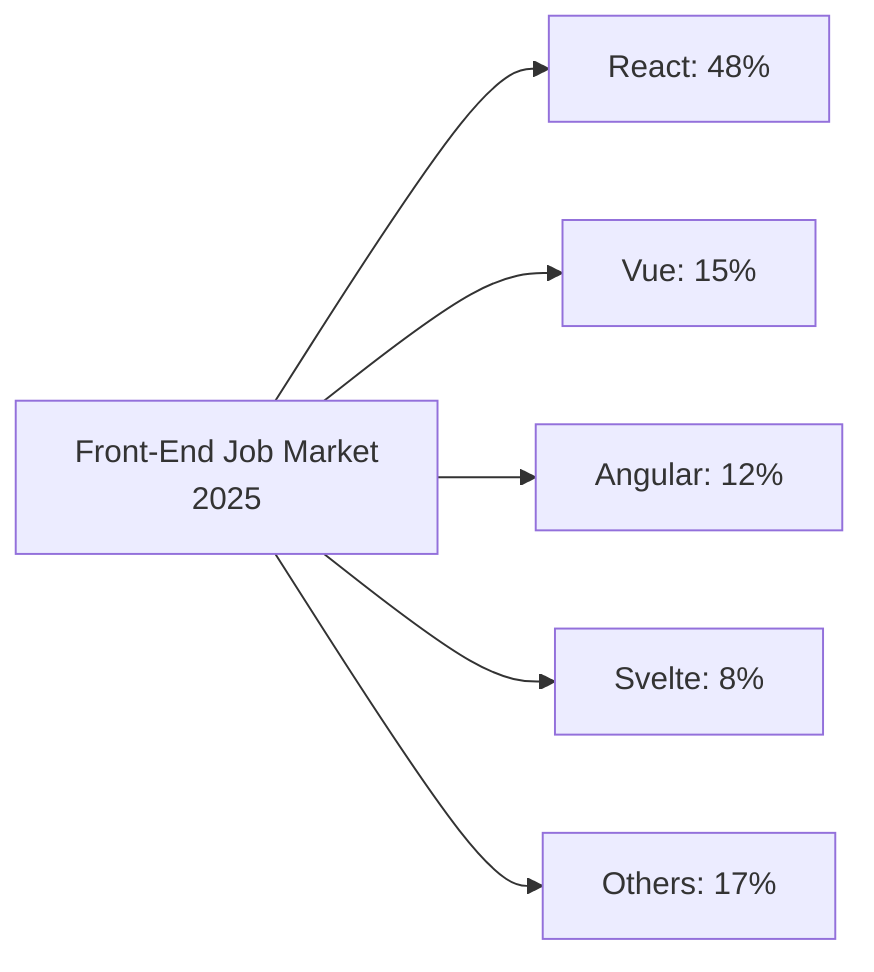
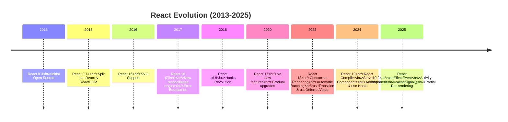
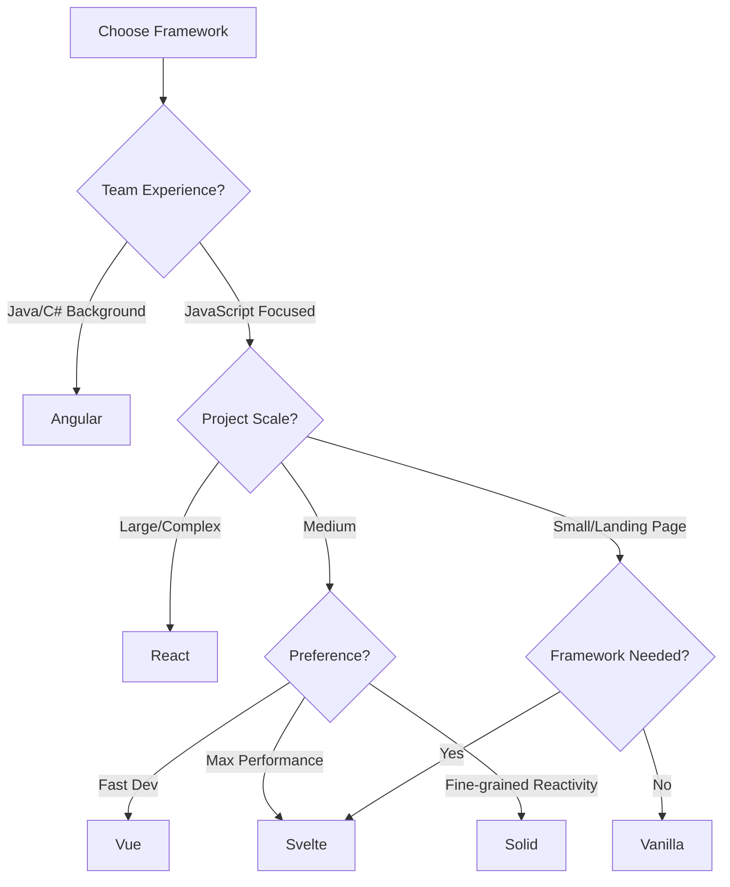
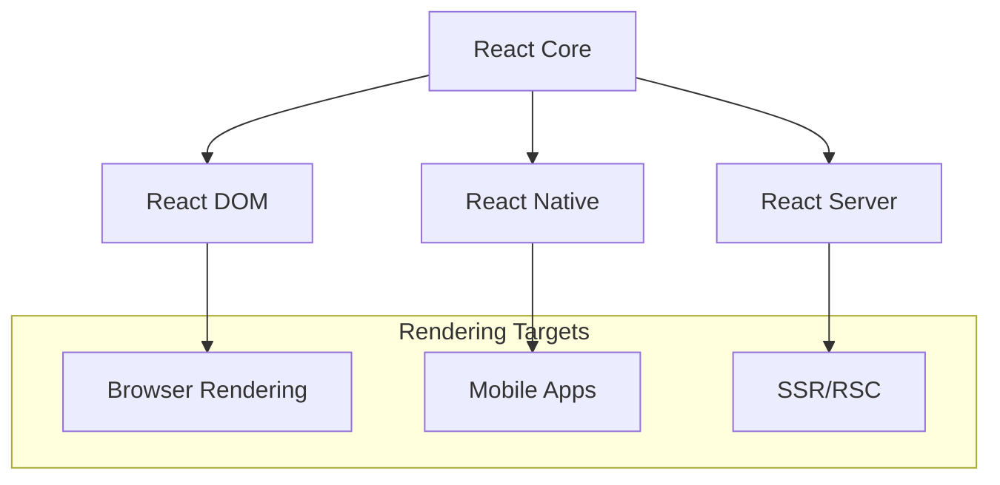
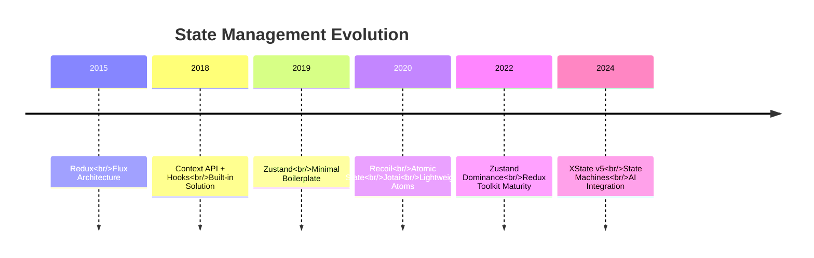
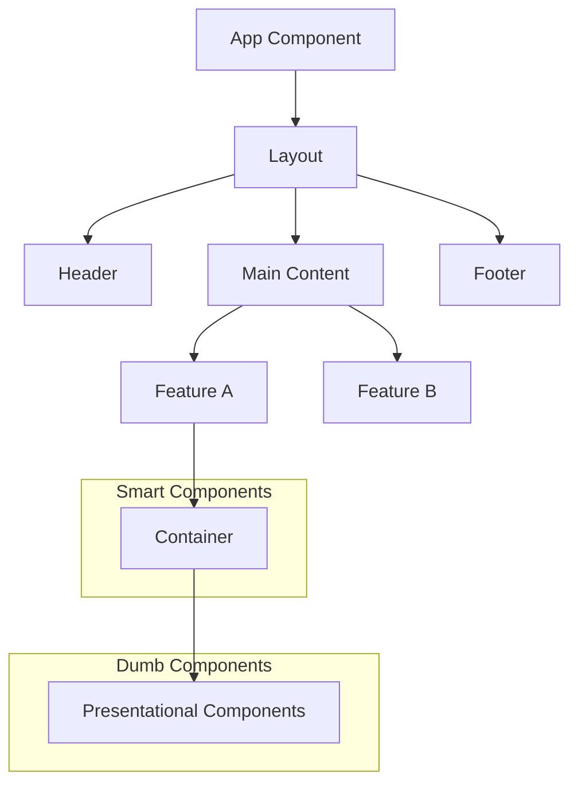

# Topic 01: Introduction to React - Why React Dominates in 2025

[← Back to Main](../README.md) | [Next: React Setup →](./02_react_setup.md)

---

## Table of Contents

1. [Overview](#overview)
2. [What is React?](#what-is-react)
3. [The Virtual DOM Revolution](#the-virtual-dom-revolution)
4. [Why React in 2025?](#why-react-in-2025)
5. [React's Evolution Timeline](#reacts-evolution-timeline)
6. [React vs Other Frameworks](#react-vs-other-frameworks)
7. [The React Ecosystem](#the-react-ecosystem)
8. [React Architecture Patterns](#react-architecture-patterns)
9. [When to Use React](#when-to-use-react)
10. [React's Philosophy](#reacts-philosophy)
11. [Real-World React Applications](#real-world-react-applications)

---

## Overview

**React** is a declarative, component-based JavaScript library for building user interfaces, created and maintained by Meta (Facebook). Since its release in 2013, React has revolutionized front-end development and become the most popular UI library in the world.

**What You'll Learn:**
- Core React concepts and the Virtual DOM
- Why React dominates the front-end landscape in 2025
- React's evolution from v0.3 to React 19.2
- How React compares to Vue, Angular, Svelte, and Solid
- The massive React ecosystem
- When and why to choose React

**Prerequisites:**
- JavaScript ES6+ fundamentals
- Basic HTML/CSS knowledge
- Understanding of DOM manipulation

**Version Coverage:**
- React 19.2 (Latest - November 2025)
- Backward compatible features from React 16.8+

---

## What is React?

### Core Definition

React is a **declarative**, **component-based**, **learn-once-write-anywhere** library that makes building interactive UIs painless and efficient.

```tsx
// React in its simplest form
import React from 'react';

function Welcome() {
  return <h1>Hello, React!</h1>;
}

export default Welcome;
```

### Key Characteristics

#### 1. Declarative

You describe **what** the UI should look like, not **how** to achieve it.

```tsx
// ❌ Imperative (Vanilla JS)
const button = document.createElement('button');
button.textContent = 'Click me';
button.addEventListener('click', () => {
  alert('Clicked!');
});
document.body.appendChild(button);

// ✅ Declarative (React)
function Button() {
  const handleClick = () => alert('Clicked!');
  return <button onClick={handleClick}>Click me</button>;
}
```

#### 2. Component-Based

Build encapsulated components that manage their own state, then compose them to make complex UIs.

```tsx
// Component composition
function Header() {
  return <header><Logo /><Navigation /></header>;
}

function Logo() {
  return ;
}

function Navigation() {
  return (
    <nav>
      <Link to="/">Home</Link>
      <Link to="/about">About</Link>
    </nav>
  );
}
```

#### 3. Learn Once, Write Anywhere

React's component model works across platforms:



---

## The Virtual DOM Revolution

### Traditional DOM Manipulation Problem

Before React, updating the DOM was expensive and manual:

```javascript
// Inefficient DOM updates
function updateUserList(users) {
  const list = document.getElementById('user-list');
  list.innerHTML = ''; // Clear everything
  
  users.forEach(user => {
    const li = document.createElement('li');
    li.textContent = user.name;
    list.appendChild(li); // Multiple DOM operations
  });
}
```

**Problems:**
- 🐌 Slow: Direct DOM manipulation is expensive
- 🐛 Error-prone: Manual tracking of changes
- 📦 Unmaintainable: Complex state management
- ⚡ Inefficient: Unnecessary re-renders

### The Virtual DOM Solution

React introduces an abstraction layer between your code and the actual DOM:



### How Virtual DOM Works

```tsx
// Step 1: Initial render
const element = <h1>Hello, World!</h1>;
// Creates: { type: 'h1', props: { children: 'Hello, World!' } }

// Step 2: State changes
const newElement = <h1>Hello, React!</h1>;
// Creates new virtual tree

// Step 3: React diffs the trees
// Identifies: Only text content changed

// Step 4: React updates only the text node
// DOM operation: textContent = 'Hello, React!'
```

### Virtual DOM Performance

```tsx
// Example: Efficient list updates
function UserList({ users }) {
  return (
    <ul>
      {users.map(user => (
        <li key={user.id}>{user.name}</li>
      ))}
    </ul>
  );
}

// React intelligently:
// - Reuses unchanged <li> elements
// - Only updates modified items
// - Adds/removes items efficiently
// - Preserves DOM state where possible
```

### Virtual DOM vs Direct DOM

| Aspect | Virtual DOM (React) | Direct DOM |
|--------|---------------------|------------|
| **Performance** | Optimized batch updates | Manual optimization needed |
| **Complexity** | Abstracted away | Manual tracking required |
| **Predictability** | Declarative updates | Imperative operations |
| **Debugging** | React DevTools | Browser DevTools only |
| **Testing** | Easy to test | Complex DOM mocking |

---

## Why React in 2025?

### 1. React 19.2: Game-Changing Features

React continues to evolve with cutting-edge features:

```tsx
// React 19.2: Activity Component for loading states
import { Activity } from 'react';

function Dashboard() {
  return (
    <Activity fallback={<Spinner />}>
      <DataPanel />
      <Charts />
      <Notifications />
    </Activity>
  );
}
```

```tsx
// React Compiler: Automatic memoization (no manual optimization!)
function ExpensiveComponent({ data }) {
  // Before: needed useMemo, useCallback everywhere
  // Now: React Compiler optimizes automatically!
  
  const processedData = data.map(item => ({
    ...item,
    computed: heavyCalculation(item)
  }));
  
  return <DataTable data={processedData} />;
}
```

```tsx
// React 19: useEffectEvent for stable event handlers
import { useEffectEvent } from 'react';

function Chat({ roomId }) {
  const [message, setMessage] = useState('');
  
  // Event handler that doesn't cause effect re-runs
  const onMessage = useEffectEvent((msg) => {
    console.log(`Message in ${roomId}: ${msg}`);
  });
  
  useEffect(() => {
    const socket = connectToRoom(roomId);
    socket.on('message', onMessage);
    return () => socket.disconnect();
  }, [roomId]); // Only roomId dependency!
}
```

### 2. Massive Ecosystem

React has the largest ecosystem of any UI library:



### 3. Industry Adoption

React powers the world's most popular applications:

| Company | Applications | Scale |
|---------|-------------|-------|
| **Meta** | Facebook, Instagram, WhatsApp | 3+ billion users |
| **Netflix** | Streaming platform | 230+ million subscribers |
| **Airbnb** | Booking platform | 150+ million users |
| **Uber** | Rider & Driver apps | 130+ million users |
| **Discord** | Communication platform | 150+ million users |
| **Shopify** | E-commerce platform | 4+ million merchants |
| **Dropbox** | File storage | 700+ million users |
| **Twitter/X** | Social media | 500+ million users |

### 4. Job Market Dominance



**Market Statistics (2025):**
- 📈 Most in-demand front-end skill
- 💰 Average salary: $110k-$180k (US)
- 📊 78% of job postings require React
- 🚀 Growing faster than competitors

### 5. Server Components Revolution

React Server Components (RSC) blur the line between client and server:

```tsx
// Server Component (runs on server)
async function BlogPost({ id }) {
  // Direct database access - no API needed!
  const post = await db.posts.findById(id);
  
  return (
    <article>
      <h1>{post.title}</h1>
      <ClientInteractiveComments postId={id} />
    </article>
  );
}

// Client Component (runs in browser)
'use client';
function ClientInteractiveComments({ postId }) {
  const [comments, setComments] = useState([]);
  
  return <CommentList comments={comments} />;
}
```

### 6. React Compiler

The React Compiler automatically optimizes your code without manual memoization:

```tsx
// Before React Compiler: Manual optimization
function Component({ items, filter }) {
  const filteredItems = useMemo(
    () => items.filter(item => item.type === filter),
    [items, filter]
  );
  
  const handleClick = useCallback((id) => {
    console.log(id);
  }, []);
  
  return <List items={filteredItems} onClick={handleClick} />;
}

// After React Compiler: Zero boilerplate!
function Component({ items, filter }) {
  const filteredItems = items.filter(item => item.type === filter);
  const handleClick = (id) => console.log(id);
  
  // Compiler handles optimization automatically!
  return <List items={filteredItems} onClick={handleClick} />;
}
```

---

## React's Evolution Timeline



### Major Milestones

#### React 16 (Fiber) - 2017

Complete rewrite of reconciliation algorithm:

```tsx
// New capabilities
function App() {
  return (
    <>
      <Suspense fallback={<Loading />}>
        <AsyncComponent />
      </Suspense>
      <ErrorBoundary>
        <RiskyComponent />
      </ErrorBoundary>
    </>
  );
}
```

#### React 16.8 (Hooks) - 2018

Revolutionary change in how we write components:

```tsx
// Before: Class components
class Counter extends React.Component {
  state = { count: 0 };
  
  increment = () => {
    this.setState({ count: this.state.count + 1 });
  };
  
  render() {
    return (
      <button onClick={this.increment}>
        Count: {this.state.count}
      </button>
    );
  }
}

// After: Hooks
function Counter() {
  const [count, setCount] = useState(0);
  
  return (
    <button onClick={() => setCount(count + 1)}>
      Count: {count}
    </button>
  );
}
```

#### React 18 (Concurrent Features) - 2022

Concurrent rendering for smoother UIs:

```tsx
import { useTransition } from 'react';

function SearchResults({ query }) {
  const [isPending, startTransition] = useTransition();
  const [results, setResults] = useState([]);
  
  const handleSearch = (newQuery) => {
    // Mark as low-priority update
    startTransition(() => {
      setResults(searchData(newQuery));
    });
  };
  
  return (
    <>
      <SearchBox onChange={handleSearch} />
      {isPending ? <Spinner /> : <Results data={results} />}
    </>
  );
}
```

#### React 19 (Compiler + RSC) - 2024

Game-changing features:

```tsx
// Server Actions - call server functions directly
async function addTodo(formData) {
  'use server';
  await db.todos.create({ text: formData.get('text') });
}

function TodoForm() {
  return (
    <form action={addTodo}>
      <input name="text" />
      <button type="submit">Add</button>
    </form>
  );
}
```

---

## React vs Other Frameworks

### Detailed Comparison

| Feature | React | Vue | Angular | Svelte | Solid |
|---------|-------|-----|---------|--------|-------|
| **Learning Curve** | Medium | Easy | Hard | Easy | Medium |
| **Performance** | Excellent | Excellent | Good | Excellent | Excellent |
| **Ecosystem** | Massive | Large | Large | Growing | Small |
| **TypeScript** | Excellent | Good | Native | Good | Excellent |
| **Mobile** | React Native | Weex/NativeScript | Ionic | Native adapters | Limited |
| **Job Market** | 48% | 15% | 12% | 8% | 2% |
| **Bundle Size** | 44KB | 34KB | 167KB | 2KB | 7KB |
| **Community** | Huge | Large | Large | Growing | Small |
| **Corporate Backing** | Meta | Independent | Google | Independent | Independent |

### When to Choose Each



### React's Unique Advantages

#### 1. Learn Once, Write Anywhere

```tsx
// Same component logic for:
// - Web (React DOM)
// - Mobile (React Native)
// - Desktop (Electron + React)
// - VR (React VR)
// - CLIs (Ink)

function UserProfile({ user }) {
  return (
    <View>
      <Avatar src={user.avatar} />
      <Text>{user.name}</Text>
    </View>
  );
}
```

#### 2. Unmatched Ecosystem

React has solutions for every problem:

```tsx
// State: Redux, Zustand, Jotai, Recoil
// Routing: React Router, TanStack Router
// Forms: React Hook Form, Formik
// Data: React Query, SWR, Apollo
// UI: MUI, Chakra, shadcn/ui
// Testing: Testing Library, Playwright
// Animations: Framer Motion, React Spring
```

#### 3. Incremental Adoption

You can adopt React gradually:

```html
<!-- Add React to existing site -->
<div id="react-root"></div>
<script>
  const root = ReactDOM.createRoot(document.getElementById('react-root'));
  root.render(<App />);
</script>
```

#### 4. Strong TypeScript Integration

```tsx
// Best-in-class TypeScript support
interface Props {
  user: User;
  onUpdate: (user: User) => void;
}

function UserProfile({ user, onUpdate }: Props) {
  return <ProfileForm user={user} onSubmit={onUpdate} />;
}
```

---

## The React Ecosystem

### Core Libraries



### Essential Tools

```tsx
// 1. Create React App (Legacy)
npx create-react-app my-app

// 2. Vite (Modern - Recommended)
npm create vite@latest my-app -- --template react-ts

// 3. Next.js (Full-Stack)
npx create-next-app@latest my-app

// 4. Remix (Full-Stack Alternative)
npx create-remix@latest

// 5. Gatsby (Static Site)
npx gatsby new my-site
```

### State Management Evolution



---

## React Architecture Patterns

### Component Architecture



### Data Flow

```tsx
// Unidirectional data flow
function App() {
  const [todos, setTodos] = useState([]);
  
  // Data flows down
  return <TodoList todos={todos} onToggle={toggleTodo} />;
}

function TodoList({ todos, onToggle }) {
  // Events flow up
  return (
    <ul>
      {todos.map(todo => (
        <TodoItem 
          key={todo.id} 
          todo={todo} 
          onToggle={onToggle}
        />
      ))}
    </ul>
  );
}
```

### Modern Patterns (2025)

```tsx
// 1. Server Components + Client Components
// layout.tsx (Server Component)
export default function Layout({ children }) {
  return (
    <html>
      <body>
        <NavBar /> {/* Server Component */}
        {children}
        <ClientSidebar /> {/* Client Component */}
      </body>
    </html>
  );
}

// 2. React Compiler (Auto-optimization)
function OptimizedComponent({ data }) {
  // No useMemo/useCallback needed!
  const processed = data.map(heavyTransform);
  return <Display data={processed} />;
}

// 3. Actions (Server-side mutations)
async function createPost(formData) {
  'use server';
  await db.posts.create({
    title: formData.get('title'),
    content: formData.get('content')
  });
}
```

---

## When to Use React

### ✅ Perfect for React

1. **Single Page Applications (SPAs)**
   ```tsx
   // Complex interactive UIs
   function Dashboard() {
     return (
       <>
         <LiveDataPanel />
         <InteractiveCharts />
         <RealTimeNotifications />
       </>
     );
   }
   ```

2. **Mobile Applications**
   ```tsx
   // React Native
   function MobileApp() {
     return (
       <NavigationContainer>
         <Stack.Navigator>
           <Stack.Screen name="Home" component={Home} />
           <Stack.Screen name="Profile" component={Profile} />
         </Stack.Navigator>
       </NavigationContainer>
     );
   }
   ```

3. **Progressive Web Apps (PWAs)**
   ```tsx
   // Offline-first architecture
   function PWAApp() {
     return (
       <ServiceWorkerProvider>
         <OfflineIndicator />
         <App />
       </ServiceWorkerProvider>
     );
   }
   ```

4. **Real-Time Applications**
   ```tsx
   // Chat, collaboration tools
   function ChatApp() {
     const { messages } = useRealtimeMessages();
     return <MessageList messages={messages} />;
   }
   ```

5. **E-Commerce Platforms**
   ```tsx
   // Complex product catalogs
   function ProductPage({ productId }) {
     return (
       <>
         <ProductGallery />
         <AddToCart />
         <RecommendedProducts />
       </>
     );
   }
   ```

### ⚠️ Consider Alternatives

1. **Simple Landing Pages**
   - Better: HTML/CSS or Astro
   - Reason: Overkill for static content

2. **Blogs with Minimal Interaction**
   - Better: Gatsby, Hugo, Jekyll
   - Reason: Static site generators are faster

3. **SEO-Critical Marketing Sites**
   - Consider: Next.js (React-based SSR) or Astro
   - Reason: Need server-side rendering

---

## React's Philosophy

### Core Principles

#### 1. Composition Over Inheritance

```tsx
// ❌ Inheritance (not idiomatic)
class BaseButton extends React.Component {
  render() {
    return <button>{this.props.label}</button>;
  }
}

class PrimaryButton extends BaseButton {
  render() {
    return <button className="primary">{this.props.label}</button>;
  }
}

// ✅ Composition (React way)
function Button({ variant = 'default', children }) {
  return (
    <button className={variant}>
      {children}
    </button>
  );
}

function PrimaryButton({ children }) {
  return <Button variant="primary">{children}</Button>;
}
```

#### 2. Declarative UI

```tsx
// Describe what, not how
function UserStatus({ isOnline }) {
  return (
    <div className={isOnline ? 'online' : 'offline'}>
      {isOnline ? '🟢 Online' : '🔴 Offline'}
    </div>
  );
}
```

#### 3. Single Responsibility

```tsx
// Each component does one thing well
function TodoApp() {
  return (
    <>
      <TodoInput />
      <TodoList />
      <TodoStats />
    </>
  );
}
```

#### 4. Lifting State Up

```tsx
function Parent() {
  const [sharedState, setSharedState] = useState('');
  
  return (
    <>
      <ChildA state={sharedState} />
      <ChildB setState={setSharedState} />
    </>
  );
}
```

---

## Real-World React Applications

### Case Study: Facebook

```tsx
// Simplified Facebook Feed architecture
function FacebookFeed() {
  return (
    <InfiniteScroll>
      <Suspense fallback={<PostSkeleton />}>
        {posts.map(post => (
          <Post key={post.id} data={post}>
            <PostHeader />
            <PostContent />
            <PostActions />
            <CommentSection />
          </Post>
        ))}
      </Suspense>
    </InfiniteScroll>
  );
}
```

**Scale:**
- 3+ billion users
- 60,000+ React components
- 10,000+ engineers
- Millions of lines of React code

### Case Study: Netflix

```tsx
// Netflix video player architecture
function VideoPlayer({ videoId }) {
  return (
    <Player>
      <VideoControls />
      <QualitySelector />
      <SubtitleOverlay />
      <NextEpisodePrompt />
    </Player>
  );
}
```

**Tech Stack:**
- React for UI
- Custom video player
- A/B testing at scale
- Personalization engine

### Case Study: Airbnb

```tsx
// Airbnb search results
function SearchResults({ filters }) {
  return (
    <>
      <Map listings={visibleListings} />
      <ListingGrid>
        {listings.map(listing => (
          <ListingCard key={listing.id} {...listing} />
        ))}
      </ListingGrid>
    </>
  );
}
```

**Innovation:**
- React Native for mobile
- React Sketch.app for design systems
- GraphQL + React

---

## Higher-Order Thinking FAQs

### 1. Why did React choose the Virtual DOM over direct DOM manipulation when frameworks like Svelte compile away the framework?

**Deep Answer:**

The Virtual DOM is not primarily about performance—it's about **developer experience** and **predictability**.

**Key Insights:**

1. **Declarative Programming Model**: Virtual DOM enables React's declarative API. You describe the UI state, React figures out how to get there.

2. **Cross-Platform Abstraction**: Virtual DOM isn't tied to browser DOM. The same reconciliation algorithm works for:
   - React DOM (web)
   - React Native (mobile)
   - React Three Fiber (3D)
   - Ink (CLI)

3. **Time-Travel Debugging**: Virtual DOM makes tools like Redux DevTools possible, enabling time-travel debugging.

4. **Concurrent Features**: React 18's concurrent rendering relies on Virtual DOM to pause, abort, or restart rendering.

**Svelte's Approach:**
- Compiles to imperative DOM updates
- Faster for simple cases
- But: Limited cross-platform story, no concurrent features, harder debugging

**Trade-off Analysis:**
- React prioritizes **flexibility** and **ecosystem** over raw performance
- Virtual DOM overhead is negligible with React Compiler optimizations
- Most apps are not DOM-bound; they're network/logic bound

### 2. How does React's unidirectional data flow prevent bugs compared to two-way binding frameworks like Angular?

**Deep Answer:**

Unidirectional data flow creates a **predictable mental model** that prevents an entire class of bugs.

**Angular Two-Way Binding:**
```typescript
// Angular: Two-way binding
<input [(ngModel)]="username" />
<p>Hello, {{username}}</p>

// Problem: Who changed username? View? Controller? Service?
// Data can flow from anywhere to anywhere
```

**React Unidirectional Flow:**
```tsx
// React: Explicit data flow
function Component() {
  const [username, setUsername] = useState('');
  
  // Clear flow: View → Event → State → View
  return (
    <>
      <input 
        value={username} 
        onChange={(e) => setUsername(e.target.value)} 
      />
      <p>Hello, {username}</p>
    </>
  );
}
```

**Benefits:**

1. **Traceability**: You can always trace where data came from
2. **Debugging**: Changes flow through predictable paths
3. **Testing**: Pure functions are easy to test
4. **Time-Travel**: State history can be replayed

**When Two-Way Binding Fails:**
- Multiple components bound to same model
- Circular dependencies
- Race conditions
- "Spooky action at a distance"

### 3. Why does React batch state updates, and how does this impact the mental model developers need?

**Deep Answer:**

State batching is a **performance optimization** that prevents unnecessary re-renders, but it requires understanding of **asynchronous state updates**.

**
