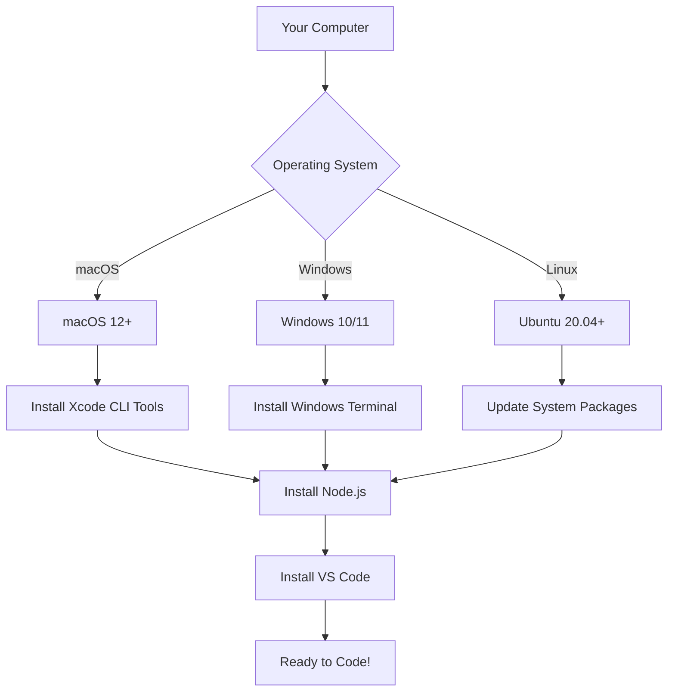
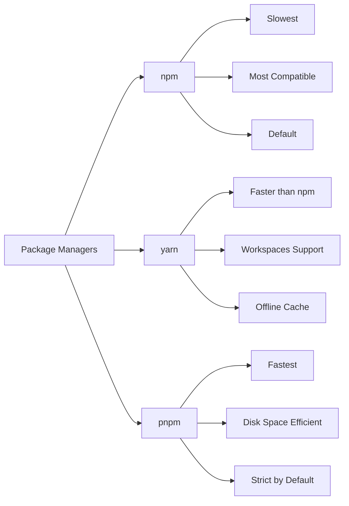
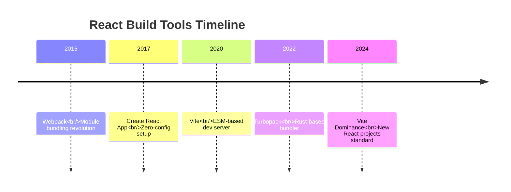
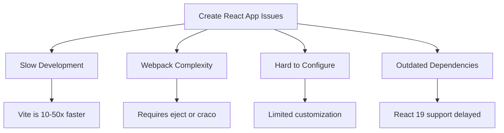
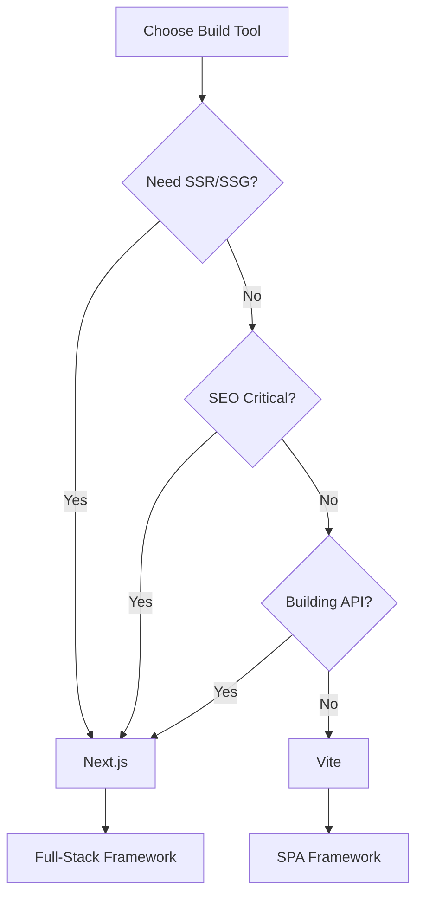
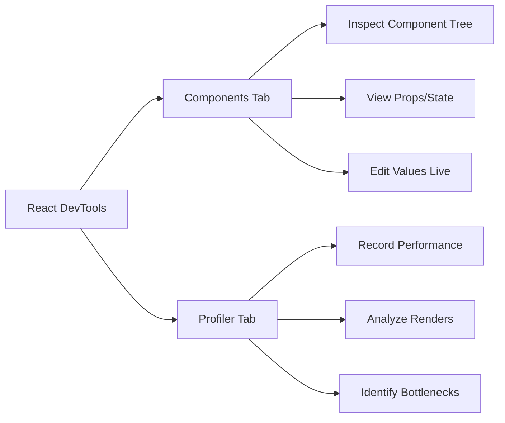
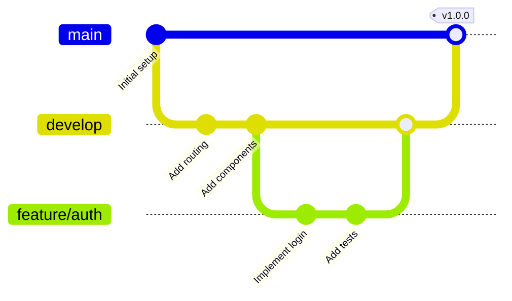
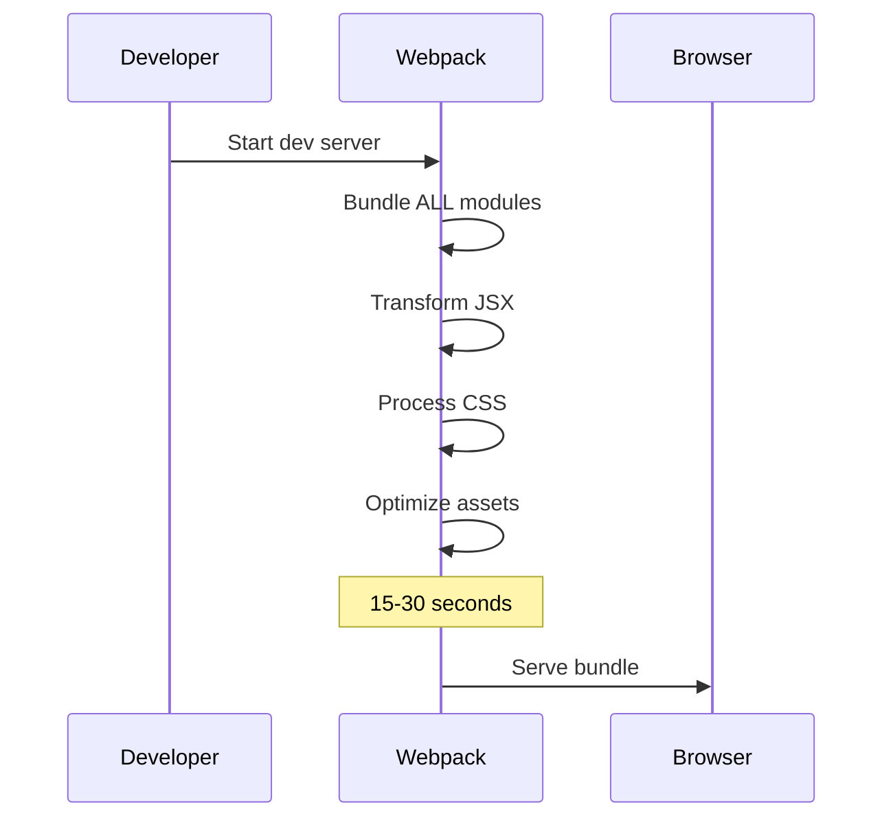
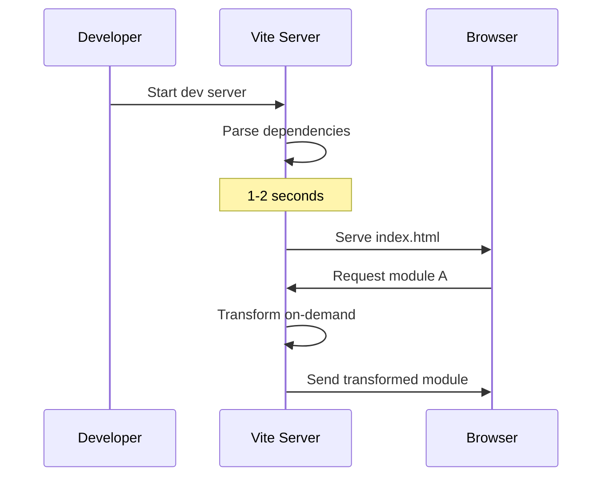

# Topic 02: React Environment Setup - Modern Tooling for 2025

[← Previous: React Introduction](./01_react_intro.md) | [Back to Main](../README.md) | [Next: JSX →](./03_jsx.md)

---

## Table of Contents

1. [Overview](#overview)
2. [Prerequisites](#prerequisites)
3. [Node.js & Package Managers](#nodejs--package-managers)
4. [Modern Build Tools](#modern-build-tools)
5. [Vite - The Modern Standard](#vite---the-modern-standard)
6. [Create React App (Legacy)](#create-react-app-legacy)
7. [Next.js Setup](#nextjs-setup)
8. [Essential IDE Setup](#essential-ide-setup)
9. [Browser DevTools](#browser-devtools)
10. [Git & Version Control](#git--version-control)
11. [Project Structure](#project-structure)
12. [Environment Variables](#environment-variables)

---

## Overview

Setting up a proper React development environment is crucial for productivity. In 2025, the React ecosystem has evolved significantly, with **Vite** becoming the de facto standard for new projects, replacing Create React App.

**What You'll Learn:**
- Modern React tooling landscape (2025)
- How to set up React with Vite (recommended)
- Alternative setups: Next.js, Remix, CRA
- Essential IDE configuration (VS Code)
- Browser DevTools and extensions
- Project structure best practices
- Environment configuration

**Prerequisites:**
- Basic command-line knowledge
- Text editor installed
- Internet connection

**Version Coverage:**
- Node.js 20+ LTS
- Vite 5.x
- React 19.2

---

## Prerequisites

### System Requirements



### Required Software

| Software | Version | Purpose | Installation |
|----------|---------|---------|--------------|
| **Node.js** | 20.x LTS | JavaScript runtime | https://nodejs.org |
| **npm** | 10.x+ | Package manager (comes with Node) | Bundled with Node |
| **Git** | 2.x+ | Version control | https://git-scm.com |
| **VS Code** | Latest | Code editor | https://code.visualstudio.com |

### Optional But Recommended

```bash
# pnpm - Faster alternative to npm
npm install -g pnpm

# yarn - Another popular package manager
npm install -g yarn

# nvm - Node Version Manager (for managing Node versions)
# macOS/Linux:
curl -o- https://raw.githubusercontent.com/nvm-sh/nvm/v0.39.0/install.sh | bash

# Windows: Use nvm-windows
# https://github.com/coreybutler/nvm-windows
```

---

## Node.js & Package Managers

### Installing Node.js

#### Option 1: Direct Download (Easiest)

```bash
# Visit https://nodejs.org
# Download LTS version (20.x)
# Run installer

# Verify installation
node --version  # Should show v20.x.x
npm --version   # Should show 10.x.x
```

#### Option 2: Using nvm (Recommended for Developers)

```bash
# Install nvm first (see prerequisites)

# Install Node.js LTS
nvm install --lts

# Set as default
nvm use --lts

# Verify
nvm current  # Should show v20.x.x
```

**Why use nvm?**
- Manage multiple Node versions
- Switch between projects with different Node requirements
- Easy upgrades and downgrades

### Package Manager Comparison



#### npm (Node Package Manager)

```bash
# Already installed with Node.js
npm install package-name
npm run dev
npm run build
```

**Pros:**
- ✅ Default, always available
- ✅ Most compatible
- ✅ Largest ecosystem

**Cons:**
- ❌ Slower than alternatives
- ❌ Uses more disk space

#### yarn

```bash
# Install globally
npm install -g yarn

# Usage
yarn add package-name
yarn dev
yarn build
```

**Pros:**
- ✅ Faster than npm
- ✅ Offline cache
- ✅ Workspaces support

**Cons:**
- ❌ Extra installation step
- ❌ Occasional compatibility issues

#### pnpm (Recommended for 2025)

```bash
# Install globally
npm install -g pnpm

# Usage
pnpm add package-name
pnpm dev
pnpm build
```

**Pros:**
- ✅ Fastest package manager
- ✅ Efficient disk usage (symlinks)
- ✅ Strict dependency resolution
- ✅ Great for monorepos

**Cons:**
- ❌ Stricter (catches bugs but may require adjustments)

### Package Manager Decision Matrix

| Use Case | Recommended | Why |
|----------|-------------|-----|
| **Learning React** | npm | Simplest, no extra setup |
| **Professional Projects** | pnpm | Fastest, most efficient |
| **Large Monorepos** | pnpm or yarn | Workspace support |
| **Maximum Compatibility** | npm | Widest support |
| **CI/CD Pipelines** | pnpm | Speed + reproducibility |

---

## Modern Build Tools

### Build Tool Evolution



### Why Vite Replaced CRA

| Aspect | Create React App | Vite |
|--------|------------------|------|
| **Dev Server Start** | 15-30 seconds | 1-2 seconds |
| **Hot Module Reload** | 3-5 seconds | Instant (<50ms) |
| **Build Tool** | Webpack | Rollup |
| **Configuration** | Ejected or craco | Native Vite config |
| **TypeScript** | Additional setup | Built-in |
| **Status (2025)** | Maintenance mode | Actively developed |
| **React 19 Support** | Limited | Full |

---

## Vite - The Modern Standard

### What is Vite?

Vite (French for "fast") is a next-generation front-end build tool created by Evan You (Vue.js creator).

**Key Features:**
- ⚡ Lightning-fast dev server using native ESM
- 🔥 Instant Hot Module Replacement (HMR)
- 📦 Optimized production builds with Rollup
- 🎯 TypeScript support out of the box
- 🔌 Rich plugin ecosystem
- 🚀 React 19.2 ready

### Creating a React Project with Vite

#### Method 1: Using npm create (Recommended)

```bash
# Create project
npm create vite@latest my-react-app -- --template react-ts

# Navigate and install
cd my-react-app
npm install

# Start development server
npm run dev
```

#### Method 2: Using pnpm (Faster)

```bash
# Create project
pnpm create vite my-react-app --template react-ts

# Navigate and install
cd my-react-app
pnpm install

# Start development server
pnpm dev
```

#### Available Templates

```bash
# JavaScript
npm create vite@latest my-app -- --template react

# TypeScript (Recommended)
npm create vite@latest my-app -- --template react-ts

# JavaScript with SWC compiler
npm create vite@latest my-app -- --template react-swc

# TypeScript with SWC compiler (Fastest)
npm create vite@latest my-app -- --template react-swc-ts
```

### Understanding the Generated Structure

```
my-react-app/
├── node_modules/          # Dependencies
├── public/                # Static assets (served as-is)
│   └── vite.svg          # Example asset
├── src/                   # Source code
│   ├── assets/           # Dynamic assets (processed by Vite)
│   ├── App.css           # Component styles
│   ├── App.tsx           # Main App component
│   ├── index.css         # Global styles
│   ├── main.tsx          # Entry point
│   └── vite-env.d.ts     # Vite TypeScript declarations
├── .gitignore            # Git ignore rules
├── index.html            # HTML entry point
├── package.json          # Project metadata & scripts
├── tsconfig.json         # TypeScript configuration
├── tsconfig.node.json    # TypeScript config for Node
└── vite.config.ts        # Vite configuration
```

### Vite Configuration

```typescript
// vite.config.ts
import { defineConfig } from 'vite';
import react from '@vitejs/plugin-react';
import path from 'path';

export default defineConfig({
  plugins: [react()],
  
  // Path aliases
  resolve: {
    alias: {
      '@': path.resolve(__dirname, './src'),
      '@components': path.resolve(__dirname, './src/components'),
      '@utils': path.resolve(__dirname, './src/utils'),
    },
  },
  
  // Server configuration
  server: {
    port: 3000,
    open: true, // Auto-open browser
    host: true, // Allow external access
  },
  
  // Build configuration
  build: {
    outDir: 'dist',
    sourcemap: true,
    rollupOptions: {
      output: {
        manualChunks: {
          vendor: ['react', 'react-dom'],
        },
      },
    },
  },
  
  // Preview server (for built app)
  preview: {
    port: 4173,
  },
});
```

### Vite with React Compiler

```bash
# Install React Compiler plugin
npm install -D vite-plugin-react-compiler

# Update vite.config.ts
```

```typescript
import { defineConfig } from 'vite';
import react from '@vitejs/plugin-react';
import reactCompiler from 'vite-plugin-react-compiler';

export default defineConfig({
  plugins: [
    react(),
    reactCompiler({
      // React Compiler options
      mode: 'development', // or 'production'
    }),
  ],
});
```

### Essential Vite Scripts

```json
{
  "scripts": {
    "dev": "vite",                    // Start dev server
    "build": "tsc && vite build",     // Type-check + build
    "lint": "eslint . --ext ts,tsx",  // Lint code
    "preview": "vite preview",        // Preview production build
    "type-check": "tsc --noEmit"      // Check types only
  }
}
```

---

## Create React App (Legacy)

> ⚠️ **Not Recommended for New Projects in 2025**
> 
> Create React App is in maintenance mode. Use Vite or Next.js for new projects.

### Why CRA is Legacy



### If You Must Use CRA

```bash
# Create project
npx create-react-app my-app --template typescript

# Navigate
cd my-app

# Start development server
npm start
```

### Migrating from CRA to Vite

```bash
# Install Vite
npm install -D vite @vitejs/plugin-react

# Move index.html to root
mv public/index.html ./

# Update index.html
# Change <script src="/src/index.tsx" type="module"></script>

# Create vite.config.ts
# Remove react-scripts from package.json
# Update scripts
```

---

## Next.js Setup

### When to Choose Next.js Over Vite



### Creating a Next.js Project

```bash
# Create project
npx create-next-app@latest my-next-app

# Follow prompts
✔ Would you like to use TypeScript? … Yes
✔ Would you like to use ESLint? … Yes
✔ Would you like to use Tailwind CSS? … Yes
✔ Would you like to use `src/` directory? … Yes
✔ Would you like to use App Router? … Yes
✔ Would you like to customize the default import alias? … No

# Navigate and start
cd my-next-app
npm run dev
```

### Next.js vs Vite: Quick Comparison

| Feature | Next.js | Vite |
|---------|---------|------|
| **Use Case** | Full-stack web apps | SPAs, client-side apps |
| **Rendering** | SSR, SSG, CSR | CSR only |
| **API Routes** | Built-in | None (use separate backend) |
| **File-based Routing** | Yes | No (need React Router) |
| **SEO** | Excellent (SSR/SSG) | Limited (CSR only) |
| **Complexity** | Higher | Lower |
| **Setup Time** | 5 minutes | 1 minute |
| **Learning Curve** | Steeper | Gentler |

---

## Essential IDE Setup

### VS Code - The Standard

#### Installation

```bash
# macOS
brew install --cask visual-studio-code

# Windows
winget install Microsoft.VisualStudioCode

# Linux
sudo snap install code --classic
```

#### Must-Have Extensions

```json
{
  "recommendations": [
    "dbaeumer.vscode-eslint",              // ESLint integration
    "esbenp.prettier-vscode",              // Code formatting
    "dsznajder.es7-react-js-snippets",     // React snippets
    "bradlc.vscode-tailwindcss",           // Tailwind IntelliSense
    "styled-components.vscode-styled-components", // Styled Components
    "formulahendry.auto-import",           // Auto-import modules
    "christian-kohler.path-intellisense",  // Path autocomplete
    "github.copilot",                      // AI pair programming
    "streetsidesoftware.code-spell-checker" // Spell checking
  ]
}
```

#### VS Code Settings

```json
{
  // Editor
  "editor.fontSize": 14,
  "editor.tabSize": 2,
  "editor.formatOnSave": true,
  "editor.defaultFormatter": "esbenp.prettier-vscode",
  "editor.codeActionsOnSave": {
    "source.fixAll.eslint": true,
    "source.organizeImports": true
  },
  "editor.bracketPairColorization.enabled": true,
  "editor.guides.bracketPairs": true,
  
  // TypeScript
  "typescript.updateImportsOnFileMove.enabled": "always",
  "typescript.suggest.autoImports": true,
  
  // Files
  "files.autoSave": "onFocusChange",
  "files.exclude": {
    "**/node_modules": true,
    "**/.git": true,
    "**/dist": true,
    "**/.next": true
  },
  
  // Emmet
  "emmet.includeLanguages": {
    "javascript": "javascriptreact",
    "typescript": "typescriptreact"
  },
  
  // Prettier
  "prettier.singleQuote": true,
  "prettier.semi": true,
  "prettier.trailingComma": "es5"
}
```

#### React Snippets

Install "ES7+ React/Redux/React-Native snippets" for these shortcuts:

```typescript
// Type 'rafce' + Tab
import React from 'react';

const ComponentName = () => {
  return <div>ComponentName</div>;
};

export default ComponentName;

// Type 'useState' + Tab
const [state, setState] = useState(initialValue);

// Type 'useEffect' + Tab
useEffect(() => {
  // Effect logic
  return () => {
    // Cleanup
  };
}, [dependencies]);
```

### Alternative IDEs

#### WebStorm

```bash
# Professional IDE by JetBrains
# Better for large codebases
# Built-in tools, no extensions needed
# Paid ($149/year for individuals)
```

**Pros:**
- ✅ Powerful refactoring
- ✅ Advanced TypeScript support
- ✅ Built-in tools (no extension hunting)
- ✅ Database tools included

**Cons:**
- ❌ Expensive
- ❌ Resource-heavy
- ❌ Steeper learning curve

---

## Browser DevTools

### Chrome/Edge DevTools

#### React Developer Tools

```bash
# Install from Chrome Web Store
# Search: "React Developer Tools"
```

**Features:**
- 🔍 Component tree inspection
- 🎯 Props and state viewing
- ⚡ Performance profiling
- 🐛 Hook debugging
- 📊 Component renders tracking

```typescript
// Enable debugging in dev mode
if (process.env.NODE_ENV === 'development') {
  // @ts-ignore
  window.React = React;
}
```

#### Using React DevTools



### Firefox Developer Edition

```bash
# Download from: https://www.mozilla.org/firefox/developer/
```

**Advantages:**
- 🎨 Better CSS Grid/Flexbox tools
- 🔧 Advanced network throttling
- 📱 Responsive design mode
- 🐛 Excellent debugger

---

## Git & Version Control

### Initialize Git Repository

```bash
# Navigate to project
cd my-react-app

# Initialize Git (if not done automatically)
git init

# Configure user (first time only)
git config --global user.name "Your Name"
git config --global user.email "your.email@example.com"

# Add all files
git add .

# Initial commit
git commit -m "🎉 init: Initial commit with Vite + React + TypeScript"

# Create GitHub repository and push
git remote add origin https://github.com/username/my-react-app.git
git branch -M main
git push -u origin main
```

### Essential .gitignore

```gitignore
# Dependencies
node_modules/
.pnp
.pnp.js

# Testing
coverage/

# Production
build/
dist/
.next/
out/

# Misc
.DS_Store
*.pem
.env.local
.env.development.local
.env.test.local
.env.production.local

# Debug
npm-debug.log*
yarn-debug.log*
yarn-error.log*
pnpm-debug.log*

# IDE
.vscode/
.idea/
*.swp
*.swo
*~

# Vercel
.vercel

# TypeScript
*.tsbuildinfo
```

### Git Workflow



---

## Project Structure

### Recommended Folder Structure

```
my-react-app/
├── public/                     # Static files
│   ├── favicon.ico
│   └── robots.txt
│
├── src/
│   ├── assets/                 # Images, fonts, etc.
│   │   ├── images/
│   │   └── fonts/
│   │
│   ├── components/             # Reusable components
│   │   ├── common/            # Shared components
│   │   │   ├── Button/
│   │   │   │   ├── Button.tsx
│   │   │   │   ├── Button.test.tsx
│   │   │   │   └── Button.module.css
│   │   │   └── Input/
│   │   └── layout/            # Layout components
│   │       ├── Header/
│   │       ├── Footer/
│   │       └── Sidebar/
│   │
│   ├── features/              # Feature-based modules
│   │   ├── auth/
│   │   │   ├── components/
│   │   │   ├── hooks/
│   │   │   ├── api/
│   │   │   └── types/
│   │   └── dashboard/
│   │
│   ├── hooks/                 # Custom hooks
│   │   ├── useAuth.ts
│   │   ├── useLocalStorage.ts
│   │   └── useDebounce.ts
│   │
│   ├── utils/                 # Utility functions
│   │   ├── api.ts
│   │   ├── format.ts
│   │   └── validation.ts
│   │
│   ├── types/                 # TypeScript types
│   │   ├── user.ts
│   │   └── api.ts
│   │
│   ├── styles/                # Global styles
│   │   ├── globals.css
│   │   └── variables.css
│   │
│   ├── App.tsx                # Main App component
│   ├── main.tsx              # Entry point
│   └── vite-env.d.ts         # Vite types
│
├── .env.example               # Environment template
├── .gitignore
├── package.json
├── tsconfig.json
├── vite.config.ts
└── README.md
```

### Component Organization Patterns

```typescript
// Pattern 1: Single file (small components)
// components/Button.tsx

// Pattern 2: Folder per component (recommended)
// components/Button/
//   ├── Button.tsx          // Component
//   ├── Button.test.tsx     // Tests
//   ├── Button.stories.tsx  // Storybook
//   ├── Button.module.css   // Styles
//   └── index.ts           // Barrel export

// Pattern 3: Feature-based (large apps)
// features/auth/
//   ├── components/
//   ├── hooks/
//   ├── api/
//   └── types/
```

---

## Environment Variables

### Setup Environment Files

```bash
# Development
.env.development

# Production
.env.production

# Local (gitignored)
.env.local
```

### Vite Environment Variables

```bash
# .env.development
VITE_API_URL=http://localhost:8000
VITE_APP_NAME=My React App
VITE_ENABLE_ANALYTICS=false

# .env.production
VITE_API_URL=https://api.production.com
VITE_APP_NAME=My React App
VITE_ENABLE_ANALYTICS=true
```

**Important Rules:**
- ⚠️ Variables must start with `VITE_` prefix
- ⚠️ Never commit `.env.local` or secrets
- ✅ Use `.env.example` as template

### Accessing Environment Variables

```typescript
// vite-env.d.ts - Type definitions
/// <reference types="vite/client" />

interface ImportMetaEnv {
  readonly VITE_API_URL: string;
  readonly VITE_APP_NAME: string;
  readonly VITE_ENABLE_ANALYTICS: string;
}

interface ImportMeta {
  readonly env: ImportMetaEnv;
}

// Using in components
const apiUrl = import.meta.env.VITE_API_URL;
const appName = import.meta.env.VITE_APP_NAME;
const analyticsEnabled = import.meta.env.VITE_ENABLE_ANALYTICS === 'true';

// Environment check
const isDev = import.meta.env.DEV;
const isProd = import.meta.env.PROD;
const mode = import.meta.env.MODE; // 'development' or 'production'
```

### Environment Variable Best Practices

```typescript
// config/env.ts - Centralized configuration
const getEnv = (key: string, defaultValue?: string): string => {
  const value = import.meta.env[key];
  if (!value && !defaultValue) {
    throw new Error(`Missing required environment variable: ${key}`);
  }
  return value || defaultValue || '';
};

export const config = {
  apiUrl: getEnv('VITE_API_URL'),
  appName: getEnv('VITE_APP_NAME', 'My App'),
  enableAnalytics: getEnv('VITE_ENABLE_ANALYTICS') === 'true',
  isDev: import.meta.env.DEV,
  isProd: import.meta.env.PROD,
} as const;

// Usage
import { config } from '@/config/env';
console.log(config.apiUrl);
```

---

## Higher-Order Thinking FAQs

### 1. Why does Vite start so much faster than Create React App, and does this speed difference matter in production?

**Deep Answer:**

The speed difference stems from fundamentally different development server architectures, but the production implications are nuanced.

**Development Server Architecture:**

**Create React App (Webpack):**


**Vite (ESM-based):**


**Key Differences:**

1. **Bundling Strategy:**
   - CRA: Bundles everything upfront (eager bundling)
   - Vite: Serves modules on-demand (lazy transformation)

2. **Module Format:**
   - CRA: Converts everything to CommonJS/UMD
   - Vite: Uses native ES modules (supported by modern browsers)

3. **Hot Module Replacement:**
   - CRA: Rebuilds affected modules + chunk
   - Vite: Only transforms changed module

**Production Implications:**

Actually, production builds are similar:
- Both use optimized bundlers (Webpack vs Rollup)
- Similar final bundle sizes
- Comparable performance

**Where Dev Speed Matters:**
- Large teams: Hours saved daily
- Rapid prototyping: Faster feedback loops
- Developer experience: Less context switching

**Trade-off:** Vite requires modern browsers for development (IE11 not supported in dev mode).

### 2. Should I use pnpm, npm, or yarn, and does the choice actually impact my application's behavior?

**Deep Answer:**

Package manager choice affects development workflow and monorepo management more than application runtime, but there are subtle behavioral differences that can cause issues.

**Behavioral Differences:**

```typescript
// Scenario: Dependency hoisting differences

// With npm/yarn (flat structure):
node_modules/
├── react@18.0.0
├── react-dom@18.0.0
└── some-package@1.0.0
    └── relies on react (doesn't declare it)

// some-package can access react even though it's not in package.json
// This works but is technically wrong

// With pnpm (strict linking):
node_modules/
├── .pnpm/
│   ├── react@18.0.0/
│   └── some-package@1.0.0/
└── some-package -> .pnpm/some-package@1.0.0

// some-package CANNOT access react unless it's declared
// This breaks the above scenario but is more correct
```

**Real-World Impact Example:**

```json
// package.json
{
  "dependencies": {
    "library-a": "1.0.0"
    // library-a uses lodash internally but doesn't declare it
  }
}

// With npm/yarn: Works (lodash hoisted from another package)
// With pnpm: Breaks (strict dependency isolation)

// Solution: Fix library-a to declare lodash
// Or: Use pnpm's shamefully-hoist option
