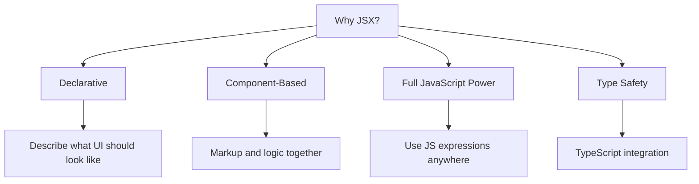
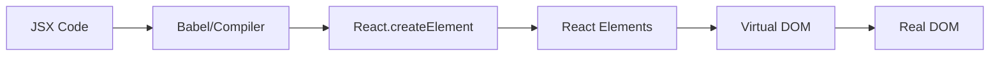

# Topic 03: JSX - JavaScript XML Syntax

[← Previous: React Setup](./02_react_setup.md) | [Back to Main](../README.md) | [Next: Components →](./04_components.md)

---

## Table of Contents

1. [Overview](#overview)
2. [What is JSX?](#what-is-jsx)
3. [JSX vs HTML](#jsx-vs-html)
4. [JSX Expressions](#jsx-expressions)
5. [JSX Attributes](#jsx-attributes)
6. [Children in JSX](#children-in-jsx)
7. [Fragments](#fragments)
8. [Conditional Rendering in JSX](#conditional-rendering-in-jsx)
9. [Lists and Keys](#lists-and-keys)
10. [JSX Under the Hood](#jsx-under-the-hood)
11. [TypeScript and JSX](#typescript-and-jsx)
12. [Common Patterns](#common-patterns)

---

## Overview

**JSX** (JavaScript XML) is a syntax extension for JavaScript that lets you write HTML-like markup inside JavaScript files. It's the fundamental way to describe UI in React.

**What You'll Learn:**
- JSX syntax and rules
- Differences between JSX and HTML
- Embedding expressions in JSX
- Handling attributes and props
- Fragment syntax
- TypeScript integration with JSX
- Common JSX patterns and best practices
- JSX transformation process

**Prerequisites:**
- JavaScript ES6+ fundamentals
- Basic HTML knowledge
- React environment set up

**Version Coverage:**
- React 19.2
- TypeScript 5.x

---

## What is JSX?

### Core Concept

JSX is a **syntax extension** that allows you to write markup that looks like HTML directly in your JavaScript code.

```tsx
// This is JSX
const element = <h1>Hello, World!</h1>;

// It's not a string!
// It's not HTML!
// It's JSX - a syntax extension for JavaScript
```

### Why JSX?



**Benefits:**

1. **Visual Clarity**: Markup resembles the final UI
2. **Colocation**: UI and logic live together
3. **Type Safety**: Works seamlessly with TypeScript
4. **Developer Experience**: Better errors and tooling
5. **Optimization**: Compiled to efficient JavaScript

### JSX is Optional (But Recommended)

```tsx
// With JSX (Recommended)
const element = <h1 className="greeting">Hello!</h1>;

// Without JSX (Verbose)
const element = React.createElement(
  'h1',
  { className: 'greeting' },
  'Hello!'
);

// Both produce the same result
```

---

## JSX vs HTML

### Key Differences

| Feature | HTML | JSX |
|---------|------|-----|
| **Attribute Names** | class, for | className, htmlFor |
| **Style Attribute** | String | Object |
| **Self-Closing Tags** | Optional | Required |
| **Comments** | `<!-- -->` | `{/* */}` |
| **Boolean Attributes** | checked | checked={true} |
| **Event Handlers** | onclick | onClick |
| **Case Sensitivity** | Insensitive | camelCase required |

### Attribute Name Differences

```tsx
// HTML
<div class="container">
  <label for="email">Email:</label>
  <input type="text" tabindex="1">
</div>

// JSX
<div className="container">
  <label htmlFor="email">Email:</label>
  <input type="text" tabIndex={1} />
</div>
```

**Why the difference?**
- `class` is a reserved word in JavaScript
- `for` is a reserved word in JavaScript
- JSX must use valid JavaScript identifiers

### Style Attribute

```tsx
// HTML
<div style="background-color: blue; font-size: 20px;">
  Content
</div>

// JSX - Style is an object!
<div style={{ backgroundColor: 'blue', fontSize: '20px' }}>
  Content
</div>

// Or define style object separately
const divStyle = {
  backgroundColor: 'blue',
  fontSize: '20px',
  marginTop: 10, // Numbers get 'px' automatically
};

<div style={divStyle}>Content</div>
```

### Self-Closing Tags

```tsx
// HTML - Optional closing

<br>
<input type="text">

// JSX - MUST self-close

<br />
<input type="text" />

// ❌ This will error

```

### Comments

```tsx
// HTML
<!-- This is a comment -->

// JSX - Use curly braces with JS comments
{/* This is a comment */}

{/* 
  Multi-line comment
  in JSX
*/}

// Single-line comments (outside JSX)
// This works here

<div>
  {/* This is the correct way inside JSX */}
  <p>Content</p>
</div>
```

---

## JSX Expressions

### Embedding JavaScript

You can embed any JavaScript expression in JSX using curly braces `{}`.

```tsx
// Simple expressions
const name = 'Alice';
const element = <h1>Hello, {name}!</h1>;

// Arithmetic
const count = 5;
<p>You have {count * 2} items</p>

// Function calls
function formatName(user) {
  return `${user.firstName} ${user.lastName}`;
}

const user = { firstName: 'Jane', lastName: 'Doe' };
<h1>Hello, {formatName(user)}!</h1>

// Ternary operators
const isLoggedIn = true;
<div>
  {isLoggedIn ? 'Welcome back!' : 'Please sign in'}
</div>

// Logical AND
const unreadMessages = 5;
<div>
  {unreadMessages > 0 && (
    <p>You have {unreadMessages} unread messages</p>
  )}
</div>
```

### Expression Rules

```tsx
// ✅ These work
{42}
{user.name}
{Math.random()}
{condition ? 'yes' : 'no'}
{items.map(item => <li>{item}</li>)}

// ❌ These DON'T work
{if (condition) { return 'yes' }} // Can't use statements
{for (let i = 0; i < 10; i++) {}} // Can't use loops directly
{const x = 5; x + 1} // Can't use declarations

// ✅ Use IIFE for complex logic
{(() => {
  if (score >= 90) return 'A';
  if (score >= 80) return 'B';
  return 'C';
})()}
```

### Preventing XSS

JSX automatically escapes values to prevent XSS attacks:

```tsx
const userInput = '<script>alert("XSS")</script>';

// Safe! Will display as text, not execute
<div>{userInput}</div>

// To insert raw HTML (dangerous, avoid!)
<div dangerouslySetInnerHTML={{ __html: userInput }} />
```

---

## JSX Attributes

### Basic Attributes

```tsx
// String attributes
<a href="https://example.com">Link</a>


// Expression attributes
const url = 'https://example.com';
const description = 'Photo';

<a href={url}>Link</a>


// Boolean attributes
<button disabled={true}>Can't Click</button>
<button disabled={false}>Can Click</button>
<button disabled>Shorthand for true</button>

// Numeric attributes
<input maxLength={10} />
<div tabIndex={1} />
```

### Event Handlers

```tsx
// Inline function
<button onClick={() => alert('Clicked!')}>
  Click Me
</button>

// Function reference
function handleClick() {
  alert('Clicked!');
}

<button onClick={handleClick}>Click Me</button>

// With event object
function handleChange(event) {
  console.log(event.target.value);
}

<input onChange={handleChange} />

// With parameters
<button onClick={() => handleClick('arg1', 'arg2')}>
  Click Me
</button>
```

### Spreading Props

```tsx
// Spread attributes
const props = {
  id: 'main',
  className: 'container',
  'data-testid': 'app',
};

<div {...props}>Content</div>

// Equivalent to:
<div 
  id="main" 
  className="container" 
  data-testid="app"
>
  Content
</div>

// Override specific props
<div {...props} className="override">
  Content
</div>
```

---

## Children in JSX

### Text Children

```tsx
// Simple text
<p>This is text</p>

// With expressions
<p>Count: {count}</p>

// Multi-line
<p>
  This is a longer paragraph
  that spans multiple lines.
</p>
```

### Element Children

```tsx
// Nested elements
<div>
  <h1>Title</h1>
  <p>Paragraph</p>
  <button>Click</button>
</div>

// Mixed children
<div>
  <h1>Title</h1>
  Some text
  <p>Paragraph</p>
  More text
</div>
```

### Expression Children

```tsx
// Array of elements
const items = ['Apple', 'Banana', 'Cherry'];

<ul>
  {items.map(item => <li key={item}>{item}</li>)}
</ul>

// Conditional children
<div>
  {isLoading ? <Spinner /> : <Content />}
</div>

// Multiple children with fragments
<div>
  {isLoggedIn && (
    <>
      <Header />
      <MainContent />
      <Footer />
    </>
  )}
</div>
```

### Children as Props

```tsx
// Explicit children prop
<Container children={<p>Content</p>} />

// Implicit children (preferred)
<Container>
  <p>Content</p>
</Container>

// Both are equivalent
```

---

## Fragments

### Why Fragments?

React components must return a single root element. Fragments let you group elements without adding extra DOM nodes.

```tsx
// ❌ Error: Multiple root elements
function Component() {
  return (
    <h1>Title</h1>
    <p>Paragraph</p>
  );
}

// ❌ Works but adds unnecessary div
function Component() {
  return (
    <div>
      <h1>Title</h1>
      <p>Paragraph</p>
    </div>
  );
}

// ✅ Fragment syntax (full)
function Component() {
  return (
    <React.Fragment>
      <h1>Title</h1>
      <p>Paragraph</p>
    </React.Fragment>
  );
}

// ✅ Fragment shorthand (preferred)
function Component() {
  return (
    <>
      <h1>Title</h1>
      <p>Paragraph</p>
    </>
  );
}
```

### Fragments with Keys

```tsx
// When you need keys, use full syntax
function List({ items }) {
  return (
    <>
      {items.map(item => (
        <React.Fragment key={item.id}>
          <dt>{item.term}</dt>
          <dd>{item.description}</dd>
        </React.Fragment>
      ))}
    </>
  );
}

// Shorthand doesn't support keys
// ❌ This won't work
{items.map(item => (
  <> key={item.id}>  {/* Error! */}
    <dt>{item.term}</dt>
    <dd>{item.description}</dd>
  </>
))}
```

---

## Conditional Rendering in JSX

### Ternary Operator

```tsx
// Simple condition
<div>
  {isLoggedIn ? <UserPanel /> : <LoginForm />}
</div>

// With null for "nothing"
<div>
  {hasError ? <ErrorMessage /> : null}
</div>

// Nested ternaries (use sparingly)
<div>
  {status === 'loading' ? (
    <Spinner />
  ) : status === 'error' ? (
    <Error />
  ) : (
    <Content />
  )}
</div>
```

### Logical AND (&&)

```tsx
// Render if true
{isLoggedIn && <UserPanel />}

// Multiple conditions
{isLoggedIn && hasPermission && <AdminPanel />}

// ⚠️ Beware of falsy numbers!
{count && <p>Count: {count}</p>}
// If count is 0, it renders "0"!

// ✅ Better approach
{count > 0 && <p>Count: {count}</p>}
// Or
{Boolean(count) && <p>Count: {count}</p>}
```

### Logical OR (||)

```tsx
// Fallback values
<p>{username || 'Guest'}</p>

// Default children
<Container>
  {children || <DefaultContent />}
</Container>
```

### If-Else with Variables

```tsx
function Component({ status }) {
  let content;
  
  if (status === 'loading') {
    content = <Spinner />;
  } else if (status === 'error') {
    content = <ErrorMessage />;
  } else {
    content = <DataDisplay />;
  }
  
  return <div>{content}</div>;
}
```

### Switch Statement

```tsx
function StatusDisplay({ status }) {
  const getContent = () => {
    switch (status) {
      case 'idle':
        return <IdleState />;
      case 'loading':
        return <Spinner />;
      case 'success':
        return <SuccessMessage />;
      case 'error':
        return <ErrorMessage />;
      default:
        return null;
    }
  };
  
  return <div>{getContent()}</div>;
}
```

---

## Lists and Keys

### Rendering Lists

```tsx
// Array.map()
const numbers = [1, 2, 3, 4, 5];

<ul>
  {numbers.map(number => (
    <li key={number}>{number}</li>
  ))}
</ul>

// Array of objects
const users = [
  { id: 1, name: 'Alice' },
  { id: 2, name: 'Bob' },
  { id: 3, name: 'Charlie' },
];

<ul>
  {users.map(user => (
    <li key={user.id}>{user.name}</li>
  ))}
</ul>
```

### The Importance of Keys

```tsx
// ❌ Without keys (React will warn)
{items.map(item => (
  <li>{item.name}</li>
))}

// ❌ Using index (avoid when order can change)
{items.map((item, index) => (
  <li key={index}>{item.name}</li>
))}

// ✅ Using unique ID (best)
{items.map(item => (
  <li key={item.id}>{item.name}</li>
))}

// ✅ Generate key from content (if no ID)
{items.map(item => (
  <li key={`${item.category}-${item.name}`}>
    {item.name}
  </li>
))}
```

### Keys Must Be Unique Among Siblings

```tsx
// ✅ Keys only need to be unique among siblings
<div>
  <ul>
    {list1.map(item => <li key={item.id}>{item.name}</li>)}
  </ul>
  
  <ul>
    {list2.map(item => <li key={item.id}>{item.name}</li>)}
  </ul>
</div>

// Even if list1 and list2 have overlapping IDs, it's fine
// because they're in different parent elements
```

---

## JSX Under the Hood

### Babel Transformation

```tsx
// JSX code
const element = (
  <h1 className="greeting">
    Hello, {name}!
  </h1>
);

// Transforms to:
const element = React.createElement(
  'h1',
  { className: 'greeting' },
  'Hello, ',
  name,
  '!'
);

// Which creates:
const element = {
  type: 'h1',
  props: {
    className: 'greeting',
    children: ['Hello, ', name, '!']
  }
};
```

### JSX Transformation Pipeline



### React 17+ JSX Transform

```tsx
// React 17+ (New JSX Transform)
// No need to import React!

// Before React 17
import React from 'react';

function Component() {
  return <div>Hello</div>;
}

// React 17+
// import React from 'react'; // Not needed!

function Component() {
  return <div>Hello</div>;
}

// Transforms to:
import { jsx as _jsx } from 'react/jsx-runtime';

function Component() {
  return _jsx('div', { children: 'Hello' });
}
```

---

## TypeScript and JSX

### TSX Files

```tsx
// Use .tsx extension for TypeScript + JSX
// Component.tsx

interface Props {
  name: string;
  age: number;
  onSubmit: (data: FormData) => void;
}

function UserProfile({ name, age, onSubmit }: Props) {
  return (
    <div>
      <h1>{name}</h1>
      <p>Age: {age}</p>
    </div>
  );
}
```

### Type-Safe Props

```tsx
// Define prop types
type ButtonProps = {
  variant: 'primary' | 'secondary';
  size?: 'small' | 'medium' | 'large';
  disabled?: boolean;
  children: React.ReactNode;
  onClick?: () => void;
};

function Button({ 
  variant, 
  size = 'medium', 
  disabled = false,
  children,
  onClick 
}: ButtonProps) {
  return (
    <button 
      className={`btn-${variant} btn-${size}`}
      disabled={disabled}
      onClick={onClick}
    >
      {children}
    </button>
  );
}

// Usage with type checking
<Button variant="primary" size="large">
  Click Me
</Button>

// ❌ Type error
<Button variant="invalid">Click</Button>
```

### Generic Components

```tsx
// Generic component
interface ListProps<T> {
  items: T[];
  renderItem: (item: T) => React.ReactNode;
}

function List<T>({ items, renderItem }: ListProps<T>) {
  return (
    <ul>
      {items.map((item, index) => (
        <li key={index}>{renderItem(item)}</li>
      ))}
    </ul>
  );
}

// Usage
interface User {
  id: number;
  name: string;
}

const users: User[] = [
  { id: 1, name: 'Alice' },
  { id: 2, name: 'Bob' },
];

<List 
  items={users}
  renderItem={(user) => <span>{user.name}</span>}
/>
```

### Event Types

```tsx
// Event handler types
function handleClick(event: React.MouseEvent<HTMLButtonElement>) {
  console.log(event.currentTarget.value);
}

function handleChange(event: React.ChangeEvent<HTMLInputElement>) {
  console.log(event.target.value);
}

function handleSubmit(event: React.FormEvent<HTMLFormElement>) {
  event.preventDefault();
}

// Usage
<button onClick={handleClick}>Click</button>
<input onChange={handleChange} />
<form onSubmit={handleSubmit}>...</form>
```

---

## Common Patterns

### Conditional Class Names

```tsx
// Using template literals
<div className={`card ${isActive ? 'active' : ''}`}>

// Multiple conditions
<div className={`
  card
  ${isActive ? 'active' : ''}
  ${isDisabled ? 'disabled' : ''}
  ${size === 'large' ? 'card-large' : 'card-small'}
`}>

// Using helper function
function classNames(...classes: string[]) {
  return classes.filter(Boolean).join(' ');
}

<div className={classNames(
  'card',
  isActive && 'active',
  isDisabled && 'disabled',
  size === 'large' ? 'card-large' : 'card-small'
)}>

// Using clsx library (recommended)
import clsx from 'clsx';

<div className={clsx(
  'card',
  {
    active: isActive,
    disabled: isDisabled,
    'card-large': size === 'large',
  }
)}>
```

### Component Composition

```tsx
// Wrapper pattern
function Card({ children }: { children: React.ReactNode }) {
  return <div className="card">{children}</div>;
}

function CardHeader({ children }: { children: React.ReactNode }) {
  return <div className="card-header">{children}</div>;
}

function CardBody({ children }: { children: React.ReactNode }) {
  return <div className="card-body">{children}</div>;
}

// Usage
<Card>
  <CardHeader>
    <h2>Title</h2>
  </CardHeader>
  <CardBody>
    <p>Content</p>
  </CardBody>
</Card>
```

### Render Props Pattern

```tsx
interface MouseTrackerProps {
  render: (position: { x: number; y: number }) => React.ReactNode;
}

function MouseTracker({ render }: MouseTrackerProps) {
  const [position, setPosition] = useState({ x: 0, y: 0 });
  
  useEffect(() => {
    const handleMove = (e: MouseEvent) => {
      setPosition({ x: e.clientX, y: e.clientY });
    };
    
    window.addEventListener('mousemove', handleMove);
    return () => window.removeEventListener('mousemove', handleMove);
  }, []);
  
  return <>{render(position)}</>;
}

// Usage
<MouseTracker 
  render={({ x, y }) => (
    <p>Mouse position: ({x}, {y})</p>
  )}
/>
```

### Children as Function

```tsx
interface ToggleProps {
  children: (isOn: boolean, toggle: () => void) => React.ReactNode;
}

function Toggle({ children }: ToggleProps) {
  const [isOn, setIsOn] = useState(false);
  const toggle = () => setIsOn(!isOn);
  
  return <>{children(isOn, toggle)}</>;
}

// Usage
<Toggle>
  {(isOn, toggle) => (
    <button onClick={toggle}>
      {isOn ? 'ON' : 'OFF'}
    </button>
  )}
</Toggle>
```

---

## Higher-Order Thinking FAQs

### 1. Why does JSX require a single root element, and how does this relate to JavaScript function return values?

**Deep Answer:**

The single root requirement stems from fundamental JavaScript semantics, not React limitations.

**JavaScript Return Constraint:**

```tsx
// JavaScript can only return ONE value
function example() {
  return value; // ✅ One value
}

function broken() {
  return 
    value1  // ❌ Syntax error
    value2  // JavaScript sees this as separate statements
}

// JSX transforms to function calls
// This JSX:
<div>A</div>
<div>B</div>

// Tries to transform to:
React.createElement('div', null, 'A')
React.createElement('div', null, 'B')
// ❌ Can't return two values!

// Must wrap in container:
React.createElement('div', null,
  React.createElement('div', null, 'A'),
  React.createElement('div', null, 'B')
)
```

**Why Fragments Solve This:**

```tsx
// Fragments create a single React element
<>
  <div>A</div>
  <div>B</div>
</>

// Transforms to:
React.createElement(React.Fragment, null,
  React.createElement('div', null, 'A'),
  React.createElement('div', null, 'B')
)
// ✅ One value: a Fragment element with children
```

**Deeper Implication:**

This reveals that JSX is **syntactic sugar** over function calls. Every constraint in JSX maps to a JavaScript constraint. Understanding this helps debug confusing JSX errors.

### 2. Why does React escape values by default in JSX, and when would auto-escaping actually cause problems?

**Deep Answer:**

React's auto-escaping prevents XSS attacks by treating all interpolated values as **text**, not code.

**The Security Model:**

```tsx
// User input (potentially malicious)
const userBio = '<script>steal Cookies()</script>';

// React escapes automatically
<div>{userBio}</div>
// Renders as text: "<script>stealCookies()</script>"
// Not executed!

// Compare to innerHTML (dangerous)
element.innerHTML = userBio;
// ❌ Executes the script!
```

**When Escaping Causes Problems:**

```tsx
// 1. Markdown/Rich Text
const markdown = '<em>emphasized</em> text';
<div>{markdown}</div>
// Shows: "<em>emphasized</em> text" (not italicized)

// Solution: Use markdown library + dangerouslySetInnerHTML
<div dangerouslySetInnerHTML={{ __html: sanitized(markdown) }} />

// 2. SVG paths
const svgPath = '<path d="M10 10 L20 20" />';
<svg>{svgPath}</svg>
// ❌ Doesn't work - renders as text

// Solution: Use actual JSX
<svg>
  <path d="M10 10 L20 20" />
</svg>

// 3. HTML entities
<div>{'&nbsp;'}</div>
// Renders: "&nbsp;" (not a space)

// Solution: Use actual character or dangerouslySetInnerHTML
<div>{'\u00A0'}</div>
```

**The Trade-off:**

React prioritizes **security by default** over convenience. You must **explicitly opt into** dangerous operations, making vulnerabilities obvious in code review.

### 3. Why can't you use if-statements directly in JSX, but ternary operators work fine?

**Deep Answer:**

The distinction is between **expressions** (which produce values) and **statements** (which perform actions).

**Expressions vs Statements:**

```tsx
// Expressions (produce values)
5 + 3
user.name
condition ? 'yes' : 'no'
function()
x || y

// Statements (perform actions, no value)
if (condition) { }
for (let i = 0; i < 10; i++) { }
while (condition) { }
const x = 5; // Declaration
```

**Why It Matters:**

```tsx
// JSX transforms to function calls
<div>{/* expression here */}</div>

// Transforms to:
React.createElement('div', null, /* expression result */)

// Function call arguments MUST be expressions
someFunction(
  5 + 3,           // ✅ Expression
  if (x) { y }     // ❌ Statement - syntax error!
)
```

**Workarounds:**

```tsx
// 1. IIFE (Immediately Invoked Function Expression)
<div>
  {(() => {
    if (score >= 90) return 'A';
    if (score >= 80) return 'B';
    return 'C';
  })()}
</div>

// 2. Ternary chain
<div>
  {score >= 90 ? 'A' : score >= 80 ? 'B' : 'C'}
</div>

// 3. Extract to function
const getGrade = (score) => {
  if (score >= 90) return 'A';
  if (score >= 80) return 'B';
  return 'C';
};

<div>{getGrade(score)}</div>

// 4. Use variable
let grade;
if (score >= 90) grade = 'A';
else if (score >= 80) grade = 'B';
else grade = 'C';

<div>{grade}</div>
```

**Design Philosophy:**

JSX's expression-only constraint encourages **declarative thinking**: describe what the UI should be, not how to build it step-by-step.

---

## Senior SDE Interview Questions

### Question 1: JSX Performance & Optimization

**Question:** "Explain how JSX affects React's performance, and describe optimization strategies related to JSX structure."

**Key Concepts Being Tested:**
- Understanding of JSX compilation
- Virtual DOM reconciliation
- Component re-render triggers
- Optimization techniques

**Expected Answer Should Cover:**

1. **JSX Compilation Impact:**
   - JSX compiles to `React.createElement` calls
   - Creates new object references on each render
   - React Compiler can optimize this in React 19+

2. **Reconciliation Considerations:**
   ```tsx
   // ❌ Creates new array every render
   <Component items={[1, 2, 3]} />
   
   // ✅ Reference stable
   const items = [1, 2, 3];
   <Component items={items} />
   ```

3. **Key Prop Importance:**
   - Enables efficient list reconciliation
   - Wrong keys cause unnecessary re-renders
   - Index as key is antipattern for dynamic lists

4. **Conditional Rendering:**
   ```tsx
   // ❌ Unmounts/remounts component
   {showA ? <ComponentA /> : <ComponentB />}
   
   // ✅ Keeps component mounted
   <ComponentA style={{ display: showA ? 'block' : 'none' }} />
   ```

**Follow-up Questions:**

1. "How would you profile a React app to identify JSX-related performance issues?"
2. "When would you use `React.memo` vs restructuring JSX?"
3. "Explain the performance implications of spreading props in JSX."

**Red Flags:**
- Not mentioning reconciliation algorithm
- Claiming JSX is slow (it's not)
- Not knowing about keys

**Green Flags:**
- Mentions React Compiler benefits
- Discusses profiling tools
- Provides specific code examples
- Understands reference equality
