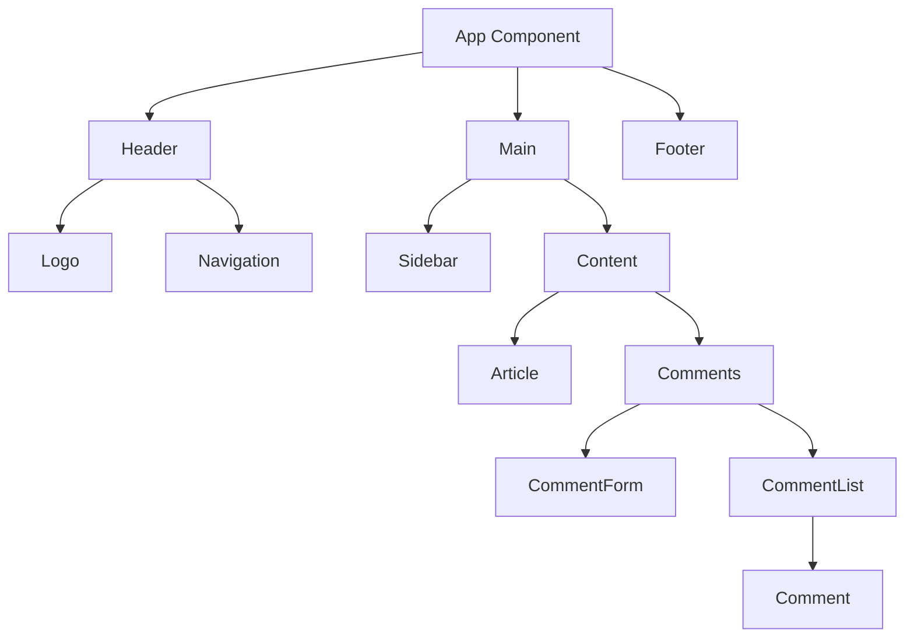
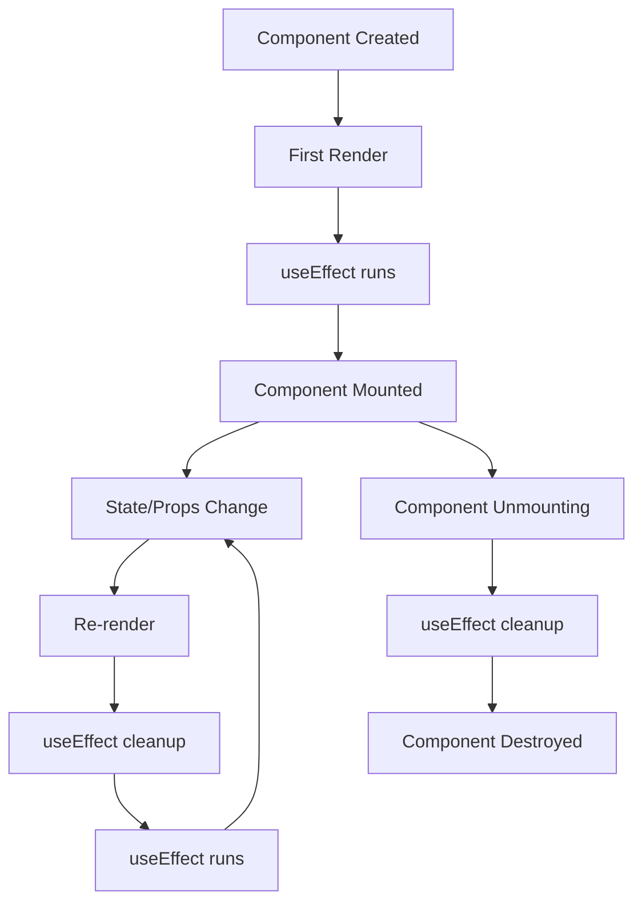
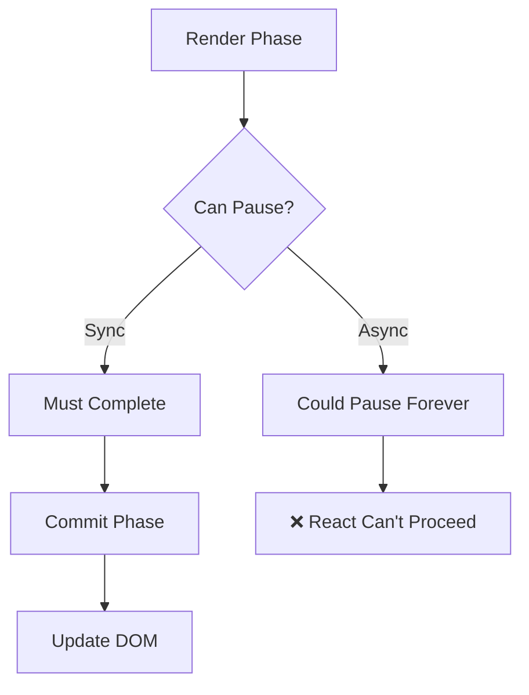

# Topic 04: React Components - Building Blocks of UI

[← Previous: JSX](./03_jsx.md) | [Back to Main](../README.md) | [Next: Props →](./05_props.md)

---

## Table of Contents

1. [Overview](#overview)
2. [What are Components?](#what-are-components)
3. [Function Components](#function-components)
4. [Class Components (Legacy)](#class-components-legacy)
5. [Component Lifecycle](#component-lifecycle)
6. [Component Composition](#component-composition)
7. [Component Design Principles](#component-design-principles)
8. [Component Organization](#component-organization)
9. [Naming Conventions](#naming-conventions)
10. [Component Patterns](#component-patterns)
11. [Performance Considerations](#performance-considerations)

---

## Overview

**Components** are the fundamental building blocks of React applications. They let you split the UI into independent, reusable pieces that can be composed together to build complex interfaces.

**What You'll Learn:**
- Function components (modern approach)
- Class components (legacy but important to understand)
- Component lifecycle concepts
- Composition patterns
- Best practices for component design
- Naming and organization conventions
- Performance optimization basics

**Prerequisites:**
- JavaScript ES6+ (arrow functions, classes, destructuring)
- JSX syntax
- Basic React setup

**Version Coverage:**
- React 19.2 (Function components with Hooks)
- Legacy class components for reference

---

## What are Components?

### Core Concept

A component is a **JavaScript function or class** that returns React elements describing what should appear on the screen.

```tsx
// Simplest possible component
function Welcome() {
  return <h1>Hello, World!</h1>;
}

// That's it! A component is just a function that returns JSX
```

### Component Hierarchy



### Why Components?

**1. Reusability**
```tsx
// Define once
function Button({ children }) {
  return <button className="btn">{children}</button>;
}

// Use everywhere
<Button>Save</Button>
<Button>Cancel</Button>
<Button>Submit</Button>
```

**2. Maintainability**
```tsx
// Each component is independent
function UserProfile() { /* User-related logic */ }
function ProductCard() { /* Product-related logic */ }
function ShoppingCart() { /* Cart-related logic */ }
```

**3. Testability**
```tsx
// Test components in isolation
it('renders button with correct text', () => {
  render(<Button>Click me</Button>);
  expect(screen.getByText('Click me')).toBeInTheDocument();
});
```

---

## Function Components

### Basic Syntax

```tsx
// Most basic form
function Greeting() {
  return <h1>Hello!</h1>;
}

// Arrow function (also common)
const Greeting = () => {
  return <h1>Hello!</h1>;
};

// Implicit return (for simple components)
const Greeting = () => <h1>Hello!</h1>;

// With TypeScript
const Greeting: React.FC = () => {
  return <h1>Hello!</h1>;
};
```

### Components with Logic

```tsx
function Welcome() {
  // JavaScript logic before return
  const name = 'Alice';
  const time = new Date().getHours();
  const greeting = time < 12 ? 'Good morning' : 'Good afternoon';
  
  return (
    <div>
      <h1>{greeting}, {name}!</h1>
      <p>Current time: {new Date().toLocaleTimeString()}</p>
    </div>
  );
}
```

### Multi-line Returns

```tsx
// Single element - no parentheses needed
function Simple() {
  return <div>Content</div>;
}

// Multiple lines - use parentheses
function Complex() {
  return (
    <div>
      <h1>Title</h1>
      <p>Paragraph</p>
      <button>Click me</button>
    </div>
  );
}

// Or use fragments
function MultipleElements() {
  return (
    <>
      <h1>Title</h1>
      <p>Paragraph</p>
    </>
  );
}
```

### Early Returns

```tsx
function UserGreeting({ user }) {
  // Early return for edge cases
  if (!user) {
    return <p>Please log in.</p>;
  }
  
  if (user.isBanned) {
    return <p>Access denied.</p>;
  }
  
  // Main component render
  return (
    <div>
      <h1>Welcome, {user.name}!</h1>
      <p>Email: {user.email}</p>
    </div>
  );
}
```

### TypeScript Function Components

```tsx
// Using React.FC (older style)
const Greeting: React.FC<{ name: string }> = ({ name }) => {
  return <h1>Hello, {name}!</h1>;
};

// Direct typing (modern, preferred)
interface Props {
  name: string;
  age: number;
  onUpdate?: () => void;
}

function UserProfile({ name, age, onUpdate }: Props) {
  return (
    <div>
      <h2>{name}</h2>
      <p>Age: {age}</p>
      {onUpdate && <button onClick={onUpdate}>Update</button>}
    </div>
  );
}

// With return type explicit
function Counter({ initialCount }: { initialCount: number }): JSX.Element {
  const [count, setCount] = useState(initialCount);
  
  return (
    <div>
      <p>Count: {count}</p>
      <button onClick={() => setCount(count + 1)}>Increment</button>
    </div>
  );
}
```

---

## Class Components (Legacy)

> ⚠️ **Note**: Class components are legacy. Use function components with Hooks for new code.
> However, understanding class components is important for:
> - Maintaining legacy codebases
> - Understanding React's evolution
> - Technical interviews

### Basic Class Component

```tsx
import React, { Component } from 'react';

class Welcome extends Component {
  render() {
    return <h1>Hello, World!</h1>;
  }
}

// With TypeScript
interface Props {
  name: string;
}

interface State {
  count: number;
}

class Counter extends Component<Props, State> {
  state: State = {
    count: 0
  };
  
  render() {
    return (
      <div>
        <p>Count: {this.state.count}</p>
      </div>
    );
  }
}
```

### Class Component with State

```tsx
class Counter extends Component {
  // Initialize state
  state = {
    count: 0
  };
  
  // Event handlers
  increment = () => {
    this.setState({ count: this.state.count + 1 });
  };
  
  decrement = () => {
    this.setState({ count: this.state.count - 1 });
  };
  
  render() {
    return (
      <div>
        <p>Count: {this.state.count}</p>
        <button onClick={this.increment}>+</button>
        <button onClick={this.decrement}>-</button>
      </div>
    );
  }
}
```

### Function vs Class Components

| Aspect | Function Components | Class Components |
|--------|-------------------|------------------|
| **Syntax** | Simpler | More verbose |
| **State** | useState Hook | this.state |
| **Lifecycle** | useEffect Hook | Lifecycle methods |
| **this binding** | Not needed | Required |
| **Performance** | Better (generally) | Slightly slower |
| **Hooks** | ✅ Supported | ❌ Not supported |
| **React 19 features** | ✅ Full support | ⚠️ Limited |
| **Future** | Recommended | Legacy |

### Migration Example

```tsx
// Class component
class UserProfile extends Component {
  state = {
    loading: true,
    user: null
  };
  
  componentDidMount() {
    fetchUser(this.props.userId)
      .then(user => this.setState({ user, loading: false }));
  }
  
  render() {
    if (this.state.loading) return <Loading />;
    return <UserDisplay user={this.state.user} />;
  }
}

// Equivalent function component
function UserProfile({ userId }) {
  const [loading, setLoading] = useState(true);
  const [user, setUser] = useState(null);
  
  useEffect(() => {
    fetchUser(userId)
      .then(user => {
        setUser(user);
        setLoading(false);
      });
  }, [userId]);
  
  if (loading) return <Loading />;
  return <UserDisplay user={user} />;
}
```

---

## Component Lifecycle

### Function Component Lifecycle (Modern)



### Lifecycle with Hooks

```tsx
function MyComponent({ propValue }) {
  // 1. Component creation and initial render
  console.log('Component body runs every render');
  
  // 2. After mount (componentDidMount)
  useEffect(() => {
    console.log('Component mounted');
    
    // 3. Before unmount (componentWillUnmount)
    return () => {
      console.log('Component will unmount');
    };
  }, []); // Empty deps = run once on mount
  
  // 4. When specific value changes (componentDidUpdate)
  useEffect(() => {
    console.log('propValue changed to:', propValue);
  }, [propValue]); // Runs when propValue changes
  
  // 5. On every render (componentDidUpdate + mount)
  useEffect(() => {
    console.log('Component rendered');
  }); // No deps array = runs every render
  
  return <div>{propValue}</div>;
}
```

### Class Component Lifecycle (Reference)

```tsx
class LifecycleDemo extends Component {
  // 1. Constructor
  constructor(props) {
    super(props);
    console.log('1. Constructor');
    this.state = { count: 0 };
  }
  
  // 2. Component mounting
  componentDidMount() {
    console.log('2. Component Did Mount');
  }
  
  // 3. Component updating
  componentDidUpdate(prevProps, prevState) {
    console.log('3. Component Did Update');
  }
  
  // 4. Component unmounting
  componentWillUnmount() {
    console.log('4. Component Will Unmount');
  }
  
  // 5. Error handling
  componentDidCatch(error, info) {
    console.log('5. Component Did Catch Error');
  }
  
  render() {
    console.log('Render');
    return <div>Count: {this.state.count}</div>;
  }
}
```

---

## Component Composition

### Parent-Child Relationship

```tsx
// Parent component
function TodoApp() {
  const [todos, setTodos] = useState([]);
  
  return (
    <div>
      <TodoInput onAdd={addTodo} />
      <TodoList todos={todos} />
    </div>
  );
}

// Child components
function TodoInput({ onAdd }) {
  const [text, setText] = useState('');
  
  const handleSubmit = (e) => {
    e.preventDefault();
    onAdd(text);
    setText('');
  };
  
  return (
    <form onSubmit={handleSubmit}>
      <input value={text} onChange={(e) => setText(e.target.value)} />
      <button type="submit">Add</button>
    </form>
  );
}

function TodoList({ todos }) {
  return (
    <ul>
      {todos.map(todo => (
        <TodoItem key={todo.id} todo={todo} />
      ))}
    </ul>
  );
}
```

### Container/Presentational Pattern

```tsx
// Container (Smart Component)
function UserProfileContainer({ userId }) {
  const [user, setUser] = useState(null);
  const [loading, setLoading] = useState(true);
  
  useEffect(() => {
    fetchUser(userId).then(data => {
      setUser(data);
      setLoading(false);
    });
  }, [userId]);
  
  if (loading) return <Loading />;
  
  // Pass data to presentational component
  return <UserProfile user={user} />;
}

// Presentational (Dumb Component)
function UserProfile({ user }) {
  return (
    <div>
      <h1>{user.name}</h1>
      <p>{user.email}</p>
      <p>{user.bio}</p>
    </div>
  );
}
```

### Composition with Children

```tsx
// Generic container component
function Card({ children, title }) {
  return (
    <div className="card">
      {title && <div className="card-header">{title}</div>}
      <div className="card-body">{children}</div>
    </div>
  );
}

// Usage - compose different content
function App() {
  return (
    <>
      <Card title="User Profile">
        <UserInfo />
      </Card>
      
      <Card title="Recent Activity">
        <ActivityFeed />
      </Card>
      
      <Card>
        <CustomContent />
      </Card>
    </>
  );
}
```

---

## Component Design Principles

### Single Responsibility

```tsx
// ❌ Bad: Component does too much
function UserDashboard() {
  // Fetches user data
  // Fetches posts
  // Fetches comments
  // Handles authentication
  // Renders everything
  
  return (/* huge JSX */);
}

// ✅ Good: Each component has one responsibility
function UserDashboard() {
  return (
    <>
      <UserProfile />
      <UserPosts />
      <UserComments />
    </>
  );
}

function UserProfile() {
  // Only handles user profile
}

function UserPosts() {
  // Only handles posts
}
```

### Component Size

```tsx
// Rule of thumb: If a component is > 200-300 lines, consider splitting

// ✅ Good: Small, focused components
function ProductCard({ product }) {
  return (
    <div className="product-card">
      <ProductImage src={product.image} />
      <ProductInfo product={product} />
      <ProductActions product={product} />
    </div>
  );
}

// Each subcomponent is also small and focused
function ProductImage({ src }) {
  return ;
}

function ProductInfo({ product }) {
  return (
    <div>
      <h3>{product.name}</h3>
      <p>{product.description}</p>
      <Price amount={product.price} />
    </div>
  );
}
```

### Prop Drilling vs Composition

```tsx
// ❌ Prop drilling (bad)
function App() {
  const user = useUser();
  return <Layout user={user} />;
}

function Layout({ user }) {
  return <Sidebar user={user} />;
}

function Sidebar({ user }) {
  return <UserMenu user={user} />;
}

function UserMenu({ user }) {
  return <div>{user.name}</div>;
}

// ✅ Better: Composition
function App() {
  const user = useUser();
  
  return (
    <Layout sidebar={<UserMenu user={user} />}>
      <MainContent />
    </Layout>
  );
}

function Layout({ sidebar, children }) {
  return (
    <div>
      <div className="sidebar">{sidebar}</div>
      <div className="main">{children}</div>
    </div>
  );
}
```

---

## Component Organization

### File Structure

```
src/
├── components/
│   ├── common/           # Shared components
│   │   ├── Button/
│   │   │   ├── Button.tsx
│   │   │   ├── Button.test.tsx
│   │   │   ├── Button.module.css
│   │   │   └── index.ts
│   │   │
│   │   ├── Input/
│   │   └── Modal/
│   │
│   └── features/         # Feature-specific
│       ├── auth/
│       │   ├── LoginForm.tsx
│       │   └── SignupForm.tsx
│       │
│       └── dashboard/
│           ├── DashboardHeader.tsx
│           └── DashboardStats.tsx
│
├── pages/                # Route components
│   ├── HomePage.tsx
│   ├── DashboardPage.tsx
│   └── ProfilePage.tsx
│
└── layouts/              # Layout components
    ├── MainLayout.tsx
    └── AuthLayout.tsx
```

### Barrel Exports

```tsx
// components/common/Button/Button.tsx
export function Button({ children, ...props }) {
  return <button {...props}>{children}</button>;
}

// components/common/Button/index.ts (barrel file)
export { Button } from './Button';
export type { ButtonProps } from './Button';

// Usage elsewhere
import { Button } from '@/components/common/Button';
// Instead of: import { Button } from '@/components/common/Button/Button';
```

---

## Naming Conventions

### Component Names

```tsx
// ✅ PascalCase for components
function UserProfile() {}
const ProductCard = () => {};

// ❌ Don't use camelCase
function userProfile() {}  // Wrong!

// ✅ Descriptive names
function UserProfileCard() {}
function ProductImageGallery() {}

// ❌ Generic names (unless truly generic)
function Component() {}  // Too vague
function Thing() {}      // Not descriptive
```

### File Names

```tsx
// Match component name
UserProfile.tsx      // ✅
ProductCard.tsx      // ✅
ShoppingCart.tsx     // ✅

// Don't use different casing
userProfile.tsx      // ❌
product-card.tsx     // ❌ (unless your project uses kebab-case)
```

### Event Handler Names

```tsx
function Form() {
  // ✅ handle + EventName
  const handleSubmit = (e) => {};
  const handleChange = (e) => {};
  const handleClick = () => {};
  
  // ✅ on + EventName for props
  return (
    <button onClick={handleClick}>
      Submit
    </button>
  );
}

// Pass handlers as props
function ParentComponent() {
  const handleUserUpdate = (user) => {};
  
  return <ChildComponent onUserUpdate={handleUserUpdate} />;
}
```

---

## Component Patterns

### Render Props

```tsx
interface MouseTrackerProps {
  render: (position: { x: number; y: number }) => JSX.Element;
}

function MouseTracker({ render }: MouseTrackerProps) {
  const [position, setPosition] = useState({ x: 0, y: 0 });
  
  useEffect(() => {
    const handleMove = (e: MouseEvent) => {
      setPosition({ x: e.clientX, y: e.clientY });
    };
    window.addEventListener('mousemove', handleMove);
    return () => window.removeEventListener('mousemove', handleMove);
  }, []);
  
  return render(position);
}

// Usage
<MouseTracker 
  render={({ x, y }) => (
    <p>Mouse at ({x}, {y})</p>
  )}
/>
```

### Compound Components

```tsx
// Parent component
function Tabs({ children }) {
  const [activeTab, setActiveTab] = useState(0);
  
  return (
    <div className="tabs">
      {React.Children.map(children, (child, index) =>
        React.cloneElement(child, {
          isActive: index === activeTab,
          onClick: () => setActiveTab(index),
        })
      )}
    </div>
  );
}

// Child component
function Tab({ isActive, onClick, children }) {
  return (
    <button 
      className={isActive ? 'tab-active' : 'tab'}
      onClick={onClick}
    >
      {children}
    </button>
  );
}

// Usage
<Tabs>
  <Tab>Profile</Tab>
  <Tab>Settings</Tab>
  <Tab>Logout</Tab>
</Tabs>
```

### Higher-Order Components (HOC)

```tsx
// HOC that adds loading state
function withLoading<P extends object>(
  Component: React.ComponentType<P>
) {
  return function WithLoadingComponent(
    props: P & { isLoading: boolean }
  ) {
    const { isLoading, ...rest } = props;
    
    if (isLoading) {
      return <div>Loading...</div>;
    }
    
    return <Component {...(rest as P)} />;
  };
}

// Usage
const UserListWithLoading = withLoading(UserList);

<UserListWithLoading users={users} isLoading={loading} />
```

---

## Performance Considerations

### React.memo

```tsx
// Prevents re-renders if props haven't changed
const ExpensiveComponent = React.memo(function ExpensiveComponent({ data }) {
  console.log('Rendering ExpensiveComponent');
  
  return (
    <div>
      {/* Expensive rendering logic */}
      {data.map(item => <div key={item.id}>{item.name}</div>)}
    </div>
  );
});

// With custom comparison
const UserCard = React.memo(
  function UserCard({ user }) {
    return <div>{user.name}</div>;
  },
  (prevProps, nextProps) => {
    // Return true if props are equal (skip re-render)
    return prevProps.user.id === nextProps.user.id;
  }
);
```

### Component Splitting

```tsx
// ❌ Entire component re-renders on count change
function App() {
  const [count, setCount] = useState(0);
  
  return (
    <div>
      <ExpensiveList items={items} /> {/* Re-renders unnecessarily */}
      <Counter count={count} onChange={setCount} />
    </div>
  );
}

// ✅ Split into separate components
function App() {
  return (
    <div>
      <ExpensiveList items={items} /> {/* Doesn't re-render */}
      <CounterContainer />
    </div>
  );
}

function CounterContainer() {
  const [count, setCount] = useState(0);
  return <Counter count={count} onChange={setCount} />;
}
```

---

## Higher-Order Thinking FAQs

### 1. Why did React move from class components to function components with Hooks, and what fundamental problems does this solve?

**Deep Answer:**

The shift wasn't about syntax preference—it solved **fundamental architectural problems** with class components.

**Problems with Classes:**

1. **Logic Reuse Was Difficult:**
```tsx
// Class: Logic tied to lifecycle methods
class UserProfile extends Component {
  componentDidMount() {
    // Subscribe to user data
    // Subscribe to friend status
    // Subscribe to online status
    // All mixed together!
  }
  
  componentWillUnmount() {
    // Unsubscribe from everything
    // Easy to forget one subscription
  }
}

// Hooks: Logic grouped by concern
function UserProfile() {
  useUserData(userId);           // Self-contained
  useFriendStatus(friendId);     // Self-contained
  useOnlineStatus(userId);       // Self-contained
}
```

2. **this Binding Confusion:**
```tsx
// Class: this binding is error-prone
class Form extends Component {
  handleSubmit(e) {
    // ❌ `this` is undefined if not bound!
    this.setState({ ... });
  }
  
  render() {
    // Must bind:
    return <form onSubmit={this.handleSubmit.bind(this)} />
    // Or use arrow function:
    // return <form onSubmit={(e) => this.handleSubmit(e)} />
    // Or bind in constructor
  }
}

// Function: No this, no binding
function Form() {
  const handleSubmit = (e) => {
    // Always works correctly
    setSubmit({ ... });
  };
  
  return <form onSubmit={handleSubmit} />;
}
```

3. **Complex Components Became Unreadable:**
```tsx
// Class: Related logic scattered
class ProfilePage extends Component {
  componentDidMount() {
    fetchProfile();    // Setup for feature A
    subscribeToChat(); // Setup for feature B
  }
  
  componentDidUpdate(prevProps) {
    if (this.props.id !== prevProps.id) {
      fetchProfile();    // Update for feature A
      subscribeToChat(); // Update for feature B
    }
  }
  
  componentWillUnmount() {
    cleanupProfile();  // Cleanup for feature A
    unsubscribeChat(); // Cleanup for feature B
  }
}

// Hooks: Related logic grouped
function ProfilePage() {
  useProfile(id);  // All logic for feature A
  useChat(id);     // All logic for feature B
}
```

**Deep Implication:**

Hooks enable **better mental models**. In classes, you think in terms of lifecycle methods. With Hooks, you think in terms of **concerns** (data fetching, subscriptions, etc.), which maps better to how humans actually reason about UI.

### 2. When should you split a component into smaller components, and when does splitting actually make things worse?

**Deep Answer:**

Component splitting is about **managing complexity**, not just reducing file size. Wrong splits create **indirection** without benefit.

**Good Reasons to Split:**

```tsx
// 1. Reusability (used in multiple places)
function Button({ children, variant }) {
  return <button className={variant}>{children}</button>;
}

// Used across app
<Button variant="primary">Save</Button>
<Button variant="secondary">Cancel</Button>

// 2. Independent state management
function TodoApp() {
  return (
    <>
      <TodoInput />   {/* Has its own input state */}
      <TodoList />    {/* Has its own filtering state */}
    </>
  );
}

// 3. Performance (expensive to render)
const ExpensiveChart = React.memo(function ExpensiveChart({ data }) {
  // Heavy D3 rendering
});

// 4. Clarity (logically distinct concerns)
function CheckoutPage() {
  return (
    <>
      <OrderSummary />    {/* Clear responsibility */}
      <PaymentForm />     {/* Clear responsibility */}
      <ShippingInfo />    {/* Clear responsibility */}
    </>
  );
}
```

**Bad Reasons to Split:**

```tsx
// ❌ Over-splitting for no benefit
function UserProfile() {
  return <UserProfileContainer />;
}

function UserProfileContainer() {
  return <UserProfileWrapper />;
}

function UserProfileWrapper() {
  return <ActualUserProfile />;
}

// Just creates indirection!

// ❌ Splitting tightly coupled logic
function Form() {
  const [email, setEmail] = useState('');
  return (
    <>
      <EmailInput value={email} onChange={setEmail} />
      <EmailValidation email={email} />
    </>
  );
}

// EmailInput and EmailValidation are always used together
// Just keep them in one component!
```

**Decision Framework:**

1. Would this code be reused? → Split
2. Does it have independent state? → Split
3. Is it expensive to render? → Split
4. Does splitting clarify the mental model? → Split
5. None of the above? → DON'T split

### 3. Why can't React components be async functions, and what are the implications for data fetching?

**Deep Answer:**

Async components break React's **synchronous rendering model**, which is fundamental to how React works.

**Why Async Doesn't Work:**

```tsx
// ❌ This doesn't work
async function UserProfile({ userId }) {
  const user = await fetchUser(userId);
  return <div>{user.name}</div>;
}

// Why? Let's trace the execution:
// 1. React calls UserProfile()
// 2. Function hits await, returns Promise
// 3. React receives: Promise<JSX.Element>
// 4. React can't render a Promise!
```

**React's Rendering Must Be Synchronous:**



**The Correct Pattern:**

```tsx
// ✅ Use Suspense + async data fetching
function UserProfile({ userId }) {
  // use() unwraps promises synchronously (React 19)
  const user = use(fetchUser(userId));
  return <div>{user.name}</div>;
}

// Must wrap in Suspense
<Suspense fallback={<Loading />}>
  <UserProfile userId={123} />
</Suspense>

// Or traditional pattern
function UserProfile({ userId }) {
  const [user, setUser] = useState(null);
  
  useEffect(() => {
    fetchUser(userId).then(setUser);
  }, [userId]);
  
  if (!user) return <Loading />;
  return <div>{user.name}</div>;
}
```

**React Server Components Exception:**

```tsx
// Server Components CAN be async!
async function ServerUserProfile({ userId }) {
  const user = await fetchUser(userId);
  return <div>{user.name}</div>;
}

// Why does this work?
// Server Components render on server, once
// Result is streamed to client as HTML
// No need for synchronous re-renders
```

**Deep Implication:**

This reveals React's core constraint: **rendering must be interruptible and repeatable**. Async functions can't be interrupted mid-await, breaking concurrent rendering features like useTransition.

---

## Senior SDE Interview Questions

### Question 1: Component Architecture & Scale

**Question:** "You're building a dashboard with 50+ charts that update in real-time. How would you structure the components to maintain performance as the application scales?"

**Key Concepts Being Tested:**
- Component composition strategies
- Performance optimization
- State management architecture
- Real-world scaling considerations

**Expected Answer Should Cover:**

1. **Component Hierarchy:**
```tsx
<Dashboard>
  <DashboardGrid>
    <ChartContainer> {/* Memoized wrapper */}
