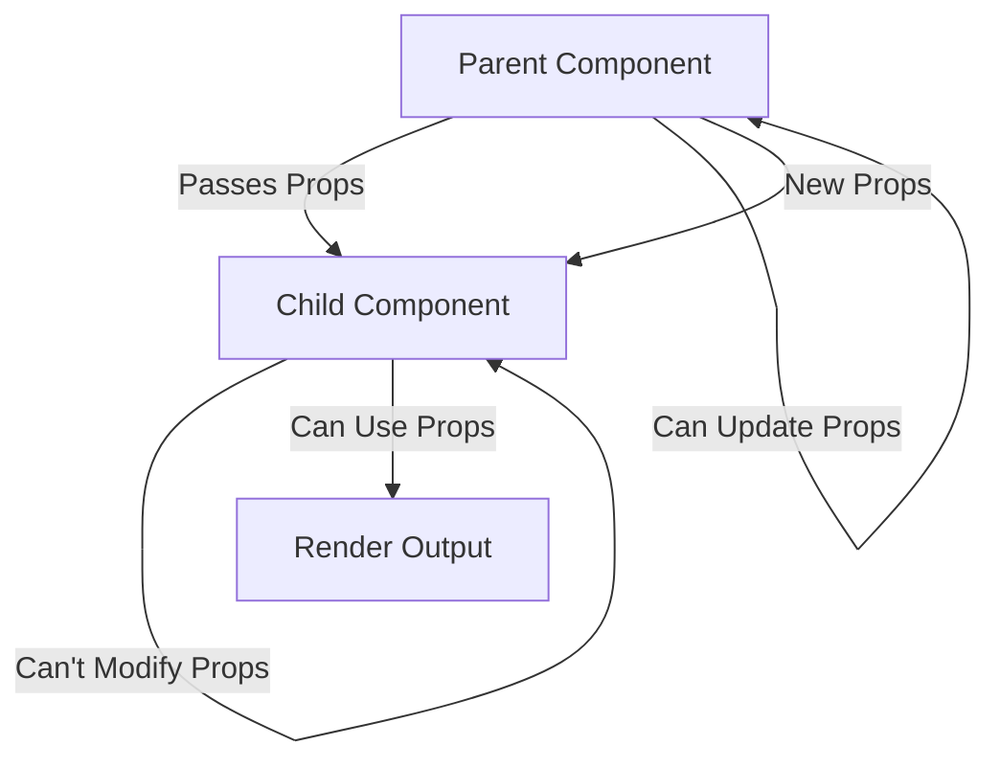
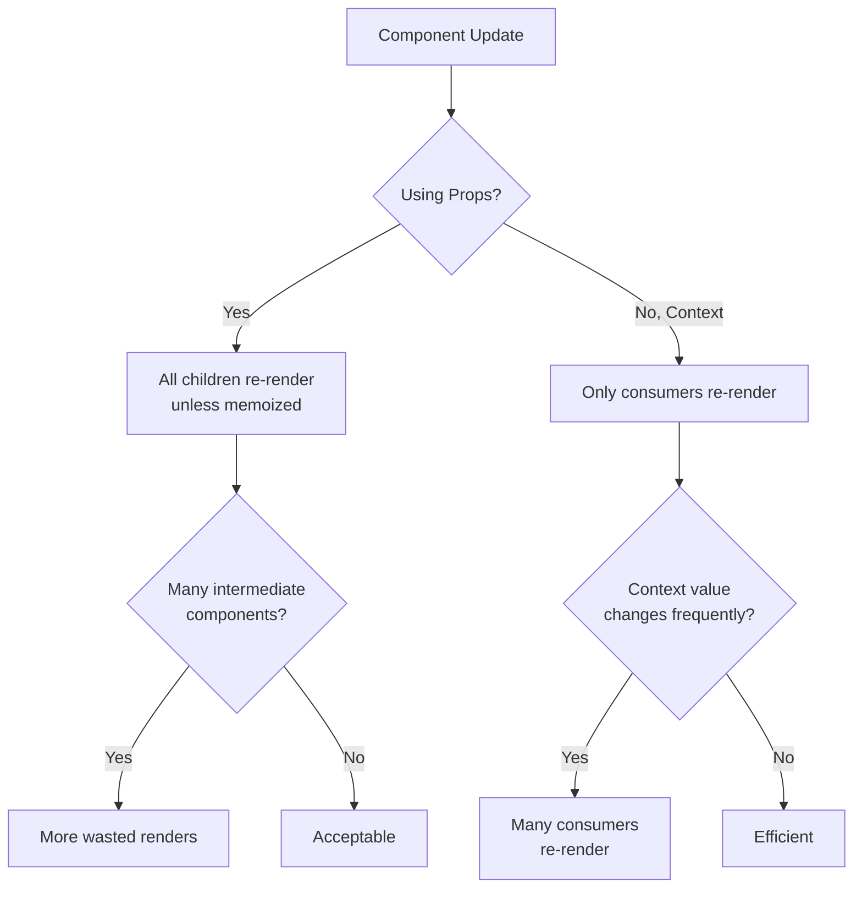

# Topic 05: Props - Component Communication

[← Previous: Components](./04_components.md) | [Back to Main](../README.md) | [Next: State →](./06_state.md)

---

## Table of Contents

1. [Overview](#overview)
2. [What are Props?](#what-are-props)
3. [Passing Props](#passing-props)
4. [Receiving Props](#receiving-props)
5. [Props Types and Validation](#props-types-and-validation)
6. [Default Props](#default-props)
7. [Children Prop](#children-prop)
8. [Prop Destructuring](#prop-destructuring)
9. [Spreading Props](#spreading-props)
10. [Props Best Practices](#props-best-practices)
11. [Common Patterns](#common-patterns)

---

## Overview

**Props** (short for "properties") are how components communicate with each other in React. They allow you to pass data from parent components to child components, creating a unidirectional data flow.

**What You'll Learn:**
- Understanding props and their purpose
- How to pass and receive props
- TypeScript typing for props
- Default values and validation
- The special `children` prop
- Best practices for prop design
- Common prop patterns and anti-patterns

**Prerequisites:**
- JavaScript objects and destructuring
- JSX syntax
- Basic React components
- TypeScript fundamentals (optional but recommended)

**Version Coverage:**
- React 19.2
- TypeScript 5.x

---

## What are Props?

### Core Concept

Props are **arguments** passed to React components. They work exactly like function parameters in JavaScript.

```tsx
// Props are like function arguments
function greet(name) {
  return `Hello, ${name}!`;
}

// Components receive props the same way
function Greeting(props) {
  return <h1>Hello, {props.name}!</h1>;
}

// Calling with arguments
greet('Alice');

// Rendering with props
<Greeting name="Alice" />
```

### Props Data Flow



### Key Characteristics

**1. Read-Only**
```tsx
// Props are immutable
function Button(props) {
  // ❌ Cannot modify props
  props.label = 'New Label'; // Error!
  
  // ✅ Can only read props
  return <button>{props.label}</button>;
}
```

**2. Unidirectional Flow**
```tsx
// Data flows from parent to child, never backwards
function Parent() {
  const data = 'Important Data';
  
  // Parent controls the data
  return <Child data={data} />;
}

function Child({ data }) {
  // Child can read but not modify
  return <div>{data}</div>;
}
```

**3. Passed as Attributes**
```tsx
// Props look like HTML attributes
<Component 
  name="Alice" 
  age={30} 
  isActive={true}
  onClick={() => alert('Clicked')}
/>
```

---

## Passing Props

### Basic Prop Passing

```tsx
function Parent() {
  return (
    <>
      {/* String props (no braces needed) */}
      <Greeting name="Alice" />
      
      {/* Number props (use braces) */}
      <Age value={30} />
      
      {/* Boolean props (use braces) */}
      <Button disabled={true} />
      
      {/* Boolean shorthand (true) */}
      <Button disabled />
      
      {/* Object props */}
      <UserCard user={{ name: 'Alice', age: 30 }} />
      
      {/* Array props */}
      <List items={['Apple', 'Banana', 'Cherry']} />
      
      {/* Function props */}
      <Button onClick={() => alert('Clicked')} />
    </>
  );
}
```

### Dynamic Props

```tsx
function Parent() {
  const userName = 'Alice';
  const userAge = 30;
  const isLoggedIn = true;
  
  return (
    <UserProfile 
      name={userName}
      age={userAge}
      loggedIn={isLoggedIn}
    />
  );
}
```

### Computed Props

```tsx
function Parent() {
  const user = {
    firstName: 'Alice',
    lastName: 'Johnson'
  };
  
  return (
    <Greeting 
      // Computed value
      fullName={`${user.firstName} ${user.lastName}`}
      
      // Conditional value
      status={user.isActive ? 'Active' : 'Inactive'}
      
      // Function result
      timestamp={Date.now()}
    />
  );
}
```

### Passing Multiple Props

```tsx
function Parent() {
  return (
    <UserCard
      name="Alice"
      age={30}
      email="alice@example.com"
      phone="+1234567890"
      address="123 Main St"
      city="New York"
      country="USA"
      isActive={true}
      role="Admin"
    />
  );
}
```

---

## Receiving Props

### Props Object

```tsx
// Receive props as object
function Greeting(props) {
  return <h1>Hello, {props.name}!</h1>;
}

// Props object contains all passed attributes
<Greeting name="Alice" age={30} />
// props = { name: 'Alice', age: 30 }
```

### Destructuring Props

```tsx
// Destructure in function parameter
function Greeting({ name, age }) {
  return (
    <div>
      <h1>Hello, {name}!</h1>
      <p>Age: {age}</p>
    </div>
  );
}

// Equivalent to:
function Greeting(props) {
  const { name, age } = props;
  return (
    <div>
      <h1>Hello, {name}!</h1>
      <p>Age: {age}</p>
    </div>
  );
}
```

### Destructuring with Default Values

```tsx
// Provide defaults during destructuring
function Button({ 
  label = 'Click me',
  variant = 'primary',
  disabled = false 
}) {
  return (
    <button 
      className={`btn-${variant}`}
      disabled={disabled}
    >
      {label}
    </button>
  );
}

// Usage
<Button />  // Uses all defaults
<Button label="Submit" />  // Only label overridden
```

### Rest Props

```tsx
// Capture remaining props
function Button({ label, variant, ...rest }) {
  return (
    <button 
      className={`btn-${variant}`}
      {...rest}  // Pass all other props to button
    >
      {label}
    </button>
  );
}

// Usage
<Button 
  label="Submit"
  variant="primary"
  disabled={true}
  onClick={() => {}}
  aria-label="Submit form"
/>
// rest = { disabled: true, onClick: ..., 'aria-label': '...' }
```

---

## Props Types and Validation

### TypeScript Props Interface

```tsx
// Define props interface
interface ButtonProps {
  label: string;
  onClick: () => void;
  variant?: 'primary' | 'secondary' | 'danger';
  disabled?: boolean;
}

function Button({ label, onClick, variant = 'primary', disabled = false }: ButtonProps) {
  return (
    <button 
      className={`btn-${variant}`}
      onClick={onClick}
      disabled={disabled}
    >
      {label}
    </button>
  );
}

// Usage with type checking
<Button label="Submit" onClick={() => {}} />  // ✅ Valid
<Button label={123} onClick={() => {}} />     // ❌ Type error
<Button label="Submit" />                      // ❌ Missing onClick
```

### Complex Prop Types

```tsx
// User object prop
interface User {
  id: number;
  name: string;
  email: string;
  role: 'admin' | 'user' | 'guest';
}

interface UserCardProps {
  user: User;
  onEdit: (user: User) => void;
  onDelete: (id: number) => void;
}

function UserCard({ user, onEdit, onDelete }: UserCardProps) {
  return (
    <div>
      <h2>{user.name}</h2>
      <p>{user.email}</p>
      <button onClick={() => onEdit(user)}>Edit</button>
      <button onClick={() => onDelete(user.id)}>Delete</button>
    </div>
  );
}
```

### Optional vs Required Props

```tsx
interface ComponentProps {
  // Required props
  id: number;
  name: string;
  
  // Optional props (using ?)
  description?: string;
  tags?: string[];
  
  // Optional with specific type
  metadata?: Record<string, any>;
  
  // Optional callback
  onUpdate?: (data: any) => void;
}

function Component({ 
  id, 
  name, 
  description, 
  tags = [],  // Default for optional
  onUpdate 
}: ComponentProps) {
  return (
    <div>
      <h1>{name}</h1>
      {description && <p>{description}</p>}
      {tags.length > 0 && <TagList tags={tags} />}
    </div>
  );
}
```

### Union and Literal Types

```tsx
// Literal types for specific values
interface AlertProps {
  message: string;
  type: 'success' | 'warning' | 'error' | 'info';
  dismissible?: boolean;
}

function Alert({ message, type, dismissible = true }: AlertProps) {
  return (
    <div className={`alert-${type}`}>
      {message}
      {dismissible && <button>×</button>}
    </div>
  );
}

// Type-safe usage
<Alert message="Success!" type="success" />      // ✅
<Alert message="Error!" type="danger" />         // ❌ Type error
```

### Generic Props

```tsx
// Generic component for any list type
interface ListProps<T> {
  items: T[];
  renderItem: (item: T, index: number) => React.ReactNode;
  keyExtractor: (item: T) => string | number;
}

function List<T>({ items, renderItem, keyExtractor }: ListProps<T>) {
  return (
    <ul>
      {items.map((item, index) => (
        <li key={keyExtractor(item)}>
          {renderItem(item, index)}
        </li>
      ))}
    </ul>
  );
}

// Usage with specific types
interface User {
  id: number;
  name: string;
}

<List<User>
  items={users}
  renderItem={(user) => <span>{user.name}</span>}
  keyExtractor={(user) => user.id}
/>
```

---

## Default Props

### Modern Default Props (Recommended)

```tsx
// Using default parameters (modern approach)
interface ButtonProps {
  label: string;
  variant?: 'primary' | 'secondary';
  size?: 'small' | 'medium' | 'large';
  disabled?: boolean;
}

function Button({ 
  label,
  variant = 'primary',
  size = 'medium',
  disabled = false
}: ButtonProps) {
  return (
    <button className={`btn-${variant} btn-${size}`} disabled={disabled}>
      {label}
    </button>
  );
}

// Usage
<Button label="Click" />  // Uses defaults
<Button label="Click" variant="secondary" size="large" />
```

### Legacy Default Props

```tsx
// Class component style (legacy)
function Button({ label, variant, size }: ButtonProps) {
  return (
    <button className={`btn-${variant} btn-${size}`}>
      {label}
    </button>
  );
}

Button.defaultProps = {
  variant: 'primary',
  size: 'medium'
};

// Note: defaultProps still works but default parameters are preferred
```

### Conditional Defaults

```tsx
function UserProfile({ user, showEmail = true, showPhone = false }) {
  return (
    <div>
      <h2>{user.name}</h2>
      {showEmail && <p>Email: {user.email}</p>}
      {showPhone && user.phone && <p>Phone: {user.phone}</p>}
    </div>
  );
}
```

---

## Children Prop

### Basic Children

```tsx
// Children is a special prop
function Card({ children }) {
  return (
    <div className="card">
      {children}
    </div>
  );
}

// Usage
<Card>
  <h2>Title</h2>
  <p>Content goes here</p>
</Card>
```

### Typing Children

```tsx
// TypeScript children types
interface CardProps {
  children: React.ReactNode;  // Any renderable content
}

interface StrictCardProps {
  children: React.ReactElement;  // Only React elements
}

interface MultipleChildrenProps {
  children: React.ReactElement[];  // Array of elements
}

interface StringChildrenProps {
  children: string;  // Only strings
}

// Usage
function Card({ children }: CardProps) {
  return <div className="card">{children}</div>;
}
```

### Children Patterns

```tsx
// 1. Children as render target
function Container({ children }) {
  return <div className="container">{children}</div>;
}

// 2. Children with additional content
function Panel({ title, children }) {
  return (
    <div className="panel">
      <div className="panel-header">{title}</div>
      <div className="panel-body">{children}</div>
    </div>
  );
}

// 3. Conditional children
function Collapsible({ isOpen, children }) {
  return (
    <div className="collapsible">
      {isOpen && children}
    </div>
  );
}

// 4. Children as function (render props)
function DataProvider({ children, data }) {
  return children(data);
}

// Usage
<DataProvider data={users}>
  {(data) => <UserList users={data} />}
</DataProvider>
```

### Manipulating Children

```tsx
// Using React.Children utilities
function List({ children }) {
  const items = React.Children.toArray(children);
  
  return (
    <ul>
      {items.map((child, index) => (
        <li key={index}>{child}</li>
      ))}
    </ul>
  );
}

// Cloning children with additional props
function EnhancedList({ children }) {
  return (
    <>
      {React.Children.map(children, (child, index) => {
        if (React.isValidElement(child)) {
          return React.cloneElement(child, {
            index: index,
            enhanced: true
          });
        }
        return child;
      })}
    </>
  );
}
```

---

## Prop Destructuring

### Component-Level Destructuring

```tsx
// Destructure in function signature
function UserCard({ name, email, age, isActive }) {
  return (
    <div>
      <h2>{name}</h2>
      <p>{email}</p>
      <p>Age: {age}</p>
      {isActive && <span>Active</span>}
    </div>
  );
}
```

### Nested Destructuring

```tsx
// Destructure nested objects
function UserCard({ 
  user: { name, email, address: { city, country } },
  onEdit
}) {
  return (
    <div>
      <h2>{name}</h2>
      <p>{email}</p>
      <p>{city}, {country}</p>
      <button onClick={onEdit}>Edit</button>
    </div>
  );
}

// Usage
<UserCard 
  user={{
    name: 'Alice',
    email: 'alice@example.com',
    address: { city: 'New York', country: 'USA' }
  }}
  onEdit={() => {}}
/>
```

### Aliasing Props

```tsx
// Rename props during destructuring
function Button({ 
  label: buttonText,  // Rename label to buttonText
  onClick: handleClick  // Rename onClick to handleClick
}) {
  return (
    <button onClick={handleClick}>
      {buttonText}
    </button>
  );
}
```

### Destructuring with TypeScript

```tsx
interface Props {
  user: {
    name: string;
    email: string;
  };
  settings: {
    theme: string;
    language: string;
  };
}

function Component({ 
  user: { name, email },
  settings: { theme, language }
}: Props) {
  return (
    <div className={theme}>
      <h1>{name}</h1>
      <p>{email}</p>
      <p>Language: {language}</p>
    </div>
  );
}
```

---

## Spreading Props

### Basic Spreading

```tsx
// Spread object as props
function Parent() {
  const buttonProps = {
    label: 'Click me',
    variant: 'primary',
    disabled: false,
    onClick: () => alert('Clicked')
  };
  
  return <Button {...buttonProps} />;
}

// Equivalent to:
<Button 
  label="Click me"
  variant="primary"
  disabled={false}
  onClick={() => alert('Clicked')}
/>
```

### Spreading with Overrides

```tsx
function Parent() {
  const defaultProps = {
    variant: 'primary',
    size: 'medium',
    disabled: false
  };
  
  return (
    <>
      {/* Use defaults */}
      <Button {...defaultProps} label="Default" />
      
      {/* Override specific props */}
      <Button {...defaultProps} label="Large" size="large" />
      
      {/* Override comes after spread */}
      <Button {...defaultProps} variant="secondary" label="Secondary" />
    </>
  );
}
```

### Forwarding Props

```tsx
// Wrapper component that forwards all props
function EnhancedButton({ children, ...props }) {
  return (
    <button 
      className="enhanced-btn"
      {...props}  // Forward all other props
    >
      {children}
    </button>
  );
}

// Usage - all props forwarded to underlying button
<EnhancedButton
  onClick={() => {}}
  disabled={false}
  aria-label="Submit"
  data-testid="submit-btn"
>
  Submit
</EnhancedButton>
```

### Spreading with TypeScript

```tsx
interface ButtonProps extends React.ButtonHTMLAttributes<HTMLButtonElement> {
  variant?: 'primary' | 'secondary';
}

function Button({ variant = 'primary', children, ...props }: ButtonProps) {
  return (
    <button 
      className={`btn-${variant}`}
      {...props}  // TypeScript knows these are valid button props
    >
      {children}
    </button>
  );
}
```

---

## Props Best Practices

### 1. Keep Props Minimal

```tsx
// ❌ Too many props
function UserCard({
  firstName,
  lastName,
  email,
  phone,
  address,
  city,
  state,
  zip,
  country,
  age,
  gender,
  occupation
}) {
  // ...
}

// ✅ Group related data
function UserCard({ user, address }) {
  // ...
}
```

### 2. Use Descriptive Names

```tsx
// ❌ Unclear naming
function Button({ txt, fn, flg }) {
  return <button onClick={fn} disabled={flg}>{txt}</button>;
}

// ✅ Clear, descriptive names
function Button({ label, onClick, disabled }) {
  return <button onClick={onClick} disabled={disabled}>{label}</button>;
}
```

### 3. Avoid Prop Drilling

```tsx
// ❌ Prop drilling through multiple levels
function App() {
  const user = useUser();
  return <Layout user={user} />;
}

function Layout({ user }) {
  return <Sidebar user={user} />;
}

function Sidebar({ user }) {
  return <UserMenu user={user} />;
}

function UserMenu({ user }) {
  return <div>{user.name}</div>;
}

// ✅ Use Context or composition
function App() {
  const user = useUser();
  return (
    <Layout 
      sidebar={<UserMenu user={user} />}
    >
      <MainContent />
    </Layout>
  );
}
```

### 4. Validate Props with TypeScript

```tsx
// ✅ Strong typing prevents errors
interface Props {
  count: number;
  onIncrement: () => void;
  onDecrement: () => void;
}

function Counter({ count, onIncrement, onDecrement }: Props) {
  return (
    <div>
      <button onClick={onDecrement}>-</button>
      <span>{count}</span>
      <button onClick={onIncrement}>+</button>
    </div>
  );
}

// Type errors caught at compile time
<Counter count="10" onIncrement={() => {}} />  // ❌ count must be number
<Counter count={10} />  // ❌ Missing required props
```

### 5. Use Callback Props for Events

```tsx
// ✅ Prefix event handlers with 'on'
interface FormProps {
  onSubmit: (data: FormData) => void;
  onChange: (field: string, value: any) => void;
  onCancel: () => void;
}

function Form({ onSubmit, onChange, onCancel }: FormProps) {
  // Component implementation
}
```

### 6. Avoid Boolean Traps

```tsx
// ❌ Boolean trap - unclear meaning
<Modal show={true} close={false} />

// ✅ Clear, explicit naming
<Modal isOpen={true} isDismissible={false} />

// ✅ Even better with enums
<Modal visibility="visible" closeButton="hidden" />
```

---

## Common Patterns

### Controlled Component Pattern

```tsx
// Parent controls child's state via props
function Parent() {
  const [value, setValue] = useState('');
  
  return (
    <Input 
      value={value}
      onChange={(e) => setValue(e.target.value)}
    />
  );
}

function Input({ value, onChange }) {
  return <input value={value} onChange={onChange} />;
}
```

### Render Props Pattern

```tsx
interface MouseTrackerProps {
  render: (position: { x: number; y: number }) => React.ReactNode;
}

function MouseTracker({ render }: MouseTrackerProps) {
  const [position, setPosition] = useState({ x: 0, y: 0 });
  
  useEffect(() => {
    const handleMove = (e: MouseEvent) => {
      setPosition({ x: e.clientX, y: e.clientY });
    };
    window.addEventListener('mousemove', handleMove);
    return () => window.removeEventListener('mousemove', handleMove);
  }, []);
  
  return <>{render(position)}</>;
}

// Usage
<MouseTracker 
  render={({ x, y }) => <p>Mouse at: {x}, {y}</p>}
/>
```

### Component Composition

```tsx
// Flexible composition via props
function Layout({ header, sidebar, content, footer }) {
  return (
    <div className="layout">
      <header>{header}</header>
      <div className="main">
        <aside>{sidebar}</aside>
        <main>{content}</main>
      </div>
      <footer>{footer}</footer>
    </div>
  );
}

// Usage
<Layout
  header={<Header />}
  sidebar={<Sidebar />}
  content={<MainContent />}
  footer={<Footer />}
/>
```

### Props with State Management

```tsx
// Combining props with internal state
function SearchInput({ 
  value,           // Controlled from parent
  onChange,        // Notify parent of changes
  placeholder,     // Configuration
  debounceMs = 300 // Optional config with default
}) {
  const [localValue, setLocalValue] = useState(value);
  
  useEffect(() => {
    const timer = setTimeout(() => {
      onChange(localValue);
    }, debounceMs);
    
    return () => clearTimeout(timer);
  }, [localValue, debounceMs, onChange]);
  
  return (
    <input
      value={localValue}
      onChange={(e) => setLocalValue(e.target.value)}
      placeholder={placeholder}
    />
  );
}
```

---

## Higher-Order Thinking FAQs

### 1. Why are props immutable, and what design benefits does this constraint provide?

**Deep Answer:**

Props immutability is a fundamental design choice that enables React's **predictable rendering model** and **performance optimizations**.

**The Immutability Constraint:**

```tsx
function Component(props) {
  // ❌ This is not allowed
  props.value = 'new value';
  
  // ✅ Props are read-only
  console.log(props.value);
}
```

**Why Immutability Matters:**

1. **Predictable Data Flow:**
```tsx
function Parent() {
  const [count, setCount] = useState(0);
  
  return (
    <>
      <Display value={count} />
      <button onClick={() => setCount(count + 1)}>
        Increment
      </button>
    </>
  );
}

// If Display could modify props:
function Display({ value }) {
  value++; // ❌ If this were allowed...
  return <div>{value}</div>;
}

// The parent's count would be out of sync with Display!
// Parent thinks count is 0, but Display shows 1
```

2. **Enables Pure Component Optimization:**
```tsx
// React can optimize with shallow comparison
const MemoizedComponent = React.memo(function Component({ data }) {
  // Expensive rendering
  return <ExpensiveChart data={data} />;
});

// React can skip re-render if props.data === prevProps.data
// This only works because props can't be mutated!
```

3. **Time-Travel Debugging:**
```tsx
// Redux DevTools can replay actions because props are immutable
// Each render is a pure function of props
// props1 → render1
// props2 → render2  
// We can go back to props1 and get exact same render1
```

4. **Concurrent Rendering:**
```tsx
// React 18+ can pause, abort, or restart renders
// This only works if render functions are pure
// Mutable props would break this
```

**Deep Implication:**

Immutable props force you to think in terms of **data flow** rather than **data mutation**. This leads to more predictable, debuggable, and optimizable code. The constraint isn't a limitation—it's a design feature that enables React's power.

### 2. When should you pass callbacks via props versus using Context, and what are the performance implications?

**Deep Answer:**

The choice between props and Context involves tradeoffs between **simplicity** and **performance**.

**Props Approach:**

```tsx
// Simple, direct, but requires passing through intermediate components
function App() {
  const handleUpdate = () => { /* ... */ };
  
  return (
    <Layout onUpdate={handleUpdate}>
      <Dashboard onUpdate={handleUpdate}>
        <Widget onUpdate={handleUpdate} />
      </Dashboard>
    </Layout>
  );
}

// Layout doesn't use onUpdate, just passes it down
function Layout({ children, onUpdate }) {
  return <div>{children}</div>; // prop drilling
}
```

**Context Approach:**

```tsx
// No prop drilling, but different performance characteristics
const UpdateContext = createContext();

function App() {
  const handleUpdate = useCallback(() => { /* ... */ }, []);
  
  return (
    <UpdateContext.Provider value={handleUpdate}>
      <Layout>
        <Dashboard>
          <Widget />
        </Dashboard>
      </Layout>
    </UpdateContext.Provider>
  );
}

function Widget() {
  const handleUpdate = useContext(UpdateContext);
  return <button onClick={handleUpdate}>Update</button>;
}
```

**Performance Analysis:**



**Decision Matrix:**

| Scenario | Use Props | Use Context |
|----------|-----------|-------------|
| 1-2 levels deep | ✅ Props | ❌ Overkill |
| 3+ levels deep | ⚠️ Prop drilling | ✅ Context |
| High-frequency updates | ✅ Props (targeted) | ❌ All consumers update |
| Low-frequency updates | Either | ✅ Context |
| Callback never changes | Either | ✅ Context + useCallback |

**Best of Both Worlds:**

```tsx
// Composition pattern - avoids both prop drilling and Context
function App() {
  const handleUpdate = () => { /* ... */ };
  
  return (
    <Layout
      sidebar={<Widget onUpdate={handleUpdate} />}
    >
      <Dashboard />
    </Layout>
  );
}

// Layout doesn't need to know about onUpdate
function Layout({ sidebar, children }) {
  return (
    <div>
      <aside>{sidebar}</aside>
      <main>{children}</main>
    </div>
  );
}
```

**Deep Implication:**

Neither approach is universally better. Props are simpler and more explicit but can lead to drilling. Context is elegant for deep hierarchies but can cause unnecessary re-renders. The best solution often combines both: use composition to avoid drilling, and Context only for truly global concerns (theme, auth, etc.).

### 3. How do generic props in TypeScript enable reusable components, and what are the tradeoffs versus using `any`?

**Deep Answer:**

Generic props provide **type safety with flexibility**, while `any` provides **flexibility without safety**.

**The `any` Approach (Weak):**

```tsx
// ❌ Loses all type safety
interface ListProps {
  items: any[];
  renderItem: (item: any) => React.ReactNode;
}

function List({ items, renderItem }: ListProps) {
  return (
    <ul>
      {items.map((item, index) => (
        <li key={index}>{renderItem(item)}</li>
      ))}
    </ul>
  );
}

// Usage - no type checking!
<List
  items={users}
  renderItem={(item) => {
    // item is any - no autocomplete, no type errors
    return <span>{item.nameeee}</span>; // Typo not caught!
  }}
/>
```

**The Generic Approach (Strong):**

```tsx
// ✅ Type-safe and flexible
interface ListProps<T> {
  items: T[];
  renderItem: (item: T) => React.ReactNode;
}

function List<T
