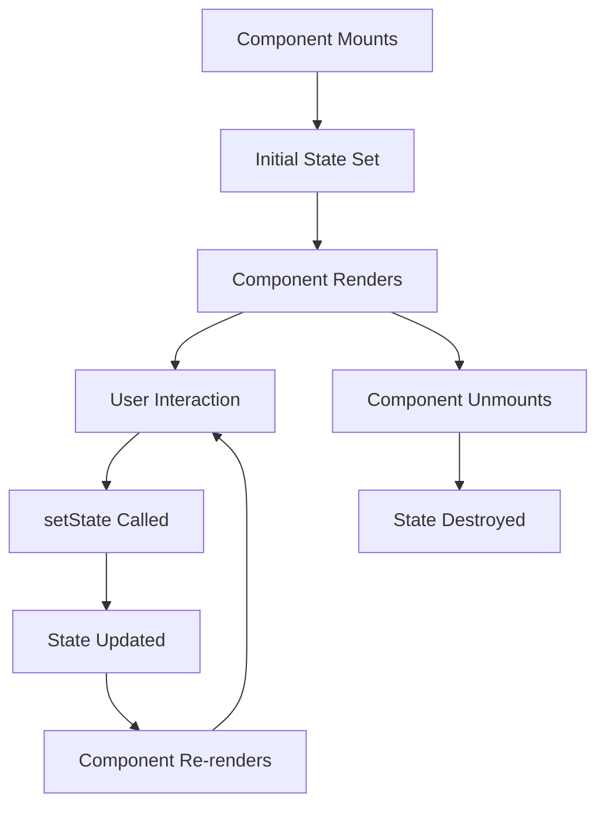
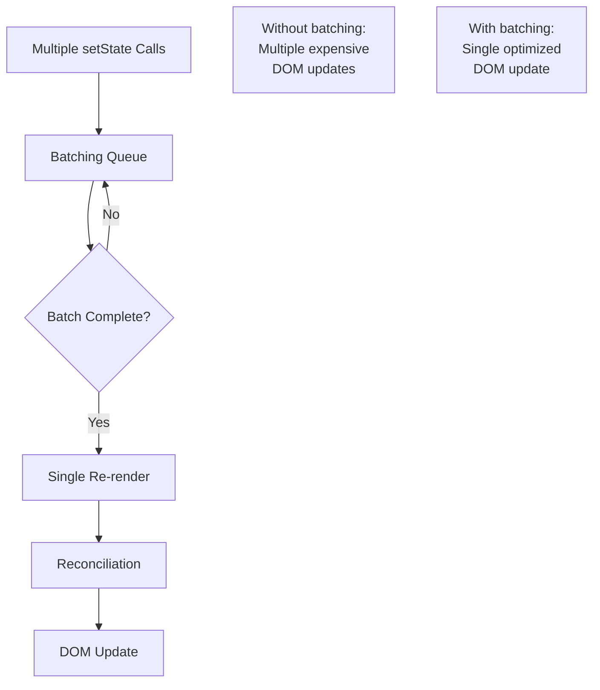

# Topic 06: State - Component Memory

[← Previous: Props](./05_props.md) | [Back to Main](../README.md) | [Next: Events →](./07_events.md)

---

## Table of Contents

1. [Overview](#overview)
2. [What is State?](#what-is-state)
3. [useState Hook](#usestate-hook)
4. [State Updates](#state-updates)
5. [State vs Props](#state-vs-props)
6. [Multiple State Variables](#multiple-state-variables)
7. [State Objects and Arrays](#state-objects-and-arrays)
8. [State Lifting](#state-lifting)
9. [Derived State](#derived-state)
10. [State Best Practices](#state-best-practices)
11. [Common Patterns](#common-patterns)

---

## Overview

**State** is how React components remember information between renders. Unlike props (which are passed from parent components), state is owned and managed by the component itself.

**What You'll Learn:**
- Understanding state and when to use it
- useState Hook for managing state
- How to update state correctly
- State vs Props differences
- Managing complex state (objects, arrays)
- State lifting and sharing between components
- Best practices for state management

**Prerequisites:**
- JavaScript ES6+ (const/let, destructuring)
- React components and props
- JSX syntax

**Version Coverage:**
- React 19.2
- TypeScript 5.x

---

## What is State?

### Core Concept

State is **component-specific memory** that persists between re-renders. When state changes, React re-renders the component to reflect the new state.

```tsx
// Without state - this doesn't work!
function Counter() {
  let count = 0;  // ❌ Resets to 0 on every render
  
  return (
    <>
      <p>Count: {count}</p>
      <button onClick={() => count++}>Increment</button>
    </>
  );
}

// With state - persists between renders!
function Counter() {
  const [count, setCount] = useState(0);  // ✅ Remembers value
  
  return (
    <>
      <p>Count: {count}</p>
      <button onClick={() => setCount(count + 1)}>Increment</button>
    </>
  );
}
```

### State Lifecycle



### When to Use State

**Use state for:**
- ✅ User input (form fields, toggles)
- ✅ UI state (modals, tabs, dropdowns)
- ✅ Data fetched from APIs
- ✅ Timers and intervals
- ✅ Any data that changes over time

**Don't use state for:**
- ❌ Values that can be calculated from props or other state
- ❌ Values that don't affect rendering
- ❌ Props passed from parent (use props directly)

---

## useState Hook

### Basic Syntax

```tsx
import { useState } from 'react';

function Component() {
  // [currentValue, updaterFunction] = useState(initialValue)
  const [state, setState] = useState(initialValue);
  
  return <div>{state}</div>;
}
```

### Simple State Examples

```tsx
// Number state
function Counter() {
  const [count, setCount] = useState(0);
  
  return (
    <>
      <p>Count: {count}</p>
      <button onClick={() => setCount(count + 1)}>+</button>
    </>
  );
}

// String state
function Input() {
  const [text, setText] = useState('');
  
  return (
    <input 
      value={text}
      onChange={(e) => setText(e.target.value)}
    />
  );
}

// Boolean state
function Toggle() {
  const [isOn, setIsOn] = useState(false);
  
  return (
    <button onClick={() => setIsOn(!isOn)}>
      {isOn ? 'ON' : 'OFF'}
    </button>
  );
}

// Array state
function List() {
  const [items, setItems] = useState<string[]>([]);
  
  return (
    <ul>
      {items.map(item => <li key={item}>{item}</li>)}
    </ul>
  );
}

// Object state
function User() {
  const [user, setUser] = useState({ name: '', age: 0 });
  
  return <div>{user.name}</div>;
}
```

### TypeScript with useState

```tsx
// Explicit type annotation
const [count, setCount] = useState<number>(0);

// Type inference (preferred when possible)
const [name, setName] = useState('');  // string
const [age, setAge] = useState(0);     // number
const [isActive, setIsActive] = useState(false);  // boolean

// Complex types
interface User {
  id: number;
  name: string;
  email: string;
}

const [user, setUser] = useState<User>({
  id: 1,
  name: 'Alice',
  email: 'alice@example.com'
});

// Optional/nullable types
const [user, setUser] = useState<User | null>(null);

// Array with explicit type
const [items, setItems] = useState<string[]>([]);
const [users, setUsers] = useState<User[]>([]);
```

### Lazy Initialization

```tsx
// ❌ Expensive function runs on every render
function Component() {
  const [state, setState] = useState(expensiveComputation());
  // expensiveComputation() called every render!
}

// ✅ Lazy initialization - function runs only once
function Component() {
  const [state, setState] = useState(() => expensiveComputation());
  // expensiveComputation() called only on initial render
}

// Example: Reading from localStorage
function Component() {
  const [data, setData] = useState(() => {
    const saved = localStorage.getItem('myData');
    return saved ? JSON.parse(saved) : defaultValue;
  });
}
```

---

## State Updates

### Basic Updates

```tsx
function Counter() {
  const [count, setCount] = useState(0);
  
  // Direct value
  const increment = () => {
    setCount(count + 1);
  };
  
  // Or inline
  return (
    <button onClick={() => setCount(count + 1)}>
      Count: {count}
    </button>
  );
}
```

### Functional Updates

```tsx
// Problem: Multiple updates in same render
function Counter() {
  const [count, setCount] = useState(0);
  
  const handleClick = () => {
    setCount(count + 1);
    setCount(count + 1);
    setCount(count + 1);
    // Only increments by 1, not 3!
    // All three use the same count value
  };
}

// Solution: Functional updates
function Counter() {
  const [count, setCount] = useState(0);
  
  const handleClick = () => {
    setCount(prev => prev + 1);
    setCount(prev => prev + 1);
    setCount(prev => prev + 1);
    // Correctly increments by 3!
  };
}
```

### Batching Updates

```tsx
function Component() {
  const [count, setCount] = useState(0);
  const [flag, setFlag] = useState(false);
  
  const handleClick = () => {
    // React 18+: Automatically batched (single re-render)
    setCount(count + 1);
    setFlag(!flag);
    // Only one re-render happens
  };
  
  // Even in async code (React 18+)
  const handleAsync = async () => {
    await fetchData();
    setCount(count + 1);  // Batched
    setFlag(!flag);       // Batched
    // Single re-render
  };
}
```

### State Updates are Asynchronous

```tsx
function Counter() {
  const [count, setCount] = useState(0);
  
  const handleClick = () => {
    setCount(count + 1);
    console.log(count);  // Still shows old value!
    // State updates are asynchronous
  };
  
  // Use useEffect to react to state changes
  useEffect(() => {
    console.log('Count changed to:', count);
  }, [count]);
}
```

---

## State vs Props

### Key Differences

| Aspect | Props | State |
|--------|-------|-------|
| **Ownership** | Passed from parent | Owned by component |
| **Mutability** | Immutable (read-only) | Mutable (via setState) |
| **Changes** | Parent re-renders | Component re-renders |
| **Purpose** | Configure components | Remember information |
| **Flow** | Parent → Child | Internal only |

### Props and State Together

```tsx
// Parent component (manages state)
function Parent() {
  const [count, setCount] = useState(0);
  
  return (
    <Child 
      count={count}                           // State as prop
      onIncrement={() => setCount(count + 1)} // Function as prop
    />
  );
}

// Child component (receives props)
function Child({ count, onIncrement }) {
  return (
    <>
      <p>Count: {count}</p>
      <button onClick={onIncrement}>Increment</button>
    </>
  );
}
```

### When Props Become State

```tsx
// Initialize state from props
function Counter({ initialCount = 0 }) {
  const [count, setCount] = useState(initialCount);
  
  return (
    <>
      <p>Count: {count}</p>
      <button onClick={() => setCount(count + 1)}>+</button>
    </>
  );
}

// ⚠️ Note: Changes to initialCount prop won't update state
// State is only initialized once on mount
```

### Controlled vs Uncontrolled

```tsx
// Controlled: Parent manages state
function ControlledInput({ value, onChange }) {
  return (
    <input 
      value={value}
      onChange={onChange}
    />
  );
}

// Uncontrolled: Component manages own state
function UncontrolledInput() {
  const [value, setValue] = useState('');
  
  return (
    <input 
      value={value}
      onChange={(e) => setValue(e.target.value)}
    />
  );
}
```

---

## Multiple State Variables

### Separate State Variables

```tsx
function Form() {
  // Multiple independent state variables
  const [name, setName] = useState('');
  const [email, setEmail] = useState('');
  const [age, setAge] = useState(0);
  const [isSubscribed, setIsSubscribed] = useState(false);
  
  return (
    <form>
      <input value={name} onChange={(e) => setName(e.target.value)} />
      <input value={email} onChange={(e) => setEmail(e.target.value)} />
      <input value={age} onChange={(e) => setAge(Number(e.target.value))} />
      <input 
        type="checkbox" 
        checked={isSubscribed} 
        onChange={(e) => setIsSubscribed(e.target.checked)} 
      />
    </form>
  );
}
```

### When to Split vs Combine

```tsx
// ✅ Split: Independent values
const [name, setName] = useState('');
const [email, setEmail] = useState('');
// Name and email are independent

// ✅ Combine: Related values that change together
const [position, setPosition] = useState({ x: 0, y: 0 });
// x and y always change together

// ✅ Split: Different update patterns
const [isLoading, setIsLoading] = useState(false);
const [data, setData] = useState(null);
// Loading and data have different lifecycles

// ❌ Over-combining: Unrelated values
const [state, setState] = useState({
  name: '',
  email: '',
  theme: 'dark',
  sidebarOpen: false,
  notifications: []
});
// These are unrelated, should be split
```

---

## State Objects and Arrays

### Updating Objects

```tsx
function UserProfile() {
  const [user, setUser] = useState({
    name: 'Alice',
    age: 30,
    email: 'alice@example.com'
  });
  
  // ❌ Wrong: Mutates existing object
  const updateName = (newName) => {
    user.name = newName;  // Don't do this!
    setUser(user);
  };
  
  // ✅ Correct: Create new object
  const updateName = (newName) => {
    setUser({
      ...user,
      name: newName
    });
  };
  
  // ✅ Multiple fields
  const updateUser = () => {
    setUser({
      ...user,
      name: 'Bob',
      age: 31
    });
  };
  
  // ✅ Nested objects
  const [user, setUser] = useState({
    name: 'Alice',
    address: {
      city: 'New York',
      country: 'USA'
    }
  });
  
  const updateCity = (newCity) => {
    setUser({
      ...user,
      address: {
        ...user.address,
        city: newCity
      }
    });
  };
}
```

### Updating Arrays

```tsx
function TodoList() {
  const [todos, setTodos] = useState<string[]>([]);
  
  // Add item
  const addTodo = (text: string) => {
    setTodos([...todos, text]);
  };
  
  // Remove item
  const removeTodo = (index: number) => {
    setTodos(todos.filter((_, i) => i !== index));
  };
  
  // Update item
  const updateTodo = (index: number, newText: string) => {
    setTodos(todos.map((todo, i) => 
      i === index ? newText : todo
    ));
  };
  
  // Insert at beginning
  const addFirst = (text: string) => {
    setTodos([text, ...todos]);
  };
  
  // Clear all
  const clearTodos = () => {
    setTodos([]);
  };
}
```

### Array of Objects

```tsx
interface Todo {
  id: number;
  text: string;
  completed: boolean;
}

function TodoList() {
  const [todos, setTodos] = useState<Todo[]>([]);
  
  // Add
  const addTodo = (text: string) => {
    const newTodo: Todo = {
      id: Date.now(),
      text,
      completed: false
    };
    setTodos([...todos, newTodo]);
  };
  
  // Toggle completed
  const toggleTodo = (id: number) => {
    setTodos(todos.map(todo =>
      todo.id === id
        ? { ...todo, completed: !todo.completed }
        : todo
    ));
  };
  
  // Delete
  const deleteTodo = (id: number) => {
    setTodos(todos.filter(todo => todo.id !== id));
  };
  
  // Update text
  const updateText = (id: number, newText: string) => {
    setTodos(todos.map(todo =>
      todo.id === id
        ? { ...todo, text: newText }
        : todo
    ));
  };
}
```

---

## State Lifting

### Sharing State Between Components

```tsx
// ❌ Problem: State in child, sibling can't access
function Parent() {
  return (
    <>
      <ChildA />  {/* Has state */}
      <ChildB />  {/* Needs that state */}
    </>
  );
}

// ✅ Solution: Lift state to common parent
function Parent() {
  const [sharedState, setSharedState] = useState('');
  
  return (
    <>
      <ChildA state={sharedState} setState={setSharedState} />
      <ChildB state={sharedState} />
    </>
  );
}

function ChildA({ state, setState }) {
  return <input value={state} onChange={(e) => setState(e.target.value)} />;
}

function ChildB({ state }) {
  return <p>Value: {state}</p>;
}
```

### Complete Example

```tsx
// Temperature converter
function TemperatureConverter() {
  const [celsius, setCelsius] = useState('');
  
  const handleCelsiusChange = (value: string) => {
    setCelsius(value);
  };
  
  const handleFahrenheitChange = (value: string) => {
    setCelsius(String((parseFloat(value) - 32) / 1.8));
  };
  
  const fahrenheit = celsius === '' 
    ? '' 
    : String(parseFloat(celsius) * 1.8 + 32);
  
  return (
    <div>
      <TemperatureInput
        scale="Celsius"
        temperature={celsius}
        onTemperatureChange={handleCelsiusChange}
      />
      <TemperatureInput
        scale="Fahrenheit"
        temperature={fahrenheit}
        onTemperatureChange={handleFahrenheitChange}
      />
    </div>
  );
}

function TemperatureInput({ scale, temperature, onTemperatureChange }) {
  return (
    <fieldset>
      <legend>Enter temperature in {scale}:</legend>
      <input
        value={temperature}
        onChange={(e) => onTemperatureChange(e.target.value)}
      />
    </fieldset>
  );
}
```

---

## Derived State

### Avoid Redundant State

```tsx
// ❌ Redundant state
function UserList({ users }) {
  const [filteredUsers, setFilteredUsers] = useState(users);
  const [searchTerm, setSearchTerm] = useState('');
  
  const handleSearch = (term) => {
    setSearchTerm(term);
    setFilteredUsers(users.filter(u => u.name.includes(term)));
  };
  
  // Problem: filteredUsers can get out of sync with users
}

// ✅ Derive from existing state/props
function UserList({ users }) {
  const [searchTerm, setSearchTerm] = useState('');
  
  // Computed during render
  const filteredUsers = users.filter(u => 
    u.name.toLowerCase().includes(searchTerm.toLowerCase())
  );
  
  return (
    <>
      <input 
        value={searchTerm}
        onChange={(e) => setSearchTerm(e.target.value)}
      />
      {filteredUsers.map(user => <div key={user.id}>{user.name}</div>)}
    </>
  );
}
```

### useMemo for Expensive Computations

```tsx
function ProductList({ products, category }) {
  const [sortOrder, setSortOrder] = useState('name');
  
  // ✅ Memoize expensive computation
  const sortedProducts = useMemo(() => {
    console.log('Sorting products...');
    return [...products]
      .filter(p => p.category === category)
      .sort((a, b) => a[sortOrder].localeCompare(b[sortOrder]));
  }, [products, category, sortOrder]);
  
  return (
    <>
      <select value={sortOrder} onChange={(e) => setSortOrder(e.target.value)}>
        <option value="name">Name</option>
        <option value="price">Price</option>
      </select>
      {sortedProducts.map(p => <div key={p.id}>{p.name}</div>)}
    </>
  );
}
```

---

## State Best Practices

### 1. Keep State Minimal

```tsx
// ❌ Storing derived values
function Component({ firstName, lastName }) {
  const [fullName, setFullName] = useState(`${firstName} ${lastName}`);
  
  // fullName can get out of sync!
}

// ✅ Compute derived values
function Component({ firstName, lastName }) {
  const fullName = `${firstName} ${lastName}`;
  // Always in sync
}
```

### 2. Don't Mirror Props in State

```tsx
// ❌ Mirroring props (except for initialization)
function Component({ initialColor }) {
  const [color, setColor] = useState(initialColor);
  
  // Problem: If initialColor prop changes, state doesn't update
}

// ✅ Use prop directly
function Component({ color }) {
  // Just use the prop
  return <div style={{ color }}>{/* ... */}</div>;
}

// ✅ Or make it truly controlled
function Component({ color, onColorChange }) {
  return (
    <input 
      value={color}
      onChange={(e) => onColorChange(e.target.value)}
    />
  );
}
```

### 3. Group Related State

```tsx
// ❌ Separate state for related values
const [x, setX] = useState(0);
const [y, setY] = useState(0);

const moveToCenter = () => {
  setX(50);  // Two state updates
  setY(50);
};

// ✅ Group related state
const [position, setPosition] = useState({ x: 0, y: 0 });

const moveToCenter = () => {
  setPosition({ x: 50, y: 50 });  // Single state update
};
```

### 4. Avoid Deep Nesting

```tsx
// ❌ Deeply nested state (hard to update)
const [state, setState] = useState({
  user: {
    profile: {
      address: {
        street: {
          name: 'Main St',
          number: 123
        }
      }
    }
  }
});

// Updating is painful!
setState({
  ...state,
  user: {
    ...state.user,
    profile: {
      ...state.user.profile,
      address: {
        ...state.user.profile.address,
        street: {
          ...state.user.profile.address.street,
          name: 'New St'
        }
      }
    }
  }
});

// ✅ Flatten state structure
const [streetName, setStreetName] = useState('Main St');
const [streetNumber, setStreetNumber] = useState(123);

// Easy to update!
setStreetName('New St');
```

### 5. Use Reducers for Complex State

```tsx
// When state logic gets complex, consider useReducer
type Action = 
  | { type: 'increment' }
  | { type: 'decrement' }
  | { type: 'reset' }
  | { type: 'set'; payload: number };

function reducer(state: number, action: Action) {
  switch (action.type) {
    case 'increment': return state + 1;
    case 'decrement': return state - 1;
    case 'reset': return 0;
    case 'set': return action.payload;
    default: return state;
  }
}

function Counter() {
  const [count, dispatch] = useReducer(reducer, 0);
  
  return (
    <>
      <p>Count: {count}</p>
      <button onClick={() => dispatch({ type: 'increment' })}>+</button>
      <button onClick={() => dispatch({ type: 'decrement' })}>-</button>
      <button onClick={() => dispatch({ type: 'reset' })}>Reset</button>
    </>
  );
}
```

---

## Common Patterns

### Form State Management

```tsx
function ContactForm() {
  const [formData, setFormData] = useState({
    name: '',
    email: '',
    message: ''
  });
  
  const handleChange = (e: React.ChangeEvent<HTMLInputElement | HTMLTextAreaElement>) => {
    const { name, value } = e.target;
    setFormData(prev => ({
      ...prev,
      [name]: value
    }));
  };
  
  const handleSubmit = (e: React.FormEvent) => {
    e.preventDefault();
    console.log(formData);
  };
  
  return (
    <form onSubmit={handleSubmit}>
      <input
        name="name"
        value={formData.name}
        onChange={handleChange}
      />
      <input
        name="email"
        value={formData.email}
        onChange={handleChange}
      />
      <textarea
        name="message"
        value={formData.message}
        onChange={handleChange}
      />
      <button type="submit">Submit</button>
    </form>
  );
}
```

### Toggle State

```tsx
function Component() {
  const [isOpen, setIsOpen] = useState(false);
  
  // Toggle pattern
  const toggle = () => setIsOpen(!isOpen);
  
  // Or with functional update
  const toggle = () => setIsOpen(prev => !prev);
  
  return (
    <>
      <button onClick={toggle}>
        {isOpen ? 'Close' : 'Open'}
      </button>
      {isOpen && <Modal onClose={toggle} />}
    </>
  );
}
```

### Counter with Min/Max

```tsx
function Counter({ min = 0, max = 10, initial = 0 }) {
  const [count, setCount] = useState(initial);
  
  const increment = () => {
    setCount(prev => Math.min(prev + 1, max));
  };
  
  const decrement = () => {
    setCount(prev => Math.max(prev - 1, min));
  };
  
  return (
    <>
      <button onClick={decrement} disabled={count <= min}>-</button>
      <span>{count}</span>
      <button onClick={increment} disabled={count >= max}>+</button>
    </>
  );
}
```

### Undo/Redo

```tsx
function useHistory<T>(initialValue: T) {
  const [index, setIndex] = useState(0);
  const [history, setHistory] = useState([initialValue]);
  
  const state = history[index];
  
  const set = (value: T) => {
    const newHistory = history.slice(0, index + 1);
    newHistory.push(value);
    setHistory(newHistory);
    setIndex(newHistory.length - 1);
  };
  
  const undo = () => {
    setIndex(Math.max(0, index - 1));
  };
  
  const redo = () => {
    setIndex(Math.min(history.length - 1, index + 1));
  };
  
  const canUndo = index > 0;
  const canRedo = index < history.length - 1;
  
  return { state, set, undo, redo, canUndo, canRedo };
}

// Usage
function TextEditor() {
  const { state: text, set: setText, undo, redo, canUndo, canRedo } = useHistory('');
  
  return (
    <>
      <button onClick={undo} disabled={!canUndo}>Undo</button>
      <button onClick={redo} disabled={!canRedo}>Redo</button>
      <textarea value={text} onChange={(e) => setText(e.target.value)} />
    </>
  );
}
```

---

## Higher-Order Thinking FAQs

### 1. Why are state updates asynchronous, and how does this enable React's performance optimizations?

**Deep Answer:**

State updates are asynchronous to enable **batching**, which is fundamental to React's performance model.

**The Synchronous Problem:**

```tsx
// If updates were synchronous...
function Component() {
  const [count, setCount] = useState(0);
  const [flag, setFlag] = useState(false);
  
  const handleClick = () => {
    setCount(count + 1);  // Re-render #1
    setFlag(!flag);       // Re-render #2
    // Two expensive re-renders!
  };
}
```

**Asynchronous Batching:**

```tsx
// With async updates (React's actual behavior)
function Component() {
  const [count, setCount] = useState(0);
  const [flag, setFlag] = useState(false);
  
  const handleClick = () => {
    setCount(count + 1);  // Queued
    setFlag(!flag);       // Queued
    // Both updates batched into single re-render!
  };
}
```

**Performance Benefits:**



**Deep Implications:**

1. **Stale Closures:**
```tsx
const handleClick = () => {
  setCount(count + 1);
  console.log(count);  // Still old value!
  // The closure captured the old count value
};
```

2. **Functional Updates Become Essential:**
```tsx
// ❌ Doesn't work as expected
const increment3Times = () => {
  setCount(count + 1);  // count + 1
  setCount(count + 1);  // count + 1 (same count!)
  setCount(count + 1);  // count + 1 (same count!)
  // Result: count + 1
};

// ✅ Works correctly
const increment3Times = () => {
  setCount(prev => prev + 1);  // prev + 1
  setCount(prev => prev + 1);  // (prev + 1) + 1
  setCount(prev => prev + 1);  // ((prev + 1) + 1) + 1
  // Result: count + 3
};
```

3. **React 18 Automatic Batching:**
```tsx
// Before React 18: Only batched in React event handlers
setTimeout(() => {
  setCount(count + 1);  // Re-render #1
  setFlag(!flag);       // Re-render #2
}, 1000);

// React 18+: Batched everywhere!
setTimeout(() => {
  setCount(count + 1);  // Batched
  setFlag(!flag);       // Batched
}, 1000);  // Single re-render
```

**Design Insight:**

Asynchronous state updates aren't a bug—they're a feature that enables React to optimize rendering performance. Understanding this is crucial for writing correct React code.

### 2. When should you split state into multiple useState calls versus combining into a single object, and how does this affect re-renders?

**Deep Answer:**

The decision
