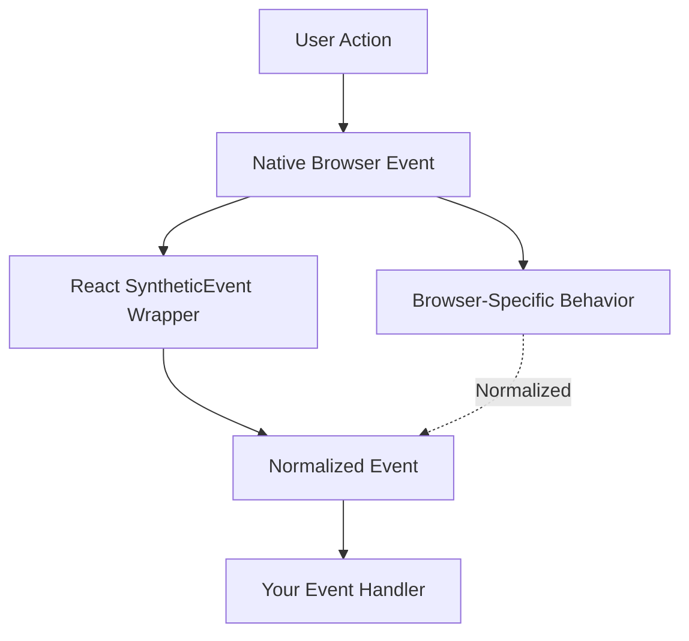
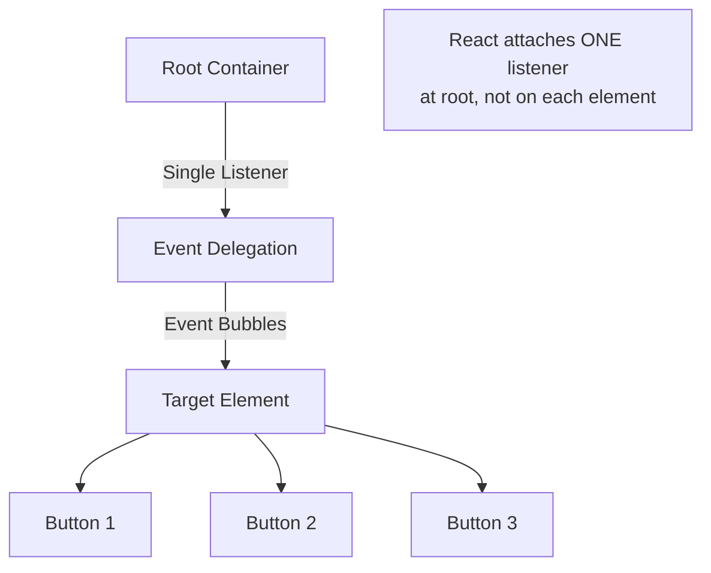
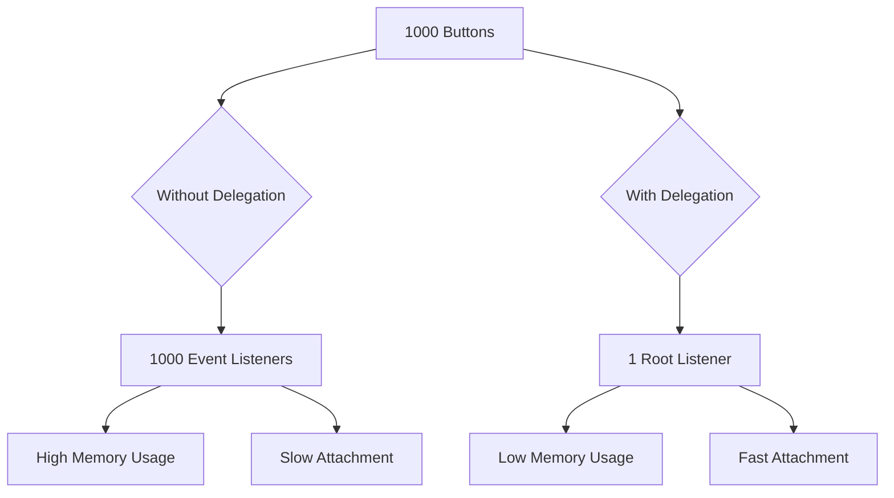

# Topic 07: Event Handling in React

[← Previous: State](./06_state.md) | [Back to Main](../README.md) | [Next: Conditional Rendering →](./08_conditional_rendering.md)

---

## Table of Contents

1. [Overview](#overview)
2. [Synthetic Events](#synthetic-events)
3. [Event Handler Basics](#event-handler-basics)
4. [Common Event Types](#common-event-types)
5. [Event Handler Patterns](#event-handler-patterns)
6. [Event Object Properties](#event-object-properties)
7. [Preventing Default Behavior](#preventing-default-behavior)
8. [Event Delegation](#event-delegation)
9. [TypeScript Event Types](#typescript-event-types)
10. [Performance Considerations](#performance-considerations)
11. [Best Practices](#best-practices)

---

## Overview

**Events** in React allow components to respond to user interactions like clicks, keyboard input, form submissions, and more. React normalizes events across browsers using a system called Synthetic Events.

**What You'll Learn:**
- How React's event system works
- Synthetic Events and browser compatibility
- Handling different types of events
- Event handler patterns and best practices
- TypeScript typing for events
- Performance optimization for event handlers
- Common pitfalls and solutions

**Prerequisites:**
- JavaScript event handling basics
- React components and JSX
- State management with useState

**Version Coverage:**
- React 19.2
- TypeScript 5.x

---

## Synthetic Events

### What are Synthetic Events?

React wraps native browser events in a **SyntheticEvent** wrapper to ensure consistent behavior across all browsers.

```tsx
// React's SyntheticEvent
function Button() {
  const handleClick = (event) => {
    console.log(event);  // SyntheticEvent, not native Event
    console.log(event.nativeEvent);  // Access native event if needed
  };
  
  return <button onClick={handleClick}>Click me</button>;
}
```

### Why Synthetic Events?



**Benefits:**
1. **Cross-Browser Compatibility**: Same API across all browsers
2. **Performance**: Event pooling (prior to React 17)
3. **Consistency**: Predictable behavior
4. **Additional Features**: Extra methods and properties

### SyntheticEvent vs Native Event

| Feature | SyntheticEvent | Native Event |
|---------|----------------|--------------|
| **API** | Consistent across browsers | Browser-specific |
| **Event Pooling** | Yes (React <17) | No |
| **Access Native** | `event.nativeEvent` | Direct access |
| **Properties** | Normalized | May vary |
| **preventDefault()** | Works everywhere | Browser-specific |

---

## Event Handler Basics

### Inline Event Handlers

```tsx
function Button() {
  return (
    <button onClick={() => alert('Clicked!')}>
      Click me
    </button>
  );
}
```

### Function Reference

```tsx
function Button() {
  function handleClick() {
    alert('Clicked!');
  }
  
  return <button onClick={handleClick}>Click me</button>;
  // Note: Pass function reference, not call it!
  // ✅ onClick={handleClick}
  // ❌ onClick={handleClick()} - calls immediately!
}
```

### With Event Object

```tsx
function Form() {
  const handleSubmit = (event) => {
    event.preventDefault();  // Prevent page reload
    console.log('Form submitted');
  };
  
  return (
    <form onSubmit={handleSubmit}>
      <button type="submit">Submit</button>
    </form>
  );
}
```

### Passing Arguments

```tsx
function List() {
  const items = ['Apple', 'Banana', 'Cherry'];
  
  // Method 1: Arrow function wrapper
  const handleClick = (item) => {
    console.log('Clicked:', item);
  };
  
  return (
    <ul>
      {items.map(item => (
        <li key={item} onClick={() => handleClick(item)}>
          {item}
        </li>
      ))}
    </ul>
  );
}

// Method 2: Using bind (less common)
function List() {
  const handleClick = (item, event) => {
    console.log('Clicked:', item);
  };
  
  return (
    <ul>
      {items.map(item => (
        <li key={item} onClick={handleClick.bind(null, item)}>
          {item}
        </li>
      ))}
    </ul>
  );
}
```

---

## Common Event Types

### Mouse Events

```tsx
function MouseEvents() {
  return (
    <div
      onClick={() => console.log('Click')}
      onDoubleClick={() => console.log('Double click')}
      onMouseEnter={() => console.log('Mouse enter')}
      onMouseLeave={() => console.log('Mouse leave')}
      onMouseMove={() => console.log('Mouse move')}
      onMouseDown={() => console.log('Mouse down')}
      onMouseUp={() => console.log('Mouse up')}
      onContextMenu={(e) => {
        e.preventDefault();
        console.log('Right click');
      }}
    >
      Hover and click me
    </div>
  );
}
```

### Keyboard Events

```tsx
function KeyboardEvents() {
  const handleKeyDown = (event) => {
    console.log('Key:', event.key);
    console.log('Code:', event.code);
    
    // Check for specific keys
    if (event.key === 'Enter') {
      console.log('Enter pressed');
    }
    
    // Check for modifiers
    if (event.ctrlKey && event.key === 's') {
      event.preventDefault();
      console.log('Ctrl+S pressed');
    }
  };
  
  return (
    <input
      onKeyDown={handleKeyDown}
      onKeyUp={() => console.log('Key up')}
      onKeyPress={() => console.log('Key press (deprecated)')}
      placeholder="Type here"
    />
  );
}
```

### Form Events

```tsx
function FormEvents() {
  const handleSubmit = (event) => {
    event.preventDefault();
    console.log('Form submitted');
  };
  
  const handleChange = (event) => {
    console.log('Value:', event.target.value);
  };
  
  const handleFocus = () => {
    console.log('Input focused');
  };
  
  const handleBlur = () => {
    console.log('Input blurred');
  };
  
  return (
    <form onSubmit={handleSubmit}>
      <input
        onChange={handleChange}
        onFocus={handleFocus}
        onBlur={handleBlur}
        onInput={() => console.log('Input event')}
      />
      <button type="submit">Submit</button>
    </form>
  );
}
```

### Focus Events

```tsx
function FocusEvents() {
  return (
    <input
      onFocus={() => console.log('Focused')}
      onBlur={() => console.log('Blurred')}
      placeholder="Click me"
    />
  );
}
```

### Clipboard Events

```tsx
function ClipboardEvents() {
  const handleCopy = (event) => {
    console.log('Copied:', event.clipboardData.getData('text'));
  };
  
  const handlePaste = (event) => {
    event.preventDefault();
    const pastedText = event.clipboardData.getData('text');
    console.log('Pasted:', pastedText);
  };
  
  const handleCut = (event) => {
    console.log('Cut:', event.clipboardData.getData('text'));
  };
  
  return (
    <input
      onCopy={handleCopy}
      onPaste={handlePaste}
      onCut={handleCut}
      placeholder="Try copy/paste/cut"
    />
  );
}
```

---

## Event Handler Patterns

### State Updates from Events

```tsx
function Counter() {
  const [count, setCount] = useState(0);
  
  const handleIncrement = () => {
    setCount(count + 1);
  };
  
  const handleDecrement = () => {
    setCount(count - 1);
  };
  
  const handleReset = () => {
    setCount(0);
  };
  
  return (
    <>
      <p>Count: {count}</p>
      <button onClick={handleIncrement}>+</button>
      <button onClick={handleDecrement}>-</button>
      <button onClick={handleReset}>Reset</button>
    </>
  );
}
```

### Event Handler with Parameters

```tsx
function TodoList() {
  const [todos, setTodos] = useState([
    { id: 1, text: 'Learn React', completed: false },
    { id: 2, text: 'Build app', completed: false },
  ]);
  
  const handleToggle = (id) => {
    setTodos(todos.map(todo =>
      todo.id === id ? { ...todo, completed: !todo.completed } : todo
    ));
  };
  
  const handleDelete = (id) => {
    setTodos(todos.filter(todo => todo.id !== id));
  };
  
  return (
    <ul>
      {todos.map(todo => (
        <li key={todo.id}>
          <input
            type="checkbox"
            checked={todo.completed}
            onChange={() => handleToggle(todo.id)}
          />
          <span>{todo.text}</span>
          <button onClick={() => handleDelete(todo.id)}>Delete</button>
        </li>
      ))}
    </ul>
  );
}
```

### Extracting Event Handlers

```tsx
// ❌ Inline handlers (harder to test, less reusable)
function Form() {
  const [name, setName] = useState('');
  
  return (
    <input
      value={name}
      onChange={(e) => setName(e.target.value)}
      onBlur={(e) => console.log('Blurred with:', e.target.value)}
    />
  );
}

// ✅ Extracted handlers (easier to test, more organized)
function Form() {
  const [name, setName] = useState('');
  
  const handleNameChange = (event) => {
    setName(event.target.value);
  };
  
  const handleNameBlur = (event) => {
    console.log('Blurred with:', event.target.value);
  };
  
  return (
    <input
      value={name}
      onChange={handleNameChange}
      onBlur={handleNameBlur}
    />
  );
}
```

### Event Handler Composition

```tsx
function Input({ value, onChange, onValidate }) {
  const handleChange = (event) => {
    const newValue = event.target.value;
    
    // Multiple actions on one event
    onChange(newValue);
    onValidate(newValue);
  };
  
  return <input value={value} onChange={handleChange} />;
}
```

---

## Event Object Properties

### Common Properties

```tsx
function EventProperties() {
  const handleClick = (event) => {
    // Target element (where event occurred)
    console.log(event.target);
    console.log(event.target.value);
    console.log(event.target.name);
    
    // Current target (element with handler)
    console.log(event.currentTarget);
    
    // Event type
    console.log(event.type);  // 'click', 'change', etc.
    
    // Modifiers
    console.log(event.shiftKey);
    console.log(event.ctrlKey);
    console.log(event.altKey);
    console.log(event.metaKey);  // Cmd on Mac, Windows key on PC
    
    // Mouse position
    console.log(event.clientX, event.clientY);
    console.log(event.pageX, event.pageY);
    console.log(event.screenX, event.screenY);
    
    // Keyboard
    console.log(event.key);    // 'a', 'Enter', 'ArrowUp'
    console.log(event.code);   // 'KeyA', 'Enter', 'ArrowUp'
    console.log(event.keyCode); // Deprecated
    
    // Timestamps
    console.log(event.timeStamp);
  };
  
  return <button onClick={handleClick}>Click me</button>;
}
```

### Target vs CurrentTarget

```tsx
function TargetExample() {
  const handleClick = (event) => {
    console.log('target:', event.target.tagName);
    console.log('currentTarget:', event.currentTarget.tagName);
  };
  
  return (
    <div onClick={handleClick}>
      {/* Clicking span: target=SPAN, currentTarget=DIV */}
      <span>Click anywhere</span>
    </div>
  );
}
```

---

## Preventing Default Behavior

### Forms

```tsx
function Form() {
  const handleSubmit = (event) => {
    event.preventDefault();  // Prevent page reload
    
    const formData = new FormData(event.target);
    console.log('Submitted:', Object.fromEntries(formData));
  };
  
  return (
    <form onSubmit={handleSubmit}>
      <input name="username" />
      <button type="submit">Submit</button>
    </form>
  );
}
```

### Links

```tsx
function Navigation() {
  const handleClick = (event) => {
    event.preventDefault();  // Prevent navigation
    
    // Custom handling
    console.log('Link clicked, but not navigating');
  };
  
  return (
    <a href="/about" onClick={handleClick}>
      About (prevented)
    </a>
  );
}
```

### Stop Propagation

```tsx
function NestedButtons() {
  const handleParentClick = () => {
    console.log('Parent clicked');
  };
  
  const handleChildClick = (event) => {
    event.stopPropagation();  // Don't trigger parent
    console.log('Child clicked');
  };
  
  return (
    <div onClick={handleParentClick}>
      <button onClick={handleChildClick}>
        Child Button (won't trigger parent)
      </button>
    </div>
  );
}
```

---

## Event Delegation

### React's Built-in Delegation

React automatically uses event delegation at the root level for performance.



### Manual Delegation Pattern

```tsx
function List({ items }) {
  // Single handler for all items
  const handleItemClick = (event) => {
    const itemId = event.target.dataset.id;
    console.log('Clicked item:', itemId);
  };
  
  return (
    <ul onClick={handleItemClick}>
      {items.map(item => (
        <li key={item.id} data-id={item.id}>
          {item.name}
        </li>
      ))}
    </ul>
  );
}
```

---

## TypeScript Event Types

### Common Event Types

```tsx
import React from 'react';

function TypedEvents() {
  // Mouse events
  const handleClick = (event: React.MouseEvent<HTMLButtonElement>) => {
    console.log(event.button);  // 0 = left, 1 = middle, 2 = right
  };
  
  // Keyboard events
  const handleKeyDown = (event: React.KeyboardEvent<HTMLInputElement>) => {
    console.log(event.key);
  };
  
  // Change events
  const handleChange = (event: React.ChangeEvent<HTMLInputElement>) => {
    console.log(event.target.value);
  };
  
  // Focus events
  const handleFocus = (event: React.FocusEvent<HTMLInputElement>) => {
    console.log('Focused');
  };
  
  // Form events
  const handleSubmit = (event: React.FormEvent<HTMLFormElement>) => {
    event.preventDefault();
  };
  
  return (
    <>
      <button onClick={handleClick}>Click</button>
      <input 
        onKeyDown={handleKeyDown}
        onChange={handleChange}
        onFocus={handleFocus}
      />
      <form onSubmit={handleSubmit}>
        <button type="submit">Submit</button>
      </form>
    </>
  );
}
```

### Generic Event Handler Types

```tsx
// Generic handler type
type EventHandler<T = Element> = (event: React.MouseEvent<T>) => void;

interface ButtonProps {
  onClick: EventHandler<HTMLButtonElement>;
  children: React.ReactNode;
}

function Button({ onClick, children }: ButtonProps) {
  return <button onClick={onClick}>{children}</button>;
}
```

### Event Type Reference

```tsx
// Complete type reference for common events
const handlers = {
  // Mouse
  onClick: (e: React.MouseEvent<HTMLDivElement>) => {},
  onDoubleClick: (e: React.MouseEvent) => {},
  onMouseEnter: (e: React.MouseEvent) => {},
  onMouseLeave: (e: React.MouseEvent) => {},
  onMouseMove: (e: React.MouseEvent) => {},
  
  // Keyboard  
  onKeyDown: (e: React.KeyboardEvent<HTMLInputElement>) => {},
  onKeyUp: (e: React.KeyboardEvent) => {},
  
  // Form
  onChange: (e: React.ChangeEvent<HTMLInputElement>) => {},
  onSubmit: (e: React.FormEvent<HTMLFormElement>) => {},
  onInput: (e: React.FormEvent<HTMLInputElement>) => {},
  
  // Focus
  onFocus: (e: React.FocusEvent<HTMLInputElement>) => {},
  onBlur: (e: React.FocusEvent) => {},
  
  // Clipboard
  onCopy: (e: React.ClipboardEvent) => {},
  onPaste: (e: React.ClipboardEvent) => {},
  onCut: (e: React.ClipboardEvent) => {},
  
  // Drag
  onDrag: (e: React.DragEvent) => {},
  onDrop: (e: React.DragEvent) => {},
  
  // Touch (mobile)
  onTouchStart: (e: React.TouchEvent) => {},
  onTouchMove: (e: React.TouchEvent) => {},
  onTouchEnd: (e: React.TouchEvent) => {},
};
```

---

## Performance Considerations

### Avoid Inline Arrow Functions

```tsx
// ❌ Creates new function on every render
function List({ items }) {
  return (
    <>
      {items.map(item => (
        <Item 
          key={item.id}
          onClick={() => handleClick(item.id)}  // New function each render
        />
      ))}
    </>
  );
}

// ✅ useCallback for stable reference
function List({ items }) {
  const handleClick = useCallback((id) => {
    console.log('Clicked:', id);
  }, []);
  
  return (
    <>
      {items.map(item => (
        <MemoizedItem 
          key={item.id}
          onClick={() => handleClick(item.id)}
        />
      ))}
    </>
  );
}
```

### Event Handler Memoization

```tsx
function Form() {
  const [formData, setFormData] = useState({ name: '', email: '' });
  
  // ✅ Memoized handler
  const handleChange = useCallback((event) => {
    const { name, value } = event.target;
    setFormData(prev => ({ ...prev, [name]: value }));
  }, []);
  
  return (
    <form>
      <input name="name" value={formData.name} onChange={handleChange} />
      <input name="email" value={formData.email} onChange={handleChange} />
    </form>
  );
}
```

### Debouncing Events

```tsx
function SearchInput() {
  const [searchTerm, setSearchTerm] = useState('');
  
  // Debounce search
  useEffect(() => {
    const timer = setTimeout(() => {
      console.log('Searching for:', searchTerm);
      // Perform search
    }, 300);
    
    return () => clearTimeout(timer);
  }, [searchTerm]);
  
  return (
    <input
      value={searchTerm}
      onChange={(e) => setSearchTerm(e.target.value)}
      placeholder="Search..."
    />
  );
}

// Custom debounce hook
function useDebounce<T>(value: T, delay: number): T {
  const [debouncedValue, setDebouncedValue] = useState(value);
  
  useEffect(() => {
    const timer = setTimeout(() => {
      setDebouncedValue(value);
    }, delay);
    
    return () => clearTimeout(timer);
  }, [value, delay]);
  
  return debouncedValue;
}

// Usage
function Search() {
  const [searchTerm, setSearchTerm] = useState('');
  const debouncedSearch = useDebounce(searchTerm, 500);
  
  useEffect(() => {
    // This only runs 500ms after user stops typing
    console.log('Search:', debouncedSearch);
  }, [debouncedSearch]);
  
  return (
    <input
      value={searchTerm}
      onChange={(e) => setSearchTerm(e.target.value)}
    />
  );
}
```

---

## Best Practices

### 1. Name Event Handlers Consistently

```tsx
// ✅ Prefix with 'handle' in component
function Component() {
  const handleClick = () => {};
  const handleChange = () => {};
  const handleSubmit = () => {};
  
  // ✅ Prefix with 'on' when passing as prop
  return <Child onClick={handleClick} onChange={handleChange} />;
}
```

### 2. Don't Call Handlers Directly

```tsx
// ❌ Wrong - calls immediately
<button onClick={handleClick()}>Click</button>

// ✅ Correct - passes function reference
<button onClick={handleClick}>Click</button>

// ✅ If you need to pass arguments
<button onClick={() => handleClick(arg)}>Click</button>
```

### 3. Use Type-Safe Event Handlers

```tsx
// ✅ Properly typed handlers
function Input() {
  const handleChange = (event: React.ChangeEvent<HTMLInputElement>) => {
    const value = event.target.value;  // TypeScript knows this exists
    console.log(value);
  };
  
  return <input onChange={handleChange} />;
}
```

### 4. Prevent Default When Needed

```tsx
// Forms
<form onSubmit={(e) => { e.preventDefault(); /* handle */ }}>

// Links
<a href="#" onClick={(e) => { e.preventDefault(); /* handle */ }}>

// Context menu
<div onContextMenu={(e) => { e.preventDefault(); /* show custom menu */ }}>
```

### 5. Clean Up Event Listeners

```tsx
function Component() {
  useEffect(() => {
    const handleResize = () => {
      console.log('Window resized');
    };
    
    // Add listener
    window.addEventListener('resize', handleResize);
    
    // Clean up
    return () => {
      window.removeEventListener('resize', handleResize);
    };
  }, []);
}
```

---

## Higher-Order Thinking FAQs

### 1. Why does React use Synthetic Events instead of native browser events, and what are the performance implications?

**Deep Answer:**

Synthetic Events provide **cross-browser consistency** and enable **performance optimizations** through event delegation, but they come with tradeoffs.

**The Browser Compatibility Problem:**

```tsx
// Without Synthetic Events (native browser events):
// Internet Explorer
event.srcElement  // ✅ Works
event.target      // ❌ Doesn't exist in old IE

// Modern browsers
event.target      // ✅ Works
event.srcElement  // ❌ Doesn't exist

// React's Synthetic Event
event.target      // ✅ Always works everywhere
```

**Event Delegation Benefits:**



**Performance Analysis:**

```tsx
// Without delegation (naive approach)
{items.map(item => (
  <button onClick={handleClick}>  // 1000 listeners!
    {item.name}
  </button>
))}
// Memory: High
// Setup time: Slow

// React's approach (automatic delegation)
// React attaches ONE listener at root
// Events bubble up and are delegated
// Memory: Low
// Setup time: Fast
```

**The Tradeoff:**

```tsx
// Synthetic Events are pooled (React <17)
function Component() {
  const handleClick = (event) => {
    // ❌ Don't use event asynchronously in React <17
    setTimeout(() => {
      console.log(event.target);  // null! Event was pooled
    }, 100);
    
    // ✅ Solution: Persist or copy
    event.persist();  // Keep event alive (React <17)
    // Or
    const target = event.target;  // Copy what you need
    setTimeout(() => {
      console.log(target);  // ✅ Works
    }, 100);
  };
}

// React 17+: No pooling anymore!
// Events work naturally in async code
```

**Deep Implication:**

Synthetic Events show React's philosophy: abstract away browser inconsistencies even at performance cost (event wrapping overhead), but optimize the common case (event delegation). The result: code that works identically everywhere with good performance.

### 2. When should you use inline event handlers versus extracted functions, and how does this affect performance and testing?

**Deep Answer:**

The choice involves tradeoffs between **convenience**, **performance**, and **testability**.

**Performance Impact:**

```tsx
// Scenario 1: Simple, infrequent events
function Button() {
  const [count, setCount] = useState(0);
  
  // ❌ "Bad practice" but actually fine here
  return (
    <button onClick={() => setCount(count + 1)}>
      Count: {count}
    </button>
  );
  
  // Why it's OK:
  // - Button doesn't re-render often
  // - No child components affected
  // - New function is cheap to create
}

// Scenario 2: Lists with many items
function List({ items }) {
  // ❌ Performance problem
  return (
    <>
      {items.map(item => (
        <ExpensiveItem
          key={item.id}
          onClick={() => handleClick(item.id)}  // New function per item per render!
        />
      ))}
    </>
  );
  
  // ✅ Solution 1: Memoize component
  return (
    <>
      {items.map(item => (
        <MemoizedItem
          key={item.id}
          onClick={() => handleClick(item.id)}
        />
      ))}
    </>
  );
  
  // ✅ Solution 2: Use data attributes
  const handleListClick = (event) => {
    const id = event.target.dataset.id;
    handleClick(id);
  };
  
  return (
    <ul onClick={handleListClick}>
      {items.map(item => (
        <li key={item.id} data-id={item.id}>
          {item.name}
        </li>
      ))}
    </ul>
  );
}
```

**Testability Impact:**

```tsx
// Inline handler - harder to test
function Component() {
  const [value, setValue] = useState('');
  
  return (
    <input 
      onChange={(e) => {
        const newValue = e.target.value;
        setValue(newValue.toUpperCase());
      }}
    />
  );
}

// How to test the uppercase logic?
// Must render component and simulate event

// Extracted handler - easy to test
function Component() {
  const [value, setValue] = useState('');
  
  const handleChange = (event) => {
    const newValue = event.target.value;
    setValue(newValue.toUpperCase());
  };
  
  return <input onChange={handleChange} />;
}

// Can export and test handleChange directly
export { handleChange };  // Test in isolation
```

**Decision Matrix:**

| Scenario | Use Inline | Extract Function |
|----------|------------|------------------|
| Simple state update | ✅ Fine | Optional |
| Complex logic | ❌ No | ✅ Yes |
| Reused logic | ❌ No | ✅ Yes |
| Performance critical | ❌ No | ✅ Yes + useCallback |
| Need to test logic | ❌ No | ✅ Yes |
| One-line handler | ✅ Fine | Optional |

**Modern Recommendation:**

With React Compiler (React 19+), inline handlers are automatically optimized, making the performance argument less important. Focus on **readability** and **testability** instead.

### 3. How does event bubbling in React differ from native DOM, and why does stopPropagation sometimes not work as expected?

**Deep Answer:**

React's event system creates a **virtualized event tree** that doesn't map 1:1 to the DOM tree, causing subtle differences in behavior.

**Native DOM Bubbling:**

```tsx
// Native DOM
<div onclick="handleDiv()">
  <button onclick="handleButton()">
    Click
  </button>
</div>

// Click button:
// 1. Button handler fires
// 2. Event bubbles to div
// 3. Div handler fires
```

**React Event Bubbling:**

```tsx
// React (simplified)
<div onClick={handleDiv}>
  <button onClick={handleButton}>
    Click
  </button>
</div>

// Behind the scenes:
// - React attaches ONE listener to root
// - Events bubble in native DOM to root
// - React simulates bubbling in virtual tree
```

**The Subtle Difference:**

```tsx
// Problem: Mixing React and native handlers
function Component() {
  useEffect(() => {
    // Native event listener
    document.addEventListener('click', () => {
      console.log('Document clicked');
    });
  }, []);
  
  const handleClick = (event) => {
    event.stopPropagation();  // Stops React bubbling
    console.log('Button clicked');
  };
  
  return <button onClick={handleClick}>Click</button>;
}

// Result: BOTH handlers fire!
// stopPropagation stops React's
