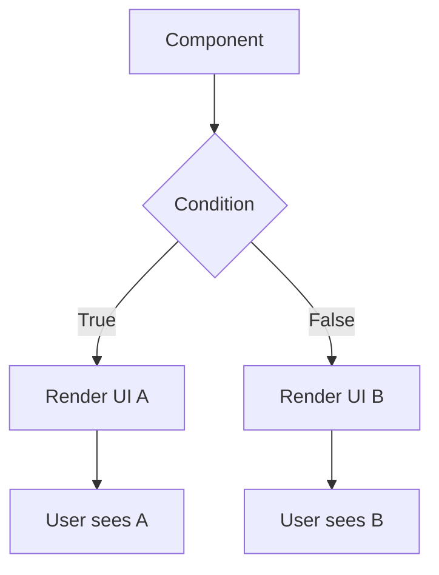
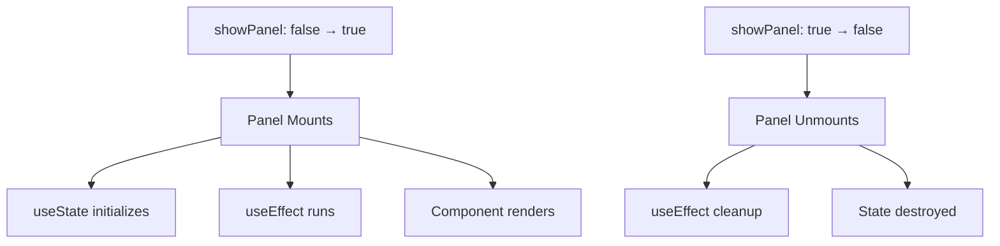

# Topic 08: Conditional Rendering

[← Previous: Events](./07_events.md) | [Back to Main](../README.md) | [Next: Lists & Keys →](./09_lists_keys.md)

---

## Table of Contents

1. [Overview](#overview)
2. [Conditional Rendering Basics](#conditional-rendering-basics)
3. [If-Else Statements](#if-else-statements)
4. [Ternary Operator](#ternary-operator)
5. [Logical AND Operator](#logical-and-operator)
6. [Logical OR Operator](#logical-or-operator)
7. [Switch Statements](#switch-statements)
8. [Enum Pattern](#enum-pattern)
9. [Null Rendering](#null-rendering)
10. [Performance Considerations](#performance-considerations)
11. [Common Patterns](#common-patterns)

---

## Overview

**Conditional rendering** in React works the same way conditions work in JavaScript. You can use JavaScript operators like `if`, ternary (`?:`), and logical operators (`&&`, `||`) to conditionally render components.

**What You'll Learn:**
- Different techniques for conditional rendering
- When to use each pattern
- Performance implications
- Common pitfalls and solutions
- Best practices for readable conditions
- TypeScript considerations

**Prerequisites:**
- JavaScript conditionals (if, ternary, logical operators)
- React components and JSX
- Basic state management

**Version Coverage:**
- React 19.2
- TypeScript 5.x

---

## Conditional Rendering Basics

### The Core Concept

```tsx
// Show different UI based on conditions
function Greeting({ isLoggedIn }) {
  if (isLoggedIn) {
    return <h1>Welcome back!</h1>;
  }
  
  return <h1>Please sign in.</h1>;
}

// Usage
<Greeting isLoggedIn={true} />   // Shows: Welcome back!
<Greeting isLoggedIn={false} />  // Shows: Please sign in.
```

### Why Conditional Rendering?



**Common Use Cases:**
- Show/hide UI elements
- Loading states
- Error handling
- Authentication gates
- Feature flags
- Responsive design
- A/B testing

---

## If-Else Statements

### Basic If-Else

```tsx
function UserGreeting({ user }) {
  if (!user) {
    return <p>Please log in.</p>;
  }
  
  if (user.isBanned) {
    return <p>Your account has been suspended.</p>;
  }
  
  if (!user.isVerified) {
    return <p>Please verify your email.</p>;
  }
  
  return (
    <div>
      <h1>Welcome, {user.name}!</h1>
      <p>Email: {user.email}</p>
    </div>
  );
}
```

### If with Variable

```tsx
function StatusDisplay({ status }) {
  let content;
  
  if (status === 'loading') {
    content = <Spinner />;
  } else if (status === 'error') {
    content = <ErrorMessage />;
  } else if (status === 'empty') {
    content = <EmptyState />;
  } else {
    content = <DataDisplay />;
  }
  
  return (
    <div className="status-container">
      {content}
    </div>
  );
}
```

### Early Returns (Guard Clauses)

```tsx
function UserProfile({ user }) {
  // Guard clauses at the top
  if (!user) {
    return <div>Loading user...</div>;
  }
  
  if (user.deleted) {
    return <div>User not found.</div>;
  }
  
  if (!user.hasAccess) {
    return <div>Access denied.</div>;
  }
  
  // Main component logic
  return (
    <div>
      <h1>{user.name}</h1>
      <p>{user.bio}</p>
      {/* Complex UI */}
    </div>
  );
}
```

---

## Ternary Operator

### Basic Ternary

```tsx
function LoginButton({ isLoggedIn }) {
  return (
    <button>
      {isLoggedIn ? 'Logout' : 'Login'}
    </button>
  );
}
```

### Ternary with Components

```tsx
function Dashboard({ isLoading, error, data }) {
  return (
    <div>
      {isLoading ? (
        <Spinner />
      ) : error ? (
        <ErrorMessage error={error} />
      ) : (
        <DataDisplay data={data} />
      )}
    </div>
  );
}
```

### Ternary with Null

```tsx
// Show element or nothing
function Alert({ show, message }) {
  return (
    <div>
      {show ? <div className="alert">{message}</div> : null}
    </div>
  );
}
```

### Nested Ternaries (Use Sparingly)

```tsx
// ⚠️ Can become hard to read
function Status({ status }) {
  return (
    <div>
      {status === 'loading' ? (
        <Spinner />
      ) : status === 'error' ? (
        <Error />
      ) : status === 'empty' ? (
        <Empty />
      ) : (
        <Content />
      )}
    </div>
  );
}

// ✅ Better: Use if-else or switch
function Status({ status }) {
  if (status === 'loading') return <Spinner />;
  if (status === 'error') return <Error />;
  if (status === 'empty') return <Empty />;
  return <Content />;
}
```

---

## Logical AND Operator

### Basic && Pattern

```tsx
// Render if true
function Notification({ hasNotifications, count }) {
  return (
    <div>
      {hasNotifications && (
        <div className="badge">{count} new notifications</div>
      )}
    </div>
  );
}
```

### Multiple Conditions

```tsx
function AdminPanel({ isLoggedIn, isAdmin, hasPermission }) {
  return (
    <div>
      {isLoggedIn && isAdmin && hasPermission && (
        <AdminControls />
      )}
    </div>
  );
}
```

### Common Pitfall: Falsy Numbers

```tsx
function MessageCount({ count }) {
  // ❌ Problem: Shows "0" when count is 0
  return (
    <div>
      {count && <p>{count} messages</p>}
    </div>
  );
  // If count = 0, renders "0" instead of nothing!
  
  // ✅ Solution 1: Explicit comparison
  return (
    <div>
      {count > 0 && <p>{count} messages</p>}
    </div>
  );
  
  // ✅ Solution 2: Boolean conversion
  return (
    <div>
      {Boolean(count) && <p>{count} messages</p>}
    </div>
  );
  
  // ✅ Solution 3: Double negation
  return (
    <div>
      {!!count && <p>{count} messages</p>}
    </div>
  );
}
```

### Guard Patterns

```tsx
function UserProfile({ user }) {
  // Early return if no user
  if (!user) return null;
  
  return (
    <div>
      <h1>{user.name}</h1>
      
      {/* Show email if exists */}
      {user.email && <p>Email: {user.email}</p>}
      
      {/* Show phone if verified */}
      {user.phoneVerified && user.phone && (
        <p>Phone: {user.phone}</p>
      )}
      
      {/* Show admin badge if admin */}
      {user.isAdmin && <span className="badge">Admin</span>}
    </div>
  );
}
```

---

## Logical OR Operator

### Fallback Values

```tsx
function UserName({ user }) {
  return (
    <h1>{user.name || 'Anonymous'}</h1>
  );
}

// With multiple fallbacks
function Display({ primary, secondary, tertiary }) {
  return (
    <div>
      {primary || secondary || tertiary || 'No data'}
    </div>
  );
}
```

### Default Components

```tsx
function Container({ children, fallback }) {
  return (
    <div className="container">
      {children || fallback || <DefaultContent />}
    </div>
  );
}
```

### Nullish Coalescing

```tsx
// Using || operator
function Component({ count }) {
  return <p>{count || 0}</p>;
  // Problem: count=0 shows 0, but count=null also shows 0
}

// Using ?? (nullish coalescing) - better
function Component({ count }) {
  return <p>{count ?? 0}</p>;
  // Only uses fallback for null/undefined, not 0
}
```

---

## Switch Statements

### Basic Switch

```tsx
function StatusDisplay({ status }) {
  const renderContent = () => {
    switch (status) {
      case 'idle':
        return <p>Ready to start</p>;
      case 'loading':
        return <Spinner />;
      case 'success':
        return <SuccessMessage />;
      case 'error':
        return <ErrorMessage />;
      default:
        return <p>Unknown status</p>;
    }
  };
  
  return <div>{renderContent()}</div>;
}
```

### Switch with Objects

```tsx
// More maintainable than switch
function StatusDisplay({ status }) {
  const statusComponents = {
    idle: <p>Ready to start</p>,
    loading: <Spinner />,
    success: <SuccessMessage />,
    error: <ErrorMessage />,
  };
  
  return (
    <div>
      {statusComponents[status] || <p>Unknown status</p>}
    </div>
  );
}
```

---

## Enum Pattern

### Enum-Based Rendering

```tsx
// Define status enum
enum LoadingStatus {
  Idle = 'idle',
  Loading = 'loading',
  Success = 'success',
  Error = 'error',
}

// Component mapping
const StatusComponents: Record<LoadingStatus, React.FC> = {
  [LoadingStatus.Idle]: () => <p>Ready</p>,
  [LoadingStatus.Loading]: () => <Spinner />,
  [LoadingStatus.Success]: () => <SuccessMessage />,
  [LoadingStatus.Error]: () => <ErrorMessage />,
};

function Component({ status }: { status: LoadingStatus }) {
  const StatusComponent = StatusComponents[status];
  return <StatusComponent />;
}
```

---

## Null Rendering

### Rendering Nothing

```tsx
// Return null to render nothing
function OptionalComponent({ show }) {
  if (!show) {
    return null;  // Renders nothing, no DOM node
  }
  
  return <div>Visible content</div>;
}

// vs hiding with CSS
function OptionalComponent({ show }) {
  return (
    <div style={{ display: show ? 'block' : 'none' }}>
      Still in DOM, just hidden
    </div>
  );
}
```

### Conditional with Null

```tsx
function Notification({ message }) {
  return (
    <div>
      {message ? <Alert message={message} /> : null}
    </div>
  );
}

// Cleaner with &&
function Notification({ message }) {
  return (
    <div>
      {message && <Alert message={message} />}
    </div>
  );
}
```

---

## Performance Considerations

### Mounting vs Hiding

```tsx
// Option 1: Unmount/remount (loses state)
function App({ showPanel }) {
  return (
    <div>
      {showPanel && <ExpensivePanel />}
    </div>
  );
}
// ExpensivePanel is destroyed when showPanel=false
// State is lost, need to reinitialize on show

// Option 2: Keep mounted, hide with CSS (preserves state)
function App({ showPanel }) {
  return (
    <div>
      <ExpensivePanel 
        style={{ display: showPanel ? 'block' : 'none' }}
      />
    </div>
  );
}
// ExpensivePanel stays mounted, state preserved
// But: Takes memory even when hidden
```

### Conditional Branches Performance

```tsx
// ✅ Fast: Simple conditions
{isLoading && <Spinner />}

// ⚠️ Slower: Creates new function each render
{isLoading && <Spinner onCancel={() => handleCancel()} />}

// ✅ Better: Stable function reference
const handleCancel = useCallback(() => { /* ... */ }, []);
{isLoading && <Spinner onCancel={handleCancel} />}
```

---

## Common Patterns

### Loading States

```tsx
function DataComponent() {
  const [loading, setLoading] = useState(true);
  const [error, setError] = useState(null);
  const [data, setData] = useState(null);
  
  if (loading) return <Spinner />;
  if (error) return <ErrorMessage error={error} />;
  if (!data) return <EmptyState />;
  
  return <DataDisplay data={data} />;
}
```

### Authentication Gates

```tsx
function ProtectedRoute({ isAuthenticated, children }) {
  if (!isAuthenticated) {
    return <Navigate to="/login" />;
  }
  
  return children;
}

// Usage
<ProtectedRoute isAuthenticated={user !== null}>
  <Dashboard />
</ProtectedRoute>
```

### Feature Flags

```tsx
function App() {
  const features = useFeatureFlags();
  
  return (
    <div>
      <Header />
      
      {features.newDashboard ? (
        <NewDashboard />
      ) : (
        <LegacyDashboard />
      )}
      
      {features.betaFeature && <BetaFeature />}
      
      <Footer />
    </div>
  );
}
```

### Multiple Condition Types

```tsx
function Content({ status, hasPermission, data }) {
  // Combine different condition types
  if (status === 'loading') return <Spinner />;
  if (status === 'error') return <Error />;
  if (!hasPermission) return <AccessDenied />;
  if (!data?.length) return <EmptyState />;
  
  return <DataList data={data} />;
}
```

---

## Higher-Order Thinking FAQs

### 1. Why does `{count && <Component />}` render "0" when count is 0, and how does React decide what to render for different JavaScript values?

**Deep Answer:**

This behavior stems from **JavaScript's truthiness rules** and how React interprets JSX expression results.

**React's Rendering Rules:**

```tsx
// React renders these values:
{42}              // Renders: "42"
{"text"}          // Renders: "text"
{true}            // Renders: nothing
{false}           // Renders: nothing
{null}            // Renders: nothing
{undefined}       // Renders: nothing
{0}               // Renders: "0" ⚠️
{NaN}             // Renders: "NaN" ⚠️
{""}              // Renders: nothing (empty string)
{[]}              // Renders: nothing (empty array)
```

**The Zero Problem:**

```tsx
function Messages({ count }) {
  // ❌ Renders "0" when count is 0
  return (
    <div>
      {count && <p>{count} messages</p>}
    </div>
  );
}

// Why? Let's trace it:
// 1. count = 0
// 2. 0 && <Component /> evaluates to 0 (falsy short-circuits)
// 3. React receives: {0}
// 4. React renders "0" (numbers are rendered as strings)
```

**The Solutions:**

```tsx
// Solution 1: Explicit boolean
{Boolean(count) && <p>{count} messages</p>}
{!!count && <p>{count} messages</p>}

// Solution 2: Comparison
{count > 0 && <p>{count} messages</p>}

// Solution 3: Ternary with null
{count ? <p>{count} messages</p> : null}
```

**Deep Implication:**

React's rendering behavior for primitives is **intentional**. Rendering numbers/strings directly is useful for simple cases (`<div>{value}</div>`), but creates gotchas with `&&`. The lesson: **always use explicit booleans** with `&&`.

### 2. When should you use conditional rendering (unmounting) versus CSS visibility, and how does this affect component lifecycle and performance?

**Deep Answer:**

The choice between **conditional rendering** and **CSS hiding** involves fundamental tradeoffs in lifecycle, performance, and state management.

**Conditional Rendering (Unmount/Remount):**

```tsx
function App({ showPanel }) {
  return (
    <div>
      {showPanel && <Panel />}
    </div>
  );
}
```

**Lifecycle Impact:**



**CSS Visibility (Stay Mounted):**

```tsx
function App({ showPanel }) {
  return (
    <div>
      <Panel style={{ display: showPanel ? 'block' : 'none' }} />
    </div>
  );
}
```

**Trade-off Analysis:**

| Aspect | Conditional Render | CSS Hiding |
|--------|-------------------|------------|
| **DOM Nodes** | Removed | Still in DOM |
| **Memory** | Freed | Consumes memory |
| **State** | Lost on unmount | Preserved |
| **Effects** | Cleanup runs | Keep running |
| **Performance** | Mount/unmount cost | Always rendered |
| **Animation** | Harder (mount/unmount) | Easy (CSS transitions) |

**Decision Framework:**

```tsx
// ✅ Use conditional rendering when:
// - Don't need to preserve state
// - Component is expensive to keep mounted
// - Want fresh state on show
// - Infrequently toggled

function Expens iveChart({ show }) {
  return show && <ChartComponent />;
}

// ✅ Use CSS hiding when:
// - Need to preserve state
// - Frequently toggled
// - Need smooth animations
// - Form inputs that shouldn't reset

function Form({ show }) {
  return (
    <form style={{ display: show ? 'block' : 'none' }}>
      {/* Form state preserved when hidden */}
    </form>
  );
}
```

**Real-World Example:**

```tsx
// Tabs: Preserve state of inactive tabs
function Tabs() {
  const [activeTab, setActiveTab] = useState(0);
  
  return (
    <>
      <TabButtons activeTab={activeTab} onChange={setActiveTab} />
      
      {/* All tabs stay mounted, just hidden */}
      <div style={{ display: activeTab === 0 ? 'block' : 'none' }}>
        <Tab1 />  {/* State preserved */}
      </div>
      <div style={{ display: activeTab === 1 ? 'block' : 'none' }}>
        <Tab2 />  {/* State preserved */}
      </div>
    </>
  );
}

// Modal: Destroy on close (fresh state on open)
function App() {
  const [showModal, setShowModal] = useState(false);
  
  return (
    <>
      <button onClick={() => setShowModal(true)}>Open</button>
      
      {/* Conditional rendering: fresh state each time */}
      {showModal && (
        <Modal onClose={() => setShowModal(false)} />
      )}
    </>
  );
}
```

### 3. How do you implement A/B testing with conditional rendering, and what are the implications for bundle size and code splitting?

**Deep Answer:**

A/B testing in React requires careful consideration of **code organization**, **bundle size**, and **user experience**.

**Naive Approach (Both Variants in Bundle):**

```tsx
function Feature({ variant }) {
  if (variant === 'A') {
    return <VariantA />;
  }
  
  return <VariantB />;
}

// Problem: Both VariantA and VariantB included in bundle
// User only sees one, but downloads both
```

**Optimized Approach (Code Splitting):**

```tsx
// Dynamically import based on variant
const VariantA = lazy(() => import('./VariantA'));
const VariantB = lazy(() => import('./VariantB'));

function Feature({ variant }) {
  return (
    <Suspense fallback={<Loading />}>
      {variant === 'A' ? <VariantA /> : <VariantB />}
    </Suspense>
  );
}

// Bundle impact:
// - User assigned variant A: Only downloads VariantA code
// - User assigned variant B: Only downloads VariantB code
// - Smaller initial bundle
```

**Production A/B Testing Pattern:**

```tsx
// Feature flag service
interface ExperimentConfig {
  name: string;
  variants: string[];
  weights: number[];
}

function useExperiment(config: ExperimentConfig) {
  const [variant, setVariant] = useState(() => {
    // Check if user already assigned
    const stored = localStorage.getItem(`experiment:${config.name}`);
    if (stored) return stored;
    
    // Assign based on weights
    const random = Math.random();
    let cumulative = 0;
    for (let i = 0; i < config.variants.length; i++) {
      cumulative += config.weights[i];
      if (random < cumulative) {
        const assigned = config.variants[i];
        localStorage.setItem(`experiment:${config.name}`, assigned);
        return assigned;
      }
    }
    return config.variants[0];
  });
  
  // Track experiment view
  useEffect(() => {
    analytics.track('experiment_viewed', {
      experiment: config.name,
      variant
    });
  }, []);
  
  return variant;
}

// Usage
function DashboardExperiment() {
  const variant = useExperiment({
    name: 'new_dashboard',
    variants: ['control', 'variant_a', 'variant_b'],
    weights: [0.33, 0.33, 0.34]
  });
  
  const DashboardComponent = lazy(() => {
    switch (variant) {
      case 'variant_a': return import('./DashboardA');
      case 'variant_b': return import('./DashboardB');
      default: return import('./DashboardControl');
    }
  });
  
  return (
    <Suspense fallback={<DashboardSkeleton />}>
      <DashboardComponent />
    </Suspense>
  );
}
```

**Implications:**

1. **Bundle Size**: Code splitting ensures users only download their variant
2. **Consistency**: localStorage ensures same variant across sessions
3. **Analytics**: Track which variant users see
4. **Performance**: Lazy loading reduces initial load
5. **Cache**: Users cache only their variant

---

## Senior SDE Interview Questions

### Question 1: Complex Conditional Logic Architecture

**Question:** "You're building a dashboard that needs to show different layouts based on user role (admin/editor/viewer), subscription tier (free/pro/enterprise), and feature flags. How would you architect the conditional rendering to keep it maintainable?"

**Key Concepts Being Tested:**
- Scalability of conditional logic
- Code organization
- Maintainability patterns
- Separation of concerns

**Expected Answer Should Cover:**

1. **Avoid Nested Ternaries:**
```tsx
// ❌ Unmaintainable
{role === 'admin' ? (
  tier === 'enterprise' ? (
    flags.newUI ? <NewAdminUI /> : <OldAdminUI />
  ) : <BasicAdminUI />
) : (
  // More nesting...
)}
```

2. **Use Configuration Object:**
```tsx
// ✅ Maintainable
const layoutConfig = {
  admin: {
    enterprise: { newUI: NewAdminUI, oldUI: AdminUI },
    pro: { newUI: ProAdminUI, oldUI: AdminUI },
    free: { newUI: FreeAdminUI, oldUI: AdminUI },
  },
  // ... other roles
};

const Layout = layoutConfig[role][tier][flags.newUI ? 'newUI' : 'oldUI'];
return <Layout />;
```

3. **Factory Pattern:**
```tsx
function getLayoutComponent(role, tier, flags) {
  // Centralized logic
  if (role === 'admin') {
    if (tier === 'enterprise' && flags.newUI) return NewAdminUI;
    return AdminUI;
  }
  // ...
}
```

**Follow-up Questions:**
1. "How would you test this conditional logic?"
2. "What if you need to add a new role?"
3. "How would you handle gradual rollout of new layout?"

**Red Flags:**
- Deeply nested ternaries without explanation
- No mention of testing
- Hardcoded conditions throughout codebase

**Green Flags:**
- Configuration-driven approach
- Mentions code splitting
- Discusses testing strategy
- Considers A/B testing implications

---

[← Previous: Events](./07_events.md) | [Back to Main](../README.md) | [Next: Lists & Keys →](./09_lists_keys.md)

---

**Progress**: Topic 8/220 completed | Part I: React Foundations (80% complete)
