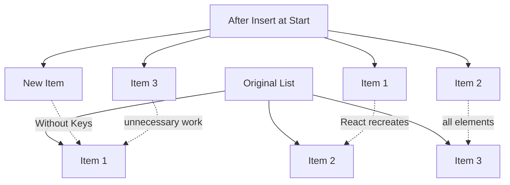
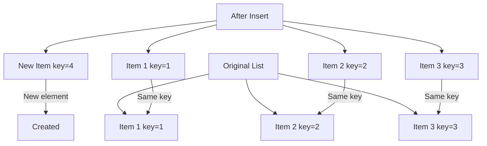
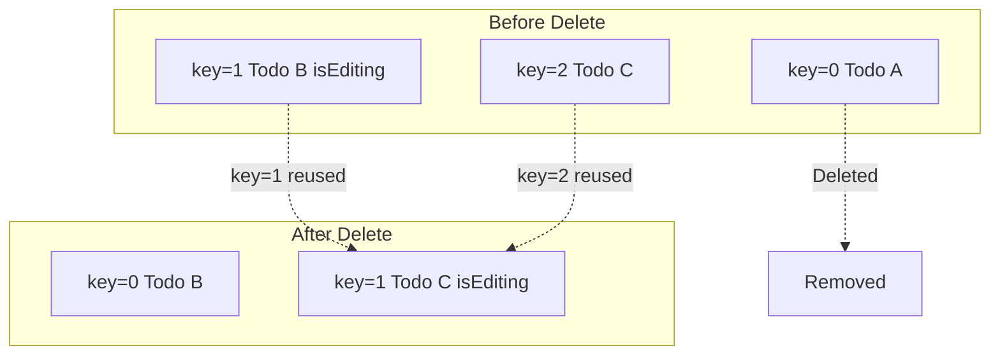
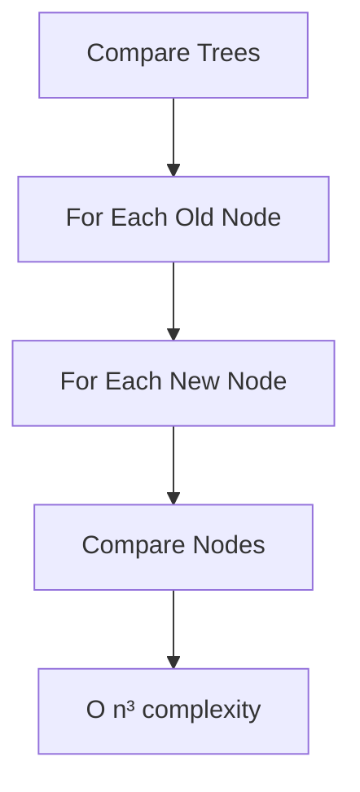
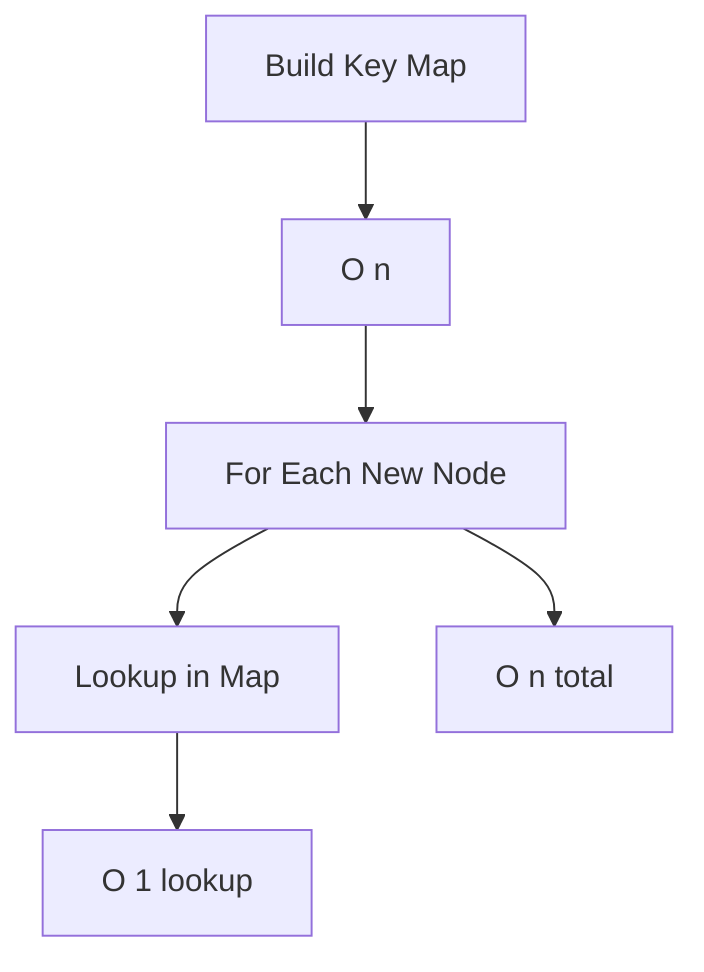

# Topic 09: Rendering Lists and Keys

[← Previous: Conditional Rendering](./08_conditional_rendering.md) | [Back to Main](../README.md) | [Next: Forms →](./10_forms.md)

---

## Table of Contents

1. [Overview](#overview)
2. [Rendering Lists](#rendering-lists)
3. [The Key Prop](#the-key-prop)
4. [Why Keys Matter](#why-keys-matter)
5. [Choosing Good Keys](#choosing-good-keys)
6. [Common Key Mistakes](#common-key-mistakes)
7. [Lists with Multiple Elements](#lists-with-multiple-elements)
8. [Dynamic Lists](#dynamic-lists)
9. [Performance Optimization](#performance-optimization)
10. [TypeScript Considerations](#typescript-considerations)
11. [Advanced Patterns](#advanced-patterns)

---

## Overview

**Rendering lists** is a fundamental operation in React applications. Lists require **keys** - special string attributes that help React identify which items have changed, been added, or removed.

**What You'll Learn:**
- How to render lists using map()
- The purpose and importance of keys
- How to choose appropriate keys
- Common mistakes with keys (especially using index)
- Performance implications of keys
- Best practices for list rendering
- Dynamic list operations (add, remove, update)

**Prerequisites:**
- JavaScript arrays and map()
- React components and JSX
- Understanding of reconciliation basics

**Version Coverage:**
- React 19.2
- TypeScript 5.x

---

## Rendering Lists

### Basic List Rendering

```tsx
// Array of primitives
function NumberList() {
  const numbers = [1, 2, 3, 4, 5];
  
  return (
    <ul>
      {numbers.map(number => (
        <li key={number}>{number}</li>
      ))}
    </ul>
  );
}

// Array of strings
function FruitList() {
  const fruits = ['Apple', 'Banana', 'Cherry'];
  
  return (
    <ul>
      {fruits.map(fruit => (
        <li key={fruit}>{fruit}</li>
      ))}
    </ul>
  );
}
```

### List of Objects

```tsx
interface User {
  id: number;
  name: string;
  email: string;
}

function UserList() {
  const users: User[] = [
    { id: 1, name: 'Alice', email: 'alice@example.com' },
    { id: 2, name: 'Bob', email: 'bob@example.com' },
    { id: 3, name: 'Charlie', email: 'charlie@example.com' },
  ];
  
  return (
    <ul>
      {users.map(user => (
        <li key={user.id}>
          <h3>{user.name}</h3>
          <p>{user.email}</p>
        </li>
      ))}
    </ul>
  );
}
```

### Extracting List Items

```tsx
// Extract to separate component
interface UserItemProps {
  user: User;
}

function UserItem({ user }: UserItemProps) {
  return (
    <li>
      <h3>{user.name}</h3>
      <p>{user.email}</p>
    </li>
  );
}

function UserList({ users }: { users: User[] }) {
  return (
    <ul>
      {users.map(user => (
        <UserItem key={user.id} user={user} />
      ))}
    </ul>
  );
}
```

---

## The Key Prop

### What are Keys?

Keys are **unique identifiers** that help React identify which items in a list have changed, been added, or removed.

```tsx
// Keys are required for list items
{items.map(item => (
  <div key={item.id}>  {/* Key here! */}
    {item.name}
  </div>
))}
```

### Where to Put Keys

```tsx
// ✅ Key goes on the outermost element in map
{users.map(user => (
  <li key={user.id}>
    <UserCard user={user} />
  </li>
))}

// ✅ Or on the component if it's the only element
{users.map(user => (
  <UserCard key={user.id} user={user} />
))}

// ❌ Not on elements inside the map
{users.map(user => (
  <li>
    <UserCard key={user.id} user={user} />  {/* Wrong! */}
  </li>
))}
```

### Keys Must Be Unique Among Siblings

```tsx
// ✅ Keys only need to be unique within their sibling group
function App() {
  return (
    <>
      <ul>
        {list1.map(item => <li key={item.id}>{item.name}</li>)}
      </ul>
      
      <ul>
        {list2.map(item => <li key={item.id}>{item.name}</li>)}
      </ul>
    </>
  );
}
// Even if list1 and list2 have overlapping IDs, it's fine
```

---

## Why Keys Matter

### Without Keys (Bad Performance)



### With Keys (Optimized)



### Reconciliation Example

```tsx
// Without keys
<ul>
  <li>Apple</li>
  <li>Banana</li>
</ul>

// Add Cherry at the beginning
<ul>
  <li>Cherry</li>
  <li>Apple</li>
  <li>Banana</li>
</ul>

// React sees:
// - First <li>: "Apple" → "Cherry" (UPDATE)
// - Second <li>: "Banana" → "Apple" (UPDATE)
// - Third <li>: new (CREATE)
// All items updated! Inefficient!

// With keys
<ul>
  <li key="apple">Apple</li>
  <li key="banana">Banana</li>
</ul>

<ul>
  <li key="cherry">Cherry</li>
  <li key="apple">Apple</li>
  <li key="banana">Banana</li>
</ul>

// React sees:
// - key="cherry": new (CREATE)
// - key="apple": same, just moved (MOVE)
// - key="banana": same, just moved (MOVE)
// Only one item created! Efficient!
```

---

## Choosing Good Keys

### Best: Stable Unique IDs

```tsx
// ✅ Database IDs (best)
{users.map(user => (
  <UserCard key={user.id} user={user} />
))}

// ✅ UUIDs
{items.map(item => (
  <Item key={item.uuid} item={item} />
))}

// ✅ Generated IDs (on creation)
const [items, setItems] = useState([]);

const addItem = (text) => {
  const newItem = {
    id: Date.now(), // or crypto.randomUUID()
    text
  };
  setItems([...items, newItem]);
};

{items.map(item => (
  <div key={item.id}>{item.text}</div>
))}
```

### Acceptable: Content-Based Keys

```tsx
// If no ID and items are unique
const fruits = ['Apple', 'Banana', 'Cherry'];

{fruits.map(fruit => (
  <li key={fruit}>{fruit}</li>
))}

// Composite keys for unique combinations
{products.map(product => (
  <div key={`${product.category}-${product.name}`}>
    {product.name}
  </div>
))}
```

### Avoid: Array Index

```tsx
// ⚠️ Only use index when:
// - List is static (never changes)
// - Items are never reordered
// - Items are never filtered
// - Items have no unique ID

// ❌ Don't use index for dynamic lists
{items.map((item, index) => (
  <div key={index}>{item}</div>
))}

// Why it's bad:
// If items reorder, React uses wrong keys
// Causes bugs with component state
```

---

## Common Key Mistakes

### Mistake 1: Using Index

```tsx
// ❌ Index as key for dynamic list
function TodoList() {
  const [todos, setTodos] = useState([
    'Learn React',
    'Build app',
    'Deploy'
  ]);
  
  const removeTodo = (index) => {
    setTodos(todos.filter((_, i) => i !== index));
  };
  
  return (
    <ul>
      {todos.map((todo, index) => (
        <li key={index}>  {/* Bug! */}
          {todo}
          <button onClick={() => removeTodo(index)}>Delete</button>
        </li>
      ))}
    </ul>
  );
}

// Problem: After delete, indices shift
// React thinks items changed when they just moved
```

### Mistake 2: Non-Unique Keys

```tsx
// ❌ Duplicate keys
const items = [
  { type: 'fruit', name: 'Apple' },
  { type: 'fruit', name: 'Banana' },
];

{items.map(item => (
  <div key={item.type}>{/* Duplicate keys! */}
    {item.name}
  </div>
))}

// ✅ Make keys unique
{items.map(item => (
  <div key={`${item.type}-${item.name}`}>
    {item.name}
  </div>
))}
```

### Mistake 3: Changing Keys

```tsx
// ❌ Keys that change on every render
{items.map(item => (
  <div key={Math.random()}>  {/* New key each render! */}
    {item.name}
  </div>
))}

// React will destroy and recreate elements
// Loses state, terrible performance

// ✅ Stable keys
{items.map(item => (
  <div key={item.id}>
    {item.name}
  </div>
))}
```

---

## Lists with Multiple Elements

### Fragments with Keys

```tsx
// When each item renders multiple elements
function DescriptionList({ items }) {
  return (
    <dl>
      {items.map(item => (
        <React.Fragment key={item.id}>
          <dt>{item.term}</dt>
          <dd>{item.description}</dd>
        </React.Fragment>
      ))}
    </dl>
  );
}

// Note: Shorthand <> doesn't support keys
// ❌ This doesn't work:
{items.map(item => (
  <> key={item.id}>  {/* Syntax error! */}
    <dt>{item.term}</dt>
    <dd>{item.description}</dd>
  </>
))}
```

### Nested Lists

```tsx
interface Category {
  id: number;
  name: string;
  items: string[];
}

function NestedList({ categories }: { categories: Category[] }) {
  return (
    <div>
      {categories.map(category => (
        <div key={category.id}>
          <h2>{category.name}</h2>
          <ul>
            {category.items.map((item, index) => (
              <li key={`${category.id}-${index}`}>
                {item}
              </li>
            ))}
          </ul>
        </div>
      ))}
    </div>
  );
}
```

---

## Dynamic Lists

### Adding Items

```tsx
function TodoList() {
  const [todos, setTodos] = useState<Array<{ id: number; text: string }>>([]);
  const [inputText, setInputText] = useState('');
  
  const addTodo = () => {
    if (!inputText.trim()) return;
    
    const newTodo = {
      id: Date.now(),  // Simple ID generation
      text: inputText
    };
    
    setTodos([...todos, newTodo]);
    setInputText('');
  };
  
  return (
    <>
      <input 
        value={inputText}
        onChange={(e) => setInputText(e.target.value)}
        onKeyDown={(e) => e.key === 'Enter' && addTodo()}
      />
      <button onClick={addTodo}>Add</button>
      
      <ul>
        {todos.map(todo => (
          <li key={todo.id}>{todo.text}</li>
        ))}
      </ul>
    </>
  );
}
```

### Removing Items

```tsx
function TodoList() {
  const [todos, setTodos] = useState([
    { id: 1, text: 'Learn React' },
    { id: 2, text: 'Build app' },
  ]);
  
  const removeTodo = (id: number) => {
    setTodos(todos.filter(todo => todo.id !== id));
  };
  
  return (
    <ul>
      {todos.map(todo => (
        <li key={todo.id}>
          {todo.text}
          <button onClick={() => removeTodo(todo.id)}>Delete</button>
        </li>
      ))}
    </ul>
  );
}
```

### Updating Items

```tsx
interface Todo {
  id: number;
  text: string;
  completed: boolean;
}

function TodoList() {
  const [todos, setTodos] = useState<Todo[]>([]);
  
  const toggleTodo = (id: number) => {
    setTodos(todos.map(todo =>
      todo.id === id
        ? { ...todo, completed: !todo.completed }
        : todo
    ));
  };
  
  const updateText = (id: number, newText: string) => {
    setTodos(todos.map(todo =>
      todo.id === id
        ? { ...todo, text: newText }
        : todo
    ));
  };
  
  return (
    <ul>
      {todos.map(todo => (
        <li key={todo.id}>
          <input
            type="checkbox"
            checked={todo.completed}
            onChange={() => toggleTodo(todo.id)}
          />
          <input
            value={todo.text}
            onChange={(e) => updateText(todo.id, e.target.value)}
          />
        </li>
      ))}
    </ul>
  );
}
```

### Reordering Items

```tsx
function ReorderableList() {
  const [items, setItems] = useState([
    { id: 1, name: 'First' },
    { id: 2, name: 'Second' },
    { id: 3, name: 'Third' },
  ]);
  
  const moveUp = (index: number) => {
    if (index === 0) return;
    
    const newItems = [...items];
    [newItems[index - 1], newItems[index]] = [newItems[index], newItems[index - 1]];
    setItems(newItems);
  };
  
  const moveDown = (index: number) => {
    if (index === items.length - 1) return;
    
    const newItems = [...items];
    [newItems[index], newItems[index + 1]] = [newItems[index + 1], newItems[index]];
    setItems(newItems);
  };
  
  return (
    <ul>
      {items.map((item, index) => (
        <li key={item.id}>
          {item.name}
          <button onClick={() => moveUp(index)} disabled={index === 0}>↑</button>
          <button onClick={() => moveDown(index)} disabled={index === items.length - 1}>↓</button>
        </li>
      ))}
    </ul>
  );
}
```

---

## Performance Optimization

### Memoizing List Items

```tsx
// Without memoization
function TodoItem({ todo, onToggle }) {
  console.log('Rendering:', todo.text);
  return (
    <li>
      <input
        type="checkbox"
        checked={todo.completed}
        onChange={() => onToggle(todo.id)}
      />
      {todo.text}
    </li>
  );
}

// ✅ With memoization (prevents unnecessary re-renders)
const TodoItem = React.memo(function TodoItem({ todo, onToggle }) {
  console.log('Rendering:', todo.text);
  return (
    <li>
      <input
        type="checkbox"
        checked={todo.completed}
        onChange={() => onToggle(todo.id)}
      />
      {todo.text}
    </li>
  );
});
```

### Stable Callback References

```tsx
function TodoList() {
  const [todos, setTodos] = useState([]);
  
  // ❌ New function on every render
  const handleToggle = (id) => {
    setTodos(todos.map(todo =>
      todo.id === id ? { ...todo, completed: !todo.completed } : todo
    ));
  };
  
  // ✅ Stable function reference
  const handleToggle = useCallback((id) => {
    setTodos(prevTodos => prevTodos.map(todo =>
      todo.id === id ? { ...todo, completed: !todo.completed } : todo
    ));
  }, []);  // No dependencies!
  
  return (
    <ul>
      {todos.map(todo => (
        <TodoItem 
          key={todo.id}
          todo={todo}
          onToggle={handleToggle}
        />
      ))}
    </ul>
  );
}
```

### Virtualization for Large Lists

```tsx
// For lists with 1000+ items, use virtualization
import { FixedSizeList } from 'react-window';

function LargeList({ items }) {
  const Row = ({ index, style }) => (
    <div style={style}>
      {items[index].name}
    </div>
  );
  
  return (
    <FixedSizeList
      height={600}
      itemCount={items.length}
      itemSize={35}
      width="100%"
    >
      {Row}
    </FixedSizeList>
  );
}
```

---

## TypeScript Considerations

### Typed List Components

```tsx
// Generic list component
interface ListProps<T> {
  items: T[];
  renderItem: (item: T, index: number) => React.ReactNode;
  keyExtractor: (item: T) => string | number;
}

function List<T>({ items, renderItem, keyExtractor }: ListProps<T>) {
  return (
    <ul>
      {items.map((item, index) => (
        <li key={keyExtractor(item)}>
          {renderItem(item, index)}
        </li>
      ))}
    </ul>
  );
}

// Usage
interface Product {
  id: number;
  name: string;
  price: number;
}

<List<Product>
  items={products}
  renderItem={(product) => (
    <div>
      <h3>{product.name}</h3>
      <p>${product.price}</p>
    </div>
  )}
  keyExtractor={(product) => product.id}
/>
```

---

## Advanced Patterns

### Grouped Lists

```tsx
interface Product {
  id: number;
  name: string;
  category: string;
}

function GroupedProductList({ products }: { products: Product[] }) {
  // Group by category
  const grouped = products.reduce((acc, product) => {
    if (!acc[product.category]) {
      acc[product.category] = [];
    }
    acc[product.category].push(product);
    return acc;
  }, {} as Record<string, Product[]>);
  
  return (
    <div>
      {Object.entries(grouped).map(([category, items]) => (
        <div key={category}>
          <h2>{category}</h2>
          <ul>
            {items.map(item => (
              <li key={item.id}>{item.name}</li>
            ))}
          </ul>
        </div>
      ))}
    </div>
  );
}
```

### Filtered Lists

```tsx
function SearchableList({ items }) {
  const [searchTerm, setSearchTerm] = useState('');
  
  const filteredItems = items.filter(item =>
    item.name.toLowerCase().includes(searchTerm.toLowerCase())
  );
  
  return (
    <>
      <input
        value={searchTerm}
        onChange={(e) => setSearchTerm(e.target.value)}
        placeholder="Search..."
      />
      
      <ul>
        {filteredItems.length > 0 ? (
          filteredItems.map(item => (
            <li key={item.id}>{item.name}</li>
          ))
        ) : (
          <li>No results found</li>
        )}
      </ul>
    </>
  );
}
```

### Sorted Lists

```tsx
function SortableList({ items }) {
  const [sortKey, setSortKey] = useState<'name' | 'date'>('name');
  const [sortOrder, setSortOrder] = useState<'asc' | 'desc'>('asc');
  
  const sortedItems = [...items].sort((a, b) => {
    const aVal = a[sortKey];
    const bVal = b[sortKey];
    
    const comparison = aVal < bVal ? -1 : aVal > bVal ? 1 : 0;
    return sortOrder === 'asc' ? comparison : -comparison;
  });
  
  return (
    <>
      <select value={sortKey} onChange={(e) => setSortKey(e.target.value)}>
        <option value="name">Name</option>
        <option value="date">Date</option>
      </select>
      
      <button onClick={() => setSortOrder(sortOrder === 'asc' ? 'desc' : 'asc')}>
        {sortOrder === 'asc' ? '↑' : '↓'}
      </button>
      
      <ul>
        {sortedItems.map(item => (
          <li key={item.id}>{item.name}</li>
        ))}
      </ul>
    </>
  );
}
```

---

## Higher-Order Thinking FAQs

### 1. Why does using array index as a key cause bugs with component state, and when is it actually safe to use?

**Deep Answer:**

Index keys break React's reconciliation when list order changes because **keys determine component identity**, not position.

**The Bug:**

```tsx
// Component with internal state
function TodoItem({ text }) {
  const [isEditing, setIsEditing] = useState(false);
  
  return (
    <li>
      {isEditing ? (
        <input defaultValue={text} />
      ) : (
        <span>{text}</span>
      )}
      <button onClick={() => setIsEditing(!isEditing)}>Edit</button>
    </li>
  );
}

// ❌ Using index as key
function TodoList() {
  const [todos, setTodos] = useState(['A', 'B', 'C']);
  
  const removeFirst = () => setTodos(todos.slice(1));
  
  return (
    <ul>
      {todos.map((todo, index) => (
        <TodoItem key={index} text={todo} />
      ))}
      <button onClick={removeFirst}>Remove First</button>
    </ul>
  );
}

// Bug scenario:
// 1. User clicks "Edit" on todo "B" (index 1)
// 2. Todo B component state: isEditing = true
// 3. Remove first todo (A)
// 4. List is now ['B', 'C']
// 5. React sees:
//    - key=0 (was A, now B): Text prop changed, but key stayed same
//    - key=1 (was B, now C): Text prop changed, key stayed same
// 6. React reuses components but updates props
// 7. Result: Todo C is now in editing mode! (Wrong component got the state)
```

**Visual Explanation:**



**When Index IS Safe:**

```tsx
// ✅ Safe: Static list (never changes)
const menuItems = ['Home', 'About', 'Contact'];

{menuItems.map((item, index) => (
  <li key={index}>{item}</li>
))}

// ✅ Safe: Paginated list (each page renders independently)
function PaginatedList({ page, items }) {
  return (
    <ul>
      {items.map((item, index) => (
        <li key={index}>{item}</li>
      ))}
    </ul>
  );
}

// ✅ Safe: No component state, no reordering
function ReadOnlyList({ items }) {
  return (
    <ul>
      {items.map((item, index) => (
        <li key={index}>{item}</li>
      ))}
    </ul>
  );
}
```

**Rule of Thumb:**

Index is safe **ONLY** when ALL of these are true:
1. List items never reorder
2. Items are never added/removed from middle
3. List items have no internal state
4. List is regenerated each render (not filtered/sorted)

### 2. How does React's reconciliation algorithm use keys, and why is this crucial for performance in large lists?

**Deep Answer:**

Keys are React's **hint system** for identifying elements across renders, enabling O(n) reconciliation instead of O(n³).

**Without Keys (O(n³) Algorithm):**



**With Keys (O(n) Algorithm):**



**The Algorithm:**

```tsx
// React's reconciliation with keys (simplified):

// Step 1: Build map of old elements
const oldMap = {
  '1': <TodoItem id=1 text="A" />,
  '2': <TodoItem id=2 text="B" />,
  '3': <TodoItem id=3 text="C" />,
};

// Step 2: For each new element, check map
newList.forEach(item => {
  if (oldMap[item.key]) {
    // Exists: Check if props changed
    if (propsChanged(oldMap[item.key], item)) {
      updateElement(item);
    } else {
      reuseElement(oldMap[item.key]);
    }
  } else {
    // New: Create element
    createElement(item);
  }
});

// Step 3: Delete elements not in new list
Object.keys(oldMap).forEach(key => {
  if (!newMap[key]) {
    deleteElement(oldMap[key]);
  }
});
```

**Performance Impact:**

```tsx
// 1000-item list with one item added at start

// Without keys:
// - React compares each element
// - Can't tell which moved vs changed
// - Updates 999 elements unnecessarily
// - Time: ~999 DOM operations

// With keys:
// - React builds key map
// - Identifies new element by missing key
// - Reuses all other elements
// - Time: ~1 DOM operation
```

**Real-World Impact:**

```tsx
// Dashboard with 50 widgets
function Dashboard({ widgets }) {
  return (
    <div>
      {widgets.map(widget => (
        <WidgetCard key={widget.id} widget={widget} />
      ))}
    </div>
  );
}

// Widget gets updated (e.g., new data)
// With key: Only that widget re-renders
// Without key: React might re-render wrong widgets
```

### 3. What happens when you render a list of components with duplicate keys, and why doesn't React throw an error?

**Deep Answer:**

Duplicate keys create **ambiguous identity**, causing React to make arbitrary choices about which element to reuse.

**The Problem:**

```tsx
// ❌ Duplicate keys
function BuggyList() {
  const items = [
    { category: 'fruit', name: 'Apple' },
    { category: 'fruit', name: 'Banana' },
    { category: 'vegetable', name: 'Carrot' },
  ];
  
  return (
    <ul>
      {items.map(item => (
        <li key={item.category}>  {/* Duplicate keys! */}
          {item.name}
        </li>
      ))}
    </ul>
  );
}
```

**What React Does:**

```tsx
// React's behavior with duplicate keys:

// Initial render:
// key="fruit" → Apple
// key="fruit" → Banana (Duplicate!)
// key="vegetable" → Carrot

// React picks FIRST match for each key
// key="fruit" maps to "Apple" element
// Second "fruit" key is treated as new/different

// On update (reorder items):
// React gets confused about which "fruit" is which
// May reuse wrong component
// State can attach to wrong element
```

**Why No Error?**

React shows a **warning** in development, not an error:

```
Warning: Encountered two children with the same key, `fruit`.
Keys should be unique so that components maintain their identity across updates.
```

**Why not throw an error?**
1. **Backward compatibility**: Old code would break
2. **Non-breaking**: App still functions (albeit incorrectly)
3. **Development feedback**: Warning in console is sufficient
4. **Production**: Warnings stripped for performance

**The Fix:**

```tsx
// ✅ Make keys unique
{items.map(item => (
  <li key={`${item
