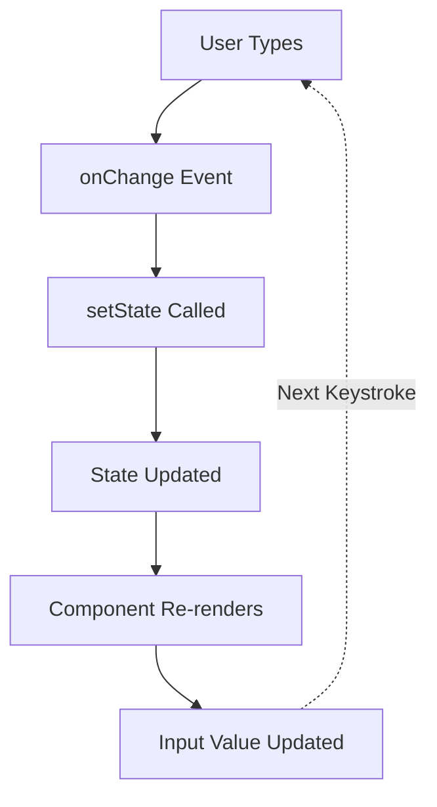

# Topic 10: Forms in React

[← Previous: Lists & Keys](./09_lists_keys.md) | [Back to Main](../README.md) | [Next: Hooks Introduction →](./11_hooks_intro.md)

---

## Table of Contents

1. [Overview](#overview)
2. [Controlled Components](#controlled-components)
3. [Form Inputs](#form-inputs)
4. [Multiple Inputs](#multiple-inputs)
5. [Form Submission](#form-submission)
6. [Form Validation](#form-validation)
7. [Uncontrolled Components](#uncontrolled-components)
8. [File Inputs](#file-inputs)
9. [Form Libraries](#form-libraries)
10. [Best Practices](#best-practices)
11. [Common Patterns](#common-patterns)

---

## Overview

**Forms** are essential for user input in web applications. React provides powerful ways to handle form state through controlled and uncontrolled components.

**What You'll Learn:**
- Controlled vs uncontrolled components
- Handling different input types
- Form submission and validation
- Managing multiple form fields
- File uploads
- Form libraries (React Hook Form, Formik)
- Best practices for forms in React

**Prerequisites:**
- React state management
- Event handling
- JSX syntax

**Version Coverage:**
- React 19.2 (including form Actions)
- TypeScript 5.x

---

## Controlled Components

### What are Controlled Components?

A **controlled component** is a form element whose value is controlled by React state.

```tsx
function ControlledInput() {
  const [value, setValue] = useState('');
  
  return (
    <input
      value={value}                              // Controlled by state
      onChange={(e) => setValue(e.target.value)} // Update state
    />
  );
}
```

### Data Flow



### Why Controlled Components?

```tsx
// ✅ Full control over input
function ControlledInput() {
  const [value, setValue] = useState('');
  
  const handleChange = (e) => {
    let newValue = e.target.value;
    
    // Can transform value before setting state
    newValue = newValue.toUpperCase();
    newValue = newValue.slice(0, 10); // Max length
    
    setValue(newValue);
  };
  
  return <input value={value} onChange={handleChange} />;
}

// ❌ Can't do this with uncontrolled
<input defaultValue="" />
// No way to intercept and transform input
```

---

## Form Inputs

### Text Input

```tsx
function TextInput() {
  const [text, setText] = useState('');
  
  return (
    <input
      type="text"
      value={text}
      onChange={(e) => setText(e.target.value)}
      placeholder="Enter text"
    />
  );
}
```

### Textarea

```tsx
function TextArea() {
  const [message, setMessage] = useState('');
  
  return (
    <textarea
      value={message}
      onChange={(e) => setMessage(e.target.value)}
      rows={5}
      cols={40}
    />
  );
}
```

### Select Dropdown

```tsx
function Select() {
  const [selected, setSelected] = useState('apple');
  
  return (
    <select value={selected} onChange={(e) => setSelected(e.target.value)}>
      <option value="apple">Apple</option>
      <option value="banana">Banana</option>
      <option value="cherry">Cherry</option>
    </select>
  );
}
```

### Checkbox

```tsx
function Checkbox() {
  const [checked, setChecked] = useState(false);
  
  return (
    <label>
      <input
        type="checkbox"
        checked={checked}
        onChange={(e) => setChecked(e.target.checked)}
      />
      I agree to terms
    </label>
  );
}
```

### Radio Buttons

```tsx
function RadioButtons() {
  const [selected, setSelected] = useState('option1');
  
  return (
    <div>
      <label>
        <input
          type="radio"
          value="option1"
          checked={selected === 'option1'}
          onChange={(e) => setSelected(e.target.value)}
        />
        Option 1
      </label>
      
      <label>
        <input
          type="radio"
          value="option2"
          checked={selected === 'option2'}
          onChange={(e) => setSelected(e.target.value)}
        />
        Option 2
      </label>
    </div>
  );
}
```

---

## Multiple Inputs

### Object State for Form

```tsx
interface FormData {
  username: string;
  email: string;
  age: string;
  newsletter: boolean;
}

function RegistrationForm() {
  const [formData, setFormData] = useState<FormData>({
    username: '',
    email: '',
    age: '',
    newsletter: false
  });
  
  const handleChange = (
    e: React.ChangeEvent<HTMLInputElement>
  ) => {
    const { name, value, type, checked } = e.target;
    
    setFormData(prev => ({
      ...prev,
      [name]: type === 'checkbox' ? checked : value
    }));
  };
  
  return (
    <form>
      <input
        name="username"
        value={formData.username}
        onChange={handleChange}
        placeholder="Username"
      />
      
      <input
        name="email"
        type="email"
        value={formData.email}
        onChange={handleChange}
        placeholder="Email"
      />
      
      <input
        name="age"
        type="number"
        value={formData.age}
        onChange={handleChange}
        placeholder="Age"
      />
      
      <label>
        <input
          name="newsletter"
          type="checkbox"
          checked={formData.newsletter}
          onChange={handleChange}
        />
        Subscribe to newsletter
      </label>
    </form>
  );
}
```

### TypeScript Form Handling

```tsx
interface FormData {
  name: string;
  email: string;
  message: string;
}

function ContactForm() {
  const [formData, setFormData] = useState<FormData>({
    name: '',
    email: '',
    message: ''
  });
  
  const handleChange = (
    e: React.ChangeEvent<HTMLInputElement | HTMLTextAreaElement>
  ) => {
    const { name, value } = e.target;
    
    setFormData(prev => ({
      ...prev,
      [name]: value
    }));
  };
  
  return (
    <form>
      <input
        name="name"
        value={formData.name}
        onChange={handleChange}
      />
      
      <input
        name="email"
        type="email"
        value={formData.email}
        onChange={handleChange}
      />
      
      <textarea
        name="message"
        value={formData.message}
        onChange={handleChange}
      />
    </form>
  );
}
```

---

## Form Submission

### Basic Submission

```tsx
function LoginForm() {
  const [email, setEmail] = useState('');
  const [password, setPassword] = useState('');
  
  const handleSubmit = (e: React.FormEvent<HTMLFormElement>) => {
    e.preventDefault();  // Prevent page reload
    
    console.log('Submitted:', { email, password });
    
    // Send to API
    fetch('/api/login', {
      method: 'POST',
      body: JSON.stringify({ email, password })
    });
  };
  
  return (
    <form onSubmit={handleSubmit}>
      <input
        type="email"
        value={email}
        onChange={(e) => setEmail(e.target.value)}
        required
      />
      
      <input
        type="password"
        value={password}
        onChange={(e) => setPassword(e.target.value)}
        required
      />
      
      <button type="submit">Login</button>
    </form>
  );
}
```

### FormData API

```tsx
function Form() {
  const handleSubmit = (e: React.FormEvent<HTMLFormElement>) => {
    e.preventDefault();
    
    // Use FormData API
    const formData = new FormData(e.currentTarget);
    
    // Get values
    const username = formData.get('username');
    const email = formData.get('email');
    
    // Or convert to object
    const data = Object.fromEntries(formData);
    console.log(data);
  };
  
  return (
    <form onSubmit={handleSubmit}>
      <input name="username" defaultValue="" />
      <input name="email" type="email" defaultValue="" />
      <button type="submit">Submit</button>
    </form>
  );
}
```

### React 19 Server Actions

```tsx
// Server action (runs on server)
async function submitForm(formData: FormData) {
  'use server';
  
  const username = formData.get('username');
  const email = formData.get('email');
  
  // Save to database
  await db.users.create({ username, email });
}

// Client component
function Form() {
  return (
    <form action={submitForm}>
      <input name="username" required />
      <input name="email" type="email" required />
      <button type="submit">Submit</button>
    </form>
  );
}
```

---

## Form Validation

### Client-Side Validation

```tsx
function ValidatedForm() {
  const [email, setEmail] = useState('');
  const [password, setPassword] = useState('');
  const [errors, setErrors] = useState<{ email?: string; password?: string }>({});
  
  const validate = () => {
    const newErrors: typeof errors = {};
    
    // Email validation
    if (!email) {
      newErrors.email = 'Email is required';
    } else if (!/\S+@\S+\.\S+/.test(email)) {
      newErrors.email = 'Email is invalid';
    }
    
    // Password validation
    if (!password) {
      newErrors.password = 'Password is required';
    } else if (password.length < 8) {
      newErrors.password = 'Password must be at least 8 characters';
    }
    
    setErrors(newErrors);
    return Object.keys(newErrors).length === 0;
  };
  
  const handleSubmit = (e: React.FormEvent) => {
    e.preventDefault();
    
    if (validate()) {
      console.log('Form is valid');
      // Submit
    }
  };
  
  return (
    <form onSubmit={handleSubmit}>
      <div>
        <input
          type="email"
          value={email}
          onChange={(e) => setEmail(e.target.value)}
        />
        {errors.email && <span className="error">{errors.email}</span>}
      </div>
      
      <div>
        <input
          type="password"
          value={password}
          onChange={(e) => setPassword(e.target.value)}
        />
        {errors.password && <span className="error">{errors.password}</span>}
      </div>
      
      <button type="submit">Submit</button>
    </form>
  );
}
```

### Real-Time Validation

```tsx
function LiveValidation() {
  const [email, setEmail] = useState('');
  const [emailError, setEmailError] = useState('');
  
  const validateEmail = (value: string) => {
    if (!value) {
      setEmailError('Email is required');
    } else if (!/\S+@\S+\.\S+/.test(value)) {
      setEmailError('Email is invalid');
    } else {
      setEmailError('');
    }
  };
  
  const handleChange = (e: React.ChangeEvent<HTMLInputElement>) => {
    const value = e.target.value;
    setEmail(value);
    validateEmail(value);
  };
  
  return (
    <div>
      <input
        type="email"
        value={email}
        onChange={handleChange}
        className={emailError ? 'input-error' : ''}
      />
      {emailError && <span className="error">{emailError}</span>}
    </div>
  );
}
```

---

## Uncontrolled Components

### Using Refs

```tsx
function UncontrolledForm() {
  const nameRef = useRef<HTMLInputElement>(null);
  const emailRef = useRef<HTMLInputElement>(null);
  
  const handleSubmit = (e: React.FormEvent) => {
    e.preventDefault();
    
    // Access values via refs
    console.log('Name:', nameRef.current?.value);
    console.log('Email:', emailRef.current?.value);
  };
  
  return (
    <form onSubmit={handleSubmit}>
      <input ref={nameRef} defaultValue="" />
      <input ref={emailRef} type="email" defaultValue="" />
      <button type="submit">Submit</button>
    </form>
  );
}
```

### Controlled vs Uncontrolled

| Aspect | Controlled | Uncontrolled |
|--------|------------|--------------|
| **State** | React state | DOM manages |
| **Value Prop** | `value={state}` | `defaultValue` |
| **Updates** | via setState | DOM handles |
| **Access** | Direct from state | via ref |
| **Validation** | Real-time | On submit |
| **Use Case** | Most forms | Simple forms, file inputs |

---

## File Inputs

### File Upload

```tsx
function FileUpload() {
  const [file, setFile] = useState<File | null>(null);
  const [preview, setPreview] = useState<string>('');
  
  const handleFileChange = (e: React.ChangeEvent<HTMLInputElement>) => {
    const selectedFile = e.target.files?.[0];
    
    if (selectedFile) {
      setFile(selectedFile);
      
      // Create preview
      const reader = new FileReader();
      reader.onloadend = () => {
        setPreview(reader.result as string);
      };
      reader.readAsDataURL(selectedFile);
    }
  };
  
  const handleSubmit = async (e: React.FormEvent) => {
    e.preventDefault();
    
    if (!file) return;
    
    const formData = new FormData();
    formData.append('file', file);
    
    await fetch('/api/upload', {
      method: 'POST',
      body: formData
    });
  };
  
  return (
    <form onSubmit={handleSubmit}>
      <input
        type="file"
        accept="image/*"
        onChange={handleFileChange}
      />
      
      {preview && }
      
      <button type="submit" disabled={!file}>
        Upload
      </button>
    </form>
  );
}
```

### Multiple File Upload

```tsx
function MultiFileUpload() {
  const [files, setFiles] = useState<FileList | null>(null);
  
  const handleChange = (e: React.ChangeEvent<HTMLInputElement>) => {
    setFiles(e.target.files);
  };
  
  return (
    <div>
      <input
        type="file"
        multiple
        onChange={handleChange}
      />
      
      {files && (
        <ul>
          {Array.from(files).map((file, index) => (
            <li key={index}>
              {file.name} - {file.size} bytes
            </li>
          ))}
        </ul>
      )}
    </div>
  );
}
```

---

## Form Libraries

### React Hook Form

```tsx
import { useForm } from 'react-hook-form';

interface FormData {
  username: string;
  email: string;
  password: string;
}

function ReactHookFormExample() {
  const {
    register,
    handleSubmit,
    formState: { errors }
  } = useForm<FormData>();
  
  const onSubmit = (data: FormData) => {
    console.log(data);
  };
  
  return (
    <form onSubmit={handleSubmit(onSubmit)}>
      <input
        {...register('username', { 
          required: 'Username is required',
          minLength: { value: 3, message: 'Min 3 characters' }
        })}
      />
      {errors.username && <span>{errors.username.message}</span>}
      
      <input
        {...register('email', {
          required: 'Email is required',
          pattern: {
            value: /\S+@\S+\.\S+/,
            message: 'Invalid email'
          }
        })}
        type="email"
      />
      {errors.email && <span>{errors.email.message}</span>}
      
      <input
        {...register('password', {
          required: 'Password is required',
          minLength: { value: 8, message: 'Min 8 characters' }
        })}
        type="password"
      />
      {errors.password && <span>{errors.password.message}</span>}
      
      <button type="submit">Submit</button>
    </form>
  );
}
```

### Formik

```tsx
import { Formik, Form, Field, ErrorMessage } from 'formik';
import * as Yup from 'yup';

const validationSchema = Yup.object({
  email: Yup.string().email('Invalid email').required('Required'),
  password: Yup.string().min(8, 'Min 8 characters').required('Required')
});

function FormikExample() {
  return (
    <Formik
      initialValues={{ email: '', password: '' }}
      validationSchema={validationSchema}
      onSubmit={(values) => {
        console.log(values);
      }}
    >
      <Form>
        <Field name="email" type="email" />
        <ErrorMessage name="email" component="div" />
        
        <Field name="password" type="password" />
        <ErrorMessage name="password" component="div" />
        
        <button type="submit">Submit</button>
      </Form>
    </Formik>
  );
}
```

---

## Best Practices

### 1. Single Source of Truth

```tsx
// ✅ State is source of truth
function Form() {
  const [value, setValue] = useState('');
  
  return (
    <input
      value={value}
      onChange={(e) => setValue(e.target.value)}
    />
  );
}
```

### 2. Prevent Default on Submit

```tsx
// ✅ Always prevent default
function Form() {
  const handleSubmit = (e: React.FormEvent) => {
    e.preventDefault();  // Prevent page reload
    // Handle submission
  };
  
  return <form onSubmit={handleSubmit}>...</form>;
}
```

### 3. Disable Submit During Processing

```tsx
function Form() {
  const [isSubmitting, setIsSubmitting] = useState(false);
  
  const handleSubmit = async (e: React.FormEvent) => {
    e.preventDefault();
    setIsSubmitting(true);
    
    try {
      await submitForm();
    } finally {
      setIsSubmitting(false);
    }
  };
  
  return (
    <form onSubmit={handleSubmit}>
      <input />
      <button type="submit" disabled={isSubmitting}>
        {isSubmitting ? 'Submitting...' : 'Submit'}
      </button>
    </form>
  );
}
```

### 4. Clear Form After Submission

```tsx
function Form() {
  const [formData, setFormData] = useState({ name: '', email: '' });
  
  const handleSubmit = async (e: React.FormEvent) => {
    e.preventDefault();
    
    await submitForm(formData);
    
    // Clear form
    setFormData({ name: '', email: '' });
  };
  
  return <form onSubmit={handleSubmit}>...</form>;
}
```

### 5. Validation Feedback

```tsx
function ValidatedInput({ value, onChange, error }) {
  return (
    <div>
      <input
        value={value}
        onChange={onChange}
        className={error ? 'input-error' : ''}
        aria-invalid={!!error}
        aria-describedby={error ? 'error-message' : undefined}
      />
      {error && (
        <span id="error-message" className="error">
          {error}
        </span>
      )}
    </div>
  );
}
```

---

## Common Patterns

### Form Reset

```tsx
function Form() {
  const initialState = { name: '', email: '', message: '' };
  const [formData, setFormData] = useState(initialState);
  
  const handleReset = () => {
    setFormData(initialState);
  };
  
  return (
    <form>
      {/* inputs */}
      <button type="button" onClick={handleReset}>Reset</button>
      <button type="submit">Submit</button>
    </form>
  );
}
```

### Form Wizard (Multi-Step)

```tsx
function MultiStepForm() {
  const [step, setStep] = useState(1);
  const [formData, setFormData] = useState({
    // Step 1
    name: '',
    email: '',
    // Step 2
    address: '',
    city: '',
    // Step 3
    cardNumber: '',
  });
  
  const handleNext = () => setStep(step + 1);
  const handleBack = () => setStep(step - 1);
  
  const handleChange = (e: React.ChangeEvent<HTMLInputElement>) => {
    setFormData({ ...formData, [e.target.name]: e.target.value });
  };
  
  return (
    <div>
      {step === 1 && (
        <div>
          <h2>Step 1: Personal Info</h2>
          <input name="name" value={formData.name} onChange={handleChange} />
          <input name="email" value={formData.email} onChange={handleChange} />
          <button onClick={handleNext}>Next</button>
        </div>
      )}
      
      {step === 2 && (
        <div>
          <h2>Step 2: Address</h2>
          <input name="address" value={formData.address} onChange={handleChange} />
          <input name="city" value={formData.city} onChange={handleChange} />
          <button onClick={handleBack}>Back</button>
          <button onClick={handleNext}>Next</button>
        </div>
      )}
      
      {step === 3 && (
        <div>
          <h2>Step 3: Payment</h2>
          <input name="cardNumber" value={formData.cardNumber} onChange={handleChange} />
          <button onClick={handleBack}>Back</button>
          <button type="submit">Submit</button>
        </div>
      )}
    </div>
  );
}
```

---

## Higher-Order Thinking FAQs

### 1. Why do controlled components require both `value` and `onChange`, and what breaks if you only provide one?

**Deep Answer:**

The combination creates a **feedback loop** that gives React full control, but breaking it creates either read-only or uncontrolled inputs.

**Only `value` (Read-Only):**

```tsx
// ❌ Input becomes read-only
function ReadOnly() {
  const [text, setText] = useState('Hello');
  
  return <input value={text} />;
  // Missing onChange!
  // User can type, but value doesn't change
  // React warning: "You provided a `value` prop without an `onChange` handler"
}
```

**Only `onChange` (Uncontrolled):**

```tsx
// ❌ React doesn't control value
function Uncontrolled() {
  const [text, setText] = useState('Hello');
  
  return <input onChange={(e) => setText(e.target.value)} />;
  // Missing value!
  // Input manages its own value (uncontrolled)
  // setText is called but doesn't affect input
}
```

**Both Together (Controlled):**

```tsx
// ✅ React controls value
function Controlled() {
  const [text, setText] = useState('Hello');
  
  return (
    <input
      value={text}                              // React displays this
      onChange={(e) => setText(e.target.value)} // User changes update state
    />
  );
}
```

**The Feedback Loop:**

```mermaid
graph TB
    A[User Types 'A'] --> B[onChange Fires]
    B --> C[setText Called]
    C --> D[State: text = 'A']
    D --> E[Re-render]
    E --> F[value={text}]
    F --> G[Input Shows 'A']
```

**Deep Implication:**

This pattern enables **programmatic control** over inputs:

```tsx
function TransformedInput() {
  const [text, setText] = useState('');
  
  const handleChange = (e) => {
    let value = e.target.value;
    value = value.toUpperCase();     // Transform
    value = value.replace(/[0-9]/g, ''); // Filter digits
    value = value.slice(0, 10);      // Max length
    setText(value);
  };
  
  return <input value={text} onChange={handleChange} />;
}
```

You can't do this with uncontrolled inputs!

### 2. When should you use controlled vs uncontrolled components, and what are the performance implications of each?

**Deep Answer:**

The choice involves tradeoffs between **control/features** and **simplicity/performance**.

**Performance Comparison:**

```tsx
// Controlled: Re-renders on every keystroke
function Controlled() {
  const [value, setValue] = useState('');
  console.log('Render'); // Logs on every keystroke
  
  return (
    <input
      value={value}
      onChange={(e) => setValue(e.target.value)}
    />
  );
}

// Uncontrolled: No re-renders during typing
function Uncontrolled() {
  const inputRef = useRef<HTMLInputElement>(null);
  console.log('Render'); // Only logs once on mount
  
  return <input ref={inputRef} defaultValue="" />;
}
```

**When to Use Controlled:**

```tsx
// ✅ Need to validate on-the-fly
function ValidatedEmail() {
  const [email, setEmail] = useState('');
  const isValid = /\S+@\S+\.\S+/.test(email);
  
  return (
    <>
      <input value={email} onChange={(e) => setEmail(e.target.value)} />
      {!isValid && <span>Invalid email</span>}
    </>
  );
}

// ✅ Need to transform input
function UpperCaseInput() {
  const [text, setText] = useState('');
  
  return (
    <input
      value={text}
      onChange={(e) => setText(e.target.value.toUpperCase())}
    />
  );
}

// ✅ Need to disable submit based on input
function Form() {
  const [password, setPassword] = useState('');
  const isValid = password.length >= 8;
  
  return (
    <>
      <input value={password} onChange={(e) => setPassword(e.target.value)} />
      <button disabled={!isValid}>Submit</button>
    </>
  );
}
```

**When to Use Uncontrolled:**

```tsx
// ✅ Simple forms (no validation needed)
function SimpleForm() {
  const nameRef = useRef<HTMLInputElement>(null);
  
  return (
    <form onSubmit={(e) => {
      e.preventDefault();
      console.log(nameRef.current?.value);
    }}>
      <input ref={nameRef} defaultValue="" />
      <button>Submit</button>
    </form>
  );
}

// ✅ File inputs (must be uncontrolled)
function FileForm() {
  const fileRef = useRef<HTMLInputElement>(null);
  
  return (
    <input
      ref={fileRef}
      type="file"
      onChange={() => console.log(fileRef.current?.files)}
    />
  );
}

// ✅ Integrating with non-React code
function LegacyForm() {
  const formRef = useRef<HTMLFormElement>(null);
  
  useEffect(() => {
    // jQuery or other library manipulates form
    $(formRef.current).somePlugin();
  }, []);
  
  return <form ref={formRef}>...</form>;
}
```

**Performance Reality:**

For most forms, controlled components are fine. The performance difference is negligible unless you have:
- Extremely large forms (100+ fields)
- Very expensive validation on every keystroke
- Performance-critical applications

**Modern Solution: Debouncing**

```tsx
// Best of both worlds
function OptimizedForm() {
  const [localValue, setLocalValue] = useState('');
  const [debouncedValue, setDebouncedValue] = useState('');
  
  useEffect(() => {
    const timer = setTimeout(() => {
      setDebouncedValue(localValue);
    }, 300);
    
    return () => clearTimeout(timer);
  }, [localValue]);
  
  // Validate debounced value
  const isValid = validateEmail(debouncedValue);
  
  return (
    <input
      value={localValue}  // Controlled, responsive
      onChange={(e) => setLocalValue(e.target.value)}
    />
  );
}
```

---

## Senior SDE Interview Questions

### Question 1: Form Architecture at Scale

**Question:** "Design a form system for an enterprise application with 50+ forms, each having 10-20 fields. How would you architect reusable form components while maintaining type safety and validation?"

**Key Concepts Being Tested:**
- Architectural thinking
- Reusability patterns
- Type safety
- Validation strategies
- Developer experience

**Expected Answer Should Cover:**

1. **Generic Form Components:**
```tsx
interface FormFieldProps<T> {
  name: keyof T;
  label: string;
  value: T[keyof T];
  onChange: (name: keyof T, value: any) => void;
  error?: string;
  required?: boolean;
}

function FormField<T>({
  name,
  label,
  value,
  onChange,
  error,
  required
}: FormFieldProps<T>) {
  return (
    <div>
      <label>
        {label} {required && '*'}
      </label>
      <input
        value={value as string}
        onChange={(e) => onChange(name, e.target.value)}
      />
      {error && <span className="error">{error}</span>}
    </div>
  );
}
```

2. **Form State Hook:**
```tsx
function useFormState<T>(initialValues: T) {
  const [values, setValues] = useState(initialValues);
  const [errors, setErrors
