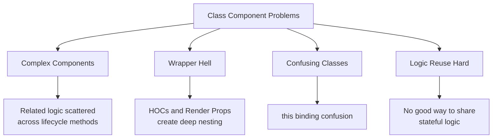
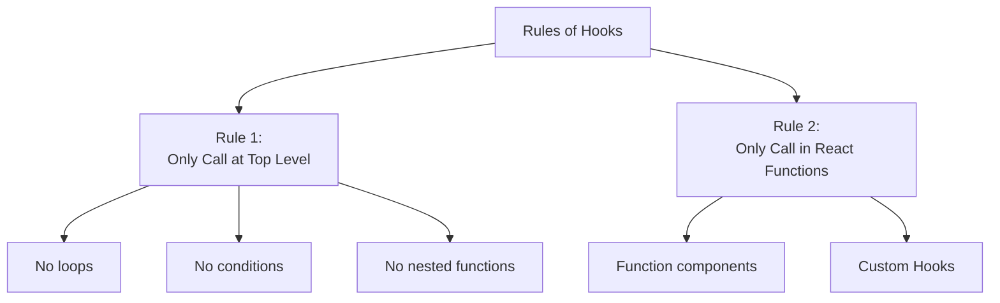
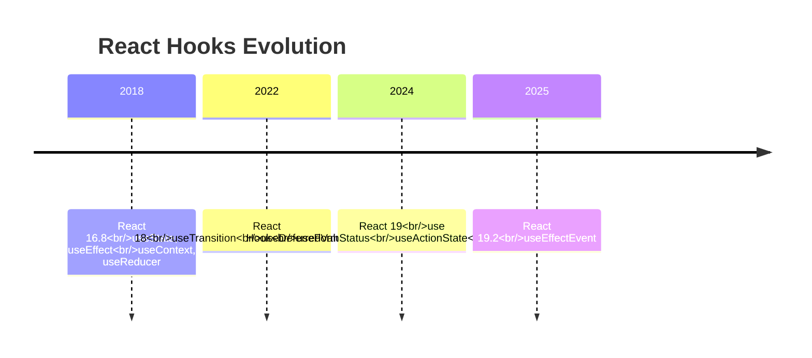
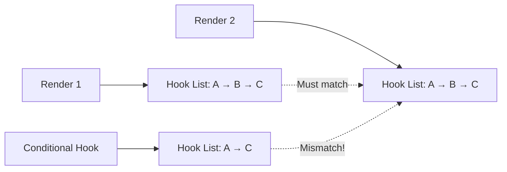

# Topic 11: Introduction to React Hooks

[← Previous: Forms](./10_forms.md) | [Back to Main](../README.md) | [Next: useState Hook →](./12_usestate_hook.md)

---

## Table of Contents

1. [Overview](#overview)
2. [What are Hooks?](#what-are-hooks)
3. [Why Hooks?](#why-hooks)
4. [Rules of Hooks](#rules-of-hooks)
5. [Built-in Hooks Overview](#built-in-hooks-overview)
6. [Hooks vs Class Components](#hooks-vs-class-components)
7. [Custom Hooks](#custom-hooks)
8. [Hooks Best Practices](#hooks-best-practices)
9. [Migration Strategy](#migration-strategy)
10. [Common Mistakes](#common-mistakes)
11. [React 19 Hooks](#react-19-hooks)

---

## Overview

**React Hooks** are functions that let you "hook into" React features like state and lifecycle from function components. Introduced in React 16.8, Hooks revolutionized how we write React applications.

**What You'll Learn:**
- What Hooks are and why they exist
- The Rules of Hooks and why they matter
- Overview of all built-in Hooks
- Hooks vs class components comparison
- How to create custom Hooks
- Best practices and common pitfalls
- React 19.2 latest Hooks

**Prerequisites:**
- React function components
- State and props concepts
- Basic understanding of component lifecycle

**Version Coverage:**
- React 16.8+ (Hooks introduction)
- React 18 (Concurrent Hooks)
- React 19.2 (Latest Hooks: use, useFormStatus, useActionState, useOptimistic, useEffectEvent)

---

## What are Hooks?

### Core Definition

Hooks are **special functions** that let function components access React features that were previously only available in class components.

```tsx
// Before Hooks: Class component needed for state
class Counter extends React.Component {
  state = { count: 0 };
  
  render() {
    return (
      <button onClick={() => this.setState({ count: this.state.count + 1 })}>
        Count: {this.state.count}
      </button>
    );
  }
}

// With Hooks: Simple function component
function Counter() {
  const [count, setCount] = useState(0);
  
  return (
    <button onClick={() => setCount(count + 1)}>
      Count: {count}
    </button>
  );
}
```

### Hook Characteristics

**1. Start with "use"**
```tsx
// All Hooks follow naming convention
useState()
useEffect()
useContext()
useReducer()
useCallback()
useMemo()
useRef()
// Custom Hooks too!
useAuth()
useFetch()
useLocalStorage()
```

**2. Only Call in Function Components**
```tsx
// ✅ In function components
function Component() {
  const [state, setState] = useState(0);
}

// ✅ In custom Hooks
function useCustomHook() {
  const [state, setState] = useState(0);
}

// ❌ In regular functions
function regularFunction() {
  const [state, setState] = useState(0);  // Error!
}

// ❌ In class components
class Component extends React.Component {
  componentDidMount() {
    const [state, setState] = useState(0);  // Error!
  }
}
```

**3. Enable Composition**
```tsx
// Hooks compose naturally
function useUser(userId) {
  const [user, setUser] = useState(null);
  const [loading, setLoading] = useState(true);
  
  useEffect(() => {
    fetchUser(userId).then(data => {
      setUser(data);
      setLoading(false);
    });
  }, [userId]);
  
  return { user, loading };
}

// Use composed Hook
function UserProfile({ userId }) {
  const { user, loading } = useUser(userId);
  
  if (loading) return <Loading />;
  return <div>{user.name}</div>;
}
```

---

## Why Hooks?

### Problems with Class Components



#### Problem 1: Logic Scattered Across Lifecycle

```tsx
// ❌ Class: Related logic split across methods
class ChatRoom extends Component {
  state = { messages: [] };
  
  componentDidMount() {
    // Setup for chat
    this.subscription = subscribeToChat(this.props.roomId);
    
    // Setup for online status
    this.onlineStatusSubscription = subscribeToOnlineStatus(this.props.userId);
  }
  
  componentDidUpdate(prevProps) {
    // Update chat subscription
    if (this.props.roomId !== prevProps.roomId) {
      this.subscription.unsubscribe();
      this.subscription = subscribeToChat(this.props.roomId);
    }
    
    // Update online status subscription
    if (this.props.userId !== prevProps.userId) {
      this.onlineStatusSubscription.unsubscribe();
      this.onlineStatusSubscription = subscribeToOnlineStatus(this.props.userId);
    }
  }
  
  componentWillUnmount() {
    // Cleanup chat
    this.subscription.unsubscribe();
    // Cleanup online status
    this.onlineStatusSubscription.unsubscribe();
  }
}

// ✅ Hooks: Related logic grouped together
function ChatRoom({ roomId, userId }) {
  // All chat logic in one place
  useEffect(() => {
    const subscription = subscribeToChat(roomId);
    return () => subscription.unsubscribe();
  }, [roomId]);
  
  // All online status logic in one place
  useEffect(() => {
    const subscription = subscribeToOnlineStatus(userId);
    return () => subscription.unsubscribe();
  }, [userId]);
}
```

#### Problem 2: Wrapper Hell

```tsx
// ❌ HOCs and Render Props create nesting
<ThemeContext.Consumer>
  {theme => (
    <UserContext.Consumer>
      {user => (
        <PermissionsContext.Consumer>
          {permissions => (
            <Component theme={theme} user={user} permissions={permissions} />
          )}
        </PermissionsContext.Consumer>
      )}
    </UserContext.Consumer>
  )}
</ThemeContext.Consumer>

// ✅ Hooks: Flat structure
function Component() {
  const theme = useContext(ThemeContext);
  const user = useContext(UserContext);
  const permissions = useContext(PermissionsContext);
  
  return <div>...</div>;
}
```

#### Problem 3: this Binding Confusion

```tsx
// ❌ Class: this binding is error-prone
class Form extends Component {
  handleSubmit(e) {
    // this is undefined! Must bind
    this.setState({ ... });
  }
  
  render() {
    // Option 1: Bind in render (creates new function each render)
    return <form onSubmit={this.handleSubmit.bind(this)} />
    
    // Option 2: Arrow function (creates new function each render)
    return <form onSubmit={(e) => this.handleSubmit(e)} />
    
    // Option 3: Bind in constructor (verbose)
    // this.handleSubmit = this.handleSubmit.bind(this);
  }
}

// ✅ Hooks: No this, no confusion
function Form() {
  const handleSubmit = (e) => {
    // Always works correctly
    setState({ ... });
  };
  
  return <form onSubmit={handleSubmit} />;
}
```

#### Problem 4: Logic Reuse

```tsx
// ❌ Class: HOC or Render Props for reuse (complex)
function withWindowSize(Component) {
  return class extends React.Component {
    state = { width: window.innerWidth };
    
    componentDidMount() {
      window.addEventListener('resize', this.handleResize);
    }
    
    componentWillUnmount() {
      window.removeEventListener('resize', this.handleResize);
    }
    
    handleResize = () => {
      this.setState({ width: window.innerWidth });
    };
    
    render() {
      return <Component width={this.state.width} {...this.props} />;
    }
  };
}

// ✅ Hooks: Simple custom Hook
function useWindowSize() {
  const [width, setWidth] = useState(window.innerWidth);
  
  useEffect(() => {
    const handleResize = () => setWidth(window.innerWidth);
    window.addEventListener('resize', handleResize);
    return () => window.removeEventListener('resize', handleResize);
  }, []);
  
  return width;
}

// Usage: Just call it!
function Component() {
  const width = useWindowSize();
  return <div>Width: {width}</div>;
}
```

---

## Rules of Hooks

### The Two Golden Rules



### Rule 1: Only Call Hooks at the Top Level

```tsx
// ❌ Don't call Hooks inside loops
function Component() {
  for (let i = 0; i < 10; i++) {
    const [state, setState] = useState(0);  // Error!
  }
}

// ❌ Don't call Hooks inside conditions
function Component({ condition }) {
  if (condition) {
    const [state, setState] = useState(0);  // Error!
  }
}

// ❌ Don't call Hooks inside nested functions
function Component() {
  function nestedFunction() {
    const [state, setState] = useState(0);  // Error!
  }
}

// ✅ Always call Hooks at top level
function Component() {
  const [state1, setState1] = useState(0);  // ✅
  const [state2, setState2] = useState(0);  // ✅
  const [state3, setState3] = useState(0);  // ✅
  
  return <div>...</div>;
}
```

**Why This Rule Exists:**

```tsx
// React relies on call order to track Hooks
function Component() {
  useState(0);    // Hook #1
  useEffect(() => {}); // Hook #2
  useState('');   // Hook #3
  
  // React internally:
  // hookIndex 0 → useState(0)
  // hookIndex 1 → useEffect
  // hookIndex 2 → useState('')
  
  // If Hook #2 is conditional, order breaks!
}
```

### Rule 2: Only Call from React Functions

```tsx
// ✅ Call from function components
function Component() {
  const [state, setState] = useState(0);
}

// ✅ Call from custom Hooks
function useCustomHook() {
  const [state, setState] = useState(0);
}

// ❌ Don't call from regular JavaScript functions
function regularFunction() {
  const [state, setState] = useState(0);  // Error!
}

// ❌ Don't call from class components
class Component extends React.Component {
  render() {
    const [state, setState] = useState(0);  // Error!
    return <div />;
  }
}

// ❌ Don't call from event handlers
function Component() {
  const handleClick = () => {
    const [state, setState] = useState(0);  // Error!
  };
}
```

### ESLint Plugin

```json
// .eslintrc
{
  "plugins": ["react-hooks"],
  "rules": {
    "react-hooks/rules-of-hooks": "error",
    "react-hooks/exhaustive-deps": "warn"
  }
}
```

---

## Built-in Hooks Overview

### State Hooks

```tsx
// useState - Simple state
const [count, setCount] = useState(0);

// useReducer - Complex state logic
const [state, dispatch] = useReducer(reducer, initialState);

// React 19: useOptimistic - Optimistic updates
const [optimisticState, addOptimistic] = useOptimistic(state);

// React 19: useActionState - Form actions
const [state, formAction] = useActionState(action, initialState);
```

### Effect Hooks

```tsx
// useEffect - Side effects
useEffect(() => {
  // Effect logic
  return () => {
    // Cleanup
  };
}, [dependencies]);

// useLayoutEffect - Synchronous effects
useLayoutEffect(() => {
  // Runs before paint
}, [dependencies]);

// useInsertionEffect - CSS-in-JS libraries
useInsertionEffect(() => {
  // Inject styles
}, [dependencies]);
```

### Context Hook

```tsx
// useContext - Consume context
const value = useContext(MyContext);
```

### Ref Hooks

```tsx
// useRef - Mutable reference
const ref = useRef(initialValue);

// useImperativeHandle - Customize ref
useImperativeHandle(ref, () => ({
  // Exposed methods
}), [dependencies]);
```

### Performance Hooks

```tsx
// useMemo - Memoize values
const memoizedValue = useMemo(() => computeExpensiveValue(a, b), [a, b]);

// useCallback - Memoize callbacks
const memoizedCallback = useCallback(() => {
  doSomething(a, b);
}, [a, b]);

// React.memo - Memoize components
const MemoizedComponent = React.memo(Component);
```

### Concurrent Hooks (React 18+)

```tsx
// useTransition - Mark updates as transitions
const [isPending, startTransition] = useTransition();

// useDeferredValue - Defer value updates
const deferredValue = useDeferredValue(value);
```

### React 19 Hooks

```tsx
// use - Unwrap promises and context
const data = use(promise);

// useFormStatus - Form state
const { pending, data, method } = useFormStatus();

// React 19.2: useEffectEvent - Stable event handlers
const onEvent = useEffectEvent((data) => {
  // Event handler that doesn't re-trigger effects
});
```

---

## Hooks vs Class Components

### Side-by-Side Comparison

```tsx
// CLASS COMPONENT
class UserProfile extends Component {
  state = {
    user: null,
    loading: true,
    count: 0
  };
  
  componentDidMount() {
    fetchUser(this.props.userId)
      .then(user => this.setState({ user, loading: false }));
  }
  
  componentDidUpdate(prevProps) {
    if (this.props.userId !== prevProps.userId) {
      this.setState({ loading: true });
      fetchUser(this.props.userId)
        .then(user => this.setState({ user, loading: false }));
    }
  }
  
  componentWillUnmount() {
    // Cleanup
  }
  
  handleIncrement = () => {
    this.setState({ count: this.state.count + 1 });
  };
  
  render() {
    if (this.state.loading) return <Loading />;
    
    return (
      <div>
        <h1>{this.state.user.name}</h1>
        <button onClick={this.handleIncrement}>
          Count: {this.state.count}
        </button>
      </div>
    );
  }
}

// FUNCTION COMPONENT WITH HOOKS
function UserProfile({ userId }) {
  const [user, setUser] = useState(null);
  const [loading, setLoading] = useState(true);
  const [count, setCount] = useState(0);
  
  useEffect(() => {
    setLoading(true);
    fetchUser(userId)
      .then(user => {
        setUser(user);
        setLoading(false);
      });
    
    return () => {
      // Cleanup
    };
  }, [userId]);
  
  const handleIncrement = () => {
    setCount(count + 1);
  };
  
  if (loading) return <Loading />;
  
  return (
    <div>
      <h1>{user.name}</h1>
      <button onClick={handleIncrement}>
        Count: {count}
      </button>
    </div>
  );
}
```

### Benefits Summary

| Aspect | Class Components | Hooks |
|--------|------------------|-------|
| **Code Volume** | More verbose | More concise |
| **Logic Organization** | Split across lifecycle | Grouped by concern |
| **Reusability** | HOCs/Render Props | Custom Hooks |
| **this Binding** | Required | Not needed |
| **Learning Curve** | Steeper | Gentler |
| **TypeScript** | More complex | Simpler |
| **Testing** | More setup | Easier |
| **Future** | Legacy | Recommended |

---

## Custom Hooks

### What are Custom Hooks?

Custom Hooks let you **extract component logic into reusable functions**.

```tsx
// Custom Hook for form input
function useInput(initialValue = '') {
  const [value, setValue] = useState(initialValue);
  
  const handleChange = (e: React.ChangeEvent<HTMLInputElement>) => {
    setValue(e.target.value);
  };
  
  const reset = () => setValue(initialValue);
  
  return {
    value,
    onChange: handleChange,
    reset
  };
}

// Usage
function LoginForm() {
  const email = useInput('');
  const password = useInput('');
  
  const handleSubmit = (e) => {
    e.preventDefault();
    console.log(email.value, password.value);
    email.reset();
    password.reset();
  };
  
  return (
    <form onSubmit={handleSubmit}>
      <input type="email" {...email} />
      <input type="password" {...password} />
      <button type="submit">Login</button>
    </form>
  );
}
```

### Custom Hook Examples

```tsx
// useLocalStorage - Persist state
function useLocalStorage<T>(key: string, initialValue: T) {
  const [storedValue, setStoredValue] = useState<T>(() => {
    try {
      const item = window.localStorage.getItem(key);
      return item ? JSON.parse(item) : initialValue;
    } catch {
      return initialValue;
    }
  });
  
  const setValue = (value: T) => {
    setStoredValue(value);
    window.localStorage.setItem(key, JSON.stringify(value));
  };
  
  return [storedValue, setValue] as const;
}

// useFetch - Data fetching
function useFetch<T>(url: string) {
  const [data, setData] = useState<T | null>(null);
  const [loading, setLoading] = useState(true);
  const [error, setError] = useState<Error | null>(null);
  
  useEffect(() => {
    fetch(url)
      .then(res => res.json())
      .then(setData)
      .catch(setError)
      .finally(() => setLoading(false));
  }, [url]);
  
  return { data, loading, error };
}

// useDebounce - Debounce values
function useDebounce<T>(value: T, delay: number) {
  const [debouncedValue, setDebouncedValue] = useState(value);
  
  useEffect(() => {
    const timer = setTimeout(() => setDebouncedValue(value), delay);
    return () => clearTimeout(timer);
  }, [value, delay]);
  
  return debouncedValue;
}
```

---

## Hooks Best Practices

### 1. Name Custom Hooks with "use" Prefix

```tsx
// ✅ Correct naming
function useAuth() {}
function useFetch() {}
function useLocalStorage() {}

// ❌ Wrong naming
function getAuth() {}  // Missing "use"
function fetchData() {}  // Missing "use"
```

### 2. Keep Hooks at Top Level

```tsx
// ✅ All Hooks at top
function Component({ condition }) {
  const [state1, setState1] = useState(0);
  const [state2, setState2] = useState(0);
  
  useEffect(() => {
    // ...
  }, []);
  
  if (condition) {
    return <div>Early return OK after Hooks</div>;
  }
  
  return <div>Main render</div>;
}
```

### 3. Exhaustive Dependencies

```tsx
// ❌ Missing dependencies
function Component({ userId }) {
  const [user, setUser] = useState(null);
  
  useEffect(() => {
    fetchUser(userId).then(setUser);
  }, []);  // Missing userId!
  
  // Won't refetch when userId changes
}

// ✅ Include all dependencies
function Component({ userId }) {
  const [user, setUser] = useState(null);
  
  useEffect(() => {
    fetchUser(userId).then(setUser);
  }, [userId]);  // ✅ Correct!
}
```

### 4. Extract Related Logic

```tsx
// ❌ All logic in component
function Component() {
  const [user, setUser] = useState(null);
  const [posts, setPosts] = useState([]);
  const [comments, setComments] = useState([]);
  
  useEffect(() => { /* fetch user */ }, []);
  useEffect(() => { /* fetch posts */ }, []);
  useEffect(() => { /* fetch comments */ }, []);
  
  // Component becomes large
}

// ✅ Extract to custom Hooks
function Component() {
  const user = useUser(userId);
  const posts = usePosts(userId);
  const comments = useComments(postId);
  
  // Clean and focused
}
```

---

## Migration Strategy

### Gradual Migration

```tsx
// You can mix class and function components!
function App() {
  return (
    <>
      {/* New: Function component with Hooks */}
      <NewFeature />
      
      {/* Old: Class component (still works!) */}
      <LegacyComponent />
    </>
  );
}

// Migrate one component at a time
// No need to rewrite entire app
```

### Migration Pattern

```tsx
// Step 1: Identify class component
class UserProfile extends Component {
  // ...
}

// Step 2: Convert to function
function UserProfile(props) {
  // ...
}

// Step 3: Convert state
// this.state.user → const [user, setUser] = useState(null)

// Step 4: Convert lifecycle
// componentDidMount + componentDidUpdate → useEffect

// Step 5: Remove this
// this.props.userId → props.userId or destructure
```

---

## Common Mistakes

### Mistake 1: Conditional Hooks

```tsx
// ❌ Conditional Hook call
function Component({ shouldFetch }) {
  if (shouldFetch) {
    const [data, setData] = useState(null);  // Error!
  }
}

// ✅ Unconditional Hook, conditional logic inside
function Component({ shouldFetch }) {
  const [data, setData] = useState(null);
  
  useEffect(() => {
    if (shouldFetch) {
      fetchData().then(setData);
    }
  }, [shouldFetch]);
}
```

### Mistake 2: Forgetting Dependencies

```tsx
// ❌ Missing dependencies (ESLint will warn)
function Component({ userId }) {
  const [count, setCount] = useState(0);
  
  useEffect(() => {
    console.log(userId, count);
  }, []);  // Missing userId and count!
}

// ✅ Include all dependencies
function Component({ userId }) {
  const [count, setCount] = useState(0);
  
  useEffect(() => {
    console.log(userId, count);
  }, [userId, count]);  // ✅
}
```

### Mistake 3: Stale Closures

```tsx
// ❌ Stale closure
function Component() {
  const [count, setCount] = useState(0);
  
  useEffect(() => {
    const timer = setInterval(() => {
      setCount(count + 1);  // Always uses initial count!
    }, 1000);
    
    return () => clearInterval(timer);
  }, []);  // Empty deps means count never updates
}

// ✅ Use functional update
function Component() {
  const [count, setCount] = useState(0);
  
  useEffect(() => {
    const timer = setInterval(() => {
      setCount(prev => prev + 1);  // ✅ Uses current value
    }, 1000);
    
    return () => clearInterval(timer);
  }, []);
}
```

---

## React 19 Hooks

### New Hooks Timeline



### React 19.2 Features

```tsx
// useEffectEvent - Stable event handlers in effects
function Chat({ roomId }) {
  const [message, setMessage] = useState('');
  
  // Event that doesn't cause effect re-runs
  const onMessage = useEffectEvent((msg) => {
    console.log(`Message in ${roomId}: ${msg}`);
  });
  
  useEffect(() => {
    const socket = connectToRoom(roomId);
    socket.on('message', onMessage);  // onMessage is stable!
    return () => socket.disconnect();
  }, [roomId]);  // Only roomId dependency, not onMessage
}
```

---

## Higher-Order Thinking FAQs

### 1. Why do Hooks rely on call order instead of names, and what would break if React used names instead?

**Deep Answer:**

React uses **call order** because it enables **zero-configuration Hook usage** without explicit registration, but this design choice creates the "Rules of Hooks" constraints.

**Why Call Order:**

```tsx
// React tracks Hooks by index
function Component() {
  useState(0);     // Hook index 0
  useEffect(() => {}); // Hook index 1
  useState('');    // Hook index 2
  
  // React's internal fiber:
  // hooks[0] = { type: 'useState', state: 0 }
  // hooks[1] = { type: 'useEffect', ... }
  // hooks[2] = { type: 'useState', state: '' }
}
```

**If React Used Names Instead:**

```tsx
// Hypothetical name-based system
function Component() {
  const count = useState('count', 0);
  const name = useState('name', '');
  
  // Verbose! Must provide unique names
  // But: Could call conditionally!
  if (condition) {
    const temp = useState('temp', 0);  // Would work
  }
}
```

**Trade-off Analysis:**

**Call Order (React's Choice):**
- ✅ Clean API (no names needed)
- ✅ Zero configuration
- ✅ Less verbose
- ❌ Must follow Rules of Hooks
- ❌ Can't be conditional

**Name-Based (Alternative):**
- ✅ Could be conditional
- ✅ More flexible
- ❌ Verbose (explicit names)
- ❌ Name collisions possible
- ❌ More error-prone

**Deep Implication:**

React prioritized **developer experience** (clean API) over flexibility. The constraint forces you to think declaratively: define all possible states upfront, then conditionally render based on state, rather than conditionally creating state.

### 2. Why can't you call Hooks conditionally, and how does this relate to React's Fiber architecture?

**Deep Answer:**

The conditional restriction stems from how React Fiber tracks Hook state across renders using a **linked list** indexed by call order.

**React Fiber's Hook Storage:**

```tsx
// Simplified Fiber structure
const fiber = {
  memoizedState: null,  // Points to first Hook
  // ...
};

// Hooks stored as linked list
hook1.next → hook2.next → hook3.next → null

// Each Hook node:
{
  memoizedState: value,  // Hook's data
  next: nextHook,        // Next Hook in list
  // ...
}
```

**What Happens with Conditional Hooks:**

```tsx
// ❌ Conditional Hook
function Component({ condition }) {
  useState(0);  // Hook #0
  
  if (condition) {
    useState('');  // Hook #1 (sometimes)
  }
  
  useState(false);  // Hook #1 or #2 depending on condition!
}

// First render (condition = true):
// hooks[0] = useState(0)
// hooks[1] = useState('')
// hooks[2] = useState(false)

// Second render (condition = false):
// hooks[0] = useState(0)
// hooks[1] = useState(false)  // Wrong! React tries to read '' but gets false
// Mismatch! React crashes
```

**Fiber's Expectation:**



**Why This Architecture:**

1. **Performance**: Linked list traversal is O(n)
2. **Simplicity
