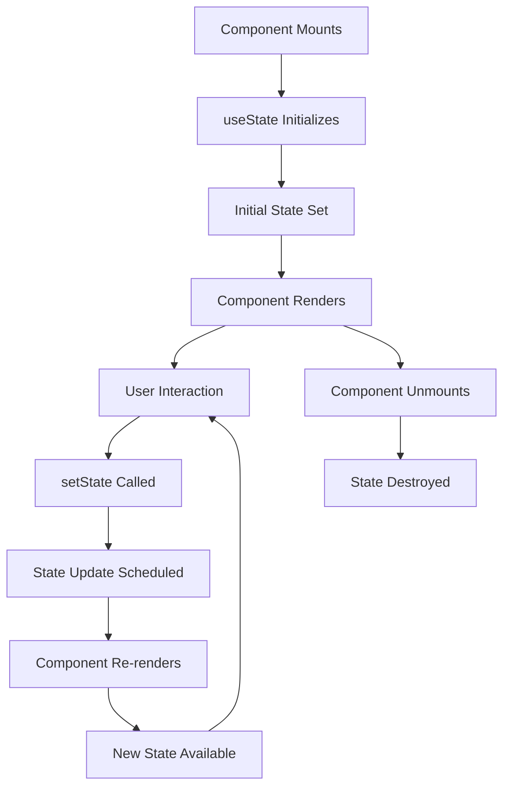
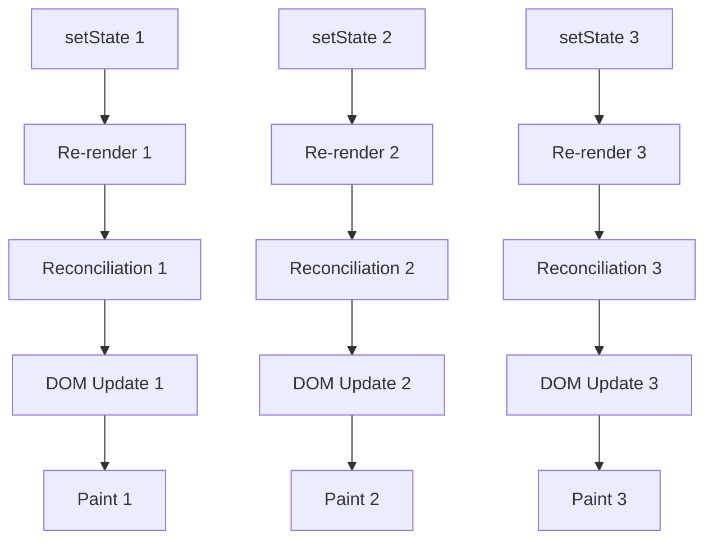
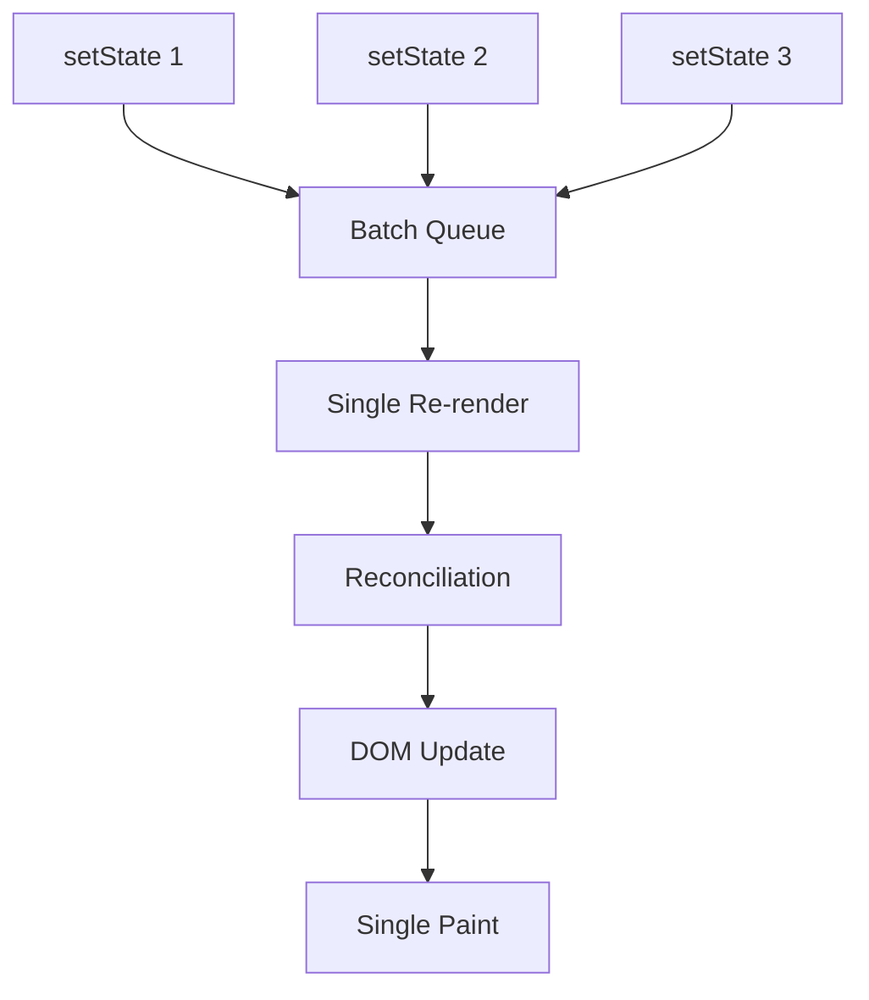

# Topic 12: useState Hook - Managing Component State

[← Previous: Hooks Introduction](./11_hooks_intro.md) | [Back to Main](../README.md) | [Next: useEffect Hook →](./13_useeffect_hook.md)

---

## Table of Contents

1. [Overview](#overview)
2. [useState Basics](#usestate-basics)
3. [State Updates](#state-updates)
4. [Functional Updates](#functional-updates)
5. [Lazy Initialization](#lazy-initialization)
6. [State Batching](#state-batching)
7. [Multiple State Variables](#multiple-state-variables)
8. [State with Objects](#state-with-objects)
9. [State with Arrays](#state-with-arrays)
10. [TypeScript with useState](#typescript-with-usestate)
11. [Performance Considerations](#performance-considerations)
12. [Common Patterns](#common-patterns)

---

## Overview

**useState** is the most fundamental Hook in React. It lets function components have state that persists between renders.

**What You'll Learn:**
- useState syntax and usage patterns
- How state updates work (synchronous vs asynchronous)
- Functional updates for correct state handling
- Lazy initialization for performance
- State batching in React 18+
- Managing complex state (objects, arrays)
- TypeScript best practices
- Common pitfalls and solutions

**Prerequisites:**
- React function components
- JavaScript ES6+ (destructuring, arrow functions)
- Understanding of closures

**Version Coverage:**
- React 16.8+ (useState introduction)
- React 18 (Automatic batching)
- React 19.2 (Latest features)

---

## useState Basics

### Basic Syntax

```tsx
import { useState } from 'react';

function Component() {
  // [currentValue, setterFunction] = useState(initialValue)
  const [state, setState] = useState(initialValue);
  
  return <div>{state}</div>;
}
```

### Simple Examples

```tsx
// Number state
function Counter() {
  const [count, setCount] = useState(0);
  
  return (
    <>
      <p>Count: {count}</p>
      <button onClick={() => setCount(count + 1)}>Increment</button>
    </>
  );
}

// String state
function Input() {
  const [text, setText] = useState('');
  
  return (
    <input 
      value={text}
      onChange={(e) => setText(e.target.value)}
    />
  );
}

// Boolean state
function Toggle() {
  const [isOn, setIsOn] = useState(false);
  
  return (
    <button onClick={() => setIsOn(!isOn)}>
      {isOn ? 'ON' : 'OFF'}
    </button>
  );
}

// Object state
function User() {
  const [user, setUser] = useState({ name: 'Alice', age: 30 });
  
  return <div>{user.name} is {user.age} years old</div>;
}

// Array state
function TodoList() {
  const [todos, setTodos] = useState<string[]>([]);
  
  return (
    <ul>
      {todos.map((todo, i) => <li key={i}>{todo}</li>)}
    </ul>
  );
}
```

### State Lifecycle



---

## State Updates

### Direct Updates

```tsx
function Counter() {
  const [count, setCount] = useState(0);
  
  // Direct value update
  const increment = () => {
    setCount(count + 1);
  };
  
  const decrement = () => {
    setCount(count - 1);
  };
  
  const reset = () => {
    setCount(0);
  };
  
  return (
    <>
      <p>Count: {count}</p>
      <button onClick={increment}>+</button>
      <button onClick={decrement}>-</button>
      <button onClick={reset}>Reset</button>
    </>
  );
}
```

### Updates are Asynchronous

```tsx
function Component() {
  const [count, setCount] = useState(0);
  
  const handleClick = () => {
    setCount(count + 1);
    console.log(count);  // Still shows old value!
    
    // State updates are scheduled, not immediate
    // Console logs old value because state hasn't updated yet
  };
  
  // To see new value, use useEffect
  useEffect(() => {
    console.log('Count changed to:', count);
  }, [count]);
}
```

### Multiple Updates

```tsx
function Component() {
  const [count, setCount] = useState(0);
  
  const handleClick = () => {
    // ❌ This only increments by 1, not 3!
    setCount(count + 1);  // count + 1
    setCount(count + 1);  // count + 1 (still using same count!)
    setCount(count + 1);  // count + 1 (still using same count!)
    
    // All three use the same count value
    // Result: count becomes count + 1
  };
}
```

---

## Functional Updates

### Why Functional Updates?

When the next state depends on the previous state, use **functional updates** to ensure you're working with the latest value.

```tsx
function Counter() {
  const [count, setCount] = useState(0);
  
  // ❌ Problem: Multiple updates in same render
  const increment3Times = () => {
    setCount(count + 1);  // Uses current count
    setCount(count + 1);  // Uses current count (same value!)
    setCount(count + 1);  // Uses current count (same value!)
    // Result: Only increments by 1
  };
  
  // ✅ Solution: Functional updates
  const increment3Times = () => {
    setCount(prev => prev + 1);  // prev is latest
    setCount(prev => prev + 1);  // prev is result of above
    setCount(prev => prev + 1);  // prev is result of above
    // Result: Increments by 3
  };
  
  return (
    <>
      <p>Count: {count}</p>
      <button onClick={increment3Times}>+3</button>
    </>
  );
}
```

### Functional Update Patterns

```tsx
// Toggle boolean
const [flag, setFlag] = useState(false);
setFlag(prev => !prev);

// Increment/decrement
const [count, setCount] = useState(0);
setCount(prev => prev + 1);
setCount(prev => prev - 1);

// Bounded updates
const [count, setCount] = useState(0);
setCount(prev => Math.min(prev + 1, 100));  // Max 100
setCount(prev => Math.max(prev - 1, 0));    // Min 0

// Conditional updates
const [count, setCount] = useState(0);
setCount(prev => prev < 10 ? prev + 1 : prev);
```

### Complex Functional Updates

```tsx
// Update object
const [user, setUser] = useState({ name: 'Alice', age: 30 });

setUser(prev => ({
  ...prev,
  age: prev.age + 1
}));

// Update array
const [items, setItems] = useState<number[]>([]);

setItems(prev => [...prev, newItem]);
setItems(prev => prev.filter(item => item.id !== deleteId));
setItems(prev => prev.map(item => 
  item.id === updateId ? { ...item, done: true } : item
));
```

---

## Lazy Initialization

### The Problem

```tsx
// ❌ Expensive computation runs on EVERY render
function Component() {
  const [state, setState] = useState(expensiveComputation());
  //                                 ^^^^^^^^^^^^^^^^^^^
  // This function is called on every render!
  // Even though we only need the result once
  
  return <div>{state}</div>;
}
```

### The Solution

```tsx
// ✅ Lazy initialization - function runs ONLY on mount
function Component() {
  const [state, setState] = useState(() => expensiveComputation());
  //                                 ^^^^
  // Function is called only once on initial render
  
  return <div>{state}</div>;
}
```

### Real-World Examples

```tsx
// Example 1: Reading from localStorage
function Component() {
  const [preferences, setPreferences] = useState(() => {
    const saved = localStorage.getItem('preferences');
    return saved ? JSON.parse(saved) : defaultPreferences;
  });
  
  // localStorage only read once on mount
}

// Example 2: Complex initial state
function Component({ config }) {
  const [state, setState] = useState(() => {
    // Complex computation
    const processed = processConfig(config);
    const validated = validateConfig(processed);
    return buildInitialState(validated);
  });
  
  // Computation only runs once
}

// Example 3: Large data structure
function Component() {
  const [data, setData] = useState(() => {
    return Array.from({ length: 10000 }, (_, i) => ({
      id: i,
      value: Math.random()
    }));
  });
  
  // Large array only created once
}
```

### When to Use Lazy Initialization

```tsx
// ✅ Use lazy initialization when:
// - Initial value is expensive to compute
// - Reading from localStorage/sessionStorage
// - Creating large data structures
// - Parsing JSON
// - Complex computations

// ❌ Don't use for simple values:
const [count, setCount] = useState(() => 0);  // Overkill!
const [name, setName] = useState(() => '');   // Unnecessary!

// ✅ Just use direct values:
const [count, setCount] = useState(0);
const [name, setName] = useState('');
```

---

## State Batching

### React 18+ Automatic Batching

```tsx
function Component() {
  const [count, setCount] = useState(0);
  const [flag, setFlag] = useState(false);
  
  const handleClick = () => {
    // React 18+: Both updates batched into single re-render
    setCount(count + 1);
    setFlag(!flag);
    
    // Only ONE re-render happens
  };
  
  // Even in async code!
  const handleAsync = async () => {
    await fetchData();
    
    // React 18+: Still batched!
    setCount(count + 1);
    setFlag(!flag);
    
    // Single re-render
  };
  
  // In setTimeout
  setTimeout(() => {
    // React 18+: Batched!
    setCount(count + 1);
    setFlag(!flag);
  }, 1000);
}
```

### Before React 18

```tsx
// React 17 and earlier:
function Component() {
  const [count, setCount] = useState(0);
  const [flag, setFlag] = useState(false);
  
  const handleClick = () => {
    // React 17: Batched in React event handlers
    setCount(count + 1);
    setFlag(!flag);
    // Single re-render
  };
  
  const handleAsync = async () => {
    await fetchData();
    
    // React 17: NOT batched!
    setCount(count + 1);  // Re-render #1
    setFlag(!flag);       // Re-render #2
    // Two re-renders
  };
}
```

### Opt Out of Batching (React 18+)

```tsx
import { flushSync } from 'react-dom';

function Component() {
  const [count, setCount] = useState(0);
  const [flag, setFlag] = useState(false);
  
  const handleClick = () => {
    flushSync(() => {
      setCount(count + 1);  // Immediate re-render
    });
    
    setFlag(!flag);  // Separate re-render
    
    // Two re-renders (opt out of batching)
  };
}
```

---

## Multiple State Variables

### When to Split State

```tsx
// ✅ Split: Independent values
function Component() {
  const [name, setName] = useState('');
  const [email, setEmail] = useState('');
  const [age, setAge] = useState(0);
  
  // Each can update independently
}

// ✅ Combine: Related values
function Component() {
  const [position, setPosition] = useState({ x: 0, y: 0 });
  
  // x and y always update together
}
```

### State Organization Strategies

```tsx
// Strategy 1: Flat structure (simple)
function Component() {
  const [loading, setLoading] = useState(false);
  const [error, setError] = useState(null);
  const [data, setData] = useState(null);
  
  // Easy to update individual pieces
  setLoading(true);
  setError(null);
}

// Strategy 2: Grouped structure (related data)
function Component() {
  const [state, setState] = useState({
    loading: false,
    error: null,
    data: null
  });
  
  // Must spread to update
  setState({ ...state, loading: true });
}

// Strategy 3: useReducer (complex logic)
function Component() {
  const [state, dispatch] = useReducer(reducer, initialState);
  
  dispatch({ type: 'FETCH_START' });
  dispatch({ type: 'FETCH_SUCCESS', payload: data });
}
```

---

## State with Objects

### Updating Objects Correctly

```tsx
function UserProfile() {
  const [user, setUser] = useState({
    name: 'Alice',
    age: 30,
    email: 'alice@example.com'
  });
  
  // ❌ WRONG: Mutates existing object
  const updateName = (newName) => {
    user.name = newName;  // Don't do this!
    setUser(user);        // React won't detect change
  };
  
  // ✅ CORRECT: Create new object
  const updateName = (newName) => {
    setUser({
      ...user,
      name: newName
    });
  };
  
  // ✅ Update multiple fields
  const updateUser = () => {
    setUser({
      ...user,
      name: 'Bob',
      age: 31
    });
  };
  
  // ✅ Functional update
  const incrementAge = () => {
    setUser(prev => ({
      ...prev,
      age: prev.age + 1
    }));
  };
}
```

### Nested Objects

```tsx
function Component() {
  const [user, setUser] = useState({
    name: 'Alice',
    address: {
      street: '123 Main St',
      city: 'New York',
      country: 'USA'
    }
  });
  
  // Update nested property
  const updateCity = (newCity) => {
    setUser({
      ...user,
      address: {
        ...user.address,
        city: newCity
      }
    });
  };
  
  // Multiple nested levels
  const updateNestedProperty = () => {
    setUser(prev => ({
      ...prev,
      address: {
        ...prev.address,
        city: 'San Francisco'
      }
    }));
  };
}
```

### Immer for Nested Updates

```tsx
import { useImmer } from 'use-immer';

function Component() {
  const [user, updateUser] = useImmer({
    name: 'Alice',
    address: {
      city: 'New York'
    }
  });
  
  // ✅ Mutate draft (Immer handles immutability)
  const updateCity = (newCity) => {
    updateUser(draft => {
      draft.address.city = newCity;  // Looks like mutation!
    });
  };
  
  // Much cleaner for deeply nested updates
}
```

---

## State with Arrays

### Array Operations

```tsx
function TodoList() {
  const [todos, setTodos] = useState<string[]>([]);
  
  // Add item to end
  const addTodo = (text: string) => {
    setTodos([...todos, text]);
  };
  
  // Add item to beginning
  const addTodoAtStart = (text: string) => {
    setTodos([text, ...todos]);
  };
  
  // Remove item by index
  const removeTodo = (index: number) => {
    setTodos(todos.filter((_, i) => i !== index));
  };
  
  // Update item by index
  const updateTodo = (index: number, newText: string) => {
    setTodos(todos.map((todo, i) => 
      i === index ? newText : todo
    ));
  };
  
  // Insert at position
  const insertAt = (index: number, text: string) => {
    setTodos([
      ...todos.slice(0, index),
      text,
      ...todos.slice(index)
    ]);
  };
  
  // Clear all
  const clearTodos = () => {
    setTodos([]);
  };
  
  // Replace entire array
  const replaceTodos = (newTodos: string[]) => {
    setTodos(newTodos);
  };
}
```

### Array of Objects

```tsx
interface Todo {
  id: number;
  text: string;
  completed: boolean;
}

function TodoList() {
  const [todos, setTodos] = useState<Todo[]>([]);
  
  // Add todo
  const addTodo = (text: string) => {
    const newTodo: Todo = {
      id: Date.now(),
      text,
      completed: false
    };
    
    setTodos([...todos, newTodo]);
  };
  
  // Toggle completed
  const toggleTodo = (id: number) => {
    setTodos(todos.map(todo =>
      todo.id === id
        ? { ...todo, completed: !todo.completed }
        : todo
    ));
  };
  
  // Delete todo
  const deleteTodo = (id: number) => {
    setTodos(todos.filter(todo => todo.id !== id));
  };
  
  // Update text
  const updateTodoText = (id: number, newText: string) => {
    setTodos(todos.map(todo =>
      todo.id === id
        ? { ...todo, text: newText }
        : todo
    ));
  };
  
  // Sort todos
  const sortTodos = () => {
    setTodos([...todos].sort((a, b) => a.text.localeCompare(b.text)));
  };
}
```

---

## TypeScript with useState

### Type Inference

```tsx
// TypeScript infers type from initial value
const [count, setCount] = useState(0);          // number
const [name, setName] = useState('Alice');      // string
const [isActive, setIsActive] = useState(true); // boolean
const [items, setItems] = useState([1, 2, 3]); // number[]
```

### Explicit Type Annotations

```tsx
// When type can't be inferred
const [user, setUser] = useState<User | null>(null);

// Union types
const [status, setStatus] = useState<'idle' | 'loading' | 'success' | 'error'>('idle');

// Array of specific type
const [users, setUsers] = useState<User[]>([]);

// Complex types
interface FormData {
  name: string;
  email: string;
  age: number;
}

const [form, setForm] = useState<FormData>({
  name: '',
  email: '',
  age: 0
});
```

### Generic State

```tsx
// Generic Hook wrapper
function useArray<T>(initial: T[] = []) {
  const [items, setItems] = useState<T[]>(initial);
  
  const add = (item: T) => {
    setItems(prev => [...prev, item]);
  };
  
  const remove = (index: number) => {
    setItems(prev => prev.filter((_, i) => i !== index));
  };
  
  const clear = () => {
    setItems([]);
  };
  
  return { items, add, remove, clear };
}

// Usage
interface Todo {
  id: number;
  text: string;
}

function TodoList() {
  const { items: todos, add, remove } = useArray<Todo>([]);
  
  return (
    <>
      {todos.map((todo, index) => (
        <div key={todo.id}>
          {todo.text}
          <button onClick={() => remove(index)}>Delete</button>
        </div>
      ))}
      <button onClick={() => add({ id: Date.now(), text: 'New todo' })}>
        Add
      </button>
    </>
  );
}
```

---

## Performance Considerations

### Avoiding Unnecessary Re-renders

```tsx
// ❌ Object/array recreated every render
function Component() {
  const [user, setUser] = useState({ name: 'Alice' });
  
  // New object every render! Causes child re-renders
  return <ChildComponent user={user} />;
}

// ✅ Only update when actually changed
function Component() {
  const [user, setUser] = useState({ name: 'Alice' });
  
  const updateName = (newName) => {
    // Only update if different
    if (user.name !== newName) {
      setUser({ ...user, name: newName });
    }
  };
}
```

### State Initialization Cost

```tsx
// ❌ Expensive computation on every render
function Component() {
  const [data, setData] = useState(Array(10000).fill(0).map((_, i) => i));
  // Array created on every render, then thrown away!
}

// ✅ Lazy initialization
function Component() {
  const [data, setData] = useState(() => 
    Array(10000).fill(0).map((_, i) => i)
  );
  // Array created only once
}
```

---

## Common Patterns

### Toggle Pattern

```tsx
function useToggle(initialValue = false) {
  const [value, setValue] = useState(initialValue);
  
  const toggle = () => setValue(prev => !prev);
  const setTrue = () => setValue(true);
  const setFalse = () => setValue(false);
  
  return { value, toggle, setTrue, setFalse };
}

// Usage
function Modal() {
  const { value: isOpen, toggle, setTrue, setFalse } = useToggle(false);
  
  return (
    <>
      <button onClick={setTrue}>Open Modal</button>
      {isOpen && (
        <div className="modal">
          <button onClick={setFalse}>Close</button>
        </div>
      )}
    </>
  );
}
```

### Counter with Bounds

```tsx
function useCounter(initial = 0, min = 0, max = 100) {
  const [count, setCount] = useState(initial);
  
  const increment = () => setCount(prev => Math.min(prev + 1, max));
  const decrement = () => setCount(prev => Math.max(prev - 1, min));
  const reset = () => setCount(initial);
  const set = (value: number) => setCount(Math.max(min, Math.min(value, max)));
  
  return { count, increment, decrement, reset, set };
}
```

### Previous Value Tracking

```tsx
function usePrevious<T>(value: T): T | undefined {
  const ref = useRef<T>();
  
  useEffect(() => {
    ref.current = value;
  }, [value]);
  
  return ref.current;
}

// Usage
function Component({ count }) {
  const previousCount = usePrevious(count);
  
  return (
    <div>
      <p>Current: {count}</p>
      <p>Previous: {previousCount}</p>
      <p>Changed by: {count - (previousCount || 0)}</p>
    </div>
  );
}
```

---

## Higher-Order Thinking FAQs

### 1. Why does useState return an array instead of an object, and what are the implications for developer experience?

**Deep Answer:**

The array return pattern enables **flexible naming** through destructuring, but comes with tradeoffs.

**Array Destructuring (React's Choice):**

```tsx
// ✅ Name however you want
const [count, setCount] = useState(0);
const [user, setUser] = useState(null);
const [isLoading, setIsLoading] = useState(false);

// Multiple instances with different names
const [email, setEmail] = useState('');
const [password, setPassword] = useState('');
```

**If useState Returned Object:**

```tsx
// Hypothetical object return
const { state: count, setState: setCount } = useState(0);

// ❌ More verbose with renaming
const { state: email, setState: setEmail } = useState('');

// ❌ Can't use multiple instances easily
const { state, setState } = useState(0);  // What to name these?
const { state, setState } = useState(''); // Name collision!
```

**The Design Insight:**

```tsx
// Arrays enable clean patterns
const [a, setA] = useState(0);
const [b, setB] = useState(1);
const [c, setC] = useState(2);

// vs objects requiring explicit names
const { stateA, setStateA } = useState(0);
const { stateB, setStateB } = useState(1);
```

**Trade-off:**

- ✅ **Flexibility**: Name elements anything
- ✅ **Conciseness**: No explicit property names
- ✅ **Multiple instances**: No name collisions
- ❌ **Order matters**: Can't skip elements
- ❌ **IDE hints**: Less descriptive (just [0] and [1])

**Deep Implication:**

React prioritized **ergonomics** for the common case (multiple state variables with custom names) over the uncommon case (accessing setter without state). The array pattern encourages you to use separate useState calls for unrelated data.

### 2. Why does React batch state updates, and how does this interact with event loops and microtasks?

**Deep Answer:**

State batching is a **performance optimization** that leverages JavaScript's event loop to minimize expensive DOM operations.

**Without Batching:**



**With Batching:**



**Event Loop Integration:**

```tsx
// React 18+ batching mechanism
function handleClick() {
  // All updates in same execution context are batched
  setCount(count + 1);    // Queued
  setFlag(!flag);         // Queued
  setName('New name');    // Queued
  
  // Synchronous code continues...
  console.log('Updates queued');
  
  // At end of execution context:
  // React flushes all queued updates
  // Single re-render happens
}

// Even in promises/async
async function handleAsync() {
  await fetchData();
  
  // React 18+: Still batched!
  setCount(count + 1);  // Queued
  setFlag(!flag);       // Queued
  // Single re-render
}
```

**Micro
