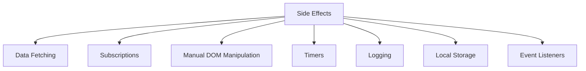
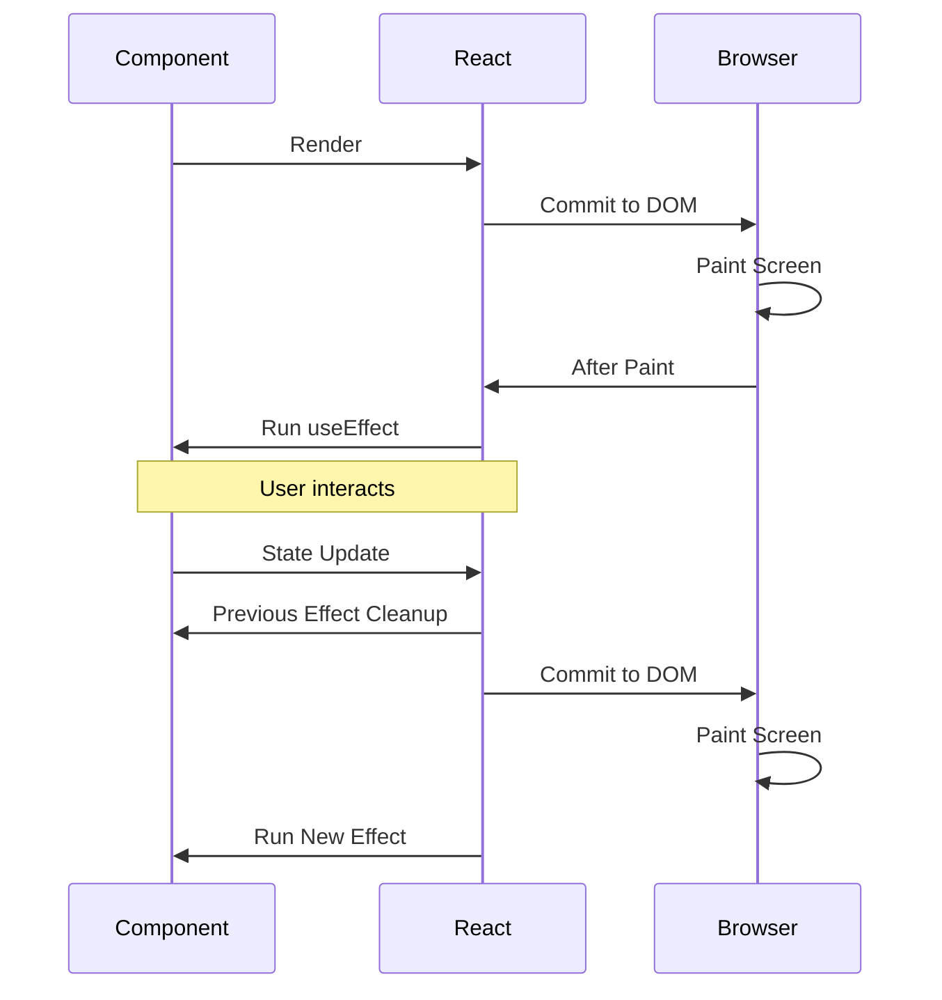
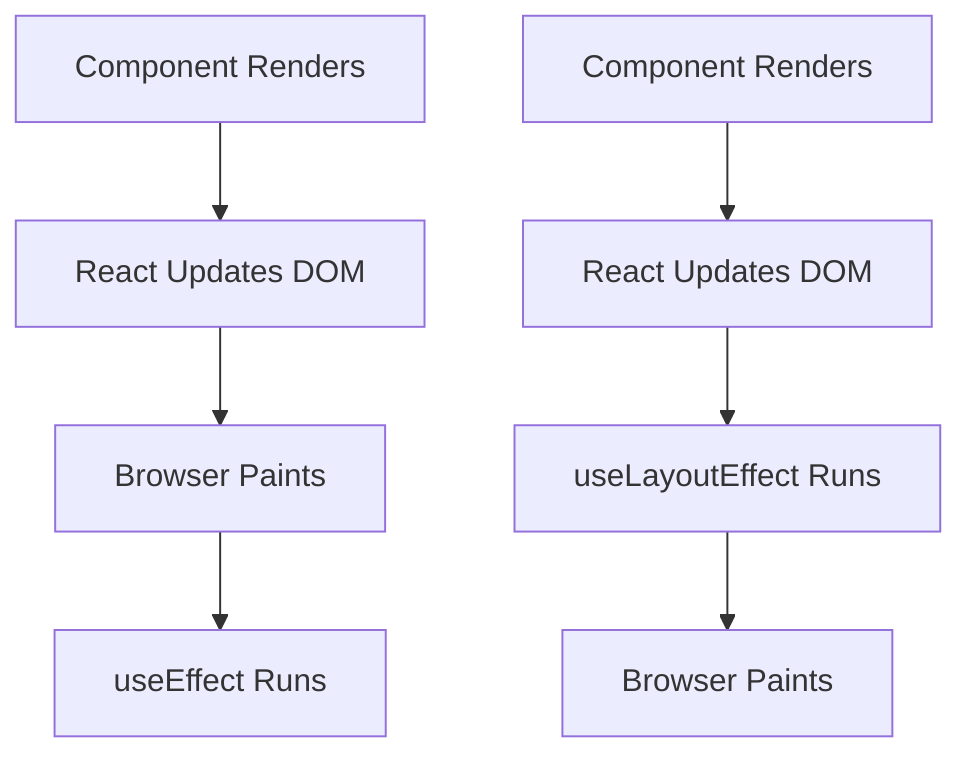
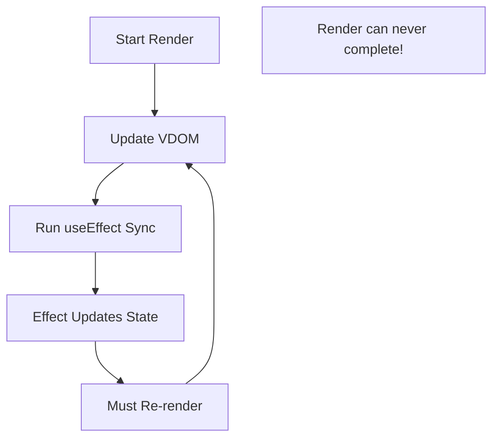
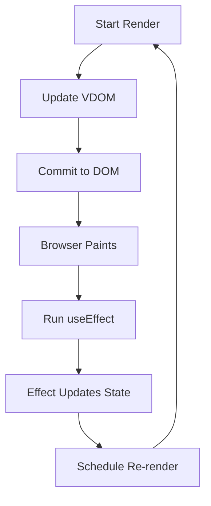

# Topic 13: useEffect Hook - Side Effects & Lifecycle

[← Previous: useState Hook](./12_usestate_hook.md) | [Back to Main](../README.md) | [Next: useContext Hook →](./14_usecontext_hook.md)

---

## Table of Contents

1. [Overview](#overview)
2. [What are Side Effects?](#what-are-side-effects)
3. [useEffect Basics](#useeffect-basics)
4. [Dependency Array](#dependency-array)
5. [Cleanup Functions](#cleanup-functions)
6. [Common Use Cases](#common-use-cases)
7. [useEffect vs useLayoutEffect](#useeffect-vs-uselayouteffect)
8. [Multiple Effects](#multiple-effects)
9. [Effect Dependencies](#effect-dependencies)
10. [Common Pitfalls](#common-pitfalls)
11. [Performance Optimization](#performance-optimization)
12. [React 18 Changes](#react-18-changes)

---

## Overview

**useEffect** is the Hook for performing side effects in function components. It combines the functionality of `componentDidMount`, `componentDidUpdate`, and `componentWillUnmount` from class components.

**What You'll Learn:**
- What side effects are and when to use useEffect
- Dependency array and how it controls when effects run
- Cleanup functions for preventing memory leaks
- Common use cases (data fetching, subscriptions, timers)
- useEffect vs useLayoutEffect differences
- Best practices and common pitfalls
- React 18 Strict Mode behavior

**Prerequisites:**
- useState Hook
- Understanding of component lifecycle
- JavaScript closures and async/await

**Version Coverage:**
- React 16.8+ (useEffect introduction)
- React 18 (Strict Mode double invocation)
- React 19.2

---

## What are Side Effects?

### Pure vs Impure Functions

```tsx
// Pure function (no side effects)
function add(a, b) {
  return a + b;  // Same inputs always return same output
}

// Impure function (has side effects)
function addAndLog(a, b) {
  console.log('Adding:', a, b);  // Side effect: logging
  return a + b;
}

function addAndSave(a, b) {
  const result = a + b;
  localStorage.setItem('result', result);  // Side effect: storage
  return result;
}
```

### Side Effects in React



**Common Side Effects:**
- 📡 Fetching data from APIs
- 🔔 Setting up subscriptions
- ⏱️ Starting timers and intervals
- 🎯 Manually changing the DOM
- 💾 Reading/writing localStorage
- 📊 Tracking analytics
- 🎧 Adding event listeners to window/document

---

## useEffect Basics

### Basic Syntax

```tsx
import { useEffect } from 'react';

function Component() {
  useEffect(() => {
    // Effect code here
    
    return () => {
      // Cleanup code (optional)
    };
  }, [dependencies]);  // Dependency array (optional)
  
  return <div>Component</div>;
}
```

### Simple Example

```tsx
function DocumentTitle() {
  const [count, setCount] = useState(0);
  
  // Update document title
  useEffect(() => {
    document.title = `Count: ${count}`;
  }, [count]);  // Re-run when count changes
  
  return (
    <button onClick={() => setCount(count + 1)}>
      Increment: {count}
    </button>
  );
}
```

### Effect Execution Timeline



---

## Dependency Array

### No Dependencies

```tsx
// Runs after EVERY render
useEffect(() => {
  console.log('Component rendered');
});
// No dependency array = runs every time
```

### Empty Dependencies

```tsx
// Runs ONCE after mount
useEffect(() => {
  console.log('Component mounted');
  
  return () => {
    console.log('Component unmounted');
  };
}, []);  // Empty array = run once
```

### With Dependencies

```tsx
// Runs when dependencies change
function UserProfile({ userId }) {
  const [user, setUser] = useState(null);
  
  useEffect(() => {
    fetchUser(userId).then(setUser);
  }, [userId]);  // Re-run when userId changes
}
```

### Dependency Patterns

| Dependencies | When Effect Runs | Common Use |
|--------------|------------------|------------|
| `undefined` (none) | After every render | Logging, debugging |
| `[]` (empty) | Once on mount | Setup, subscriptions |
| `[a, b]` (values) | When a or b changes | Data fetching, sync |

---

## Cleanup Functions

### Why Cleanup?

Cleanup prevents **memory leaks** and **stale subscriptions**.

```tsx
// ❌ Without cleanup (memory leak!)
function Component() {
  useEffect(() => {
    const timer = setInterval(() => {
      console.log('Tick');
    }, 1000);
    
    // When component unmounts, timer keeps running!
  }, []);
}

// ✅ With cleanup
function Component() {
  useEffect(() => {
    const timer = setInterval(() => {
      console.log('Tick');
    }, 1000);
    
    return () => {
      clearInterval(timer);  // Cleanup!
    };
  }, []);
}
```

### Cleanup Execution

```tsx
function Component({ userId }) {
  useEffect(() => {
    console.log('Effect: Subscribe to user', userId);
    const subscription = subscribeToUser(userId);
    
    return () => {
      console.log('Cleanup: Unsubscribe from user', userId);
      subscription.unsubscribe();
    };
  }, [userId]);
}

// Timeline:
// 1. Component mounts with userId=1
//    → Effect runs: "Subscribe to user 1"
//
// 2. userId changes to 2
//    → Cleanup runs: "Unsubscribe from user 1"
//    → Effect runs: "Subscribe to user 2"
//
// 3. Component unmounts
//    → Cleanup runs: "Unsubscribe from user 2"
```

### Common Cleanup Scenarios

```tsx
// Timers
useEffect(() => {
  const timer = setTimeout(() => {}, 1000);
  return () => clearTimeout(timer);
}, []);

// Intervals
useEffect(() => {
  const interval = setInterval(() => {}, 1000);
  return () => clearInterval(interval);
}, []);

// Event listeners
useEffect(() => {
  const handleResize = () => {};
  window.addEventListener('resize', handleResize);
  return () => window.removeEventListener('resize', handleResize);
}, []);

// Subscriptions
useEffect(() => {
  const subscription = subscribe();
  return () => subscription.unsubscribe();
}, []);

// Abort fetch
useEffect(() => {
  const controller = new AbortController();
  
  fetch('/api/data', { signal: controller.signal })
    .then(res => res.json())
    .then(setData);
  
  return () => controller.abort();
}, []);
```

---

## Common Use Cases

### Data Fetching

```tsx
function UserProfile({ userId }) {
  const [user, setUser] = useState(null);
  const [loading, setLoading] = useState(true);
  const [error, setError] = useState(null);
  
  useEffect(() => {
    // Reset state
    setLoading(true);
    setError(null);
    
    // Fetch data
    fetch(`/api/users/${userId}`)
      .then(res => res.json())
      .then(data => {
        setUser(data);
        setLoading(false);
      })
      .catch(err => {
        setError(err);
        setLoading(false);
      });
  }, [userId]);
  
  if (loading) return <div>Loading...</div>;
  if (error) return <div>Error: {error.message}</div>;
  if (!user) return <div>No user found</div>;
  
  return <div>{user.name}</div>;
}
```

### Subscriptions

```tsx
function ChatRoom({ roomId }) {
  const [messages, setMessages] = useState([]);
  
  useEffect(() => {
    // Subscribe
    const socket = connectToRoom(roomId);
    
    socket.on('message', (message) => {
      setMessages(prev => [...prev, message]);
    });
    
    // Cleanup: Unsubscribe
    return () => {
      socket.disconnect();
    };
  }, [roomId]);
  
  return (
    <div>
      {messages.map((msg, i) => (
        <div key={i}>{msg}</div>
      ))}
    </div>
  );
}
```

### Timers

```tsx
function Timer() {
  const [seconds, setSeconds] = useState(0);
  
  useEffect(() => {
    const interval = setInterval(() => {
      setSeconds(prev => prev + 1);
    }, 1000);
    
    return () => clearInterval(interval);
  }, []);  // Empty deps: interval never recreated
  
  return <div>Seconds: {seconds}</div>;
}
```

### Event Listeners

```tsx
function WindowSize() {
  const [size, setSize] = useState({
    width: window.innerWidth,
    height: window.innerHeight
  });
  
  useEffect(() => {
    const handleResize = () => {
      setSize({
        width: window.innerWidth,
        height: window.innerHeight
      });
    };
    
    window.addEventListener('resize', handleResize);
    
    return () => {
      window.removeEventListener('resize', handleResize);
    };
  }, []);
  
  return <div>{size.width} x {size.height}</div>;
}
```

### localStorage Sync

```tsx
function useLocalStorageState(key, initialValue) {
  const [state, setState] = useState(() => {
    const saved = localStorage.getItem(key);
    return saved ? JSON.parse(saved) : initialValue;
  });
  
  useEffect(() => {
    localStorage.setItem(key, JSON.stringify(state));
  }, [key, state]);
  
  return [state, setState];
}

// Usage
function Component() {
  const [name, setName] = useLocalStorageState('name', '');
  
  return (
    <input 
      value={name}
      onChange={(e) => setName(e.target.value)}
    />
  );
}
```

---

## useEffect vs useLayoutEffect

### Execution Timing



### When to Use Each

```tsx
// ✅ useEffect (99% of cases)
useEffect(() => {
  // Data fetching
  // Subscriptions
  // Most side effects
}, []);

// ✅ useLayoutEffect (rare cases)
useLayoutEffect(() => {
  // Read layout
  // Mutate DOM before paint
  // Prevent flicker
}, []);
```

### useLayoutEffect Example

```tsx
// Measure DOM element
function Component() {
  const ref = useRef<HTMLDivElement>(null);
  const [height, setHeight] = useState(0);
  
  // ✅ Use useLayoutEffect to measure before paint
  useLayoutEffect(() => {
    if (ref.current) {
      setHeight(ref.current.clientHeight);
    }
  }, []);
  
  return (
    <>
      <div ref={ref}>Content to measure</div>
      <p>Height: {height}px</p>
    </>
  );
}
```

---

## Multiple Effects

### Separation of Concerns

```tsx
// ✅ Separate effects for different concerns
function ChatRoom({ roomId, userId }) {
  // Effect 1: Chat subscription
  useEffect(() => {
    const chatSub = subscribeToChat(roomId);
    return () => chatSub.unsubscribe();
  }, [roomId]);
  
  // Effect 2: Online status
  useEffect(() => {
    const statusSub = subscribeToOnlineStatus(userId);
    return () => statusSub.unsubscribe();
  }, [userId]);
  
  // Effect 3: Analytics
  useEffect(() => {
    analytics.track('room_viewed', { roomId, userId });
  }, [roomId, userId]);
  
  // Each effect has its own lifecycle and dependencies
}
```

### Effect Order

```tsx
function Component() {
  useEffect(() => {
    console.log('Effect 1');
    return () => console.log('Cleanup 1');
  });
  
  useEffect(() => {
    console.log('Effect 2');
    return () => console.log('Cleanup 2');
  });
  
  useEffect(() => {
    console.log('Effect 3');
    return () => console.log('Cleanup 3');
  });
}

// First render:
// Effect 1
// Effect 2
// Effect 3

// On update:
// Cleanup 1
// Cleanup 2
// Cleanup 3
// Effect 1
// Effect 2
// Effect 3

// On unmount:
// Cleanup 1
// Cleanup 2
// Cleanup 3
```

---

## Effect Dependencies

### Exhaustive Dependencies Rule

```tsx
// ❌ Missing dependencies
function Component({ userId }) {
  const [count, setCount] = useState(0);
  
  useEffect(() => {
    console.log(userId, count);
  }, []);  // ESLint warning: missing userId and count
  
  // Won't re-run when userId or count changes
}

// ✅ Include all dependencies
function Component({ userId }) {
  const [count, setCount] = useState(0);
  
  useEffect(() => {
    console.log(userId, count);
  }, [userId, count]);  // ✅ Correct
}
```

### Object/Array Dependencies

```tsx
// ❌ Object recreated every render
function Component({ user }) {
  const options = { userId: user.id };  // New object each render
  
  useEffect(() => {
    fetchData(options);
  }, [options]);  // Effect runs every render! options is always "different"
}

// ✅ Use primitive dependencies
function Component({ user }) {
  useEffect(() => {
    const options = { userId: user.id };
    fetchData(options);
  }, [user.id]);  // Only re-run when user.id changes
}

// ✅ Or memoize object
function Component({ user }) {
  const options = useMemo(
    () => ({ userId: user.id }),
    [user.id]
  );
  
  useEffect(() => {
    fetchData(options);
  }, [options]);  // options only changes when user.id changes
}
```

### Function Dependencies

```tsx
// ❌ Function recreated every render
function Component() {
  const handleEvent = () => {
    console.log('Event');
  };
  
  useEffect(() => {
    window.addEventListener('click', handleEvent);
    return () => window.removeEventListener('click', handleEvent);
  }, [handleEvent]);  // Effect runs every render!
}

// ✅ Define function inside effect
function Component() {
  useEffect(() => {
    const handleEvent = () => {
      console.log('Event');
    };
    
    window.addEventListener('click', handleEvent);
    return () => window.removeEventListener('click', handleEvent);
  }, []);  // No dependencies needed
}

// ✅ Or use useCallback
function Component() {
  const handleEvent = useCallback(() => {
    console.log('Event');
  }, []);
  
  useEffect(() => {
    window.addEventListener('click', handleEvent);
    return () => window.removeEventListener('click', handleEvent);
  }, [handleEvent]);  // handleEvent is stable
}
```

---

## Common Pitfalls

### Infinite Loop

```tsx
// ❌ Infinite loop!
function Component() {
  const [count, setCount] = useState(0);
  
  useEffect(() => {
    setCount(count + 1);  // Updates state
  });  // No deps = runs after every render
  
  // Loop: render → effect → setState → render → effect → ...
}

// ✅ Add dependency array
function Component() {
  const [count, setCount] = useState(0);
  
  useEffect(() => {
    // Only runs once
    setCount(count + 1);
  }, []);  // Empty deps = runs once
}
```

### Stale Closures

```tsx
// ❌ Stale closure
function Component() {
  const [count, setCount] = useState(0);
  
  useEffect(() => {
    const timer = setInterval(() => {
      console.log(count);  // Always logs initial count!
    }, 1000);
    
    return () => clearInterval(timer);
  }, []);  // count is "captured" and never updates
}

// ✅ Solution 1: Include dependency
function Component() {
  const [count, setCount] = useState(0);
  
  useEffect(() => {
    const timer = setInterval(() => {
      console.log(count);  // Logs current count
    }, 1000);
    
    return () => clearInterval(timer);
  }, [count]);  // Re-create interval when count changes
}

// ✅ Solution 2: Use ref
function Component() {
  const [count, setCount] = useState(0);
  const countRef = useRef(count);
  
  useEffect(() => {
    countRef.current = count;
  }, [count]);
  
  useEffect(() => {
    const timer = setInterval(() => {
      console.log(countRef.current);  // Always current value
    }, 1000);
    
    return () => clearInterval(timer);
  }, []);
}
```

### Race Conditions

```tsx
// ❌ Race condition
function UserProfile({ userId }) {
  const [user, setUser] = useState(null);
  
  useEffect(() => {
    fetchUser(userId).then(setUser);
  }, [userId]);
  
  // If userId changes quickly:
  // Request 1 (userId=1) starts
  // Request 2 (userId=2) starts
  // Request 2 completes → setUser(user2)
  // Request 1 completes → setUser(user1)  // Wrong user displayed!
}

// ✅ Solution: Ignore stale responses
function UserProfile({ userId }) {
  const [user, setUser] = useState(null);
  
  useEffect(() => {
    let ignore = false;
    
    fetchUser(userId).then(data => {
      if (!ignore) {
        setUser(data);
      }
    });
    
    return () => {
      ignore = true;  // Ignore if component unmounts or userId changes
    };
  }, [userId]);
}

// ✅ Modern solution: AbortController
function UserProfile({ userId }) {
  const [user, setUser] = useState(null);
  
  useEffect(() => {
    const controller = new AbortController();
    
    fetch(`/api/users/${userId}`, { signal: controller.signal })
      .then(res => res.json())
      .then(setUser)
      .catch(err => {
        if (err.name !== 'AbortError') {
          console.error(err);
        }
      });
    
    return () => controller.abort();
  }, [userId]);
}
```

---

## Performance Optimization

### Skip Effects

```tsx
// Run effect only when specific value changes
function Component({ config }) {
  useEffect(() => {
    expensiveOperation();
  }, [config.importantField]);  // Only this field matters
  
  // Effect won't run if other config fields change
}
```

### Memoize Dependencies

```tsx
// ❌ Effect runs on every render
function Component({ user }) {
  useEffect(() => {
    fetchData({ userId: user.id, name: user.name });
  }, [user]);  // user object changes every render
}

// ✅ Use only needed fields
function Component({ user }) {
  useEffect(() => {
    fetchData({ userId: user.id, name: user.name });
  }, [user.id, user.name]);  // Only these fields
}
```

---

## React 18 Changes

### Strict Mode Double Invocation

```tsx
// React 18 Strict Mode behavior
function Component() {
  useEffect(() => {
    console.log('Effect');
    return () => console.log('Cleanup');
  }, []);
}

// Development (Strict Mode):
// Mount:
//   1. Effect runs
//   2. Cleanup runs  (React 18 addition!)
//   3. Effect runs again
//
// Production:
// Mount:
//   1. Effect runs (only once)
```

**Why?** Helps catch missing cleanup functions.

```tsx
// ❌ This will leak in production
useEffect(() => {
  subscribeToEvents();
  // Missing cleanup!
}, []);

// React 18 Strict Mode exposes this:
// - Subscribes
// - Cleanup (no-op, missing cleanup function)
// - Subscribes again
// - Double subscription leak visible in development
```

---

## Higher-Order Thinking FAQs

### 1. Why does useEffect run after render instead of during, and what would break if it ran synchronously?

**Deep Answer:**

useEffect's **asynchronous execution** is crucial for React's rendering performance and enables non-blocking updates.

**If useEffect Ran Synchronously:**



**Actual Async Behavior:**



**Problems with Sync Effects:**

```tsx
// If effects ran synchronously:
function Component() {
  const [count, setCount] = useState(0);
  
  useEffect(() => {
    if (count < 10) {
      setCount(count + 1);  // Update state
    }
  });  // No deps
  
  return <div>{count}</div>;
}

// Timeline (if sync):
// 1. Render with count=0
// 2. Effect runs (sync)
// 3. Effect calls setCount(1)
// 4. Must re-render immediately
// 5. Render with count=1
// 6. Effect runs (sync)
// 7. ... infinite loop blocks UI!

// Timeline (actual async):
// 1. Render with count=0
// 2. Commit and paint
// 3. User sees UI with count=0
// 4. Effect runs
// 5. setCount(1) schedules update
// 6. New render happens
// UI never blocks!
```

**Deep Implication:**

Async effects allow React to **batch DOM updates** and **keep UI responsive**. The tradeoff is you can't rely on immediate side effect execution, but you gain a non-blocking UI. This is why reading layout info needs useLayoutEffect (which IS synchronous).

### 2. Why do effects with empty dependencies still run twice in React 18 Strict Mode, and what bugs does this catch?

**Deep Answer:**

React 18's **double invocation** in Strict Mode is a **development-only** behavior designed to expose bugs related to missing cleanup logic.

**The Pattern:**

```tsx
// Your code:
useEffect(() => {
  console.log('Setup');
  return () => console.log('Cleanup');
}, []);

// React 18 Strict Mode does:
// 1. Setup (first mount)
// 2. Cleanup (simulated unmount)
// 3. Setup (remount)

// Production does:
// 1. Setup (only once)
```

**Bugs It Catches:**

```tsx
// Bug 1: Missing cleanup
let subscription;

useEffect(() => {
  subscription = subscribeToEvents();
  // ❌ No cleanup!
}, []);

// Strict Mode:
// 1. Subscribes (subscription #1)
// 2. No cleanup runs
// 3. Subscribes again (subscription #2)
// → Double subscription! Memory leak visible immediately

// Fix:
useEffect(() => {
  const subscription = subscribeToEvents();
  return () => subscription.unsubscribe();  // ✅ Cleanup
}, []);
```

```tsx
// Bug 2: Non-idempotent effects
useEffect(() => {
  globalCounter++;  // ❌ Mutates global state
}, []);

// Strict Mode:
// 1. globalCounter++ (count = 1)
// 2. Cleanup (no-op)
// 3. globalCounter++ (count = 2)
// → Counter is wrong!

// Fix: Make effects idempotent
useEffect(() => {
  const id = registerComponent();
  return () => unregisterComponent(id);
}, []);
```

**Deep Implication:**

This behavior forces you to write **resilient effects** that can be torn down and set up multiple times. In the real world, users navigate away and back, fast refresh happens during development, and Concurrent React may unmount/remount components. Your effects must handle this gracefully.

### 3. How do you handle async/await in useEffect, and why can't useEffect itself be async?

**Deep Answer:**

useEffect cannot be async because **cleanup must be synchronous**, but you can use async functions inside effects.

**Why useEffect Can't Be Async:**

```tsx
// ❌ This doesn't work
useEffect(async () => {
  const data = await fetchData();
  setData(data);
  
  return () => {
    cleanup();
  };
}, []);

// Problem:
// - async function returns Promise<void>
// - React expects: void | (() => void)
// - React can't await cleanup function!
// - Cleanup must run synchronously on unmount
```

**Correct Patterns:**

```tsx
// ✅ Pattern 1: Async function inside effect
useEffect(() => {
  async function fetchData() {
    const response = await fetch('/api/data');
    const data = await response.json();
    setData(data);
  }
  
  fetchData();
}, []);

// ✅ Pattern 2: IIFE
useEffect(() => {
  (async () => {
    const data = await fetchData();
    setData(data);
  })();
}, []);

// ✅ Pattern 3: Promise then/catch
useEffect(() => {
  fetchData()
    .then(setData)
    .catch(setError);
}, []);
```

**With Cleanup:**

```tsx
// Handle async with cleanup
useEffect(() => {
  let cancelled = false;
  
  async function loadData() {
    const data = await fetchData();
    
    if (!cancelled) {
      setData(data);
    }
  }
  
  loadData();
  
  return () => {
    cancelled = true;  // Sync cleanup
  };
}, []);

// With AbortController
useEffect(() => {
  const controller = new AbortController();
  
  async function loadData() {
    try {
      const response = await fetch('/api/data', {
        signal: controller.signal
      });
      const data = await response.json();
      setData(data);
    } catch (error) {
      if (error.name !== 'AbortError') {
        setError(error);
      }
    }
  }
  
  loadData();
  
  return () => controller.abort();  // Sync cleanup
}, []);
```

---

## Senior SDE Interview Questions

### Question 1: Effect Dependencies and Performance

**Question:** "You have a useEffect that depends on a user object with 20 properties, but only needs the user's ID. The effect runs on every render causing performance issues. How would you debug and fix this?"

**Key Concepts Being Tested:**
- Dependency array understanding
- Object reference equality
- Performance optimization
- Debugging methodology

**Expected Answer Should Cover:**

1. **Identify the Problem:**
```tsx
// Current code (problematic)
useEffect(() => {
  fetchUserPosts(user);
}, [user]);  // user object changes every render

// user = { id: 1, name: 'Alice', ...18 other properties }
// Parent creates new user object each render
// Effect runs unnecessarily
```

2. **Debug with React DevTools:**
- Use Profiler to identify re-renders
- Check why user object is recreating
- Verify which properties actually matter

3. **Solutions:**
```tsx
// Solution 1: Use only needed property
useEffect(() => {
  fetchUserPosts(user.id);
}, [user.id]);  // Only ID

// Solution 2: Memoize user object in parent
const memoizedUser = useMemo(() => user, [user.id]);

// Solution 3: Use React.memo on component
const MemoizedComponent = React.memo(Component, (prev, next) => {
  return prev.user.id === next.user.id;
});
```

**Follow-up Questions:**
1. "What if you need multiple user properties?"
2. "How would you prevent parent from recreating user object?"
3. "When would you use useMemo vs restructuring?"

**Red Flags:**
- Not understanding reference equality
- Suggesting to remove dependencies
- Not mentioning performance profiling

**Green Flags:**
- Explains object reference equality
- Mentions React DevTools Profiler
- Provides multiple solutions with tradeoffs
- Discusses parent component optimization

---

[← Previous: useState Hook](./12_usestate_hook.md) | [Back to Main](../README.md) | [Next: useContext Hook →](./14_usecontext_hook.md)

---

**Progress**: Topic 13/220 completed | Part II: React Hooks (20% complete)
