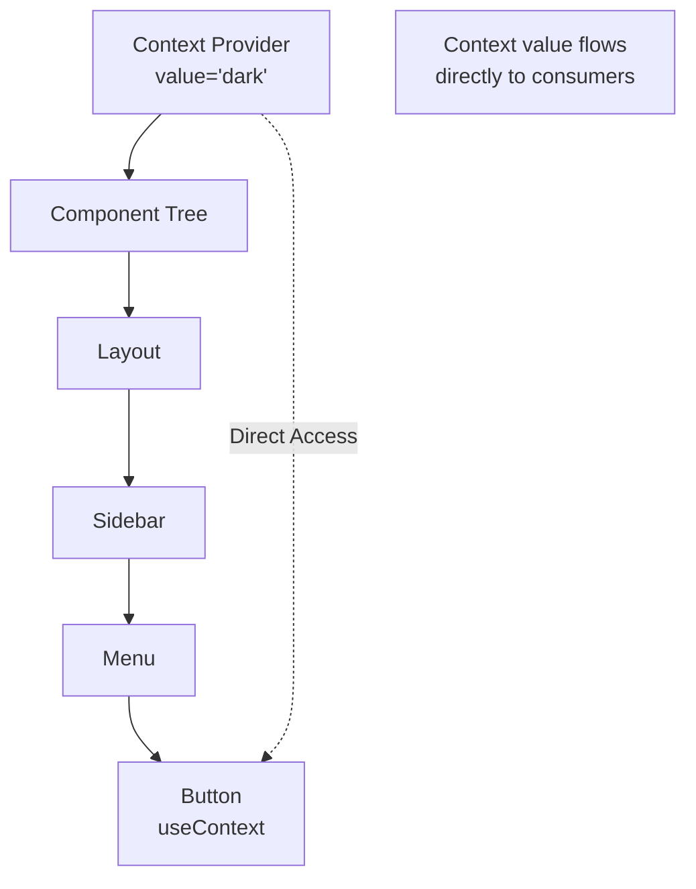
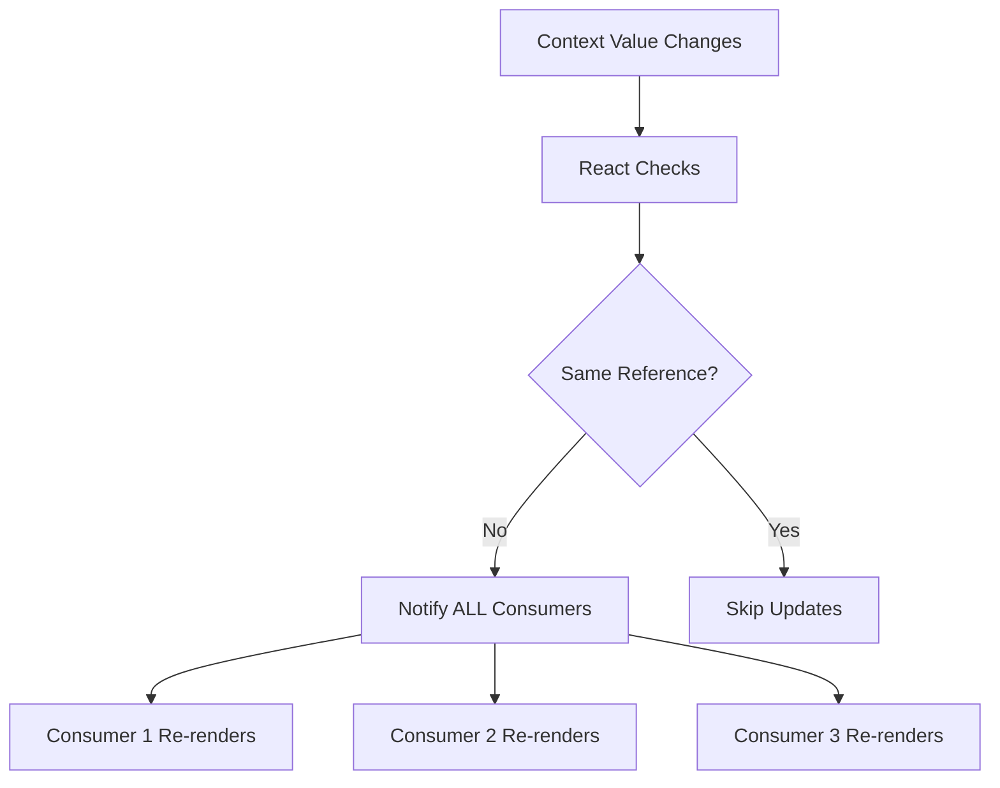
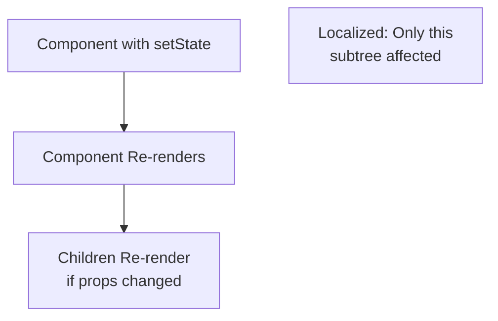
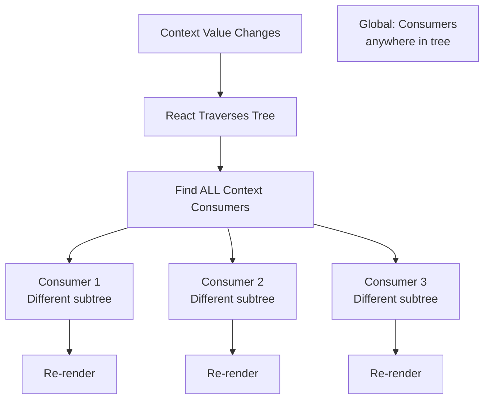

# Topic 14: useContext Hook - Consuming Context

[← Previous: useEffect Hook](./13_useeffect_hook.md) | [Back to Main](../README.md) | [Next: useReducer Hook →](./15_usereducer_hook.md)

---

## Table of Contents

1. [Overview](#overview)
2. [Context API Basics](#context-api-basics)
3. [useContext Hook](#usecontext-hook)
4. [Creating Context](#creating-context)
5. [Context Providers](#context-providers)
6. [Multiple Contexts](#multiple-contexts)
7. [Context Composition](#context-composition)
8. [Performance Considerations](#performance-considerations)
9. [TypeScript with Context](#typescript-with-context)
10. [Common Patterns](#common-patterns)
11. [Best Practices](#best-practices)

---

## Overview

**useContext** is the Hook for consuming React Context. It provides a way to pass data through the component tree without manually passing props at every level (avoiding "prop drilling").

**What You'll Learn:**
- What Context API is and when to use it
- How to create and provide context
- useContext Hook for consuming context
- Multiple contexts and composition
- Performance optimization techniques
- TypeScript typing for context
- Best practices and common pitfalls

**Prerequisites:**
- React components and props
- useState Hook
- Understanding of prop drilling problem

**Version Coverage:**
- React 16.3+ (Context API)
- React 16.8+ (useContext Hook)
- React 19.2

---

## Context API Basics

### The Prop Drilling Problem

```tsx
// ❌ Prop drilling through multiple levels
function App() {
  const [theme, setTheme] = useState('dark');
  
  return <Layout theme={theme} />;
}

function Layout({ theme }) {
  return <Sidebar theme={theme} />;  // Just passing through
}

function Sidebar({ theme }) {
  return <Menu theme={theme} />;  // Just passing through
}

function Menu({ theme }) {
  return <Button theme={theme} />;  // Just passing through
}

function Button({ theme }) {
  return <button className={theme}>Click</button>;  // Finally used!
}

// Theme passed through 4 components just to reach Button!
```

### Context Solution

```tsx
// ✅ Context eliminates prop drilling
const ThemeContext = createContext('light');

function App() {
  const [theme, setTheme] = useState('dark');
  
  return (
    <ThemeContext.Provider value={theme}>
      <Layout />  {/* No theme prop! */}
    </ThemeContext.Provider>
  );
}

function Layout() {
  return <Sidebar />;  // No theme prop!
}

function Sidebar() {
  return <Menu />;  // No theme prop!
}

function Menu() {
  return <Button />;  // No theme prop!
}

function Button() {
  const theme = useContext(ThemeContext);  // Access directly!
  return <button className={theme}>Click</button>;
}
```

### Context Flow



---

## useContext Hook

### Basic Usage

```tsx
import { createContext, useContext } from 'react';

// 1. Create context
const MyContext = createContext(defaultValue);

// 2. Provide value
function App() {
  return (
    <MyContext.Provider value={someValue}>
      <ChildComponent />
    </MyContext.Provider>
  );
}

// 3. Consume with useContext
function ChildComponent() {
  const value = useContext(MyContext);
  return <div>{value}</div>;
}
```

### Complete Example

```tsx
// Theme context
const ThemeContext = createContext('light');

function App() {
  const [theme, setTheme] = useState('dark');
  
  const toggleTheme = () => {
    setTheme(theme === 'dark' ? 'light' : 'dark');
  };
  
  return (
    <ThemeContext.Provider value={theme}>
      <Header />
      <MainContent />
      <button onClick={toggleTheme}>Toggle Theme</button>
    </ThemeContext.Provider>
  );
}

function MainContent() {
  const theme = useContext(ThemeContext);
  
  return (
    <div className={`content-${theme}`}>
      <p>Current theme: {theme}</p>
    </div>
  );
}

function Header() {
  const theme = useContext(ThemeContext);
  
  return (
    <header className={`header-${theme}`}>
      <h1>My App</h1>
    </header>
  );
}
```

---

## Creating Context

### Default Values

```tsx
// Context with default value
const ThemeContext = createContext('light');

// Used when no Provider exists above
function Component() {
  const theme = useContext(ThemeContext);  // 'light' if no Provider
  return <div>{theme}</div>;
}
```

### Context with Complex Values

```tsx
interface User {
  id: number;
  name: string;
  email: string;
}

interface AuthContextValue {
  user: User | null;
  login: (email: string, password: string) => Promise<void>;
  logout: () => void;
  isAuthenticated: boolean;
}

// Create with undefined (require Provider)
const AuthContext = createContext<AuthContextValue | undefined>(undefined);

// Or with default value
const AuthContext = createContext<AuthContextValue>({
  user: null,
  login: async () => {},
  logout: () => {},
  isAuthenticated: false
});
```

### Context Factory Pattern

```tsx
// Create context with custom hook
function createCtx<T>() {
  const ctx = createContext<T | undefined>(undefined);
  
  function useCtx() {
    const c = useContext(ctx);
    if (c === undefined) {
      throw new Error('useCtx must be inside a Provider with a value');
    }
    return c;
  }
  
  return [useCtx, ctx.Provider] as const;
}

// Usage
const [useAuth, AuthProvider] = createCtx<AuthContextValue>();

function App() {
  const authValue = { /* ... */ };
  return (
    <AuthProvider value={authValue}>
      <Component />
    </AuthProvider>
  );
}

function Component() {
  const auth = useAuth();  // Throws if no Provider
  return <div>{auth.user?.name}</div>;
}
```

---

## Context Providers

### Basic Provider

```tsx
function App() {
  const [theme, setTheme] = useState('dark');
  
  return (
    <ThemeContext.Provider value={theme}>
      <Component />
    </ThemeContext.Provider>
  );
}
```

### Provider with State

```tsx
function ThemeProvider({ children }) {
  const [theme, setTheme] = useState('dark');
  
  const value = {
    theme,
    toggleTheme: () => setTheme(t => t === 'dark' ? 'light' : 'dark')
  };
  
  return (
    <ThemeContext.Provider value={value}>
      {children}
    </ThemeContext.Provider>
  );
}

// Usage
function App() {
  return (
    <ThemeProvider>
      <Component />
    </ThemeProvider>
  );
}

function Component() {
  const { theme, toggleTheme } = useContext(ThemeContext);
  
  return (
    <div className={theme}>
      <button onClick={toggleTheme}>Toggle</button>
    </div>
  );
}
```

### Nested Providers

```tsx
// Providers can be nested (inner wins)
function App() {
  return (
    <ThemeContext.Provider value="dark">
      <Component />  {/* Uses 'dark' */}
      
      <ThemeContext.Provider value="light">
        <AnotherComponent />  {/* Uses 'light' */}
      </ThemeContext.Provider>
    </ThemeContext.Provider>
  );
}
```

---

## Multiple Contexts

### Using Multiple Contexts

```tsx
const ThemeContext = createContext('light');
const UserContext = createContext(null);
const LanguageContext = createContext('en');

function App() {
  const [theme, setTheme] = useState('dark');
  const [user, setUser] = useState(null);
  const [language, setLanguage] = useState('en');
  
  return (
    <ThemeContext.Provider value={theme}>
      <UserContext.Provider value={user}>
        <LanguageContext.Provider value={language}>
          <Component />
        </LanguageContext.Provider>
      </UserContext.Provider>
    </ThemeContext.Provider>
  );
}

function Component() {
  const theme = useContext(ThemeContext);
  const user = useContext(UserContext);
  const language = useContext(LanguageContext);
  
  return (
    <div className={theme}>
      <p>{user?.name}</p>
      <p>Language: {language}</p>
    </div>
  );
}
```

### Combined Provider Pattern

```tsx
// Combine multiple providers
function AppProviders({ children }) {
  return (
    <ThemeProvider>
      <AuthProvider>
        <LanguageProvider>
          <NotificationProvider>
            {children}
          </NotificationProvider>
        </LanguageProvider>
      </AuthProvider>
    </ThemeProvider>
  );
}

// Usage
function App() {
  return (
    <AppProviders>
      <Component />
    </AppProviders>
  );
}
```

---

## Performance Considerations

### Context Update Problem

```tsx
// ❌ ALL consumers re-render when ANY value changes
const AppContext = createContext();

function App() {
  const [theme, setTheme] = useState('dark');
  const [user, setUser] = useState(null);
  const [count, setCount] = useState(0);
  
  const value = { theme, user, count, setTheme, setUser, setCount };
  
  return (
    <AppContext.Provider value={value}>
      <Component />
    </AppContext.Provider>
  );
}

// Even if component only uses theme,
// it re-renders when count changes!
```

### Solution 1: Split Contexts

```tsx
// ✅ Separate contexts for independent concerns
const ThemeContext = createContext();
const UserContext = createContext();
const CountContext = createContext();

function Component() {
  const theme = useContext(ThemeContext);  // Only re-renders on theme change
  
  return <div className={theme}>Content</div>;
}
```

### Solution 2: Memoize Context Value

```tsx
function App() {
  const [theme, setTheme] = useState('dark');
  const [user, setUser] = useState(null);
  
  // ✅ Memoize value object
  const value = useMemo(() => ({
    theme,
    user,
    setTheme,
    setUser
  }), [theme, user]);  // Only recreate when these change
  
  return (
    <AppContext.Provider value={value}>
      <Component />
    </AppContext.Provider>
  );
}
```

### Solution 3: Split State and Actions

```tsx
// Separate frequently changing state from stable actions
const ThemeStateContext = createContext();
const ThemeActionsContext = createContext();

function ThemeProvider({ children }) {
  const [theme, setTheme] = useState('dark');
  
  // Actions don't change
  const actions = useMemo(() => ({
    setTheme,
    toggleTheme: () => setTheme(t => t === 'dark' ? 'light' : 'dark')
  }), []);
  
  return (
    <ThemeStateContext.Provider value={theme}>
      <ThemeActionsContext.Provider value={actions}>
        {children}
      </ThemeActionsContext.Provider>
    </ThemeStateContext.Provider>
  );
}

// Consumers can choose what to subscribe to
function DisplayTheme() {
  const theme = useContext(ThemeStateContext);  // Re-renders on theme change
  return <div>{theme}</div>;
}

function ThemeToggle() {
  const { toggleTheme } = useContext(ThemeActionsContext);  // Never re-renders
  return <button onClick={toggleTheme}>Toggle</button>;
}
```

---

## TypeScript with Context

### Typed Context

```tsx
interface User {
  id: number;
  name: string;
  email: string;
}

interface AuthContextValue {
  user: User | null;
  login: (email: string, password: string) => Promise<void>;
  logout: () => void;
}

// Create typed context
const AuthContext = createContext<AuthContextValue | undefined>(undefined);

// Custom hook with type guard
function useAuth() {
  const context = useContext(AuthContext);
  
  if (context === undefined) {
    throw new Error('useAuth must be used within AuthProvider');
  }
  
  return context;
}

// Provider component
function AuthProvider({ children }: { children: React.ReactNode }) {
  const [user, setUser] = useState<User | null>(null);
  
  const login = async (email: string, password: string) => {
    const user = await api.login(email, password);
    setUser(user);
  };
  
  const logout = () => {
    setUser(null);
  };
  
  const value: AuthContextValue = {
    user,
    login,
    logout
  };
  
  return (
    <AuthContext.Provider value={value}>
      {children}
    </AuthContext.Provider>
  );
}

// Usage
function Component() {
  const { user, logout } = useAuth();  // Fully typed!
  
  return (
    <div>
      <p>{user?.name}</p>
      <button onClick={logout}>Logout</button>
    </div>
  );
}
```

---

## Common Patterns

### Auth Context

```tsx
interface AuthContextValue {
  user: User | null;
  login: (credentials: Credentials) => Promise<void>;
  logout: () => void;
  isAuthenticated: boolean;
}

const AuthContext = createContext<AuthContextValue | undefined>(undefined);

export function AuthProvider({ children }: { children: React.ReactNode }) {
  const [user, setUser] = useState<User | null>(null);
  const [loading, setLoading] = useState(true);
  
  useEffect(() => {
    // Check if user is already logged in
    checkAuthStatus().then(user => {
      setUser(user);
      setLoading(false);
    });
  }, []);
  
  const login = async (credentials: Credentials) => {
    const user = await api.login(credentials);
    setUser(user);
  };
  
  const logout = () => {
    api.logout();
    setUser(null);
  };
  
  const value = {
    user,
    login,
    logout,
    isAuthenticated: user !== null
  };
  
  if (loading) return <LoadingScreen />;
  
  return (
    <AuthContext.Provider value={value}>
      {children}
    </AuthContext.Provider>
  );
}

export function useAuth() {
  const context = useContext(AuthContext);
  if (!context) {
    throw new Error('useAuth must be used within AuthProvider');
  }
  return context;
}
```

### Theme Context

```tsx
type Theme = 'light' | 'dark';

interface ThemeContextValue {
  theme: Theme;
  setTheme: (theme: Theme) => void;
  toggleTheme: () => void;
}

const ThemeContext = createContext<ThemeContextValue | undefined>(undefined);

export function ThemeProvider({ children }: { children: React.ReactNode }) {
  const [theme, setTheme] = useState<Theme>(() => {
    const saved = localStorage.getItem('theme') as Theme;
    return saved || 'light';
  });
  
  useEffect(() => {
    localStorage.setItem('theme', theme);
    document.documentElement.setAttribute('data-theme', theme);
  }, [theme]);
  
  const toggleTheme = () => {
    setTheme(prev => prev === 'dark' ? 'light' : 'dark');
  };
  
  const value = {
    theme,
    setTheme,
    toggleTheme
  };
  
  return (
    <ThemeContext.Provider value={value}>
      {children}
    </ThemeContext.Provider>
  );
}

export function useTheme() {
  const context = useContext(ThemeContext);
  if (!context) {
    throw new Error('useTheme must be used within ThemeProvider');
  }
  return context;
}
```

---

## Best Practices

### 1. Create Custom Hooks for Context

```tsx
// ✅ Wrap context in custom hook
const MyContext = createContext(undefined);

export function useMyContext() {
  const context = useContext(MyContext);
  if (context === undefined) {
    throw new Error('useMyContext must be within Provider');
  }
  return context;
}

// Usage
function Component() {
  const value = useMyContext();  // Type-safe, validates Provider
}
```

### 2. Keep Context Values Stable

```tsx
// ❌ New object every render
function Provider({ children }) {
  const [user, setUser] = useState(null);
  
  return (
    <UserContext.Provider value={{ user, setUser }}>
      {children}
    </UserContext.Provider>
  );
}

// ✅ Memoize value
function Provider({ children }) {
  const [user, setUser] = useState(null);
  
  const value = useMemo(() => ({
    user,
    setUser
  }), [user]);
  
  return (
    <UserContext.Provider value={value}>
      {children}
    </UserContext.Provider>
  );
}
```

### 3. Split Large Contexts

```tsx
// ❌ One large context
const AppContext = createContext({
  theme: 'light',
  user: null,
  settings: {},
  notifications: [],
  // ... many more
});

// ✅ Multiple focused contexts
const ThemeContext = createContext('light');
const UserContext = createContext(null);
const SettingsContext = createContext({});
const NotificationContext = createContext([]);
```

### 4. Provide Default Values

```tsx
// ✅ Always provide sensible defaults
const ThemeContext = createContext({
  theme: 'light',
  setTheme: () => {
    console.warn('ThemeContext not provided');
  }
});
```

---

## Higher-Order Thinking FAQs

### 1. Why does Context cause all consumers to re-render when the value changes, and how does this compare to Redux's selector-based subscriptions?

**Deep Answer:**

Context's **broadcast model** re-renders all consumers because it prioritizes **simplicity** over **granular updates**, unlike Redux which uses **selector-based subscriptions**.

**Context Behavior:**

```tsx
const AppContext = createContext();

function Provider() {
  const [state, setState] = useState({
    user: { id: 1, name: 'Alice' },
    theme: 'dark',
    count: 0
  });
  
  return (
    <AppContext.Provider value={state}>
      <UserDisplay />   {/* Uses user */}
      <ThemeButton />   {/* Uses theme */}
      <Counter />       {/* Uses count */}
    </AppContext.Provider>
  );
}

// setState({ ...state, count: count + 1 })
// → ALL three components re-render!
// Even though only Counter uses count
```

**Redux Behavior:**

```tsx
// Redux with selectors
function UserDisplay() {
  const user = useSelector(state => state.user);  // Only re-renders when user changes
}

function ThemeButton() {
  const theme = useSelector(state => state.theme);  // Only re-renders when theme changes
}

function Counter() {
  const count = useSelector(state => state.count);  // Only re-renders when count changes
}

// dispatch({ type: 'INCREMENT_COUNT' })
// → Only Counter re-renders!
```

**Why Context Works This Way:**



**Workarounds:**

```tsx
// 1. Split contexts
const UserContext = createContext();
const ThemeContext = createContext();
const CountContext = createContext();

// 2. Use multiple providers
<UserContext.Provider value={user}>
  <ThemeContext.Provider value={theme}>
    <CountContext.Provider value={count}>
      {/* Consumers only subscribe to what they need */}
    </CountContext.Provider>
  </ThemeContext.Provider>
</UserContext.Provider>

// 3. Memoize consumers
const MemoizedUserDisplay = React.memo(UserDisplay);

// 4. Use use-context-selector library
import { createContext, useContextSelector } from 'use-context-selector';

function Component() {
  const user = useContextSelector(AppContext, state => state.user);
  // Only re-renders when user changes!
}
```

**Trade-off Analysis:**

| Approach | Granular Updates | Simplicity | Setup Cost |
|----------|------------------|------------|------------|
| **Context** | ❌ All consumers | ✅ Simple API | ✅ Low |
| **Redux** | ✅ Selector-based | ⚠️ More complex | ⚠️ Higher |
| **Zustand** | ✅ Selector-based | ✅ Simple | ✅ Low |
| **Jotai** | ✅ Atomic | ✅ Simple | ✅ Low |

**When to Use Context:**

- ✅ Infrequently changing data (theme, auth, locale)
- ✅ Small apps (<50 components)
- ✅ Simplicity is priority
- ❌ Frequently changing data
- ❌ Large apps needing performance
- ❌ Complex state logic

### 2. How does Context propagation work in React's Fiber tree, and why can't Context updates be batched like setState?

**Deep Answer:**

Context propagation works through **tree traversal**, which is fundamentally different from state updates, making batching impossible.

**State Update (Localized):**



**Context Update (Global):**



**Why Can't Batch:**

```tsx
// Problem scenario:
function Provider1() {
  const [value1, setValue1] = useState(0);
  
  return (
    <Context1.Provider value={value1}>
      <Provider2 />
    </Context1.Provider>
  );
}

function Provider2() {
  const [value2, setValue2] = useState(0);
  
  return (
    <Context2.Provider value={value2}>
      <Consumer />
    </Context2.Provider>
  );
}

function Consumer() {
  const val1 = useContext(Context1);
  const val2 = useContext(Context2);
  
  return <div>{val1} {val2}</div>;
}

// If both values change:
// - Consumer needs to see both updates
// - But Provider1 and Provider2 are in different subtrees
// - Can't batch because there's no single "owner" of the update
// - Each context propagates independently through tree
```

**Deep Implication:**

Context is **not a state management solution** - it's a **dependency injection** mechanism. For frequently updating global state, use dedicated state management (Redux, Zustand, Jotai) that's designed for performance.

### 3. What's the difference between Context and simple module-level variables, and why can't you just use a global variable instead?

**Deep Answer:**

Context provides **reactive updates**, while module variables are **static**. This difference is fundamental to React's rendering model.

**Module Variable (Doesn't Work):**

```tsx
// ❌ Module-level variable
let globalTheme = 'dark';

export function setGlobalTheme(theme) {
  globalTheme = theme;
  // Problem: No components re-render!
}

function Component() {
  // Always shows initial value
  return <div className={globalTheme}>Content</div>;
}

// Changing globalTheme doesn't trigger re-renders
```

**Context (Reactive):**

```tsx
// ✅ Context with reactivity
const ThemeContext = createContext('dark');

function ThemeProvider({ children }) {
  const [theme, setTheme] = useState('dark');
  
  return (
    <ThemeContext.Provider value={theme}>
      {children}
    </ThemeContext.Provider>
  );
}

function Component() {
  const theme = useContext(ThemeContext);  // Subscribes to changes
  return <div className={theme}>Content</div>;
}

// When theme changes, Component re-renders automatically
```

**Why Context is Different:**

1. **Subscription System:**
```tsx
// Context creates subscription
function Component() {
  const value = useContext(MyContext);
  // React knows this component depends on MyContext
  // When context changes, React triggers re-render
}

// Module variable has no subscription
let value = 'initial';
function Component() {
  // React doesn't know component depends on value
  // Changing value doesn't trigger anything
}
```

2. **React's Rendering Cycle:**
```tsx
// Context integrates with React
<Provider value={theme}>  {/* React tracks this */}
  <Consumer />            {/* React knows dependency */}
</Provider>

// Module variable is outside React
let theme = 'dark';  // React can't track this
```

**When Module Variables ARE OK:**

```tsx
// ✅ Constants (never change)
const API_URL = 'https://api.example.com';
const MAX_RETRIES = 3;

// ✅ Configuration (set once at startup)
let config = null;

export function initConfig(cfg) {
  config = cfg;  // Set before any renders
}

// ✅ Caches (read-only from React's perspective)
const cache = new Map();

export function getCachedData(key) {
  return cache.get(key);
}
```

**Deep Implication:**

Context isn't just "global variables with extra steps" - it's a **reactive** system integrated into React's rendering. The value isn't just stored; it's **observed** by consumers who automatically update when it changes. This is why Context causes re-renders while module variables don't.

---

## Senior SDE Interview Questions

### Question 1: Context Performance Architecture

**Question:** "You're building a large dashboard with 100+ components. Several components need access to user data, theme, and real-time notifications. How would you architect context usage to avoid performance issues?"

**Key Concepts Being Tested:**
- Context performance understanding
- Architectural decision-making
- Trade-off analysis
- Scalability considerations

**Expected Answer Should Cover:**

1. **Problem Identification:**
```tsx
// ❌ Single context with all data
const AppContext = createContext({
  user,
  theme,
  notifications,  // Updates every second!
  // ... more data
});

// All 100+ consumers re-render every second
```

2. **Architecture Solutions:**

**Option A: Split Contexts**
```tsx
<UserContext.Provider value={user}>
  <ThemeContext.Provider value={theme}>
    <NotificationContext.Provider value={notifications}>
      <Dashboard />
    </NotificationContext.Provider>
  </ThemeContext.Provider>
</UserContext.Provider>

// Components only consume what they need
```

**Option B: State Management Library**
```tsx
// For frequently changing data like notifications,
// use Zustand/Redux instead of Context

const useNotificationStore = create((set) => ({
  notifications: [],
  addNotification: (n) => set(state => ({
    notifications: [...state.notifications, n]
  }))
}));

// Selector-based: only re-renders when selected data changes
```

**Option C: Hybrid Approach**
```tsx
// Context for stable data
<ThemeContext.Provider>
  <UserContext.Provider>
    {/* Zustand for dynamic data */}
    <Dashboard />
  </UserContext.Provider>
</ThemeContext.Provider>
```

3. **Optimization Techniques:**
- Memoize context values
- Split state and actions
- Use React.memo on consumers
- Consider Context selectors library

**Follow-up Questions:**
1. "How would you measure context-related performance issues?"
2. "When would you migrate from Context to Redux?"
3. "How do you handle context in Server Components?"

**Red Flags:**
- Putting all app state in one context
- Not understanding re-render implications
- No mention of profiling

**Green Flags:**
- Discusses context limitations
- Mentions alternative state management
- Provides hybrid approach
- Considers measurement/profiling

---

[← Previous: useEffect Hook](./13_useeffect_hook.md) | [Back to Main](../README.md) | [Next: useReducer Hook →](./15_usereducer_hook.md)

---

**Progress**: Topic 14/220 completed | Part II: React Hooks (27% complete)
