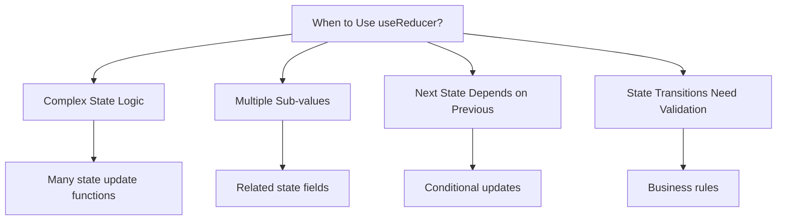

# Topic 15: useReducer Hook - Complex State Management

[← Previous: useContext Hook](./14_usecontext_hook.md) | [Back to Main](../README.md) | [Next: useRef Hook →](./16_useref_hook.md)

---

## Table of Contents

1. [Overview](#overview)
2. [What is useReducer?](#what-is-usereducer)
3. [Reducer Function](#reducer-function)
4. [useReducer Basics](#usereducer-basics)
5. [Actions and Dispatch](#actions-and-dispatch)
6. [useReducer vs useState](#usereducer-vs-usestate)
7. [Complex State Logic](#complex-state-logic)
8. [TypeScript with useReducer](#typescript-with-usereducer)
9. [Lazy Initialization](#lazy-initialization)
10. [Common Patterns](#common-patterns)
11. [Best Practices](#best-practices)

---

## Overview

**useReducer** is a Hook for managing complex state logic. It's an alternative to useState that works well when the next state depends on the previous state or when you have complex state transitions.

**What You'll Learn:**
- What reducers are and how they work
- useReducer syntax and patterns
- Actions and dispatch function
- When to use useReducer vs useState
- TypeScript typing for reducers
- Common patterns and best practices
- Integration with Context API

**Prerequisites:**
- useState Hook
- JavaScript objects and switch statements
- Understanding of pure functions
- TypeScript basics (for typed examples)

**Version Coverage:**
- React 16.8+ (useReducer introduction)
- React 19.2

---

## What is useReducer?

### The Reducer Pattern

A **reducer** is a pure function that takes the current state and an action, and returns a new state.

```tsx
// Reducer function signature
(state, action) => newState

// Inspired by Array.reduce()
[1, 2, 3].reduce((acc, val) => acc + val, 0);  // 6

// Similarly, useReducer "reduces" actions into state
```

### Why useReducer?



---

## Reducer Function

### Basic Reducer

```tsx
// Reducer is a pure function
function reducer(state, action) {
  switch (action.type) {
    case 'increment':
      return { count: state.count + 1 };
    case 'decrement':
      return { count: state.count - 1 };
    case 'reset':
      return { count: 0 };
    default:
      return state;  // Always return state for unknown actions
  }
}
```

### Reducer Rules

**1. Pure Function**
```tsx
// ✅ Pure reducer
function reducer(state, action) {
  switch (action.type) {
    case 'increment':
      return { count: state.count + 1 };  // New object
    default:
      return state;
  }
}

// ❌ Impure reducer
function reducer(state, action) {
  switch (action.type) {
    case 'increment':
      state.count++;  // Mutates state!
      return state;
    default:
      return state;
  }
}
```

**2. No Side Effects**
```tsx
// ❌ Side effects in reducer
function reducer(state, action) {
  switch (action.type) {
    case 'fetch':
      fetch('/api/data');  // Side effect!
      return state;
    default:
      return state;
  }
}

// ✅ Side effects in useEffect
function Component() {
  const [state, dispatch] = useReducer(reducer, initialState);
  
  useEffect(() => {
    fetch('/api/data').then(data => {
      dispatch({ type: 'dataLoaded', payload: data });
    });
  }, []);
}
```

**3. Always Return State**
```tsx
// ✅ Handle all cases
function reducer(state, action) {
  switch (action.type) {
    case 'increment':
      return { count: state.count + 1 };
    case 'decrement':
      return { count: state.count - 1 };
    default:
      return state;  // Important!
  }
}
```

---

## useReducer Basics

### Basic Syntax

```tsx
import { useReducer } from 'react';

const [state, dispatch] = useReducer(reducer, initialState);

// reducer: (state, action) => newState
// initialState: initial state value
// state: current state
// dispatch: function to trigger state changes
```

### Simple Counter

```tsx
type State = { count: number };
type Action = { type: 'increment' } | { type: 'decrement' } | { type: 'reset' };

function reducer(state: State, action: Action): State {
  switch (action.type) {
    case 'increment':
      return { count: state.count + 1 };
    case 'decrement':
      return { count: state.count - 1 };
    case 'reset':
      return { count: 0 };
    default:
      return state;
  }
}

function Counter() {
  const [state, dispatch] = useReducer(reducer, { count: 0 });
  
  return (
    <>
      <p>Count: {state.count}</p>
      <button onClick={() => dispatch({ type: 'increment' })}>+</button>
      <button onClick={() => dispatch({ type: 'decrement' })}>-</button>
      <button onClick={() => dispatch({ type: 'reset' })}>Reset</button>
    </>
  );
}
```

---

## Actions and Dispatch

### Action Types

```tsx
// Simple action (type only)
dispatch({ type: 'increment' });

// Action with payload
dispatch({ type: 'setCount', payload: 10 });

// Action with multiple fields
dispatch({ 
  type: 'updateUser',
  userId: 123,
  updates: { name: 'Alice', age: 30 }
});
```

### Action Creators

```tsx
// Action creator functions
const actions = {
  increment: () => ({ type: 'increment' as const }),
  decrement: () => ({ type: 'decrement' as const }),
  setCount: (count: number) => ({ 
    type: 'setCount' as const, 
    payload: count 
  }),
  reset: () => ({ type: 'reset' as const })
};

// Usage
dispatch(actions.increment());
dispatch(actions.setCount(10));
```

### TypeScript Action Types

```tsx
// Discriminated union for actions
type Action =
  | { type: 'increment' }
  | { type: 'decrement' }
  | { type: 'setCount'; payload: number }
  | { type: 'reset' };

function reducer(state: State, action: Action): State {
  switch (action.type) {
    case 'increment':
      return { count: state.count + 1 };
    case 'decrement':
      return { count: state.count - 1 };
    case 'setCount':
      return { count: action.payload };  // TypeScript knows payload exists
    case 'reset':
      return { count: 0 };
    default:
      // TypeScript ensures all cases handled
      const _exhaustive: never = action;
      return state;
  }
}
```

---

## useReducer vs useState

### When to Use Each

| Scenario | useState | useReducer |
|----------|----------|------------|
| **Simple value** | ✅ `useState(0)` | ❌ Overkill |
| **Independent values** | ✅ Multiple `useState` | ❌ Unnecessary |
| **Complex object** | ⚠️ Manageable | ✅ Better organization |
| **Multiple related values** | ⚠️ Can work | ✅ Cleaner |
| **Complex transitions** | ❌ Hard to follow | ✅ Clear logic |
| **Next state depends on previous** | ⚠️ Functional updates | ✅ Natural fit |
| **Many update functions** | ❌ Scattered | ✅ Centralized |

### useState Example

```tsx
// ✅ Good use of useState: Simple independent values
function Form() {
  const [name, setName] = useState('');
  const [email, setEmail] = useState('');
  const [age, setAge] = useState(0);
  
  return (
    <form>
      <input value={name} onChange={(e) => setName(e.target.value)} />
      <input value={email} onChange={(e) => setEmail(e.target.value)} />
      <input value={age} onChange={(e) => setAge(Number(e.target.value))} />
    </form>
  );
}
```

### useReducer Example

```tsx
// ✅ Good use of useReducer: Complex related state
type State = {
  name: string;
  email: string;
  age: number;
  errors: {
    name?: string;
    email?: string;
    age?: string;
  };
  isSubmitting: boolean;
};

type Action =
  | { type: 'setField'; field: keyof State; value: any }
  | { type: 'setErrors'; errors: State['errors'] }
  | { type: 'setSubmitting'; isSubmitting: boolean }
  | { type: 'reset' };

function reducer(state: State, action: Action): State {
  switch (action.type) {
    case 'setField':
      return { ...state, [action.field]: action.value };
    case 'setErrors':
      return { ...state, errors: action.errors };
    case 'setSubmitting':
      return { ...state, isSubmitting: action.isSubmitting };
    case 'reset':
      return initialState;
    default:
      return state;
  }
}

function Form() {
  const [state, dispatch] = useReducer(reducer, initialState);
  
  const handleChange = (field: keyof State) => (e) => {
    dispatch({ type: 'setField', field, value: e.target.value });
  };
  
  return (
    <form>
      <input value={state.name} onChange={handleChange('name')} />
      <input value={state.email} onChange={handleChange('email')} />
      <input value={state.age} onChange={handleChange('age')} />
    </form>
  );
}
```

---

## Complex State Logic

### Todo List with useReducer

```tsx
interface Todo {
  id: number;
  text: string;
  completed: boolean;
}

type State = {
  todos: Todo[];
  filter: 'all' | 'active' | 'completed';
};

type Action =
  | { type: 'addTodo'; text: string }
  | { type: 'toggleTodo'; id: number }
  | { type: 'deleteTodo'; id: number }
  | { type: 'setFilter'; filter: State['filter'] }
  | { type: 'clearCompleted' };

function reducer(state: State, action: Action): State {
  switch (action.type) {
    case 'addTodo':
      return {
        ...state,
        todos: [
          ...state.todos,
          {
            id: Date.now(),
            text: action.text,
            completed: false
          }
        ]
      };
      
    case 'toggleTodo':
      return {
        ...state,
        todos: state.todos.map(todo =>
          todo.id === action.id
            ? { ...todo, completed: !todo.completed }
            : todo
        )
      };
      
    case 'deleteTodo':
      return {
        ...state,
        todos: state.todos.filter(todo => todo.id !== action.id)
      };
      
    case 'setFilter':
      return {
        ...state,
        filter: action.filter
      };
      
    case 'clearCompleted':
      return {
        ...state,
        todos: state.todos.filter(todo => !todo.completed)
      };
      
    default:
      return state;
  }
}

function TodoApp() {
  const [state, dispatch] = useReducer(reducer, {
    todos: [],
    filter: 'all'
  });
  
  const filteredTodos = state.todos.filter(todo => {
    if (state.filter === 'active') return !todo.completed;
    if (state.filter === 'completed') return todo.completed;
    return true;
  });
  
  return (
    <div>
      <input onKeyDown={(e) => {
        if (e.key === 'Enter') {
          dispatch({ type: 'addTodo', text: e.currentTarget.value });
          e.currentTarget.value = '';
        }
      }} />
      
      <ul>
        {filteredTodos.map(todo => (
          <li key={todo.id}>
            <input
              type="checkbox"
              checked={todo.completed}
              onChange={() => dispatch({ type: 'toggleTodo', id: todo.id })}
            />
            <span>{todo.text}</span>
            <button onClick={() => dispatch({ type: 'deleteTodo', id: todo.id })}>
              Delete
            </button>
          </li>
        ))}
      </ul>
      
      <div>
        <button onClick={() => dispatch({ type: 'setFilter', filter: 'all' })}>
          All
        </button>
        <button onClick={() => dispatch({ type: 'setFilter', filter: 'active' })}>
          Active
        </button>
        <button onClick={() => dispatch({ type: 'setFilter', filter: 'completed' })}>
          Completed
        </button>
        <button onClick={() => dispatch({ type: 'clearCompleted' })}>
          Clear Completed
        </button>
      </div>
    </div>
  );
}
```

---

## TypeScript with useReducer

### Fully Typed Reducer

```tsx
// State type
interface State {
  count: number;
  step: number;
  history: number[];
}

// Action types (discriminated union)
type Action =
  | { type: 'increment' }
  | { type: 'decrement' }
  | { type: 'setStep'; payload: number }
  | { type: 'reset' }
  | { type: 'undo' };

// Typed reducer
function reducer(state: State, action: Action): State {
  switch (action.type) {
    case 'increment':
      return {
        ...state,
        count: state.count + state.step,
        history: [...state.history, state.count]
      };
      
    case 'decrement':
      return {
        ...state,
        count: state.count - state.step,
        history: [...state.history, state.count]
      };
      
    case 'setStep':
      return {
        ...state,
        step: action.payload
      };
      
    case 'reset':
      return {
        count: 0,
        step: 1,
        history: []
      };
      
    case 'undo':
      const previousCount = state.history[state.history.length - 1];
      return {
        ...state,
        count: previousCount ?? state.count,
        history: state.history.slice(0, -1)
      };
      
    default:
      // Exhaustiveness check
      const _exhaustive: never = action;
      return state;
  }
}

function Counter() {
  const [state, dispatch] = useReducer(reducer, {
    count: 0,
    step: 1,
    history: []
  });
  
  return (
    <>
      <p>Count: {state.count}</p>
      <p>Step: {state.step}</p>
      
      <input
        type="number"
        value={state.step}
        onChange={(e) => dispatch({ 
          type: 'setStep', 
          payload: Number(e.target.value) 
        })}
      />
      
      <button onClick={() => dispatch({ type: 'increment' })}>+</button>
      <button onClick={() => dispatch({ type: 'decrement' })}>-</button>
      <button onClick={() => dispatch({ type: 'reset' })}>Reset</button>
      <button 
        onClick={() => dispatch({ type: 'undo' })}
        disabled={state.history.length === 0}
      >
        Undo
      </button>
    </>
  );
}
```

---

## Lazy Initialization

### Init Function

```tsx
// Expensive initial state
function init(initialCount: number): State {
  // Complex computation
  const computed = expensiveComputation(initialCount);
  
  return {
    count: computed,
    history: []
  };
}

function Counter({ initialCount }) {
  // Pass init function as third argument
  const [state, dispatch] = useReducer(reducer, initialCount, init);
  
  // init only runs once on mount
  return <div>{state.count}</div>;
}
```

### Reset to Initial State

```tsx
function reducer(state, action) {
  switch (action.type) {
    case 'reset':
      return init(action.payload);  // Reset using init function
    default:
      return state;
  }
}

function Component({ initialCount }) {
  const [state, dispatch] = useReducer(reducer, initialCount, init);
  
  const handleReset = () => {
    dispatch({ type: 'reset', payload: initialCount });
  };
  
  return (
    <>
      <p>Count: {state.count}</p>
      <button onClick={handleReset}>Reset to Initial</button>
    </>
  );
}
```

---

## Common Patterns

### Form State Management

```tsx
interface FormState {
  values: {
    username: string;
    email: string;
    password: string;
  };
  errors: {
    username?: string;
    email?: string;
    password?: string;
  };
  touched: {
    username?: boolean;
    email?: boolean;
    password?: boolean;
  };
  isSubmitting: boolean;
}

type FormAction =
  | { type: 'setField'; field: keyof FormState['values']; value: string }
  | { type: 'setFieldTouched'; field: keyof FormState['touched'] }
  | { type: 'setErrors'; errors: FormState['errors'] }
  | { type: 'setSubmitting'; isSubmitting: boolean }
  | { type: 'reset' };

function formReducer(state: FormState, action: FormAction): FormState {
  switch (action.type) {
    case 'setField':
      return {
        ...state,
        values: {
          ...state.values,
          [action.field]: action.value
        }
      };
      
    case 'setFieldTouched':
      return {
        ...state,
        touched: {
          ...state.touched,
          [action.field]: true
        }
      };
      
    case 'setErrors':
      return {
        ...state,
        errors: action.errors
      };
      
    case 'setSubmitting':
      return {
        ...state,
        isSubmitting: action.isSubmitting
      };
      
    case 'reset':
      return initialFormState;
      
    default:
      return state;
  }
}

const initialFormState: FormState = {
  values: { username: '', email: '', password: '' },
  errors: {},
  touched: {},
  isSubmitting: false
};

function RegistrationForm() {
  const [state, dispatch] = useReducer(formReducer, initialFormState);
  
  const handleChange = (field: keyof FormState['values']) => (
    e: React.ChangeEvent<HTMLInputElement>
  ) => {
    dispatch({ type: 'setField', field, value: e.target.value });
  };
  
  const handleBlur = (field: keyof FormState['touched']) => () => {
    dispatch({ type: 'setFieldTouched', field });
  };
  
  return (
    <form>
      <input
        value={state.values.username}
        onChange={handleChange('username')}
        onBlur={handleBlur('username')}
      />
      {state.touched.username && state.errors.username && (
        <span>{state.errors.username}</span>
      )}
      
      {/* More fields */}
    </form>
  );
}
```

### Async Actions with useReducer

```tsx
type State = {
  data: any | null;
  loading: boolean;
  error: Error | null;
};

type Action =
  | { type: 'fetchStart' }
  | { type: 'fetchSuccess'; payload: any }
  | { type: 'fetchError'; error: Error };

function dataReducer(state: State, action: Action): State {
  switch (action.type) {
    case 'fetchStart':
      return {
        ...state,
        loading: true,
        error: null
      };
      
    case 'fetchSuccess':
      return {
        data: action.payload,
        loading: false,
        error: null
      };
      
    case 'fetchError':
      return {
        ...state,
        loading: false,
        error: action.error
      };
      
    default:
      return state;
  }
}

function DataFetcher({ url }) {
  const [state, dispatch] = useReducer(dataReducer, {
    data: null,
    loading: false,
    error: null
  });
  
  useEffect(() => {
    dispatch({ type: 'fetchStart' });
    
    fetch(url)
      .then(res => res.json())
      .then(data => dispatch({ type: 'fetchSuccess', payload: data }))
      .catch(error => dispatch({ type: 'fetchError', error }));
  }, [url]);
  
  if (state.loading) return <div>Loading...</div>;
  if (state.error) return <div>Error: {state.error.message}</div>;
  if (!state.data) return <div>No data</div>;
  
  return <pre>{JSON.stringify(state.data, null, 2)}</pre>;
}
```

---

## Best Practices

### 1. Keep Reducers Pure

```tsx
// ✅ Pure reducer
function reducer(state, action) {
  switch (action.type) {
    case 'add':
      return { count: state.count + 1 };  // New state
    default:
      return state;
  }
}

// ❌ Impure reducer
function reducer(state, action) {
  switch (action.type) {
    case 'add':
      state.count++;  // Mutation!
      console.log('Added');  // Side effect!
      return state;
    default:
      return state;
  }
}
```

### 2. Use TypeScript Discriminated Unions

```tsx
// ✅ Discriminated union provides type safety
type Action =
  | { type: 'setCount'; payload: number }
  | { type: 'setText'; payload: string };

function reducer(state: State, action: Action) {
  switch (action.type) {
    case 'setCount':
      return { ...state, count: action.payload };  // payload is number
    case 'setText':
      return { ...state, text: action.payload };   // payload is string
    default:
      return state;
  }
}
```

### 3. Co-locate Reducer with Component

```tsx
// ✅ Keep reducer near component (if not reused)
function TodoList() {
  // Reducer defined in same file
  function reducer(state, action) {
    // ...
  }
  
  const [state, dispatch] = useReducer(reducer, initialState);
}

// ✅ Extract if reused
// reducers/todoReducer.ts
export function todoReducer(state, action) {
  // ...
}

// Multiple components can import
import { todoReducer } from './reducers/todoReducer';
```

### 4. Use Action Creators for Complex Actions

```tsx
// ✅ Action creators
const todoActions = {
  addTodo: (text: string) => ({ type: 'addTodo' as const, text }),
  toggle: (id: number) => ({ type: 'toggle' as const, id }),
  delete: (id: number) => ({ type: 'delete' as const, id })
};

// Usage
dispatch(todoActions.addTodo('Learn React'));
dispatch(todoActions.toggle(1));
```

---

## Higher-Order Thinking FAQs

### 1. Why is useReducer called a "reducer" when it doesn't actually reduce anything like Array.reduce()?

**Deep Answer:**

The name comes from **functional programming** where "reduce" means transforming a sequence of values into a single value, which is exactly what useReducer does with actions.

**Array.reduce() Analogy:**

```tsx
// Array.reduce: Transform array of numbers into single sum
const numbers = [1, 2, 3, 4, 5];
const sum = numbers.reduce((acc, val) => acc + val, 0);
// [1, 2, 3, 4, 5] → 15

// useReducer: Transform sequence of actions into state
const actions = [
  { type: 'increment' },
  { type: 'increment' },
  { type: 'decrement' }
];

// If we could "replay" actions:
const finalState = actions.reduce(reducer, { count: 0 });
// [increment, increment, decrement] → { count: 1 }
```

**The Connection:**

```tsx
// Array.reduce signature
array.reduce((accumulator, currentValue) => nextAccumulator, initialValue)

// useReducer signature
useReducer((state, action) => nextState, initialState)

// Both "accumulate" or "reduce" a sequence into a single value!
```

**Redux Connection:**

```tsx
// Redux store uses same pattern
// History of actions "reduces" to current state
const actions = [
  { type: 'ADD_TODO', text: 'Learn Redux' },
  { type: 'TOGGLE_TODO', id: 1 },
  { type: 'DELETE_TODO', id: 1 }
];

// Store state is "reduction" of all past actions
const currentState = actions.reduce(rootReducer, initialState);

// Time-travel debugging works because you can
// replay actions from any point
```

**Deep Implication:**

The "reducer" name reveals React's functional programming roots. Your app's state is a **pure function** of the actions that have occurred. This enables powerful patterns like time-travel debugging, action replay, and predictable state management.

### 2. When should you use useReducer instead of useState, and does useReducer provide any performance benefits?

**Deep Answer:**

useReducer is about **code organization**, not performance. Both have similar performance characteristics.

**Performance Reality:**

```tsx
// useState: Multiple setters
function Component() {
  const [count, setCount] = useState(0);
  const [step, setStep] = useState(1);
  const [history, setHistory] = useState([]);
  
  const increment = () => {
    setCount(count + step);
    setHistory([...history, count]);
  };
}

// useReducer: Single dispatch
function Component() {
  const [state, dispatch] = useReducer(reducer, initialState);
  
  const increment = () => {
    dispatch({ type: 'increment' });
  };
}

// Performance: Nearly identical
// - Both trigger re-renders
// - Both support batching
// - Neither is inherently faster
```

**When useReducer WINS (Organization):**

```tsx
// ❌ useState: Logic scattered
function Component() {
  const [user, setUser] = useState(null);
  const [loading, setLoading] = useState(false);
  const [error, setError] = useState(null);
  const [retryCount, setRetryCount] = useState(0);
  
  const fetchUser = () => {
    setLoading(true);
    setError(null);
    // ... fetch logic with setUser, setError, setRetryCount
  };
  
  const retryFetch = () => {
    setRetryCount(retryCount + 1);
    setError(null);
    fetchUser();
  };
  
  const clearError = () => {
    setError(null);
  };
  
  // Logic is scattered across multiple functions
}

// ✅ useReducer: Logic centralized
function Component() {
  const [state, dispatch] = useReducer(reducer, initialState);
  
  const fetchUser = () => {
    dispatch({ type: 'fetchStart' });
    // ... fetch logic
  };
  
  // All state transitions in reducer
  // Easy to understand state flow
  // Easy to test reducer in isolation
}
```

**Decision Framework:**

```tsx
// Use useState when:
// - State is a single value
// - Updates are simple (setValue(newValue))
// - No complex transitions
// - State pieces are independent

const [name, setName] = useState('');
const [count, setCount] = useState(0);

// Use useReducer when:
// - State has multiple sub-values that change together
// - Next state depends on previous in complex ways
// - You have many update functions
// - Want centralized state logic

const [state, dispatch] = useReducer(formReducer, initialFormState);
```

**Performance Consideration:**

```tsx
// useReducer CAN help with performance when:
// - Passing callbacks to deeply nested components

// ❌ useState: New functions each render
function Parent() {
  const [state, setState] = useState({});
  
  // These recreate each render
  const updateA = () => setState({ ...state, a: 'new' });
  const updateB = () => setState({ ...state, b: 'new' });
  
  return <DeepChild onUpdateA={updateA} onUpdateB={updateB} />;
}

// ✅ useReducer: dispatch is stable
function Parent() {
  const [state, dispatch] = useReducer(reducer, initialState);
  
  // dispatch never changes!
  return <DeepChild dispatch={dispatch} />;
}

function DeepChild({ dispatch }) {
  // Receives stable dispatch
  // No need to memoize this component
  return (
    <>
      <button onClick={() => dispatch({ type: 'updateA' })}>A</button>
      <button onClick={() => dispatch({ type: 'updateB' })}>B</button>
    </>
  );
}
```

### 3. How do you implement middleware or side effects with useReducer, similar to Redux middleware?

**Deep Answer:**

useReducer doesn't have built-in middleware, but you can implement similar patterns using **enhancers** or **useEffect**.

**Pattern 1: Enhancer Function**

```tsx
// Middleware-like enhancer
function withLogging
