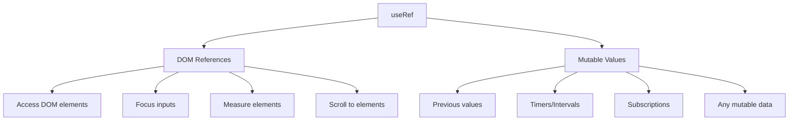

# Topic 16: useRef Hook - References and Mutable Values

[← Previous: useReducer Hook](./15_usereducer_hook.md) | [Back to Main](../README.md) | [Next: useMemo Hook →](./17_usememo_hook.md)

---

## Table of Contents

1. [Overview](#overview)
2. [What is useRef?](#what-is-useref)
3. [DOM References](#dom-references)
4. [Mutable Values](#mutable-values)
5. [useRef vs useState](#useref-vs-usestate)
6. [Forwarding Refs](#forwarding-refs)
7. [useImperativeHandle](#useimperativehandle)
8. [Common Use Cases](#common-use-cases)
9. [TypeScript with useRef](#typescript-with-useref)
10. [Best Practices](#best-practices)
11. [Common Patterns](#common-patterns)

---

## Overview

**useRef** is a Hook that returns a mutable ref object whose `.current` property persists across renders. It has two main uses: accessing DOM elements and storing mutable values that don't cause re-renders.

**What You'll Learn:**
- What refs are and their two use cases
- Accessing DOM elements with refs
- Storing mutable values without re-renders
- useRef vs useState differences
- Forwarding refs to child components
- useImperativeHandle for custom ref APIs
- TypeScript typing for refs

**Prerequisites:**
- React components and rendering
- useState Hook basics
- Understanding of re-renders

**Version Coverage:**
- React 16.8+ (useRef introduction)
- React 19.2

---

## What is useRef?

### Core Concept

useRef creates a **mutable container** that persists across renders but doesn't cause re-renders when changed.

```tsx
import { useRef } from 'react';

function Component() {
  const ref = useRef(initialValue);
  
  // Access/modify via .current
  console.log(ref.current);
  ref.current = newValue;
  
  return <div>Component</div>;
}
```

### Two Main Uses



---

## DOM References

### Accessing DOM Elements

```tsx
function TextInputFocus() {
  const inputRef = useRef<HTMLInputElement>(null);
  
  const focusInput = () => {
    inputRef.current?.focus();
  };
  
  return (
    <>
      <input ref={inputRef} type="text" />
      <button onClick={focusInput}>Focus Input</button>
    </>
  );
}
```

### Common DOM Operations

```tsx
function DOMOperations() {
  const divRef = useRef<HTMLDivElement>(null);
  
  const scrollToBottom = () => {
    if (divRef.current) {
      divRef.current.scrollTop = divRef.current.scrollHeight;
    }
  };
  
  const getHeight = () => {
    if (divRef.current) {
      console.log('Height:', divRef.current.clientHeight);
    }
  };
  
  const addClass = () => {
    divRef.current?.classList.add('highlight');
  };
  
  return (
    <>
      <div ref={divRef} style={{ height: '200px', overflow: 'auto' }}>
        {/* Content */}
      </div>
      
      <button onClick={scrollToBottom}>Scroll to Bottom</button>
      <button onClick={getHeight}>Get Height</button>
      <button onClick={addClass}>Add Class</button>
    </>
  );
}
```

### Video/Audio Control

```tsx
function VideoPlayer({ src }) {
  const videoRef = useRef<HTMLVideoElement>(null);
  
  const play = () => videoRef.current?.play();
  const pause = () => videoRef.current?.pause();
  const seek = (time: number) => {
    if (videoRef.current) {
      videoRef.current.currentTime = time;
    }
  };
  
  return (
    <>
      <video ref={videoRef} src={src} />
      
      <button onClick={play}>Play</button>
      <button onClick={pause}>Pause</button>
      <button onClick={() => seek(10)}>Skip to 10s</button>
    </>
  );
}
```

---

## Mutable Values

### Storing Values Without Re-renders

```tsx
// useState causes re-render
function WithState() {
  const [count, setCount] = useState(0);
  
  const increment = () => {
    setCount(count + 1);  // Triggers re-render
  };
  
  return <div>Count: {count}</div>;
}

// useRef doesn't cause re-render
function WithRef() {
  const countRef = useRef(0);
  
  const increment = () => {
    countRef.current += 1;  // Doesn't trigger re-render!
    console.log('Count:', countRef.current);
  };
  
  return <div>Count not displayed (no re-render)</div>;
}
```

### When to Use Mutable Values

```tsx
// ✅ Storing previous value
function Component({ value }) {
  const previousValue = useRef(value);
  
  useEffect(() => {
    previousValue.current = value;
  }, [value]);
  
  console.log('Changed from', previousValue.current, 'to', value);
}

// ✅ Storing timer IDs
function Component() {
  const timerRef = useRef<number>();
  
  const startTimer = () => {
    timerRef.current = window.setInterval(() => {
      console.log('Tick');
    }, 1000);
  };
  
  const stopTimer = () => {
    if (timerRef.current) {
      clearInterval(timerRef.current);
    }
  };
  
  useEffect(() => {
    return () => stopTimer();  // Cleanup
  }, []);
}

// ✅ Storing subscription objects
function Component() {
  const subscriptionRef = useRef<Subscription>();
  
  useEffect(() => {
    subscriptionRef.current = subscribe();
    
    return () => {
      subscriptionRef.current?.unsubscribe();
    };
  }, []);
}
```

---

## useRef vs useState

### Key Differences

| Aspect | useState | useRef |
|--------|----------|--------|
| **Re-renders** | Yes (on change) | No |
| **Persistence** | Across renders | Across renders |
| **Mutability** | Immutable | Mutable |
| **Access** | Direct | Via `.current` |
| **Use Case** | UI state | Non-UI values, DOM |
| **Initialization** | Eager or lazy | Always eager |

### When to Use Each

```tsx
// ✅ useState: Value affects rendering
function Counter() {
  const [count, setCount] = useState(0);  // Displayed in UI
  
  return (
    <div>
      <p>Count: {count}</p>
      <button onClick={() => setCount(count + 1)}>+</button>
    </div>
  );
}

// ✅ useRef: Value doesn't affect rendering
function Timer() {
  const intervalId = useRef<number>();
  
  const start = () => {
    intervalId.current = window.setInterval(() => {
      console.log('Tick');  // Side effect, not displayed
    }, 1000);
  };
  
  const stop = () => {
    if (intervalId.current) {
      clearInterval(intervalId.current);
    }
  };
  
  return (
    <>
      <button onClick={start}>Start</button>
      <button onClick={stop}>Stop</button>
    </>
  );
}
```

### Combined Usage

```tsx
// Use both: useState for UI, useRef for side effects
function Stopwatch() {
  const [time, setTime] = useState(0);  // Displayed
  const intervalRef = useRef<number>(); // Not displayed, but needed
  
  const start = () => {
    intervalRef.current = window.setInterval(() => {
      setTime(t => t + 1);
    }, 1000);
  };
  
  const stop = () => {
    if (intervalRef.current) {
      clearInterval(intervalRef.current);
    }
  };
  
  const reset = () => {
    stop();
    setTime(0);
  };
  
  return (
    <>
      <p>Time: {time}s</p>
      <button onClick={start}>Start</button>
      <button onClick={stop}>Stop</button>
      <button onClick={reset}>Reset</button>
    </>
  );
}
```

---

## Forwarding Refs

### Basic forwardRef

```tsx
// Forward ref to child component
const Input = forwardRef<HTMLInputElement, InputProps>((props, ref) => {
  return <input ref={ref} {...props} />;
});

// Parent can access child's DOM
function Parent() {
  const inputRef = useRef<HTMLInputElement>(null);
  
  const focus = () => {
    inputRef.current?.focus();
  };
  
  return (
    <>
      <Input ref={inputRef} />
      <button onClick={focus}>Focus Input</button>
    </>
  );
}
```

### forwardRef with TypeScript

```tsx
interface InputProps {
  placeholder?: string;
  disabled?: boolean;
}

const Input = forwardRef<HTMLInputElement, InputProps>(
  ({ placeholder, disabled }, ref) => {
    return (
      <input
        ref={ref}
        placeholder={placeholder}
        disabled={disabled}
      />
    );
  }
);

// Usage
function Parent() {
  const ref = useRef<HTMLInputElement>(null);
  
  return (
    <>
      <Input ref={ref} placeholder="Type here" />
      <button onClick={() => ref.current?.focus()}>Focus</button>
    </>
  );
}
```

---

## useImperativeHandle

### Custom Ref API

```tsx
interface InputHandle {
  focus: () => void;
  clear: () => void;
  getValue: () => string;
}

interface InputProps {
  initialValue?: string;
}

const CustomInput = forwardRef<InputHandle, InputProps>(
  ({ initialValue = '' }, ref) => {
    const inputRef = useRef<HTMLInputElement>(null);
    const [value, setValue] = useState(initialValue);
    
    // Expose custom API via ref
    useImperativeHandle(ref, () => ({
      focus: () => {
        inputRef.current?.focus();
      },
      clear: () => {
        setValue('');
        inputRef.current?.focus();
      },
      getValue: () => {
        return value;
      }
    }), [value]);
    
    return (
      <input
        ref={inputRef}
        value={value}
        onChange={(e) => setValue(e.target.value)}
      />
    );
  }
);

// Parent uses custom API
function Parent() {
  const inputRef = useRef<InputHandle>(null);
  
  const handleSubmit = () => {
    const value = inputRef.current?.getValue();
    console.log('Value:', value);
    inputRef.current?.clear();
  };
  
  return (
    <>
      <CustomInput ref={inputRef} />
      <button onClick={handleSubmit}>Submit</button>
      <button onClick={() => inputRef.current?.focus()}>Focus</button>
    </>
  );
}
```

---

## Common Use Cases

### Accessing Previous Value

```tsx
function usePrevious<T>(value: T): T | undefined {
  const ref = useRef<T>();
  
  useEffect(() => {
    ref.current = value;
  }, [value]);
  
  return ref.current;
}

// Usage
function Counter({ count }) {
  const previousCount = usePrevious(count);
  
  return (
    <div>
      <p>Current: {count}</p>
      <p>Previous: {previousCount}</p>
      <p>Difference: {count - (previousCount || 0)}</p>
    </div>
  );
}
```

### Storing Interval/Timeout IDs

```tsx
function Timer() {
  const [seconds, setSeconds] = useState(0);
  const [isRunning, setIsRunning] = useState(false);
  const intervalRef = useRef<number>();
  
  const start = () => {
    if (!isRunning) {
      setIsRunning(true);
      intervalRef.current = window.setInterval(() => {
        setSeconds(s => s + 1);
      }, 1000);
    }
  };
  
  const stop = () => {
    setIsRunning(false);
    if (intervalRef.current) {
      clearInterval(intervalRef.current);
    }
  };
  
  const reset = () => {
    stop();
    setSeconds(0);
  };
  
  useEffect(() => {
    return () => {
      if (intervalRef.current) {
        clearInterval(intervalRef.current);
      }
    };
  }, []);
  
  return (
    <>
      <p>{seconds}s</p>
      <button onClick={start} disabled={isRunning}>Start</button>
      <button onClick={stop} disabled={!isRunning}>Stop</button>
      <button onClick={reset}>Reset</button>
    </>
  );
}
```

### Measuring DOM Elements

```tsx
function MeasureComponent() {
  const divRef = useRef<HTMLDivElement>(null);
  const [dimensions, setDimensions] = useState({ width: 0, height: 0 });
  
  useEffect(() => {
    if (divRef.current) {
      const { width, height } = divRef.current.getBoundingClientRect();
      setDimensions({ width, height });
    }
  }, []);
  
  return (
    <>
      <div ref={divRef}>
        Content to measure
      </div>
      <p>Width: {dimensions.width}px</p>
      <p>Height: {dimensions.height}px</p>
    </>
  );
}
```

### Caching Expensive Computations

```tsx
function Component({ items }) {
  const cache = useRef(new Map());
  
  const getProcessedItem = (id) => {
    // Check cache
    if (cache.current.has(id)) {
      return cache.current.get(id);
    }
    
    // Compute and cache
    const processed = expensiveProcess(items.find(i => i.id === id));
    cache.current.set(id, processed);
    return processed;
  };
  
  return (
    <div>
      {items.map(item => (
        <div key={item.id}>{getProcessedItem(item.id)}</div>
      ))}
    </div>
  );
}
```

---

## TypeScript with useRef

### Typing DOM Refs

```tsx
// HTML elements
const inputRef = useRef<HTMLInputElement>(null);
const divRef = useRef<HTMLDivElement>(null);
const buttonRef = useRef<HTMLButtonElement>(null);
const videoRef = useRef<HTMLVideoElement>(null);

// Generic element
const elementRef = useRef<HTMLElement>(null);

// SVG elements
const svgRef = useRef<SVGSVGElement>(null);
const pathRef = useRef<SVGPathElement>(null);
```

### Typing Mutable Values

```tsx
// Primitive values
const countRef = useRef<number>(0);
const nameRef = useRef<string>('');

// Objects
interface Timer {
  id: number;
  startTime: number;
}

const timerRef = useRef<Timer | null>(null);

// Arrays
const itemsRef = useRef<string[]>([]);

// Functions
const callbackRef = useRef<(() => void) | null>(null);
```

### Optional vs Required Refs

```tsx
// DOM refs are often null initially
const divRef = useRef<HTMLDivElement>(null);

// Check before using
if (divRef.current) {
  divRef.current.scrollIntoView();
}

// Or use optional chaining
divRef.current?.scrollIntoView();

// Mutable values can have initial value
const countRef = useRef(0);  // Never null
countRef.current += 1;  // Safe to use directly
```

---

## Best Practices

### 1. Don't Read/Write Refs During Render

```tsx
// ❌ Reading ref during render
function Component() {
  const countRef = useRef(0);
  
  countRef.current += 1;  // Don't do this!
  
  return <div>{countRef.current}</div>;  // Unpredictable!
}

// ✅ Read/write in effects or event handlers
function Component() {
  const countRef = useRef(0);
  
  useEffect(() => {
    countRef.current += 1;  // ✅ In effect
  });
  
  const handleClick = () => {
    countRef.current += 1;  // ✅ In event handler
    console.log(countRef.current);
  };
  
  return <button onClick={handleClick}>Click</button>;
}
```

### 2. Use useState for Values Affecting Rendering

```tsx
// ❌ Using ref for UI value
function Counter() {
  const countRef = useRef(0);
  
  const increment = () => {
    countRef.current += 1;
    // Component doesn't re-render, UI doesn't update!
  };
  
  return <div>{countRef.current}</div>;  // Always shows 0
}

// ✅ Use useState for UI values
function Counter() {
  const [count, setCount] = useState(0);
  
  return (
    <>
      <div>{count}</div>
      <button onClick={() => setCount(count + 1)}>+</button>
    </>
  );
}
```

### 3. Initialize Refs Properly

```tsx
// ✅ DOM ref (null initially)
const divRef = useRef<HTMLDivElement>(null);

// ✅ Mutable value (with initial value)
const countRef = useRef(0);

// ✅ Lazy initialization (for expensive values)
const cacheRef = useRef<Map<string, any>>();

if (!cacheRef.current) {
  cacheRef.current = new Map();
}
```

---

## Common Patterns

### Previous Value Tracking

```tsx
function usePrevious<T>(value: T): T | undefined {
  const ref = useRef<T>();
  
  useEffect(() => {
    ref.current = value;
  }, [value]);
  
  return ref.current;
}

// Usage
function Component({ count }) {
  const prevCount = usePrevious(count);
  
  return (
    <div>
      <p>Now: {count}</p>
      <p>Before: {prevCount}</p>
    </div>
  );
}
```

### Debounce with Ref

```tsx
function useDebounce<T>(value: T, delay: number): T {
  const [debouncedValue, setDebouncedValue] = useState(value);
  const timerRef = useRef<number>();
  
  useEffect(() => {
    // Clear previous timer
    if (timerRef.current) {
      clearTimeout(timerRef.current);
    }
    
    // Set new timer
    timerRef.current = window.setTimeout(() => {
      setDebouncedValue(value);
    }, delay);
    
    return () => {
      if (timerRef.current) {
        clearTimeout(timerRef.current);
      }
    };
  }, [value, delay]);
  
  return debouncedValue;
}
```

### Click Outside Handler

```tsx
function useClickOutside(callback: () => void) {
  const ref = useRef<HTMLDivElement>(null);
  
  useEffect(() => {
    const handleClick = (event: MouseEvent) => {
      if (ref.current && !ref.current.contains(event.target as Node)) {
        callback();
      }
    };
    
    document.addEventListener('mousedown', handleClick);
    
    return () => {
      document.removeEventListener('mousedown', handleClick);
    };
  }, [callback]);
  
  return ref;
}

// Usage
function Dropdown() {
  const [isOpen, setIsOpen] = useState(false);
  const dropdownRef = useClickOutside(() => setIsOpen(false));
  
  return (
    <div ref={dropdownRef}>
      <button onClick={() => setIsOpen(!isOpen)}>Toggle</button>
      {isOpen && (
        <div className="dropdown-menu">
          Menu items
        </div>
      )}
    </div>
  );
}
```

---

## Higher-Order Thinking FAQs

### 1. Why doesn't changing ref.current cause a re-render, and when would you actually want a mutable value that doesn't trigger re-renders?

**Deep Answer:**

Refs are **escape hatches** from React's reactive model, intentionally designed not to trigger re-renders for performance and flexibility.

**Why No Re-render:**

```tsx
// useState: Part of React's reactive system
const [count, setCount] = useState(0);
setCount(1);
// → React schedules re-render
// → Component function runs again
// → New count value used

// useRef: Outside React's reactive system
const countRef = useRef(0);
countRef.current = 1;
// → No notification to React
// → No re-render
// → Value just silently changes
```

**When You Want This:**

```tsx
// 1. Storing values that DON'T affect UI
function Component() {
  const renderCountRef = useRef(0);
  
  // Track renders without causing infinite loop
  renderCountRef.current += 1;
  console.log('Render count:', renderCountRef.current);
  
  // If this were useState, would cause infinite renders!
}

// 2. Caching between renders
function ExpensiveComponent({ id }) {
  const cacheRef = useRef(new Map());
  
  const getProcessedData = (id) => {
    if (!cacheRef.current.has(id)) {
      cacheRef.current.set(id, expensiveComputation(id));
    }
    return cacheRef.current.get(id);
  };
  
  // Cache persists across renders
  // But doesn't cause re-renders when cache changes
}

// 3. Storing callbacks without causing effect re-runs
function Component() {
  const callbackRef = useRef<Function>();
  
  callbackRef.current = () => {
    // Latest closure, can access current props/state
  };
  
  useEffect(() => {
    const timer = setInterval(() => {
      callbackRef.current?.();  // Always calls latest callback
    }, 1000);
    
    return () => clearInterval(timer);
  }, []);  // No dependencies! Interval never recreated
}

// 4. Avoiding stale closures
function Chat() {
  const [message, setMessage] = useState('');
  const latestMessage = useRef(message);
  
  useEffect(() => {
    latestMessage.current = message;
  }, [message]);
  
  useEffect(() => {
    const socket = connect();
    
    socket.on('request', () => {
      // Always sends latest message
      socket.send(latestMessage.current);
    });
    
    return () => socket.disconnect();
  }, []);  // Socket setup once, but has access to latest message
}
```

**Deep Implication:**

Refs are React's acknowledgment that **not everything should be reactive**. Sometimes you need imperative escape hatches for performance (caching), integration with non-React code (libraries), or avoiding unnecessary effect recreations.

### 2. When should you use forwardRef vs just exposing a ref prop, and what are the implications for component API design?

**Deep Answer:**

forwardRef is a **special case** for passing refs to child components, with specific use cases and tradeoffs.

**Direct Ref Prop (Doesn't Work):**

```tsx
// ❌ ref is reserved, this doesn't work
function CustomInput({ ref, ...props }) {
  return <input ref={ref} {...props} />;
}

// Error: ref is not a prop!
<CustomInput ref={myRef} />
```

**Using forwardRef:**

```tsx
// ✅ forwardRef makes ref work
const CustomInput = forwardRef((props, ref) => {
  return <input ref={ref} {...props} />;
});

// Now works!
<CustomInput ref={myRef} />
```

**Alternative: Custom Prop Name:**

```tsx
// ✅ Use custom prop name instead
function CustomInput({ inputRef, ...props }) {
  return <input ref={inputRef} {...props} />;
}

// Usage with custom prop
<CustomInput inputRef={myRef} />
```

**When to Use Each:**

| Scenario | forwardRef | Custom Prop |
|----------|------------|-------------|
| **Wrapping native element** | ✅ Standard | ⚠️ Unconventional |
| **Multiple refs needed** | ❌ Only one ref | ✅ Multiple props |
| **Library component** | ✅ Expected API | ❌ Breaks convention |
| **Internal logic** | ⚠️ Exposes internals | ✅ More control |

**Real-World Examples:**

```tsx
// forwardRef: Simple wrapper (UI library pattern)
const Button = forwardRef<HTMLButtonElement, ButtonProps>(
  ({ variant, children, ...props }, ref) => {
    return (
      <button ref={ref} className={`btn-${variant}`} {...props}>
        {children}
      </button>
    );
  }
);

// Custom prop: Complex component with multiple refs
function VideoPlayer({ playerRef, controlsRef, ...props }) {
  return (
    <div>
      <video ref={playerRef} {...props} />
      <div ref={controlsRef} className="controls">
        {/* Custom controls */}
      </div>
    </div>
  );
}

// Custom prop: When you want to hide implementation
function Dropdown({ triggerRef, menuRef }) {
  // Internal logic decides what triggerRef and menuRef point to
  return (
    <div>
      <button ref={triggerRef}>Trigger</button>
      <div ref={menuRef}>Menu</div>
    </div>
  );
}
```

**API Design Implications:**

```tsx
// forwardRef: Follows React conventions
// ✅ Pros: Standard, works with React.memo, expected by users
// ❌ Cons: Only one ref, couples API to internals

// Custom prop: More flexible
// ✅ Pros: Multiple refs, clear naming, more control
// ❌ Cons: Non-standard, more documentation needed
```

**Deep Implication:**

forwardRef exists because `ref` is **special** in React (like `key`). It's not a regular prop. This design enforces that refs are for **escape hatches** - accessing the underlying implementation - not for regular component API. The specialness of `ref` reminds you that direct DOM access should be rare.

### 3. How do you handle refs in lists, and what are the pitfalls of storing multiple refs?

**Deep Answer:**

Storing refs for list items requires **careful management** because refs don't work like state arrays.

**Naive Approach (Broken):**

```tsx
// ❌ Doesn't work correctly
function List({ items }) {
  const refs = useRef([]);
  
  return (
    <ul>
      {items.map((item, index) => (
        <li key={item.id} ref={el => refs.current[index] = el}>
          {item.name}
        </li>
      ))}
    </ul>
  );
}

// Problems:
// - refs.current[index] gets stale when list reorders
// - Indices don't match after items removed
// - No cleanup of old refs
```

**Correct Pattern: Map by ID:**

```tsx
// ✅ Use Map keyed by ID
function List({ items }) {
  const refsMap = useRef(new Map<number, HTMLLIElement>());
  
  const scrollToItem = (id: number) => {
    const element = refsMap.current.get(id);
    element?.scrollIntoView({ behavior: 'smooth' });
  };
  
  return (
    <ul>
      {items.map(item => (
        <li
          key={item.id}
          ref={el => {
            if (el) {
              refsMap.current.set(item.id, el);
            } else {
              refsMap.current.delete(item.id);  // Cleanup!
            }
          }}
        >
          {item.name}
          <button onClick={() => scrollToItem(item.id)}>
            Scroll to me
          </button>
        </li>
      ))}
    </ul>
  );
}
```

**Advanced: useRef with Callback Refs:**

```tsx
function List({ items }) {
  const [selectedId, setSelectedId] = useState<number | null>(null);
  const refsMap = useRef(new Map<number, HTMLLIElement>());
  
  // Scroll to selected item when it changes
  useEffect(() => {
    if (selectedId !== null) {
      const element = refsMap.current.get(selectedId);
      element?.scrollIntoView({ behavior: 'smooth', block: 'center' });
    }
  }, [selectedId]);
  
  return (
    <ul>
      {items.map(item => (
        <li
          key={item.id}
          ref={el => {
            if (el) {
              refsMap.current.set(item.id, el);
            } else {
              refsMap.current.delete(item.id);
            }
          }}
          onClick={() => setSelectedId(item.id)}
        >
          {item.name}
        </li>
      ))}
    </ul>
  );
}
```

**Deep Implication:**

Refs in lists reveal the difference between **React's virtual world** (keys, state) and **the DOM's real world** (element references). You need to manually manage the mapping between them because React won't do it automatically. This is why most React code avoids direct DOM manipulation—it's your responsibility to keep refs in sync.

---

## Senior SDE Interview Questions

### Question 1: Ref vs State Decision Making

**Question:** "Explain when you would use useRef vs useState for storing a WebSocket connection object, and how this affects component lifecycle and memory management."

**Key Concepts Being Tested:**
- useRef vs useState understanding
- Lifecycle management
- Memory leak prevention
- Design decision-making

**Expected Answer Should Cover:**

1. **Use useRef for WebSocket:**
```tsx
// ✅ useRef: Connection doesn't affect UI
function Chat() {
  const socketRef = useRef<WebSocket>();
