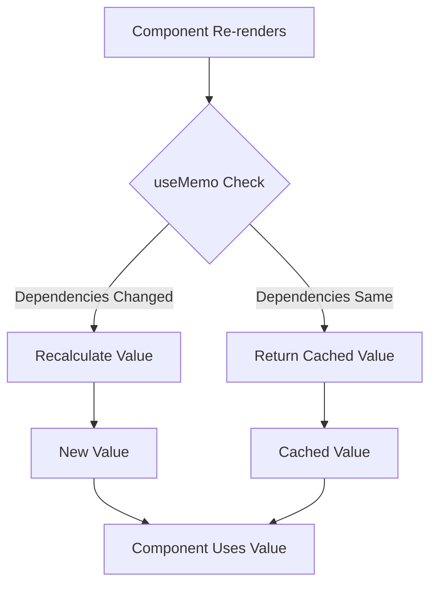
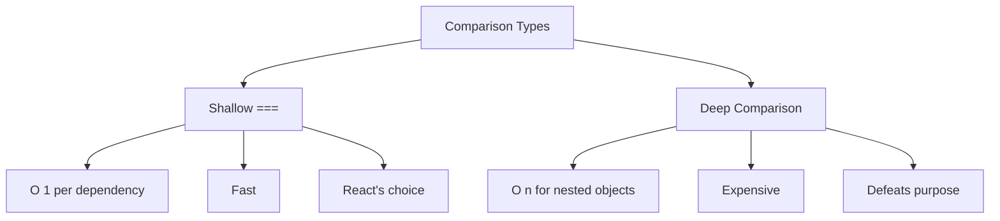
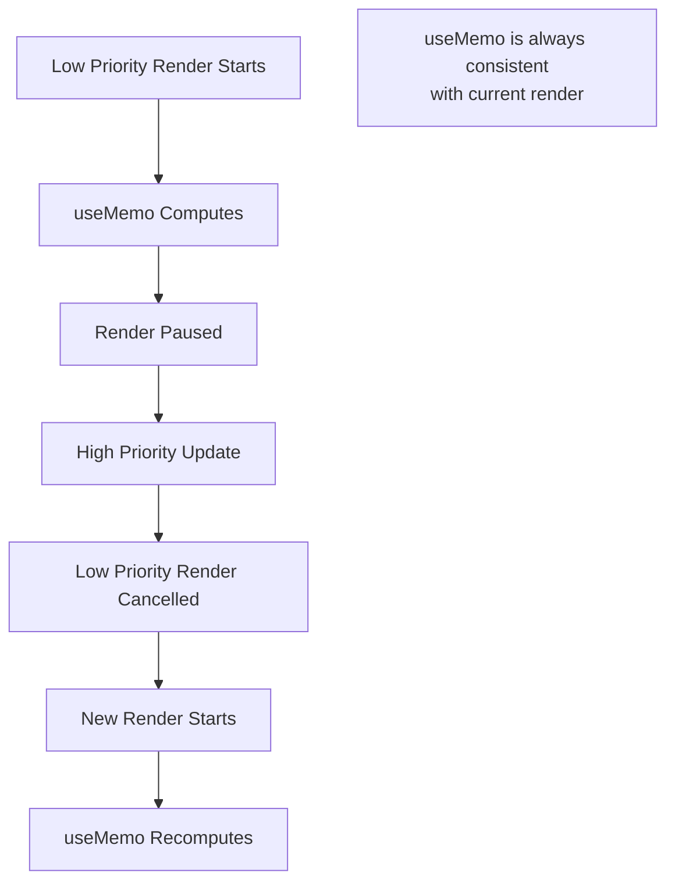

# Topic 17: useMemo Hook - Value Memoization

[← Previous: useRef Hook](./16_useref_hook.md) | [Back to Main](../README.md) | [Next: useCallback Hook →](./18_usecallback_hook.md)

---

## Table of Contents

1. [Overview](#overview)
2. [What is Memoization?](#what-is-memoization)
3. [useMemo Basics](#usememo-basics)
4. [When to Use useMemo](#when-to-use-usememo)
5. [Performance Optimization](#performance-optimization)
6. [Dependency Array](#dependency-array)
7. [Common Use Cases](#common-use-cases)
8. [useMemo Pitfalls](#usememo-pitfalls)
9. [TypeScript with useMemo](#typescript-with-usememo)
10. [React Compiler Impact](#react-compiler-impact)
11. [Best Practices](#best-practices)

---

## Overview

**useMemo** is a Hook that memoizes (caches) the result of an expensive computation. It only recomputes when dependencies change, optimizing performance by avoiding unnecessary recalculations.

**What You'll Learn:**
- What memoization is and why it matters
- useMemo syntax and usage patterns
- When to use useMemo (and when not to)
- Performance optimization strategies
- Dependency management
- React Compiler's impact on useMemo
- Common pitfalls and best practices

**Prerequisites:**
- useState and useEffect Hooks
- Understanding of re-renders
- JavaScript closures and references

**Version Coverage:**
- React 16.8+ (useMemo introduction)
- React 19 (React Compiler makes useMemo often unnecessary)
- React 19.2

---

## What is Memoization?

### Core Concept

**Memoization** is an optimization technique where you cache the result of expensive function calls and return the cached result when the same inputs occur again.

```tsx
// Without memoization
function expensiveCalculation(n) {
  console.log('Computing...');
  let result = 0;
  for (let i = 0; i < 1000000000; i++) {
    result += n;
  }
  return result;
}

// Called every render, even with same input
function Component({ n }) {
  const result = expensiveCalculation(n);  // Recalculates every render!
  return <div>{result}</div>;
}

// With memoization
function Component({ n }) {
  const result = useMemo(() => expensiveCalculation(n), [n]);
  // Only recalculates when n changes!
  return <div>{result}</div>;
}
```

### Memoization Benefits



---

## useMemo Basics

### Basic Syntax

```tsx
import { useMemo } from 'react';

const memoizedValue = useMemo(
  () => expensiveComputation(a, b),  // Function that returns value
  [a, b]                              // Dependencies
);

// Recomputes only when a or b changes
```

### Simple Example

```tsx
function Component({ numbers }) {
  // Without useMemo: Recalculates on every render
  const sum = numbers.reduce((acc, n) => acc + n, 0);
  
  // With useMemo: Only recalculates when numbers changes
  const sum = useMemo(() => {
    console.log('Calculating sum...');
    return numbers.reduce((acc, n) => acc + n, 0);
  }, [numbers]);
  
  return <div>Sum: {sum}</div>;
}
```

### Comparison

```tsx
function ProductList({ products, category }) {
  const [sortOrder, setSortOrder] = useState('name');
  
  // ❌ Without useMemo: Filters and sorts on EVERY render
  const sortedProducts = products
    .filter(p => p.category === category)
    .sort((a, b) => a[sortOrder].localeCompare(b[sortOrder]));
  
  // Even if products, category, and sortOrder haven't changed,
  // this runs again when component re-renders for any reason!
  
  // ✅ With useMemo: Only recomputes when dependencies change
  const sortedProducts = useMemo(() => {
    console.log('Filtering and sorting...');
    return products
      .filter(p => p.category === category)
      .sort((a, b) => a[sortOrder].localeCompare(b[sortOrder]));
  }, [products, category, sortOrder]);
  
  return (
    <div>
      {sortedProducts.map(p => <div key={p.id}>{p.name}</div>)}
    </div>
  );
}
```

---

## When to Use useMemo

### Good Use Cases

```tsx
// ✅ 1. Expensive computations
const expensiveResult = useMemo(() => {
  return items.reduce((acc, item) => {
    // Complex calculation
    return acc + heavyComputation(item);
  }, 0);
}, [items]);

// ✅ 2. Filtering/sorting large arrays
const filteredItems = useMemo(() => {
  return items.filter(item => item.active).sort((a, b) => a.name.localeCompare(b.name));
}, [items]);

// ✅ 3. Creating objects for child components (referential equality)
const config = useMemo(() => ({
  apiUrl: 'https://api.example.com',
  timeout: 5000
}), []);

<ChildComponent config={config} />  // config reference stays same

// ✅ 4. Derived state from multiple sources
const summary = useMemo(() => ({
  total: items.reduce((sum, item) => sum + item.price, 0),
  count: items.length,
  average: items.length ? total / items.length : 0
}), [items]);
```

### When NOT to Use

```tsx
// ❌ 1. Simple calculations (overhead > benefit)
const doubled = useMemo(() => count * 2, [count]);  // Overkill!
const doubled = count * 2;  // Just do this

// ❌ 2. Creating primitives
const name = useMemo(() => `${firstName} ${lastName}`, [firstName, lastName]);  // Unnecessary!
const name = `${firstName} ${lastName}`;  // Just do this

// ❌ 3. Values used only once in render
const greeting = useMemo(() => `Hello, ${name}!`, [name]);  // Pointless!
return <div>{greeting}</div>;

// ❌ 4. Already memoized by React
const element = useMemo(() => <Component />, []);  // React already handles this!
const element = <Component />;
```

### Cost-Benefit Analysis

```tsx
// useMemo has overhead:
// 1. Function call overhead
// 2. Dependency comparison
// 3. Memory for caching

// Use when: Computation cost > useMemo overhead
// Don't use when: Simple operations
```

---

## Performance Optimization

### Preventing Child Re-renders

```tsx
// Problem: Child re-renders unnecessarily
function Parent() {
  const [count, setCount] = useState(0);
  
  // ❌ New object every render
  const config = { apiUrl: '/api', timeout: 5000 };
  
  return (
    <>
      <button onClick={() => setCount(count + 1)}>Count: {count}</button>
      <ExpensiveChild config={config} />
      {/* Child re-renders even though config is "same" */}
    </>
  );
}

// Solution: Memoize object
function Parent() {
  const [count, setCount] = useState(0);
  
  // ✅ config reference stays same
  const config = useMemo(() => ({
    apiUrl: '/api',
    timeout: 5000
  }), []);
  
  return (
    <>
      <button onClick={() => setCount(count + 1)}>Count: {count}</button>
      <MemoizedExpensiveChild config={config} />
      {/* Child doesn't re-render! config reference unchanged */}
    </>
  );
}

const MemoizedExpensiveChild = React.memo(ExpensiveChild);
```

### List Processing

```tsx
function ProductList({ products, searchTerm, sortBy }) {
  // Memoize expensive filtering and sorting
  const processedProducts = useMemo(() => {
    console.log('Processing products...');
    
    return products
      .filter(p => p.name.toLowerCase().includes(searchTerm.toLowerCase()))
      .sort((a, b) => {
        if (sortBy === 'name') return a.name.localeCompare(b.name);
        if (sortBy === 'price') return a.price - b.price;
        return 0;
      });
  }, [products, searchTerm, sortBy]);
  
  return (
    <div>
      {processedProducts.map(p => (
        <ProductCard key={p.id} product={p} />
      ))}
    </div>
  );
}
```

### Derived State

```tsx
function Dashboard({ transactions }) {
  // Multiple expensive computations
  const stats = useMemo(() => {
    console.log('Computing stats...');
    
    const total = transactions.reduce((sum, t) => sum + t.amount, 0);
    const count = transactions.length;
    const average = count > 0 ? total / count : 0;
    const max = Math.max(...transactions.map(t => t.amount));
    const min = Math.min(...transactions.map(t => t.amount));
    
    return { total, count, average, max, min };
  }, [transactions]);
  
  return (
    <div>
      <p>Total: ${stats.total}</p>
      <p>Count: {stats.count}</p>
      <p>Average: ${stats.average}</p>
      <p>Max: ${stats.max}</p>
      <p>Min: ${stats.min}</p>
    </div>
  );
}
```

---

## Dependency Array

### Correct Dependencies

```tsx
function Component({ items, filter }) {
  // ✅ Include all dependencies
  const filtered = useMemo(() => {
    return items.filter(item => item.category === filter);
  }, [items, filter]);  // Both items and filter
}
```

### Object Dependencies

```tsx
// ❌ Object dependency (recreated every render)
function Component({ config }) {
  const result = useMemo(() => {
    return processData(config);
  }, [config]);  // config is new object each render!
}

// ✅ Use primitive dependencies
function Component({ config }) {
  const result = useMemo(() => {
    return processData(config);
  }, [config.id, config.type]);  // Only track specific fields
}

// ✅ Or memoize config in parent
const config = useMemo(() => ({ id: 1, type: 'a' }), [id, type]);
```

---

## Common Use Cases

### Expensive Calculations

```tsx
function Fibonacci({ n }) {
  const result = useMemo(() => {
    console.log('Computing fibonacci...');
    
    function fib(num) {
      if (num <= 1) return num;
      return fib(num - 1) + fib(num - 2);
    }
    
    return fib(n);
  }, [n]);
  
  return <div>Fibonacci({n}) = {result}</div>;
}
```

### Filtered/Sorted Lists

```tsx
function UserList({ users, searchTerm, sortBy }) {
  const processedUsers = useMemo(() => {
    let result = users;
    
    // Filter
    if (searchTerm) {
      result = result.filter(u =>
        u.name.toLowerCase().includes(searchTerm.toLowerCase())
      );
    }
    
    // Sort
    result = [...result].sort((a, b) => {
      if (sortBy === 'name') return a.name.localeCompare(b.name);
      if (sortBy === 'age') return a.age - b.age;
      return 0;
    });
    
    return result;
  }, [users, searchTerm, sortBy]);
  
  return (
    <ul>
      {processedUsers.map(user => (
        <li key={user.id}>{user.name}</li>
      ))}
    </ul>
  );
}
```

### Referential Equality

```tsx
// Problem: Object prop causes child re-renders
function Parent() {
  const [count, setCount] = useState(0);
  
  // ❌ New object every render
  const user = { id: 1, name: 'Alice' };
  
  return (
    <>
      <button onClick={() => setCount(count + 1)}>Count: {count}</button>
      <MemoizedChild user={user} />
      {/* Child re-renders because user is new object */}
    </>
  );
}

// Solution: Memoize object
function Parent() {
  const [count, setCount] = useState(0);
  
  // ✅ Same reference each render
  const user = useMemo(() => ({ id: 1, name: 'Alice' }), []);
  
  return (
    <>
      <button onClick={() => setCount(count + 1)}>Count: {count}</button>
      <MemoizedChild user={user} />
      {/* Child doesn't re-render! user reference unchanged */}
    </>
  );
}

const MemoizedChild = React.memo(Child);
```

---

## useMemo Pitfalls

### Premature Optimization

```tsx
// ❌ Overusing useMemo
function Component() {
  const a = useMemo(() => 1 + 1, []);  // Pointless!
  const b = useMemo(() => 'hello', []);  // Waste of memory!
  const c = useMemo(() => props.x * 2, [props.x]);  // Overhead > benefit
  
  // useMemo itself has cost!
}

// ✅ Only memoize when needed
function Component() {
  const a = 1 + 1;  // Simple calculation
  const b = 'hello';  // Static value
  const c = props.x * 2;  // Cheap operation
  
  // Save useMemo for truly expensive operations
}
```

### Missing Dependencies

```tsx
// ❌ Missing dependency
function Component({ items, multiplier }) {
  const total = useMemo(() => {
    return items.reduce((sum, item) => sum + item.value * multiplier, 0);
  }, [items]);  // Missing multiplier!
  
  // Won't recompute when multiplier changes!
}

// ✅ Include all dependencies
function Component({ items, multiplier }) {
  const total = useMemo(() => {
    return items.reduce((sum, item) => sum + item.value * multiplier, 0);
  }, [items, multiplier]);  // ✅ Complete
}
```

### Stale Memoization

```tsx
// ❌ Memoization defeats the purpose
function Component({ userId }) {
  const [user, setUser] = useState(null);
  
  // This runs every render anyway because of empty deps!
  const userName = useMemo(() => {
    return user?.name || 'Guest';
  }, []);  // Missing user dependency!
  
  // userName will always be initial value
}

// ✅ Correct dependencies
function Component({ userId }) {
  const [user, setUser] = useState(null);
  
  const userName = useMemo(() => {
    return user?.name || 'Guest';
  }, [user]);  // ✅ Recomputes when user changes
}
```

---

## TypeScript with useMemo

### Type Inference

```tsx
// TypeScript infers return type
const doubled = useMemo(() => count * 2, [count]);  // number

const user = useMemo(() => ({
  id: 1,
  name: 'Alice'
}), []);  // { id: number; name: string; }

const items = useMemo(() => [1, 2, 3], []);  // number[]
```

### Explicit Typing

```tsx
interface User {
  id: number;
  name: string;
  email: string;
}

// Explicit return type
const user = useMemo<User | null>(() => {
  if (!userId) return null;
  return { id: userId, name: 'Alice', email: 'alice@example.com' };
}, [userId]);

// Generic types
const processedItems = useMemo<ProcessedItem[]>(() => {
  return items.map(item => processItem(item));
}, [items]);
```

### Generic useMemo

```tsx
function useFilteredList<T>(
  items: T[],
  filterFn: (item: T) => boolean
): T[] {
  return useMemo(() => {
    return items.filter(filterFn);
  }, [items, filterFn]);
}

// Usage
interface Product {
  id: number;
  name: string;
  inStock: boolean;
}

function Component({ products }: { products: Product[] }) {
  const inStockProducts = useFilteredList(
    products,
    (p) => p.inStock
  );
  
  return <div>{inStockProducts.length} in stock</div>;
}
```

---

## React Compiler Impact

### Before React Compiler

```tsx
// Manual optimization required
function Component({ items, filter }) {
  // Must wrap in useMemo
  const filtered = useMemo(() => {
    return items.filter(item => item.type === filter);
  }, [items, filter]);
  
  // Must use useCallback for functions
  const handleClick = useCallback((id) => {
    console.log(id);
  }, []);
  
  return <List items={filtered} onClick={handleClick} />;
}
```

### With React Compiler (React 19+)

```tsx
// Automatic optimization!
function Component({ items, filter }) {
  // Compiler automatically memoizes
  const filtered = items.filter(item => item.type === filter);
  
  // Compiler automatically memoizes function
  const handleClick = (id) => console.log(id);
  
  return <List items={filtered} onClick={handleClick} />;
  
  // No useMemo or useCallback needed!
}
```

### When to Still Use useMemo

```tsx
// Even with React Compiler, use useMemo for:

// 1. Truly expensive computations
const result = useMemo(() => {
  return reallyExpensiveOperation(data);
}, [data]);

// 2. Side effects during computation
const value = useMemo(() => {
  console.log('Computing...');
  return compute();
}, [deps]);

// 3. Explicit control over caching
const cached = useMemo(() => {
  return fetchFromCache(key);
}, [key]);
```

---

## Best Practices

### 1. Measure Before Optimizing

```tsx
// ❌ Adding useMemo everywhere
function Component() {
  const a = useMemo(() => x + y, [x, y]);
  const b = useMemo(() => str.toUpperCase(), [str]);
  const c = useMemo(() => arr.length, [arr]);
  
  // useMemo has cost! Don't add blindly
}

// ✅ Profile first, then optimize
function Component() {
  // Use React DevTools Profiler
  // Identify actual bottlenecks
  // Then add useMemo strategically
  
  const expensiveResult = useMemo(() => {
    // Only memoize if profiler shows this is slow
  }, [deps]);
}
```

### 2. Complete Dependencies

```tsx
// ✅ Include all dependencies (use ESLint)
const result = useMemo(() => {
  return items.map(item => item.value * multiplier);
}, [items, multiplier]);  // Don't forget any!
```

### 3. Don't Memoize Everything

```tsx
// ❌ Over-optimization
function Component({ value }) {
  const doubled = useMemo(() => value * 2, [value]);
  const tripled = useMemo(() => value * 3, [value]);
  const label = useMemo(() => `Value: ${value}`, [value]);
  
  // More overhead than benefit!
}

// ✅ Be selective
function Component({ value }) {
  const doubled = value * 2;  // Simple, don't memoize
  const tripled = value * 3;  // Simple, don't memoize
  const label = `Value: ${value}`;  // Simple, don't memoize
  
  // Only memoize expensive operations
  const analyzed = useMemo(() => expensiveAnalysis(value), [value]);
}
```

---

## Higher-Order Thinking FAQs

### 1. Why does useMemo use referential equality for dependencies instead of deep comparison, and what problems does this create?

**Deep Answer:**

useMemo uses **shallow reference comparison** for performance, but this creates challenges with objects and arrays.

**Referential Equality Check:**

```tsx
// useMemo dependency checking (simplified)
function useMemo(factory, deps) {
  const [memoizedValue, previousDeps] = getHookState();
  
  // Shallow comparison
  const depsChanged = deps.some((dep, i) => 
    dep !== previousDeps[i]  // Reference comparison (===)
  );
  
  if (depsChanged) {
    return factory();  // Recompute
  }
  
  return memoizedValue;  // Return cached
}
```

**The Problem:**

```tsx
// Object dependency
function Component({ config }) {
  const result = useMemo(() => {
    return processConfig(config);
  }, [config]);
}

// Parent:
function Parent() {
  const config = { url: '/api', timeout: 5000 };  // New object each render!
  
  return <Component config={config} />;
}

// config !== previousConfig (different references)
// useMemo recomputes every time!
// Memoization is useless!
```

**Why Shallow Comparison:**



**Solutions:**

```tsx
// Solution 1: Memoize object in parent
function Parent() {
  const config = useMemo(() => ({
    url: '/api',
    timeout: 5000
  }), []);  // Stable reference
  
  return <Component config={config} />;
}

// Solution 2: Use primitive dependencies
function Component({ url, timeout }) {
  const result = useMemo(() => {
    return processConfig({ url, timeout });
  }, [url, timeout]);  // Primitives, not object
}

// Solution 3: Stringify for comparison (rarely needed)
function Component({ config }) {
  const configStr = JSON.stringify(config);
  
  const result = useMemo(() => {
    return processConfig(config);
  }, [configStr]);  // String comparison
}
```

**Deep Implication:**

Shallow comparison is a **pragmatic compromise**. Deep comparison would be expensive (defeating useMemo's purpose), so React forces you to manage object references yourself. This teaches you about **referential equality**, a fundamental concept in React optimization.

### 2. Can useMemo cause memory leaks, and how do you balance memoization with memory usage?

**Deep Answer:**

useMemo **does consume memory** by caching values, and excessive memoization can lead to memory issues.

**Memory Consumption:**

```tsx
// Each useMemo stores:
// 1. The memoized value
// 2. The previous dependencies
// 3. Function reference

function Component({ items }) {
  // Caches entire sorted array in memory
  const sorted = useMemo(() => {
    return [...items].sort();  // Array copy stored
  }, [items]);
  
  // If items is 10,000 elements,
  // sorted also stores 10,000 elements
  // Memory usage: ~2x
}
```

**Memory Leak Scenarios:**

```tsx
// ❌ Caching growing data structures
function Component() {
  const [log, setLog] = useState([]);
  
  // Memoized value grows unbounded!
  const processedLog = useMemo(() => {
    return log.map(entry => processEntry(entry));
  }, [log]);
  
  // If log grows to millions of entries,
  // processedLog also stores millions
  // Memory leak!
}

// ✅ Limit cached data size
function Component() {
  const [log, setLog] = useState([]);
  
  // Only memoize recent entries
  const recentLog = useMemo(() => {
    const recent = log.slice(-100);  // Last 100 entries
    return recent.map(entry => processEntry(entry));
  }, [log]);
}
```

**Balancing Memory vs Computation:**

```tsx
// Trade-off matrix
// Memory cost vs Recomputation cost

// High memory, low computation:
const largeArray = useMemo(() => {
  return new Array(1000000).fill(0);  // 1M elements cached
}, []);  // Never changes

// Consider: Do you need to cache this?
// Could you compute on-demand?

// Low memory, high computation:
const result = useMemo(() => {
  return complexCalculation();  // Expensive but small result
}, [deps]);

// Perfect use case for useMemo!
```

**Best Practices:**

```tsx
// 1. Don't memoize huge data structures unnecessarily
// ❌
const allUsers = useMemo(() => users, [users]);  // Why?

// 2. Consider lazy evaluation
// Instead of:
const processed = useMemo(() => items.map(process), [items]);

// If not always needed:
const getProcessed = useCallback(() => items.map(process), [items]);
// Call when needed: const result = getProcessed();

// 3. Clear caches when no longer needed
function Component({ shouldCache }) {
  const cached = useMemo(() => {
    if (!shouldCache) return null;  // Don't cache
    return expensiveComputation();
  }, [shouldCache]);
}
```

**Deep Implication:**

useMemo is a **memory-for-speed tradeoff**. Every memoized value consumes memory. In memory-constrained environments (mobile), excessive memoization can cause OOM errors. **Measure, don't guess** - only memoize when profiling shows actual benefit.

### 3. How does useMemo interact with React's concurrent features, and can memoized values become stale?

**Deep Answer:**

useMemo works with **concurrent rendering** but requires understanding of React's rendering model to avoid stale values.

**Concurrent Rendering Context:**

```tsx
// React 18+ can pause and resume renders
function Component({ priority, data }) {
  const [count, setCount] = useState(0);
  
  const processed = useMemo(() => {
    return expensiveProcess(data);
  }, [data]);
  
  // Scenario:
  // 1. Render starts with data=A, processed=processedA
  // 2. Render paused (low priority)
  // 3. data changes to B
  // 4. New render starts with data=B
  // 5. useMemo recomputes: processed=processedB
  // 6. Old render discarded
  
  // No stale values! React ensures consistency
}
```

**Can Values Be Stale?**

```tsx
// ❌ Can be stale if you misuse closures
function Component() {
  const [count, setCount] = useState(0);
  
  const cached = useMemo(() => {
    return () => {
      console.log(count);  // Captures count at memoization time
    };
  }, []);  // Empty deps!
  
  //  Later when calling cached():
  //  It logs the initial count, not current count
  //  This is stale closure, not useMemo's fault
}

// ✅ Include dependencies
function Component() {
  const [count, setCount] = useState(0);
  
  const cached = useMemo(() => {
    return () => {
      console.log(count);
    };
  }, [count]);  // Updates when count changes
}
```

**Concurrent Safety:**



**Deep Implication:**

useMemo is **concurrent-safe** because it's recomputed on each render where dependencies change. Unlike imperative caching (using useRef), useMemo participates in React's declarative model. Values are **never stale** relative to the render they're part of, but can be stale if you capture them in closures with wrong dependencies.

---

## Senior SDE Interview Questions

### Question 1: useMemo Performance Analysis

**Question:** "Your React app is slow. A component with useMemo is still rendering slowly. Walk me through your debugging process to determine if useMemo is helping, hurting, or irrelevant."

**Key Concepts Being Tested:**
- Performance debugging methodology
- Understanding of useMemo overhead
- React DevTools proficiency
- When memoization helps vs hurts

**Expected Answer Should Cover:**

1. **Use React DevTools Profiler:**
```tsx
// Record component rendering
// Check:
// - How often component renders
// - How long each render takes
// - Is useMemo function being called?
```

2. **Add Logging:**
```tsx
const result = useMemo(() => {
  console.log('useMemo computing...');
  console.time('computation');
  const value = expensiveComputation();
  console.timeEnd('computation');
  return value;
}, [deps]);

// Questions to answer:
// - Is it recomputing too often? (deps issue)
// - Is computation actually expensive? (measure)
// - Is useMemo overhead > benefit? (profile)
```

3. **Test Without useMemo:**
```tsx
// A/B test: Remove useMemo temporarily
// const result = expensiveComputation();  // Direct call
// Compare performance

// If no difference: useMemo not helping
// If slower: Computation is cheap, useMemo overhead hurts
// If faster: useMemo is helping
```

4. **Check Dependencies:**
```tsx
// Are dependencies stable?
// Are you comparing objects? (bad)
// Missing dependencies? (won't recompute when should)
// Too many dependencies? (recomputes too often)
```

**Follow-ups:**
1. "How would you fix if dependencies are objects?"
2. "When would you use useMemo vs restructuring code?"
3. "How does React Compiler affect this?"

**Red Flags:**
- Blindly adding useMemo without measuring
- Not understanding referential equality
- No mention of React DevTools

**Green Flags:**
- Systematic debugging approach
- Mentions profiling tools
-
