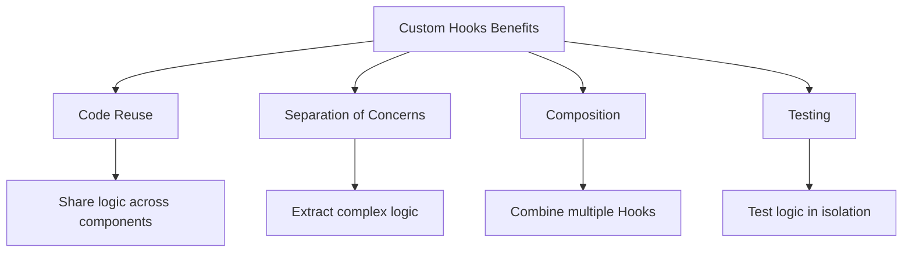

# Topic 19: Custom Hooks - Reusable Logic Patterns

[← Previous: useCallback Hook](./18_usecallback_hook.md) | [Back to Main](../README.md) | [Next: Concurrent Hooks →](./20_concurrent_hooks.md)

---

## Table of Contents

1. [Overview](#overview)
2. [What are Custom Hooks?](#what-are-custom-hooks)
3. [Creating Custom Hooks](#creating-custom-hooks)
4. [Custom Hook Patterns](#custom-hook-patterns)
5. [Composing Hooks](#composing-hooks)
6. [TypeScript Custom Hooks](#typescript-custom-hooks)
7. [Testing Custom Hooks](#testing-custom-hooks)
8. [Common Custom Hooks](#common-custom-hooks)
9. [Best Practices](#best-practices)
10. [Advanced Patterns](#advanced-patterns)
11. [Hook Libraries](#hook-libraries)

---

## Overview

**Custom Hooks** are JavaScript functions that use React Hooks and follow the "use" naming convention. They let you extract component logic into reusable functions, enabling powerful code sharing patterns.

**What You'll Learn:**
- What custom Hooks are and why they're powerful
- How to create custom Hooks
- Common patterns and best practices
- Hook composition strategies
- TypeScript typing for custom Hooks
- Testing custom Hooks in isolation
- Popular custom Hook libraries

**Prerequisites:**
- All built-in React Hooks (useState, useEffect, etc.)
- Understanding of closures and composition
- TypeScript basics (for typed examples)

**Version Coverage:**
- React 16.8+ (Hooks introduction)
- React 19.2

---

## What are Custom Hooks?

### Core Concept

A **custom Hook** is a JavaScript function that:
1. Starts with "use" prefix
2. Can call other Hooks
3. Returns anything you want (values, functions, objects)

```tsx
// Simple custom Hook
function useWindowWidth() {
  const [width, setWidth] = useState(window.innerWidth);
  
  useEffect(() => {
    const handleResize = () => setWidth(window.innerWidth);
    window.addEventListener('resize', handleResize);
    return () => window.removeEventListener('resize', handleResize);
  }, []);
  
  return width;
}

// Usage
function Component() {
  const width = useWindowWidth();
  
  return <div>Window width: {width}px</div>;
}
```

### Why Custom Hooks?



**Before Custom Hooks:**
- HOCs (Higher-Order Components)
- Render Props
- Both added wrapper components and complexity

**With Custom Hooks:**
- No extra components in tree
- Simple function calls
- Natural JavaScript composition

---

## Creating Custom Hooks

### Basic Pattern

```tsx
// Pattern: Extract stateful logic
function useCounter(initialValue = 0) {
  const [count, setCount] = useState(initialValue);
  
  const increment = () => setCount(c => c + 1);
  const decrement = () => setCount(c => c - 1);
  const reset = () => setCount(initialValue);
  
  return { count, increment, decrement, reset };
}

// Usage
function Component() {
  const counter = useCounter(0);
  
  return (
    <>
      <p>Count: {counter.count}</p>
      <button onClick={counter.increment}>+</button>
      <button onClick={counter.decrement}>-</button>
      <button onClick={counter.reset}>Reset</button>
    </>
  );
}
```

### Steps to Create Custom Hooks

```tsx
// Step 1: Identify repeated logic
// Multiple components doing this:
function ComponentA() {
  const [width, setWidth] = useState(window.innerWidth);
  useEffect(() => {
    const handleResize = () => setWidth(window.innerWidth);
    window.addEventListener('resize', handleResize);
    return () => window.removeEventListener('resize', handleResize);
  }, []);
}

// Step 2: Extract to function with "use" prefix
function useWindowWidth() {
  const [width, setWidth] = useState(window.innerWidth);
  
  useEffect(() => {
    const handleResize = () => setWidth(window.innerWidth);
    window.addEventListener('resize', handleResize);
    return () => window.removeEventListener('resize', handleResize);
  }, []);
  
  return width;
}

// Step 3: Use in components
function ComponentA() {
  const width = useWindowWidth();
  return <div>{width}</div>;
}

function ComponentB() {
  const width = useWindowWidth();
  return <span>{width}</span>;
}
```

---

## Custom Hook Patterns

### State Management Hooks

```tsx
// useToggle - Boolean toggle
function useToggle(initialValue = false): [boolean, () => void, () => void, () => void] {
  const [value, setValue] = useState(initialValue);
  
  const toggle = useCallback(() => setValue(v => !v), []);
  const setTrue = useCallback(() => setValue(true), []);
  const setFalse = useCallback(() => setValue(false), []);
  
  return [value, toggle, setTrue, setFalse];
}

// Usage
function Modal() {
  const [isOpen, toggle, open, close] = useToggle(false);
  
  return (
    <>
      <button onClick={open}>Open</button>
      {isOpen && (
        <div className="modal">
          <button onClick={close}>Close</button>
        </div>
      )}
    </>
  );
}

// useLocalStorage - Persist state
function useLocalStorage<T>(key: string, initialValue: T) {
  const [storedValue, setStoredValue] = useState<T>(() => {
    try {
      const item = window.localStorage.getItem(key);
      return item ? JSON.parse(item) : initialValue;
    } catch (error) {
      console.error(error);
      return initialValue;
    }
  });
  
  const setValue = (value: T | ((val: T) => T)) => {
    try {
      const valueToStore = value instanceof Function ? value(storedValue) : value;
      setStoredValue(valueToStore);
      window.localStorage.setItem(key, JSON.stringify(valueToStore));
    } catch (error) {
      console.error(error);
    }
  };
  
  return [storedValue, setValue] as const;
}

// Usage
function Component() {
  const [name, setName] = useLocalStorage('name', '');
  
  return (
    <input 
      value={name}
      onChange={(e) => setName(e.target.value)}
    />
  );
}
```

### Data Fetching Hooks

```tsx
// useFetch - Generic data fetching
function useFetch<T>(url: string) {
  const [data, setData] = useState<T | null>(null);
  const [loading, setLoading] = useState(true);
  const [error, setError] = useState<Error | null>(null);
  
  useEffect(() => {
    let cancelled = false;
    
    setLoading(true);
    setError(null);
    
    fetch(url)
      .then(res => res.json())
      .then(data => {
        if (!cancelled) {
          setData(data);
          setLoading(false);
        }
      })
      .catch(err => {
        if (!cancelled) {
          setError(err);
          setLoading(false);
        }
      });
    
    return () => {
      cancelled = true;
    };
  }, [url]);
  
  return { data, loading, error };
}

// Usage
function UserProfile({ userId }: { userId: number }) {
  const { data: user, loading, error } = useFetch<User>(`/api/users/${userId}`);
  
  if (loading) return <div>Loading...</div>;
  if (error) return <div>Error: {error.message}</div>;
  if (!user) return <div>No user found</div>;
  
  return <div>{user.name}</div>;
}
```

### Form Hooks

```tsx
// useForm - Form state management
function useForm<T extends Record<string, any>>(initialValues: T) {
  const [values, setValues] = useState<T>(initialValues);
  const [errors, setErrors] = useState<Partial<Record<keyof T, string>>>({});
  const [touched, setTouched] = useState<Partial<Record<keyof T, boolean>>>({});
  
  const handleChange = (name: keyof T) => (
    e: React.ChangeEvent<HTMLInputElement>
  ) => {
    setValues({ ...values, [name]: e.target.value });
  };
  
  const handleBlur = (name: keyof T) => () => {
    setTouched({ ...touched, [name]: true });
  };
  
  const setFieldError = (name: keyof T, error: string) => {
    setErrors({ ...errors, [name]: error });
  };
  
  const reset = () => {
    setValues(initialValues);
    setErrors({});
    setTouched({});
  };
  
  return {
    values,
    errors,
    touched,
    handleChange,
    handleBlur,
    setFieldError,
    reset,
    setValues
  };
}

// Usage
function RegistrationForm() {
  const form = useForm({
    email: '',
    password: '',
    username: ''
  });
  
  return (
    <form>
      <input
        value={form.values.email}
        onChange={form.handleChange('email')}
        onBlur={form.handleBlur('email')}
      />
      {form.touched.email && form.errors.email && (
        <span>{form.errors.email}</span>
      )}
      
      {/* More fields */}
    </form>
  );
}
```

---

## Composing Hooks

### Hooks Calling Hooks

```tsx
// Hook that uses multiple other Hooks
function useUser(userId: number) {
  const [user, setUser] = useState(null);
  const [loading, setLoading] = useState(true);
  const [error, setError] = useState(null);
  
  useEffect(() => {
    setLoading(true);
    setError(null);
    
    fetchUser(userId)
      .then(setUser)
      .catch(setError)
      .finally(() => setLoading(false));
  }, [userId]);
  
  return { user, loading, error };
}

// Hook that uses custom Hook
function useUserPosts(userId: number) {
  const { user, loading: userLoading } = useUser(userId);  // Uses custom Hook!
  const [posts, setPosts] = useState([]);
  const [loading, setLoading] = useState(true);
  
  useEffect(() => {
    if (user) {
      setLoading(true);
      fetchPosts(user.id)
        .then(setPosts)
        .finally(() => setLoading(false));
    }
  }, [user]);
  
  return {
    posts,
    loading: userLoading || loading
  };
}

// Usage
function Component({ userId }) {
  const { posts, loading } = useUserPosts(userId);
  
  if (loading) return <div>Loading...</div>;
  return <div>{posts.length} posts</div>;
}
```

### Hook Composition Patterns

```tsx
// Pattern 1: Sequential composition
function useAuthenticatedFetch(url: string) {
  const { token } = useAuth();  // Custom Hook
  const { data, loading } = useFetch(url, {  // Another custom Hook
    headers: { Authorization: `Bearer ${token}` }
  });
  
  return { data, loading };
}

// Pattern 2: Conditional composition
function useFeature(featureName: string) {
  const { features } = useFeatureFlags();  // Custom Hook
  const isEnabled = features[featureName];
  
  const data = useFeatureData(featureName, {
    skip: !isEnabled  // Conditionally use Hook
  });
  
  return { isEnabled, data };
}

// Pattern 3: Parallel composition
function useDashboardData() {
  const users = useFetch('/api/users');
  const posts = useFetch('/api/posts');
  const comments = useFetch('/api/comments');
  
  const loading = users.loading || posts.loading || comments.loading;
  const error = users.error || posts.error || comments.error;
  
  return {
    users: users.data,
    posts: posts.data,
    comments: comments.data,
    loading,
    error
  };
}
```

---

## TypeScript Custom Hooks

### Typed Return Values

```tsx
// Array return (tuple)
function useToggle(initial = false): [boolean, () => void] {
  const [value, setValue] = useState(initial);
  const toggle = useCallback(() => setValue(v => !v), []);
  return [value, toggle];
}

// Object return
interface UseCounterReturn {
  count: number;
  increment: () => void;
  decrement: () => void;
  reset: () => void;
}

function useCounter(initial = 0): UseCounterReturn {
  const [count, setCount] = useState(initial);
  
  return {
    count,
    increment: useCallback(() => setCount(c => c + 1), []),
    decrement: useCallback(() => setCount(c => c - 1), []),
    reset: useCallback(() => setCount(initial), [initial])
  };
}
```

### Generic Custom Hooks

```tsx
// Generic Hook
function useArray<T>(initial: T[] = []): {
  items: T[];
  add: (item: T) => void;
  remove: (index: number) => void;
  clear: () => void;
  update: (index: number, item: T) => void;
} {
  const [items, setItems] = useState<T[]>(initial);
  
  const add = useCallback((item: T) => {
    setItems(prev => [...prev, item]);
  }, []);
  
  const remove = useCallback((index: number) => {
    setItems(prev => prev.filter((_, i) => i !== index));
  }, []);
  
  const clear = useCallback(() => {
    setItems([]);
  }, []);
  
  const update = useCallback((index: number, item: T) => {
    setItems(prev => prev.map((curr, i) => i === index ? item : curr));
  }, []);
  
  return { items, add, remove, clear, update };
}

// Usage with specific type
interface Todo {
  id: number;
  text: string;
  completed: boolean;
}

function TodoList() {
  const { items: todos, add, remove } = useArray<Todo>([]);
  
  return (
    <ul>
      {todos.map((todo, index) => (
        <li key={todo.id}>
          {todo.text}
          <button onClick={() => remove(index)}>Delete</button>
        </li>
      ))}
    </ul>
  );
}
```

---

## Common Custom Hooks

### useDebounce

```tsx
function useDebounce<T>(value: T, delay: number): T {
  const [debouncedValue, setDebouncedValue] = useState<T>(value);
  
  useEffect(() => {
    const timer = setTimeout(() => {
      setDebouncedValue(value);
    }, delay);
    
    return () => clearTimeout(timer);
  }, [value, delay]);
  
  return debouncedValue;
}

// Usage
function SearchComponent() {
  const [searchTerm, setSearchTerm] = useState('');
  const debouncedSearch = useDebounce(searchTerm, 500);
  
  useEffect(() => {
    if (debouncedSearch) {
      // API call only after user stops typing for 500ms
      searchAPI(debouncedSearch);
    }
  }, [debouncedSearch]);
  
  return (
    <input
      value={searchTerm}
      onChange={(e) => setSearchTerm(e.target.value)}
    />
  );
}
```

### usePrevious

```tsx
function usePrevious<T>(value: T): T | undefined {
  const ref = useRef<T>();
  
  useEffect(() => {
    ref.current = value;
  }, [value]);
  
  return ref.current;
}

// Usage
function Component({ count }) {
  const previousCount = usePrevious(count);
  
  return (
    <div>
      <p>Current: {count}</p>
      <p>Previous: {previousCount}</p>
      <p>Changed: {count !== previousCount}</p>
    </div>
  );
}
```

### useAsync

```tsx
type AsyncState<T> = {
  data: T | null;
  loading: boolean;
  error: Error | null;
};

function useAsync<T>(
  asyncFunction: () => Promise<T>,
  immediate = true
): AsyncState<T> & { execute: () => Promise<void> } {
  const [state, setState] = useState<AsyncState<T>>({
    data: null,
    loading: immediate,
    error: null
  });
  
  const execute = useCallback(async () => {
    setState({ data: null, loading: true, error: null });
    
    try {
      const data = await asyncFunction();
      setState({ data, loading: false, error: null });
    } catch (error) {
      setState({ data: null, loading: false, error: error as Error });
    }
  }, [asyncFunction]);
  
  useEffect(() => {
    if (immediate) {
      execute();
    }
  }, [execute, immediate]);
  
  return { ...state, execute };
}

// Usage
function UserProfile({ userId }) {
  const { data: user, loading, error, execute: refetch } = useAsync(
    () => fetchUser(userId),
    true
  );
  
  if (loading) return <div>Loading...</div>;
  if (error) return <div>Error: {error.message}</div>;
  
  return (
    <div>
      <h1>{user?.name}</h1>
      <button onClick={refetch}>Refresh</button>
    </div>
  );
}
```

### useMediaQuery

```tsx
function useMediaQuery(query: string): boolean {
  const [matches, setMatches] = useState(() => {
    return window.matchMedia(query).matches;
  });
  
  useEffect(() => {
    const mediaQuery = window.matchMedia(query);
    
    const handleChange = (e: MediaQueryListEvent) => {
      setMatches(e.matches);
    };
    
    mediaQuery.addEventListener('change', handleChange);
    
    return () => {
      mediaQuery.removeEventListener('change', handleChange);
    };
  }, [query]);
  
  return matches;
}

// Usage
function ResponsiveComponent() {
  const isMobile = useMediaQuery('(max-width: 768px)');
  const isTablet = useMediaQuery('(min-width: 769px) and (max-width: 1024px)');
  const isDesktop = useMediaQuery('(min-width: 1025px)');
  
  if (isMobile) return <MobileView />;
  if (isTablet) return <TabletView />;
  return <DesktopView />;
}
```

### useInterval

```tsx
function useInterval(callback: () => void, delay: number | null) {
  const savedCallback = useRef(callback);
  
  // Remember latest callback
  useEffect(() => {
    savedCallback.current = callback;
  }, [callback]);
  
  // Set up interval
  useEffect(() => {
    if (delay === null) return;
    
    const tick = () => {
      savedCallback.current();
    };
    
    const id = setInterval(tick, delay);
    
    return () => clearInterval(id);
  }, [delay]);
}

// Usage
function Timer() {
  const [seconds, setSeconds] = useState(0);
  const [isRunning, setIsRunning] = useState(true);
  
  useInterval(() => {
    setSeconds(s => s + 1);
  }, isRunning ? 1000 : null);  // null pauses interval
  
  return (
    <div>
      <p>{seconds}s</p>
      <button onClick={() => setIsRunning(!isRunning)}>
        {isRunning ? 'Pause' : 'Resume'}
      </button>
    </div>
  );
}
```

### useOnClickOutside

```tsx
function useOnClickOutside<T extends HTMLElement = HTMLElement>(
  ref: RefObject<T>,
  handler: (event: MouseEvent | TouchEvent) => void
) {
  useEffect(() => {
    const listener = (event: MouseEvent | TouchEvent) => {
      if (!ref.current || ref.current.contains(event.target as Node)) {
        return;
      }
      handler(event);
    };
    
    document.addEventListener('mousedown', listener);
    document.addEventListener('touchstart', listener);
    
    return () => {
      document.removeEventListener('mousedown', listener);
      document.removeEventListener('touchstart', listener);
    };
  }, [ref, handler]);
}

// Usage
function Dropdown() {
  const [isOpen, setIsOpen] = useState(false);
  const dropdownRef = useRef<HTMLDivElement>(null);
  
  useOnClickOutside(dropdownRef, () => setIsOpen(false));
  
  return (
    <div ref={dropdownRef}>
      <button onClick={() => setIsOpen(!isOpen)}>Toggle</button>
      {isOpen && <div className="menu">Menu items</div>}
    </div>
  );
}
```

---

## Best Practices

### 1. Follow Naming Convention

```tsx
// ✅ Start with "use"
function useWindowSize() {}
function useFetch() {}
function useAuth() {}

// ❌ Don't start with other names
function getWindowSize() {}  // Wrong!
function fetchData() {}  // Wrong!
```

### 2. Return Consistent Types

```tsx
// ✅ Array return (good for short lists)
function useToggle() {
  return [value, toggle] as const;
}
const [isOpen, toggleOpen] = useToggle();

// ✅ Object return (good for many values)
function useForm() {
  return { values, errors, handleChange, handleSubmit };
}
const { values, errors } = useForm();
```

### 3. Keep Hooks Focused

```tsx
// ❌ Hook does too much
function useEverything() {
  const [user, setUser] = useState(null);
  const [theme, setTheme] = useState('dark');
  const [language, setLanguage] = useState('en');
  // Unrelated concerns mixed
}

// ✅ Separate Hooks
function useUser() {
  const [user, setUser] = useState(null);
  return { user, setUser };
}

function useTheme() {
  const [theme, setTheme] = useState('dark');
  return { theme, setTheme };
}
```

### 4. Document Custom Hooks

```tsx
/**
 * Custom Hook for managing form state
 * 
 * @template T - Shape of form values
 * @param initialValues - Initial form values
 * @returns Form state and handlers
 * 
 * @example
 * ```tsx
 * const form = useForm({ email: '', password: '' });
 * 
 * <input
 *   value={form.values.email}
 *   onChange={form.handleChange('email')}
 * />
 * ```
 */
function useForm<T extends Record<string, any>>(initialValues: T) {
  // Implementation
}
```

---

## Testing Custom Hooks

### Using @testing-library/react-hooks

```tsx
import { renderHook, act } from '@testing-library/react';

describe('useCounter', () => {
  it('should initialize with default value', () => {
    const { result } = renderHook(() => useCounter(0));
    
    expect(result.current.count).toBe(0);
  });
  
  it('should increment counter', () => {
    const { result } = renderHook(() => useCounter(0));
    
    act(() => {
      result.current.increment();
    });
    
    expect(result.current.count).toBe(1);
  });
  
  it('should reset counter', () => {
    const { result } = renderHook(() => useCounter(5));
    
    act(() => {
      result.current.increment();
      result.current.increment();
    });
    
    expect(result.current.count).toBe(7);
    
    act(() => {
      result.current.reset();
    });
    
    expect(result.current.count).toBe(5);
  });
});
```

---

## Higher-Order Thinking FAQs

### 1. Why do custom Hooks need to start with "use", and what breaks if you don't follow this convention?

**Deep Answer:**

The "use" prefix is **not just convention** - it's required for React's linting rules and future optimizations to work correctly.

**ESLint Rules of Hooks:**

```tsx
// ✅ With "use" prefix - ESLint enforces rules
function useCustom() {
  if (condition) {
    useState(0);  // ❌ ESLint error: conditional Hook
  }
}

// ❌ Without "use" prefix - ESLint doesn't check
function custom() {
  if (condition) {
    useState(0);  // No ESLint error, but will crash at runtime!
  }
}
```

**React Compiler:**

```tsx
// React 19 Compiler recognizes "use" prefix
function useData() {
  const data = expensiveComputation();
  return data;
}

// Compiler knows:
// - This is a Hook
// - Can optimize Hook calls
// - Enforce Hook rules

// Without "use":
function getData() {
  const data = expensiveComputation();
  return data;
}

// Compiler treats as regular function
// - Doesn't optimize
// - Doesn't enforce Hook rules
```

**Future Tooling:**

```tsx
// Future React features may rely on "use" prefix
// - Automatic dependency tracking
// - Advanced optimizations
// - Better dev tools
```

**What Actually Breaks:**

```tsx
// Runtime: Nothing breaks immediately
function customHook() {
  const [state, setState] = useState(0);  // Works at runtime
  return state;
}

// But:
// 1. ESLint won't catch Hook rule violations
// 2. React DevTools won't show as Hook
// 3. Future optimizations won't apply
// 4. Violates React conventions (confusing for team)
```

**Deep Implication:**

The "use" prefix is React's way of marking functions as **special** - they participate in React's lifecycle and must follow Hook rules. It's a lightweight form of **static analysis** that enables tooling to provide safety guarantees. Breaking the convention means opting out of React's safety net.

### 2. Can custom Hooks call other custom Hooks, and are there limits to Hook composition depth?

**Deep Answer:**

Custom Hooks **can and should** compose other Hooks, but deep nesting can impact debugging and performance.

**Composition is Core Feature:**

```tsx
// ✅ Hooks calling Hooks
function useUser(userId) {
  return useFetch(`/api/users/${userId}`);  // Custom Hook calling custom Hook
}

function useUserWithPosts(userId) {
  const user = useUser(userId);  // Calls useUser
  const posts = useFetch(`/api/posts?userId=${userId}`);  // Calls useFetch
  
  return { user, posts };
}

function useCompleteProfile(userId) {
  const { user, posts } = useUserWithPosts(userId);  // Calls useUserWithPosts
  const friends = useFriends(userId);  // Calls another Hook
  
  return { user, posts, friends };
}

// Composition depth: 3 levels
// useCompleteProfile → useUserWithPosts → useUser → useFetch
```

**No Hard Limit:**

```tsx
// React has no limit on composition depth
// But consider:

// Depth 1-3: Good, clear abstraction
function useFeatureA() {
  const data = useFetch('/api/a');
  return process(data);
}

// Depth 4-6: Acceptable, but watch complexity
function useFeatureB() {
  const a = useFeatureA();
  const b = useFetch('/api/b');
  return combine(a, b);
}

// Depth 7+: Code smell, hard to debug
function useEverything() {
  const a = useFeatureA();
  const b = useFeatureB();
  const c = useFeatureC();
  // etc...
  // Too many layers of indirection
}
```

**Performance Impact:**

```tsx
// Each Hook adds overhead:
// - Function call
// - Dependency tracking
// - Memory for state

// Deep nesting compounds this:
function useDeepChain() {
  const a = useA();  // Overhead
  const b = useB(a); // Overhead
  const c = useC(b); // Overhead
  const d = useD(c); // Overhead
  return d;
}

// Total overhead = sum of all Hooks in chain
```

**Debugging Challenges:**

```tsx
// Deep composition makes debugging harder
function Component() {
  const data = useDeepChain();
  // Where did this data come from?
  // What Hooks were called?
  // Which Hook has the bug?
}

// React DevTools shows Hook tree, but deep nesting is hard to follow
```

**Best Practices:**

```tsx
// 1. Keep composition shallow (2-3 levels max)
// 2. Name Hooks descriptively to show relationship
function useUserData() {}      // Level 1
function useUserPosts() {}     // Level 1 (uses useUserData internally)
function useUserDashboard() {} // Level 2 (uses useUserData + useUserPosts)

// 3. Consider flattening if too deep
// Instead of: useA() → useB() → useC() → useD()
// Maybe: useABCD() with all logic in one Hook
```

**Deep Implication:**

Hook composition is React's answer to **code reuse without wrapper hell**. Unlike HOCs which create nested components, Hooks compose **flatly** - all Hook calls are at the same level in the component. But deep logical nesting can still hurt debugging and performance. Balance reusability with clarity.

### 3. How do you handle cleanup in custom Hooks when they're used multiple times in the same component?

**Deep Answer:**

Each Hook instance gets its **own cleanup**, ensuring no interference between multiple uses.

**Multiple Hook Instances:**

```tsx
function useSubscription(topic: string) {
  useEffect(() => {
    console.log(`Subscribing to ${topic}`);
    const
