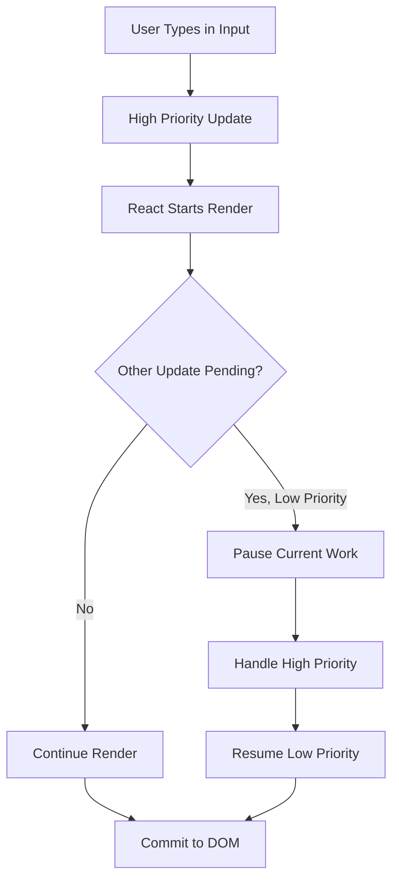
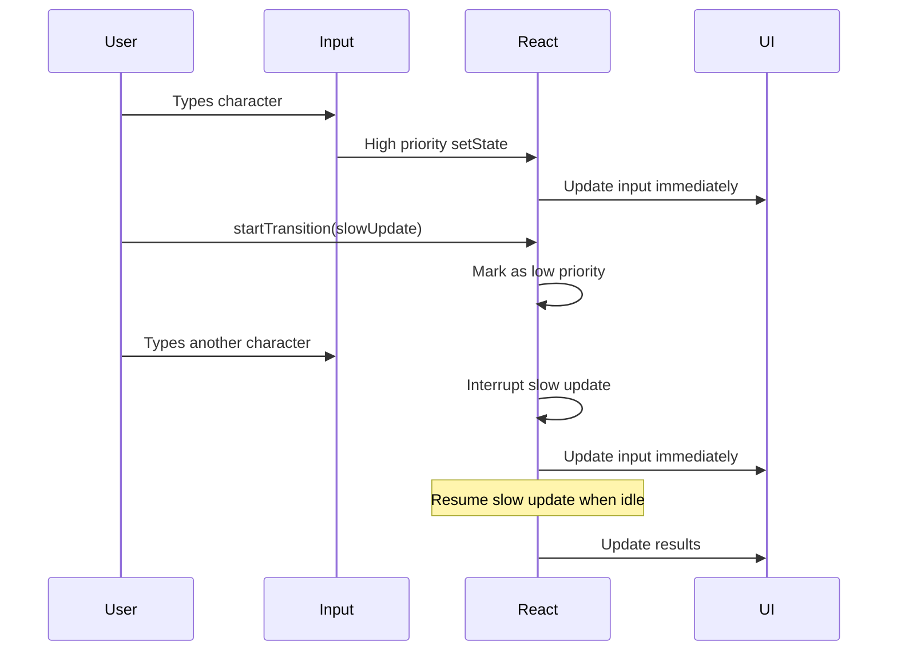
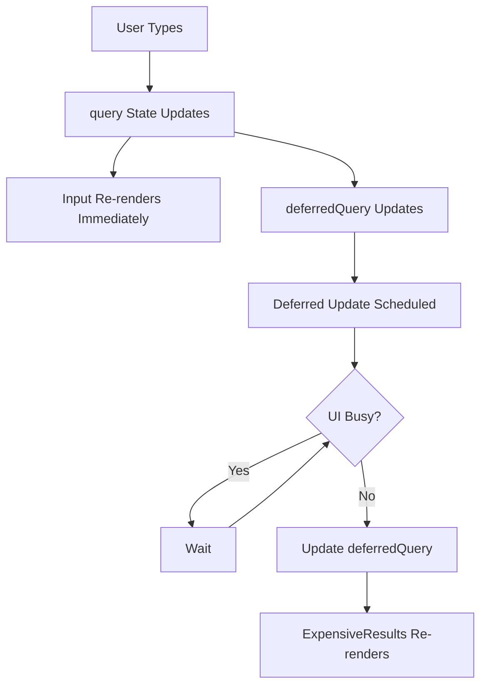
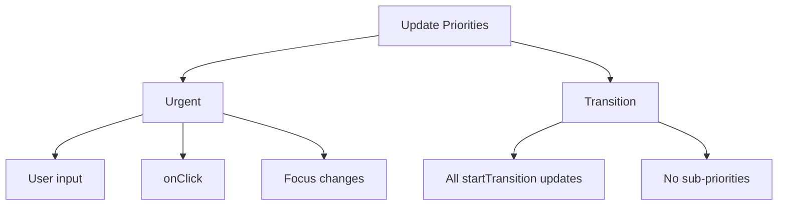

# Topic 20: Concurrent Hooks - useTransition & useDeferredValue

[← Previous: Custom Hooks](./19_custom_hooks.md) | [Back to Main](../README.md) | [Next: use Hook →](./21_use_hook.md)

---

## Table of Contents

1. [Overview](#overview)
2. [Concurrent Rendering](#concurrent-rendering)
3. [useTransition Hook](#usetransition-hook)
4. [useDeferredValue Hook](#usedeferredvalue-hook)
5. [useTransition vs useDeferredValue](#usetransition-vs-usedeferredvalue)
6. [Performance Optimization](#performance-optimization)
7. [Common Use Cases](#common-use-cases)
8. [TypeScript with Concurrent Hooks](#typescript-with-concurrent-hooks)
9. [Best Practices](#best-practices)
10. [Real-World Examples](#real-world-examples)

---

## Overview

**Concurrent Hooks** (useTransition and useDeferredValue) enable React 18's concurrent rendering features, allowing you to mark certain updates as low-priority to keep the UI responsive.

**What You'll Learn:**
- What concurrent rendering is and why it matters
- useTransition for marking updates as transitions
- useDeferredValue for deferring value updates
- When to use each concurrent Hook
- Performance optimization strategies
- Real-world use cases and patterns

**Prerequisites:**
- Understanding of React rendering
- useState and useEffect Hooks
- Basic performance concepts

**Version Coverage:**
- React 18+ (Concurrent Features)
- React 19.2

---

## Concurrent Rendering

### What is Concurrent Rendering?

**Concurrent rendering** allows React to work on multiple renders simultaneously and interrupt less important work to handle urgent updates.



### Without Concurrent Features

```tsx
// Before React 18: All updates block UI
function SearchResults() {
  const [query, setQuery] = useState('');
  const [results, setResults] = useState([]);
  
  const handleChange = (e) => {
    const newQuery = e.target.value;
    setQuery(newQuery);  // Update input
    
    // Expensive computation blocks input
    const newResults = expensiveSearch(newQuery);
    setResults(newResults);
    
    // Input feels laggy!
  };
  
  return (
    <>
      <input value={query} onChange={handleChange} />
      <ResultsList results={results} />
    </>
  );
}
```

### With Concurrent Features

```tsx
// React 18+: Mark expensive work as low-priority
function SearchResults() {
  const [query, setQuery] = useState('');
  const [results, setResults] = useState([]);
  const [isPending, startTransition] = useTransition();
  
  const handleChange = (e) => {
    const newQuery = e.target.value;
    setQuery(newQuery);  // High priority (immediate)
    
    // Mark as low-priority transition
    startTransition(() => {
      const newResults = expensiveSearch(newQuery);
      setResults(newResults);  // Low priority (can be interrupted)
    });
    
    // Input stays responsive!
  };
  
  return (
    <>
      <input value={query} onChange={handleChange} />
      {isPending && <Spinner />}
      <ResultsList results={results} />
    </>
  );
}
```

---

## useTransition Hook

### Basic Syntax

```tsx
import { useTransition } from 'react';

const [isPending, startTransition] = useTransition();

// isPending: Boolean indicating if transition is in progress
// startTransition: Function to mark updates as transitions
```

### Simple Example

```tsx
function TabContainer() {
  const [tab, setTab] = useState('home');
  const [isPending, startTransition] = useTransition();
  
  const selectTab = (nextTab: string) => {
    startTransition(() => {
      setTab(nextTab);  // Marked as transition
    });
  };
  
  return (
    <>
      <button onClick={() => selectTab('home')}>Home</button>
      <button onClick={() => selectTab('posts')}>Posts</button>
      <button onClick={() => selectTab('profile')}>Profile</button>
      
      {isPending && <Spinner />}
      
      <div>
        {tab === 'home' && <HomeTab />}
        {tab === 'posts' && <PostsTab />}  {/* Slow to render */}
        {tab === 'profile' && <ProfileTab />}
      </div>
    </>
  );
}
```

### How useTransition Works



### isPending State

```tsx
function Component() {
  const [isPending, startTransition] = useTransition();
  const [query, setQuery] = useState('');
  const [results, setResults] = useState([]);
  
  const handleSearch = (newQuery: string) => {
    setQuery(newQuery);  // Immediate
    
    startTransition(() => {
      const newResults = search(newQuery);
      setResults(newResults);  // Deferred
    });
  };
  
  return (
    <>
      <input value={query} onChange={(e) => handleSearch(e.target.value)} />
      
      {/* Show loading state during transition */}
      {isPending && <div>Searching...</div>}
      
      {/* Dim results while pending */}
      <div style={{ opacity: isPending ? 0.5 : 1 }}>
        <ResultsList results={results} />
      </div>
    </>
  );
}
```

---

## useDeferredValue Hook

### Basic Syntax

```tsx
import { useDeferredValue } from 'react';

const deferredValue = useDeferredValue(value);

// deferredValue: "Lags behind" value during expensive renders
```

### Simple Example

```tsx
function SearchResults() {
  const [query, setQuery] = useState('');
  const deferredQuery = useDeferredValue(query);
  
  // query updates immediately (input responsive)
  // deferredQuery updates after (deferred)
  
  return (
    <>
      <input 
        value={query}
        onChange={(e) => setQuery(e.target.value)}
      />
      
      {/* Uses deferred value for expensive render */}
      <ExpensiveResults query={deferredQuery} />
    </>
  );
}

function ExpensiveResults({ query }) {
  // Expensive filtering/rendering
  const results = useMemo(() => {
    return expensiveSearch(query);
  }, [query]);
  
  return (
    <ul>
      {results.map(r => <li key={r.id}>{r.name}</li>)}
    </ul>
  );
}
```

### How useDeferredValue Works



---

## useTransition vs useDeferredValue

### Key Differences

| Aspect | useTransition | useDeferredValue |
|--------|---------------|------------------|
| **Controls** | State updates | Value "lag" |
| **Access to Value** | In startTransition | Component has it |
| **isPending** | Yes | No (but can detect) |
| **Use When** | You control the update | You receive the value |
| **Typical Use** | Event handlers | Props from parent |

### When to Use Each

```tsx
// ✅ useTransition: You control the state update
function Component() {
  const [tab, setTab] = useState('home');
  const [isPending, startTransition] = useTransition();
  
  const selectTab = (nextTab) => {
    startTransition(() => {
      setTab(nextTab);  // You're calling setState
    });
  };
}

// ✅ useDeferredValue: You receive value as prop
function Child({ query }) {  // Receives query from parent
  const deferredQuery = useDeferredValue(query);
  
  // Use deferredQuery for expensive render
  return <ExpensiveList query={deferredQuery} />;
}
```

### Side-by-Side Comparison

```tsx
// Same functionality, different approaches

// Approach 1: useTransition
function Parent() {
  const [query, setQuery] = useState('');
  const [results, setResults] = useState([]);
  const [isPending, startTransition] = useTransition();
  
  const handleChange = (e) => {
    setQuery(e.target.value);  // Immediate
    
    startTransition(() => {
      setResults(search(e.target.value));  // Deferred
    });
  };
  
  return (
    <>
      <input value={query} onChange={handleChange} />
      {isPending && <Spinner />}
      <Results data={results} />
    </>
  );
}

// Approach 2: useDeferredValue
function Parent() {
  const [query, setQuery] = useState('');
  const deferredQuery = useDeferredValue(query);
  
  return (
    <>
      <input 
        value={query}
        onChange={(e) => setQuery(e.target.value)}
      />
      <Results query={deferredQuery} />  {/* Receives deferred value */}
    </>
  );
}

function Results({ query }) {
  const results = useMemo(() => search(query), [query]);
  return <div>{results.map(r => <div key={r.id}>{r.name}</div>)}</div>;
}
```

---

## Performance Optimization

### Keeping Input Responsive

```tsx
// Problem: Slow filtering blocks input
function SearchableList({ items }) {
  const [query, setQuery] = useState('');
  
  // ❌ Expensive filter blocks typing
  const filtered = items.filter(item =>
    item.name.toLowerCase().includes(query.toLowerCase())
  );
  
  return (
    <>
      <input value={query} onChange={(e) => setQuery(e.target.value)} />
      <List items={filtered} />  {/* Laggy input! */}
    </>
  );
}

// Solution: useDeferredValue
function SearchableList({ items }) {
  const [query, setQuery] = useState('');
  const deferredQuery = useDeferredValue(query);
  
  // Filter uses deferred value
  const filtered = useMemo(() =>
    items.filter(item =>
      item.name.toLowerCase().includes(deferredQuery.toLowerCase())
    ),
    [items, deferredQuery]
  );
  
  return (
    <>
      <input value={query} onChange={(e) => setQuery(e.target.value)} />
      <List items={filtered} />  {/* Input stays responsive! */}
    </>
  );
}
```

### Tab Switching

```tsx
function TabContainer() {
  const [tab, setTab] = useState('home');
  const [isPending, startTransition] = useTransition();
  
  const selectTab = (nextTab: string) => {
    startTransition(() => {
      setTab(nextTab);
    });
  };
  
  return (
    <>
      <div className="tabs">
        <TabButton 
          active={tab === 'home'}
          onClick={() => selectTab('home')}
        >
          Home
        </TabButton>
        <TabButton 
          active={tab === 'posts'}
          onClick={() => selectTab('posts')}
          pending={isPending && tab !== 'posts'}
        >
          Posts {isPending && '...'}
        </TabButton>
      </div>
      
      <div className={isPending ? 'dimmed' : ''}>
        {tab === 'home' && <HomeTab />}
        {tab === 'posts' && <PostsTab />}  {/* Expensive */}
        {tab === 'profile' && <ProfileTab />}
      </div>
    </>
  );
}
```

---

## Common Use Cases

### Filtering Large Lists

```tsx
function ProductList({ products }: { products: Product[] }) {
  const [filter, setFilter] = useState('');
  const deferredFilter = useDeferredValue(filter);
  
  const filteredProducts = useMemo(() => {
    return products.filter(p =>
      p.name.toLowerCase().includes(deferredFilter.toLowerCase())
    );
  }, [products, deferredFilter]);
  
  return (
    <>
      <input
        value={filter}
        onChange={(e) => setFilter(e.target.value)}
        placeholder="Search products..."
      />
      
      <div>
        {filteredProducts.map(product => (
          <ProductCard key={product.id} product={product} />
        ))}
      </div>
    </>
  );
}
```

### Route Transitions

```tsx
function Router() {
  const [page, setPage] = useState('home');
  const [isPending, startTransition] = useTransition();
  
  const navigate = (nextPage: string) => {
    startTransition(() => {
      setPage(nextPage);
    });
  };
  
  return (
    <>
      <nav>
        <button onClick={() => navigate('home')}>Home</button>
        <button onClick={() => navigate('dashboard')}>Dashboard</button>
        <button onClick={() => navigate('settings')}>Settings</button>
      </nav>
      
      {isPending && <ProgressBar />}
      
      <main className={isPending ? 'loading' : ''}>
        {page === 'home' && <HomePage />}
        {page === 'dashboard' && <DashboardPage />}  {/* Heavy */}
        {page === 'settings' && <SettingsPage />}
      </main>
    </>
  );
}
```

### Debounced Updates

```tsx
function AutoSave({ content }: { content: string }) {
  const deferredContent = useDeferredValue(content);
  
  useEffect(() => {
    // Auto-save with deferred value
    // Typing won't trigger constant saves
    saveToServer(deferredContent);
  }, [deferredContent]);
  
  return <div>Last saved: {deferredContent.slice(0, 20)}...</div>;
}
```

---

## TypeScript with Concurrent Hooks

### useTransition Types

```tsx
// useTransition returns tuple
const [isPending, startTransition]: [boolean, (callback: () => void) => void] = useTransition();

// startTransition signature
type StartTransition = (callback: () => void) => void;

// Example with types
function Component() {
  const [isPending, startTransition] = useTransition();
  
  const handleClick = () => {
    startTransition(() => {
      // Must be void, no return value
      updateState();
    });
  };
}
```

### useDeferredValue Types

```tsx
// useDeferredValue preserves type
const query: string = 'search';
const deferredQuery: string = useDeferredValue(query);

// Complex types
interface User {
  id: number;
  name: string;
}

const user: User = { id: 1, name: 'Alice' };
const deferredUser: User = useDeferredValue(user);

// Generic type preserved
function Component<T>(props: { value: T }) {
  const deferredValue: T = useDeferredValue(props.value);
}
```

---

## Best Practices

### 1. Use for Expensive Updates

```tsx
// ✅ Good: Expensive rendering
startTransition(() => {
  setResults(expensiveComputation());
});

// ❌ Bad: Simple updates (unnecessary overhead)
startTransition(() => {
  setCount(count + 1);  // Simple update, don't defer
});
```

### 2. Keep Transitions Pure

```tsx
// ✅ Only state updates in transition
startTransition(() => {
  setState(newValue);
});

// ❌ Don't put side effects in transitions
startTransition(() => {
  setState(newValue);
  console.log('Updated');  // Side effect!
  localStorage.setItem('key', 'value');  // Side effect!
});
```

### 3. Provide Loading Feedback

```tsx
// ✅ Show pending state
function Component() {
  const [isPending, startTransition] = useTransition();
  
  return (
    <>
      {isPending && <Spinner />}
      {/* or */}
      <div style={{ opacity: isPending ? 0.5 : 1 }}>
        Content
      </div>
    </>
  );
}
```

---

## Higher-Order Thinking FAQs

### 1. How does useTransition differ from debouncing, and when should you use each?

**Deep Answer:**

useTransition and debouncing solve similar problems but with **different mechanisms** and **tradeoffs**.

**Debouncing:**
```tsx
// Debounce: Delay execution
function Component() {
  const [query, setQuery] = useState('');
  const [results, setResults] = useState([]);
  
  useEffect(() => {
    const timer = setTimeout(() => {
      setResults(search(query));  // Delayed execution
    }, 300);
    
    return () => clearTimeout(timer);
  }, [query]);
}

// Timeline:
// t=0ms: User types 'a'
// t=50ms: User types 'b'
// t=100ms: User types 'c'
// t=400ms: Search executes for 'abc'
// Delay: 300ms minimum
```

**useTransition:**
```tsx
// useTransition: Immediate but interruptible
function Component() {
  const [query, setQuery] = useState('');
  const [results, setResults] = useState([]);
  const [isPending, startTransition] = useTransition();
  
  const handleChange = (e) => {
    setQuery(e.target.value);
    
    startTransition(() => {
      setResults(search(e.target.value));  // Starts immediately
    });
  };
}

// Timeline:
// t=0ms: User types 'a', search starts for 'a'
// t=50ms: User types 'b', search for 'a' interrupted, search starts for 'ab'
// t=100ms: User types 'c', search for 'ab' interrupted, search starts for 'abc'
// t=200ms: Search for 'abc' completes
// Delay: 0ms, but interruptible
```

**Comparison:**

| Aspect | Debouncing | useTransition |
|--------|------------|---------------|
| **Execution** | Delayed | Immediate but interruptible |
| **User Feedback** | Gap in time | Continuous |
| **CPU Usage** | Reduces calls | Uses CPU but non-blocking |
| **Best For** | API calls, saves | Expensive renders |
| **Combines With** | useState | State updates |

**When to Use Each:**

```tsx
// ✅ Debounce: External side effects (API calls)
useEffect(() => {
  const timer = setTimeout(() => {
    fetch(`/api/search?q=${query}`);  // Network call
  }, 300);
  return () => clearTimeout(timer);
}, [query]);

// ✅ useTransition: Expensive rendering
startTransition(() => {
  setResults(localSearch(query));  // CPU-intensive
});

// ✅ Both together: Best of both worlds
function Component() {
  const [query, setQuery] = useState('');
  const debouncedQuery = useDebounce(query, 300);
  
  const [results, setResults] = useState([]);
  const [isPending, startTransition] = useTransition();
  
  useEffect(() => {
    // API call debounced
    startTransition(() => {
      fetch(`/api/search?q=${debouncedQuery}`)
        .then(res => res.json())
        .then(setResults);
    });
  }, [debouncedQuery]);
}
```

**Deep Implication:**

Debouncing is a **time-based** optimization (wait for user to stop), while useTransition is a **priority-based** optimization (do work when UI is idle). Debouncing reduces work; useTransition makes work non-blocking. For the best UX, combine both: debounce API calls, use transitions for rendering.

### 2. Can you nest startTransition calls, and what happens to priorities with multiple concurrent updates?

**Deep Answer:**

Nested transitions work, but React flattens them into a **single priority level** - there's no hierarchy of transition priorities.

**Nested Transitions:**

```tsx
function Component() {
  const [isPending, startTransition] = useTransition();
  
  const handleClick = () => {
    startTransition(() => {
      updateA();
      
      startTransition(() => {
        updateB();  // Nested transition
      });
      
      updateC();
    });
  };
}

// All updates (A, B, C) are treated as same priority
// No "super low priority" for nested transitions
```

**Priority Levels in React:**



**Multiple Concurrent Updates:**

```tsx
function Component() {
  const [search, setSearch] = useState('');
  const [sort, setSort] = useState('name');
  const [filter, setFilter] = useState('all');
  
  const [isPending1, startTransition1] = useTransition();
  const [isPending2, startTransition2] = useTransition();
  
  // Can have multiple transitions
  const updateSearch = (q) => {
    setSearch(q);  // Urgent
    startTransition1(() => {
      // Process search
    });
  };
  
  const updateSort = (s) => {
    startTransition2(() => {
      setSort(s);  // Also transition priority
    });
  };
  
  // Both transitions have same priority
  // If both pending, React interleaves work
}
```

**How React Schedules:**

```tsx
// React's scheduler (simplified):
// 1. Process all urgent updates first
// 2. Then process transition updates
// 3. Transition updates can be interrupted by urgent updates
// 4. Multiple transitions are treated equally

function Component() {
  const handleComplex = () => {
    // Urgent (processed first)
    setInputValue(newValue);
    
    // Transition 1 (deferred)
    startTransition(() => {
      updateResults1();
    });
    
    // Transition 2 (deferred, same priority as 1)
    startTransition(() => {
      updateResults2();
    });
    
    // React ensures:
    // - Input updates first (urgent)
    // - Then processes transitions when UI idle
    // - Can interrupt transitions for new urgent updates
  };
}
```

**Deep Implication:**

React's concurrent model has only **two priority levels**: urgent and transition. This simplicity avoids priority inversion problems and complex scheduling logic. If you need finer-grained control, layer your own logic (debouncing, throttling) on top of React's binary system.

---

## Senior SDE Interview Questions

### Question 1: Concurrent Rendering Architecture

**Question:** "Design a search interface for 100,000 products with autocomplete. Users type quickly and expect instant feedback. How would you architect this using concurrent features?"

**Key Concepts Being Tested:**
- Concurrent features understanding
- Performance architecture
- Trade-off analysis
- Real-world optimization

**Expected Answer Should Cover:**

1. **Problem Analysis:**
```tsx
// Challenges:
// - 100k products: Filtering is expensive
// - Fast typing: Many updates in quick succession  
// - Instant feedback: UI must stay responsive
// - Autocomplete: Need intermediate results
```

2. **Architecture:**
```tsx
function ProductSearch({ products }) {
  const [query, setQuery] = useState('');
  const deferredQuery = useDeferredValue(query);
  const [isPending, startTransition] = useTransition();
  
  // Immediate: Input value
  // Deferred: Search results
  
  const results = useMemo(() => {
    if (!deferredQuery) return [];
    
    return products
      .filter(p => p.name.includes(deferredQuery))
      .slice(0, 10);  // Limit results
  }, [products, deferredQuery]);
  
  return (
    <>
      <input
        value={query}  // Immediate update
        onChange={(e) => setQuery(e.target.value)}
      />
      
      {deferredQuery !== query && <Spinner />}
      
      <Results items={results} />
    </>
  );
}
```

3. **Additional Optimizations:**
- Virtualization for large lists (react-window)
- Web Workers for heavy filtering
- Debouncing API calls if needed
- Memoize product components

**Follow-ups:**
1. "How would you test the perceived performance?"
2. "What if products array updates frequently?"
3. "How does this scale to millions of products?"

**Red Flags:**
- Not using concurrent features
- No consideration of input responsiveness
- Missing virtualization for large lists

**Green Flags:**
- Combines multiple optimization techniques
- Considers UX (loading states)
- Mentions measurement/profiling
- Discusses scalability limits

---

[← Previous: Custom Hooks](./19_custom_hooks.md) | [Back to Main](../README.md) | [Next: use Hook →](./21_use_hook.md)

---

**Progress**: Topic 20/220 completed | Part II: React Hooks (67% complete)
