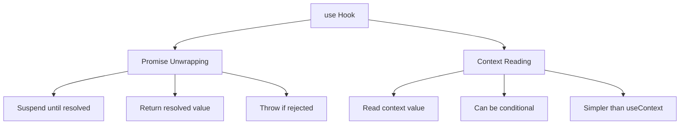
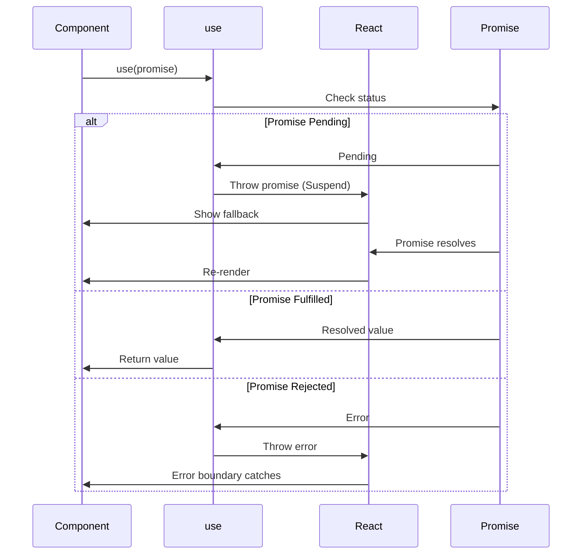
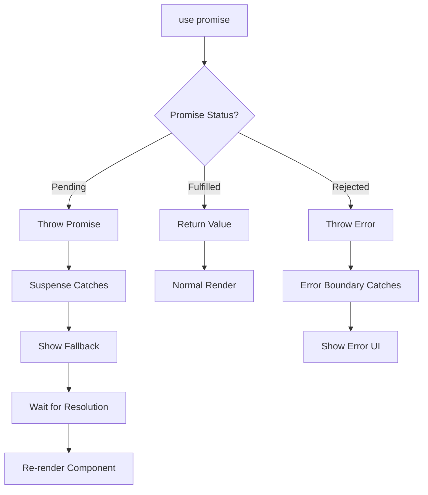

# Topic 21: use Hook - Promise and Context Unwrapping (React 19)

[← Previous: Concurrent Hooks](./20_concurrent_hooks.md) | [Back to Main](../README.md) | [Next: useFormStatus Hook →](./22_useformstatus_hook.md)

---

## Table of Contents

1. [Overview](#overview)
2. [What is the use Hook?](#what-is-the-use-hook)
3. [Promise Unwrapping](#promise-unwrapping)
4. [Context Reading](#context-reading)
5. [Suspense Integration](#suspense-integration)
6. [Error Handling](#error-handling)
7. [TypeScript with use](#typescript-with-use)
8. [use vs useEffect](#use-vs-useeffect)
9. [Common Patterns](#common-patterns)
10. [Best Practices](#best-practices)

---

## Overview

**use** is a revolutionary Hook introduced in React 19 that can unwrap promises and read context synchronously. Unlike other Hooks, `use` can be called conditionally and in loops.

**What You'll Learn:**
- What the use Hook is and why it's revolutionary
- How to unwrap promises with use
- Reading context with use
- Integration with Suspense
- Error handling patterns
- Differences from traditional Hooks
- TypeScript usage

**Prerequisites:**
- Understanding of Promises
- Suspense basics
- Context API knowledge
- Error boundaries

**Version Coverage:**
- React 19+ (use Hook introduction)
- React 19.2

---

## What is the use Hook?

### Revolutionary Features

The `use` Hook breaks traditional Hook rules in important ways:

```tsx
// Traditional Hooks: Must be at top level
function Component() {
  const [state, setState] = useState(0);  // ✅ Top level only
  
  if (condition) {
    const [other, setOther] = useState(0);  // ❌ Can't be conditional!
  }
}

// use Hook: Can be conditional!
function Component({ shouldFetch }) {
  if (shouldFetch) {
    const data = use(fetchData());  // ✅ Conditional is OK!
  }
  
  // Can also be in loops!
  for (let i = 0; i < items.length; i++) {
    const item = use(fetchItem(items[i].id));  // ✅ In loop is OK!
  }
}
```

### Two Main Capabilities



---

## Promise Unwrapping

### Basic Promise Unwrapping

```tsx
// Traditional async pattern
function UserProfile({ userId }) {
  const [user, setUser] = useState(null);
  const [loading, setLoading] = useState(true);
  
  useEffect(() => {
    fetchUser(userId).then(data => {
      setUser(data);
      setLoading(false);
    });
  }, [userId]);
  
  if (loading) return <Loading />;
  return <div>{user?.name}</div>;
}

// With use Hook
function UserProfile({ userId }) {
  const user = use(fetchUser(userId));  // Suspends until resolved
  
  return <div>{user.name}</div>;  // No loading state needed!
}

// Must wrap in Suspense
<Suspense fallback={<Loading />}>
  <UserProfile userId={123} />
</Suspense>
```

### How use Works with Promises



### Promise Lifecycle

```tsx
function Component({ id }) {
  // First render:
  // - use() receives pending promise
  // - use() throws promise
  // - React catches, shows Suspense fallback
  
  // When promise resolves:
  // - React re-renders component
  // - use() receives resolved promise
  // - use() returns value
  // - Component renders with data
  
  const data = use(fetchData(id));
  
  return <div>{data.name}</div>;
}
```

---

## Context Reading

### use vs useContext

```tsx
// Traditional useContext
function Component() {
  const theme = useContext(ThemeContext);
  return <div className={theme}>Content</div>;
}

// With use Hook
function Component() {
  const theme = use(ThemeContext);
  return <div className={theme}>Content</div>;
}

// Looks similar, but use can be conditional!
```

### Conditional Context

```tsx
// ✅ use Hook: Can be conditional
function Component({ shouldUseTheme }) {
  if (shouldUseTheme) {
    const theme = use(ThemeContext);  // ✅ Conditional OK!
    return <div className={theme}>Themed</div>;
  }
  
  return <div>Default</div>;
}

// ❌ useContext: Cannot be conditional
function Component({ shouldUseTheme }) {
  if (shouldUseTheme) {
    const theme = useContext(ThemeContext);  // ❌ Error!
    return <div className={theme}>Themed</div>;
  }
}
```

---

## Suspense Integration

### Basic Suspense Usage

```tsx
// Component that suspends
function User({ userId }) {
  const user = use(fetchUser(userId));
  return <div>{user.name}</div>;
}

// Must be wrapped in Suspense
function App() {
  return (
    <Suspense fallback={<div>Loading user...</div>}>
      <User userId={123} />
    </Suspense>
  );
}
```

### Nested Suspense Boundaries

```tsx
function Dashboard() {
  return (
    <div>
      {/* Independent Suspense boundaries */}
      <Suspense fallback={<UserSkeleton />}>
        <UserInfo />
      </Suspense>
      
      <Suspense fallback={<PostsSkeleton />}>
        <UserPosts />
      </Suspense>
      
      <Suspense fallback={<CommentsSkeleton />}>
        <UserComments />
      </Suspense>
    </div>
  );
}

function UserInfo() {
  const user = use(fetchUser());  // Suspends independently
  return <div>{user.name}</div>;
}

function UserPosts() {
  const posts = use(fetchPosts());  // Suspends independently
  return <div>{posts.length} posts</div>;
}
```

### Waterfall vs Parallel

```tsx
// ❌ Waterfall: Suspends sequentially
function Component() {
  const user = use(fetchUser());      // Suspends first
  const posts = use(fetchPosts());    // Then suspends
  const comments = use(fetchComments()); // Then suspends
  
  // Total time = fetch1 + fetch2 + fetch3
}

// ✅ Parallel: Start all fetches before use
function Component() {
  const userPromise = fetchUser();       // Starts immediately
  const postsPromise = fetchPosts();     // Starts immediately
  const commentsPromise = fetchComments(); // Starts immediately
  
  const user = use(userPromise);      // Suspends if needed
  const posts = use(postsPromise);    // Already fetching
  const comments = use(commentsPromise); // Already fetching
  
  // Total time ≈ max(fetch1, fetch2, fetch3)
}
```

---

## Error Handling

### Error Boundaries with use

```tsx
class ErrorBoundary extends React.Component {
  state = { hasError: false, error: null };
  
  static getDerivedStateFromError(error) {
    return { hasError: true, error };
  }
  
  render() {
    if (this.state.hasError) {
      return <div>Error: {this.state.error.message}</div>;
    }
    
    return this.props.children;
  }
}

// use throws errors from rejected promises
function Component({ userId }) {
  const user = use(fetchUser(userId));
  // If fetchUser rejects, error is thrown
  // Error boundary catches it
  
  return <div>{user.name}</div>;
}

// Usage
<ErrorBoundary>
  <Suspense fallback={<Loading />}>
    <Component userId={123} />
  </Suspense>
</ErrorBoundary>
```

### Try-Catch with use

```tsx
// ❌ Can't catch errors from use directly
function Component() {
  try {
    const data = use(fetchData());  // Error boundary needed!
  } catch (error) {
    return <div>Error!</div>;  // Doesn't work
  }
}

// ✅ Use Error Boundary
<ErrorBoundary fallback={<ErrorDisplay />}>
  <Suspense fallback={<Loading />}>
    <Component />
  </Suspense>
</ErrorBoundary>
```

---

## use vs useEffect

### Data Fetching Comparison

```tsx
// Traditional: useEffect + useState
function Traditional({ userId }) {
  const [user, setUser] = useState(null);
  const [loading, setLoading] = useState(true);
  const [error, setError] = useState(null);
  
  useEffect(() => {
    setLoading(true);
    fetchUser(userId)
      .then(setUser)
      .catch(setError)
      .finally(() => setLoading(false));
  }, [userId]);
  
  if (loading) return <Loading />;
  if (error) return <Error error={error} />;
  return <div>{user?.name}</div>;
}

// Modern: use Hook + Suspense
function Modern({ userId }) {
  const user = use(fetchUser(userId));
  return <div>{user.name}</div>;
}

// Wrap in Suspense + ErrorBoundary
<ErrorBoundary>
  <Suspense fallback={<Loading />}>
    <Modern userId={123} />
  </Suspense>
</ErrorBoundary>
```

### Key Differences

| Aspect | useEffect Pattern | use Hook |
|--------|-------------------|----------|
| **Loading State** | Manual | Suspense |
| **Error Handling** | Manual try/catch | Error boundary |
| **Code Lines** | ~15-20 | ~3-5 |
| **Conditional** | Complex | Simple |
| **Race Conditions** | Manual handling | Automatic |

---

## Common Patterns

### Conditional Data Fetching

```tsx
// ✅ use Hook: Conditional is allowed
function Component({ shouldFetch, userId }) {
  if (!shouldFetch) {
    return <div>Not fetching</div>;
  }
  
  const user = use(fetchUser(userId));  // ✅ Conditional OK!
  return <div>{user.name}</div>;
}
```

### Loop Data Fetching

```tsx
// ✅ use Hook: In loops is allowed
function MultiUser({ userIds }) {
  const users = userIds.map(id => use(fetchUser(id)));  // ✅ In map OK!
  
  return (
    <div>
      {users.map(user => (
        <div key={user.id}>{user.name}</div>
      ))}
    </div>
  );
}
```

### Promise Caching

```tsx
// Create promise cache
const cache = new Map();

function getCachedUser(userId) {
  if (!cache.has(userId)) {
    cache.set(userId, fetchUser(userId));
  }
  return cache.get(userId);
}

// use with cache
function Component({ userId }) {
  const user = use(getCachedUser(userId));
  // Won't refetch if already in cache
  return <div>{user.name}</div>;
}
```

---

## Best Practices

### 1. Always Wrap in Suspense

```tsx
// ✅ Suspense boundary required
<Suspense fallback={<Loading />}>
  <ComponentUsingUse />
</Suspense>

// ❌ Without Suspense: Error!
<ComponentUsingUse />  // Will throw!
```

### 2. Add Error Boundaries

```tsx
// ✅ Handle errors
<ErrorBoundary>
  <Suspense fallback={<Loading />}>
    <ComponentUsingUse />
  </Suspense>
</ErrorBoundary>
```

### 3. Start Promises Outside use

```tsx
// ✅ Start fetching early
function Component({ id }) {
  const dataPromise = fetchData(id);  // Starts immediately
  const data = use(dataPromise);      // use when needed
  return <div>{data.name}</div>;
}

// ❌ Starts fetching late
function Component({ id }) {
  const data = use(fetchData(id));  // Starts when use is called
  return <div>{data.name}</div>;
}
```

---

## Higher-Order Thinking FAQs

### 1. Why can the use Hook be called conditionally when other Hooks cannot, and what does this reveal about React's Hook system?

**Deep Answer:**

The `use` Hook breaks traditional Hook rules because it **doesn't store state in the component's fiber** - it reads from external sources (promises, context).

**Traditional Hooks (State in Fiber):**

```tsx
// Traditional Hooks store state in fiber node
function Component() {
  useState(0);    // Fiber slot 0
  useState('');   // Fiber slot 1
  useState(false); // Fiber slot 2
  
  // React uses call order to track slots
  // Conditional calls break slot mapping
}
```

**use Hook (No Fiber State):**

```tsx
// use doesn't store state in fiber
function Component({ shouldFetch }) {
  if (shouldFetch) {
    const data = use(promise);  // ✅ No fiber slot needed!
    // Just reads from promise or context
  }
  
  // Promise/context stores the state, not the component
}
```

**What This Reveals:**

```tsx
// The "Rules of Hooks" exist because:
// 1. React needs consistent Hook call order
// 2. To map Hooks to fiber storage slots
// 3. To maintain state across renders

// use Hook doesn't need this because:
// 1. Promise holds the state
// 2. Context holds the state
// 3. Component just "reads" external state

// This is why use is different!
```

**Deep Implication:**

The `use` Hook reveals that Hook rules are about **state storage**, not fundamental limitations. When state lives externally (promises, context), the rules don't apply. This opens doors for future Hooks that read from external sources without traditional constraints.

### 2. How does use interact with Suspense and error boundaries, and what happens when a promise rejects?

**Deep Answer:**

`use` integrates with React's **error handling model** using Suspense for pending states and Error Boundaries for rejections.

**The Flow:**



**Handling All States:**

```tsx
// Promise states
const promise = fetchData();

// 1. Pending → Suspends
function Component() {
  const data = use(promise);  // Throws promise
  // React catches, shows Suspense fallback
}

// 2. Fulfilled → Returns value
function Component() {
  const data = use(promise);  // Returns data
  return <div>{data.name}</div>;
}

// 3. Rejected → Throws error
function Component() {
  const data = use(promise);  // Throws error
  // Error boundary catches
}
```

**Complete Error Handling:**

```tsx
// Full setup
class ErrorBoundary extends React.Component {
  state = { hasError: false };
  
  static getDerivedStateFromError(error) {
    return { hasError: true, error };
  }
  
  render() {
    if (this.state.hasError) {
      return (
        <div>
          <h2>Something went wrong</h2>
          <p>{this.state.error.message}</p>
          <button onClick={() => this.setState({ hasError: false })}>
            Try again
          </button>
        </div>
      );
    }
    
    return this.props.children;
  }
}

// Usage
<ErrorBoundary>
  <Suspense fallback={<Loading />}>
    <Component />
  </Suspense>
</ErrorBoundary>

function Component({ id }) {
  const data = use(fetchData(id));
  // Suspense handles pending
  // ErrorBoundary handles errors
  // Component handles success
  
  return <div>{data.name}</div>;
}
```

**Retry Pattern:**

```tsx
function ComponentWithRetry({ id }) {
  const [key, setKey] = useState(0);
  
  // Create new promise on retry
  const dataPromise = useMemo(
    () => fetchData(id),
    [id, key]  // New promise when key changes
  );
  
  const data = use(dataPromise);
  
  return <div>{data.name}</div>;
}

// Retry triggers new fetch
<button onClick={() => setKey(k => k + 1)}>Retry</button>
```

**Deep Implication:**

`use` delegates **control flow** to React primitives (Suspense, Error Boundaries) instead of component logic (loading/error state). This is more declarative: you describe what data you need, React handles the states. But it requires understanding React's error handling model.

### 3. Can you call use in a loop or with conditional logic, and how does this compare to traditional data fetching patterns?

**Deep Answer:**

`use` enables **data fetching patterns** that were impossible or awkward with traditional Hooks.

**Traditional Pattern (Awkward):**

```tsx
// ❌ Complex with useEffect
function MultiUser({ userIds }) {
  const [users, setUsers] = useState([]);
  const [loading, setLoading] = useState(true);
  
  useEffect(() => {
    Promise.all(userIds.map(id => fetchUser(id)))
      .then(setUsers)
      .finally(() => setLoading(false));
  }, [userIds]);
  
  if (loading) return <Loading />;
  
  return (
    <div>
      {users.map(user => <div key={user.id}>{user.name}</div>)}
    </div>
  );
}
```

**use Hook Pattern (Natural):**

```tsx
// ✅ Simple with use
function MultiUser({ userIds }) {
  const users = userIds.map(id => use(fetchUser(id)));  // ✅ In map!
  
  return (
    <div>
      {users.map(user => <div key={user.id}>{user.name}</div>)}
    </div>
  );
}

// Wrap in Suspense
<Suspense fallback={<Loading />}>
  <MultiUser userIds={[1, 2, 3]} />
</Suspense>
```

**Conditional Fetching:**

```tsx
// Traditional: Complex
function Component({ premium, userId }) {
  const [premiumData, setPremiumData] = useState(null);
  const [loading, setLoading] = useState(false);
  
  useEffect(() => {
    if (premium) {
      setLoading(true);
      fetchPremiumData(userId)
        .then(setPremiumData)
        .finally(() => setLoading(false));
    }
  }, [premium, userId]);
  
  if (premium && loading) return <Loading />;
  
  return (
    <div>
      {premium && premiumData && <PremiumFeatures data={premiumData} />}
    </div>
  );
}

// use Hook: Simple
function Component({ premium, userId }) {
  return (
    <div>
      {premium && <PremiumFeatures userId={userId} />}
    </div>
  );
}

function PremiumFeatures({ userId }) {
  const data = use(fetchPremiumData(userId));  // ✅ Conditional component
  return <div>{data.feature}</div>;
}
```

**Power of Composition:**

```tsx
// Complex conditional logic with use
function Component({ type, id }) {
  let data;
  
  if (type === 'user') {
    data = use(fetchUser(id));
  } else if (type === 'post') {
    data = use(fetchPost(id));
  } else {
    data = use(fetchComment(id));
  }
  
  return <div>{data.name}</div>;
}

// With traditional Hooks: Would need complex useEffect logic
```

**Deep Implication:**

`use` makes data fetching **declarative like the rest of React**. Instead of imperatively managing loading/error states in effects, you declare what data you need and let React handle the rest. This is React's evolution toward treating **async data like sync props**.

---

## Senior SDE Interview Questions

### Question 1: use Hook Migration Strategy

**Question:** "Your team has 50+ components using useEffect for data fetching. You want to migrate to the use Hook. What's your strategy, and what are the risks?"

**Key Concepts Being Tested:**
- Migration planning
- Risk assessment
- Backward compatibility
- Incremental adoption

**Expected Answer Should Cover:**

1. **Assess Current Patterns:**
```tsx
// Identify patterns:
// - Simple fetches → Easy migration
// - Complex logic → Harder migration
// - Error handling → Need Error Boundaries
// - Loading states → Need Suspense boundaries
```

2. **Incremental Migration:**
```tsx
// Phase 1: Add Suspense boundaries
<Suspense fallback={<Loading />}>
  <ExistingComponent />  // Still uses useEffect
</Suspense>

// Phase 2: Migrate leaf components first
function Leaf() {
  const data = use(fetchData());  // Migrated
  return <div>{data}</div>;
}

// Phase 3: Gradually migrate up the tree
// Keep old and new patterns side-by-side
```

3. **Handle Edge Cases:**
- Components without Suspense ancestors
- Shared loading states
- Polling/refetching patterns
- Optimistic updates

4. **Testing Strategy:**
- Feature flags for gradual rollout
- A/B test performance
- Monitor error rates

**Follow-ups:**
1. "How do you handle components that fetch on button click (not on mount)?"
2. "What about polling/real-time data?"
3. "How do you maintain loading states across multiple components?"

**Red Flags:**
- Big bang rewrite (risky)
- No consideration of Suspense boundaries
- Missing error handling strategy

**Green Flags:**
- Incremental approach
- Considers backward compatibility
- Testing and monitoring plan
- Mentions feature flags

---

[← Previous: Concurrent Hooks](./20_concurrent_hooks.md) | [Back to Main](../README.md) | [Next: useFormStatus Hook →](./22_useformstatus_hook.md)

---

**Progress**: Topic 21/220 completed | Part II: React Hooks (73% complete)
