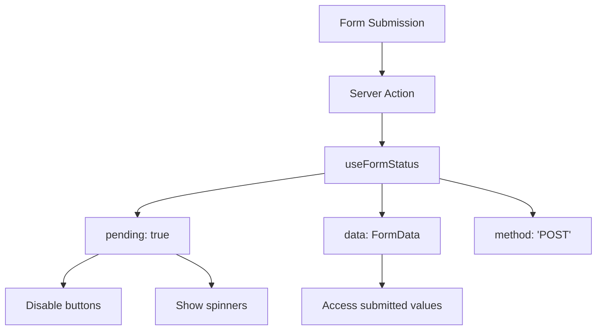
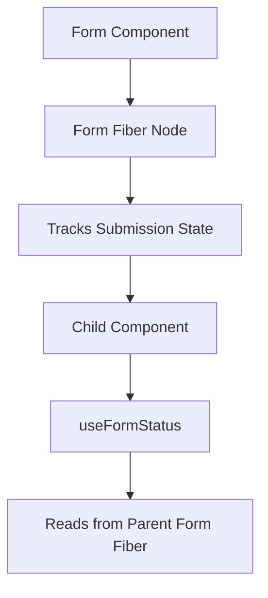

# Topic 22: useFormStatus Hook - Form State Management (React 19)

[← Previous: use Hook](./21_use_hook.md) | [Back to Main](../README.md) | [Next: useActionState Hook →](./23_useactionstate_hook.md)

---

## Table of Contents

1. [Overview](#overview)
2. [What is useFormStatus?](#what-is-useformstatus)
3. [Basic Usage](#basic-usage)
4. [Form Actions Integration](#form-actions-integration)
5. [Pending States](#pending-states)
6. [Form Data Access](#form-data-access)
7. [TypeScript with useFormStatus](#typescript-with-useformstatus)
8. [Common Patterns](#common-patterns)
9. [Best Practices](#best-practices)
10. [Real-World Examples](#real-world-examples)

---

## Overview

**useFormStatus** is a React 19 Hook that provides status information about a parent form, including pending state and submitted data. It works seamlessly with Server Actions and form submissions.

**What You'll Learn:**
- What useFormStatus is and its purpose
- How to access form submission status
- Integration with Server Actions
- Creating loading buttons and indicators
- TypeScript usage
- Common form patterns

**Prerequisites:**
- HTML forms and submission
- React 19 Server Actions (basic understanding)
- useState and useEffect Hooks

**Version Coverage:**
- React 19+ (useFormStatus introduction)
- React 19.2

---

## What is useFormStatus?

### Core Concept

useFormStatus returns information about the nearest parent `<form>` element's submission status.

```tsx
import { useFormStatus } from 'react-dom';

function SubmitButton() {
  const { pending, data, method, action } = useFormStatus();
  
  // pending: boolean - Is form submitting?
  // data: FormData | null - Form data being submitted
  // method: string - HTTP method (GET/POST)
  // action: string | function - Form action
  
  return (
    <button type="submit" disabled={pending}>
      {pending ? 'Submitting...' : 'Submit'}
    </button>
  );
}
```

### Why useFormStatus?



**Benefits:**
- ✅ No manual loading state management
- ✅ Automatic pending state
- ✅ Access to form data during submission
- ✅ Works with Server Actions
- ✅ Multiple submit buttons can check status

---

## Basic Usage

### Simple Form

```tsx
// Server Action
async function submitForm(formData: FormData) {
  'use server';
  
  const name = formData.get('name');
  const email = formData.get('email');
  
  // Save to database
  await db.users.create({ name, email });
}

// Client Component
function Form() {
  return (
    <form action={submitForm}>
      <input name="name" required />
      <input name="email" type="email" required />
      <SubmitButton />
    </form>
  );
}

// Button component using useFormStatus
function SubmitButton() {
  const { pending } = useFormStatus();
  
  return (
    <button type="submit" disabled={pending}>
      {pending ? 'Submitting...' : 'Submit'}
    </button>
  );
}
```

### Must Be in Form Child

```tsx
// ✅ useFormStatus in child component
function Form() {
  return (
    <form action={submitAction}>
      <Input />
      <SubmitButton />  {/* useFormStatus here works */}
    </form>
  );
}

function SubmitButton() {
  const { pending } = useFormStatus();  // ✅ Works!
  return <button disabled={pending}>Submit</button>;
}

// ❌ useFormStatus in form itself doesn't work
function Form() {
  const { pending } = useFormStatus();  // ❌ No parent form!
  
  return (
    <form action={submitAction}>
      <button disabled={pending}>Submit</button>
    </form>
  );
}
```

---

## Form Actions Integration

### Server Actions

```tsx
// Server Action
async function createTodo(formData: FormData) {
  'use server';
  
  const text = formData.get('text') as string;
  
  // Simulate delay
  await new Promise(resolve => setTimeout(resolve, 1000));
  
  // Save to DB
  await db.todos.create({ text });
  
  revalidatePath('/todos');
}

// Form with useFormStatus
function TodoForm() {
  return (
    <form action={createTodo}>
      <input name="text" required placeholder="Add todo..." />
      <AddButton />
    </form>
  );
}

function AddButton() {
  const { pending } = useFormStatus();
  
  return (
    <button type="submit" disabled={pending}>
      {pending ? (
        <>
          <Spinner />
          Adding...
        </>
      ) : (
        '+ Add Todo'
      )}
    </button>
  );
}
```

### Client Actions

```tsx
// Client-side action
function Form() {
  const handleSubmit = async (formData: FormData) => {
    const name = formData.get('name');
    
    // Client-side async operation
    await fetch('/api/users', {
      method: 'POST',
      body: JSON.stringify({ name })
    });
  };
  
  return (
    <form action={handleSubmit}>
      <input name="name" />
      <SubmitButton />
    </form>
  );
}

function SubmitButton() {
  const { pending } = useFormStatus();
  
  return (
    <button type="submit" disabled={pending}>
      {pending ? 'Saving...' : 'Save'}
    </button>
  );
}
```

---

## Pending States

### Loading Indicators

```tsx
function FormWithStatus() {
  return (
    <form action={submitAction}>
      <Input name="username" />
      <Input name="email" />
      
      {/* Loading overlay */}
      <LoadingOverlay />
      
      {/* Loading button */}
      <SubmitButton />
      
      {/* Cancel button */}
      <CancelButton />
    </form>
  );
}

function LoadingOverlay() {
  const { pending } = useFormStatus();
  
  if (!pending) return null;
  
  return (
    <div className="overlay">
      <Spinner />
      <p>Submitting form...</p>
    </div>
  );
}

function SubmitButton() {
  const { pending } = useFormStatus();
  
  return (
    <button type="submit" disabled={pending}>
      {pending ? 'Submitting...' : 'Submit'}
    </button>
  );
}

function CancelButton() {
  const { pending } = useFormStatus();
  
  if (!pending) return null;
  
  return (
    <button type="button" onClick={() => {/* Cancel logic */}}>
      Cancel
    </button>
  );
}
```

### Multiple Submit Buttons

```tsx
function Form() {
  return (
    <form action={submitAction}>
      <input name="title" />
      <textarea name="content" />
      
      {/* Different actions based on button */}
      <SaveDraftButton />
      <PublishButton />
    </form>
  );
}

function SaveDraftButton() {
  const { pending } = useFormStatus();
  
  return (
    <button 
      type="submit" 
      name="action" 
      value="draft"
      disabled={pending}
    >
      {pending ? 'Saving Draft...' : 'Save Draft'}
    </button>
  );
}

function PublishButton() {
  const { pending } = useFormStatus();
  
  return (
    <button 
      type="submit" 
      name="action" 
      value="publish"
      disabled={pending}
    >
      {pending ? 'Publishing...' : 'Publish'}
    </button>
  );
}
```

---

## Form Data Access

### Accessing Submitted Data

```tsx
function FormProgress() {
  const { pending, data } = useFormStatus();
  
  if (!pending || !data) return null;
  
  const email = data.get('email');
  const name = data.get('name');
  
  return (
    <div className="progress">
      <p>Submitting for {name}...</p>
      <p>Email: {email}</p>
      <Spinner />
    </div>
  );
}

// Usage in form
function RegistrationForm() {
  return (
    <form action={registerUser}>
      <input name="name" required />
      <input name="email" type="email" required />
      
      <FormProgress />  {/* Shows submitted data */}
      <SubmitButton />
    </form>
  );
}
```

---

## TypeScript with useFormStatus

### Type Definition

```tsx
interface FormStatus {
  pending: boolean;
  data: FormData | null;
  method: string | null;
  action: string | ((formData: FormData) => void | Promise<void>) | null;
}

// Usage
function Button() {
  const status: FormStatus = useFormStatus();
  
  return (
    <button disabled={status.pending}>
      {status.pending ? 'Loading...' : 'Submit'}
    </button>
  );
}
```

### Typed Form Data

```tsx
// Helper to extract typed data
function getTypedFormData(formData: FormData) {
  return {
    name: formData.get('name') as string,
    email: formData.get('email') as string,
    age: Number(formData.get('age'))
  };
}

function FormInfo() {
  const { pending, data } = useFormStatus();
  
  if (!pending || !data) return null;
  
  const typedData = getTypedFormData(data);
  
  return (
    <div>
      <p>Submitting: {typedData.name}</p>
      <p>Email: {typedData.email}</p>
    </div>
  );
}
```

---

## Common Patterns

### Disabled Inputs During Submission

```tsx
function Input({ name, ...props }: { name: string; [key: string]: any }) {
  const { pending } = useFormStatus();
  
  return (
    <input
      name={name}
      disabled={pending}  // Disable while submitting
      {...props}
    />
  );
}

// Usage
function Form() {
  return (
    <form action={submitAction}>
      <Input name="username" required />
      <Input name="email" type="email" required />
      <SubmitButton />
    </form>
  );
}
```

### Progress Indicators

```tsx
function ProgressIndicator() {
  const { pending, data } = useFormStatus();
  
  if (!pending) return null;
  
  const fields = data ? Array.from(data.keys()) : [];
  const completedFields = fields.filter(f => data?.get(f)).length;
  const progress = (completedFields / fields.length) * 100;
  
  return (
    <div className="progress-bar">
      <div className="progress-fill" style={{ width: `${progress}%` }} />
      <span>{Math.round(progress)}% Complete</span>
    </div>
  );
}
```

### Dynamic Button Text

```tsx
function SmartSubmitButton({ defaultText = 'Submit' }) {
  const { pending, data } = useFormStatus();
  
  if (!pending) {
    return <button type="submit">{defaultText}</button>;
  }
  
  const action = data?.get('action');
  
  const pendingText = {
    'save': 'Saving...',
    'delete': 'Deleting...',
    'publish': 'Publishing...'
  }[action as string] || 'Processing...';
  
  return (
    <button type="submit" disabled>
      <Spinner />
      {pendingText}
    </button>
  );
}
```

---

## Best Practices

### 1. Use in Child Components

```tsx
// ✅ Create separate button component
function SubmitButton() {
  const { pending } = useFormStatus();
  return <button disabled={pending}>Submit</button>;
}

// ❌ Don't use in form component itself
function Form() {
  const { pending } = useFormStatus();  // Won't work!
  return <form>...</form>;
}
```

### 2. Handle Edge Cases

```tsx
function SubmitButton() {
  const { pending, data } = useFormStatus();
  
  // Handle null data
  const hasData = data && data.get('email');
  
  return (
    <button 
      type="submit" 
      disabled={pending || !hasData}
    >
      {pending ? 'Submitting...' : 'Submit'}
    </button>
  );
}
```

### 3. Provide User Feedback

```tsx
function StatusIndicator() {
  const { pending, data } = useFormStatus();
  
  return (
    <div>
      {pending && (
        <div className="status">
          <Spinner />
          <span>Submitting {data?.get('name')}...</span>
        </div>
      )}
    </div>
  );
}
```

---

## Real-World Examples

### Contact Form

```tsx
async function sendMessage(formData: FormData) {
  'use server';
  
  const name = formData.get('name');
  const email = formData.get('email');
  const message = formData.get('message');
  
  await sendEmail({ name, email, message });
  
  return { success: true };
}

function ContactForm() {
  return (
    <form action={sendMessage} className="contact-form">
      <input name="name" required placeholder="Your name" />
      <input name="email" type="email" required placeholder="Email" />
      <textarea name="message" required placeholder="Message" />
      
      <FormStatus />
      <SubmitButton />
    </form>
  );
}

function FormStatus() {
  const { pending, data } = useFormStatus();
  
  if (!pending) return null;
  
  return (
    <div className="form-status">
      <Spinner />
      <p>Sending message from {data?.get('email')}...</p>
    </div>
  );
}

function SubmitButton() {
  const { pending } = useFormStatus();
  
  return (
    <button type="submit" disabled={pending} className="submit-btn">
      {pending ? (
        <>
          <Spinner size="small" />
          Sending...
        </>
      ) : (
        'Send Message'
      )}
    </button>
  );
}
```

### Todo Form

```tsx
async function addTodo(formData: FormData) {
  'use server';
  
  const text = formData.get('text') as string;
  
  await db.todos.create({
    text,
    completed: false,
    createdAt: new Date()
  });
  
  revalidatePath('/todos');
}

function TodoForm() {
  const formRef = useRef<HTMLFormElement>(null);
  
  return (
    <form 
      ref={formRef}
      action={async (formData) => {
        await addTodo(formData);
        formRef.current?.reset();  // Clear form after success
      }}
    >
      <input 
        name="text" 
        required 
        placeholder="What needs to be done?"
      />
      <AddButton />
    </form>
  );
}

function AddButton() {
  const { pending, data } = useFormStatus();
  
  return (
    <button type="submit" disabled={pending}>
      {pending ? (
        <>
          <Spinner />
          Adding "{data?.get('text')}"...
        </>
      ) : (
        '+ Add'
      )}
    </button>
  );
}
```

---

## Higher-Order Thinking FAQs

### 1. Why does useFormStatus need to be called in a child component rather than the form component itself?

**Deep Answer:**

useFormStatus reads form status from **React's fiber tree**, and the form's status is only available to components **inside** the form boundary.

**React's Form Tracking:**



**Why Child Components:**

```tsx
// React's form handling (simplified):
// 1. <form> creates fiber node with submission context
// 2. When form submits, fiber marks as "pending"
// 3. Child components can read parent form's status
// 4. Form component itself has no "parent form" to read from

// ✅ This works:
<form>  {/* Creates form context */}
  <Child />  {/* Can read form context */}
</form>

function Child() {
  const status = useFormStatus();  // Reads parent form
}

// ❌ This doesn't:
function Form() {
  const status = useFormStatus();  // No parent form!
  return <form>...</form>;
}
```

**Design Rationale:**

```tsx
// Separation of concerns:
// - Form component: Owns the form, doesn't need status
// - Button components: Need to react to form status
// - Input components: Need to disable during submission

// This pattern encourages composable form elements:
function ReusableButton() {
  const { pending } = useFormStatus();
  return <button disabled={pending}>Submit</button>;
}

// Can use in any form!
<form action={action1}><ReusableButton /></form>
<form action={action2}><ReusableButton /></form>
```

**Deep Implication:**

This design enforces **component composition** over monolithic forms. Your form logic splits into: form container (handles submission) and form elements (react to status). This mirrors React's general philosophy: data flows down, events flow up.

### 2. How does useFormStatus work with multiple submit buttons, and can you determine which button triggered the submission?

**Deep Answer:**

useFormStatus provides the **form's** submission status, not individual button status, but you can use button `name/value` to determine which was clicked.

**The Challenge:**

```tsx
// Form with multiple actions
function Form() {
  return (
    <form action={handleSubmit}>
      <input name="title" />
      
      <button type="submit" name="action" value="draft">Save Draft</button>
      <button type="submit" name="action" value="publish">Publish</button>
      <button type="submit" name="action" value="delete">Delete</button>
      
      {/* All buttons need different loading states */}
    </form>
  );
}
```

**Solution: Check FormData:**

```tsx
function SaveDraftButton() {
  const { pending, data } = useFormStatus();
  
  // Check if THIS button was clicked
  const isThisButtonPending = pending && data?.get('action') === 'draft';
  
  return (
    <button 
      type="submit" 
      name="action" 
      value="draft"
      disabled={pending}  // Disable all during any submission
    >
      {isThisButtonPending ? 'Saving Draft...' : 'Save Draft'}
    </button>
  );
}

function PublishButton() {
  const { pending, data } = useFormStatus();
  const isThisButtonPending = pending && data?.get('action') === 'publish';
  
  return (
    <button 
      type="submit" 
      name="action" 
      value="publish"
      disabled={pending}
    >
      {isThisButtonPending ? 'Publishing...' : 'Publish'}
    </button>
  );
}
```

**Alternative: Separate Forms:**

```tsx
// If actions are truly independent, use separate forms
function Component() {
  return (
    <>
      <form action={saveDraft}>
        <input name="title" />
        <SaveButton />
      </form>
      
      <form action={publish}>
        <input name="title" />
        <PublishButton />
      </form>
    </>
  );
}

// Each button only knows about its own form
function SaveButton() {
  const { pending } = useFormStatus();
  return <button disabled={pending}>Save</button>;
}
```

**Deep Implication:**

useFormStatus is **form-scoped**, not button-scoped. This reflects HTML form semantics: one form, one submission at a time. For independent actions, use separate forms or manage state manually. React follows platform primitives rather than inventing new patterns.

---

## Senior SDE Interview Questions

### Question 1: Form State Architecture

**Question:** "Design a multi-step form with validation at each step. How would you use useFormStatus, and what are its limitations for this use case?"

**Key Concepts Being Tested:**
- useFormStatus understanding
- Complex form architecture
- State management decisions
- Recognizing Hook limitations

**Expected Answer Should Cover:**

1. **useFormStatus Limitations:**
```tsx
// useFormStatus only provides:
// - pending: boolean (is form submitting?)
// - data: FormData (what's being submitted?)

// It does NOT provide:
// - Field-level validation errors
// - Current step tracking
// - Field-level loading states
```

2. **Hybrid Approach:**
```tsx
function MultiStepForm() {
  const [step, setStep] = useState(1);
  const [formData, setFormData] = useState({});
  
  const handleFinalSubmit = async (data: FormData) => {
    // Final submission uses useFormStatus
    await submitToServer(data);
  };
  
  return (
    <>
      {step === 1 && (
        <Step1 
          onNext={(data) => {
            setFormData(data);
            setStep(2);
          }}
        />
      )}
      
      {step === 2 && (
        <form action={handleFinalSubmit}>
          <Step2Fields />
          <SubmitButton />  {/* Uses useFormStatus */}
        </form>
      )}
    </>
  );
}
```

3. **When to Use What:**
- useFormStatus: Final submission to server
- useState: Step navigation, client-side validation
- useActionState: Form with server validation
- Form libraries: Complex validation logic

**Follow-ups:**
1. "How would you handle validation errors from the server?"
2. "What if users can go back and edit previous steps?"
3. "How do you show which field is being validated?"

**Red Flags:**
- Trying to use useFormStatus for everything
- Not recognizing limitations
- No validation strategy

**Green Flags:**
- Understands useFormStatus scope
- Combines multiple state management approaches
- Considers UX for multi-step forms
- Mentions form libraries when appropriate

---

[← Previous: use Hook](./21_use_hook.md) | [Back to Main](../README.md) | [Next: useActionState Hook →](./23_useactionstate_hook.md)

---

**Progress**: Topic 22/220 completed | Part II: React Hooks (80% complete)
