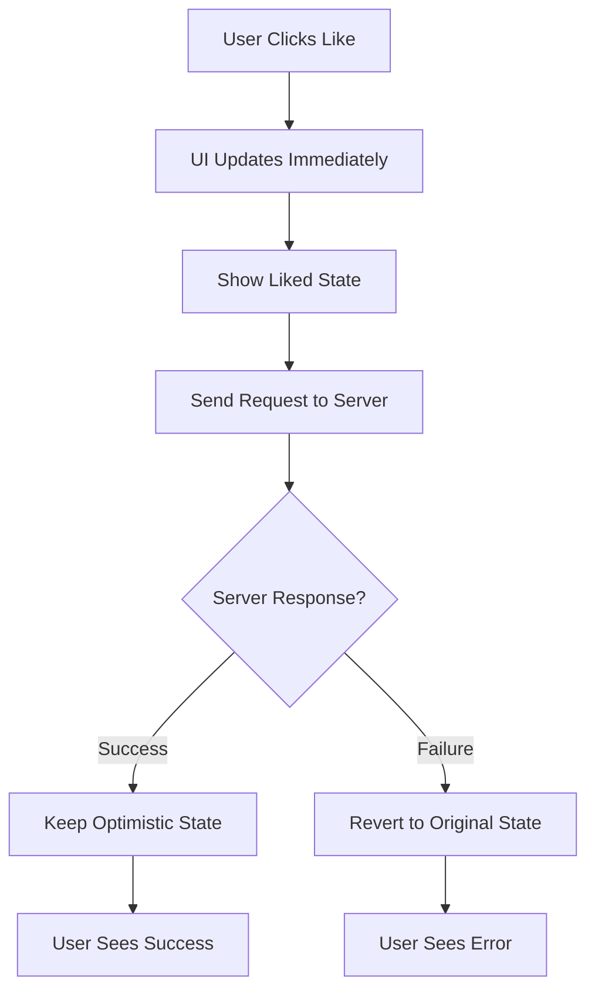
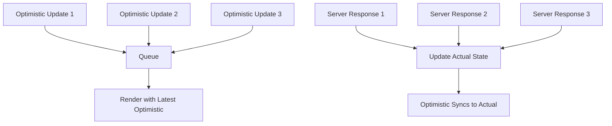

# Topic 24: useOptimistic Hook - Optimistic UI Updates (React 19)

[← Previous: useActionState Hook](./23_useactionstate_hook.md) | [Back to Main](../README.md) | [Next: useEffectEvent Hook →](./25_useeffectevent_hook.md)

---

## Table of Contents

1. [Overview](#overview)
2. [What is useOptimistic?](#what-is-useoptimistic)
3. [Basic Usage](#basic-usage)
4. [Optimistic UI Patterns](#optimistic-ui-patterns)
5. [Error Recovery](#error-recovery)
6. [Integration with Actions](#integration-with-actions)
7. [TypeScript with useOptimistic](#typescript-with-useoptimistic)
8. [Common Use Cases](#common-use-cases)
9. [Best Practices](#best-practices)
10. [Real-World Examples](#real-world-examples)

---

## Overview

**useOptimistic** is a React 19 Hook that lets you show optimistic state while an async action is in progress. It immediately updates the UI, then either confirms or reverts based on the action's result.

**What You'll Learn:**
- What optimistic UI is and why it improves UX
- How to use useOptimistic Hook
- Handling success and failure cases
- Integration with Server Actions
- TypeScript patterns
- Real-world optimistic update strategies

**Prerequisites:**
- useState and useEffect
- Understanding of async operations
- React 19 Server Actions basics

**Version Coverage:**
- React 19+ (useOptimistic introduction)
- React 19.2

---

## What is useOptimistic?

### Core Concept

**Optimistic UI** means updating the UI immediately (optimistically assuming success), then fixing it if the action fails.



### Without Optimistic Updates

```tsx
// Traditional: Wait for server response
function LikeButton({ postId, initialLiked }) {
  const [liked, setLiked] = useState(initialLiked);
  const [loading, setLoading] = useState(false);
  
  const handleLike = async () => {
    setLoading(true);
    
    try {
      await likePost(postId);
      setLiked(true);  // Update after server confirms
    } finally {
      setLoading(false);
    }
  };
  
  return (
    <button onClick={handleLike} disabled={loading}>
      {loading ? '...' : liked ? '❤️ Liked' : '🤍 Like'}
    </button>
  );
  
  // User waits for server response to see change
}
```

### With useOptimistic

```tsx
// Optimistic: Immediate feedback
function LikeButton({ postId, initialLiked }) {
  const [liked, setLiked] = useState(initialLiked);
  const [optimisticLiked, setOptimisticLiked] = useOptimistic(liked);
  
  const handleLike = async () => {
    setOptimisticLiked(true);  // Update immediately!
    
    try {
      await likePost(postId);
      setLiked(true);  // Confirm with server
    } catch (error) {
      // useOptimistic automatically reverts to liked
      console.error('Failed to like');
    }
  };
  
  return (
    <button onClick={handleLike}>
      {optimisticLiked ? '❤️ Liked' : '🤍 Like'}
    </button>
  );
  
  // User sees change instantly!
}
```

---

## Basic Usage

### Simple Optimistic Update

```tsx
import { useOptimistic } from 'react';

function Component() {
  const [state, setState] = useState(initialValue);
  const [optimisticState, setOptimisticState] = useOptimistic(state);
  
  const handleAction = async () => {
    // 1. Update optimistically
    setOptimisticState(newValue);
    
    // 2. Perform async operation
    try {
      await serverAction();
      // 3. Confirm with actual state
      setState(newValue);
    } catch (error) {
      // 4. useOptimistic automatically reverts to state
      console.error('Action failed');
    }
  };
  
  return <div>{optimisticState}</div>;
}
```

### Syntax Explained

```tsx
const [optimisticValue, setOptimisticValue] = useOptimistic(
  actualValue,
  // Optional: update function
  (currentValue, optimisticUpdate) => {
    // How to apply optimistic update
    return newValue;
  }
);

// optimisticValue: Current value (optimistic or actual)
// setOptimisticValue: Function to set optimistic value
// actualValue: Source of truth (from useState)
```

---

## Optimistic UI Patterns

### Like Button

```tsx
function LikeButton({ postId, initialLikes, initialLiked }) {
  const [likes, setLikes] = useState(initialLikes);
  const [liked, setLiked] = useState(initialLiked);
  
  const [optimisticLikes, setOptimisticLikes] = useOptimistic(likes);
  const [optimisticLiked, setOptimisticLiked] = useOptimistic(liked);
  
  const handleToggle = async () => {
    const newLiked = !liked;
    const newLikes = newLiked ? likes + 1 : likes - 1;
    
    // Optimistic update
    setOptimisticLiked(newLiked);
    setOptimisticLikes(newLikes);
    
    try {
      const result = await toggleLike(postId, newLiked);
      // Confirm with server data
      setLiked(result.liked);
      setLikes(result.count);
    } catch (error) {
      // Automatically reverts to original values
      console.error('Failed to toggle like');
    }
  };
  
  return (
    <button onClick={handleToggle}>
      {optimisticLiked ? '❤️' : '🤍'} {optimisticLikes}
    </button>
  );
}
```

### Todo List

```tsx
interface Todo {
  id: number;
  text: string;
  completed: boolean;
}

function TodoList({ initialTodos }: { initialTodos: Todo[] }) {
  const [todos, setTodos] = useState(initialTodos);
  const [optimisticTodos, addOptimisticTodo] = useOptimistic(
    todos,
    (currentTodos, newTodo: Todo) => [...currentTodos, newTodo]
  );
  
  const handleAdd = async (formData: FormData) => {
    const text = formData.get('text') as string;
    
    const optimisticTodo: Todo = {
      id: Date.now(),  // Temporary ID
      text,
      completed: false
    };
    
    // Add optimistically
    addOptimisticTodo(optimisticTodo);
    
    try {
      const savedTodo = await saveTodo(text);
      // Replace with server data
      setTodos([...todos, savedTodo]);
    } catch (error) {
      // Automatically removed (reverts)
      alert('Failed to add todo');
    }
  };
  
  return (
    <>
      <form action={handleAdd}>
        <input name="text" />
        <button type="submit">Add</button>
      </form>
      
      <ul>
        {optimisticTodos.map(todo => (
          <li 
            key={todo.id}
            style={{ opacity: todo.id < 1000000000000 ? 1 : 0.5 }}
          >
            {todo.text}
          </li>
        ))}
      </ul>
    </>
  );
}
```

### Comments with Optimistic Updates

```tsx
interface Comment {
  id: string;
  text: string;
  author: string;
  pending?: boolean;
}

function CommentList({ postId, initialComments }: {
  postId: number;
  initialComments: Comment[];
}) {
  const [comments, setComments] = useState(initialComments);
  const [optimisticComments, addOptimisticComment] = useOptimistic(
    comments,
    (current, newComment: Comment) => [...current, newComment]
  );
  
  const handleSubmit = async (formData: FormData) => {
    const text = formData.get('text') as string;
    
    const optimisticComment: Comment = {
      id: `temp-${Date.now()}`,
      text,
      author: 'You',
      pending: true
    };
    
    // Show immediately
    addOptimisticComment(optimisticComment);
    
    try {
      const savedComment = await saveComment(postId, text);
      // Replace with real comment
      setComments([...comments, savedComment]);
    } catch (error) {
      alert('Failed to post comment');
    }
  };
  
  return (
    <>
      <form action={handleSubmit}>
        <textarea name="text" required />
        <button type="submit">Post Comment</button>
      </form>
      
      <div className="comments">
        {optimisticComments.map(comment => (
          <div 
            key={comment.id}
            className={comment.pending ? 'pending' : ''}
          >
            <strong>{comment.author}:</strong> {comment.text}
            {comment.pending && <span> (Sending...)</span>}
          </div>
        ))}
      </div>
    </>
  );
}
```

---

## Error Recovery

### Automatic Revert

```tsx
// useOptimistic automatically reverts on error
function Component() {
  const [count, setCount] = useState(0);
  const [optimisticCount, setOptimisticCount] = useOptimistic(count);
  
  const increment = async () => {
    setOptimisticCount(count + 1);  // UI updates immediately
    
    try {
      await incrementOnServer();
      setCount(count + 1);  // Confirm
    } catch (error) {
      // optimisticCount automatically reverts to count
      // No manual revert needed!
    }
  };
  
  return (
    <>
      <p>Count: {optimisticCount}</p>
      <button onClick={increment}>+</button>
    </>
  );
}
```

### Manual Error Handling

```tsx
function Component() {
  const [items, setItems] = useState([]);
  const [optimisticItems, addOptimistic] = useOptimistic(
    items,
    (current, newItem) => [...current, newItem]
  );
  
  const [error, setError] = useState(null);
  
  const handleAdd = async (newItem) => {
    setError(null);  // Clear previous errors
    addOptimistic(newItem);
    
    try {
      const saved = await saveItem(newItem);
      setItems([...items, saved]);
    } catch (err) {
      setError(err.message);
      // Optimistic update reverts automatically
      // But we show error message
    }
  };
  
  return (
    <>
      {error && <div className="error">{error}</div>}
      
      {optimisticItems.map(item => (
        <div key={item.id}>{item.name}</div>
      ))}
    </>
  );
}
```

---

## Integration with Actions

### With useActionState

```tsx
type State = {
  items: string[];
  error?: string;
};

async function addItemAction(
  prevState: State,
  formData: FormData
): Promise<State> {
  const item = formData.get('item') as string;
  
  try {
    await saveItem(item);
    return {
      items: [...prevState.items, item]
    };
  } catch (error) {
    return {
      ...prevState,
      error: error.message
    };
  }
}

function ItemList() {
  const [state, formAction, isPending] = useActionState(addItemAction, {
    items: []
  });
  
  const [optimisticItems, addOptimistic] = useOptimistic(
    state.items,
    (current, newItem: string) => [...current, newItem]
  );
  
  return (
    <>
      <form 
        action={(formData) => {
          const item = formData.get('item') as string;
          addOptimistic(item);  // Optimistic update
          formAction(formData);  // Actual action
        }}
      >
        <input name="item" required />
        <button type="submit" disabled={isPending}>
          {isPending ? 'Adding...' : 'Add'}
        </button>
      </form>
      
      {state.error && <div className="error">{state.error}</div>}
      
      <ul>
        {optimisticItems.map((item, i) => (
          <li key={i}>{item}</li>
        ))}
      </ul>
    </>
  );
}
```

---

## TypeScript with useOptimistic

### Type-Safe Optimistic Updates

```tsx
interface Message {
  id: string;
  text: string;
  pending?: boolean;
}

function Chat() {
  const [messages, setMessages] = useState<Message[]>([]);
  
  const [optimisticMessages, addOptimisticMessage] = useOptimistic<
    Message[],
    Message
  >(
    messages,
    (current, newMessage) => [...current, newMessage]
  );
  
  const sendMessage = async (text: string) => {
    const optimisticMsg: Message = {
      id: `temp-${Date.now()}`,
      text,
      pending: true
    };
    
    addOptimisticMessage(optimisticMsg);
    
    try {
      const savedMsg = await api.sendMessage(text);
      setMessages([...messages, savedMsg]);
    } catch (error) {
      console.error('Failed to send');
    }
  };
  
  return (
    <div>
      {optimisticMessages.map(msg => (
        <div key={msg.id} className={msg.pending ? 'pending' : ''}>
          {msg.text}
        </div>
      ))}
    </div>
  );
}
```

---

## Common Use Cases

### Social Media Interactions

```tsx
function Post({ postId, initialLikes, initialLiked }) {
  const [likes, setLikes] = useState(initialLikes);
  const [liked, setLiked] = useState(initialLiked);
  
  const [optimisticLikes, updateOptimisticLikes] = useOptimistic(
    likes,
    (current, change: number) => current + change
  );
  
  const [optimisticLiked, setOptimisticLiked] = useOptimistic(liked);
  
  const toggleLike = async () => {
    const newLiked = !liked;
    const change = newLiked ? 1 : -1;
    
    // Optimistic updates
    setOptimisticLiked(newLiked);
    updateOptimisticLikes(change);
    
    try {
      const result = await api.toggleLike(postId, newLiked);
      setLikes(result.likes);
      setLiked(result.liked);
    } catch (error) {
      // Auto-reverts
      alert('Failed to update like');
    }
  };
  
  return (
    <button onClick={toggleLike}>
      {optimisticLiked ? '❤️' : '🤍'} {optimisticLikes}
    </button>
  );
}
```

### Real-Time Chat

```tsx
interface Message {
  id: string;
  text: string;
  author: string;
  timestamp: Date;
  status: 'sending' | 'sent' | 'failed';
}

function ChatRoom({ roomId }) {
  const [messages, setMessages] = useState<Message[]>([]);
  const [optimisticMessages, sendOptimistic] = useOptimistic(
    messages,
    (current, newMessage: Message) => [...current, newMessage]
  );
  
  const sendMessage = async (text: string) => {
    const tempMessage: Message = {
      id: `temp-${Date.now()}`,
      text,
      author: 'You',
      timestamp: new Date(),
      status: 'sending'
    };
    
    // Show immediately
    sendOptimistic(tempMessage);
    
    try {
      const sent = await api.sendMessage(roomId, text);
      setMessages([...messages, sent]);
    } catch (error) {
      // Show as failed
      const failedMessage = { ...tempMessage, status: 'failed' as const };
      setMessages([...messages, failedMessage]);
    }
  };
  
  return (
    <div>
      <MessageList messages={optimisticMessages} />
      <MessageInput onSend={sendMessage} />
    </div>
  );
}

function MessageList({ messages }: { messages: Message[] }) {
  return (
    <div className="messages">
      {messages.map(msg => (
        <div key={msg.id} className={`message-${msg.status}`}>
          <strong>{msg.author}:</strong> {msg.text}
          {msg.status === 'sending' && <Spinner />}
          {msg.status === 'failed' && <span>❌ Failed</span>}
        </div>
      ))}
    </div>
  );
}
```

### Shopping Cart

```tsx
interface CartItem {
  id: string;
  productId: number;
  quantity: number;
  name: string;
  price: number;
}

function ShoppingCart({ initialCart }: { initialCart: CartItem[] }) {
  const [cart, setCart] = useState(initialCart);
  const [optimisticCart, updateOptimisticCart] = useOptimistic(
    cart,
    (current, update: { type: 'add' | 'remove' | 'update'; item: CartItem }) => {
      switch (update.type) {
        case 'add':
          return [...current, update.item];
        case 'remove':
          return current.filter(item => item.id !== update.item.id);
        case 'update':
          return current.map(item =>
            item.id === update.item.id ? update.item : item
          );
        default:
          return current;
      }
    }
  );
  
  const addToCart = async (product: Product) => {
    const newItem: CartItem = {
      id: `temp-${Date.now()}`,
      productId: product.id,
      quantity: 1,
      name: product.name,
      price: product.price
    };
    
    updateOptimisticCart({ type: 'add', item: newItem });
    
    try {
      const savedItem = await api.addToCart(product.id);
      setCart([...cart, savedItem]);
    } catch (error) {
      alert('Failed to add to cart');
    }
  };
  
  const removeFromCart = async (itemId: string) => {
    const item = cart.find(i => i.id === itemId);
    if (!item) return;
    
    updateOptimisticCart({ type: 'remove', item });
    
    try {
      await api.removeFromCart(itemId);
      setCart(cart.filter(i => i.id !== itemId));
    } catch (error) {
      alert('Failed to remove from cart');
    }
  };
  
  return (
    <div>
      {optimisticCart.map(item => (
        <CartItem
          key={item.id}
          item={item}
          onRemove={() => removeFromCart(item.id)}
        />
      ))}
      
      <div className="total">
        Total: ${optimisticCart.reduce((sum, item) => sum + item.price * item.quantity, 0)}
      </div>
    </div>
  );
}
```

---

## Best Practices

### 1. Visual Feedback for Pending State

```tsx
// ✅ Show optimistic items differently
function TodoItem({ todo }) {
  return (
    <li className={todo.pending ? 'optimistic' : 'confirmed'}>
      {todo.text}
      {todo.pending && <Spinner size="small" />}
    </li>
  );
}

// CSS
.optimistic {
  opacity: 0.6;
  font-style: italic;
}
```

### 2. Handle Failures Gracefully

```tsx
// ✅ Show error state
function Component() {
  const [error, setError] = useState(null);
  
  const handleAction = async () => {
    addOptimistic(newValue);
    
    try {
      await serverAction();
      setActual(newValue);
      setError(null);  // Clear error on success
    } catch (err) {
      setError('Action failed. Please try again.');
      // Optimistic update reverts automatically
    }
  };
  
  return (
    <>
      {error && <ErrorMessage message={error} />}
      {/* ... */}
    </>
  );
}
```

### 3. Temporary IDs for Optimistic Items

```tsx
// ✅ Use temporary IDs, replace with server IDs
const optimisticItem = {
  id: `temp-${Date.now()}`,  // Temporary
  ...itemData
};

addOptimistic(optimisticItem);

const savedItem = await save(itemData);
setItems([...items, savedItem]);  // Has real ID from server
```

---

## Higher-Order Thinking FAQs

### 1. How does useOptimistic handle race conditions when multiple optimistic updates are in flight?

**Deep Answer:**

useOptimistic queues updates and **automatically reconciles** them based on the source state, but doesn't prevent logical race conditions.

**The Challenge:**

```tsx
// Multiple rapid updates
function Component() {
  const [count, setCount] = useState(0);
  const [optimisticCount, setOptimisticCount] = useOptimistic(count);
  
  const increment = async () => {
    setOptimisticCount(count + 1);
    
    try {
      const result = await incrementOnServer();
      setCount(result.count);
    } catch (error) {
      // Reverts
    }
  };
  
  // User clicks 3 times rapidly:
  // Click 1: count=0, optimistic=1, request starts
  // Click 2: count=0, optimistic=2, request starts
  // Click 3: count=0, optimistic=3, request starts
  
  // Responses:
  // Response 1: setCount(1)
  // Response 2: setCount(2)
  // Response 3: setCount(3)
  
  // Final count=3 (correct)
}
```

**How useOptimistic Handles This:**



**Logical Race Condition:**

```tsx
// Problem: Last response wins, not last request
function Component() {
  const increment = async () => {
    // Request sends current count
    const result = await api.increment(count);
    setCount(result);
  };
  
  // Scenario:
  // count=0
  // Click 1: Sends count=0, expects 1
  // Click 2: Sends count=0 (still!), expects 1
  // Response 1: Returns 1
  // Response 2: Returns 1 (based on count=0)
  
  // Final count=1, but should be 2!
}

// Solution: Server handles concurrency
async function increment() {
  // Don't send current count, just increment
  const result = await api.increment();  // Server tracks count
  setCount(result);
}
```

**Deep Implication:**

useOptimistic handles **React-level** race conditions (multiple optimistic updates conflicting), but doesn't solve **logical** race conditions (server state conflicts). Your server must be idempotent or use optimistic locking. Client-side optimism is just UX - server is source of truth.

### 2. When should you NOT use optimistic updates, and what are the risks?

**Deep Answer:**

Optimistic updates trade **immediate feedback** for **potential inconsistency**. Not all operations should be optimistic.

**When NOT to Use:**

```tsx
// ❌ 1. Critical operations (payments, deletions)
function DeleteButton({ itemId }) {
  // Don't show deleted optimistically!
  // If server fails, user thinks data is gone
  
  const handleDelete = async () => {
    try {
      await api.delete(itemId);
      setItems(items.filter(i => i.id !== itemId));  // After confirmation
    } catch (error) {
      alert('Failed to delete');
    }
  };
}

// ❌ 2. Operations with complex validation
function TransferMoney({ from, to, amount }) {
  // Don't show transfer optimistically!
  // Server might reject due to insufficient funds
  // Better to wait for confirmation
}

// ❌ 3. Operations affecting other users immediately
function AssignTask({ taskId, userId }) {
  // Don't show assigned optimistically!
  // Server might reject if user is at capacity
  // Other users would see conflicting state
}
```

**When TO Use:**

```tsx
// ✅ 1. Social interactions (likes, follows)
// - Low stakes if fails
// - Expected to succeed
// - Improves perceived performance

// ✅ 2. Content creation (comments, posts)
// - User sees immediate feedback
// - Can show pending state
// - Easy to show "failed" state

// ✅ 3. UI state (theme, preferences)
// - Fast feedback important
// - Non-critical if fails
// - Easy to revert
```

**Risk Assessment:**

| Operation | Optimistic? | Why |
|-----------|-------------|-----|
| Like post | ✅ Yes | Low stakes, reversible |
| Post comment | ✅ Yes | Expected to succeed |
| Delete account | ❌ No | Irreversible, critical |
| Transfer money | ❌ No | Critical, complex validation |
| Toggle setting | ✅ Yes | Reversible, low stakes |
| Submit order | ❌ No | Critical, payment involved |

**Deep Implication:**

Optimistic updates are a **UX vs safety tradeoff**. They make apps feel faster but can show incorrect state. Use for low-stakes, high-probability-of-success operations. For critical operations, waiting for server confirmation is safer. The deciding factor: what's worse - a slight delay or showing incorrect state?

---

## Senior SDE Interview Questions

### Question 1: Optimistic Update Strategy

**Question:** "Design a Twitter-like interface where users can like, retweet, and reply to posts. Which interactions should use optimistic updates, and how would you handle conflicts?"

**Key Concepts Being Tested:**
- Optimistic update decision-making
- Conflict resolution
- UX considerations
- Edge case handling

**Expected Answer Should Cover:**

1. **Operation Classification:**
```tsx
// ✅ Optimistic: Like/Unlike
// - Fast, expected to succeed
// - Reversible
// - Low stakes

// ✅ Optimistic: Retweet
// - Similar to like
// - Can show pending state

// ⚠️ Partial Optimistic: Reply
// - Show optimistic while sending
// - But mark as "pending"
// - Don't add to reply count until confirmed

// ❌ Not Optimistic: Delete
// - Need confirmation
// - Can't easily revert
```

2. **Implementation:**
```tsx
function Post({ post }) {
  const [likes, setLikes] = useState(post.likes);
  const [optimisticLikes, updateLikes] = useOptimistic(likes);
  
  const handleLike = async () => {
    updateLikes(likes + 1);
    
    try {
      const result = await api.like(post.id);
      setLikes(result.likes);  // Server is source of truth
    } catch {
      // Reverts automatically
    }
  };
}
```

3. **Conflict Handling:**
- Server tracks actual state
- Client optimistic updates for UX
- On conflict, server wins
- Show notification if server state differs

**Follow-ups:**
1. "What if two users like the same post simultaneously?"
2. "How do you handle offline scenarios?"
3. "Should the reply count update optimistically?"

**Red Flags:**
- Optimistic updates for everything
- No server conflict strategy
- Not considering failure UX

**Green Flags:**
- Thoughtful operation classification
- Server as source of truth
- Considers edge cases
- Good UX for failures

---

[← Previous: useActionState Hook](./23_useactionstate_hook.md) | [Back to Main](../README.md) | [Next: useEffectEvent Hook →](./25_useeffectevent_hook.md)

---

**Progress**: Topic 24/220 completed | Part II: React Hooks (93% complete)
