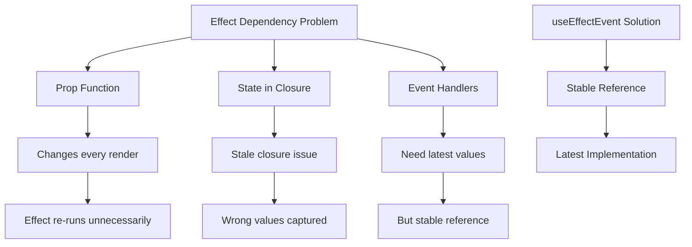

# Topic 25: useEffectEvent Hook - Stable Event Handlers (React 19.2)

[← Previous: useOptimistic Hook](./24_useoptimistic_hook.md) | [Back to Main](../README.md) | [Next: Advanced Patterns →](./26_composition.md)

---

## Table of Contents

1. [Overview](#overview)
2. [What is useEffectEvent?](#what-is-useeffevent)
3. [The Problem It Solves](#the-problem-it-solves)
4. [Basic Usage](#basic-usage)
5. [Event Extraction Pattern](#event-extraction-pattern)
6. [TypeScript with useEffectEvent](#typescript-with-useeffectevent)
7. [Common Use Cases](#common-use-cases)
8. [Best Practices](#best-practices)
9. [useEffectEvent vs useCallback](#useeffectevent-vs-usecallback)
10. [Real-World Examples](#real-world-examples)

---

## Overview

**useEffectEvent** is the newest Hook in React 19.2 that lets you extract event handlers from effects without adding them to the dependency array. It solves the "stable function in effect" problem elegantly.

**What You'll Learn:**
- What useEffectEvent is and why it was created
- The effect dependency problem it solves
- How to extract event logic from effects
- When to use useEffectEvent vs useCallback
- TypeScript patterns
- Real-world applications

**Prerequisites:**
- useEffect Hook mastery
- Understanding of effect dependencies
- Closures and stale values concepts

**Version Coverage:**
- React 19.2+ (useEffectEvent introduction)

---

## What is useEffectEvent?

### Core Concept

useEffectEvent creates a **stable function reference** that always has access to the latest props and state, without causing effects to re-run.

```tsx
import { useEffectEvent } from 'react';

function Component({ userId, onUserChange }) {
  // Problem: onUserChange changes every render
  // Adding to deps causes effect to re-run unnecessarily
  
  // Solution: Extract as event
  const onUserChangeEvent = useEffectEvent(onUserChange);
  
  useEffect(() => {
    fetchUser(userId).then(user => {
      onUserChangeEvent(user);  // Stable reference, latest implementation
    });
  }, [userId]);  // Only userId, not onUserChangeEvent!
}
```

### Why useEffectEvent?



---

## The Problem It Solves

### The Dilemma

```tsx
// Problem 1: Missing dependency
function Chat({ roomId, onMessage }) {
  useEffect(() => {
    const socket = connectToRoom(roomId);
    
    socket.on('message', (msg) => {
      onMessage(msg);  // Uses onMessage from props
    });
    
    return () => socket.disconnect();
  }, [roomId]);  // Missing onMessage!
  
  // ESLint warns: Include onMessage in dependencies
  // But onMessage changes every render!
}

// Problem 2: Including dependency causes issues
function Chat({ roomId, onMessage }) {
  useEffect(() => {
    const socket = connectToRoom(roomId);
    
    socket.on('message', (msg) => {
      onMessage(msg);
    });
    
    return () => socket.disconnect();
  }, [roomId, onMessage]);  // Effect re-runs on every render!
  
  // Socket disconnects/reconnects constantly
}

// Problem 3: useCallback workaround (complex)
function Chat({ roomId, onMessage }) {
  const stableOnMessage = useCallback(onMessage, []);  // Stale closure!
  // Or
  const stableOnMessage = useCallback(onMessage, [/* all deps */]);  // Complex!
  
  useEffect(() => {
    const socket = connectToRoom(roomId);
    socket.on('message', stableOnMessage);
    return () => socket.disconnect();
  }, [roomId, stableOnMessage]);
}
```

### The Solution

```tsx
// ✅ useEffectEvent: Best of both worlds
function Chat({ roomId, onMessage }) {
  const onMessageEvent = useEffectEvent(onMessage);
  
  useEffect(() => {
    const socket = connectToRoom(roomId);
    
    socket.on('message', (msg) => {
      onMessageEvent(msg);  // Stable reference, latest implementation!
    });
    
    return () => socket.disconnect();
  }, [roomId]);  // Only roomId, perfect!
  
  // Effect only re-runs when roomId changes
  // But onMessageEvent always calls latest onMessage
}
```

---

## Basic Usage

### Simple Event Extraction

```tsx
function Component({ count, onUpdate }) {
  // Extract event
  const onUpdateEvent = useEffectEvent(onUpdate);
  
  useEffect(() => {
    const timer = setInterval(() => {
      onUpdateEvent(count);  // Latest count, stable reference
    }, 1000);
    
    return () => clearInterval(timer);
  }, [count]);  // count in deps, onUpdateEvent not needed
}
```

### With Multiple Props

```tsx
function Logger({ userId, sessionId, trackEvent }) {
  const trackEventEvent = useEffectEvent(trackEvent);
  
  useEffect(() => {
    console.log('User logged in');
    
    trackEventEvent({  // Always calls latest trackEvent
      userId,
      sessionId,
      event: 'login'
    });
  }, [userId, sessionId]);  // Only these deps, not trackEvent
}
```

---

## Event Extraction Pattern

### Before useEffectEvent

```tsx
// ❌ Problem: Stale closure or unnecessary re-runs
function Component({ config, onDataLoaded }) {
  useEffect(() => {
    fetchData(config).then(data => {
      onDataLoaded(data);  // Uses onDataLoaded
    });
  }, [config, onDataLoaded]);  // Effect re-runs when onDataLoaded changes
  
  // If parent recreates onDataLoaded every render,
  // effect runs constantly, refetching data unnecessarily!
}
```

### After useEffectEvent

```tsx
// ✅ Solution: Extract event
function Component({ config, onDataLoaded }) {
  const onDataLoadedEvent = useEffectEvent(onDataLoaded);
  
  useEffect(() => {
    fetchData(config).then(data => {
      onDataLoadedEvent(data);  // Stable, always latest
    });
  }, [config]);  // Only config matters for when to refetch
  
  // Effect only re-runs when config changes
  // onDataLoadedEvent always calls latest onDataLoaded
}
```

---

## TypeScript with useEffectEvent

### Type-Safe Events

```tsx
// Explicit typing
const onClick = useEffectEvent<(id: number) => void>((id) => {
  console.log('Clicked:', id);
});

// With event object
const onMessage = useEffectEvent<(msg: Message) => void>((msg) => {
  handleMessage(msg);
});

// Generic types
interface Message {
  id: string;
  text: string;
}

const onMessageEvent = useEffectEvent<(msg: Message) => void>((msg) => {
  console.log(msg.text);
});
```

---

## Common Use Cases

### WebSocket Connections

```tsx
function Chat({ roomId, onMessage, onError }) {
  const onMessageEvent = useEffectEvent(onMessage);
  const onErrorEvent = useEffectEvent(onError);
  
  useEffect(() => {
    const socket = connectToRoom(roomId);
    
    socket.on('message', (msg) => {
      onMessageEvent(msg);  // Latest handler
    });
    
    socket.on('error', (err) => {
      onErrorEvent(err);  // Latest handler
    });
    
    return () => socket.disconnect();
  }, [roomId]);  // Only roomId dependency!
  
  // Socket setup runs only when roomId changes
  // But handlers always call latest props
}
```

### Analytics Tracking

```tsx
function Component({ userId, page, trackPageView }) {
  const trackEvent = useEffectEvent(trackPageView);
  
  useEffect(() => {
    // Track page view
    trackEvent({
      userId,
      page,
      timestamp: Date.now()
    });
  }, [userId, page]);  // Track when these change
  
  // trackPageView prop can change without retriggering analytics
}
```

### Data Syncing

```tsx
function AutoSave({ content, onSave }) {
  const onSaveEvent = useEffectEvent(onSave);
  
  useEffect(() => {
    const timer = setTimeout(() => {
      onSaveEvent(content);  // Auto-save
    }, 1000);
    
    return () => clearTimeout(timer);
  }, [content]);  // Only content triggers save
  
  // onSave can change without affecting auto-save timing
}
```

---

## Best Practices

### 1. Only for Event Handlers in Effects

```tsx
// ✅ Good: Event handler in effect
const onMessage = useEffectEvent(handleMessage);

useEffect(() => {
  socket.on('message', onMessage);
}, []);

// ❌ Bad: Regular component logic
const onClick = useEffectEvent(handleClick);
return <button onClick={onClick}>Click</button>;
// Just use regular function or useCallback
```

### 2. Extract Only What Needs Latest Values

```tsx
// ✅ Extract callbacks that need latest props
const onSuccess = useEffectEvent((data) => {
  // Needs latest props/state
  updateUI(data, currentTheme, currentUser);
});

// ❌ Don't extract stable values
const TIMEOUT = useEffectEvent(() => 5000);  // Overkill!
const TIMEOUT = 5000;  // Just use const
```

### 3. Document Why Using useEffectEvent

```tsx
// ✅ Add comment explaining usage
function Component({ roomId, onMessage }) {
  // Extract onMessage to avoid reconnecting socket
  // when onMessage prop changes
  const onMessageEvent = useEffectEvent(onMessage);
  
  useEffect(() => {
    const socket = connectToRoom(roomId);
    socket.on('message', onMessageEvent);
    return () => socket.disconnect();
  }, [roomId]);
}
```

---

## useEffectEvent vs useCallback

### Key Differences

| Aspect | useEffectEvent | useCallback |
|--------|----------------|-------------|
| **Purpose** | Events in effects | Memoize callbacks |
| **Dependencies** | None (always fresh) | Must specify |
| **Use In** | Effects only | Anywhere |
| **Re-runs Effect** | No | Yes (if in deps) |
| **Latest Values** | Always | Only if in deps |

### When to Use Each

```tsx
// ✅ useEffectEvent: Event handler in effect
function Component({ onMessage }) {
  const onMessageEvent = useEffectEvent(onMessage);
  
  useEffect(() => {
    subscribe(onMessageEvent);  // Don't want to resubscribe
  }, []);
}

// ✅ useCallback: Passing to children
function Component({ onUpdate }) {
  const stableOnUpdate = useCallback(onUpdate, [/* deps */]);
  
  return <Child onUpdate={stableOnUpdate} />;  // Prevent child re-renders
}
```

---

## Real-World Examples

### Real-Time Dashboard

```tsx
function Dashboard({ metrics, onMetricUpdate, refreshInterval }) {
  const handleUpdate = useEffectEvent(onMetricUpdate);
  
  useEffect(() => {
    const interval = setInterval(() => {
      fetchLatestMetrics().then(data => {
        handleUpdate(data);  // Latest handler
      });
    }, refreshInterval);
    
    return () => clearInterval(interval);
  }, [refreshInterval]);  // Only interval timing matters
  
  // onMetricUpdate can change without affecting polling
}
```

### Notification System

```tsx
function NotificationListener({ userId, onNotification, onError }) {
  const handleNotification = useEffectEvent(onNotification);
  const handleError = useEffectEvent(onError);
  
  useEffect(() => {
    const subscription = subscribeToNotifications(userId);
    
    subscription.on('notification', (notification) => {
      handleNotification(notification);
    });
    
    subscription.on('error', (error) => {
      handleError(error);
    });
    
    return () => subscription.unsubscribe();
  }, [userId]);  // Only userId matters for subscription
  
  return null;  // Render nothing, just listen
}
```

---

## Higher-Order Thinking FAQs

### 1. How does useEffectEvent differ from useCallback with empty dependencies, and why is it safer?

**Deep Answer:**

useEffectEvent and useCallback with empty deps look similar but have **fundamentally different behaviors** regarding closure freshness.

**useCallback with Empty Deps:**

```tsx
// ❌ Stale closure
function Component({ roomId, theme }) {
  const onMessage = useCallback((msg) => {
    logMessage(msg, theme);  // Captures theme at creation time
  }, []);  // Empty deps = never updates
  
  useEffect(() => {
    const socket = connectToRoom(roomId);
    socket.on('message', onMessage);
    return () => socket.disconnect();
  }, [roomId, onMessage]);
  
  // If theme changes:
  // - onMessage still uses old theme (stale closure)
  // - Effect doesn't re-run (onMessage reference stable)
  // Bug: Logs with wrong theme!
}
```

**useEffectEvent:**

```tsx
// ✅ Always fresh
function Component({ roomId, theme }) {
  const onMessage = useEffectEvent((msg) => {
    logMessage(msg, theme);  // Always uses current theme!
  });
  
  useEffect(() => {
    const socket = connectToRoom(roomId);
    socket.on('message', onMessage);
    return () => socket.disconnect();
  }, [roomId]);  // onMessage not in deps
  
  // If theme changes:
  // - onMessage uses new theme (fresh closure)
  // - Effect doesn't re-run (stable reference)
  // Correct: Logs with current theme!
}
```

**The Magic:**

```tsx
// How useEffectEvent works (simplified):
function useEffectEvent(handler) {
  const handlerRef = useRef(handler);
  
  // Update ref on every render
  useLayoutEffect(() => {
    handlerRef.current = handler;
  });
  
  // Return stable function that calls latest handler
  return useCallback((...args) => {
    return handlerRef.current(...args);
  }, []);  // Empty deps = stable reference
}

// Result:
// - Function reference never changes (stable)
// - But function implementation always current (fresh)
```

**Deep Implication:**

useEffectEvent solves the "**stable reference, fresh closure**" paradox. useCallback forces you to choose: either stable (stale closure) or fresh (unstable reference). useEffectEvent gives you both. It's React acknowledging that effects need event handlers that don't cause re-runs but do use latest values.

### 2. Can useEffectEvent be used outside of effects, and what are the risks of misusing it?

**Deep Answer:**

useEffectEvent is **specifically designed for effects** and using it elsewhere defeats its purpose or creates bugs.

**Correct Usage (In Effects):**

```tsx
// ✅ Perfect use case
function Component({ onSave }) {
  const onSaveEvent = useEffectEvent(onSave);
  
  useEffect(() => {
    const interval = setInterval(() => {
      onSaveEvent(data);  // Auto-save
    }, 5000);
    
    return () => clearInterval(interval);
  }, []);  // Don't want to restart interval when onSave changes
}
```

**Misuse (Outside Effects):**

```tsx
// ❌ Using in JSX event handlers
function Component({ onClick }) {
  const onClickEvent = useEffectEvent(onClick);
  
  return <button onClick={onClickEvent}>Click</button>;
  
  // Why this is wrong:
  // - useEffectEvent is for AVOIDING re-runs
  // - Button already re-renders with component
  // - No benefit, just overhead
  // - Use regular function or useCallback instead
}

// ❌ Using in render logic
function Component({ transform }) {
  const transformEvent = useEffectEvent(transform);
  
  const result = transformEvent(data);  // Wrong!
  
  return <div>{result}</div>;
  
  // Why this is wrong:
  // - Render should be pure
  // - useEffectEvent is for side effects
  // - Just call transform directly
}
```

**The Risk:**

```tsx
// Subtle bug with misuse
function Component({ items, onItemClick }) {
  const onItemClickEvent = useEffectEvent(onItemClick);
  
  return (
    <>
      {items.map(item => (
        <button key={item.id} onClick={() => onItemClickEvent(item.id)}>
          {item.name}
        </button>
      ))}
    </>
  );
  
  // Problem:
  // - If onItemClick expects specific context/state
  // - And that context changes
  // - But component doesn't re-render (memoized)
  // - onItemClickEvent calls with wrong context
  
  // Better: Just use onItemClick directly
  // Or use useCallback if needed for performance
}
```

**Correct Use Cases:**

```tsx
// ✅ 1. Subscription callbacks
useEffect(() => {
  subscribe(useEffectEvent(onData));
}, []);

// ✅ 2. Timer callbacks
useEffect(() => {
  setInterval(useEffectEvent(onTick), 1000);
}, []);

// ✅ 3. Event listeners
useEffect(() => {
  window.addEventListener('resize', useEffectEvent(onResize));
}, []);

// ✅ 4. Any effect callback that needs latest values
// but shouldn't trigger effect re-run
```

**Deep Implication:**

useEffectEvent is a **specialized tool** for a specific problem: event handlers inside effects. Using it elsewhere is like using a screwdriver as a hammer - it might work but it's not the right tool. React's Hook ecosystem is becoming more specialized: each Hook solves a specific problem optimally.

### 3. How does useEffectEvent relate to the React Compiler, and will the compiler make useEffectEvent unnecessary?

**Deep Answer:**

React Compiler and useEffectEvent solve **different problems** - they complement each other rather than replace.

**React Compiler's Role:**

```tsx
// React Compiler automatically memoizes
function Component({ items, filter }) {
  // Compiler memoizes this
  const filtered = items.filter(i => i.type === filter);
  
  // Compiler memoizes this
  const handleClick = () => {
    console.log(filtered);
  };
  
  return <List items={filtered} onClick={handleClick} />;
  
  // No useMemo or useCallback needed!
}
```

**useEffectEvent's Problem:**

```tsx
// Compiler can't solve this
function Component({ roomId, onMessage }) {
  useEffect(() => {
    const socket = connectToRoom(roomId);
    
    socket.on('message', (msg) => {
      onMessage(msg);  // Needs latest onMessage
    });
    
    return () => socket.disconnect();
  }, [roomId, onMessage]);  // onMessage dependency
  
  // Even with Compiler:
  // - onMessage might be unstable (from props)
  // - Can't remove from deps (breaks correctness)
  // - Effect must re-run when onMessage changes
  
  // Compiler can't change effect dependency semantics
}
```

**Why useEffectEvent Still Needed:**

```tsx
// useEffectEvent solves effect-specific problem
function Component({ roomId, onMessage }) {
  const onMessageEvent = useEffectEvent(onMessage);
  
  useEffect(() => {
    const socket = connectToRoom(roomId);
    socket.on('message', onMessageEvent);
    return () => socket.disconnect();
  }, [roomId]);
  
  // Compiler doesn't need to touch this
  // useEffectEvent explicitly handles the pattern
}
```

**Future Direction:**

```tsx
// Possible future: Compiler auto-inserts useEffectEvent
// Current:
useEffect(() => {
  handler(value);
}, [value, handler]);  // Compiler warns about handler

// Future compiler might generate:
useEffect(() => {
  const handlerEvent = useEffectEvent(handler);
  handlerEvent(value);
}, [value]);

// But this is speculation - currently manual
```

**Deep Implication:**

React is evolving toward **automatic optimization** (Compiler) and **explicit control** (specialized Hooks like useEffectEvent). The Compiler handles common cases; specialized Hooks handle edge cases. Together, they make React both performant by default and flexible when needed. useEffectEvent won't be made obsolete - it's part of React's explicit control layer.

---

## Senior SDE Interview Questions

### Question 1: Effect Dependency Architecture

**Question:** "You have a component that connects to a WebSocket and receives messages. The parent passes a message handler that changes frequently. How would you optimize this, and why is useEffectEvent better than alternatives?"

**Key Concepts Being Tested:**
- Effect dependency understanding
- useEffectEvent use case recognition
- Alternative solutions comparison
- Performance implications

**Expected Answer Should Cover:**

1. **Problem Analysis:**
```tsx
// Current (problematic) code
function Chat({ roomId, onMessage }) {
  useEffect(() => {
    const socket = connectToRoom(roomId);
    socket.on('message', onMessage);
    return () => socket.disconnect();
  }, [roomId, onMessage]);  // Reconnects when onMessage changes!
}

// If parent recreates onMessage every render:
// - Socket disconnects/reconnects constantly
// - Loses connection state
// - Terrible UX
```

2. **Alternative Solutions:**

**Option A: useCallback in Parent (Transfer Problem)**
```tsx
// Parent must memoize
function Parent() {
  const onMessage = useCallback((msg) => {
    // Must include all dependencies
  }, [/* all deps */]);
  
  return <Chat onMessage={onMessage} />;
}
// Burden on parent, complex dependency management
```

**Option B: useRef Pattern (Manual)**
```tsx
function Chat({ roomId, onMessage }) {
  const onMessageRef = useRef(onMessage);
  
  useLayoutEffect(() => {
    onMessageRef.current = onMessage;
  });
  
  useEffect(() => {
    const socket = connectToRoom(roomId);
    socket.on('message', (msg) => onMessageRef.current(msg));
    return () => socket.disconnect();
  }, [roomId]);
}
// Verbose, manual pattern
```

**Option C: useEffectEvent (Best)**
```tsx
function Chat({ roomId, onMessage }) {
  const onMessageEvent = useEffectEvent(onMessage);
  
  useEffect(() => {
    const socket = connectToRoom(roomId);
    socket.on('message', onMessageEvent);
    return () => socket.disconnect();
  }, [roomId]);
}
// Clean, built-in, correct
```

3. **Why useEffectEvent Wins:**
- No parent burden
- Built-in solution
- Clear intent
- Optimal implementation

**Follow-ups:**
1. "What if onMessage needs to be in the dependency array for correctness?"
2. "How do you test components using useEffectEvent?"
3. "Can useEffectEvent cause memory leaks?"

**Red Flags:**
- Not recognizing the dependency problem
- Suggesting to remove dependencies (incorrect)
- Not mentioning alternatives

**Green Flags:**
- Explains dependency dilemma clearly
- Compares multiple solutions
- Understands useEffectEvent's specific purpose
- Mentions parent/child responsibility

---

[← Previous: useOptimistic Hook](./24_useoptimistic_hook.md) | [Back to Main](../README.md) | [Next: Advanced Patterns →](./26_composition.md)

---

**Progress**: Topic 25/220 completed | **Part II: React Hooks COMPLETE!** ✓ (15/15 topics - 100%)

**🎉 Part II Achievement Unlocked! 🎉**
