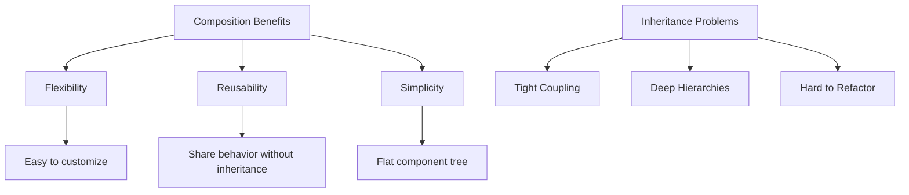

# Topic 26: Component Composition Patterns

[← Previous: useEffectEvent Hook](./25_useeffectevent_hook.md) | [Back to Main](../README.md) | [Next: Higher-Order Components →](./27_hocs.md)

---

## Table of Contents

1. [Overview](#overview)
2. [Composition vs Inheritance](#composition-vs-inheritance)
3. [Children Prop Pattern](#children-prop-pattern)
4. [Render Props Pattern](#render-props-pattern)
5. [Compound Components](#compound-components)
6. [Prop Getters Pattern](#prop-getters-pattern)
7. [State Reducer Pattern](#state-reducer-pattern)
8. [Provider Pattern](#provider-pattern)
9. [TypeScript Composition](#typescript-composition)
10. [Best Practices](#best-practices)
11. [Advanced Patterns](#advanced-patterns)

---

## Overview

**Component composition** is React's approach to code reuse. Instead of class inheritance, React uses composition to build complex UIs from simple, focused components.

**What You'll Learn:**
- Composition vs inheritance in React
- Different composition patterns (children, render props, etc.)
- When to use each pattern
- Building flexible, reusable components
- TypeScript for composition
- Best practices and common pitfalls

**Prerequisites:**
- React components and props
- Understanding of children prop
- JavaScript closures and functions

**Version Coverage:**
- React 16.8+ (All patterns work with Hooks)
- React 19.2

---

## Composition vs Inheritance

### React's Philosophy

```tsx
// ❌ Inheritance (not idiomatic in React)
class Button extends React.Component {
  render() {
    return <button>{this.props.label}</button>;
  }
}

class PrimaryButton extends Button {
  render() {
    return <button className="primary">{this.props.label}</button>;
  }
}

class SecondaryButton extends Button {
  render() {
    return <button className="secondary">{this.props.label}</button>;
  }
}

// ✅ Composition (React way)
function Button({ variant = 'default', children }) {
  return <button className={`btn-${variant}`}>{children}</button>;
}

function PrimaryButton({ children }) {
  return <Button variant="primary">{children}</Button>;
}

function SecondaryButton({ children }) {
  return <Button variant="secondary">{children}</Button>;
}

// Or even simpler:
<Button variant="primary">Click me</Button>
<Button variant="secondary">Cancel</Button>
```

### Why Composition?



---

## Children Prop Pattern

### Basic Children

```tsx
// Container components using children
function Card({ children }) {
  return (
    <div className="card">
      {children}
    </div>
  );
}

// Usage - compose different content
<Card>
  <h2>Title</h2>
  <p>Content</p>
</Card>

<Card>
  <UserProfile />
</Card>

<Card>
  
</Card>
```

### Multiple Named Slots

```tsx
// Instead of children, use named props
function Layout({ header, sidebar, content, footer }) {
  return (
    <div className="layout">
      <header>{header}</header>
      <div className="main">
        <aside>{sidebar}</aside>
        <main>{content}</main>
      </div>
      <footer>{footer}</footer>
    </div>
  );
}

// Usage
<Layout
  header={<Header />}
  sidebar={<Sidebar />}
  content={<MainContent />}
  footer={<Footer />}
/>
```

### Specialized Components

```tsx
// Create specialized versions through composition
function Dialog({ title, children, actions }) {
  return (
    <div className="dialog">
      <h2 className="dialog-title">{title}</h2>
      <div className="dialog-content">{children}</div>
      <div className="dialog-actions">{actions}</div>
    </div>
  );
}

function ConfirmDialog({ message, onConfirm, onCancel }) {
  return (
    <Dialog
      title="Confirm"
      actions={
        <>
          <button onClick={onCancel}>Cancel</button>
          <button onClick={onConfirm}>Confirm</button>
        </>
      }
    >
      <p>{message}</p>
    </Dialog>
  );
}

function AlertDialog({ message, onClose }) {
  return (
    <Dialog
      title="Alert"
      actions={<button onClick={onClose}>OK</button>}
    >
      <p>{message}</p>
    </Dialog>
  );
}
```

---

## Render Props Pattern

### Basic Render Props

```tsx
interface MouseTrackerProps {
  render: (position: { x: number; y: number }) => React.ReactNode;
}

function MouseTracker({ render }: MouseTrackerProps) {
  const [position, setPosition] = useState({ x: 0, y: 0 });
  
  useEffect(() => {
    const handleMove = (e: MouseEvent) => {
      setPosition({ x: e.clientX, y: e.clientY });
    };
    
    window.addEventListener('mousemove', handleMove);
    return () => window.removeEventListener('mousemove', handleMove);
  }, []);
  
  return <>{render(position)}</>;
}

// Usage
<MouseTracker 
  render={({ x, y }) => (
    <div>Mouse position: ({x}, {y})</div>
  )}
/>
```

### Children as Function

```tsx
// Alternative: children as render function
interface DataProviderProps<T> {
  data: T;
  children: (data: T) => React.ReactNode;
}

function DataProvider<T>({ data, children }: DataProviderProps<T>) {
  return <>{children(data)}</>;
}

// Usage
<DataProvider data={users}>
  {(users) => (
    <ul>
      {users.map(user => <li key={user.id}>{user.name}</li>)}
    </ul>
  )}
</DataProvider>
```

### Toggle Pattern

```tsx
interface ToggleProps {
  children: (isOn: boolean, toggle: () => void) => React.ReactNode;
}

function Toggle({ children }: ToggleProps) {
  const [isOn, setIsOn] = useState(false);
  const toggle = () => setIsOn(!isOn);
  
  return <>{children(isOn, toggle)}</>;
}

// Usage
<Toggle>
  {(isOn, toggle) => (
    <>
      <button onClick={toggle}>
        {isOn ? 'ON' : 'OFF'}
      </button>
      {isOn && <div>Visible content</div>}
    </>
  )}
</Toggle>
```

---

## Compound Components

### Basic Compound Pattern

```tsx
// Parent component with shared state
const TabsContext = createContext<{
  activeTab: number;
  setActiveTab: (index: number) => void;
} | null>(null);

function Tabs({ children }: { children: React.ReactNode }) {
  const [activeTab, setActiveTab] = useState(0);
  
  return (
    <TabsContext.Provider value={{ activeTab, setActiveTab }}>
      <div className="tabs">
        {children}
      </div>
    </TabsContext.Provider>
  );
}

// Child components that consume context
function TabList({ children }: { children: React.ReactNode }) {
  return <div className="tab-list">{children}</div>;
}

function Tab({ index, children }: { index: number; children: React.ReactNode }) {
  const context = useContext(TabsContext);
  if (!context) throw new Error('Tab must be within Tabs');
  
  const { activeTab, setActiveTab } = context;
  
  return (
    <button
      className={activeTab === index ? 'tab-active' : 'tab'}
      onClick={() => setActiveTab(index)}
    >
      {children}
    </button>
  );
}

function TabPanel({ index, children }: { index: number; children: React.ReactNode }) {
  const context = useContext(TabsContext);
  if (!context) throw new Error('TabPanel must be within Tabs');
  
  if (context.activeTab !== index) return null;
  
  return <div className="tab-panel">{children}</div>;
}

// Export as compound component
Tabs.List = TabList;
Tabs.Tab = Tab;
Tabs.Panel = TabPanel;

// Usage
<Tabs>
  <Tabs.List>
    <Tabs.Tab index={0}>Profile</Tabs.Tab>
    <Tabs.Tab index={1}>Settings</Tabs.Tab>
    <Tabs.Tab index={2}>Notifications</Tabs.Tab>
  </Tabs.List>
  
  <Tabs.Panel index={0}>
    <ProfileContent />
  </Tabs.Panel>
  
  <Tabs.Panel index={1}>
    <SettingsContent />
  </Tabs.Panel>
  
  <Tabs.Panel index={2}>
    <NotificationsContent />
  </Tabs.Panel>
</Tabs>
```

### Flexible Accordion

```tsx
// Accordion compound component
const AccordionContext = createContext<{
  openItems: Set<string>;
  toggle: (id: string) => void;
} | null>(null);

function Accordion({ children, allowMultiple = false }: {
  children: React.ReactNode;
  allowMultiple?: boolean;
}) {
  const [openItems, setOpenItems] = useState<Set<string>>(new Set());
  
  const toggle = (id: string) => {
    setOpenItems(prev => {
      const next = new Set(prev);
      
      if (next.has(id)) {
        next.delete(id);
      } else {
        if (!allowMultiple) {
          next.clear();
        }
        next.add(id);
      }
      
      return next;
    });
  };
  
  return (
    <AccordionContext.Provider value={{ openItems, toggle }}>
      <div className="accordion">{children}</div>
    </AccordionContext.Provider>
  );
}

function AccordionItem({ id, title, children }: {
  id: string;
  title: string;
  children: React.ReactNode;
}) {
  const context = useContext(AccordionContext);
  if (!context) throw new Error('AccordionItem must be within Accordion');
  
  const { openItems, toggle } = context;
  const isOpen = openItems.has(id);
  
  return (
    <div className="accordion-item">
      <button
        className="accordion-title"
        onClick={() => toggle(id)}
      >
        {title}
        <span>{isOpen ? '−' : '+'}</span>
      </button>
      {isOpen && (
        <div className="accordion-content">{children}</div>
      )}
    </div>
  );
}

Accordion.Item = AccordionItem;

// Usage
<Accordion allowMultiple>
  <Accordion.Item id="1" title="Section 1">
    <p>Content 1</p>
  </Accordion.Item>
  
  <Accordion.Item id="2" title="Section 2">
    <p>Content 2</p>
  </Accordion.Item>
</Accordion>
```

---

## Prop Getters Pattern

### Basic Prop Getters

```tsx
// Hook that returns prop getters
function useDropdown() {
  const [isOpen, setIsOpen] = useState(false);
  const [selectedIndex, setSelectedIndex] = useState(-1);
  
  // Prop getter for trigger button
  const getTriggerProps = () => ({
    onClick: () => setIsOpen(!isOpen),
    'aria-expanded': isOpen,
    'aria-haspopup': true
  });
  
  // Prop getter for menu
  const getMenuProps = () => ({
    role: 'menu',
    hidden: !isOpen
  });
  
  // Prop getter for menu items
  const getItemProps = (index: number) => ({
    role: 'menuitem',
    onClick: () => {
      setSelectedIndex(index);
      setIsOpen(false);
    },
    className: selectedIndex === index ? 'selected' : ''
  });
  
  return {
    isOpen,
    selectedIndex,
    getTriggerProps,
    getMenuProps,
    getItemProps
  };
}

// Usage
function Dropdown() {
  const dropdown = useDropdown();
  
  return (
    <div>
      <button {...dropdown.getTriggerProps()}>
        Select Option
      </button>
      
      <ul {...dropdown.getMenuProps()}>
        <li {...dropdown.getItemProps(0)}>Option 1</li>
        <li {...dropdown.getItemProps(1)}>Option 2</li>
        <li {...dropdown.getItemProps(2)}>Option 3</li>
      </ul>
    </div>
  );
}
```

---

## State Reducer Pattern

### Customizable Behavior

```tsx
// Define action types
type ToggleAction = 
  | { type: 'toggle' }
  | { type: 'on' }
  | { type: 'off' }
  | { type: 'reset' };

// Default reducer
function toggleReducer(state: boolean, action: ToggleAction): boolean {
  switch (action.type) {
    case 'toggle': return !state;
    case 'on': return true;
    case 'off': return false;
    case 'reset': return false;
    default: return state;
  }
}

// Hook with customizable reducer
function useToggle(
  initialState = false,
  reducer = toggleReducer
) {
  const [state, dispatch] = useReducer(reducer, initialState);
  
  const toggle = () => dispatch({ type: 'toggle' });
  const setOn = () => dispatch({ type: 'on' });
  const setOff = () => dispatch({ type: 'off' });
  const reset = () => dispatch({ type: 'reset' });
  
  return { isOn: state, toggle, setOn, setOff, reset };
}

// Usage: Default behavior
function Component() {
  const toggle = useToggle();
  return <button onClick={toggle.toggle}>{toggle.isOn ? 'ON' : 'OFF'}</button>;
}

// Usage: Custom behavior
function ComponentWithCustomLogic() {
  const customReducer = (state: boolean, action: ToggleAction) => {
    // Add custom logic
    if (action.type === 'toggle' && someCondition) {
      console.log('Prevented toggle');
      return state;  // Don't toggle
    }
    
    return toggleReducer(state, action);  // Default behavior
  };
  
  const toggle = useToggle(false, customReducer);
  
  return <button onClick={toggle.toggle}>{toggle.isOn ? 'ON' : 'OFF'}</button>;
}
```

---

## Provider Pattern

### Context-Based Composition

```tsx
// Theme provider
interface ThemeContextValue {
  theme: 'light' | 'dark';
  toggleTheme: () => void;
}

const ThemeContext = createContext<ThemeContextValue | null>(null);

function ThemeProvider({ children }: { children: React.ReactNode }) {
  const [theme, setTheme] = useState<'light' | 'dark'>('light');
  
  const toggleTheme = () => {
    setTheme(t => t === 'light' ? 'dark' : 'light');
  };
  
  return (
    <ThemeContext.Provider value={{ theme, toggleTheme }}>
      <div className={`theme-${theme}`}>
        {children}
      </div>
    </ThemeContext.Provider>
  );
}

function useTheme() {
  const context = useContext(ThemeContext);
  if (!context) throw new Error('useTheme must be within ThemeProvider');
  return context;
}

// Usage
function App() {
  return (
    <ThemeProvider>
      <Header />
      <Main />
      <Footer />
    </ThemeProvider>
  );
}

function Header() {
  const { theme, toggleTheme } = useTheme();
  
  return (
    <header>
      <h1>My App ({theme} mode)</h1>
      <button onClick={toggleTheme}>Toggle Theme</button>
    </header>
  );
}
```

---

## TypeScript Composition

### Generic Container Components

```tsx
// Generic wrapper component
interface ContainerProps<T> {
  data: T;
  render: (data: T) => React.ReactNode;
  loading?: boolean;
  error?: Error | null;
}

function Container<T>({ data, render, loading, error }: ContainerProps<T>) {
  if (loading) return <div>Loading...</div>;
  if (error) return <div>Error: {error.message}</div>;
  if (!data) return <div>No data</div>;
  
  return <>{render(data)}</>;
}

// Usage with specific types
interface User {
  id: number;
  name: string;
}

<Container<User>
  data={user}
  render={(user) => <div>{user.name}</div>}
  loading={loading}
/>
```

### Composable Props

```tsx
// Type-safe prop composition
interface BaseProps {
  className?: string;
  children?: React.ReactNode;
}

interface ButtonProps extends BaseProps {
  onClick?: () => void;
  disabled?: boolean;
}

interface LinkProps extends BaseProps {
  href: string;
  target?: string;
}

// Component can be button or link
type ButtonOrLinkProps = 
  | ({ as: 'button' } & ButtonProps)
  | ({ as: 'link' } & LinkProps);

function ButtonOrLink(props: ButtonOrLinkProps) {
  if (props.as === 'link') {
    return (
      <a href={props.href} target={props.target} className={props.className}>
        {props.children}
      </a>
    );
  }
  
  return (
    <button
      onClick={props.onClick}
      disabled={props.disabled}
      className={props.className}
    >
      {props.children}
    </button>
  );
}

// Usage
<ButtonOrLink as="button" onClick={() => {}}>Click</ButtonOrLink>
<ButtonOrLink as="link" href="/about">About</ButtonOrLink>
```

---

## Best Practices

### 1. Prefer Composition Over Inheritance

```tsx
// ❌ Don't use class inheritance
class SpecialButton extends Button {
  // Adding features through inheritance
}

// ✅ Use composition
function SpecialButton({ children, ...props }) {
  return (
    <Button {...props}>
      <Icon />
      {children}
    </Button>
  );
}
```

### 2. Keep Components Focused

```tsx
// ❌ Component does too much
function UserDashboard() {
  // Handles auth, data fetching, rendering, state management...
  return (/* huge JSX */);
}

// ✅ Compose focused components
function UserDashboard() {
  return (
    <AuthGuard>
      <DataProvider userId={userId}>
        {(data) => (
          <DashboardLayout>
            <UserInfo data={data.user} />
            <UserPosts posts={data.posts} />
            <UserStats stats={data.stats} />
          </DashboardLayout>
        )}
      </DataProvider>
    </AuthGuard>
  );
}
```

### 3. Make Components Flexible

```tsx
// ✅ Flexible through composition
function Card({ children, header, footer, variant = 'default' }) {
  return (
    <div className={`card card-${variant}`}>
      {header && <div className="card-header">{header}</div>}
      <div className="card-body">{children}</div>
      {footer && <div className="card-footer">{footer}</div>}
    </div>
  );
}

// Many ways to use
<Card>Simple content</Card>

<Card header={<h2>Title</h2>}>
  With header
</Card>

<Card 
  header={<h2>Full Card</h2>}
  footer={<button>Action</button>}
  variant="highlighted"
>
  Complete card
</Card>
```

---

## Advanced Patterns

### Control Props

```tsx
// Component can be controlled or uncontrolled
interface ToggleProps {
  isOn?: boolean;  // Controlled
  defaultIsOn?: boolean;  // Uncontrolled
  onChange?: (isOn: boolean) => void;
}

function Toggle({ isOn: controlledIsOn, defaultIsOn = false, onChange }: ToggleProps) {
  const [uncontrolledIsOn, setUncontrolledIsOn] = useState(defaultIsOn);
  
  // Use controlled value if provided, otherwise internal state
  const isOn = controlledIsOn !== undefined ? controlledIsOn : uncontrolledIsOn;
  
  const toggle = () => {
    const nextValue = !isOn;
    
    if (controlledIsOn === undefined) {
      setUncontrolledIsOn(nextValue);  // Update internal state
    }
    
    onChange?.(nextValue);  // Notify parent
  };
  
  return (
    <button onClick={toggle}>
      {isOn ? 'ON' : 'OFF'}
    </button>
  );
}

// Uncontrolled usage
<Toggle defaultIsOn={false} onChange={(v) => console.log(v)} />

// Controlled usage
function Parent() {
  const [isOn, setIsOn] = useState(false);
  return <Toggle isOn={isOn} onChange={setIsOn} />;
}
```

---

## Higher-Order Thinking FAQs

### 1. Why does React favor composition over inheritance, and what fundamental problems does this solve?

**Deep Answer:**

Composition solves **fundamental OOP problems** that plague inheritance-based UIs, particularly in JavaScript's flexible type system.

**Inheritance Problems:**

```tsx
// ❌ Inheritance hierarchy
class Button {}
class IconButton extends Button {}
class PrimaryButton extends Button {}
class PrimaryIconButton extends PrimaryButton {}  // or extend IconButton?

// Diamond problem: Multiple inheritance paths
// If need both Icon AND Primary features, which to extend?

// Rigid hierarchy: Hard to add cross-cutting concerns
class LoadingButton extends Button {}  // Need loading on ALL button types?
class PrimaryLoadingButton extends PrimaryButton {}
class SecondaryLoadingButton extends SecondaryButton {}
// Explosion of classes!
```

**Composition Solution:**

```tsx
// ✅ Composition: Mix and match
function Button({ variant, icon, loading, children }) {
  return (
    <button className={`btn-${variant}`} disabled={loading}>
      {loading && <Spinner />}
      {icon && <Icon name={icon} />}
      {children}
    </button>
  );
}

// All combinations possible
<Button variant="primary">Simple</Button>
<Button variant="primary" icon="save">With Icon</Button>
<Button variant="primary" loading>Loading</Button>
<Button variant="primary" icon="save" loading>All Features</Button>

// No class explosion!
```

**JavaScript-Specific Issues:**

```tsx
// JavaScript doesn't have:
// - Interfaces (for multiple inheritance)
// - Abstract classes (same as TypeScript abstract)
// - Method overloading
// - Protected members (enforceable)

// Composition doesn't need these!
// Functions + objects are enough
```

**Deep Implication:**

React's composition model embraces **JavaScript's strengths** (first-class functions, flexible objects) rather than fighting them with class hierarchies borrowed from Java/C++. This is why React feels "natural" in JavaScript - it works with the language, not against it.

### 2. When should you use render props vs children as function, and how do these patterns compare to custom Hooks?

**Deep Answer:**

These patterns solve similar problems but **custom Hooks** largely superseded render props for logic reuse.

**Historical Context:**

```tsx
// Pre-Hooks era: Render props for logic sharing
class MouseTracker extends Component {
  state = { x: 0, y: 0 };
  
  componentDidMount() {
    window.addEventListener('mousemove', this.handleMove);
  }
  
  componentWillUnmount() {
    window.removeEventListener('mousemove', this.handleMove);
  }
  
  handleMove = (e) => {
    this.setState({ x: e.clientX, y: e.clientY });
  };
  
  render() {
    return this.props.render(this.state);
  }
}

// Usage (verbose)
<MouseTracker render={({ x, y }) => (
  <p>Mouse at ({x}, {y})</p>
)} />
```

**Modern: Custom Hooks**

```tsx
// ✅ Much simpler with Hooks
function useMousePosition() {
  const [position, setPosition] = useState({ x: 0, y: 0 });
  
  useEffect(() => {
    const handleMove = (e: MouseEvent) => {
      setPosition({ x: e.clientX, y: e.clientY });
    };
    
    window.addEventListener('mousemove', handleMove);
    return () => window.removeEventListener('mousemove', handleMove);
  }, []);
  
  return position;
}

// Usage (clean)
function Component() {
  const { x, y } = useMousePosition();
  return <p>Mouse at ({x}, {y})</p>;
}
```

**When Render Props Still Useful:**

```tsx
// ✅ UI structure reuse (not just logic)
function List({ items, renderItem, renderEmpty }) {
  if (items.length === 0) {
    return <>{renderEmpty()}</>;
  }
  
  return (
    <ul>
      {items.map(item => (
        <li key={item.id}>{renderItem(item)}</li>
      ))}
    </ul>
  );
}

// Hook can't provide UI structure
// Render prop lets parent control rendering
```

**Decision Matrix:**

| Need | Custom Hook | Render Props |
|------|-------------|--------------|
| **Logic reuse** | ✅ Best | ⚠️ Verbose |
| **UI structure reuse** | ❌ Can't help | ✅ Perfect |
| **Multiple consumers** | ✅ Easy | ⚠️ Nesting |
| **TypeScript** | ✅ Simple | ⚠️ Complex |
| **Testing** | ✅ Easy | ⚠️ Harder |

**Deep Implication:**

Hooks **replaced** render props for logic sharing but **complement** them for UI structure sharing. Modern React uses Hooks for behavior and composition for UI. The combination is more powerful than either alone.

### 3. How do you decide between multiple composition slots (named props) vs just using children, and what are the trade-offs?

**Deep Answer:**

The choice between `children` and named slots involves **flexibility vs explicitness** trade-offs.

**Children Prop (Simple, Flexible):**

```tsx
// ✅ Good for simple containers
function Card({ children }) {
  return <div className="card">{children}</div>;
}

// Very flexible
<Card>
  <h2>Anything</h2>
  <p>Goes</p>
  <button>Here</button>
</Card>

// But: No control over structure
```

**Named Slots (Explicit, Structured):**

```tsx
// ✅ Good for defined structure
function Card({ title, content, actions }) {
  return (
    <div className="card">
      <div className="card-title">{title}</div>
      <div className="card-content">{content}</div>
      <div className="card-actions">{actions}</div>
    </div>
  );
}

// Explicit structure
<Card
  title={<h2>Title</h2>}
  content={<p>Content</p>}
  actions={<button>Action</button>}
/>

// But: Less flexible
```

**Trade-off Analysis:**

```tsx
// children: Maximum flexibility
// + Users can put anything anywhere
// + Simpler API
// - No guidance on structure
// - Hard to apply consistent styling to slots

// Named slots: Controlled flexibility
// + Clear API (users know what goes where)
// + Can style each slot independently
// + TypeScript knows what each slot should be
// - More props to manage
// - Less flexible

// Decision factors:
// 1. Complexity of structure → Named slots
// 2. Flexibility needed → Children
// 3. Styling requirements → Named slots
// 4. API simplicity → Children
```

**Hybrid Approach:**

```tsx
// Best of both worlds
function Card({ header, footer, children }) {
  return (
    <div className="card">
      {header && <div className="card-header">{header}</div>}
      <div className="card-body">{children}</div>
      {footer && <div className="card-footer">{footer}</div>}
    </div>
  );
}

// Simple usage
<Card>Just content</Card>

// Complex usage
<Card 
  header={<h2>Title</h2>}
  footer={<button>Action</button>}
>
  <p>Content</p>
</Card>
```

**Deep Implication:**

The children vs slots decision is about **API design philosophy**: children is "pit of success" (hard to mess up), named slots is "pit of correctness" (hard to use wrong). React defaults to children (simple), but provides flexibility for named slots when structure matters. Choose based on whether users need guidance or freedom.

---

## Senior SDE Interview Questions

### Question 1: Composition Architecture

**Question:** "Design a reusable DataTable component that supports sorting, filtering, pagination, row selection, and custom cell rendering. How would you architect this using composition?"

**Key Concepts Being Tested:**
- Composition strategy
- API design
- Flexibility vs complexity
- Reusability patterns

**Expected Answer Should Cover:**

1. **Composition Strategy:**
```tsx
// Approach: Compound components + render props

<DataTable data={products}>
  <DataTable.Header>
    <DataTable.Column 
      field="name" 
      sortable 
      render={(value) => <strong>{value}</strong>}
    />
    <DataTable.Column field="price" sortable />
    <DataTable.Column field="actions" render={(_, row) => (
      <button onClick={() => handleEdit(row)}>Edit</button>
    )} />
  </DataTable.Header>
  
  <DataTable.Body />
  
  <DataTable.Footer>
    <DataTable.Pagination pageSize={10} />
  </DataTable.Footer>
</DataTable>
```

2. **Benefits:**
- Flexible: Users can arrange components as needed
- Customizable: render props for cell rendering
- Type-safe: TypeScript knows props for each part
- Testable: Each component testable in isolation

3. **Implementation Sketch:**
```tsx
const DataTableContext = createContext(null);

function DataTable({ data, children }) {
  const [sortBy, setSortBy] = useState(null);
  const [filters, setFilters] = useState({});
  const [selectedRows, setSelectedRows] = useState(new Set());
  
  return (
    <DataTableContext.Provider value={{
      data, sortBy, setSortBy, filters, setFilters,
      selectedRows, setSelectedRows
    }}>
      <table className="data-table">
        {children}
      </table>
    </DataTableContext.Provider>
  );
}

// Export compound components
DataTable.Header = Header;
DataTable.Column = Column;
DataTable.Body = Body;
DataTable.Footer = Footer;
DataTable.Pagination = Pagination;
```

**Follow-ups:**
1. "How would you handle virtual scrolling for 100k rows?"
2. "What about server-side sorting/filtering?"
3. "How do you maintain component state during data updates?"

**Red Flags:**
- Monolithic single component
- No consideration of flexibility
- Missing TypeScript types

**Green Flags:**
- Compound component pattern
- Separation of concerns
- Flexible yet structured API
- Considers accessibility (ARIA)

---

[← Previous: useEffectEvent Hook](./25_useeffectevent_hook.md) | [Back to Main](../README.md) | [Next: Higher-Order Components →](./27_hocs.md)

---

**Progress**: Topic 26/220 completed | Part III: Advanced Patterns (10% complete)
