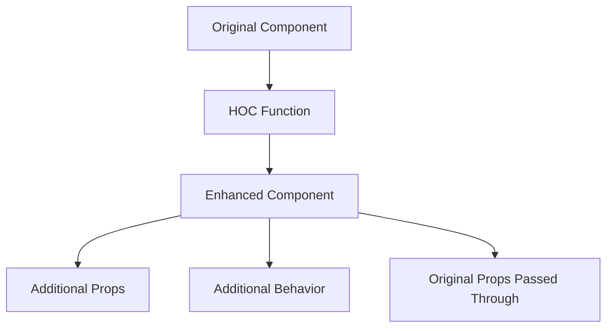

# Topic 27: Higher-Order Components (HOCs)

[← Previous: Composition Patterns](./26_composition.md) | [Back to Main](../README.md) | [Next: Render Props →](./28_render_props.md)

---

## Table of Contents

1. [Overview](#overview)
2. [What are HOCs?](#what-are-hocs)
3. [Creating HOCs](#creating-hocs)
4. [Common HOC Patterns](#common-hoc-patterns)
5. [HOCs vs Hooks](#hocs-vs-hooks)
6. [TypeScript HOCs](#typescript-hocs)
7. [HOC Composition](#hoc-composition)
8. [Common Pitfalls](#common-pitfalls)
9. [Best Practices](#best-practices)
10. [Migration to Hooks](#migration-to-hooks)

---

## Overview

**Higher-Order Components (HOCs)** are functions that take a component and return a new component with enhanced functionality. HOCs were the primary pattern for code reuse before Hooks, and understanding them is crucial for working with legacy code and libraries.

**What You'll Learn:**
- What HOCs are and their purpose
- How to create HOCs
- Common HOC patterns
- HOCs vs modern Hooks
- TypeScript typing for HOCs
- When HOCs are still relevant
- Migration strategies

**Prerequisites:**
- React components and props
- Understanding of higher-order functions
- TypeScript generics (for typed examples)

**Version Coverage:**
- React 16.3+ (Context API made HOCs easier)
- React 16.8+ (Hooks provide alternative)
- React 19.2 (HOCs still valid but less common)

---

## What are HOCs?

### Core Concept

A **Higher-Order Component** is a function that takes a component and returns a new component.

```tsx
// HOC function signature
function higherOrderComponent(WrappedComponent) {
  return function EnhancedComponent(props) {
    // Add functionality
    return <WrappedComponent {...props} />;
  };
}

// Usage
const EnhancedComponent = higherOrderComponent(OriginalComponent);
```

### Simple Example

```tsx
// HOC that adds loading state
function withLoading(Component) {
  return function WithLoadingComponent(props) {
    if (props.isLoading) {
      return <div>Loading...</div>;
    }
    
    return <Component {...props} />;
  };
}

// Original component
function UserList({ users }) {
  return (
    <ul>
      {users.map(user => <li key={user.id}>{user.name}</li>)}
    </ul>
  );
}

// Enhanced component
const UserListWithLoading = withLoading(UserList);

// Usage
<UserListWithLoading users={users} isLoading={loading} />
```

### HOC Pattern



---

## Creating HOCs

### Basic HOC Structure

```tsx
// Template for HOC
function withFeature(WrappedComponent) {
  // Can have display name for debugging
  const ComponentWithFeature = (props) => {
    // Add functionality here
    const additionalProps = {
      // Enhanced props
    };
    
    return <WrappedComponent {...props} {...additionalProps} />;
  };
  
  // Set display name for DevTools
  ComponentWithFeature.displayName = `withFeature(${getDisplayName(WrappedComponent)})`;
  
  return ComponentWithFeature;
}

function getDisplayName(Component) {
  return Component.displayName || Component.name || 'Component';
}
```

### HOC with State

```tsx
// HOC that manages toggle state
function withToggle(Component) {
  return function WithToggle(props) {
    const [isOn, setIsOn] = useState(false);
    const toggle = () => setIsOn(!isOn);
    
    return (
      <Component
        {...props}
        isOn={isOn}
        toggle={toggle}
      />
    );
  };
}

// Usage
function Menu({ isOn, toggle, items }) {
  return (
    <>
      <button onClick={toggle}>Toggle Menu</button>
      {isOn && (
        <ul>
          {items.map(item => <li key={item}>{item}</li>)}
        </ul>
      )}
    </>
  );
}

const MenuWithToggle = withToggle(Menu);
```

---

## Common HOC Patterns

### withAuth - Authentication

```tsx
// HOC for authentication
function withAuth(Component) {
  return function WithAuth(props) {
    const { user, loading } = useAuth();  // Custom Hook
    
    if (loading) {
      return <div>Loading...</div>;
    }
    
    if (!user) {
      return <Navigate to="/login" />;
    }
    
    return <Component {...props} user={user} />;
  };
}

// Usage
function Dashboard({ user }) {
  return <div>Welcome, {user.name}!</div>;
}

const ProtectedDashboard = withAuth(Dashboard);
```

### withData - Data Fetching

```tsx
// HOC for data fetching
function withData(url) {
  return function (Component) {
    return function WithData(props) {
      const [data, setData] = useState(null);
      const [loading, setLoading] = useState(true);
      const [error, setError] = useState(null);
      
      useEffect(() => {
        fetch(url)
          .then(res => res.json())
          .then(setData)
          .catch(setError)
          .finally(() => setLoading(false));
      }, []);
      
      if (loading) return <div>Loading...</div>;
      if (error) return <div>Error: {error.message}</div>;
      
      return <Component {...props} data={data} />;
    };
  };
}

// Usage
function UserList({ data }) {
  return (
    <ul>
      {data.map(user => <li key={user.id}>{user.name}</li>)}
    </ul>
  );
}

const UserListWithData = withData('/api/users')(UserList);
```

---

## HOCs vs Hooks

### Same Functionality, Different Approach

```tsx
// HOC approach
function withWindowSize(Component) {
  return function WithWindowSize(props) {
    const [width, setWidth] = useState(window.innerWidth);
    
    useEffect(() => {
      const handleResize = () => setWidth(window.innerWidth);
      window.addEventListener('resize', handleResize);
      return () => window.removeEventListener('resize', handleResize);
    }, []);
    
    return <Component {...props} width={width} />;
  };
}

const ResponsiveComponent = withWindowSize(MyComponent);

// Hook approach (Modern, Preferred)
function useWindowSize() {
  const [width, setWidth] = useState(window.innerWidth);
  
  useEffect(() => {
    const handleResize = () => setWidth(window.innerWidth);
    window.addEventListener('resize', handleResize);
    return () => window.removeEventListener('resize', handleResize);
  }, []);
  
  return width;
}

function MyComponent() {
  const width = useWindowSize();  // Much simpler!
  return <div>Width: {width}</div>;
}
```

### Comparison

| Aspect | HOCs | Hooks |
|--------|------|-------|
| **Code Volume** | More verbose | More concise |
| **Nesting** | Wrapper hell | Flat |
| **TypeScript** | Complex | Simple |
| **Props Collision** | Can happen | No issue |
| **Multiple Enhancements** | Nesting required | Just call multiple Hooks |
| **Testing** | Harder | Easier |
| **Future** | Legacy pattern | Modern approach |

---

## TypeScript HOCs

### Typed HOC

```tsx
// Basic typed HOC
function withLoading<P extends object>(
  Component: React.ComponentType<P>
): React.FC<P & { isLoading: boolean }> {
  return function WithLoading(props: P & { isLoading: boolean }) {
    const { isLoading, ...rest } = props;
    
    if (isLoading) {
      return <div>Loading...</div>;
    }
    
    return <Component {...(rest as P)} />;
  };
}

// Usage with type safety
interface UserListProps {
  users: User[];
}

const UserList: React.FC<UserListProps> = ({ users }) => (
  <ul>{users.map(u => <li key={u.id}>{u.name}</li>)}</ul>
);

const UserListWithLoading = withLoading(UserList);

// TypeScript knows this component needs users AND isLoading
<UserListWithLoading users={users} isLoading={loading} />
```

### Generic HOC

```tsx
// HOC that injects data
function withData<T, P extends object>(
  fetchData: () => Promise<T>,
  dataKey: string
) {
  return function (Component: React.ComponentType<P & Record<string, T>>) {
    return function WithData(props: P) {
      const [data, setData] = useState<T | null>(null);
      const [loading, setLoading] = useState(true);
      
      useEffect(() => {
        fetchData()
          .then(setData)
          .finally(() => setLoading(false));
      }, []);
      
      if (loading) return <div>Loading...</div>;
      if (!data) return <div>No data</div>;
      
      const enhancedProps = {
        ...props,
        [dataKey]: data
      } as P & Record<string, T>;
      
      return <Component {...enhancedProps} />;
    };
  };
}
```

---

## HOC Composition

### Composing Multiple HOCs

```tsx
// Multiple HOCs
const enhance = compose(
  withAuth,
  withData('/api/users'),
  withLoading,
  withErrorBoundary
);

const EnhancedComponent = enhance(BaseComponent);

// Equivalent to nesting:
const EnhancedComponent = 
  withAuth(
    withData('/api/users')(
      withLoading(
        withErrorBoundary(BaseComponent)
      )
    )
  );
```

### compose Helper

```tsx
// Helper function for composing HOCs
function compose(...fns) {
  return (x) => fns.reduceRight((acc, fn) => fn(acc), x);
}

// Usage
const enhance = compose(
  withAuth,
  withTheme,
  withRouter
);

const MyComponent = enhance(BaseComponent);
```

---

## Common Pitfalls

### 1. Props Collision

```tsx
// ❌ HOC can accidentally override props
function withUser(Component) {
  return function WithUser(props) {
    const user = useUser();
    return <Component {...props} user={user} />;  // Overrides props.user!
  };
}

// ✅ Namespace or check for collisions
function withUser(Component) {
  return function WithUser(props) {
    const userData = useUser();
    return <Component {...props} userData={userData} />;
  };
}
```

### 2. Ref Not Forwarded

```tsx
// ❌ Ref doesn't work
const Enhanced = withFeature(Component);
<Enhanced ref={myRef} />  // ref goes to HOC wrapper, not Component!

// ✅ Forward refs
function withFeature(Component) {
  const WithFeature = forwardRef((props, ref) => {
    return <Component {...props} ref={ref} />;
  });
  
  return WithFeature;
}
```

### 3. Display Name

```tsx
// ❌ Hard to debug without display name
function withFeature(Component) {
  return (props) => <Component {...props} />;
}

// ✅ Set display name
function withFeature(Component) {
  const WithFeature = (props) => <Component {...props} />;
  
  WithFeature.displayName = `withFeature(${getDisplayName(Component)})`;
  
  return WithFeature;
}

function getDisplayName(Component) {
  return Component.displayName || Component.name || 'Component';
}
```

---

## Best Practices

### 1. Don't Mutate the Original Component

```tsx
// ❌ Don't modify prototype
function withFeature(Component) {
  Component.prototype.extraMethod = () => {};  // Don't do this!
  return Component;
}

// ✅ Return new component
function withFeature(Component) {
  return function WithFeature(props) {
    return <Component {...props} />;
  };
}
```

### 2. Pass Unrelated Props Through

```tsx
// ✅ Spread all props
function withFeature(Component) {
  return function WithFeature(props) {
    const { featureProp, ...rest } = props;
    
    return <Component {...rest} enhanced={processFeature(featureProp)} />;
  };
}
```

### 3. Maximize Composability

```tsx
// ✅ HOCs should be pure functions
function withFeature(config) {
  return function (Component) {
    return function WithFeature(props) {
      // Pure, composable
      return <Component {...props} />;
    };
  };
}
```

---

## Migration to Hooks

### HOC to Hook Pattern

```tsx
// Before: HOC
function withWindowSize(Component) {
  return function WithWindowSize(props) {
    const [size, setSize] = useState(getWindowSize());
    
    useEffect(() => {
      const handleResize = () => setSize(getWindowSize());
      window.addEventListener('resize', handleResize);
      return () => window.removeEventListener('resize', handleResize);
    }, []);
    
    return <Component {...props} windowSize={size} />;
  };
}

const MyComponent = withWindowSize(BaseComponent);

// After: Custom Hook
function useWindowSize() {
  const [size, setSize] = useState(getWindowSize());
  
  useEffect(() => {
    const handleResize = () => setSize(getWindowSize());
    window.addEventListener('resize', handleResize);
    return () => window.removeEventListener('resize', handleResize);
  }, []);
  
  return size;
}

function MyComponent() {
  const windowSize = useWindowSize();  // Much simpler!
  return <div>Width: {windowSize.width}</div>;
}
```

---

## Higher-Order Thinking FAQs

### 1. Why did Hooks largely replace HOCs, and when are HOCs still the better choice?

**Deep Answer:**

Hooks replaced HOCs for **logic reuse** because they solve the same problem with less complexity, but HOCs still have niche use cases.

**HOC Problems:**

```tsx
// Wrapper hell with multiple HOCs
const Enhanced = withAuth(
  withTheme(
    withRouter(
      withData('/api/users')(
        BaseComponent
      )
    )
  )
);

// Component tree in DevTools:
// WithAuth
//   WithTheme
//     WithRouter
//       WithData
//         BaseComponent
```

**Hook Solution:**

```tsx
// Flat with Hooks
function Component() {
  const auth = useAuth();
  const theme = useTheme();
  const router = useRouter();
  const data = useData('/api/users');
  
  // No nesting!
}
```

**When HOCs Still Better:**

```tsx
// ✅ 1. Wrapping third-party components
import { ExternalComponent } from 'some-library';

const EnhancedExternal = withFeature(ExternalComponent);
// Can't modify ExternalComponent to add Hooks

// ✅ 2. Cross-cutting concerns in libraries
// React-Redux's connect() is an HOC
connect(mapStateToProps)(Component);

// ✅ 3. Decorating components declaratively
@withAuth
@withTheme
class Component extends React.Component {}
```

**Deep Implication:**

HOCs are **function composition** while Hooks are **behavior composition**. HOCs wrap components (visual in tree), Hooks compose behaviors (invisible). Hooks won because most composition is about behavior, not wrapping. But when you need to wrap (third-party components, decorators), HOCs still have a place.

### 2. How do HOCs handle prop conflicts, and why is this a fundamental limitation compared to Hooks?

**Deep Answer:**

HOCs merge props from wrapper and wrapped component, creating potential **namespace collisions** that Hooks avoid entirely.

**The Conflict Problem:**

```tsx
// Two HOCs inject same prop name
function withUser(Component) {
  return (props) => {
    const user = useCurrentUser();
    return <Component {...props} user={user} />;
  };
}

function withUserPreferences(Component) {
  return (props) => {
    const user = useUserPreferences();  // Also named "user"!
    return <Component {...props} user={user} />;
  };
}

// Composing them:
const Enhanced = withUser(withUserPreferences(Base));

// Base component receives:
// - props.user from withUserPreferences (withUser's user is overridden!)
// Lost the current user data!
```

**Hooks Don't Have This Problem:**

```tsx
// Hooks: Explicit names
function Component() {
  const currentUser = useCurrentUser();
  const userPrefs = useUserPreferences();
  
  // No collision possible!
  // Developer chooses names
}
```

**HOC Workarounds:**

```tsx
// 1. Namespace props
function withUser(Component) {
  return (props) => {
    const userData = useCurrentUser();
    return <Component {...props} currentUser={userData} />;
  };
}

// 2. Use different prop name
function withUserPreferences(Component) {
  return (props) => {
    const prefs = useUserPreferences();
    return <Component {...props} preferences={prefs} />;
  };
}

// 3. Check for collisions (complex)
function withUser(Component) {
  return (props) => {
    if ('user' in props) {
      console.warn('user prop collision!');
    }
    const user = useCurrentUser();
    return <Component {...props} user={user} />;
  };
}
```

**Deep Implication:**

HOCs have **implicit prop injection** - you don't see what props are added until you read the HOC code. Hooks have **explicit consumption** - you see exactly what's being used. This explicitness is why Hooks are easier to understand and debug. It's a manifestation of React's move toward more explicit, less "magic" patterns.

---

## Senior SDE Interview Questions

### Question 1: HOC vs Hook Decision

**Question:** "You're building a library that provides authentication. Should you expose an HOC (withAuth) or a Hook (useAuth), and what factors influence this decision?"

**Key Concepts Being Tested:**
- Understanding of HOCs vs Hooks tradeoffs
- Library API design
- Backward compatibility
- User experience considerations

**Expected Answer Should Cover:**

1. **Provide Both:**
```tsx
// Hook (primary API)
export function useAuth() {
  return useContext(AuthContext);
}

// HOC (backward compatibility, convenience)
export function withAuth(Component) {
  return function WithAuth(props) {
    const auth = useAuth();
    return <Component {...props} auth={auth} />;
  };
}

// Users can choose
```

2. **Factors:**
- Hook: Modern, flexible, recommended
- HOC: Legacy support, decorator syntax, third-party component wrapping
- Both: Maximum compatibility

3. **Migration Path:**
- Start with Hook
- Add HOC as convenience wrapper
- Document Hook as primary API
- Eventually deprecate HOC

**Follow-ups:**
1. "How do you handle breaking changes when deprecating the HOC?"
2. "What about TypeScript typing for both?"
3. "How do you test both APIs?"

**Red Flags:**
- Only providing HOC (outdated)
- Not considering backward compatibility
- Missing migration strategy

**Green Flags:**
- Provides both with clear guidance
- Hook as primary, HOC as convenience
- Migration documentation
- TypeScript support for both

---

[← Previous: Composition Patterns](./26_composition.md) | [Back to Main](../README.md) | [Next: Render Props →](./28_render_props.md)

---

**Progress**: Topic 27/220 completed | Part III: Advanced Patterns (20% complete)
