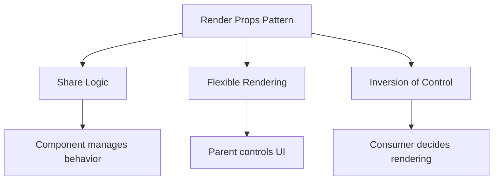

# Topic 28: Render Props Pattern

[← Previous: Higher-Order Components](./27_hocs.md) | [Back to Main](../README.md) | [Next: Compound Components →](./29_compound_components.md)

---

## Table of Contents

1. [Overview](#overview)
2. [What are Render Props?](#what-are-render-props)
3. [Basic Render Props](#basic-render-props)
4. [Children as Function](#children-as-function)
5. [Render Props vs HOCs](#render-props-vs-hocs)
6. [Render Props vs Hooks](#render-props-vs-hooks)
7. [TypeScript Render Props](#typescript-render-props)
8. [Common Patterns](#common-patterns)
9. [Best Practices](#best-practices)
10. [When to Use Render Props](#when-to-use-render-props)

---

## Overview

**Render Props** is a pattern where a component receives a function prop that returns React elements, enabling flexible component composition and code reuse. While largely superseded by Hooks for logic sharing, render props remain valuable for UI structure customization.

**What You'll Learn:**
- What render props are and how they work
- Children as function pattern
- Render props vs HOCs and Hooks
- TypeScript typing for render props
- When render props are still relevant
- Modern use cases

**Prerequisites:**
- React components and props
- Understanding of functions as props
- Higher-order functions

**Version Coverage:**
- React 16+ (Render props pattern established)
- React 19.2

---

## What are Render Props?

### Core Concept

A **render prop** is a function prop that a component uses to know what to render.

```tsx
// Component with render prop
function DataProvider({ data, render }) {
  return <div>{render(data)}</div>;
}

// Usage
<DataProvider 
  data={users}
  render={(users) => (
    <ul>
      {users.map(user => <li key={user.id}>{user.name}</li>)}
    </ul>
  )}
/>
```

### Why Render Props?



**Benefits:**
- ✅ Logic and rendering separated
- ✅ Parent controls what's rendered
- ✅ Type-safe with TypeScript
- ✅ No wrapper components
- ✅ Explicit data flow

---

## Basic Render Props

### Simple Example

```tsx
interface Mouse {
  x: number;
  y: number;
}

interface MouseTrackerProps {
  render: (mouse: Mouse) => React.ReactNode;
}

function MouseTracker({ render }: MouseTrackerProps) {
  const [position, setPosition] = useState<Mouse>({ x: 0, y: 0 });
  
  useEffect(() => {
    const handleMove = (e: MouseEvent) => {
      setPosition({ x: e.clientX, y: e.clientY });
    };
    
    window.addEventListener('mousemove', handleMove);
    return () => window.removeEventListener('mousemove', handleMove);
  }, []);
  
  return <>{render(position)}</>;
}

// Usage: Display position
<MouseTracker 
  render={({ x, y }) => (
    <p>Mouse at: ({x}, {y})</p>
  )}
/>

// Usage: Draw element at position
<MouseTracker 
  render={({ x, y }) => (
    <div style={{ position: 'fixed', left: x, top: y }}>
      🎯
    </div>
  )}
/>
```

### Multiple Render Props

```tsx
interface ListProps<T> {
  items: T[];
  renderItem: (item: T, index: number) => React.ReactNode;
  renderEmpty?: () => React.ReactNode;
  renderLoading?: () => React.ReactNode;
  isLoading?: boolean;
}

function List<T>({ 
  items, 
  renderItem, 
  renderEmpty, 
  renderLoading,
  isLoading 
}: ListProps<T>) {
  if (isLoading && renderLoading) {
    return <>{renderLoading()}</>;
  }
  
  if (items.length === 0 && renderEmpty) {
    return <>{renderEmpty()}</>;
  }
  
  return (
    <ul>
      {items.map((item, index) => (
        <li key={index}>{renderItem(item, index)}</li>
      ))}
    </ul>
  );
}

// Usage
<List
  items={products}
  renderItem={(product) => (
    <div>
      <h3>{product.name}</h3>
      <p>${product.price}</p>
    </div>
  )}
  renderEmpty={() => <p>No products found</p>}
  renderLoading={() => <Spinner />}
  isLoading={loading}
/>
```

---

## Children as Function

### Basic Pattern

```tsx
// Using children prop as render function
interface ToggleProps {
  children: (isOn: boolean, toggle: () => void) => React.ReactNode;
}

function Toggle({ children }: ToggleProps) {
  const [isOn, setIsOn] = useState(false);
  const toggle = () => setIsOn(!isOn);
  
  return <>{children(isOn, toggle)}</>;
}

// Usage
<Toggle>
  {(isOn, toggle) => (
    <>
      <button onClick={toggle}>
        {isOn ? 'ON' : 'OFF'}
      </button>
      {isOn && <div>Visible when ON</div>}
    </>
  )}
</Toggle>
```

### Data Provider Pattern

```tsx
interface DataProviderProps<T> {
  data: T[];
  loading: boolean;
  error: Error | null;
  children: (state: {
    data: T[];
    loading: boolean;
    error: Error | null;
    refetch: () => void;
  }) => React.ReactNode;
}

function DataProvider<T>({ 
  data, 
  loading, 
  error, 
  children 
}: DataProviderProps<T>) {
  const [refreshKey, setRefreshKey] = useState(0);
  
  const refetch = () => setRefreshKey(k => k + 1);
  
  return <>{children({ data, loading, error, refetch })}</>;
}

// Usage
<DataProvider data={users} loading={loading} error={error}>
  {({ data, loading, error, refetch }) => {
    if (loading) return <Spinner />;
    if (error) return <Error error={error} onRetry={refetch} />;
    
    return (
      <div>
        {data.map(user => <UserCard key={user.id} user={user} />)}
        <button onClick={refetch}>Refresh</button>
      </div>
    );
  }}
</DataProvider>
```

---

## Render Props vs HOCs

### Same Goal, Different Approach

```tsx
// HOC approach
function withMouse(Component) {
  return function WithMouse(props) {
    const [mouse, setMouse] = useState({ x: 0, y: 0 });
    
    useEffect(() => {
      const handleMove = (e) => setMouse({ x: e.clientX, y: e.clientY });
      window.addEventListener('mousemove', handleMove);
      return () => window.removeEventListener('mousemove', handleMove);
    }, []);
    
    return <Component {...props} mouse={mouse} />;
  };
}

const MyComponent = withMouse(BaseComponent);

// Render Props approach
function Mouse({ render }) {
  const [mouse, setMouse] = useState({ x: 0, y: 0 });
  
  useEffect(() => {
    const handleMove = (e) => setMouse({ x: e.clientX, y: e.clientY });
    window.addEventListener('mousemove', handleMove);
    return () => window.removeEventListener('mousemove', handleMove);
  }, []);
  
  return <>{render(mouse)}</>;
}

// Usage
<Mouse render={(mouse) => <BaseComponent mouse={mouse} />} />
```

### Comparison

| Aspect | HOCs | Render Props |
|--------|------|--------------|
| **Static Composition** | Yes | No |
| **Dynamic Rendering** | No | Yes |
| **Props Namespace** | Can collide | Explicit |
| **Multiple Uses** | Wrapper nesting | Function nesting |
| **TypeScript** | Complex | Moderate |
| **Debugging** | Wrapper in tree | Function in tree |

---

## Render Props vs Hooks

### Modern Alternative

```tsx
// Old: Render Props
function Mouse({ render }) {
  const [pos, setPos] = useState({ x: 0, y: 0 });
  
  useEffect(() => {
    const handleMove = (e) => setPos({ x: e.clientX, y: e.clientY });
    window.addEventListener('mousemove', handleMove);
    return () => window.removeEventListener('mousemove', handleMove);
  }, []);
  
  return <>{render(pos)}</>;
}

// Usage
<Mouse render={({ x, y }) => <p>Mouse: {x}, {y}</p>} />

// Modern: Custom Hook
function useMouse() {
  const [pos, setPos] = useState({ x: 0, y: 0 });
  
  useEffect(() => {
    const handleMove = (e) => setPos({ x: e.clientX, y: e.clientY });
    window.addEventListener('mousemove', handleMove);
    return () => window.removeEventListener('mousemove', handleMove);
  }, []);
  
  return pos;
}

// Usage (much simpler)
function Component() {
  const { x, y } = useMouse();
  return <p>Mouse: {x}, {y}</p>;
}
```

---

## TypeScript Render Props

### Typed Render Function

```tsx
interface RenderProps<T> {
  data: T;
  render: (data: T) => React.ReactNode;
}

function DataDisplay<T>({ data, render }: RenderProps<T>) {
  return <div>{render(data)}</div>;
}

// Usage with type inference
<DataDisplay
  data={user}
  render={(user) => <div>{user.name}</div>}  // user is typed!
/>
```

### Complex Render Props

```tsx
interface FormRenderProps {
  values: Record<string, any>;
  errors: Record<string, string>;
  handleChange: (field: string, value: any) => void;
  handleSubmit: () => void;
}

interface FormProps {
  initialValues: Record<string, any>;
  onSubmit: (values: Record<string, any>) => void;
  children: (props: FormRenderProps) => React.ReactNode;
}

function Form({ initialValues, onSubmit, children }: FormProps) {
  const [values, setValues] = useState(initialValues);
  const [errors, setErrors] = useState({});
  
  const handleChange = (field: string, value: any) => {
    setValues({ ...values, [field]: value });
  };
  
  const handleSubmit = () => {
    onSubmit(values);
  };
  
  return (
    <form onSubmit={(e) => { e.preventDefault(); handleSubmit(); }}>
      {children({ values, errors, handleChange, handleSubmit })}
    </form>
  );
}

// Usage
<Form 
  initialValues={{ name: '', email: '' }}
  onSubmit={(values) => console.log(values)}
>
  {({ values, handleChange, handleSubmit }) => (
    <>
      <input 
        value={values.name}
        onChange={(e) => handleChange('name', e.target.value)}
      />
      <input 
        value={values.email}
        onChange={(e) => handleChange('email', e.target.value)}
      />
      <button onClick={handleSubmit}>Submit</button>
    </>
  )}
</Form>
```

---

## Common Patterns

### Loading State Management

```tsx
interface AsyncRenderProps<T> {
  loading: boolean;
  error: Error | null;
  data: T | null;
  refetch: () => void;
}

interface AsyncProps<T> {
  fetchData: () => Promise<T>;
  children: (props: AsyncRenderProps<T>) => React.ReactNode;
}

function Async<T>({ fetchData, children }: AsyncProps<T>) {
  const [state, setState] = useState<AsyncRenderProps<T>>({
    loading: true,
    error: null,
    data: null,
    refetch: () => {}
  });
  
  const fetch = useCallback(() => {
    setState(prev => ({ ...prev, loading: true }));
    
    fetchData()
      .then(data => setState({ loading: false, error: null, data, refetch: fetch }))
      .catch(error => setState({ loading: false, error, data: null, refetch: fetch }));
  }, [fetchData]);
  
  useEffect(() => {
    fetch();
  }, [fetch]);
  
  return <>{children(state)}</>;
}

// Usage
<Async fetchData={() => fetchUsers()}>
  {({ loading, error, data, refetch }) => {
    if (loading) return <Spinner />;
    if (error) return <Error error={error} onRetry={refetch} />;
    if (!data) return <EmptyState />;
    
    return (
      <>
        <UserList users={data} />
        <button onClick={refetch}>Refresh</button>
      </>
    );
  }}
</Async>
```

---

## Best Practices

### 1. Keep Render Functions Pure

```tsx
// ✅ Pure render function
<DataProvider>
  {(data) => (
    <div>{data.name}</div>
  )}
</DataProvider>

// ❌ Side effects in render function
<DataProvider>
  {(data) => {
    console.log(data);  // Side effect!
    localStorage.setItem('data', JSON.stringify(data));  // Side effect!
    return <div>{data.name}</div>;
  }}
</DataProvider>
```

### 2. Use Descriptive Names

```tsx
// ✅ Clear prop names
<List
  items={products}
  renderItem={(product) => <ProductCard product={product} />}
  renderEmpty={() => <EmptyState />}
/>

// ❌ Unclear names
<List
  items={products}
  render1={(product) => <ProductCard product={product} />}
  render2={() => <EmptyState />}
/>
```

### 3. Provide Default Implementations

```tsx
// ✅ Optional render props with defaults
function List({ items, renderItem, renderEmpty = () => <p>No items</p> }) {
  if (items.length === 0) {
    return <>{renderEmpty()}</>;
  }
  
  return (
    <ul>
      {items.map((item, i) => (
        <li key={i}>{renderItem(item)}</li>
      ))}
    </ul>
  );
}
```

---

## When to Use Render Props

### Good Use Cases

```tsx
// ✅ 1. UI structure customization
function Table({ data, renderRow, renderHeader }) {
  return (
    <table>
      <thead>{renderHeader()}</thead>
      <tbody>
        {data.map(row => renderRow(row))}
      </tbody>
    </table>
  );
}

// ✅ 2. Conditional rendering logic
function Conditional({ condition, renderTrue, renderFalse }) {
  return condition ? <>{renderTrue()}</> : <>{renderFalse()}</>;
}

// ✅ 3. Layout patterns
function Split({ renderLeft, renderRight, ratio = 50 }) {
  return (
    <div className="split">
      <div style={{ width: `${ratio}%` }}>{renderLeft()}</div>
      <div style={{ width: `${100 - ratio}%` }}>{renderRight()}</div>
    </div>
  );
}
```

### When to Use Hooks Instead

```tsx
// ❌ Don't use render props for pure logic
function DataFetcher({ url, render }) {
  const [data, setData] = useState(null);
  useEffect(() => {
    fetch(url).then(r => r.json()).then(setData);
  }, [url]);
  
  return <>{render(data)}</>;
}

// ✅ Use custom Hook instead
function useFetch(url) {
  const [data, setData] = useState(null);
  useEffect(() => {
    fetch(url).then(r => r.json()).then(setData);
  }, [url]);
  
  return data;
}

function Component() {
  const data = useFetch('/api/data');
  return <div>{data?.name}</div>;
}
```

---

## Higher-Order Thinking FAQs

### 1. Why did Hooks largely replace render props for logic reuse, but render props remain valuable for UI patterns?

**Deep Answer:**

Hooks and render props solve **different problems** - Hooks for behavior reuse, render props for UI structure customization.

**Logic Reuse (Hooks Win):**

```tsx
// Render Props: Verbose for logic
<MouseTracker>
  {({ x, y }) => <Component1 x={x} y={y} />}
</MouseTracker>

<MouseTracker>
  {({ x, y }) => <Component2 x={x} y={y} />}
</MouseTracker>

// Hooks: Clean for logic
function Component1() {
  const { x, y } = useMouse();
  return <div>{x}, {y}</div>;
}

function Component2() {
  const { x, y } = useMouse();
  return <span>{x}, {y}</span>;
}
```

**UI Structure (Render Props Win):**

```tsx
// Hooks: Can't control UI structure
function useSplit() {
  // Can return data, but not JSX structure
  return { /* data */ };
}

// How to render split panes? Hook can't help

// Render Props: Perfect for UI structure
<Split
  renderLeft={() => <Sidebar />}
  renderRight={() => <MainContent />}
  ratio={30}
/>

// Component controls the split layout
// Parent controls what goes in each pane
```

**The Distinction:**

```tsx
// Hooks: Behavior without UI
const data = useData();  // Just gives you data
const size = useWindowSize();  // Just gives you size

// Render Props: UI structure with flexibility
<Layout
  header={<Header />}
  sidebar={<Sidebar />}
  content={<Content />}
/>
// Component provides structure, parent provides content
```

**Deep Implication:**

Hooks solved the "logic wrapped in components" problem. But UI structure IS components - you need components to create structure. This is why render props persist: they're not about logic reuse, they're about **UI composition patterns**. Modern React uses both: Hooks for behavior, render props for UI flexibility.

### 2. How do render props affect performance, and when does the pattern create unnecessary re-renders?

**Deep Answer:**

Render props can cause **performance issues** because inline functions create new references, but this is manageable with memoization.

**The Performance Problem:**

```tsx
// ❌ Inline render function recreated every render
function Parent() {
  const [count, setCount] = useState(0);
  
  return (
    <>
      <button onClick={() => setCount(count + 1)}>Count: {count}</button>
      
      <ExpensiveList 
        items={items}
        renderItem={(item) => <ItemCard item={item} />}  // New function!
      />
    </>
  );
}

// ExpensiveList receives new renderItem every Parent render
// If ExpensiveList is memoized, it re-renders anyway
```

**Solution 1: useCallback:**

```tsx
// ✅ Memoize render function
function Parent() {
  const [count, setCount] = useState(0);
  
  const renderItem = useCallback(
    (item) => <ItemCard item={item} />,
    []
  );
  
  return (
    <>
      <button onClick={() => setCount(count + 1)}>Count: {count}</button>
      <ExpensiveList items={items} renderItem={renderItem} />
    </>
  );
}
```

**Solution 2: Extract to Separate Component:**

```tsx
// ✅ Component is stable
function ItemRenderer({ item }) {
  return <ItemCard item={item} />;
}

function Parent() {
  return <ExpensiveList items={items} renderItem={ItemRenderer} />;
}
```

**When Performance Doesn't Matter:**

```tsx
// ✅ Fine if list is small or rarely re-renders
<List
  items={[1, 2, 3]}  // Only 3 items
  renderItem={(item) => <div>{item}</div>}
/>

// ✅ Fine if parent rarely re-renders
function StaticParent() {
  return (
    <ExpensiveList
      items={items}
      renderItem={(item) => <ItemCard item={item} />}
    />
  );
}
```

**Deep Implication:**

Render props' performance issue stems from **referential equality** - inline functions create new references. But this is the same issue with any inline function (onClick handlers, etc.). The solution is the same: memoize when it matters, don't when it doesn't. Render props aren't inherently slow - misused inline functions are.

### 3. How do you handle complex state coordination between render props and parent components?

**Deep Answer:**

Render props create a **bidirectional data flow** challenge - data flows from render prop component to render function, but events flow back up.

**The Challenge:**

```tsx
// Render prop component has internal state
function Pagination({ total, pageSize, children }) {
  const [page, setPage] = useState(1);
  
  // Parent needs to know current page for fetching
  // But page is internal to Pagination
  
  return children({ page, setPage, /* ... */ });
}

// Parent wants to control page
function Parent() {
  const [page, setPage] = useState(1);
  
  // But Pagination also manages page internally
  // Who owns the state?
}
```

**Solution: Lift State Up:**

```tsx
// Parent controls state
function Parent() {
  const [page, setPage] = useState(1);
  
  return (
    <Pagination 
      page={page}
      onPageChange={setPage}
      total={100}
    >
      {({ page, onPageChange, hasNext, hasPrev }) => (
        <>
          <DataList page={page} />
          <button disabled={!hasPrev} onClick={() => onPageChange(page - 1)}>
            Previous
          </button>
          <button disabled={!hasNext} onClick={() => onPageChange(page + 1)}>
            Next
          </button>
        </>
      )}
    </Pagination>
  );
}

function Pagination({ page, onPageChange, total, pageSize = 10, children }) {
  const totalPages = Math.ceil(total / pageSize);
  const hasNext = page < totalPages;
  const hasPrev = page > 1;
  
  return children({
    page,
    onPageChange,
    hasNext,
    hasPrev,
    totalPages
  });
}
```

**Compound Components Alternative:**

```tsx
// Avoid bidirectional flow with compound components
<Pagination total={100} pageSize={10}>
  <Pagination.DataDisplay />
  <Pagination.PreviousButton />
  <Pagination.NextButton />
</Pagination>

// State is internal, components access via context
// No prop drilling, clean API
```

**Deep Implication:**

Render props' "data down, events up" becomes tangled when the render prop component has state that parent needs. The solution is either controlled components (lift state) or compound components (share state via context). This complexity is why Hooks + Context is often cleaner for stateful patterns.

---

## Senior SDE Interview Questions

### Question 1: Pattern Selection

**Question:** "You're building a reusable virtualized list component. Should you use render props, compound components, or just props for customization? Explain your reasoning."

**Key Concepts Being Tested:**
- Pattern selection criteria
- Understanding of tradeoffs
- API design thinking
- Performance considerations

**Expected Answer Should Cover:**

1. **Analysis:**
```tsx
// Requirements:
// - Custom item rendering (✅ render props)
// - Virtual scrolling logic (component handles)
// - Row height calculation (needs flexibility)
// - Loading/empty states (✅ render props)

// Decision: Render props for flexibility
<VirtualList
  items={items}
  itemHeight={50}
  renderItem={(item, index) => (
    <CustomRow item={item} index={index} />
  )}
  renderLoading={() => <Skeleton />}
  renderEmpty={() => <EmptyState />}
/>
```

2. **Alternative Considered:**
```tsx
// Compound components: Too rigid for virtualization
// Props only: Not flexible enough
// Render props: Best balance
```

3. **Performance Strategy:**
- Memoize render functions if needed
- Virtual scrolling handles most performance
- Render prop overhead minimal compared to virtualization benefit

**Follow-ups:**
1. "How would you handle measuring dynamic row heights?"
2. "What if items have complex state (selection, expansion)?"
3. "How do you test the render prop functions?"

**Red Flags:**
- No consideration of alternatives
- Missing performance analysis
- Not thinking about testing

**Green Flags:**
- Compares multiple patterns
- Justifies decision with requirements
- Considers performance
- Discusses testing strategy

---

[← Previous: Higher-Order Components](./27_hocs.md) | [Back to Main](../README.md) | [Next: Compound Components →](./29_compound_components.md)

---

**Progress**: Topic 28/220 completed | Part III: Advanced Patterns (30% complete)
