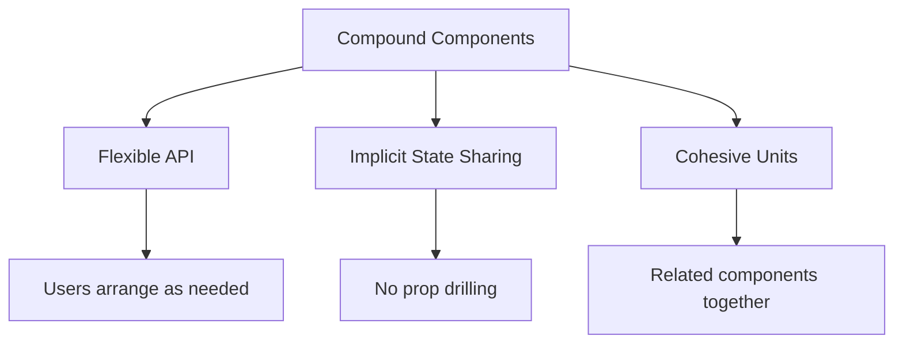

# Topic 29: Compound Components Pattern

[← Previous: Render Props](./28_render_props.md) | [Back to Main](../README.md) | [Next: Container/Presentational →](./30_container_presentational.md)

---

## Table of Contents

1. [Overview](#overview)
2. [What are Compound Components?](#what-are-compound-components)
3. [Creating Compound Components](#creating-compound-components)
4. [Context-Based Communication](#context-based-communication)
5. [Flexible APIs](#flexible-apis)
6. [TypeScript Compound Components](#typescript-compound-components)
7. [Real-World Examples](#real-world-examples)
8. [Best Practices](#best-practices)
9. [Common Patterns](#common-patterns)
10. [Compound vs Other Patterns](#compound-vs-other-patterns)

---

## Overview

**Compound Components** are components that work together to form a complete UI, sharing implicit state through Context. They provide a flexible yet cohesive API, similar to HTML's `<select>` and `<option>` relationship.

**What You'll Learn:**
- What compound components are
- How to create compound components with Context
- Building flexible component APIs
- TypeScript patterns
- Real-world examples (Tabs, Accordion, Dropdown)
- When to use compound components

**Prerequisites:**
- useContext Hook
- Component composition
- TypeScript basics

**Version Coverage:**
- React 16.3+ (Context API)
- React 19.2

---

## What are Compound Components?

### Core Concept

Compound components are **a set of components that work together**, sharing state implicitly through Context.

```tsx
// Example: Native HTML compound components
<select>
  <option value="1">Option 1</option>
  <option value="2">Option 2</option>
</select>

// React compound components (similar pattern)
<Tabs>
  <Tabs.List>
    <Tabs.Tab>Tab 1</Tabs.Tab>
    <Tabs.Tab>Tab 2</Tabs.Tab>
  </Tabs.List>
  <Tabs.Panel>Panel 1</Tabs.Panel>
  <Tabs.Panel>Panel 2</Tabs.Panel>
</Tabs>
```

### Why Compound Components?



**Benefits:**
- ✅ Flexible component arrangement
- ✅ Clean API (no prop drilling)
- ✅ Implicit state management
- ✅ Related components grouped
- ✅ Intuitive usage

---

## Creating Compound Components

### Basic Pattern

```tsx
// 1. Create Context
const TabsContext = createContext<{
  activeIndex: number;
  setActiveIndex: (index: number) => void;
} | null>(null);

// 2. Parent component (provides context)
function Tabs({ children, defaultIndex = 0 }) {
  const [activeIndex, setActiveIndex] = useState(defaultIndex);
  
  return (
    <TabsContext.Provider value={{ activeIndex, setActiveIndex }}>
      <div className="tabs">{children}</div>
    </TabsContext.Provider>
  );
}

// 3. Child components (consume context)
function TabList({ children }) {
  return <div className="tab-list" role="tablist">{children}</div>;
}

function Tab({ children, index }) {
  const context = useContext(TabsContext);
  if (!context) throw new Error('Tab must be used within Tabs');
  
  const { activeIndex, setActiveIndex } = context;
  const isActive = activeIndex === index;
  
  return (
    <button
      role="tab"
      aria-selected={isActive}
      className={isActive ? 'tab-active' : 'tab'}
      onClick={() => setActiveIndex(index)}
    >
      {children}
    </button>
  );
}

function TabPanel({ children, index }) {
  const context = useContext(TabsContext);
  if (!context) throw new Error('TabPanel must be used within Tabs');
  
  if (context.activeIndex !== index) return null;
  
  return (
    <div role="tabpanel" className="tab-panel">
      {children}
    </div>
  );
}

// 4. Attach child components to parent
Tabs.List = TabList;
Tabs.Tab = Tab;
Tabs.Panel = TabPanel;

// 5. Usage
<Tabs defaultIndex={0}>
  <Tabs.List>
    <Tabs.Tab index={0}>Profile</Tabs.Tab>
    <Tabs.Tab index={1}>Settings</Tabs.Tab>
  </Tabs.List>
  
  <Tabs.Panel index={0}>
    <ProfileContent />
  </Tabs.Panel>
  
  <Tabs.Panel index={1}>
    <SettingsContent />
  </Tabs.Panel>
</Tabs>
```

---

## Context-Based Communication

### Shared State

```tsx
// Accordion with shared state
const AccordionContext = createContext<{
  openIds: Set<string>;
  toggle: (id: string) => void;
} | null>(null);

function Accordion({ children, allowMultiple = false }) {
  const [openIds, setOpenIds] = useState<Set<string>>(new Set());
  
  const toggle = (id: string) => {
    setOpenIds(prev => {
      const next = new Set(prev);
      
      if (next.has(id)) {
        next.delete(id);
      } else {
        if (!allowMultiple) next.clear();
        next.add(id);
      }
      
      return next;
    });
  };
  
  return (
    <AccordionContext.Provider value={{ openIds, toggle }}>
      <div className="accordion">{children}</div>
    </AccordionContext.Provider>
  );
}

function AccordionItem({ id, title, children }) {
  const context = useContext(AccordionContext);
  if (!context) throw new Error('Must be within Accordion');
  
  const { openIds, toggle } = context;
  const isOpen = openIds.has(id);
  
  return (
    <div className="accordion-item">
      <button onClick={() => toggle(id)}>
        {title} {isOpen ? '−' : '+'}
      </button>
      {isOpen && <div className="accordion-content">{children}</div>}
    </div>
  );
}

Accordion.Item = AccordionItem;

// Usage
<Accordion allowMultiple>
  <Accordion.Item id="1" title="Section 1">Content 1</Accordion.Item>
  <Accordion.Item id="2" title="Section 2">Content 2</Accordion.Item>
</Accordion>
```

---

## Flexible APIs

### Automatic Index Management

```tsx
// Tabs without manual indices
const TabsContext = createContext(null);

function Tabs({ children }) {
  const [activeIndex, setActiveIndex] = useState(0);
  const [tabCount, setTabCount] = useState(0);
  
  return (
    <TabsContext.Provider value={{ 
      activeIndex, 
      setActiveIndex,
      registerTab: () => {
        const index = tabCount;
        setTabCount(c => c + 1);
        return index;
      }
    }}>
      {children}
    </TabsContext.Provider>
  );
}

function Tab({ children }) {
  const context = useContext(TabsContext);
  const [index] = useState(() => context.registerTab());  // Auto-assign index
  
  const isActive = context.activeIndex === index;
  
  return (
    <button 
      onClick={() => context.setActiveIndex(index)}
      className={isActive ? 'active' : ''}
    >
      {children}
    </button>
  );
}

// Usage: No manual indices!
<Tabs>
  <Tab>Profile</Tab>
  <Tab>Settings</Tab>
  <Tab>Notifications</Tab>
</Tabs>
```

---

## TypeScript Compound Components

### Fully Typed

```tsx
// Context type
interface TabsContextValue {
  activeIndex: number;
  setActiveIndex: (index: number) => void;
}

const TabsContext = createContext<TabsContextValue | null>(null);

// Hook with type guard
function useTabsContext() {
  const context = useContext(TabsContext);
  if (!context) {
    throw new Error('Tabs compound components must be used within <Tabs>');
  }
  return context;
}

// Parent component
interface TabsProps {
  children: React.ReactNode;
  defaultIndex?: number;
  onChange?: (index: number) => void;
}

function Tabs({ children, defaultIndex = 0, onChange }: TabsProps) {
  const [activeIndex, setActiveIndex] = useState(defaultIndex);
  
  const handleChange = (index: number) => {
    setActiveIndex(index);
    onChange?.(index);
  };
  
  const value: TabsContextValue = {
    activeIndex,
    setActiveIndex: handleChange
  };
  
  return (
    <TabsContext.Provider value={value}>
      <div className="tabs">{children}</div>
    </TabsContext.Provider>
  );
}

// Child components
interface TabProps {
  children: React.ReactNode;
  index: number;
  disabled?: boolean;
}

function Tab({ children, index, disabled = false }: TabProps) {
  const { activeIndex, setActiveIndex } = useTabsContext();
  const isActive = activeIndex === index;
  
  return (
    <button
      disabled={disabled}
      className={isActive ? 'tab-active' : 'tab'}
      onClick={() => setActiveIndex(index)}
    >
      {children}
    </button>
  );
}

// Attach to parent
Tabs.Tab = Tab;
```

---

## Real-World Examples

### Menu Component

```tsx
const MenuContext = createContext(null);

function Menu({ children }) {
  const [isOpen, setIsOpen] = useState(false);
  const [selectedId, setSelectedId] = useState(null);
  
  return (
    <MenuContext.Provider value={{ 
      isOpen, 
      setIsOpen,
      selectedId,
      setSelectedId 
    }}>
      <div className="menu">{children}</div>
    </MenuContext.Provider>
  );
}

function MenuButton({ children }) {
  const { isOpen, setIsOpen } = useContext(MenuContext);
  
  return (
    <button onClick={() => setIsOpen(!isOpen)}>
      {children}
    </button>
  );
}

function MenuList({ children }) {
  const { isOpen } = useContext(MenuContext);
  
  if (!isOpen) return null;
  
  return <ul className="menu-list">{children}</ul>;
}

function MenuItem({ id, children }) {
  const { selectedId, setSelectedId, setIsOpen } = useContext(MenuContext);
  const isSelected = selectedId === id;
  
  return (
    <li
      className={isSelected ? 'selected' : ''}
      onClick={() => {
        setSelectedId(id);
        setIsOpen(false);
      }}
    >
      {children}
    </li>
  );
}

Menu.Button = MenuButton;
Menu.List = MenuList;
Menu.Item = MenuItem;

// Usage
<Menu>
  <Menu.Button>Actions ▼</Menu.Button>
  <Menu.List>
    <Menu.Item id="edit">Edit</Menu.Item>
    <Menu.Item id="delete">Delete</Menu.Item>
    <Menu.Item id="share">Share</Menu.Item>
  </Menu.List>
</Menu>
```

---

## Best Practices

### 1. Validate Context Usage

```tsx
// ✅ Always validate context
function Tab() {
  const context = useContext(TabsContext);
  
  if (!context) {
    throw new Error('Tab must be used within Tabs');
  }
  
  // Use context safely
}
```

### 2. Provide Display Names

```tsx
// ✅ Set display names for debugging
Tabs.displayName = 'Tabs';
Tabs.List.displayName = 'Tabs.List';
Tabs.Tab.displayName = 'Tabs.Tab';
Tabs.Panel.displayName = 'Tabs.Panel';
```

### 3. Export Compound Pattern Clearly

```tsx
// ✅ Clear exports
function Tabs(props) { /* ... */ }
Tabs.List = TabList;
Tabs.Tab = Tab;
Tabs.Panel = TabPanel;

export { Tabs };

// Usage
import { Tabs } from './Tabs';

<Tabs>
  <Tabs.Tab />
</Tabs>
```

---

## Higher-Order Thinking FAQs

### 1. Why do compound components use Context instead of cloning children with React.cloneElement, and what are the tradeoffs?

**Deep Answer:**

Context and cloneElement are **two approaches** to share state in compound components, each with distinct tradeoffs.

**cloneElement Approach (Old Pattern):**

```tsx
// ❌ Old pattern: Clone children
function Tabs({ children }) {
  const [activeIndex, setActiveIndex] = useState(0);
  
  return (
    <div>
      {React.Children.map(children, (child, index) => {
        if (React.isValidElement(child)) {
          return React.cloneElement(child, {
            isActive: index === activeIndex,
            onClick: () => setActiveIndex(index)
          });
        }
        return child;
      })}
    </div>
  );
}

// Problems:
// - Only works with direct children
// - Can't have wrapper components
// - Props passed implicitly (hard to type)
// - Fragile structure
```

**Context Approach (Modern):**

```tsx
// ✅ Modern: Use Context
const TabsContext = createContext(null);

function Tabs({ children }) {
  const [activeIndex, setActiveIndex] = useState(0);
  
  return (
    <TabsContext.Provider value={{ activeIndex, setActiveIndex }}>
      {children}
    </TabsContext.Provider>
  );
}

function Tab({ index }) {
  const { activeIndex, setActiveIndex } = useContext(TabsContext);
  // Works at any nesting level!
}

// Flexible structure:
<Tabs>
  <div className="wrapper">  {/* Wrapper OK! */}
    <Tab index={0} />
  </div>
  <Tab index={1} />
</Tabs>
```

**Trade-off Analysis:**

| Aspect | cloneElement | Context |
|--------|-------------|---------|
| **Nesting** | Direct children only | Any depth |
| **Flexibility** | Rigid structure | Flexible structure |
| **TypeScript** | Hard to type | Easy to type |
| **Performance** | Clone overhead | Context overhead |
| **Debugging** | Implicit props | Explicit context |

**Deep Implication:**

The shift from cloneElement to Context mirrors React's evolution: from **implicit magic** (cloning, injecting props) to **explicit contracts** (Context, typed APIs). Context is more verbose but more predictable. React chose predictability over brevity.

### 2. How do compound components compare to prop-based APIs, and when is the complexity worth it?

**Deep Answer:**

Compound components trade **API simplicity** for **usage flexibility**. Worth it for complex, configurable UIs.

**Prop-Based API (Simple):**

```tsx
// ✅ Simple for straightforward use cases
<Tabs 
  tabs={['Profile', 'Settings', 'Notifications']}
  panels={[<Profile />, <Settings />, <Notifications />]}
  defaultIndex={0}
/>

// Easy to use, but:
// - Fixed structure
// - Can't customize tab rendering
// - Hard to add features (icons, badges, etc.)
```

**Compound Components (Flexible):**

```tsx
// ✅ Flexible for complex use cases
<Tabs>
  <Tabs.List>
    <Tabs.Tab index={0}>
      <Icon name="user" />
      Profile
      {unreadCount > 0 && <Badge>{unreadCount}</Badge>}
    </Tabs.Tab>
    <Tabs.Tab index={1} disabled={!isPremium}>
      <Icon name="settings" />
      Settings
      {isPremium && <PremiumBadge />}
    </Tabs.Tab>
  </Tabs.List>
  
  <Tabs.Panel index={0}><Profile /></Tabs.Panel>
  <Tabs.Panel index={1}><Settings /></Tabs.Panel>
</Tabs>

// More code, but fully customizable
```

**When Complexity is Worth It:**

```tsx
// ✅ Use compound components when:
// 1. Multiple ways to arrange components
<Dialog>
  <Dialog.Title />
  <Dialog.Content />
  <Dialog.Actions />
</Dialog>

// vs
<Dialog>
  <Dialog.Content />  // Content first
  <Dialog.Title />    // Title second
  <Dialog.Actions />
</Dialog>

// 2. Rich customization needed
<Table>
  <Table.Header>
    <Table.Column sort="asc" />
    <Table.Column filter={<CustomFilter />} />
  </Table.Header>
</Table>

// 3. Component relationships complex
<Form>
  <Form.Field>
    <Form.Label />
    <Form.Input />
    <Form.Error />
  </Form.Field>
</Form>
```

**Decision Framework:**

```tsx
// Use prop-based API when:
// - Simple, fixed structure
// - Few customization needs
// - Users want simplicity

// Use compound components when:
// - Flexible arrangement needed
// - Rich customization required
// - Component relationships complex
```

**Deep Implication:**

Compound components are **framework APIs** (like MUI, Chakra UI) vs **application components**. If building a library for others, compound components provide power. If building app components for your team, simple props are often enough. Choose based on audience and flexibility needs.

---

## Senior SDE Interview Questions

### Question 1: Compound Component Architecture

**Question:** "Design a Form component system using compound components that handles validation, field state, and submission. What components would you create and how would they communicate?"

**Key Concepts Being Tested:**
- Compound component design
- State management architecture
- API design
- Real-world complexity handling

**Expected Answer Should Cover:**

1. **Component Structure:**
```tsx
<Form onSubmit={handleSubmit}>
  <Form.Field name="email">
    <Form.Label>Email</Form.Label>
    <Form.Input type="email" />
    <Form.Error />
  </Form.Field>
  
  <Form.Field name="password">
    <Form.Label>Password</Form.Label>
    <Form.Input type="password" />
    <Form.Error />
  </Form.Field>
  
  <Form.SubmitButton>Submit</Form.SubmitButton>
</Form>
```

2. **Context Structure:**
```tsx
// Form context
interface FormContextValue {
  values: Record<string, any>;
  errors: Record<string, string>;
  touched: Record<string, boolean>;
  setFieldValue: (name: string, value: any) => void;
  setFieldTouched: (name: string) => void;
}

// Field context (nested)
interface FieldContextValue {
  name: string;
  value: any;
  error?: string;
  touched: boolean;
}
```

3. **Benefits:**
- Flexible field arrangement
- Automatic state management
- Type-safe with TypeScript
- Reusable field components

**Follow-ups:**
1. "How do you handle async validation?"
2. "What about field arrays (dynamic fields)?"
3. "How do you optimize re-renders?"

**Red Flags:**
- Single monolithic form component
- No separation of concerns
- Missing validation strategy

**Green Flags:**
- Compound component structure
- Multiple context levels
- Considers validation and state
- Thinks about performance

---

[← Previous: Render Props](./28_render_props.md) | [Back to Main](../README.md) | [Next: Container/Presentational →](./30_container_presentational.md)

---

**Progress**: Topic 29/220 completed | Part III: Advanced Patterns (40% complete)
