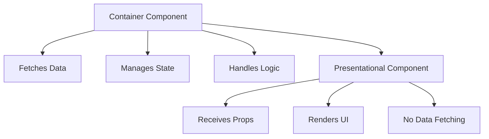

# Topic 30: Container and Presentational Components

[← Previous: Compound Components](./29_compound_components.md) | [Back to Main](../README.md) | [Next: Controlled/Uncontrolled →](./31_controlled_uncontrolled.md)

---

## Table of Contents

1. [Overview](#overview)
2. [Pattern Definition](#pattern-definition)
3. [Container Components](#container-components)
4. [Presentational Components](#presentational-components)
5. [Benefits and Drawbacks](#benefits-and-drawbacks)
6. [Modern Alternative with Hooks](#modern-alternative-with-hooks)
7. [When to Use This Pattern](#when-to-use-this-pattern)
8. [TypeScript Examples](#typescript-examples)
9. [Migration Strategies](#migration-strategies)
10. [Best Practices](#best-practices)

---

## Overview

The **Container/Presentational** pattern (also called Smart/Dumb components) separates data-fetching logic (containers) from UI rendering (presentational). While popular before Hooks, this pattern is now less emphasized but still useful for organizing code.

**What You'll Learn:**
- What container and presentational components are
- Benefits and drawbacks of this pattern
- How Hooks changed this pattern
- When the pattern is still relevant
- Migration strategies to modern patterns

**Prerequisites:**
- React components and props
- State management basics
- Custom Hooks understanding

**Version Coverage:**
- React 16+ (Pattern established)
- React 16.8+ (Hooks provide alternative)
- React 19.2

---

## Pattern Definition

### Container Components (Smart)

**Characteristics:**
- Manage state and logic
- Handle data fetching
- Connect to Redux/context
- Pass data to presentational components
- Often use Hooks or class lifecycle

```tsx
// Container component
function UserProfileContainer({ userId }) {
  const [user, setUser] = useState(null);
  const [loading, setLoading] = useState(true);
  
  useEffect(() => {
    fetchUser(userId)
      .then(setUser)
      .finally(() => setLoading(false));
  }, [userId]);
  
  if (loading) return <Loading />;
  
  // Passes data to presentational component
  return <UserProfile user={user} />;
}
```

### Presentational Components (Dumb)

**Characteristics:**
- Only concerned with how things look
- Receive data via props
- No state management (except UI state)
- Highly reusable
- Easy to test

```tsx
// Presentational component
function UserProfile({ user }) {
  return (
    <div className="user-profile">
      
      <h2>{user.name}</h2>
      <p>{user.email}</p>
      <p>{user.bio}</p>
    </div>
  );
}
```

### Pattern Visualization



---

## Container Components

### Data Fetching Container

```tsx
// Container: Handles all data logic
function BlogPostContainer({ postId }) {
  const [post, setPost] = useState(null);
  const [comments, setComments] = useState([]);
  const [loading, setLoading] = useState(true);
  const [error, setError] = useState(null);
  
  useEffect(() => {
    Promise.all([
      fetchPost(postId),
      fetchComments(postId)
    ])
      .then(([postData, commentsData]) => {
        setPost(postData);
        setComments(commentsData);
        setLoading(false);
      })
      .catch(err => {
        setError(err);
        setLoading(false);
      });
  }, [postId]);
  
  if (loading) return <LoadingSpinner />;
  if (error) return <ErrorMessage error={error} />;
  
  return (
    <BlogPost 
      post={post}
      comments={comments}
    />
  );
}
```

### State Management Container

```tsx
// Container: Manages complex state
function TodoListContainer() {
  const [todos, setTodos] = useState([]);
  const [filter, setFilter] = useState('all');
  
  const addTodo = (text) => {
    setTodos([...todos, { id: Date.now(), text, completed: false }]);
  };
  
  const toggleTodo = (id) => {
    setTodos(todos.map(todo =>
      todo.id === id ? { ...todo, completed: !todo.completed } : todo
    ));
  };
  
  const deleteTodo = (id) => {
    setTodos(todos.filter(todo => todo.id !== id));
  };
  
  const filteredTodos = todos.filter(todo => {
    if (filter === 'active') return !todo.completed;
    if (filter === 'completed') return todo.completed;
    return true;
  });
  
  return (
    <TodoList
      todos={filteredTodos}
      filter={filter}
      onAddTodo={addTodo}
      onToggleTodo={toggleTodo}
      onDeleteTodo={deleteTodo}
      onFilterChange={setFilter}
    />
  );
}
```

---

## Presentational Components

### Pure UI Components

```tsx
// Presentational: Pure UI rendering
interface BlogPostProps {
  post: {
    title: string;
    content: string;
    author: string;
    date: Date;
  };
  comments: Array<{
    id: number;
    author: string;
    text: string;
  }>;
}

function BlogPost({ post, comments }: BlogPostProps) {
  return (
    <article className="blog-post">
      <header>
        <h1>{post.title}</h1>
        <p className="meta">
          By {post.author} on {post.date.toLocaleDateString()}
        </p>
      </header>
      
      <div className="content">
        {post.content}
      </div>
      
      <section className="comments">
        <h2>Comments ({comments.length})</h2>
        {comments.map(comment => (
          <Comment key={comment.id} comment={comment} />
        ))}
      </section>
    </article>
  );
}

// Even more presentational
function Comment({ comment }) {
  return (
    <div className="comment">
      <strong>{comment.author}:</strong> {comment.text}
    </div>
  );
}
```

---

## Benefits and Drawbacks

### Benefits

```tsx
// ✅ 1. Separation of Concerns
// Container: Logic
function UserListContainer() {
  const users = useFetchUsers();
  return <UserList users={users} />;
}

// Presentational: UI
function UserList({ users }) {
  return <ul>{users.map(u => <li key={u.id}>{u.name}</li>)}</ul>;
}

// ✅ 2. Reusability
// Same presentational component, different containers
<UserList users={allUsers} />
<UserList users={filteredUsers} />
<UserList users={searchResults} />

// ✅ 3. Easy Testing
// Test presentational with mock data
<UserList users={mockUsers} />  // No API calls needed
```

### Drawbacks

```tsx
// ❌ 1. Boilerplate
// Need two components for one feature

// ❌ 2. Artificial Separation
// Sometimes logic and UI naturally belong together

// ❌ 3. Props Passing
// Container must pass many props to presentational
```

---

## Modern Alternative with Hooks

### Before: Container/Presentational

```tsx
// Old pattern
function UserProfileContainer({ userId }) {
  const [user, setUser] = useState(null);
  
  useEffect(() => {
    fetchUser(userId).then(setUser);
  }, [userId]);
  
  return <UserProfile user={user} />;
}

function UserProfile({ user }) {
  return <div>{user?.name}</div>;
}
```

### After: Custom Hooks

```tsx
// Modern: Custom Hook + Component
function useUser(userId) {
  const [user, setUser] = useState(null);
  
  useEffect(() => {
    fetchUser(userId).then(setUser);
  }, [userId]);
  
  return user;
}

function UserProfile({ userId }) {
  const user = useUser(userId);  // Logic inside component
  
  return <div>{user?.name}</div>;
}

// No separate container needed!
```

### Hooks Simplify the Pattern

```tsx
// Extract only the logic, not the whole component
function useTodos() {
  const [todos, setTodos] = useState([]);
  
  const addTodo = (text) => {
    setTodos([...todos, { id: Date.now(), text, completed: false }]);
  };
  
  const toggleTodo = (id) => {
    setTodos(todos.map(todo =>
      todo.id === id ? { ...todo, completed: !todo.completed } : todo
    ));
  };
  
  return { todos, addTodo, toggleTodo };
}

// Component is self-contained
function TodoList() {
  const { todos, addTodo, toggleTodo } = useTodos();
  
  return (
    <div>
      {todos.map(todo => (
        <TodoItem 
          key={todo.id}
          todo={todo}
          onToggle={() => toggleTodo(todo.id)}
        />
      ))}
    </div>
  );
}
```

---

## When to Use This Pattern

### Still Useful

```tsx
// ✅ 1. Clear separation of concerns in large components
function DashboardContainer() {
  // 50 lines of data fetching, state management
  const data = useComplexDataFetching();
  
  // Pass clean props to UI
  return <Dashboard data={data} />;
}

function Dashboard({ data }) {
  // 200 lines of pure UI rendering
  return <div>/* Complex UI */</div>;
}

// ✅ 2. Multiple data sources for same UI
function UserListFromAPI() {
  const users = useFetchUsers();
  return <UserList users={users} />;
}

function UserListFromLocalStorage() {
  const users = useLocalStorageUsers();
  return <UserList users={users} />;
}

// Same UserList component, different data sources

// ✅ 3. Storybook/Component Library
// Presentational components perfect for Storybook
export function Button({ variant, children }) {
  return <button className={variant}>{children}</button>;
}

// Easy to document and test all variants
```

### Not Necessary

```tsx
// ❌ Overkill for simple components
function CounterContainer() {
  const [count, setCount] = useState(0);
  return <Counter count={count} onIncrement={() => setCount(count + 1)} />;
}

function Counter({ count, onIncrement }) {
  return <button onClick={onIncrement}>Count: {count}</button>;
}

// ✅ Just combine them
function Counter() {
  const [count, setCount] = useState(0);
  return <button onClick={() => setCount(count + 1)}>Count: {count}</button>;
}
```

---

## TypeScript Examples

### Typed Pattern

```tsx
// Presentational component with strict types
interface UserCardProps {
  user: {
    id: number;
    name: string;
    email: string;
    avatar: string;
  };
  onEdit?: (userId: number) => void;
  onDelete?: (userId: number) => void;
}

function UserCard({ user, onEdit, onDelete }: UserCardProps) {
  return (
    <div className="user-card">
      
      <h3>{user.name}</h3>
      <p>{user.email}</p>
      {onEdit && <button onClick={() => onEdit(user.id)}>Edit</button>}
      {onDelete && <button onClick={() => onDelete(user.id)}>Delete</button>}
    </div>
  );
}

// Container component
function UserCardContainer({ userId }: { userId: number }) {
  const user = useFetchUser(userId);
  const { editUser, deleteUser } = useUserActions();
  
  if (!user) return null;
  
  return (
    <UserCard
      user={user}
      onEdit={editUser}
      onDelete={deleteUser}
    />
  );
}
```

---

## Migration Strategies

### Gradual Migration

```tsx
// Step 1: Keep presentational as is
function UserProfile({ user }) {
  return <div>{user.name}</div>;
}

// Step 2: Replace container with Hook
function useUser(userId) {
  const [user, setUser] = useState(null);
  useEffect(() => {
    fetchUser(userId).then(setUser);
  }, [userId]);
  return user;
}

// Step 3: Decide: Keep separate or combine?

// Option A: Keep presentational separate (for reuse)
function UserProfileContainer({ userId }) {
  const user = useUser(userId);
  return <UserProfile user={user} />;
}

// Option B: Combine (simpler)
function UserProfile({ userId }) {
  const user = useUser(userId);
  return <div>{user?.name}</div>;
}
```

---

## Best Practices

### 1. Don't Force the Pattern

```tsx
// ❌ Forced separation (unnecessary)
function NameContainer() {
  return <Name name="Alice" />;
}

function Name({ name }) {
  return <span>{name}</span>;
}

// ✅ Just use one component
function Name() {
  return <span>Alice</span>;
}
```

### 2. Extract Logic to Hooks

```tsx
// ✅ Modern approach
function useUserData(userId) {
  // All logic here
  return userData;
}

function UserProfile({ userId }) {
  const user = useUserData(userId);
  // UI here
  return <div>{user?.name}</div>;
}
```

### 3. Keep Presentational Pure

```tsx
// ✅ Pure presentational
function ProductCard({ product, onAddToCart }) {
  return (
    <div>
      <h3>{product.name}</h3>
      <p>${product.price}</p>
      <button onClick={() => onAddToCart(product.id)}>
        Add to Cart
      </button>
    </div>
  );
}

// ❌ Impure (has side effects)
function ProductCard({ product }) {
  const addToCart = () => {
    fetch('/api/cart', { /* ... */ });  // Side effect!
  };
  
  return <div>/* ... */</div>;
}
```

---

## Higher-Order Thinking FAQs

### 1. Why did the Container/Presentational pattern become less emphasized after Hooks, and what problems did it actually solve?

**Deep Answer:**

The pattern solved **code organization** in the class component era but became less necessary when Hooks enabled **logic extraction** without component splitting.

**Pre-Hooks Problem:**

```tsx
// Class component mixed everything
class UserProfile extends Component {
  state = { user: null, loading: true };
  
  componentDidMount() {
    fetchUser(this.props.userId).then(user => {
      this.setState({ user, loading: false });
    });
  }
  
  render() {
    // Logic and UI mixed
    if (this.state.loading) return <Loading />;
    
    return (
      <div>
        <h1>{this.state.user.name}</h1>
        {/* 100 more lines of UI */}
      </div>
    );
  }
}

// Hard to:
// - Test UI separately
// - Reuse UI with different data
// - Share logic across components
```

**Container/Presentational Solution:**

```tsx
// Split into two
class UserProfileContainer extends Component {
  state = { user: null, loading: true };
  
  componentDidMount() {
    fetchUser(this.props.userId).then(user => {
      this.setState({ user, loading: false });
    });
  }
  
  render() {
    return <UserProfile user={this.state.user} loading={this.state.loading} />;
  }
}

function UserProfile({ user, loading }) {
  if (loading) return <Loading />;
  return <div><h1>{user.name}</h1></div>;
}

// Now can:
// - Test UserProfile with mock data
// - Reuse UserProfile with different containers
// - But: Still can't share logic between containers
```

**Hooks Solution:**

```tsx
// Extract logic to Hook
function useUser(userId) {
  const [user, setUser] = useState(null);
  const [loading, setLoading] = useState(true);
  
  useEffect(() => {
    fetchUser(userId).then(user => {
      setUser(user);
      setLoading(false);
    });
  }, [userId]);
  
  return { user, loading };
}

// Component can be simple
function UserProfile({ userId }) {
  const { user, loading } = useUser(userId);
  
  if (loading) return <Loading />;
  return <div><h1>{user.name}</h1></div>;
}

// Same benefits:
// - Logic extracted (reusable across components)
// - Can test UI separately (pass userId prop)
// - No forced component split
```

**Deep Implication:**

Container/Presentational was a **workaround** for class components' inability to extract logic. Hooks solved the root cause (logic extraction), making the pattern optional rather than necessary. The pattern isn't wrong - it's just no longer the only way to organize code.

### 2. When is it still beneficial to maintain the Container/Presentational separation with modern Hooks?

**Deep Answer:**

The pattern is still valuable when you need **strict separation** for testing, Storybook, or working with designers.

**Beneficial Scenarios:**

```tsx
// ✅ 1. Component Library / Design System
// Presentational components are your public API
export function Button({ variant, children, onClick }) {
  return (
    <button className={`btn-${variant}`} onClick={onClick}>
      {children}
    </button>
  );
}

// Containers are implementation details
function SaveButton() {
  const { save, saving } = useSave();
  return <Button variant="primary" onClick={save} disabled={saving}>Save</Button>;
}

// ✅ 2. Storybook Documentation
// Pure presentational components easy to document
export const ButtonStories = {
  Primary: <Button variant="primary">Click me</Button>,
  Secondary: <Button variant="secondary">Cancel</Button>,
  Disabled: <Button disabled>Disabled</Button>
};

// ✅ 3. Designer Handoff
// Designers work on presentational
// Developers work on containers
// Clear separation of responsibilities

// ✅ 4. Testing Strategy
// Unit test presentational with mock data (fast)
it('renders user name', () => {
  render(<UserProfile user={mockUser} />);
  expect(screen.getByText('Alice')).toBeInTheDocument();
});

// Integration test containers (slower)
it('fetches and displays user', async () => {
  render(<UserProfileContainer userId={1} />);
  await waitFor(() => {
    expect(screen.getByText('Alice')).toBeInTheDocument();
  });
});
```

**Not Beneficial:**

```tsx
// ❌ Artificial separation
function CounterContainer() {
  const [count, setCount] = useState(0);
  return <Counter count={count} onIncrement={() => setCount(count + 1)} />;
}

function Counter({ count, onIncrement }) {
  return <button onClick={onIncrement}>{count}</button>;
}

// Just use one component!
function Counter() {
  const [count, setCount] = useState(0);
  return <button onClick={() => setCount(count + 1)}>{count}</button>;
}
```

**Deep Implication:**

The pattern's value shifted from **mandatory organization** to **optional strategy** for specific use cases (testing, documentation, team coordination). Use it when it provides clear value, not because it's a "best practice" from the past.

---

## Senior SDE Interview Questions

### Question 1: Pattern Evolution

**Question:** "Explain how the Container/Presentational pattern evolved with Hooks, and provide an example where you'd still use this pattern in a modern React application."

**Key Concepts Being Tested:**
- Understanding of pattern history
- Knowledge of Hooks impact
- Practical decision-making
- Modern best practices

**Expected Answer Should Cover:**

1. **Historical Context:**
```tsx
// Pre-Hooks: Pattern was necessary
// - Class components couldn't extract logic
// - Only way to separate concerns
// - Made testing easier

// Post-Hooks: Pattern is optional
// - Hooks extract logic without component split
// - Custom Hooks replace containers
// - More flexible organization
```

2. **Modern Use Case:**
```tsx
// Still useful: Component library
// Presentational: Public API
export function DataTable({ columns, data, onSort }) {
  return (
    <table>
      <thead>
        {columns.map(col => (
          <th key={col.key} onClick={() => onSort(col.key)}>
            {col.title}
          </th>
        ))}
      </thead>
      <tbody>
        {data.map(row => (
          <tr key={row.id}>
            {columns.map(col => (
              <td key={col.key}>{row[col.key]}</td>
            ))}
          </tr>
        ))}
      </tbody>
    </table>
  );
}

// Container: Implementation detail
function ProductTable() {
  const { products, sortBy, handleSort } = useProductData();
  
  return (
    <DataTable
      columns={productColumns}
      data={products}
      onSort={handleSort}
    />
  );
}
```

3. **Benefits in This Context:**
- DataTable is reusable across app
- Easy to document in Storybook
- Designers can work on DataTable UI
- Developers implement data logic separately

**Follow-ups:**
1. "How do you decide when to combine vs separate?"
2. "What about partial separation (some logic in component)?"
3. "How does TypeScript affect this decision?"

**Red Flags:**
- Thinks pattern is obsolete
- Forces pattern everywhere
- Doesn't understand Hooks impact

**Green Flags:**
- Understands historical context
- Knows when pattern is still useful
- Mentions modern alternatives
- Pragmatic about when to use

---

[← Previous: Compound Components](./29_compound_components.md) | [Back to Main](../README.md) | [Next: Controlled/Uncontrolled →](./31_controlled_uncontrolled.md)

---

**Progress**: Topic 30/220 completed | Part III: Advanced Patterns (50% complete)
