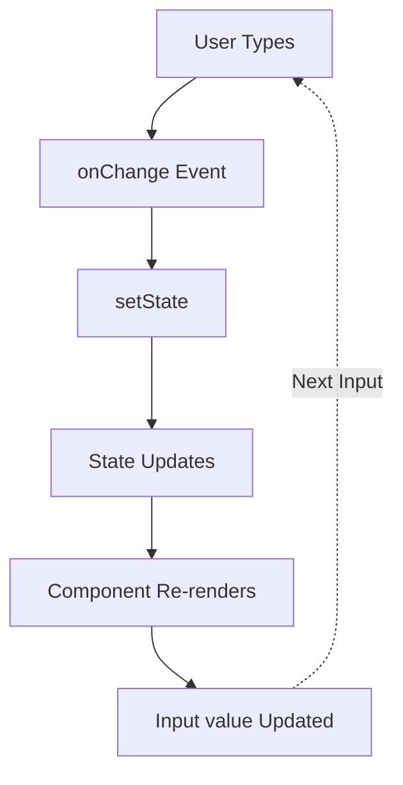

# Topic 31: Controlled vs Uncontrolled Components

[← Previous: Container/Presentational](./30_container_presentational.md) | [Back to Main](../README.md) | [Next: Error Boundaries →](./32_error_boundaries.md)

---

## Table of Contents

1. [Overview](#overview)
2. [Controlled Components](#controlled-components)
3. [Uncontrolled Components](#uncontrolled-components)
4. [Key Differences](#key-differences)
5. [When to Use Each](#when-to-use-each)
6. [Hybrid Approach](#hybrid-approach)
7. [File Inputs](#file-inputs)
8. [TypeScript Examples](#typescript-examples)
9. [Best Practices](#best-practices)
10. [Common Patterns](#common-patterns)

---

## Overview

**Controlled components** have their value controlled by React state, while **uncontrolled components** manage their own internal state using the DOM. Understanding the difference is crucial for form handling and component design.

**What You'll Learn:**
- What makes a component controlled or uncontrolled
- Tradeoffs between approaches
- When to use each pattern
- File inputs (must be uncontrolled)
- Hybrid approaches
- Best practices

**Prerequisites:**
- useState Hook
- useRef Hook
- Form handling basics

**Version Coverage:**
- React 16+ (All versions)
- React 19.2

---

## Controlled Components

### Definition

In a **controlled component**, React state is the "single source of truth" for the input's value.

```tsx
// Controlled input
function ControlledInput() {
  const [value, setValue] = useState('');
  
  return (
    <input
      value={value}  // Controlled by React state
      onChange={(e) => setValue(e.target.value)}  // Update state
    />
  );
}
```

### Data Flow



### Examples

```tsx
// Text input
function TextInput() {
  const [text, setText] = useState('');
  
  return (
    <input 
      value={text}
      onChange={(e) => setText(e.target.value)}
    />
  );
}

// Textarea
function TextArea() {
  const [message, setMessage] = useState('');
  
  return (
    <textarea
      value={message}
      onChange={(e) => setMessage(e.target.value)}
    />
  );
}

// Select
function Select() {
  const [selected, setSelected] = useState('option1');
  
  return (
    <select value={selected} onChange={(e) => setSelected(e.target.value)}>
      <option value="option1">Option 1</option>
      <option value="option2">Option 2</option>
    </select>
  );
}

// Checkbox
function Checkbox() {
  const [checked, setChecked] = useState(false);
  
  return (
    <input
      type="checkbox"
      checked={checked}
      onChange={(e) => setChecked(e.target.checked)}
    />
  );
}
```

### Benefits

```tsx
// ✅ 1. Validate on-the-fly
function EmailInput() {
  const [email, setEmail] = useState('');
  const isValid = /\S+@\S+\.\S+/.test(email);
  
  return (
    <>
      <input 
        value={email}
        onChange={(e) => setEmail(e.target.value)}
      />
      {!isValid && <span>Invalid email</span>}
    </>
  );
}

// ✅ 2. Transform input
function UpperCaseInput() {
  const [text, setText] = useState('');
  
  return (
    <input
      value={text}
      onChange={(e) => setText(e.target.value.toUpperCase())}
    />
  );
}

// ✅ 3. Conditional submit button
function Form() {
  const [password, setPassword] = useState('');
  const isValid = password.length >= 8;
  
  return (
    <>
      <input 
        type="password"
        value={password}
        onChange={(e) => setPassword(e.target.value)}
      />
      <button disabled={!isValid}>Submit</button>
    </>
  );
}
```

---

## Uncontrolled Components

### Definition

In an **uncontrolled component**, the DOM itself manages the value. You read it using refs when needed.

```tsx
// Uncontrolled input
function UncontrolledInput() {
  const inputRef = useRef<HTMLInputElement>(null);
  
  const handleSubmit = (e) => {
    e.preventDefault();
    console.log('Value:', inputRef.current?.value);
  };
  
  return (
    <form onSubmit={handleSubmit}>
      <input ref={inputRef} defaultValue="" />
      <button type="submit">Submit</button>
    </form>
  );
}
```

### Examples

```tsx
// Text input with ref
function UncontrolledForm() {
  const nameRef = useRef<HTMLInputElement>(null);
  const emailRef = useRef<HTMLInputElement>(null);
  
  const handleSubmit = (e: React.FormEvent) => {
    e.preventDefault();
    
    console.log('Name:', nameRef.current?.value);
    console.log('Email:', emailRef.current?.value);
  };
  
  return (
    <form onSubmit={handleSubmit}>
      <input ref={nameRef} defaultValue="" />
      <input ref={emailRef} type="email" defaultValue="" />
      <button type="submit">Submit</button>
    </form>
  );
}

// With default values
function FormWithDefaults() {
  const inputRef = useRef<HTMLInputElement>(null);
  
  return (
    <div>
      <input ref={inputRef} defaultValue="Initial value" />
      <button onClick={() => console.log(inputRef.current?.value)}>
        Log Value
      </button>
    </div>
  );
}
```

---

## Key Differences

### Comparison Table

| Aspect | Controlled | Uncontrolled |
|--------|------------|--------------|
| **State Management** | React state | DOM manages |
| **Value Prop** | `value={state}` | `defaultValue` |
| **Read Value** | From state | From ref |
| **Validation** | Real-time | On submit |
| **Transform Input** | Yes | No |
| **Re-renders** | On every change | None |
| **Complexity** | Higher | Lower |
| **Use Case** | Most forms | Simple forms |

### Side-by-Side

```tsx
// Controlled
function Controlled() {
  const [value, setValue] = useState('');
  
  return (
    <>
      <input 
        value={value}
        onChange={(e) => setValue(e.target.value)}
      />
      <p>Current: {value}</p>  {/* Can display state */}
    </>
  );
}

// Uncontrolled
function Uncontrolled() {
  const ref = useRef<HTMLInputElement>(null);
  
  return (
    <>
      <input ref={ref} defaultValue="" />
      <button onClick={() => console.log(ref.current?.value)}>
        Log Value
      </button>
    </>
  );
}
```

---

## When to Use Each

### Use Controlled When

```tsx
// ✅ Need real-time validation
function ValidatedInput() {
  const [value, setValue] = useState('');
  const error = validate(value);
  
  return (
    <>
      <input value={value} onChange={(e) => setValue(e.target.value)} />
      {error && <span>{error}</span>}
    </>
  );
}

// ✅ Need to transform input
function PhoneInput() {
  const [phone, setPhone] = useState('');
  
  const handleChange = (e) => {
    let value = e.target.value.replace(/\D/g, '');  // Remove non-digits
    value = value.slice(0, 10);  // Max 10 digits
    setPhone(value);
  };
  
  return <input value={phone} onChange={handleChange} />;
}

// ✅ Conditional submit
function Form() {
  const [email, setEmail] = useState('');
  const [password, setPassword] = useState('');
  const canSubmit = email && password.length >= 8;
  
  return (
    <>
      <input value={email} onChange={(e) => setEmail(e.target.value)} />
      <input value={password} onChange={(e) => setPassword(e.target.value)} />
      <button disabled={!canSubmit}>Submit</button>
    </>
  );
}
```

### Use Uncontrolled When

```tsx
// ✅ Simple form (no validation)
function SimpleForm() {
  const nameRef = useRef<HTMLInputElement>(null);
  
  return (
    <form onSubmit={(e) => {
      e.preventDefault();
      console.log(nameRef.current?.value);
    }}>
      <input ref={nameRef} />
      <button>Submit</button>
    </form>
  );
}

// ✅ File inputs (must be uncontrolled)
function FileUpload() {
  const fileRef = useRef<HTMLInputElement>(null);
  
  return (
    <input
      ref={fileRef}
      type="file"
      onChange={() => console.log(fileRef.current?.files)}
    />
  );
}

// ✅ Integration with non-React code
function LegacyIntegration() {
  const formRef = useRef<HTMLFormElement>(null);
  
  useEffect(() => {
    // jQuery or other library manipulates form
    $(formRef.current).somePlugin();
  }, []);
  
  return <form ref={formRef}>...</form>;
}
```

---

## Hybrid Approach

### Controlled with Uncontrolled Fallback

```tsx
// Component supports both patterns
interface InputProps {
  value?: string;  // Controlled
  defaultValue?: string;  // Uncontrolled
  onChange?: (value: string) => void;
}

function Input({ value: controlledValue, defaultValue, onChange }: InputProps) {
  const [uncontrolledValue, setUncontrolledValue] = useState(defaultValue || '');
  
  const isControlled = controlledValue !== undefined;
  const value = isControlled ? controlledValue : uncontrolledValue;
  
  const handleChange = (e: React.ChangeEvent<HTMLInputElement>) => {
    const newValue = e.target.value;
    
    if (!isControlled) {
      setUncontrolledValue(newValue);
    }
    
    onChange?.(newValue);
  };
  
  return <input value={value} onChange={handleChange} />;
}

// Uncontrolled usage
<Input defaultValue="initial" onChange={(v) => console.log(v)} />

// Controlled usage
function Parent() {
  const [value, setValue] = useState('');
  return <Input value={value} onChange={setValue} />;
}
```

---

## File Inputs

### Must Be Uncontrolled

```tsx
// File inputs MUST be uncontrolled (security)
function FileUpload() {
  const fileRef = useRef<HTMLInputElement>(null);
  const [preview, setPreview] = useState<string>('');
  
  const handleFileChange = (e: React.ChangeEvent<HTMLInputElement>) => {
    const file = e.target.files?.[0];
    
    if (file) {
      const reader = new FileReader();
      reader.onloadend = () => {
        setPreview(reader.result as string);
      };
      reader.readAsDataURL(file);
    }
  };
  
  const handleUpload = async () => {
    const file = fileRef.current?.files?.[0];
    if (!file) return;
    
    const formData = new FormData();
    formData.append('file', file);
    
    await fetch('/api/upload', {
      method: 'POST',
      body: formData
    });
  };
  
  return (
    <>
      <input 
        ref={fileRef}
        type="file"
        onChange={handleFileChange}
        accept="image/*"
      />
      
      {preview && }
      
      <button onClick={handleUpload}>Upload</button>
    </>
  );
}
```

---

## TypeScript Examples

### Typed Controlled

```tsx
interface ControlledInputProps {
  value: string;
  onChange: (value: string) => void;
  placeholder?: string;
  type?: string;
}

function ControlledInput({ 
  value, 
  onChange, 
  placeholder,
  type = 'text'
}: ControlledInputProps) {
  return (
    <input
      type={type}
      value={value}
      onChange={(e) => onChange(e.target.value)}
      placeholder={placeholder}
    />
  );
}
```

### Typed Uncontrolled

```tsx
interface UncontrolledInputProps {
  defaultValue?: string;
  onSubmit?: (value: string) => void;
  placeholder?: string;
}

function UncontrolledInput({ 
  defaultValue = '',
  onSubmit,
  placeholder
}: UncontrolledInputProps) {
  const inputRef = useRef<HTMLInputElement>(null);
  
  const handleSubmit = () => {
    const value = inputRef.current?.value || '';
    onSubmit?.(value);
  };
  
  return (
    <>
      <input ref={inputRef} defaultValue={defaultValue} placeholder={placeholder} />
      <button onClick={handleSubmit}>Submit</button>
    </>
  );
}
```

---

## Best Practices

### 1. Default to Controlled

```tsx
// ✅ Controlled is the React way
function Form() {
  const [email, setEmail] = useState('');
  
  return (
    <input 
      value={email}
      onChange={(e) => setEmail(e.target.value)}
    />
  );
}
```

### 2. Use Uncontrolled for Simple Cases

```tsx
// ✅ Uncontrolled for simple forms
function QuickSearch() {
  const searchRef = useRef<HTMLInputElement>(null);
  
  const handleSearch = () => {
    const query = searchRef.current?.value;
    if (query) search(query);
  };
  
  return (
    <>
      <input ref={searchRef} placeholder="Search..." />
      <button onClick={handleSearch}>Go</button>
    </>
  );
}
```

### 3. Don't Mix Controlled and Uncontrolled

```tsx
// ❌ Don't switch between controlled/uncontrolled
function BadInput() {
  const [value, setValue] = useState('');
  
  return (
    <input
      value={someCondition ? value : undefined}  // Sometimes controlled, sometimes not
      onChange={(e) => setValue(e.target.value)}
    />
  );
}

// React warning: Component is changing from uncontrolled to controlled
```

---

## Common Patterns

### Form with Mixed Inputs

```tsx
function MixedForm() {
  // Controlled: Important fields
  const [email, setEmail] = useState('');
  const [password, setPassword] = useState('');
  
  // Uncontrolled: Less important
  const commentsRef = useRef<HTMLTextAreaElement>(null);
  
  const handleSubmit = (e: React.FormEvent) => {
    e.preventDefault();
    
    const formData = {
      email,
      password,
      comments: commentsRef.current?.value || ''
    };
    
    submitForm(formData);
  };
  
  return (
    <form onSubmit={handleSubmit}>
      <input 
        type="email"
        value={email}
        onChange={(e) => setEmail(e.target.value)}
        required
      />
      
      <input 
        type="password"
        value={password}
        onChange={(e) => setPassword(e.target.value)}
        required
      />
      
      <textarea ref={commentsRef} placeholder="Optional comments" />
      
      <button type="submit">Submit</button>
    </form>
  );
}
```

---

## Higher-Order Thinking FAQs

### 1. Why are controlled components the recommended approach, and what are the actual costs of using them?

**Deep Answer:**

Controlled components provide **predictability and control** at the cost of **re-renders and complexity**.

**The Re-render Cost:**

```tsx
// Controlled: Re-renders on every keystroke
function Controlled() {
  const [value, setValue] = useState('');
  console.log('Render');  // Logs on every keystroke
  
  return (
    <input 
      value={value}
      onChange={(e) => setValue(e.target.value)}
    />
  );
}

// Uncontrolled: No re-renders while typing
function Uncontrolled() {
  const ref = useRef<HTMLInputElement>(null);
  console.log('Render');  // Only logs once on mount
  
  return <input ref={ref} />;
}

// Performance difference:
// - Typing 10 characters
// - Controlled: 11 renders (mount + 10 keystrokes)
// - Uncontrolled: 1 render (just mount)
```

**When Controlled Cost Matters:**

```tsx
// Large form with many fields
function LargeForm() {
  const [formData, setFormData] = useState({
    field1: '', field2: '', /* ... field100: '' */
  });
  
  // Typing in field1 causes:
  // - setState for entire formData
  // - Re-render of entire form
  // - All 100 inputs re-render
  
  // If inputs are expensive, this hurts performance
}

// Solutions:
// 1. Separate state per field
const [field1, setField1] = useState('');
const [field2, setField2] = useState('');

// 2. Use uncontrolled for non-critical fields
// 3. Use form library (React Hook Form uses uncontrolled internally)
```

**Why Still Recommended:**

```tsx
// Benefits outweigh costs for most apps
// - Modern devices handle re-renders fine
// - React is optimized for this pattern
// - Benefits (validation, transform) are valuable
// - Only matters for huge forms or slow devices
```

**Deep Implication:**

Controlled components align with React's **declarative philosophy** - describe what UI should be based on state. The cost is re-renders, but modern React and hardware make this negligible for most apps. Only optimize (uncontrolled) when profiling shows actual issues.

### 2. Can a component be partially controlled, and what happens if you provide value but not onChange?

**Deep Answer:**

Partially controlled components create **inconsistent behavior** and React warnings.

**value Without onChange:**

```tsx
// ❌ Read-only input (not useful)
function ReadOnly() {
  const [text] = useState('Hello');
  
  return <input value={text} />;
  // No onChange!
  // User can type, but value doesn't change
  // React warning: "You provided a `value` prop without an `onChange` handler"
}

// When is this useful?
// Disabled inputs (explicitly read-only)
<input value={text} disabled />  // OK, clearly read-only
```

**onChange Without value:**

```tsx
// ❌ Uncontrolled with onChange (weird)
function Weird() {
  const [text, setText] = useState('');
  
  return (
    <input onChange={(e) => setText(e.target.value)} />
    // No value prop!
    // Input is uncontrolled (DOM manages value)
    // onChange is called, but doesn't affect input
    // Can track value in state, but input ignores it
  );
}
```

**Switching Between Controlled/Uncontrolled:**

```tsx
// ❌ Don't switch
function Buggy() {
  const [value, setValue] = useState(null);
  
  return (
    <input
      value={value || ''}  // Sometimes controlled (value=''), sometimes not (value=undefined)
      onChange={(e) => setValue(e.target.value)}
    />
  );
}

// React error: "A component is changing an uncontrolled input to be controlled"

// ✅ Always provide value
function Fixed() {
  const [value, setValue] = useState('');  // Never null/undefined
  
  return (
    <input
      value={value}  // Always string
      onChange={(e) => setValue(e.target.value)}
    />
  );
}
```

**Deep Implication:**

React's controlled component API is **all-or-nothing** by design. You must provide both `value` and `onChange` to opt into the controlled contract. Partial implementation breaks the contract and causes bugs. This strictness prevents subtle state synchronization issues.

---

## Senior SDE Interview Questions

### Question 1: Form Library Architecture

**Question:** "React Hook Form uses uncontrolled inputs internally for performance. Formik uses controlled inputs. Explain the tradeoffs and when you'd choose each approach for a form library."

**Key Concepts Being Tested:**
- Deep understanding of controlled/uncontrolled
- Performance implications
- Library design decisions
- Real-world tradeoffs

**Expected Answer Should Cover:**

1. **React Hook Form (Uncontrolled):**
```tsx
// Registers inputs without state
const { register } = useForm();

<input {...register('email')} />

// Benefits:
// - No re-renders while typing
// - Better performance for large forms
// - Less React overhead

// Drawbacks:
// - Can't easily read values in real-time
// - Validation is deferred
// - Less "React way"
```

2. **Formik (Controlled):**
```tsx
// Controlled inputs with state
const { values, handleChange } = useFormik({...});

<input value={values.email} onChange={handleChange} />

// Benefits:
// - React-idiomatic
// - Real-time validation
// - Easy to read values

// Drawbacks:
// - Re-renders on every keystroke
// - Performance cost for large forms
```

3. **Decision Factors:**
- Form size: >20 fields → Consider uncontrolled
- Validation needs: Real-time → Controlled
- Performance requirements: Critical → Uncontrolled
- Team familiarity: React devs prefer controlled

**Follow-ups:**
1. "How would you implement debounced validation with uncontrolled?"
2. "What about mobile devices (slower)?"
3. "Can you get best of both worlds?"

**Red Flags:**
- Doesn't understand performance tradeoff
- Dogmatic about one approach
- No mention of profiling

**Green Flags:**
- Understands both approaches deeply
- Mentions specific tradeoffs
- Considers context (form size, device)
- Discusses hybrid solutions

---

[← Previous: Container/Presentational](./30_container_presentational.md) | [Back to Main](../README.md) | [Next: Error Boundaries →](./32_error_boundaries.md)

---

**Progress**: Topic 31/220 completed | Part III: Advanced Patterns (60% complete)
