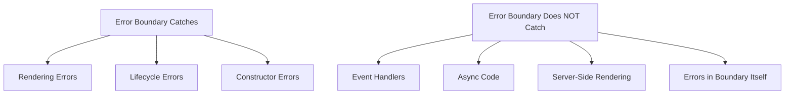

# Topic 32: Error Boundaries

[← Previous: Controlled/Uncontrolled](./31_controlled_uncontrolled.md) | [Back to Main](../README.md) | [Next: Portals →](./33_portals.md)

---

## Table of Contents

1. [Overview](#overview)
2. [What are Error Boundaries?](#what-are-error-boundaries)
3. [Creating Error Boundaries](#creating-error-boundaries)
4. [Error Boundary Placement](#error-boundary-placement)
5. [Error Recovery](#error-recovery)
6. [Limitations](#limitations)
7. [TypeScript Error Boundaries](#typescript-error-boundaries)
8. [Error Logging](#error-logging)
9. [Best Practices](#best-practices)
10. [React 19 Improvements](#react-19-improvements)

---

## Overview

**Error Boundaries** are React components that catch JavaScript errors anywhere in their child component tree, log those errors, and display a fallback UI. They're essential for preventing the entire app from crashing due to errors in specific components.

**What You'll Learn:**
- What error boundaries are and why they're important
- How to create error boundaries
- Where to place error boundaries
- Error recovery strategies
- Limitations of error boundaries
- TypeScript patterns
- Integration with error logging services

**Prerequisites:**
- Class components (error boundaries must be classes in React <19)
- Component lifecycle understanding
- Error handling concepts

**Version Coverage:**
- React 16.3+ (Error boundaries introduction)
- React 19 (Function component error boundaries proposed)
- React 19.2

---

## What are Error Boundaries?

### Core Concept

Error boundaries catch errors during **rendering**, **lifecycle methods**, and **constructors** of the whole tree below them.

```tsx
// Without error boundary: Entire app crashes
function App() {
  return (
    <div>
      <Header />
      <BuggyComponent />  {/* Error here crashes entire app */}
      <Footer />
    </div>
  );
}

// With error boundary: Only affected part shows fallback
function App() {
  return (
    <div>
      <Header />
      <ErrorBoundary fallback={<ErrorMessage />}>
        <BuggyComponent />  {/* Error contained */}
      </ErrorBoundary>
      <Footer />  {/* Still renders! */}
    </div>
  );
}
```

### What They Catch



---

## Creating Error Boundaries

### Basic Error Boundary

```tsx
// Must be class component (React <19)
class ErrorBoundary extends React.Component<
  { children: React.ReactNode; fallback?: React.ReactNode },
  { hasError: boolean; error: Error | null }
> {
  constructor(props) {
    super(props);
    this.state = { hasError: false, error: null };
  }
  
  static getDerivedStateFromError(error: Error) {
    // Update state so next render shows fallback
    return { hasError: true, error };
  }
  
  componentDidCatch(error: Error, errorInfo: React.ErrorInfo) {
    // Log error to service
    console.error('Error caught:', error, errorInfo);
  }
  
  render() {
    if (this.state.hasError) {
      return this.props.fallback || (
        <div>
          <h2>Something went wrong</h2>
          <details>
            <summary>Error details</summary>
            <pre>{this.state.error?.message}</pre>
          </details>
        </div>
      );
    }
    
    return this.props.children;
  }
}

// Usage
<ErrorBoundary fallback={<ErrorPage />}>
  <App />
</ErrorBoundary>
```

### With Reset Capability

```tsx
class ErrorBoundary extends React.Component {
  state = { hasError: false, error: null };
  
  static getDerivedStateFromError(error) {
    return { hasError: true, error };
  }
  
  componentDidCatch(error, errorInfo) {
    logErrorToService(error, errorInfo);
  }
  
  reset = () => {
    this.setState({ hasError: false, error: null });
  };
  
  render() {
    if (this.state.hasError) {
      return (
        <div>
          <h2>Something went wrong</h2>
          <p>{this.state.error?.message}</p>
          <button onClick={this.reset}>Try Again</button>
        </div>
      );
    }
    
    return this.props.children;
  }
}
```

---

## Error Boundary Placement

### Strategic Placement

```tsx
// Granular error boundaries
function App() {
  return (
    <div>
      {/* Global error boundary */}
      <ErrorBoundary fallback={<AppCrashed />}>
        <Header />
        
        {/* Feature-level boundaries */}
        <ErrorBoundary fallback={<SidebarError />}>
          <Sidebar />
        </ErrorBoundary>
        
        <ErrorBoundary fallback={<MainContentError />}>
          <MainContent />
        </ErrorBoundary>
        
        <Footer />
      </ErrorBoundary>
    </div>
  );
}
```

### Multiple Boundaries

```tsx
function Dashboard() {
  return (
    <>
      {/* Each widget has own boundary */}
      <ErrorBoundary fallback={<WidgetError />}>
        <UserStatsWidget />
      </ErrorBoundary>
      
      <ErrorBoundary fallback={<WidgetError />}>
        <RecentActivity />
      </ErrorBoundary>
      
      <ErrorBoundary fallback={<WidgetError />}>
        <NotificationsWidget />
      </ErrorBoundary>
    </>
  );
}
```

---

## Error Recovery

### Reset on Route Change

```tsx
class ErrorBoundary extends Component {
  state = { hasError: false };
  
  static getDerivedStateFromError() {
    return { hasError: true };
  }
  
  componentDidUpdate(prevProps) {
    // Reset on route change
    if (this.props.location !== prevProps.location) {
      this.setState({ hasError: false });
    }
  }
  
  render() {
    if (this.state.hasError) {
      return <ErrorFallback />;
    }
    
    return this.props.children;
  }
}

// Usage with router
<ErrorBoundary location={location}>
  <Routes />
</ErrorBoundary>
```

### Auto-Retry

```tsx
class ErrorBoundaryWithRetry extends Component {
  state = { hasError: false, errorCount: 0 };
  
  static getDerivedStateFromError() {
    return (prevState) => ({
      hasError: true,
      errorCount: prevState.errorCount + 1
    });
  }
  
  componentDidUpdate(prevProps, prevState) {
    // Auto-retry up to 3 times
    if (this.state.hasError && this.state.errorCount < 3) {
      setTimeout(() => {
        this.setState({ hasError: false });
      }, 1000);
    }
  }
  
  render() {
    if (this.state.hasError) {
      if (this.state.errorCount >= 3) {
        return <div>Failed after 3 attempts</div>;
      }
      return <div>Retrying... ({this.state.errorCount}/3)</div>;
    }
    
    return this.props.children;
  }
}
```

---

## Limitations

### What Error Boundaries Don't Catch

```tsx
// ❌ Event handlers (use try-catch)
function Component() {
  const handleClick = () => {
    throw new Error('Event error');  // Not caught by boundary!
  };
  
  // Must wrap in try-catch
  const handleClickSafe = () => {
    try {
      riskyOperation();
    } catch (error) {
      setError(error);
    }
  };
  
  return <button onClick={handleClick}>Click</button>;
}

// ❌ Async code (use try-catch)
function Component() {
  useEffect(() => {
    async function fetchData() {
      throw new Error('Async error');  // Not caught!
    }
    
    // Must wrap
    fetchData().catch(error => setError(error));
  }, []);
}

// ❌ Server-side rendering errors
// Error boundaries only work on client

// ❌ Errors in error boundary itself
class ErrorBoundary extends Component {
  render() {
    throw new Error('Boundary error');  // Not caught!
  }
}
```

---

## TypeScript Error Boundaries

### Fully Typed

```tsx
interface ErrorBoundaryProps {
  children: React.ReactNode;
  fallback?: React.ReactNode;
  onError?: (error: Error, errorInfo: React.ErrorInfo) => void;
}

interface ErrorBoundaryState {
  hasError: boolean;
  error: Error | null;
}

class ErrorBoundary extends React.Component<ErrorBoundaryProps, ErrorBoundaryState> {
  constructor(props: ErrorBoundaryProps) {
    super(props);
    this.state = { hasError: false, error: null };
  }
  
  static getDerivedStateFromError(error: Error): ErrorBoundaryState {
    return { hasError: true, error };
  }
  
  componentDidCatch(error: Error, errorInfo: React.ErrorInfo) {
    this.props.onError?.(error, errorInfo);
  }
  
  render() {
    if (this.state.hasError) {
      return this.props.fallback || (
        <div>
          <h2>Error occurred</h2>
          <pre>{this.state.error?.message}</pre>
        </div>
      );
    }
    
    return this.props.children;
  }
}
```

---

## Error Logging

### Integration with Services

```tsx
class ErrorBoundary extends Component {
  componentDidCatch(error, errorInfo) {
    // Send to error tracking service
    Sentry.captureException(error, {
      contexts: {
        react: {
          componentStack: errorInfo.componentStack
        }
      }
    });
    
    // Or custom logging
    logErrorToServer({
      error: error.message,
      stack: error.stack,
      componentStack: errorInfo.componentStack,
      timestamp: new Date().toISOString(),
      userAgent: navigator.userAgent
    });
  }
  
  render() {
    if (this.state.hasError) {
      return <ErrorFallback />;
    }
    
    return this.props.children;
  }
}
```

---

## Best Practices

### 1. Multiple Error Boundaries

```tsx
// ✅ Granular boundaries
<ErrorBoundary>  {/* App-level */}
  <Header />
  
  <ErrorBoundary>  {/* Feature-level */}
    <Sidebar />
  </ErrorBoundary>
  
  <ErrorBoundary>
    <MainContent />
  </ErrorBoundary>
</ErrorBoundary>
```

### 2. Informative Fallbacks

```tsx
// ✅ Helpful error UI
function ErrorFallback({ error, resetError }) {
  return (
    <div className="error-boundary">
      <h2>Oops! Something went wrong</h2>
      <p>We're sorry for the inconvenience. Our team has been notified.</p>
      
      {process.env.NODE_ENV === 'development' && (
        <details>
          <summary>Error details (dev only)</summary>
          <pre>{error.message}</pre>
          <pre>{error.stack}</pre>
        </details>
      )}
      
      <button onClick={resetError}>Try again</button>
      <button onClick={() => window.location.href = '/'}>Go home</button>
    </div>
  );
}
```

### 3. Log Errors

```tsx
// ✅ Always log errors
componentDidCatch(error, errorInfo) {
  // Production: Send to service
  if (process.env.NODE_ENV === 'production') {
    errorTrackingService.log(error, errorInfo);
  }
  
  // Development: Console with details
  console.error('Error Boundary caught:', error);
  console.error('Component stack:', errorInfo.componentStack);
}
```

---

## React 19 Improvements

### Function Component Error Boundaries (Proposed)

```tsx
// React 19 (proposed, not yet released)
function ErrorBoundary({ children, fallback }) {
  const [error, setError] = useState(null);
  
  if (error) {
    return fallback || <div>Error: {error.message}</div>;
  }
  
  return (
    <ErrorBoundaryProvider onError={setError}>
      {children}
    </ErrorBoundaryProvider>
  );
}

// Note: This is proposed for future React, not current
// Currently must use class components
```

---

## Higher-Order Thinking FAQs

### 1. Why must error boundaries be class components, and will this change with React 19?

**Deep Answer:**

Error boundaries require **lifecycle methods** that don't have Hook equivalents, but React 19 may introduce new APIs.

**Why Classes (Currently):**

```tsx
// Error boundaries need:
// 1. getDerivedStateFromError (static method)
// 2. componentDidCatch (lifecycle method)

// Hooks don't have equivalents for:
// - Static methods
// - Error catching in render

// Attempted Hook version (doesn't work):
function ErrorBoundary({ children }) {
  const [error, setError] = useState(null);
  
  // ❌ No Hook for catching render errors
  // useEffect runs AFTER render
  // Error happens DURING render
  
  if (error) return <ErrorUI />;
  return children;
}
```

**Why It Matters:**

```tsx
// Error happens during render:
function BuggyComponent() {
  throw new Error('Render error');  // When does this happen?
  return <div>Never reached</div>;
}

// Timeline:
// 1. React calls BuggyComponent()
// 2. Error thrown (synchronous)
// 3. React needs to catch immediately
// 4. getDerivedStateFromError runs
// 5. Next render shows fallback

// Hooks can't intercept step 2-3
// useEffect would run at step 6 (too late)
```

**Deep Implication:**

This is one of the few remaining reasons to use class components. Error boundaries need **synchronous error catching** during render, which Hooks (asynchronous by nature) can't provide. React 19 may add new primitives, but it requires solving the "catch errors during render" problem.

### 2. Why don't error boundaries catch event handler errors, and how should you handle those?

**Deep Answer:**

Error boundaries only catch errors in **React's rendering phase**, not in **your code's execution phase**.

**The Distinction:**

```tsx
// Rendering phase (boundary catches)
function Component() {
  const data = props.getData();  // If throws, boundary catches
  return <div>{data.value}</div>;  // If throws, boundary catches
}

// Event phase (boundary doesn't catch)
function Component() {
  const handleClick = () => {
    throw new Error('Click error');  // Boundary doesn't catch!
  };
  
  return <button onClick={handleClick}>Click</button>;
}

// Why? Event handlers run in different call stack
```

**React's Call Stack:**

```tsx
// Render phase:
try {
  Component();  // React wraps in try-catch
} catch (error) {
  // Error boundary catches
}

// Event phase:
button.addEventListener('click', () => {
  handleClick();  // Not wrapped by React!
  // Error bubbles to window
});
```

**Proper Event Error Handling:**

```tsx
// ✅ try-catch in event handler
function Component() {
  const [error, setError] = useState(null);
  
  const handleClick = async () => {
    try {
      await riskyOperation();
    } catch (err) {
      setError(err);
      // Can also log to service
      errorService.log(err);
    }
  };
  
  if (error) {
    return <div>Error: {error.message}</div>;
  }
  
  return <button onClick={handleClick}>Click</button>;
}

// ✅ Global error handler
window.addEventListener('error', (event) => {
  console.error('Uncaught error:', event.error);
  // Log to service
});

// ✅ Promise rejection handler  
window.addEventListener('unhandledrejection', (event) => {
  console.error('Unhandled promise rejection:', event.reason);
});
```

**Deep Implication:**

This distinction reveals React's boundaries: it controls **rendering**, not **execution**. Error boundaries protect React's rendering process. Your code's execution (events, async) is your responsibility to handle. This separation of concerns is intentional - React won't try to catch all JavaScript errors, just rendering errors.

---

## Senior SDE Interview Questions

### Question 1: Error Boundary Strategy

**Question:** "Design an error boundary strategy for a large dashboard with 20+ widgets. Each widget fetches data independently. How would you place error boundaries to maximize reliability while providing good UX?"

**Key Concepts Being Tested:**
- Error boundary placement strategy
- UX considerations
- Granularity decisions
- Recovery mechanisms

**Expected Answer Should Cover:**

1. **Hierarchy Strategy:**
```tsx
<ErrorBoundary fallback={<AppCrashed />}>  {/* Top-level */}
  <Header />
  
  <Dashboard>
    {widgets.map(widget => (
      <ErrorBoundary 
        key={widget.id}
        fallback={<WidgetError widgetName={widget.name} />}
      >
        <Widget config={widget} />
      </ErrorBoundary>
    ))}
  </Dashboard>
  
  <Footer />
</ErrorBoundary>

// Benefits:
// - Widget errors don't crash dashboard
// - Dashboard errors don't crash app
// - Header/Footer always visible
```

2. **UX Considerations:**
```tsx
// Show which widget failed
function WidgetError({ widgetName, onRetry }) {
  return (
    <div className="widget-error">
      <p>{widgetName} failed to load</p>
      <button onClick={onRetry}>Retry</button>
    </div>
  );
}

// Allow retrying individual widgets
// Keep other widgets functional
```

3. **Data Fetching Errors:**
```tsx
// Error boundaries don't catch async errors
// Must handle in component:
function Widget() {
  const [error, setError] = useState(null);
  
  useEffect(() => {
    fetchData().catch(setError);
  }, []);
  
  if (error) throw error;  // Re-throw for boundary
  
  return <div>Widget content</div>;
}
```

**Follow-ups:**
1. "How do you prevent error boundary reset loops?"
2. "What about errors during data fetching?"
3. "How do you test error boundaries?"

**Red Flags:**
- Single error boundary for entire app
- No UX consideration
- Missing async error handling

**Green Flags:**
- Granular boundary strategy
- Considers UX (partial failures)
- Handles async errors correctly
- Mentions logging/monitoring

---

[← Previous: Controlled/Uncontrolled](./31_controlled_uncontrolled.md) | [Back to Main](../README.md) | [Next: Portals →](./33_portals.md)

---

**Progress**: Topic 32/220 completed | Part III: Advanced Patterns (70% complete)
