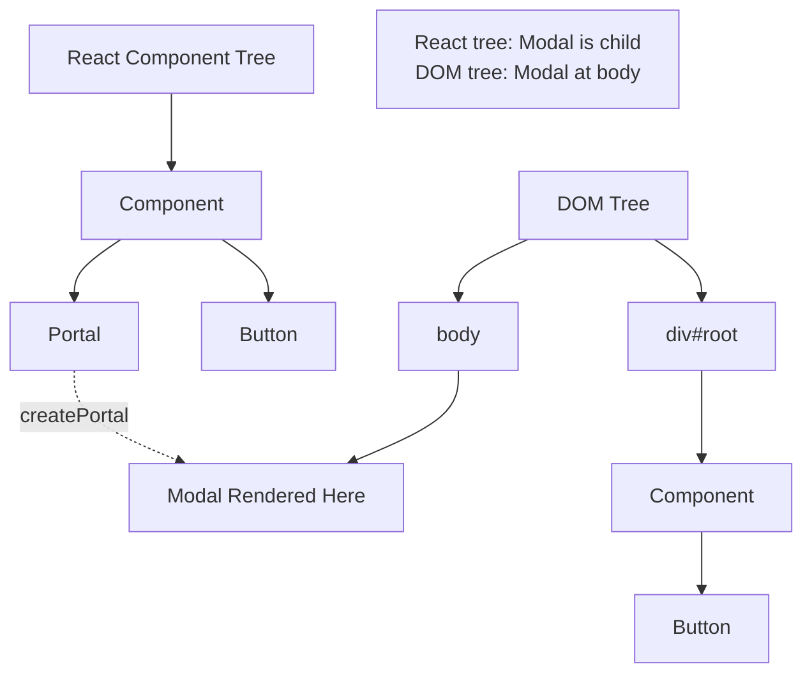

# Topic 33: React Portals

[← Previous: Error Boundaries](./32_error_boundaries.md) | [Back to Main](../README.md) | [Next: Refs and DOM →](./34_refs_dom.md)

---

## Table of Contents

1. [Overview](#overview)
2. [What are Portals?](#what-are-portals)
3. [Creating Portals](#creating-portals)
4. [Common Use Cases](#common-use-cases)
5. [Event Bubbling](#event-bubbling)
6. [Portal with State](#portal-with-state)
7. [TypeScript Portals](#typescript-portals)
8. [Accessibility](#accessibility)
9. [Best Practices](#best-practices)
10. [Common Patterns](#common-patterns)

---

## Overview

**React Portals** provide a way to render children into a DOM node that exists outside the parent component's DOM hierarchy. They're essential for modals, tooltips, and overlays that need to break out of container constraints.

**What You'll Learn:**
- What portals are and when to use them
- How to create portals with createPortal
- Event bubbling through portals
- Common use cases (modals, tooltips)
- Accessibility considerations
- TypeScript patterns

**Prerequisites:**
- Understanding of DOM hierarchy
- useState and useEffect Hooks
- useRef for DOM references

**Version Coverage:**
- React 16+ (Portals introduction)
- React 19.2

---

## What are Portals?

### The Problem

```tsx
// Without portal: Modal trapped in parent
function Component() {
  const [isOpen, setIsOpen] = useState(false);
  
  return (
    <div style={{ position: 'relative', overflow: 'hidden' }}>
      <button onClick={() => setIsOpen(true)}>Open Modal</button>
      
      {isOpen && (
        <div className="modal">  {/* Clipped by parent overflow! */}
          <p>Modal content</p>
        </div>
      )}
    </div>
  );
}

// Parent's CSS constrains modal:
// - overflow: hidden clips it
// - position: relative affects positioning
// - z-index might not work as expected
```

### The Solution

```tsx
import { createPortal } from 'react-dom';

function Component() {
  const [isOpen, setIsOpen] = useState(false);
  
  return (
    <div style={{ position: 'relative', overflow: 'hidden' }}>
      <button onClick={() => setIsOpen(true)}>Open Modal</button>
      
      {isOpen && createPortal(
        <div className="modal">  {/* Rendered at document.body! */}
          <p>Modal content</p>
        </div>,
        document.body  // Target DOM node
      )}
    </div>
  );
}

// Modal escapes parent constraints
```

### Portal Visualization



---

## Creating Portals

### Basic Portal

```tsx
import { createPortal } from 'react-dom';

function Modal({ children, isOpen }) {
  if (!isOpen) return null;
  
  return createPortal(
    <div className="modal-overlay">
      <div className="modal">
        {children}
      </div>
    </div>,
    document.body
  );
}

// Usage
function App() {
  const [isOpen, setIsOpen] = useState(false);
  
  return (
    <>
      <button onClick={() => setIsOpen(true)}>Open</button>
      
      <Modal isOpen={isOpen}>
        <h2>Modal Title</h2>
        <p>Modal content</p>
        <button onClick={() => setIsOpen(false)}>Close</button>
      </Modal>
    </>
  );
}
```

### Custom Container

```tsx
// Portal to specific container
function ModalWithContainer() {
  const [isOpen, setIsOpen] = useState(false);
  const [container, setContainer] = useState<HTMLElement | null>(null);
  
  useEffect(() => {
    // Create or find container
    let modalRoot = document.getElementById('modal-root');
    
    if (!modalRoot) {
      modalRoot = document.createElement('div');
      modalRoot.id = 'modal-root';
      document.body.appendChild(modalRoot);
    }
    
    setContainer(modalRoot);
  }, []);
  
  if (!container) return null;
  
  return createPortal(
    <div className="modal">
      Modal content
    </div>,
    container
  );
}
```

---

## Common Use Cases

### Modal Dialog

```tsx
interface ModalProps {
  isOpen: boolean;
  onClose: () => void;
  children: React.ReactNode;
}

function Modal({ isOpen, onClose, children }: ModalProps) {
  useEffect(() => {
    if (isOpen) {
      // Prevent body scroll
      document.body.style.overflow = 'hidden';
      
      // ESC to close
      const handleEscape = (e: KeyboardEvent) => {
        if (e.key === 'Escape') onClose();
      };
      
      window.addEventListener('keydown', handleEscape);
      
      return () => {
        document.body.style.overflow = '';
        window.removeEventListener('keydown', handleEscape);
      };
    }
  }, [isOpen, onClose]);
  
  if (!isOpen) return null;
  
  return createPortal(
    <div className="modal-overlay" onClick={onClose}>
      <div className="modal-content" onClick={(e) => e.stopPropagation()}>
        <button className="modal-close" onClick={onClose}>×</button>
        {children}
      </div>
    </div>,
    document.body
  );
}

// Usage
function App() {
  const [isOpen, setIsOpen] = useState(false);
  
  return (
    <>
      <button onClick={() => setIsOpen(true)}>Open Modal</button>
      
      <Modal isOpen={isOpen} onClose={() => setIsOpen(false)}>
        <h2>Modal Title</h2>
        <p>Modal content goes here</p>
      </Modal>
    </>
  );
}
```

### Tooltip

```tsx
function Tooltip({ children, text }) {
  const [isVisible, setIsVisible] = useState(false);
  const [position, setPosition] = useState({ x: 0, y: 0 });
  const targetRef = useRef<HTMLDivElement>(null);
  
  const handleMouseEnter = () => {
    if (targetRef.current) {
      const rect = targetRef.current.getBoundingClientRect();
      setPosition({
        x: rect.left + rect.width / 2,
        y: rect.top
      });
      setIsVisible(true);
    }
  };
  
  const handleMouseLeave = () => {
    setIsVisible(false);
  };
  
  return (
    <>
      <div
        ref={targetRef}
        onMouseEnter={handleMouseEnter}
        onMouseLeave={handleMouseLeave}
      >
        {children}
      </div>
      
      {isVisible && createPortal(
        <div
          className="tooltip"
          style={{
            position: 'fixed',
            left: position.x,
            top: position.y - 30,
            transform: 'translateX(-50%)'
          }}
        >
          {text}
        </div>,
        document.body
      )}
    </>
  );
}

// Usage
<Tooltip text="Helpful information">
  <button>Hover me</button>
</Tooltip>
```

### Toast Notifications

```tsx
// Toast container at body level
function ToastContainer() {
  const [toasts, setToasts] = useState<Array<{
    id: number;
    message: string;
    type: 'success' | 'error' | 'info';
  }>>([]);
  
  const addToast = (message: string, type: 'success' | 'error' | 'info') => {
    const id = Date.now();
    setToasts([...toasts, { id, message, type }]);
    
    // Auto-remove after 3s
    setTimeout(() => {
      setToasts(prev => prev.filter(t => t.id !== id));
    }, 3000);
  };
  
  return createPortal(
    <div className="toast-container">
      {toasts.map(toast => (
        <div key={toast.id} className={`toast toast-${toast.type}`}>
          {toast.message}
        </div>
      ))}
    </div>,
    document.body
  );
}
```

---

## Event Bubbling

### Events Bubble Through Portals

```tsx
// Even though modal is rendered at body,
// events bubble through React tree!
function App() {
  const handleClick = () => {
    console.log('Clicked in App!');  // This fires!
  };
  
  return (
    <div onClick={handleClick}>
      <Modal>
        <button>Click me</button>  {/* Click bubbles to App! */}
      </Modal>
    </div>
  );
}

function Modal({ children }) {
  return createPortal(
    <div className="modal">
      {children}  {/* Rendered at document.body */}
    </div>,
    document.body
  );
}

// Click on button:
// 1. Bubbles through DOM to body
// 2. Also bubbles through React tree to App
// 3. App's onClick handler fires
```

### Preventing Bubbling

```tsx
// Stop event from bubbling through React tree
function Modal({ children, onClose }) {
  const handleOverlayClick = (e: React.MouseEvent) => {
    if (e.target === e.currentTarget) {
      onClose();
    }
  };
  
  return createPortal(
    <div className="modal-overlay" onClick={handleOverlayClick}>
      <div className="modal-content" onClick={(e) => e.stopPropagation()}>
        {children}
      </div>
    </div>,
    document.body
  );
}
```

---

## Portal with State

### Modal with Animation

```tsx
function AnimatedModal({ isOpen, onClose, children }) {
  const [shouldRender, setShouldRender] = useState(false);
  
  useEffect(() => {
    if (isOpen) {
      setShouldRender(true);
    } else {
      // Delay unmount for exit animation
      const timer = setTimeout(() => {
        setShouldRender(false);
      }, 300);
      
      return () => clearTimeout(timer);
    }
  }, [isOpen]);
  
  if (!shouldRender) return null;
  
  return createPortal(
    <div className={`modal-overlay ${isOpen ? 'enter' : 'exit'}`}>
      <div className="modal">
        {children}
        <button onClick={onClose}>Close</button>
      </div>
    </div>,
    document.body
  );
}
```

---

## TypeScript Portals

### Typed Portal Component

```tsx
interface PortalProps {
  children: React.ReactNode;
  container?: Element | DocumentFragment;
}

function Portal({ children, container = document.body }: PortalProps) {
  return createPortal(children, container);
}

// Usage
<Portal container={document.getElementById('portal-root')}>
  <div>Content rendered in portal-root</div>
</Portal>
```

---

## Accessibility

### Focus Management

```tsx
function AccessibleModal({ isOpen, onClose, children }) {
  const modalRef = useRef<HTMLDivElement>(null);
  const previousFocusRef = useRef<HTMLElement | null>(null);
  
  useEffect(() => {
    if (isOpen) {
      // Save current focus
      previousFocusRef.current = document.activeElement as HTMLElement;
      
      // Focus modal
      modalRef.current?.focus();
      
      return () => {
        // Restore focus
        previousFocusRef.current?.focus();
      };
    }
  }, [isOpen]);
  
  if (!isOpen) return null;
  
  return createPortal(
    <div
      ref={modalRef}
      className="modal"
      role="dialog"
      aria-modal="true"
      tabIndex={-1}
    >
      {children}
    </div>,
    document.body
  );
}
```

### Trap Focus

```tsx
function useFocusTrap(ref: React.RefObject<HTMLElement>) {
  useEffect(() => {
    const element = ref.current;
    if (!element) return;
    
    const handleTab = (e: KeyboardEvent) => {
      if (e.key !== 'Tab') return;
      
      const focusableElements = element.querySelectorAll(
        'button, [href], input, select, textarea, [tabindex]:not([tabindex="-1"])'
      );
      
      const first = focusableElements[0] as HTMLElement;
      const last = focusableElements[focusableElements.length - 1] as HTMLElement;
      
      if (e.shiftKey) {
        if (document.activeElement === first) {
          last.focus();
          e.preventDefault();
        }
      } else {
        if (document.activeElement === last) {
          first.focus();
          e.preventDefault();
        }
      }
    };
    
    element.addEventListener('keydown', handleTab);
    return () => element.removeEventListener('keydown', handleTab);
  }, [ref]);
}

function Modal({ isOpen, children }) {
  const modalRef = useRef<HTMLDivElement>(null);
  useFocusTrap(modalRef);
  
  if (!isOpen) return null;
  
  return createPortal(
    <div ref={modalRef} className="modal">
      {children}
    </div>,
    document.body
  );
}
```

---

## Best Practices

### 1. Clean Up Portal Container

```tsx
// ✅ Create and clean up container
function usePortalContainer(id: string) {
  const [container, setContainer] = useState<HTMLElement | null>(null);
  
  useEffect(() => {
    let element = document.getElementById(id);
    
    if (!element) {
      element = document.createElement('div');
      element.id = id;
      document.body.appendChild(element);
    }
    
    setContainer(element);
    
    return () => {
      if (element && element.childNodes.length === 0) {
        element.remove();
      }
    };
  }, [id]);
  
  return container;
}

function Modal({ children }) {
  const container = usePortalContainer('modal-root');
  
  if (!container) return null;
  
  return createPortal(children, container);
}
```

### 2. Handle Server-Side Rendering

```tsx
// ✅ SSR-safe portal
function Portal({ children }) {
  const [mounted, setMounted] = useState(false);
  
  useEffect(() => {
    setMounted(true);
  }, []);
  
  if (!mounted) return null;
  
  return createPortal(children, document.body);
}
```

### 3. Manage Body Scroll

```tsx
// ✅ Prevent scroll when modal open
function Modal({ isOpen, children }) {
  useEffect(() => {
    if (isOpen) {
      // Save scroll position
      const scrollY = window.scrollY;
      
      // Prevent scroll
      document.body.style.position = 'fixed';
      document.body.style.top = `-${scrollY}px`;
      document.body.style.width = '100%';
      
      return () => {
        // Restore scroll
        document.body.style.position = '';
        document.body.style.top = '';
        document.body.style.width = '';
        window.scrollTo(0, scrollY);
      };
    }
  }, [isOpen]);
  
  if (!isOpen) return null;
  
  return createPortal(<div className="modal">{children}</div>, document.body);
}
```

---

## Common Patterns

### Reusable Modal Hook

```tsx
function useModal() {
  const [isOpen, setIsOpen] = useState(false);
  
  const open = () => setIsOpen(true);
  const close = () => setIsOpen(false);
  const toggle = () => setIsOpen(!isOpen);
  
  const Modal = ({ children }: { children: React.ReactNode }) => {
    if (!isOpen) return null;
    
    return createPortal(
      <div className="modal-overlay" onClick={close}>
        <div className="modal" onClick={(e) => e.stopPropagation()}>
          <button className="close" onClick={close}>×</button>
          {children}
        </div>
      </div>,
      document.body
    );
  };
  
  return { isOpen, open, close, toggle, Modal };
}

// Usage
function Component() {
  const modal = useModal();
  
  return (
    <>
      <button onClick={modal.open}>Open Modal</button>
      
      <modal.Modal>
        <h2>Modal Content</h2>
        <p>Some text</p>
      </modal.Modal>
    </>
  );
}
```

---

## Higher-Order Thinking FAQs

### 1. How do portals maintain React's event system while rendering outside the parent DOM, and what are the implications?

**Deep Answer:**

Portals create a **split personality** - DOM hierarchy vs React tree hierarchy - which has profound implications for event handling.

**The Split:**

```tsx
// React tree (logical):
<App>
  <Sidebar>
    <Modal>
      <button onClick={handleClick}>Click</button>
    </Modal>
  </Sidebar>
</App>

// DOM tree (physical):
<div id="root">
  <div class="app">
    <div class="sidebar">
      {/* Modal NOT here in DOM! */}
    </div>
  </div>
</div>
<div class="modal">
  <button>Click</button>  {/* Rendered here! */}
</div>
```

**Event Bubbling:**

```tsx
function App() {
  const handleAppClick = () => {
    console.log('App clicked');
  };
  
  return (
    <div onClick={handleAppClick}>
      <Sidebar>
        <Modal>
          <button>Click me</button>
        </Modal>
      </Sidebar>
    </div>
  );
}

// Click button:
// 1. DOM bubbling: button → modal → body (App div never reached!)
// 2. React bubbling: button → Modal → Sidebar → App (handleAppClick fires!)

// React maintains synthetic event bubbling through component tree,
// regardless of DOM structure!
```

**Why This Matters:**

```tsx
// Context works through portals
const ThemeContext = createContext('light');

function App() {
  return (
    <ThemeContext.Provider value="dark">
      <Modal>
        <ThemedButton />  {/* Gets "dark" theme! */}
      </Modal>
    </ThemeContext.Provider>
  );
}

function ThemedButton() {
  const theme = useContext(ThemeContext);  // Works!
  return <button className={theme}>Button</button>;
}

// Portal is outside in DOM, but inside in React tree
// Context flows through React tree
```

**Deep Implication:**

Portals prove React's **virtual DOM** is a true abstraction - logical structure (React tree) is independent of physical structure (DOM tree). This enables powerful patterns but can confuse developers expecting DOM and React trees to match. Understanding this split is key to mastering portals.

### 2. What are the performance implications of portals, and when might they cause issues?

**Deep Answer:**

Portals have **minimal overhead** but can cause issues with CSS, stacking contexts, and layout calculations.

**Performance:**

```tsx
// Portal overhead is negligible
// createPortal is just:
// 1. Find target DOM node
// 2. appendChild (or equivalent)
// 3. Maintain React tree link

// No significant performance cost
```

**CSS Issues:**

```tsx
// Problem: Parent styles don't apply
function Parent() {
  return (
    <div className="theme-dark">  {/* Dark theme styles */}
      <Modal>
        <div>Content</div>  {/* Doesn't inherit theme-dark! */}
      </Modal>
    </div>
  );
}

// Modal is at document.body, outside theme-dark
// Must manage styles differently:

// Solution 1: Pass theme explicitly
<Modal theme="dark">
  <div className="dark-content">Content</div>
</Modal>

// Solution 2: Use Context
const theme = useContext(ThemeContext);
return createPortal(
  <div className={theme}>Content</div>,
  document.body
);

// Solution 3: CSS variables on :root
:root {
  --theme-bg: white;
  --theme-text: black;
}
```

**Stacking Context:**

```tsx
// Problem: z-index conflicts
function App() {
  return (
    <div style={{ position: 'relative', zIndex: 1000 }}>
      <SomeContent />
      
      <Modal>
        {/* Modal at body, but might be behind parent! */}
        {/* If body or html has z-index, conflicts arise */}
      </Modal>
    </div>
  );
}

// Solution: Ensure portal container has high z-index
#modal-root {
  position: relative;
  z-index: 9999;
}
```

**Deep Implication:**

Portals are **cheap at runtime** but have **CSS implications**. They break CSS inheritance and stacking context assumptions. This is the tradeoff: freedom from parent constraints means losing parent styles. Plan your CSS architecture accordingly - use CSS variables, Context, or explicit prop passing for theming.

---

## Senior SDE Interview Questions

### Question 1: Portal Architecture

**Question:** "You're building a complex app with modals, tooltips, and toast notifications all using portals. How do you architect the portal containers and manage z-index layers?"

**Key Concepts Being Tested:**
- Portal container management
- Z-index strategy
- Multiple portal coordination
- CSS architecture

**Expected Answer Should Cover:**

1. **Container Strategy:**
```tsx
// Create layered containers in index.html
<body>
  <div id="root"></div>
  <div id="modal-root" style="z-index: 1000"></div>
  <div id="tooltip-root" style="z-index: 2000"></div>
  <div id="toast-root" style="z-index: 3000"></div>
</body>

// Each portal type has dedicated container
// Z-index hierarchy prevents conflicts
```

2. **Portal Manager:**
```tsx
// Centralized portal access
const portalContainers = {
  modal: 'modal-root',
  tooltip: 'tooltip-root',
  toast: 'toast-root'
};

function usePortal(type: keyof typeof portalContainers) {
  const [container, setContainer] = useState(null);
  
  useEffect(() => {
    const element = document.getElementById(portalContainers[type]);
    setContainer(element);
  }, [type]);
  
  return container;
}
```

3. **Stacking Management:**
```tsx
// Track active modals for proper stacking
const modalStack = [];

function Modal({ children }) {
  const zIndex = 1000 + modalStack.length * 10;
  
  useEffect(() => {
    modalStack.push(zIndex);
    return () => {
      modalStack.pop();
    };
  }, []);
  
  return createPortal(
    <div style={{ zIndex }}>{children}</div>,
    document.body
  );
}
```

**Follow-ups:**
1. "How do you handle nested modals?"
2. "What about mobile considerations?"
3. "How do you test portal rendering?"

**Red Flags:**
- Single portal container for everything
- No z-index strategy
- Missing accessibility

**Green Flags:**
- Layered container approach
- Z-index management
- Considers accessibility
- CSS architecture thinking

---

[← Previous: Error Boundaries](./32_error_boundaries.md) | [Back to Main](../README.md) | [Next: Refs and DOM →](./34_refs_dom.md)

---

**Progress**: Topic 33/220 completed | Part III: Advanced Patterns (80% complete)
