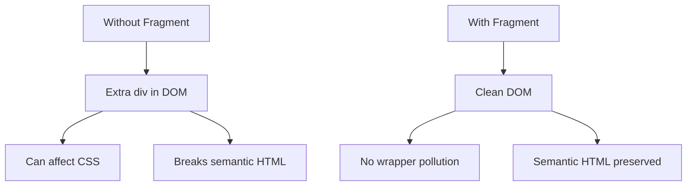

# Topic 35: React Fragments

[← Previous: Refs and DOM](./34_refs_dom.md) | [Back to Main](../README.md) | [Next: Performance Basics →](./36_performance_basics.md)

---

## Table of Contents

1. [Overview](#overview)
2. [What are Fragments?](#what-are-fragments)
3. [Fragment Syntax](#fragment-syntax)
4. [Fragments with Keys](#fragments-with-keys)
5. [When to Use Fragments](#when-to-use-fragments)
6. [Performance Considerations](#performance-considerations)
7. [Common Patterns](#common-patterns)
8. [Best Practices](#best-practices)
9. [Fragments vs Divs](#fragments-vs-divs)
10. [TypeScript with Fragments](#typescript-with-fragments)

---

## Overview

**React Fragments** let you group multiple elements without adding extra nodes to the DOM. They solve the "single root element" requirement while keeping the DOM clean and semantic.

**What You'll Learn:**
- What fragments are and why they exist
- Different fragment syntaxes (<> and <React.Fragment>)
- When to use fragments vs wrapper divs
- Fragments with keys for lists
- Performance implications
- Best practices

**Prerequisites:**
- JSX basics
- Understanding of DOM structure
- Component rendering

**Version Coverage:**
- React 16.2+ (Fragments introduction)
- React 19.2

---

## What are Fragments?

### The Single Root Problem

```tsx
// ❌ Error: Multiple root elements
function Component() {
  return (
    <h1>Title</h1>
    <p>Paragraph</p>
  );
}
// SyntaxError: Adjacent JSX elements must be wrapped

// ❌ Solution 1: Unnecessary div
function Component() {
  return (
    <div>
      <h1>Title</h1>
      <p>Paragraph</p>
    </div>
  );
}
// Works, but adds extra DOM node

// ✅ Solution 2: Fragment
function Component() {
  return (
    <>
      <h1>Title</h1>
      <p>Paragraph</p>
    </>
  );
}
// No extra DOM node!
```

### DOM Comparison



---

## Fragment Syntax

### Short Syntax

```tsx
// Short syntax (most common)
function Component() {
  return (
    <>
      <h1>Title</h1>
      <p>Paragraph</p>
    </>
  );
}

// Equivalent to:
<React.Fragment>
  <h1>Title</h1>
  <p>Paragraph</p>
</React.Fragment>
```

### Full Syntax

```tsx
// Full syntax (when you need props)
import { Fragment } from 'react';

function Component() {
  return (
    <Fragment>
      <h1>Title</h1>
      <p>Paragraph</p>
    </Fragment>
  );
}

// Or
<React.Fragment>
  <h1>Title</h1>
  <p>Paragraph</p>
</React.Fragment>
```

---

## Fragments with Keys

### Lists Requiring Multiple Elements

```tsx
// When you need keys, use full syntax
function DescriptionList({ items }) {
  return (
    <dl>
      {items.map(item => (
        <React.Fragment key={item.id}>
          <dt>{item.term}</dt>
          <dd>{item.description}</dd>
        </React.Fragment>
      ))}
    </dl>
  );
}

// ❌ Short syntax doesn't support keys
{items.map(item => (
  <> key={item.id}>  {/* Syntax error! */}
    <dt>{item.term}</dt>
    <dd>{item.description}</dd>
  </>
))}
```

### Table Rows

```tsx
function TableRows({ rows }) {
  return (
    <table>
      <tbody>
        {rows.map(row => (
          <React.Fragment key={row.id}>
            <tr>
              <td>{row.name}</td>
              <td>{row.value}</td>
            </tr>
            <tr>
              <td colSpan={2}>{row.details}</td>
            </tr>
          </React.Fragment>
        ))}
      </tbody>
    </table>
  );
}
```

---

## When to Use Fragments

### Semantic HTML

```tsx
// ✅ Preserve semantic HTML
function Article() {
  return (
    <article>
      <Header />  {/* Returns multiple elements */}
      <Content />
      <Footer />
    </article>
  );
}

function Header() {
  // ✅ Fragment keeps HTML valid
  return (
    <>
      <h1>Title</h1>
      <time>2024-01-01</time>
    </>
  );
}

// ❌ Without fragment
function Header() {
  return (
    <div>  {/* Invalid: div inside article header */}
      <h1>Title</h1>
      <time>2024-01-01</time>
    </div>
  );
}
```

### Flexbox/Grid Layouts

```tsx
// ✅ Fragment doesn't break layout
function FlexContainer() {
  return (
    <div style={{ display: 'flex' }}>
      <ItemGroup />  {/* Returns multiple items */}
    </div>
  );
}

function ItemGroup() {
  return (
    <>
      <div>Item 1</div>
      <div>Item 2</div>
      <div>Item 3</div>
    </>
  );
  // Direct children of flex container
}

// ❌ Wrapper div breaks flexbox
function ItemGroup() {
  return (
    <div>
      <div>Item 1</div>
      <div>Item 2</div>
      <div>Item 3</div>
    </div>
  );
  // Wrapper div becomes flex item, not children
}
```

---

## Performance Considerations

### Minimal Overhead

```tsx
// Fragments have minimal overhead
// - No extra DOM node
// - No extra wrapper in React tree
// - Slightly faster than div wrapper

// Performance difference is negligible
// But cleaner DOM is always better
```

### Fragment vs Div

```tsx
// With div wrapper
function WithDiv() {
  return (
    <div>  {/* Extra node in DOM */}
      <Child1 />
      <Child2 />
    </div>
  );
}
// DOM: <div><child1 /><child2 /></div>

// With fragment
function WithFragment() {
  return (
    <>  {/* No extra node */}
      <Child1 />
      <Child2 />
    </>
  );
}
// DOM: <child1 /><child2 />
```

---

## Common Patterns

### Returning Multiple Elements

```tsx
// Component that returns multiple elements
function Breadcrumbs({ items }) {
  return (
    <>
      {items.map((item, index) => (
        <React.Fragment key={item.id}>
          {index > 0 && <span> / </span>}
          <a href={item.url}>{item.label}</a>
        </React.Fragment>
      ))}
    </>
  );
}

// Results in: Home / Products / Category (no wrapper divs)
```

### Conditional Multiple Elements

```tsx
function ConditionalElements({ showExtras }) {
  return (
    <div>
      <h1>Title</h1>
      
      {showExtras && (
        <>
          <p>Extra paragraph</p>
          <button>Extra button</button>
          <span>Extra span</span>
        </>
      )}
      
      <footer>Footer</footer>
    </div>
  );
}
```

---

## Best Practices

### 1. Use Short Syntax When Possible

```tsx
// ✅ Short syntax (no keys needed)
function Component() {
  return (
    <>
      <h1>Title</h1>
      <p>Content</p>
    </>
  );
}

// Only use full syntax when needed
function ComponentWithKey() {
  return (
    <React.Fragment key={someKey}>
      <dt>Term</dt>
      <dd>Definition</dd>
    </React.Fragment>
  );
}
```

### 2. Don't Use Unnecessary Wrappers

```tsx
// ❌ Unnecessary wrapper
function Component() {
  return (
    <div>  {/* This div serves no purpose */}
      <button>Click</button>
    </div>
  );
}

// ✅ Return directly
function Component() {
  return <button>Click</button>;
}

// ✅ Use fragment only when needed
function Component() {
  return (
    <>
      <button>Click</button>
      <span>Text</span>
    </>
  );
}
```

### 3. Consider Semantic HTML

```tsx
// ✅ Fragments preserve semantics
function TableBody() {
  return (
    <>
      <tr><td>Row 1</td></tr>
      <tr><td>Row 2</td></tr>
    </>
  );
}

// Can use in table
<table>
  <tbody>
    <TableBody />  {/* tr elements are direct children */}
  </tbody>
</table>
```

---

## Fragments vs Divs

### When to Use Each

```tsx
// ✅ Use Fragment when:
// - Need to group elements
// - Don't need wrapper for styling
// - Want semantic HTML
// - Flexbox/grid layout

// ✅ Use Div when:
// - Need styling on wrapper
// - Need event handler on group
// - Need ref to wrapper
// - Semantic div makes sense
```

### Examples

```tsx
// Fragment: No styling needed
function Items() {
  return (
    <>
      <Item1 />
      <Item2 />
    </>
  );
}

// Div: Styling/events needed
function Items() {
  return (
    <div className="items-container" onClick={handleGroupClick}>
      <Item1 />
      <Item2 />
    </div>
  );
}
```

---

## TypeScript with Fragments

### Typed Fragment Components

```tsx
// Fragment with TypeScript
function Component(): JSX.Element {
  return (
    <>
      <h1>Title</h1>
      <p>Content</p>
    </>
  );
}

// With explicit Fragment type
import { Fragment, ReactElement } from 'react';

function Component(): ReactElement {
  return (
    <Fragment>
      <h1>Title</h1>
      <p>Content</p>
    </Fragment>
  );
}
```

---

## Higher-Order Thinking FAQs

### 1. Why did React introduce Fragments, and what problem do they solve beyond just "extra divs"?

**Deep Answer:**

Fragments solve **structural integrity** problems, not just div bloat. Extra wrappers break semantic HTML, CSS layouts, and accessibility.

**The Real Problems:**

```tsx
// Problem 1: Invalid HTML
function TableRows() {
  return (
    <div>  {/* ❌ div not allowed in tbody! */}
      <tr><td>Row 1</td></tr>
      <tr><td>Row 2</td></tr>
    </div>
  );
}

<table>
  <tbody>
    <TableRows />
  </tbody>
</table>

// Result: <tbody><div><tr>... (INVALID HTML!)

// ✅ Fragment fixes this
function TableRows() {
  return (
    <>
      <tr><td>Row 1</td></tr>
      <tr><td>Row 2</td></tr>
    </>
  );
}
// Result: <tbody><tr>... (VALID!)

// Problem 2: CSS specificity breaks
function Items() {
  return (
    <div className="item-group">  {/* Extra wrapper */}
      <div className="item">Item 1</div>
      <div className="item">Item 2</div>
    </div>
  );
}

// CSS:
// .container > .item { }  // Doesn't match! .item-group in between

// ✅ Fragment preserves structure
function Items() {
  return (
    <>
      <div className="item">Item 1</div>
      <div className="item">Item 2</div>
    </>
  );
}
// .container > .item { }  // Matches!

// Problem 3: Flexbox/Grid breaks
<div style={{ display: 'flex' }}>
  <ItemGroup />
</div>

function ItemGroup() {
  return (
    <div>  {/* This div becomes the flex item, not children! */}
      <div>Item 1</div>
      <div>Item 2</div>
    </div>
  );
}

// Only one flex item (the wrapper), not two!
```

**Deep Implication:**

Fragments aren't just about reducing DOM nodes - they're about **preserving document structure**. HTML, CSS, and accessibility assume specific parent-child relationships. Fragments let React's component boundaries be invisible to HTML/CSS, maintaining structural integrity. This is why frameworks need fragments - component composition would break document semantics without them.

### 2. Why does the short fragment syntax (<>) not support keys or attributes, and when is this a problem?

**Deep Answer:**

The short syntax is **pure syntax sugar** with no runtime representation, so it can't have props.

**Why No Props:**

```tsx
// Short syntax desugars to:
<>
  <h1>Title</h1>
</>

// Becomes:
React.createElement(React.Fragment, null,
  React.createElement('h1', null, 'Title')
)

// Fragment gets null props
// Can't add keys or attributes to null
```

**When This Matters:**

```tsx
// ❌ Need key in list
function List({ items }) {
  return (
    <>
      {items.map(item => (
        <>  {/* Can't add key! */}
          <dt>{item.term}</dt>
          <dd>{item.definition}</dd>
        </>
      ))}
    </>
  );
}

// ✅ Use full syntax
function List({ items }) {
  return (
    <>
      {items.map(item => (
        <React.Fragment key={item.id}>  {/* ✅ Can add key */}
          <dt>{item.term}</dt>
          <dd>{item.definition}</dd>
        </React.Fragment>
      ))}
    </>
  );
}
```

**Design Tradeoff:**

```tsx
// Short syntax: Minimal, no features
<> ... </>

// Full syntax: Verbose, but can add key
<Fragment key={...}> ... </Fragment>

// React chose: Make common case (no key) super clean
// Rare case (with key) is more verbose
```

**Deep Implication:**

This design shows React's **pragmatic tradeoffs**: optimize for the common case (no keys = short syntax), make uncommon case (keys = full syntax) more verbose but possible. It's the same philosophy as default props - most uses are simple, power users can opt into complexity.

### 3. How do Fragments affect React's reconciliation, and do they have any performance impact?

**Deep Answer:**

Fragments are **transparent** to reconciliation - React sees through them to the children.

**Reconciliation Behavior:**

```tsx
// With wrapper div
function WithDiv() {
  return (
    <div>
      <Child1 />
      <Child2 />
    </div>
  );
}

// React tree:
// Component
//   └─ div
//      ├─ Child1
//      └─ Child2

// With fragment
function WithFragment() {
  return (
    <>
      <Child1 />
      <Child2 />
    </>
  );
}

// React tree:
// Component
//   ├─ Child1  (no wrapper!)
//   └─ Child2

// Fragment is "transparent"
```

**Performance:**

```tsx
// Fragment vs div performance:

// 1. Memory:
// div: Creates React element + DOM node
// Fragment: Creates React element, NO DOM node
// Winner: Fragment (less memory)

// 2. Render time:
// div: Must create/update DOM node
// Fragment: No DOM node to create
// Winner: Fragment (faster, but negligible)

// 3. Reconciliation:
// div: React compares div props
// Fragment: React skips to children
// Winner: Fragment (tiny bit faster)

// Real-world: Difference is microseconds
// Choose based on semantics, not performance
```

**Reconciliation Edge Case:**

```tsx
// Fragments affect reconciliation keys
function Component({ showExtra }) {
  return (
    <>
      <Child1 key="1" />
      {showExtra && <Child2 key="2" />}
      <Child3 key="3" />
    </>
  );
}

// When showExtra changes:
// - Child1 and Child3 keep same keys
// - Child2 added/removed
// - No unnecessary re-renders

// With div wrapper:
function Component({ showExtra }) {
  return (
    <div>
      <Child1 key="1" />
      {showExtra && <Child2 key="2" />}
      <Child3 key="3" />
    </div>
  );
}

// Same behavior! Wrapper doesn't affect child keys
// Fragment just removes unnecessary DOM node
```

**Deep Implication:**

Fragments are React's acknowledgment that **component boundaries shouldn't create DOM boundaries**. Components are logical units; DOM structure is physical. Fragments decouple these concerns, letting you organize code (components) without affecting structure (DOM). This is the Virtual DOM's promise fully realized.

---

## Senior SDE Interview Questions

### Question 1: Fragment vs Wrapper Decision

**Question:** "In a large application, you notice performance issues and excessive DOM nodes. Walk through your process for deciding where to replace wrapper divs with Fragments."

**Key Concepts Being Tested:**
- Understanding of DOM performance
- Systematic optimization approach
- Fragment use case recognition
- Measurement methodology

**Expected Answer Should Cover:**

1. **Measurement First:**
```tsx
// Don't guess, measure!
// 1. Use React DevTools Profiler
// 2. Check DOM node count in browser
// 3. Identify components with wrapper divs

// Tool: Count DOM nodes
const nodeCount = document.querySelectorAll('*').length;
console.log('Total DOM nodes:', nodeCount);
```

2. **Identify Candidates:**
```tsx
// Look for:
// - Components that just return multiple elements
// - Wrappers with no styling/events
// - List items with wrappers
// - Table components

// ✅ Good candidate
function ListItems() {
  return (
    <div>  {/* No styling, no events → replace with Fragment */}
      <li>Item 1</li>
      <li>Item 2</li>
    </div>
  );
}

// ❌ Keep div
function StyledGroup() {
  return (
    <div className="group" onClick={handleClick}>  {/* Needs wrapper */}
      <Child1 />
      <Child2 />
    </div>
  );
}
```

3. **Migration Strategy:**
```tsx
// 1. Start with leaf components
// 2. Measure impact
// 3. Continue if beneficial
// 4. Don't break working CSS!

// Use search: <div> with no props
// Candidates for Fragment
```

4. **Expected Impact:**
- DOM nodes: 10-30% reduction
- Performance: Minimal but measurable
- CSS: Potential fixes needed
- Worth it: For cleaner DOM, not just speed

**Follow-ups:**
1. "What if CSS breaks after removing wrappers?"
2. "How do you handle components that sometimes need wrappers?"
3. "Is the migration effort worth the performance gain?"

**Red Flags:**
- Changing wrappers without measurement
- Not considering CSS implications
- Claiming major performance gains

**Green Flags:**
- Measurement-first approach
- Understands CSS implications
- Realistic about performance gains
- Systematic migration plan

---

[← Previous: Refs and DOM](./34_refs_dom.md) | [Back to Main](../README.md) | [Next: Performance Basics →](./36_performance_basics.md)

---

**Progress**: Topic 35/220 completed | **Part III: Advanced Patterns COMPLETE!** ✓ (10/10 topics - 100%)

**🎉 Part III Complete! 🎉**
